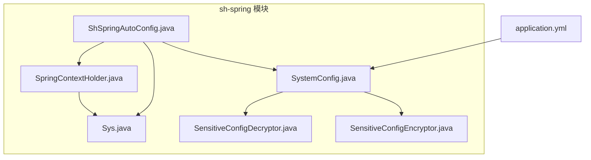
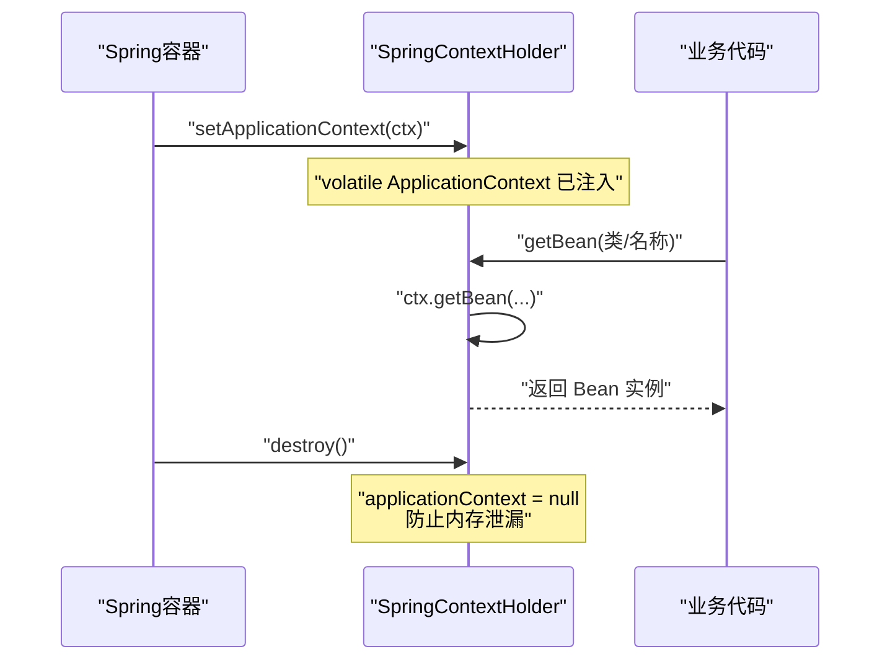
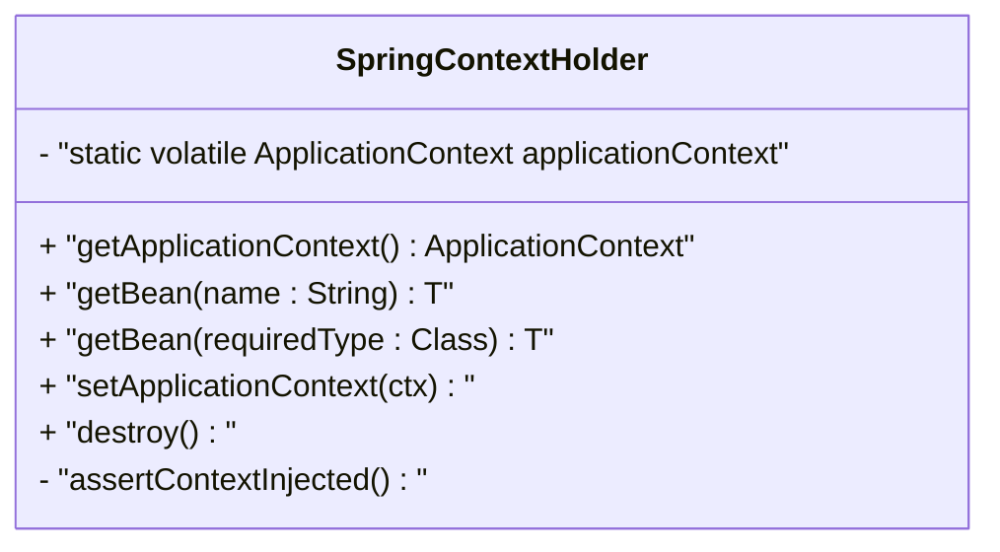
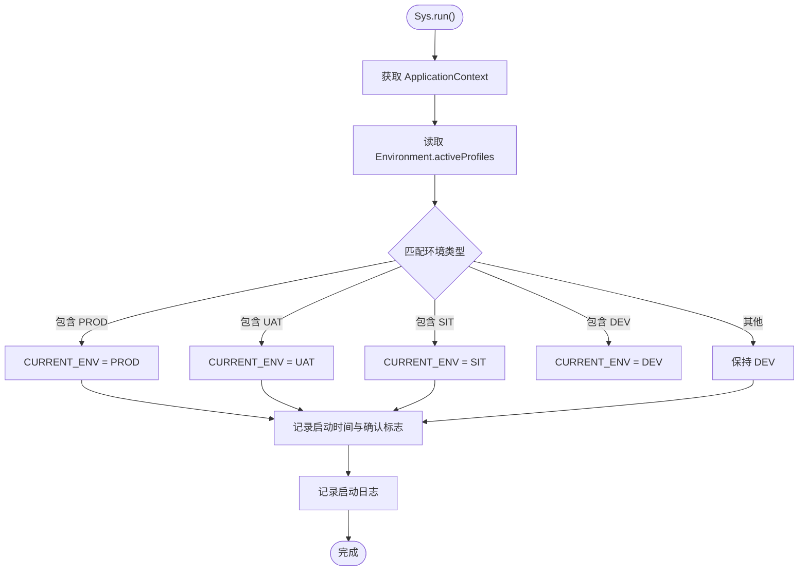
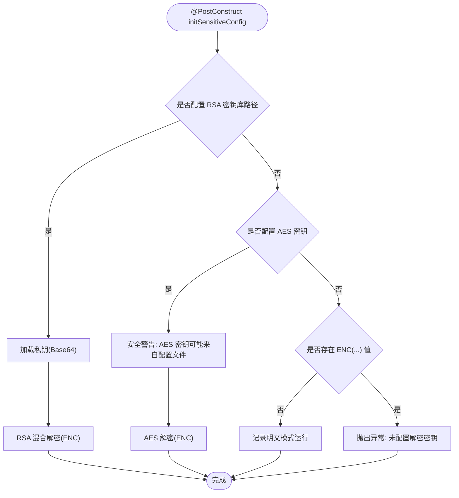
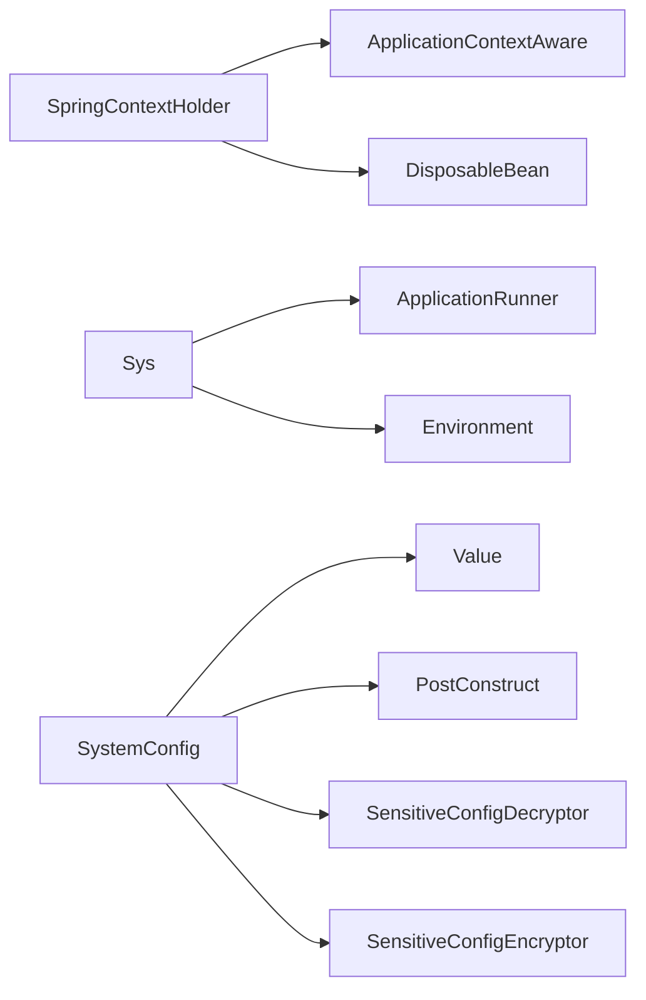

# Spring上下文全局持有器

<cite>
**本文引用的文件**
- [SpringContextHolder.java](file://sh-spring/src/main/java/com/wkclz/spring/config/SpringContextHolder.java)
- [Sys.java](file://sh-spring/src/main/java/com/wkclz/spring/config/Sys.java)
- [SystemConfig.java](file://sh-spring/src/main/java/com/wkclz/spring/config/SystemConfig.java)
- [SensitiveConfigDecryptor.java](file://sh-spring/src/main/java/com/wkclz/spring/config/SensitiveConfigDecryptor.java)
- [SensitiveConfigEncryptor.java](file://sh-spring/src/main/java/com/wkclz/spring/config/SensitiveConfigEncryptor.java)
- [ShSpringAutoConfig.java](file://sh-spring/src/main/java/com/wkclz/spring/ShSpringAutoConfig.java)
- [US-022-Spring上下文全局持有器.md](file://docs/stories/US-022-Spring上下文全局持有器.md)
- [application.yml](file://sh-demo/src/main/resources/config/application.yml)
</cite>

## 目录
1. [简介](#简介)
2. [项目结构](#项目结构)
3. [核心组件](#核心组件)
4. [架构总览](#架构总览)
5. [组件详解](#组件详解)
6. [依赖关系分析](#依赖关系分析)
7. [性能考量](#性能考量)
8. [故障排查指南](#故障排查指南)
9. [结论](#结论)
10. [附录](#附录)

## 简介
本技术文档围绕 Spring 上下文全局持有器展开，系统性解析 SpringContextHolder 的设计与实现，涵盖：
- ApplicationContext 的静态持有机制
- Bean 的动态获取方法
- 应用上下文生命周期管理
- 如何解决 Spring 容器中 Bean 无法通过静态方法直接获取的问题（初始化时机、线程安全性、内存泄漏防护）
- Sys 配置类的作用与使用场景（系统属性统一管理、环境变量处理）
- SystemConfig 的敏感配置解密与密钥管理模式
- 使用示例与最佳实践
- 常见问题排查与性能优化建议

## 项目结构
本专题涉及的核心模块位于 sh-spring，关键文件如下：
- SpringContextHolder：全局持有 ApplicationContext 并提供静态获取 Bean 的能力
- Sys：应用启动后执行一次，负责环境初始化与系统启动状态标记
- SystemConfig：系统配置类，支持敏感配置的加密存储与自动解密
- SensitiveConfigDecryptor / SensitiveConfigEncryptor：敏感配置解密/加密工具
- ShSpringAutoConfig：自动装配入口，启用组件扫描

**图表来源**
- [SpringContextHolder.java:1-64](file://sh-spring/src/main/java/com/wkclz/spring/config/SpringContextHolder.java#L1-L64)
- [Sys.java:1-99](file://sh-spring/src/main/java/com/wkclz/spring/config/Sys.java#L1-L99)
- [SystemConfig.java:1-140](file://sh-spring/src/main/java/com/wkclz/spring/config/SystemConfig.java#L1-L140)
- [SensitiveConfigDecryptor.java:1-90](file://sh-spring/src/main/java/com/wkclz/spring/config/SensitiveConfigDecryptor.java#L1-L90)
- [SensitiveConfigEncryptor.java:1-287](file://sh-spring/src/main/java/com/wkclz/spring/config/SensitiveConfigEncryptor.java#L1-L287)
- [ShSpringAutoConfig.java:1-13](file://sh-spring/src/main/java/com/wkclz/spring/ShSpringAutoConfig.java#L1-L13)
- [application.yml:1-26](file://sh-demo/src/main/resources/config/application.yml#L1-L26)

**章节来源**
- [ShSpringAutoConfig.java:1-13](file://sh-spring/src/main/java/com/wkclz/spring/ShSpringAutoConfig.java#L1-L13)
- [application.yml:1-26](file://sh-demo/src/main/resources/config/application.yml#L1-L26)

## 核心组件
- SpringContextHolder：实现 ApplicationContextAware 与 DisposableBean，提供静态方法获取 ApplicationContext 与 Bean；通过 volatile 字段确保多线程可见性；在容器销毁时清空静态引用，避免内存泄漏。
- Sys：实现 ApplicationRunner，在应用启动完成后读取环境信息、设置当前环境类型与启动时间，并提供系统启动确认标志。
- SystemConfig：基于 @Configuration 的配置类，支持敏感配置的多种解密模式（RSA 混合、AES 对称、明文），并在 @PostConstruct 中完成解密与校验。
- SensitiveConfigDecryptor / SensitiveConfigEncryptor：提供敏感配置解密与加密工具，支持混合加密格式与密钥库管理。

**章节来源**
- [SpringContextHolder.java:1-64](file://sh-spring/src/main/java/com/wkclz/spring/config/SpringContextHolder.java#L1-L64)
- [Sys.java:1-99](file://sh-spring/src/main/java/com/wkclz/spring/config/Sys.java#L1-L99)
- [SystemConfig.java:1-140](file://sh-spring/src/main/java/com/wkclz/spring/config/SystemConfig.java#L1-L140)
- [SensitiveConfigDecryptor.java:1-90](file://sh-spring/src/main/java/com/wkclz/spring/config/SensitiveConfigDecryptor.java#L1-L90)
- [SensitiveConfigEncryptor.java:1-287](file://sh-spring/src/main/java/com/wkclz/spring/config/SensitiveConfigEncryptor.java#L1-L287)

## 架构总览
SpringContextHolder 作为全局持有器，贯穿应用生命周期：
- 启动阶段：Spring 容器回调 setApplicationContext，将 ApplicationContext 注入静态字段
- 运行阶段：任意静态方法或非 Spring 管理类可通过静态方法获取 Bean
- 关闭阶段：Spring 容器回调 destroy，清空静态引用，防止内存泄漏

**图表来源**
- [SpringContextHolder.java:1-64](file://sh-spring/src/main/java/com/wkclz/spring/config/SpringContextHolder.java#L1-L64)
- [US-022-Spring上下文全局持有器.md:1-40](file://docs/stories/US-022-Spring上下文全局持有器.md#L1-L40)

## 组件详解

### SpringContextHolder 设计与实现
- 静态持有机制
  - 使用 volatile 修饰的静态 ApplicationContext 字段，确保多线程可见性与有序写入
  - 提供 getApplicationContext()、getBean(String)、getBean(Class) 三种静态获取方式
- 生命周期管理
  - 实现 ApplicationContextAware：在容器启动时注入 ApplicationContext
  - 实现 DisposableBean：在容器关闭时将静态引用置空，避免内存泄漏
- 线程安全性
  - volatile 保障静态字段的可见性
  - 方法内无共享可变状态，避免竞态条件
- 异常处理
  - assertContextInjected 在未注入时抛出明确异常，提示需在配置中定义持有器

**图表来源**
- [SpringContextHolder.java:1-64](file://sh-spring/src/main/java/com/wkclz/spring/config/SpringContextHolder.java#L1-L64)

**章节来源**
- [SpringContextHolder.java:1-64](file://sh-spring/src/main/java/com/wkclz/spring/config/SpringContextHolder.java#L1-L64)
- [US-022-Spring上下文全局持有器.md:1-40](file://docs/stories/US-022-Spring上下文全局持有器.md#L1-L40)

### Sys 配置类：系统属性与环境变量管理
- 角色定位
  - ApplicationRunner：应用启动后执行一次，完成环境初始化
- 功能要点
  - 读取 Environment 的 activeProfiles，映射为 EnvType（DEV/UAT/SIT/PROD）
  - 记录系统启动时间与启动确认标志
  - 通过 SpringContextHolder 获取 ApplicationContext，间接验证持有器可用性
- 使用场景
  - 全局环境判断、日志输出、系统监控等

**图表来源**
- [Sys.java:1-99](file://sh-spring/src/main/java/com/wkclz/spring/config/Sys.java#L1-L99)

**章节来源**
- [Sys.java:1-99](file://sh-spring/src/main/java/com/wkclz/spring/config/Sys.java#L1-L99)

### SystemConfig：敏感配置解密与密钥管理
- 设计目标
  - 统一系统配置管理，支持敏感配置加密存储与自动解密
  - 提供多种解密模式：RSA 混合、AES 对称、明文（开发环境）
- 关键特性
  - RSA 模式：私钥存于 PKCS12 密钥库，密钥库密码通过环境变量注入
  - AES 模式：对称密钥通过环境变量注入，提供安全警告
  - 明文模式：未配置解密密钥且存在 ENC(...) 时抛出异常
- 初始化流程
  - @PostConstruct 中根据配置选择解密模式并解密敏感值
  - 安全性检查：AES 密钥来源检测，避免配置文件泄露风险

**图表来源**
- [SystemConfig.java:1-140](file://sh-spring/src/main/java/com/wkclz/spring/config/SystemConfig.java#L1-L140)
- [SensitiveConfigDecryptor.java:1-90](file://sh-spring/src/main/java/com/wkclz/spring/config/SensitiveConfigDecryptor.java#L1-L90)
- [SensitiveConfigEncryptor.java:1-287](file://sh-spring/src/main/java/com/wkclz/spring/config/SensitiveConfigEncryptor.java#L1-L287)

**章节来源**
- [SystemConfig.java:1-140](file://sh-spring/src/main/java/com/wkclz/spring/config/SystemConfig.java#L1-L140)
- [SensitiveConfigDecryptor.java:1-90](file://sh-spring/src/main/java/com/wkclz/spring/config/SensitiveConfigDecryptor.java#L1-L90)
- [SensitiveConfigEncryptor.java:1-287](file://sh-spring/src/main/java/com/wkclz/spring/config/SensitiveConfigEncryptor.java#L1-L287)

### ShSpringAutoConfig：自动装配入口
- 作用
  - 通过 @AutoConfiguration 与 @ComponentScan 启用 sh-spring 包下的组件扫描
- 影响
  - SpringContextHolder、Sys、SystemConfig 等组件被自动注册为 Bean

**章节来源**
- [ShSpringAutoConfig.java:1-13](file://sh-spring/src/main/java/com/wkclz/spring/ShSpringAutoConfig.java#L1-L13)

## 依赖关系分析
- SpringContextHolder 依赖 Spring 容器提供的 ApplicationContextAware 与 DisposableBean 接口
- Sys 依赖 Spring 容器提供的 Environment 与 ApplicationContext
- SystemConfig 依赖 Spring 容器提供的 @Value 注入与 @PostConstruct 初始化
- SensitiveConfigDecryptor/Encryptor 依赖工具类与第三方库（如 RSA/AES 工具）

**图表来源**
- [SpringContextHolder.java:1-64](file://sh-spring/src/main/java/com/wkclz/spring/config/SpringContextHolder.java#L1-L64)
- [Sys.java:1-99](file://sh-spring/src/main/java/com/wkclz/spring/config/Sys.java#L1-L99)
- [SystemConfig.java:1-140](file://sh-spring/src/main/java/com/wkclz/spring/config/SystemConfig.java#L1-L140)
- [SensitiveConfigDecryptor.java:1-90](file://sh-spring/src/main/java/com/wkclz/spring/config/SensitiveConfigDecryptor.java#L1-L90)
- [SensitiveConfigEncryptor.java:1-287](file://sh-spring/src/main/java/com/wkclz/spring/config/SensitiveConfigEncryptor.java#L1-L287)

**章节来源**
- [SpringContextHolder.java:1-64](file://sh-spring/src/main/java/com/wkclz/spring/config/SpringContextHolder.java#L1-L64)
- [Sys.java:1-99](file://sh-spring/src/main/java/com/wkclz/spring/config/Sys.java#L1-L99)
- [SystemConfig.java:1-140](file://sh-spring/src/main/java/com/wkclz/spring/config/SystemConfig.java#L1-L140)
- [SensitiveConfigDecryptor.java:1-90](file://sh-spring/src/main/java/com/wkclz/spring/config/SensitiveConfigDecryptor.java#L1-L90)
- [SensitiveConfigEncryptor.java:1-287](file://sh-spring/src/main/java/com/wkclz/spring/config/SensitiveConfigEncryptor.java#L1-L287)

## 性能考量
- 静态获取 Bean 的开销
  - 通过 ApplicationContext 缓存的 Bean 实例进行获取，无反射开销
  - 建议在高频调用场景中复用返回的 Bean 实例，避免重复获取
- 线程安全性
  - volatile 字段保证可见性，方法内无共享可变状态，适合多线程并发访问
- 内存泄漏防护
  - 容器关闭时 destroy 清空静态引用，避免持有器成为 GC Root
- 敏感配置解密
  - 解密仅在初始化阶段执行，后续使用解密后的明文值，避免运行期重复解密

[本节为通用性能建议，无需特定文件引用]

## 故障排查指南
- 问题：调用 getBean 抛出“applicationContext 属性未注入”异常
  - 原因：SpringContextHolder 未被容器注入 ApplicationContext
  - 处理：确认 ShSpringAutoConfig 已生效并启用组件扫描，确保 SpringContextHolder 被注册为 Bean
  - 参考：[SpringContextHolder.java:59-63](file://sh-spring/src/main/java/com/wkclz/spring/config/SpringContextHolder.java#L59-L63)、[ShSpringAutoConfig.java:1-13](file://sh-spring/src/main/java/com/wkclz/spring/ShSpringAutoConfig.java#L1-L13)
- 问题：Sys 无法正确识别环境类型
  - 原因：activeProfiles 未正确设置或大小写不匹配
  - 处理：检查 application.yml 中 spring.profiles.active 配置，确保与 EnvType 枚举一致
  - 参考：[Sys.java:45-78](file://sh-spring/src/main/java/com/wkclz/spring/config/Sys.java#L45-L78)、[application.yml:4-8](file://sh-demo/src/main/resources/config/application.yml#L4-L8)
- 问题：SystemConfig 解密失败或抛出异常
  - 原因：未配置解密密钥却存在 ENC(...) 值；或 AES 密钥来源不安全
  - 处理：按需配置 RSA 密钥库或 AES 密钥，优先通过环境变量注入密钥；检查密钥库路径与别名
  - 参考：[SystemConfig.java:100-137](file://sh-spring/src/main/java/com/wkclz/spring/config/SystemConfig.java#L100-L137)、[SensitiveConfigDecryptor.java:60-88](file://sh-spring/src/main/java/com/wkclz/spring/config/SensitiveConfigDecryptor.java#L60-L88)、[SensitiveConfigEncryptor.java:188-204](file://sh-spring/src/main/java/com/wkclz/spring/config/SensitiveConfigEncryptor.java#L188-L204)

**章节来源**
- [SpringContextHolder.java:59-63](file://sh-spring/src/main/java/com/wkclz/spring/config/SpringContextHolder.java#L59-L63)
- [ShSpringAutoConfig.java:1-13](file://sh-spring/src/main/java/com/wkclz/spring/ShSpringAutoConfig.java#L1-L13)
- [Sys.java:45-78](file://sh-spring/src/main/java/com/wkclz/spring/config/Sys.java#L45-L78)
- [application.yml:4-8](file://sh-demo/src/main/resources/config/application.yml#L4-L8)
- [SystemConfig.java:100-137](file://sh-spring/src/main/java/com/wkclz/spring/config/SystemConfig.java#L100-L137)
- [SensitiveConfigDecryptor.java:60-88](file://sh-spring/src/main/java/com/wkclz/spring/config/SensitiveConfigDecryptor.java#L60-L88)
- [SensitiveConfigEncryptor.java:188-204](file://sh-spring/src/main/java/com/wkclz/spring/config/SensitiveConfigEncryptor.java#L188-L204)

## 结论
SpringContextHolder 通过实现 ApplicationContextAware 与 DisposableBean，提供了在任意位置获取 Spring Bean 的能力，解决了非 Spring 管理类访问容器 Bean 的难题。结合 Sys 与 SystemConfig，系统实现了环境初始化与敏感配置的安全管理。整体设计具备良好的线程安全性与生命周期管理，配合自动装配入口即可无缝集成到 Spring Boot 应用中。

[本节为总结性内容，无需特定文件引用]

## 附录

### 使用示例与最佳实践
- 在非 Spring 管理类中获取 Bean
  - 示例路径：[SpringContextHolder.java:27-38](file://sh-spring/src/main/java/com/wkclz/spring/config/SpringContextHolder.java#L27-L38)
  - 最佳实践：尽量避免在静态方法中频繁获取 Bean，优先通过构造函数注入或方法参数注入
- 在静态方法中调用 Spring 服务
  - 示例路径：[SpringContextHolder.java:18-21](file://sh-spring/src/main/java/com/wkclz/spring/config/SpringContextHolder.java#L18-L21)
  - 最佳实践：确保在容器启动后再调用，避免在静态代码块中过早访问
- 环境与启动信息使用
  - 示例路径：[Sys.java:86-94](file://sh-spring/src/main/java/com/wkclz/spring/config/Sys.java#L86-L94)
  - 最佳实践：通过静态方法读取当前环境与启动时间，避免重复获取 ApplicationContext
- 敏感配置解密
  - 示例路径：[SystemConfig.java:100-121](file://sh-spring/src/main/java/com/wkclz/spring/config/SystemConfig.java#L100-L121)
  - 最佳实践：优先使用 RSA 模式，密钥通过环境变量注入；避免在配置文件中直接存放明文密钥

**章节来源**
- [SpringContextHolder.java:18-38](file://sh-spring/src/main/java/com/wkclz/spring/config/SpringContextHolder.java#L18-L38)
- [Sys.java:86-94](file://sh-spring/src/main/java/com/wkclz/spring/config/Sys.java#L86-L94)
- [SystemConfig.java:100-121](file://sh-spring/src/main/java/com/wkclz/spring/config/SystemConfig.java#L100-L121)