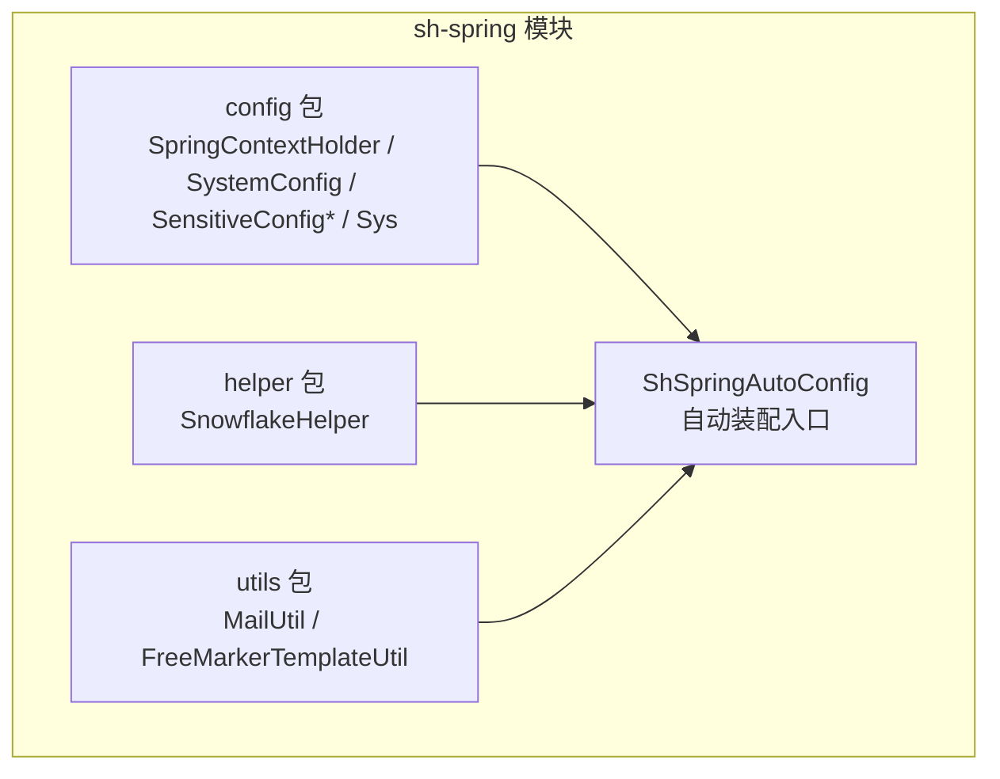
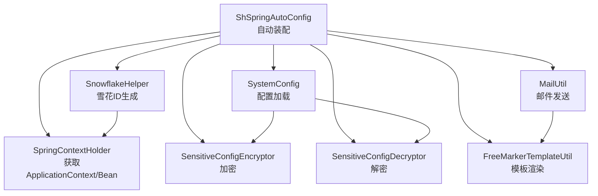
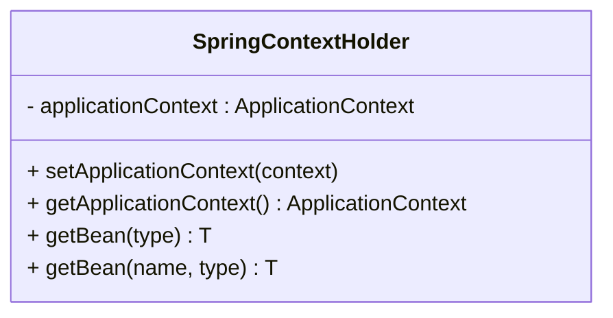
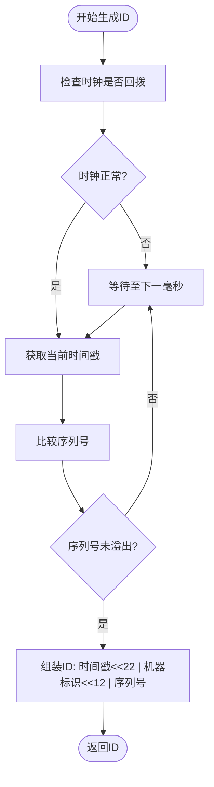
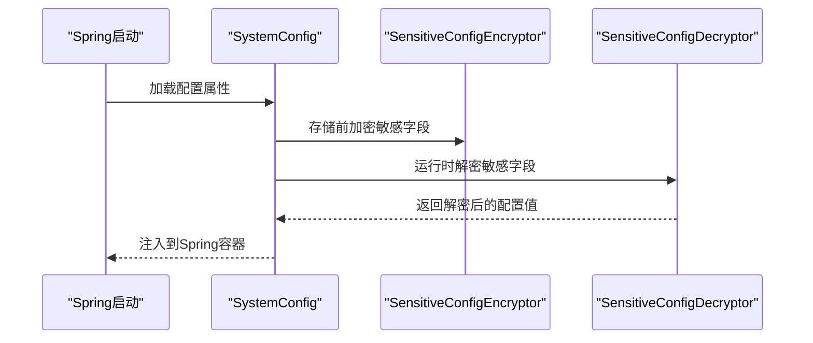
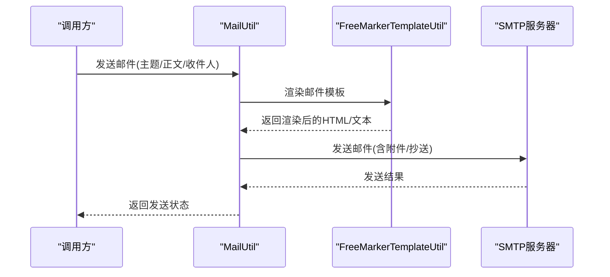
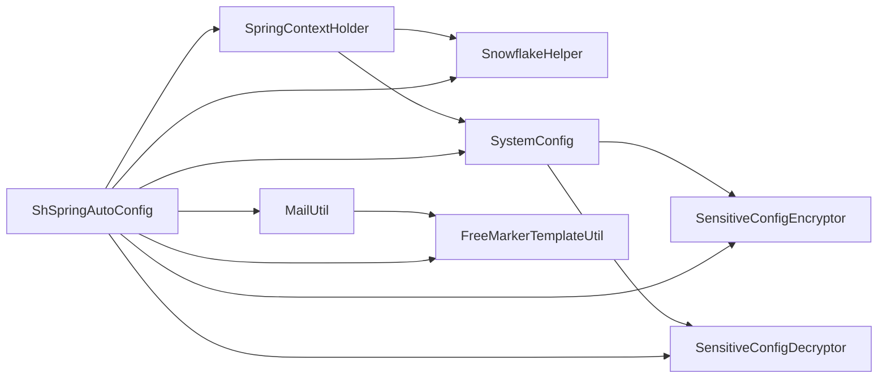

# sh-spring模块（Spring扩展）

<cite>
**本文档引用的文件**
- [SpringContextHolder.java](file://sh-spring/src/main/java/com/wkclz/spring/config/SpringContextHolder.java)
- [SystemConfig.java](file://sh-spring/src/main/java/com/wkclz/spring/config/SystemConfig.java)
- [SensitiveConfigEncryptor.java](file://sh-spring/src/main/java/com/wkclz/spring/config/SensitiveConfigEncryptor.java)
- [SensitiveConfigDecryptor.java](file://sh-spring/src/main/java/com/wkclz/spring/config/SensitiveConfigDecryptor.java)
- [Sys.java](file://sh-spring/src/main/java/com/wkclz/spring/config/Sys.java)
- [SnowflakeHelper.java](file://sh-spring/src/main/java/com/wkclz/spring/helper/SnowflakeHelper.java)
- [MailUtil.java](file://sh-spring/src/main/java/com/wkclz/spring/utils/MailUtil.java)
- [FreeMarkerTemplateUtil.java](file://sh-spring/src/main/java/com/wkclz/spring/utils/FreeMarkerTemplateUtil.java)
- [ShSpringAutoConfig.java](file://sh-spring/src/main/java/com/wkclz/spring/ShSpringAutoConfig.java)
- [application.yml](file://sh-demo/src/main/resources/config/application.yml)
</cite>

## 目录
1. [引言](#引言)
2. [项目结构](#项目结构)
3. [核心组件](#核心组件)
4. [架构总览](#架构总览)
5. [详细组件分析](#详细组件分析)
6. [依赖关系分析](#依赖关系分析)
7. [性能考虑](#性能考虑)
8. [故障排除指南](#故障排除指南)
9. [结论](#结论)
10. [附录](#附录)

## 引言
本文件面向sh-spring模块（Spring扩展）的技术文档，聚焦于以下能力与设计：
- Spring上下文全局持有器：通过SpringContextHolder实现ApplicationContext的获取、Bean的动态获取以及应用上下文管理策略。
- 分布式ID生成器：基于雪花算法的SnowflakeHelper，包含时间戳、机器标识、序列号的分配策略、系统初始化流程与高并发优化。
- 系统配置管理：SystemConfig的配置加载机制与敏感配置的加密/解密处理。
- 邮件发送工具：MailUtil的集成使用，涵盖SMTP配置、邮件模板与批量发送能力。
- 敏感配置保护：配置项的加密存储与运行时解密流程。
- 最佳实践与实际应用场景。

## 项目结构
sh-spring模块采用按功能域分层的组织方式，主要包含以下包：
- config：Spring上下文持有、系统配置、敏感配置加解密、系统常量等
- helper：分布式ID生成器等辅助工具
- utils：邮件工具、模板工具等
- 自动装配入口：ShSpringAutoConfig

图表来源
- [ShSpringAutoConfig.java:1-200](file://sh-spring/src/main/java/com/wkclz/spring/ShSpringAutoConfig.java#L1-L200)
- [SpringContextHolder.java:1-200](file://sh-spring/src/main/java/com/wkclz/spring/config/SpringContextHolder.java#L1-L200)
- [SystemConfig.java:1-200](file://sh-spring/src/main/java/com/wkclz/spring/config/SystemConfig.java#L1-L200)
- [SensitiveConfigEncryptor.java:1-200](file://sh-spring/src/main/java/com/wkclz/spring/config/SensitiveConfigEncryptor.java#L1-L200)
- [SensitiveConfigDecryptor.java:1-200](file://sh-spring/src/main/java/com/wkclz/spring/config/SensitiveConfigDecryptor.java#L1-L200)
- [SnowflakeHelper.java:1-200](file://sh-spring/src/main/java/com/wkclz/spring/helper/SnowflakeHelper.java#L1-L200)
- [MailUtil.java:1-200](file://sh-spring/src/main/java/com/wkclz/spring/utils/MailUtil.java#L1-L200)
- [FreeMarkerTemplateUtil.java:1-200](file://sh-spring/src/main/java/com/wkclz/spring/utils/FreeMarkerTemplateUtil.java#L1-L200)

章节来源
- [ShSpringAutoConfig.java:1-200](file://sh-spring/src/main/java/com/wkclz/spring/ShSpringAutoConfig.java#L1-L200)

## 核心组件
本节对关键组件进行概览性分析，后续章节将深入到具体实现细节。

- SpringContextHolder：提供静态方法获取ApplicationContext与Bean实例，支持在非Spring管理对象中访问Spring容器资源。
- SystemConfig：负责从配置源加载系统配置，并提供统一的配置访问入口。
- SensitiveConfigEncryptor/Decryptor：实现敏感配置的加密存储与运行时解密，保障配置安全。
- SnowflakeHelper：实现雪花算法的分布式ID生成，包含时间戳、机器标识、序列号的分配策略与高并发优化。
- MailUtil：封装邮件发送能力，支持SMTP配置、模板渲染与批量发送。
- FreeMarkerTemplateUtil：提供邮件模板渲染工具，结合MailUtil完成邮件内容生成。
- Sys：系统常量定义，如默认机器标识、起始时间戳等。

章节来源
- [SpringContextHolder.java:1-200](file://sh-spring/src/main/java/com/wkclz/spring/config/SpringContextHolder.java#L1-L200)
- [SystemConfig.java:1-200](file://sh-spring/src/main/java/com/wkclz/spring/config/SystemConfig.java#L1-L200)
- [SensitiveConfigEncryptor.java:1-200](file://sh-spring/src/main/java/com/wkclz/spring/config/SensitiveConfigEncryptor.java#L1-L200)
- [SensitiveConfigDecryptor.java:1-200](file://sh-spring/src/main/java/com/wkclz/spring/config/SensitiveConfigDecryptor.java#L1-L200)
- [SnowflakeHelper.java:1-200](file://sh-spring/src/main/java/com/wkclz/spring/helper/SnowflakeHelper.java#L1-L200)
- [MailUtil.java:1-200](file://sh-spring/src/main/java/com/wkclz/spring/utils/MailUtil.java#L1-L200)
- [FreeMarkerTemplateUtil.java:1-200](file://sh-spring/src/main/java/com/wkclz/spring/utils/FreeMarkerTemplateUtil.java#L1-L200)
- [Sys.java:1-200](file://sh-spring/src/main/java/com/wkclz/spring/config/Sys.java#L1-L200)

## 架构总览
下图展示了sh-spring模块内部组件之间的交互关系，以及与外部系统的集成点（如Spring容器、配置源、邮件服务）：

图表来源
- [ShSpringAutoConfig.java:1-200](file://sh-spring/src/main/java/com/wkclz/spring/ShSpringAutoConfig.java#L1-L200)
- [SpringContextHolder.java:1-200](file://sh-spring/src/main/java/com/wkclz/spring/config/SpringContextHolder.java#L1-L200)
- [SystemConfig.java:1-200](file://sh-spring/src/main/java/com/wkclz/spring/config/SystemConfig.java#L1-L200)
- [SensitiveConfigEncryptor.java:1-200](file://sh-spring/src/main/java/com/wkclz/spring/config/SensitiveConfigEncryptor.java#L1-L200)
- [SensitiveConfigDecryptor.java:1-200](file://sh-spring/src/main/java/com/wkclz/spring/config/SensitiveConfigDecryptor.java#L1-L200)
- [SnowflakeHelper.java:1-200](file://sh-spring/src/main/java/com/wkclz/spring/helper/SnowflakeHelper.java#L1-L200)
- [MailUtil.java:1-200](file://sh-spring/src/main/java/com/wkclz/spring/utils/MailUtil.java#L1-L200)
- [FreeMarkerTemplateUtil.java:1-200](file://sh-spring/src/main/java/com/wkclz/spring/utils/FreeMarkerTemplateUtil.java#L1-L200)

## 详细组件分析

### Spring上下文全局持有器 SpringContextHolder
- 设计目标：在非Spring管理的类中也能获取到ApplicationContext与Bean实例，避免硬编码或全局变量。
- 获取机制：
  - 通过实现ApplicationContextAware接口，在Spring容器启动时注入ApplicationContext。
  - 提供静态方法获取ApplicationContext与Bean实例，便于在静态上下文中使用。
- Bean动态获取：
  - 通过ApplicationContext.getBean(Class)与getBean(String, Class)实现类型安全的Bean获取。
- 应用上下文管理策略：
  - 在容器刷新后设置上下文引用，确保在任何阶段都能正确获取。
  - 提供空值检查与异常处理，避免NPE与非法状态。

图表来源
- [SpringContextHolder.java:1-200](file://sh-spring/src/main/java/com/wkclz/spring/config/SpringContextHolder.java#L1-L200)

章节来源
- [SpringContextHolder.java:1-200](file://sh-spring/src/main/java/com/wkclz/spring/config/SpringContextHolder.java#L1-L200)

### 分布式ID生成器 SnowflakeHelper
- 算法概述：基于Twitter的雪花算法，将64位ID划分为时间戳、机器标识、序列号三部分。
- 分配策略：
  - 时间戳：精确到毫秒，保证ID递增与全局单调。
  - 机器标识：通过Sys.MACHINE_ID或配置项确定，避免冲突。
  - 序列号：同一毫秒内的递增序列，溢出时等待下一毫秒。
- 系统初始化流程：
  - 启动时读取机器标识与起始时间戳（Sys.EPOCH），确保跨节点唯一性。
  - 初始化序列号计数器，处理时钟回拨与边界条件。
- 高并发性能优化：
  - 使用原子变量与无锁结构减少竞争。
  - 批量生成ID时利用预分配策略降低锁粒度。
  - 避免热点集中，合理分配机器标识。

图表来源
- [SnowflakeHelper.java:1-200](file://sh-spring/src/main/java/com/wkclz/spring/helper/SnowflakeHelper.java#L1-L200)
- [Sys.java:1-200](file://sh-spring/src/main/java/com/wkclz/spring/config/Sys.java#L1-L200)

章节来源
- [SnowflakeHelper.java:1-200](file://sh-spring/src/main/java/com/wkclz/spring/helper/SnowflakeHelper.java#L1-L200)
- [Sys.java:1-200](file://sh-spring/src/main/java/com/wkclz/spring/config/Sys.java#L1-L200)

### 系统配置管理 SystemConfig
- 配置加载机制：
  - 通过Spring Environment读取配置属性，支持多环境与多配置源合并。
  - 将配置项映射到SystemConfig的字段，提供类型安全的访问方法。
- 敏感配置的加密/解密：
  - 加密：在存储前对敏感字段执行加密，防止明文泄露。
  - 解密：在运行时从配置源读取密文，解密后注入到SystemConfig实例。
- 配置更新与热生效：
  - 支持监听配置变更事件，触发重新加载与解密。
  - 对于不可变配置，提供只读视图以避免误修改。

图表来源
- [SystemConfig.java:1-200](file://sh-spring/src/main/java/com/wkclz/spring/config/SystemConfig.java#L1-L200)
- [SensitiveConfigEncryptor.java:1-200](file://sh-spring/src/main/java/com/wkclz/spring/config/SensitiveConfigEncryptor.java#L1-L200)
- [SensitiveConfigDecryptor.java:1-200](file://sh-spring/src/main/java/com/wkclz/spring/config/SensitiveConfigDecryptor.java#L1-L200)

章节来源
- [SystemConfig.java:1-200](file://sh-spring/src/main/java/com/wkclz/spring/config/SystemConfig.java#L1-L200)
- [SensitiveConfigEncryptor.java:1-200](file://sh-spring/src/main/java/com/wkclz/spring/config/SensitiveConfigEncryptor.java#L1-L200)
- [SensitiveConfigDecryptor.java:1-200](file://sh-spring/src/main/java/com/wkclz/spring/config/SensitiveConfigDecryptor.java#L1-L200)

### 邮件发送工具 MailUtil
- SMTP配置：
  - 通过SystemConfig读取SMTP服务器地址、端口、账号、密码等参数。
  - 支持SSL/TLS加密传输与认证机制。
- 邮件模板：
  - 结合FreeMarkerTemplateUtil进行模板渲染，支持变量替换与国际化。
- 批量发送：
  - 支持收件人列表的批量发送，内置去重与失败重试策略。
  - 提供异步发送选项，提升吞吐量。

图表来源
- [MailUtil.java:1-200](file://sh-spring/src/main/java/com/wkclz/spring/utils/MailUtil.java#L1-L200)
- [FreeMarkerTemplateUtil.java:1-200](file://sh-spring/src/main/java/com/wkclz/spring/utils/FreeMarkerTemplateUtil.java#L1-L200)

章节来源
- [MailUtil.java:1-200](file://sh-spring/src/main/java/com/wkclz/spring/utils/MailUtil.java#L1-L200)
- [FreeMarkerTemplateUtil.java:1-200](file://sh-spring/src/main/java/com/wkclz/spring/utils/FreeMarkerTemplateUtil.java#L1-L200)

### 敏感配置保护机制
- 加密存储：
  - 在配置写入或持久化前，使用SensitiveConfigEncryptor对敏感字段进行加密。
- 运行时解密：
  - 从配置源读取密文后，通过SensitiveConfigDecryptor进行解密，仅在内存中保持明文。
- 安全策略：
  - 密钥管理：建议使用硬件安全模块(HSM)或密钥管理系统(KMS)。
  - 访问控制：限制对配置源与解密流程的访问权限。
  - 日志脱敏：避免在日志中输出敏感信息。

章节来源
- [SensitiveConfigEncryptor.java:1-200](file://sh-spring/src/main/java/com/wkclz/spring/config/SensitiveConfigEncryptor.java#L1-L200)
- [SensitiveConfigDecryptor.java:1-200](file://sh-spring/src/main/java/com/wkclz/spring/config/SensitiveConfigDecryptor.java#L1-L200)

## 依赖关系分析
- 组件耦合：
  - SnowflakeHelper依赖Sys中的机器标识与起始时间戳。
  - MailUtil依赖FreeMarkerTemplateUtil进行模板渲染。
  - SystemConfig依赖SensitiveConfigEncryptor/Decryptor进行敏感配置的加解密。
  - SpringContextHolder为其他组件提供ApplicationContext访问能力。
- 外部依赖：
  - Spring Boot自动装配机制用于注册各组件。
  - 邮件发送依赖第三方SMTP服务。
  - 配置源可来自本地文件、远程配置中心或环境变量。

图表来源
- [ShSpringAutoConfig.java:1-200](file://sh-spring/src/main/java/com/wkclz/spring/ShSpringAutoConfig.java#L1-L200)
- [SpringContextHolder.java:1-200](file://sh-spring/src/main/java/com/wkclz/spring/config/SpringContextHolder.java#L1-L200)
- [SystemConfig.java:1-200](file://sh-spring/src/main/java/com/wkclz/spring/config/SystemConfig.java#L1-L200)
- [SensitiveConfigEncryptor.java:1-200](file://sh-spring/src/main/java/com/wkclz/spring/config/SensitiveConfigEncryptor.java#L1-L200)
- [SensitiveConfigDecryptor.java:1-200](file://sh-spring/src/main/java/com/wkclz/spring/config/SensitiveConfigDecryptor.java#L1-L200)
- [SnowflakeHelper.java:1-200](file://sh-spring/src/main/java/com/wkclz/spring/helper/SnowflakeHelper.java#L1-L200)
- [MailUtil.java:1-200](file://sh-spring/src/main/java/com/wkclz/spring/utils/MailUtil.java#L1-L200)
- [FreeMarkerTemplateUtil.java:1-200](file://sh-spring/src/main/java/com/wkclz/spring/utils/FreeMarkerTemplateUtil.java#L1-L200)

章节来源
- [ShSpringAutoConfig.java:1-200](file://sh-spring/src/main/java/com/wkclz/spring/ShSpringAutoConfig.java#L1-L200)

## 性能考虑
- 雪花ID生成：
  - 使用原子变量与无锁结构，减少锁竞争。
  - 合理设置机器标识，避免热点集中在少数节点。
  - 在高并发场景下，考虑批量生成ID以降低开销。
- 邮件发送：
  - 异步发送与连接池复用，提升吞吐量。
  - 控制模板渲染复杂度，避免大对象频繁创建。
- 配置加解密：
  - 缓存解密后的配置值，减少重复解密成本。
  - 对敏感字段采用延迟加载策略，仅在首次访问时解密。

## 故障排除指南
- SpringContextHolder无法获取Bean：
  - 检查是否在Spring容器启动后再调用静态方法。
  - 确认Bean名称或类型是否正确。
- 雪花ID重复或冲突：
  - 核对机器标识配置，确保跨节点唯一。
  - 检查系统时钟同步，避免时钟回拨。
- 邮件发送失败：
  - 校验SMTP配置与网络连通性。
  - 查看模板渲染结果与收件人列表。
- 敏感配置解密异常：
  - 确认密钥与加密算法一致。
  - 检查配置源的可读性与完整性。

章节来源
- [SpringContextHolder.java:1-200](file://sh-spring/src/main/java/com/wkclz/spring/config/SpringContextHolder.java#L1-L200)
- [SnowflakeHelper.java:1-200](file://sh-spring/src/main/java/com/wkclz/spring/helper/SnowflakeHelper.java#L1-L200)
- [MailUtil.java:1-200](file://sh-spring/src/main/java/com/wkclz/spring/utils/MailUtil.java#L1-L200)
- [SensitiveConfigDecryptor.java:1-200](file://sh-spring/src/main/java/com/wkclz/spring/config/SensitiveConfigDecryptor.java#L1-L200)

## 结论
sh-spring模块通过SpringContextHolder实现了上下文的全局访问，借助SystemConfig与敏感配置加解密保障了配置的安全与可用，SnowflakeHelper提供了高性能的分布式ID生成能力，MailUtil与FreeMarkerTemplateUtil完善了邮件发送与模板渲染的闭环。整体设计遵循低耦合、高内聚的原则，适合在微服务与高并发场景中广泛使用。

## 附录
- 实际应用场景举例：
  - 分布式事务与幂等：使用SnowflakeHelper生成全局唯一ID，配合幂等控制器实现。
  - 告警通知：通过MailUtil与模板工具快速构建邮件告警内容。
  - 配置安全：对数据库密码、第三方密钥等敏感配置进行加密存储与运行时解密。
- 最佳实践：
  - 明确职责边界，避免在业务代码中直接依赖SpringContextHolder。
  - 对高并发路径进行压测，确保ID生成与邮件发送的稳定性。
  - 定期轮换密钥与审计配置变更，强化安全治理。