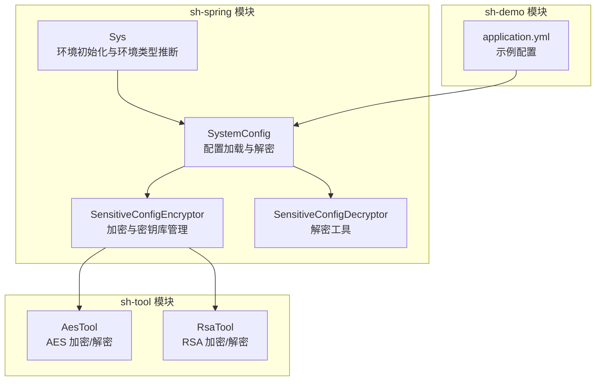
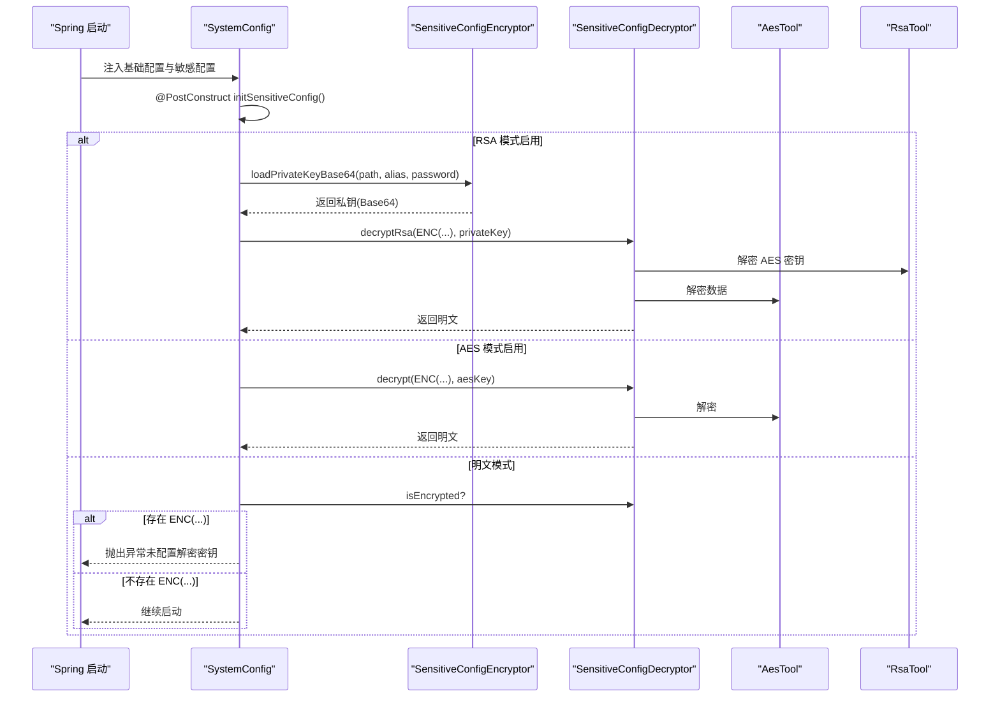
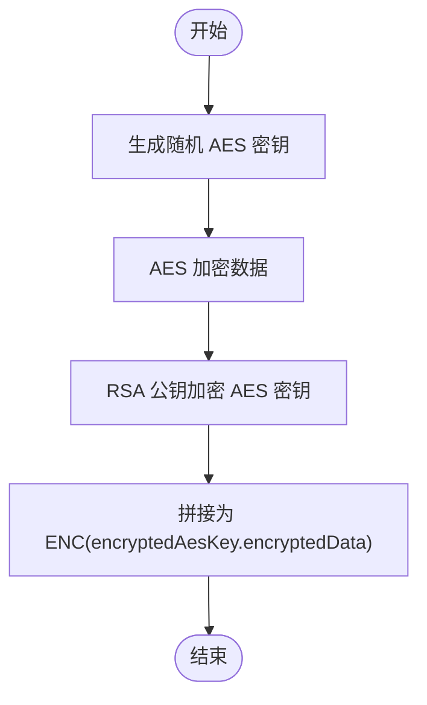
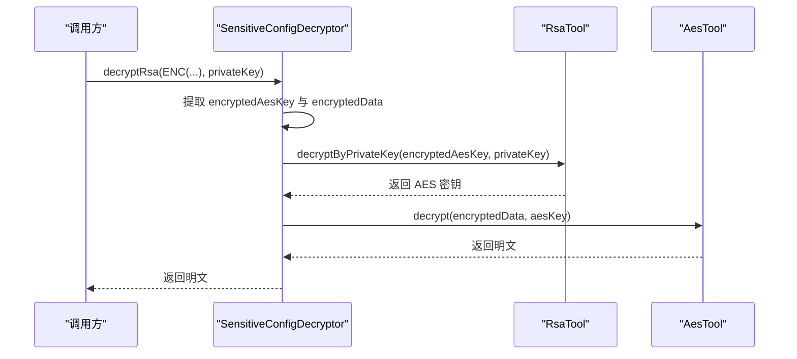
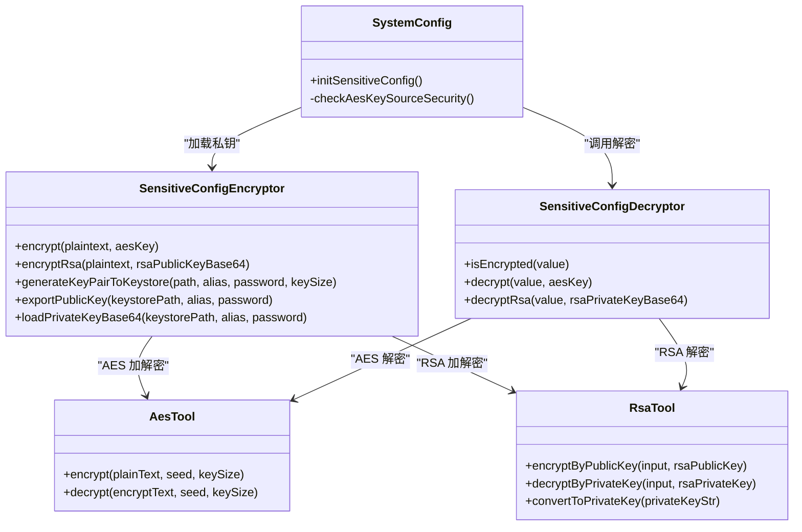

# 系统配置管理

<cite>
**本文引用的文件**
- [SystemConfig.java](file://sh-spring/src/main/java/com/wkclz/spring/config/SystemConfig.java)
- [SensitiveConfigEncryptor.java](file://sh-spring/src/main/java/com/wkclz/spring/config/SensitiveConfigEncryptor.java)
- [SensitiveConfigDecryptor.java](file://sh-spring/src/main/java/com/wkclz/spring/config/SensitiveConfigDecryptor.java)
- [AesTool.java](file://sh-tool/src/main/java/com/wkclz/tool/tools/AesTool.java)
- [RsaTool.java](file://sh-tool/src/main/java/com/wkclz/tool/tools/RsaTool.java)
- [application.yml](file://sh-demo/src/main/resources/config/application.yml)
- [AGENTS.md](file://AGENTS.md)
- [EnvType.java](file://sh-core/src/main/java/com/wkclz/core/enums/EnvType.java)
- [Sys.java](file://sh-spring/src/main/java/com/wkclz/spring/config/Sys.java)
- [risk-analysis.md](file://docs/risk-analysis.md)
</cite>

## 目录
1. [简介](#简介)
2. [项目结构](#项目结构)
3. [核心组件](#核心组件)
4. [架构总览](#架构总览)
5. [详细组件分析](#详细组件分析)
6. [依赖关系分析](#依赖关系分析)
7. [性能考虑](#性能考虑)
8. [故障排查指南](#故障排查指南)
9. [结论](#结论)
10. [附录](#附录)

## 简介
本文件围绕系统配置管理功能进行深入文档化，重点涵盖以下方面：
- SystemConfig 的配置加载机制：配置文件优先级、环境变量覆盖规则、默认值处理
- 敏感配置保护机制：SensitiveConfigEncryptor 的加密算法、密钥管理、加密配置存储格式；SensitiveConfigDecryptor 的解密流程、运行时解密性能优化与密钥轮换安全策略
- 配置管理最佳实践：配置项分类管理、配置变更的热更新机制、配置验证实现方法
- 具体配置示例与使用场景：在生产、测试、开发环境中的差异化配置管理
- 安全性、性能优化与故障排查相关内容

## 项目结构
本项目采用模块化组织，配置管理相关能力集中在 sh-spring 模块，加密工具位于 sh-tool 模块，环境枚举与系统初始化位于 sh-core 与 sh-spring 模块。

图表来源
- [SystemConfig.java:1-140](file://sh-spring/src/main/java/com/wkclz/spring/config/SystemConfig.java#L1-L140)
- [SensitiveConfigEncryptor.java:1-287](file://sh-spring/src/main/java/com/wkclz/spring/config/SensitiveConfigEncryptor.java#L1-L287)
- [SensitiveConfigDecryptor.java:1-90](file://sh-spring/src/main/java/com/wkclz/spring/config/SensitiveConfigDecryptor.java#L1-L90)
- [AesTool.java:1-92](file://sh-tool/src/main/java/com/wkclz/tool/tools/AesTool.java#L1-L92)
- [RsaTool.java:1-127](file://sh-tool/src/main/java/com/wkclz/tool/tools/RsaTool.java#L1-L127)
- [application.yml:1-26](file://sh-demo/src/main/resources/config/application.yml#L1-L26)

章节来源
- [SystemConfig.java:1-140](file://sh-spring/src/main/java/com/wkclz/spring/config/SystemConfig.java#L1-L140)
- [SensitiveConfigEncryptor.java:1-287](file://sh-spring/src/main/java/com/wkclz/spring/config/SensitiveConfigEncryptor.java#L1-L287)
- [SensitiveConfigDecryptor.java:1-90](file://sh-spring/src/main/java/com/wkclz/spring/config/SensitiveConfigDecryptor.java#L1-L90)
- [AesTool.java:1-92](file://sh-tool/src/main/java/com/wkclz/tool/tools/AesTool.java#L1-L92)
- [RsaTool.java:1-127](file://sh-tool/src/main/java/com/wkclz/tool/tools/RsaTool.java#L1-L127)
- [application.yml:1-26](file://sh-demo/src/main/resources/config/application.yml#L1-L26)

## 核心组件
- SystemConfig：负责加载系统配置，支持敏感配置的运行时解密，提供 RSA 模式、AES 模式与明文模式三种解密路径，并在启动阶段完成敏感配置的解密与安全检测。
- SensitiveConfigEncryptor：提供 AES 与 RSA 混合加密能力，支持生成密钥对并导入 PKCS12 密钥库、导出公钥、从密钥库加载私钥等密钥库管理功能。
- SensitiveConfigDecryptor：提供 AES 对称解密与 RSA 混合解密能力，识别 ENC(...) 格式的加密值并执行相应解密流程。
- AesTool 与 RsaTool：底层加解密工具，分别封装 AES 与 RSA 的加密/解密逻辑，供加密器与解密器调用。

章节来源
- [SystemConfig.java:42-140](file://sh-spring/src/main/java/com/wkclz/spring/config/SystemConfig.java#L42-L140)
- [SensitiveConfigEncryptor.java:44-287](file://sh-spring/src/main/java/com/wkclz/spring/config/SensitiveConfigEncryptor.java#L44-L287)
- [SensitiveConfigDecryptor.java:17-90](file://sh-spring/src/main/java/com/wkclz/spring/config/SensitiveConfigDecryptor.java#L17-L90)
- [AesTool.java:11-92](file://sh-tool/src/main/java/com/wkclz/tool/tools/AesTool.java#L11-L92)
- [RsaTool.java:13-127](file://sh-tool/src/main/java/com/wkclz/tool/tools/RsaTool.java#L13-L127)

## 架构总览
系统配置管理的整体流程如下：
- 启动阶段：SystemConfig 通过 @Value 注入基础配置与敏感配置（明文或 ENC(...) 格式）
- 解密阶段：根据配置选择解密模式
  - RSA 模式：从 PKCS12 密钥库加载私钥，使用混合解密流程解密
  - AES 模式：直接使用对称密钥解密
  - 明文模式：若检测到 ENC(...) 则抛出异常，否则保持明文
- 运行阶段：解密后的敏感配置可用于业务逻辑

图表来源
- [SystemConfig.java:99-121](file://sh-spring/src/main/java/com/wkclz/spring/config/SystemConfig.java#L99-L121)
- [SensitiveConfigEncryptor.java:188-204](file://sh-spring/src/main/java/com/wkclz/spring/config/SensitiveConfigEncryptor.java#L188-L204)
- [SensitiveConfigDecryptor.java:60-88](file://sh-spring/src/main/java/com/wkclz/spring/config/SensitiveConfigDecryptor.java#L60-L88)
- [AesTool.java:42-57](file://sh-tool/src/main/java/com/wkclz/tool/tools/AesTool.java#L42-L57)
- [RsaTool.java:66-70](file://sh-tool/src/main/java/com/wkclz/tool/tools/RsaTool.java#L66-L70)

## 详细组件分析

### SystemConfig 配置加载机制
- 配置文件优先级与环境变量覆盖
  - 密钥库路径与别名：通过 sh.config.keystore.path 与 sh.config.keystore.alias 注入
  - 密钥库密码：优先从环境变量 SH_CONFIG_KEYSTORE_PASSWORD 注入，若未设置则回退到 sh.config.keystore.password
  - AES 解密密钥：优先从环境变量 SH_CONFIG_DECRYPT_AES_KEY 注入，若未设置则回退到 sh.config.decrypt-aes-key
  - 通用配置：spring.application.name 与 spring.profiles.active 提供应用名与活动 Profile
- 默认值处理
  - 所有敏感配置与密钥相关字段均允许为空，以便在明文模式下运行
  - 通用配置提供合理默认值（如应用名为 APP，活动 Profile 为 dev）
- 启动时初始化与解密
  - @PostConstruct 在容器初始化完成后执行
  - 根据是否存在密钥库路径决定解密模式
  - 若启用 AES 模式，会检测密钥来源安全性（建议通过环境变量注入）

章节来源
- [SystemConfig.java:53-81](file://sh-spring/src/main/java/com/wkclz/spring/config/SystemConfig.java#L53-L81)
- [SystemConfig.java:99-137](file://sh-spring/src/main/java/com/wkclz/spring/config/SystemConfig.java#L99-L137)

### 敏感配置保护机制

#### 加密算法与密钥管理
- AES 模式
  - 使用 AesTool 执行对称加密，返回 ENC(密文) 格式
  - 密钥来源建议通过环境变量注入，避免与密文同处一文件
- RSA 混合加密（推荐）
  - 生成随机 AES 密钥，使用 AES 加密数据
  - 使用 RSA 公钥加密 AES 密钥，拼接为 ENC(encryptedAesKey.encryptedData)
  - 密钥库采用 PKCS12，私钥保存在密钥库中，密钥库密码通过环境变量注入
- 密钥库管理
  - 生成密钥对并导入 PKCS12 密钥库
  - 从密钥库导出公钥用于加密配置值
  - 从密钥库加载私钥（Base64 编码）用于解密

图表来源
- [SensitiveConfigEncryptor.java:79-97](file://sh-spring/src/main/java/com/wkclz/spring/config/SensitiveConfigEncryptor.java#L79-L97)

章节来源
- [SensitiveConfigEncryptor.java:57-97](file://sh-spring/src/main/java/com/wkclz/spring/config/SensitiveConfigEncryptor.java#L57-L97)
- [SensitiveConfigEncryptor.java:109-152](file://sh-spring/src/main/java/com/wkclz/spring/config/SensitiveConfigEncryptor.java#L109-L152)
- [SensitiveConfigEncryptor.java:162-178](file://sh-spring/src/main/java/com/wkclz/spring/config/SensitiveConfigEncryptor.java#L162-L178)
- [SensitiveConfigEncryptor.java:188-204](file://sh-spring/src/main/java/com/wkclz/spring/config/SensitiveConfigEncryptor.java#L188-L204)

#### 解密流程与性能优化
- AES 解密
  - 识别 ENC(...) 格式，提取密文并使用 AesTool 解密
- RSA 混合解密
  - 识别 ENC(...) 格式，拆分为 encryptedAesKey 与 encryptedData
  - 使用 RSA 私钥解密 AES 密钥，再使用 AES 密钥解密数据
- 性能优化建议
  - 将敏感配置解密延迟至首次访问或按需解密，减少启动时开销
  - 对频繁使用的解密结果进行短期缓存（注意缓存生命周期与失效策略）
  - 在高并发场景下，确保密钥库访问与解密操作的线程安全
- 密钥轮换安全策略
  - 新旧密钥并行期：同时支持新旧密钥解密，逐步替换配置值
  - 密钥轮换后：清理旧密钥库或禁用旧别名，确保只保留当前有效密钥
  - 密钥库权限最小化：限制密钥库文件的访问权限，仅授予必要进程

图表来源
- [SensitiveConfigDecryptor.java:60-88](file://sh-spring/src/main/java/com/wkclz/spring/config/SensitiveConfigDecryptor.java#L60-L88)
- [RsaTool.java:66-70](file://sh-tool/src/main/java/com/wkclz/tool/tools/RsaTool.java#L66-L70)
- [AesTool.java:42-57](file://sh-tool/src/main/java/com/wkclz/tool/tools/AesTool.java#L42-L57)

章节来源
- [SensitiveConfigDecryptor.java:33-49](file://sh-spring/src/main/java/com/wkclz/spring/config/SensitiveConfigDecryptor.java#L33-L49)
- [SensitiveConfigDecryptor.java:60-88](file://sh-spring/src/main/java/com/wkclz/spring/config/SensitiveConfigDecryptor.java#L60-L88)

### 配置项分类管理与热更新
- 配置项分类
  - 基础配置：应用名、活动 Profile
  - 敏感配置：告警邮箱密码等
  - 加密配置：使用 ENC(...) 包裹的密文
- 热更新机制
  - 当前实现为启动时一次性解密，不支持运行时热更新
  - 如需热更新，可在业务层引入配置监听与刷新策略（例如基于事件或轮询机制），并在刷新时重新解密敏感配置
- 配置验证
  - 启动阶段检测敏感配置是否为 ENC(...) 格式且未配置解密密钥时抛出异常
  - AES 模式下检测密钥来源安全性，建议通过环境变量注入

章节来源
- [SystemConfig.java:115-120](file://sh-spring/src/main/java/com/wkclz/spring/config/SystemConfig.java#L115-L120)
- [SystemConfig.java:126-137](file://sh-spring/src/main/java/com/wkclz/spring/config/SystemConfig.java#L126-L137)

### 环境管理与配置示例
- 环境类型推断
  - 通过活动 Profile 名称推断环境类型（DEV、SIT、UAT、PROD）
- 示例配置
  - application.yml 展示了基本应用配置（端口、应用名、Profile、数据源、Jackson 等）
- 不同环境的配置管理
  - 开发环境：可使用明文模式或本地环境变量注入密钥
  - 测试/预发布环境：建议使用 AES 模式或 RSA 模式
  - 生产环境：强烈建议使用 RSA 模式，密钥库与密钥库密码通过环境变量注入

章节来源
- [application.yml:1-26](file://sh-demo/src/main/resources/config/application.yml#L1-L26)
- [Sys.java:45-68](file://sh-spring/src/main/java/com/wkclz/spring/config/Sys.java#L45-L68)
- [EnvType.java:10-27](file://sh-core/src/main/java/com/wkclz/core/enums/EnvType.java#L10-L27)

## 依赖关系分析

图表来源
- [SystemConfig.java:99-121](file://sh-spring/src/main/java/com/wkclz/spring/config/SystemConfig.java#L99-L121)
- [SensitiveConfigEncryptor.java:57-97](file://sh-spring/src/main/java/com/wkclz/spring/config/SensitiveConfigEncryptor.java#L57-L97)
- [SensitiveConfigDecryptor.java:33-88](file://sh-spring/src/main/java/com/wkclz/spring/config/SensitiveConfigDecryptor.java#L33-L88)
- [AesTool.java:21-57](file://sh-tool/src/main/java/com/wkclz/tool/tools/AesTool.java#L21-L57)
- [RsaTool.java:60-70](file://sh-tool/src/main/java/com/wkclz/tool/tools/RsaTool.java#L60-L70)

## 性能考虑
- 启动时解密成本
  - RSA 模式涉及密钥库加载与混合解密，建议在启动阶段进行一次解密，后续通过缓存或按需解密降低重复计算
- 密钥库访问
  - 密钥库文件 I/O 与密钥库密码校验可能成为瓶颈，建议将密钥库文件放置在高性能存储介质上，并限制并发访问
- 线程安全
  - 解密工具类为纯工具类，不维护状态，天然线程安全；但在高并发场景下仍需注意密钥库访问的并发控制
- 缓存策略
  - 对解密结果进行短期缓存，结合配置版本号或时间戳实现失效控制，避免缓存穿透与过期不一致

## 故障排查指南
- 常见问题与定位
  - 敏感配置已加密但未配置解密密钥：启动时会抛出异常，检查 sh.config.keystore.path 或 sh.config.decrypt-aes-key 是否正确配置
  - AES 密钥疑似来自配置文件：日志会输出安全警告，建议通过环境变量注入密钥
  - RSA 混合加密格式错误：检查 ENC(...) 内容是否包含分隔符 '.'，以及密钥与数据的 Base64 编码是否正确
  - 密钥库加载失败：检查密钥库路径、别名与密码是否正确，确认密钥库文件存在且可读
- 建议的排查步骤
  - 确认环境变量是否正确注入（SH_CONFIG_KEYSTORE_PASSWORD、SH_CONFIG_DECRYPT_AES_KEY）
  - 验证配置文件中的 ENC(...) 格式是否符合约定
  - 检查密钥库文件权限与路径，确保应用进程具备读取权限
  - 在测试环境复现问题，逐步缩小范围（先排除配置文件问题，再检查密钥库与密钥来源）

章节来源
- [SystemConfig.java:115-120](file://sh-spring/src/main/java/com/wkclz/spring/config/SystemConfig.java#L115-L120)
- [SystemConfig.java:135-137](file://sh-spring/src/main/java/com/wkclz/spring/config/SystemConfig.java#L135-L137)
- [SensitiveConfigDecryptor.java:74-75](file://sh-spring/src/main/java/com/wkclz/spring/config/SensitiveConfigDecryptor.java#L74-L75)

## 结论
本系统配置管理方案提供了灵活的配置加载与敏感配置保护能力。通过 SystemConfig 的启动时解密、SensitiveConfigEncryptor 的多种加密模式与密钥库管理、SensitiveConfigDecryptor 的高效解密工具，能够在不同环境下实现安全、可控的配置管理。建议在生产环境优先采用 RSA 模式，并配合严格的密钥轮换与密钥库权限管理策略，确保配置安全与系统稳定。

## 附录

### 配置属性前缀与用途
- sh.config.keystore.path：RSA 密钥库路径
- sh.config.keystore.alias：密钥库别名
- sh.config.keystore.password：密钥库密码（可被环境变量覆盖）
- sh.config.decrypt-aes-key：AES 解密密钥（可被环境变量覆盖）
- alarm.email.*：告警邮件配置（密码建议使用 ENC(...) 格式）
- spring.application.name：应用名
- spring.profiles.active：活动 Profile（用于推断环境类型）

章节来源
- [AGENTS.md:455-459](file://AGENTS.md#L455-L459)