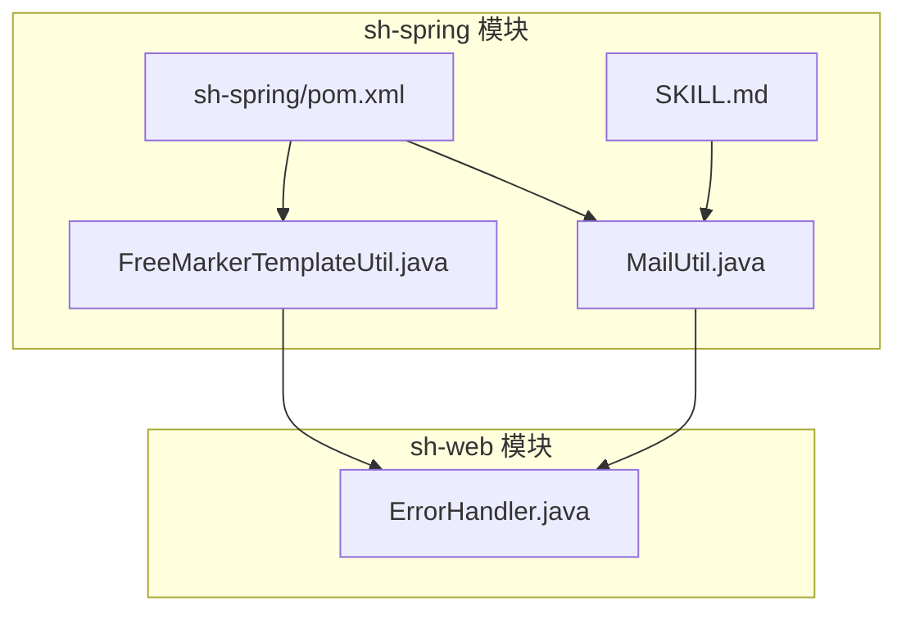
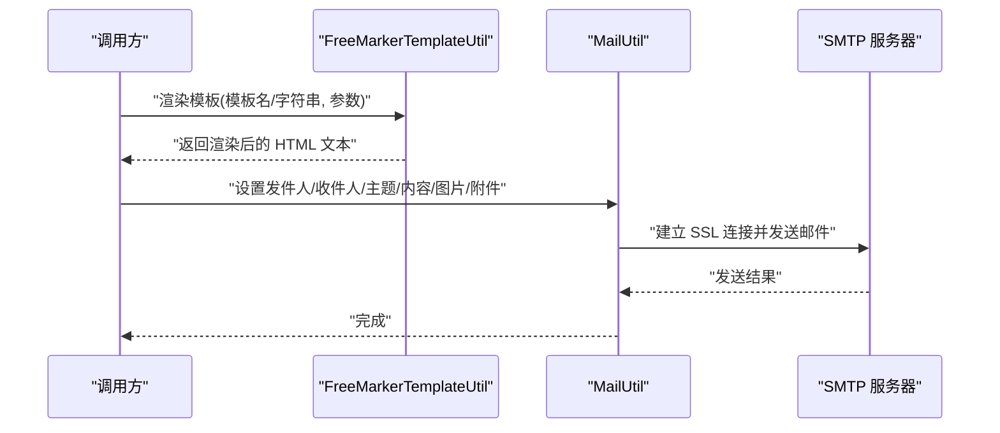
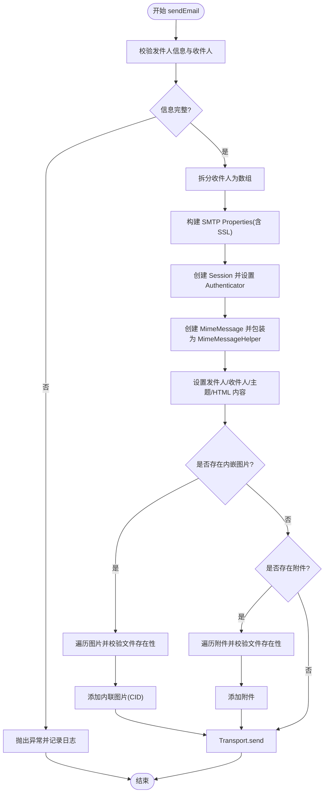
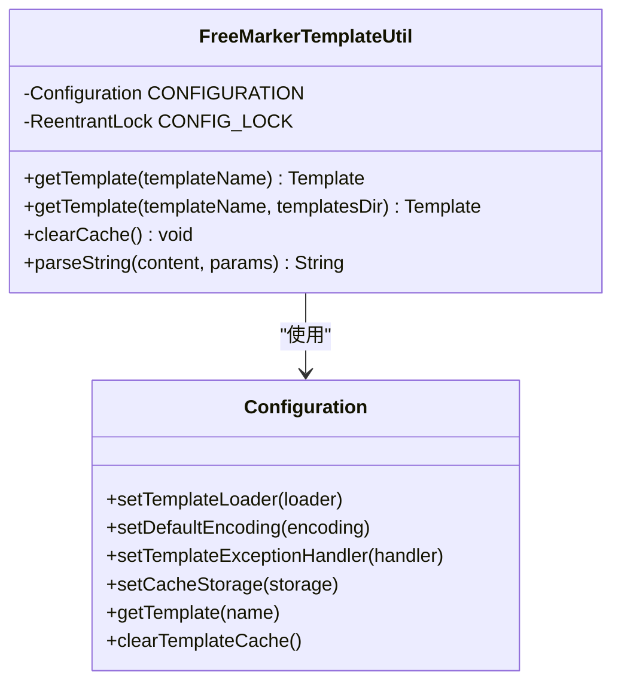
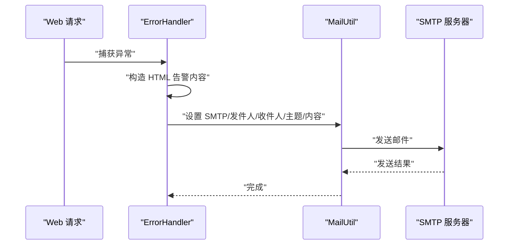
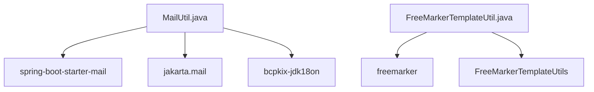

# 邮件模板与工具

<cite>
**本文引用的文件**
- [MailUtil.java](file://sh-spring/src/main/java/com/wkclz/spring/utils/MailUtil.java)
- [FreeMarkerTemplateUtil.java](file://sh-spring/src/main/java/com/wkclz/spring/utils/FreeMarkerTemplateUtil.java)
- [pom.xml](file://sh-spring/pom.xml)
- [SKILL.md](file://.agents/skills/sh-spring/SKILL.md)
- [ErrorHandler.java](file://sh-web/src/main/java/com/wkclz/web/rest/ErrorHandler.java)
</cite>

## 目录
1. [简介](#简介)
2. [项目结构](#项目结构)
3. [核心组件](#核心组件)
4. [架构总览](#架构总览)
5. [详细组件分析](#详细组件分析)
6. [依赖分析](#依赖分析)
7. [性能考虑](#性能考虑)
8. [故障排查指南](#故障排查指南)
9. [结论](#结论)
10. [附录](#附录)

## 简介
本技术文档围绕邮件模板与工具能力展开，重点覆盖以下方面：
- 邮件发送工具 MailUtil 的集成与使用：SMTP 服务器配置、认证与 SSL/TLS 加密传输、单发/群发、抄送/密送支持说明、图片内嵌与附件处理。
- 模板引擎 FreeMarkerTemplateUtil 的集成：模板加载机制、变量绑定与渲染流程。
- 邮件发送模式与最佳实践：通知邮件、报表邮件、营销邮件的实现要点与注意事项。
- 性能优化策略：连接池管理、批量发送、失败重试与日志监控。
- 安全与送达优化：邮件安全、反垃圾邮件与送达率提升建议。

## 项目结构
本项目在 sh-spring 模块中提供邮件工具与模板工具，在 sh-web 模块中提供全局异常处理并通过邮件进行告警通知。关键文件如下：
- 邮件工具：MailUtil.java
- 模板工具：FreeMarkerTemplateUtil.java
- 依赖声明：sh-spring/pom.xml
- 工具使用说明：.agents/skills/sh-spring/SKILL.md
- 全局异常告警：sh-web/.../ErrorHandler.java

**图表来源**
- [MailUtil.java:1-346](file://sh-spring/src/main/java/com/wkclz/spring/utils/MailUtil.java#L1-L346)
- [FreeMarkerTemplateUtil.java:1-94](file://sh-spring/src/main/java/com/wkclz/spring/utils/FreeMarkerTemplateUtil.java#L1-L94)
- [pom.xml:35-53](file://sh-spring/pom.xml#L35-L53)
- [SKILL.md:83-116](file://.agents/skills/sh-spring/SKILL.md#L83-L116)
- [ErrorHandler.java:205-217](file://sh-web/src/main/java/com/wkclz/web/rest/ErrorHandler.java#L205-L217)

**章节来源**
- [MailUtil.java:1-346](file://sh-spring/src/main/java/com/wkclz/spring/utils/MailUtil.java#L1-L346)
- [FreeMarkerTemplateUtil.java:1-94](file://sh-spring/src/main/java/com/wkclz/spring/utils/FreeMarkerTemplateUtil.java#L1-L94)
- [pom.xml:35-53](file://sh-spring/pom.xml#L35-L53)
- [SKILL.md:83-116](file://.agents/skills/sh-spring/SKILL.md#L83-L116)
- [ErrorHandler.java:205-217](file://sh-web/src/main/java/com/wkclz/web/rest/ErrorHandler.java#L205-L217)

## 核心组件
- MailUtil：基于 Jakarta Mail 与 Spring Mail 的邮件发送工具，支持 HTML 内容、内嵌图片（CID）、附件、多收件人（逗号/分号/竖线分隔）与 SSL 加密传输。
- FreeMarkerTemplateUtil：基于 FreeMarker 的模板加载与渲染工具，支持类路径模板加载、自定义目录模板加载与字符串模板渲染。
- 全局异常告警：在 sh-web 模块中通过 ErrorHandler 将异常信息转换为 HTML 并通过 MailUtil 发送邮件告警。

**章节来源**
- [MailUtil.java:18-205](file://sh-spring/src/main/java/com/wkclz/spring/utils/MailUtil.java#L18-L205)
- [FreeMarkerTemplateUtil.java:25-92](file://sh-spring/src/main/java/com/wkclz/spring/utils/FreeMarkerTemplateUtil.java#L25-L92)
- [ErrorHandler.java:205-217](file://sh-web/src/main/java/com/wkclz/web/rest/ErrorHandler.java#L205-L217)

## 架构总览
下图展示了从模板渲染到邮件发送的整体流程，以及异常告警的触发链路。

**图表来源**
- [FreeMarkerTemplateUtil.java:45-92](file://sh-spring/src/main/java/com/wkclz/spring/utils/FreeMarkerTemplateUtil.java#L45-L92)
- [MailUtil.java:125-205](file://sh-spring/src/main/java/com/wkclz/spring/utils/MailUtil.java#L125-L205)

## 详细组件分析

### MailUtil 组件分析
- 功能特性
  - SMTP 配置：主机、认证、SSL 启用、SSL SocketFactory。
  - 收件人支持：多收件人以逗号、中文逗号、分号、中文分号或竖线分隔。
  - 图片内嵌：通过 CID 将本地图片嵌入 HTML。
  - 附件添加：支持本地文件作为附件。
  - 日志记录：异常捕获并记录日志。
- 关键流程
  - 参数校验：发件人信息与收件人不能为空。
  - 创建会话：独立 Properties，避免污染全局系统属性。
  - 构造 MIME 消息：设置发件人、收件人、主题与 HTML 内容。
  - 添加内嵌图片与附件：校验文件存在性后添加。
  - 发送邮件：Transport.send。

**图表来源**
- [MailUtil.java:125-205](file://sh-spring/src/main/java/com/wkclz/spring/utils/MailUtil.java#L125-L205)

**章节来源**
- [MailUtil.java:18-205](file://sh-spring/src/main/java/com/wkclz/spring/utils/MailUtil.java#L18-L205)

### FreeMarkerTemplateUtil 组件分析
- 功能特性
  - 类路径模板加载：默认从类路径 /templates 目录加载模板。
  - 自定义目录模板加载：可按传入目录动态设置模板加载路径。
  - 字符串模板渲染：将传入的模板字符串进行渲染并输出。
  - 线程安全：通过 ReentrantLock 保护模板加载器设置过程。
  - 缓存策略：禁用模板缓存（NullCacheStorage），便于开发调试。
- 渲染流程
  - 获取模板：根据模板名从配置的模板加载器获取模板。
  - 渲染字符串：将模板字符串与参数映射渲染为最终字符串。
  - 异常处理：IO 异常转为系统异常抛出。

**图表来源**
- [FreeMarkerTemplateUtil.java:25-92](file://sh-spring/src/main/java/com/wkclz/spring/utils/FreeMarkerTemplateUtil.java#L25-L92)

**章节来源**
- [FreeMarkerTemplateUtil.java:25-92](file://sh-spring/src/main/java/com/wkclz/spring/utils/FreeMarkerTemplateUtil.java#L25-L92)

### 异常告警与邮件发送集成
- 在 sh-web 模块的 ErrorHandler 中，当发生异常时，会将异常信息转换为 HTML，并通过 MailUtil 发送邮件告警。
- 发送前会设置 SMTP 主机、发件人、密码与收件人等参数。

**图表来源**
- [ErrorHandler.java:205-217](file://sh-web/src/main/java/com/wkclz/web/rest/ErrorHandler.java#L205-L217)
- [MailUtil.java:125-205](file://sh-spring/src/main/java/com/wkclz/spring/utils/MailUtil.java#L125-L205)

**章节来源**
- [ErrorHandler.java:205-217](file://sh-web/src/main/java/com/wkclz/web/rest/ErrorHandler.java#L205-L217)

## 依赖分析
- 邮件发送依赖
  - spring-boot-starter-mail：Spring Mail 启动器。
  - jakarta.mail：Jakarta Mail 实现。
  - bcpkix-jdk18on：RSA 密钥库与证书相关依赖。
- 模板引擎依赖
  - FreeMarker：模板引擎核心库。
  - FreeMarkerTemplateUtils：Spring 提供的模板渲染工具。

**图表来源**
- [pom.xml:35-53](file://sh-spring/pom.xml#L35-L53)

**章节来源**
- [pom.xml:35-53](file://sh-spring/pom.xml#L35-L53)

## 性能考虑
- 连接池管理
  - 当前实现每次发送均新建 Session 与 Properties，适合轻量场景。对于高并发场景，建议引入连接池或复用会话对象，减少频繁创建带来的开销。
- 批量发送
  - MailUtil 支持多收件人（逗号/分号/竖线分隔）。实际生产中可按批次拆分收件人列表，避免单次发送过多收件人导致超时或被限流。
- 失败重试
  - 当前实现对异常仅记录日志。建议在上层调用处增加重试机制（指数退避、最大重试次数），并对不同异常类型区分处理。
- 模板缓存
  - FreeMarkerTemplateUtil 默认禁用模板缓存，便于开发调试。生产环境可根据需要启用缓存以降低模板加载开销。
- 图片与附件
  - 对于大体积图片与附件，建议压缩与分卷上传，避免超时与内存压力。

[本节为通用性能建议，无需特定文件引用]

## 故障排查指南
- 常见问题与定位
  - 发件人信息缺失：检查主机、发件人邮箱与密码是否正确设置。
  - 收件人为空：确保收件人字符串非空且符合分隔符规则。
  - 内嵌图片/附件不存在：确认文件路径有效且可访问。
  - SSL/TLS 认证失败：确认 SMTP 服务器域名与证书可用，必要时调整信任策略。
  - 日志查看：关注 MailUtil 的异常日志输出，定位具体失败环节。
- 建议的排查步骤
  - 单独验证 SMTP 连通性与认证。
  - 分别测试纯文本、HTML、内嵌图片与附件的发送。
  - 在开发环境开启调试（如需要），观察会话交互细节。
  - 对异常告警链路进行端到端验证，确保模板渲染与邮件发送均正常。

**章节来源**
- [MailUtil.java:125-205](file://sh-spring/src/main/java/com/wkclz/spring/utils/MailUtil.java#L125-L205)

## 结论
- MailUtil 提供了简洁易用的邮件发送能力，覆盖 HTML、内嵌图片、附件与多收件人场景，并通过 SSL 加密保障传输安全。
- FreeMarkerTemplateUtil 提供灵活的模板加载与渲染能力，支持类路径与自定义目录模板，满足多样化邮件模板需求。
- 建议在生产环境中结合连接池、批量发送、重试与缓存策略进一步提升性能与稳定性，并完善监控与日志体系。

[本节为总结性内容，无需特定文件引用]

## 附录

### 邮件发送模式与实现要点
- 单发邮件
  - 设置单个收件人邮箱，适用于个人通知或点对点提醒。
- 群发邮件
  - 使用分隔符拼接多个收件人邮箱，适用于团队通知或公告。
- 抄送/密送
  - MailUtil 通过 MimeMessageHelper 设置收件人数组，可扩展为 CC/BCC 场景（需在上层调用处组织收件人列表）。
- 图片内嵌
  - 通过 CID 将本地图片嵌入 HTML，确保图片 ID 与 HTML 中引用一致。
- 附件处理
  - 通过 FileSystemResource 添加本地文件为附件，注意文件存在性校验。

**章节来源**
- [MailUtil.java:125-205](file://sh-spring/src/main/java/com/wkclz/spring/utils/MailUtil.java#L125-L205)

### 邮件模板开发指南
- 设计原则
  - 结构清晰：语义化标签与合理层级。
  - 响应式布局：适配移动端阅读。
  - 可维护性：变量命名规范，模板结构稳定。
- 图片嵌入
  - 使用 CID 引用内嵌图片，避免外链失效。
- 附件处理
  - 通过模板变量提示附件下载链接或说明，避免在正文中直接嵌入大附件。

**章节来源**
- [FreeMarkerTemplateUtil.java:45-92](file://sh-spring/src/main/java/com/wkclz/spring/utils/FreeMarkerTemplateUtil.java#L45-L92)

### 使用示例（路径指引）
- 发送通知邮件
  - 步骤：渲染模板 -> 设置主题与内容 -> 调用 MailUtil 发送。
  - 参考路径：[MailUtil.java:207-244](file://sh-spring/src/main/java/com/wkclz/spring/utils/MailUtil.java#L207-L244)
- 发送报表邮件
  - 步骤：准备报表数据 -> 渲染表格模板 -> 添加报表附件 -> 发送。
  - 参考路径：[FreeMarkerTemplateUtil.java:45-92](file://sh-spring/src/main/java/com/wkclz/spring/utils/FreeMarkerTemplateUtil.java#L45-L92)，[MailUtil.java:184-199](file://sh-spring/src/main/java/com/wkclz/spring/utils/MailUtil.java#L184-L199)
- 发送营销邮件
  - 步骤：模板设计 -> 变量绑定 -> 内嵌图片 -> 批量发送。
  - 参考路径：[FreeMarkerTemplateUtil.java:45-92](file://sh-spring/src/main/java/com/wkclz/spring/utils/FreeMarkerTemplateUtil.java#L45-L92)，[MailUtil.java:168-199](file://sh-spring/src/main/java/com/wkclz/spring/utils/MailUtil.java#L168-L199)

### 邮件安全与送达优化
- 安全
  - 使用 SSL/TLS 加密传输，严格管理发件人凭据。
  - 避免在模板中硬编码敏感信息，采用参数化渲染。
- 反垃圾邮件
  - 规范主题与正文内容，避免触发关键词过滤。
  - 使用真实发件域名与 SPF/DKIM/DMARC 配置。
- 送达率优化
  - 控制发送速率，避免被目标服务器限流。
  - 对失败收件人进行隔离与重试，提高整体成功率。

[本节为通用指导，无需特定文件引用]