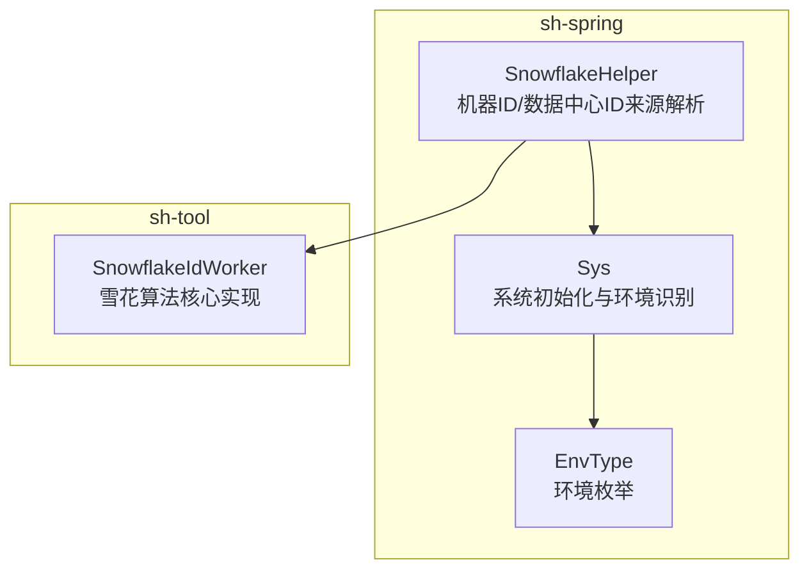
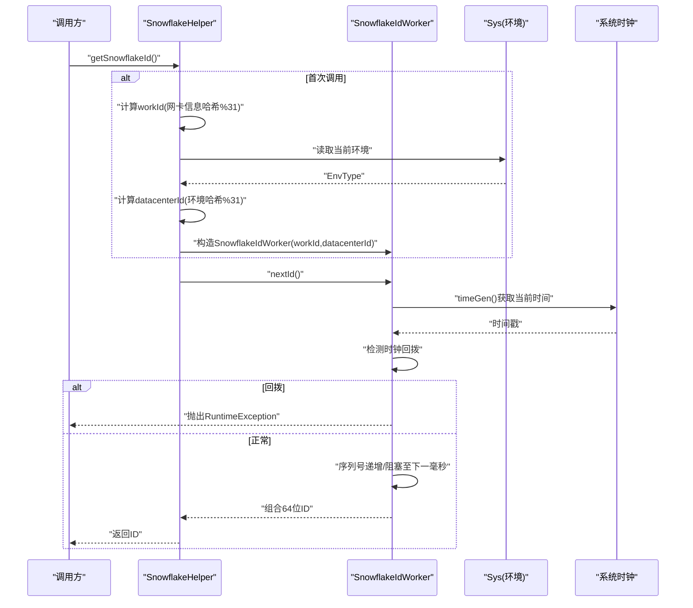
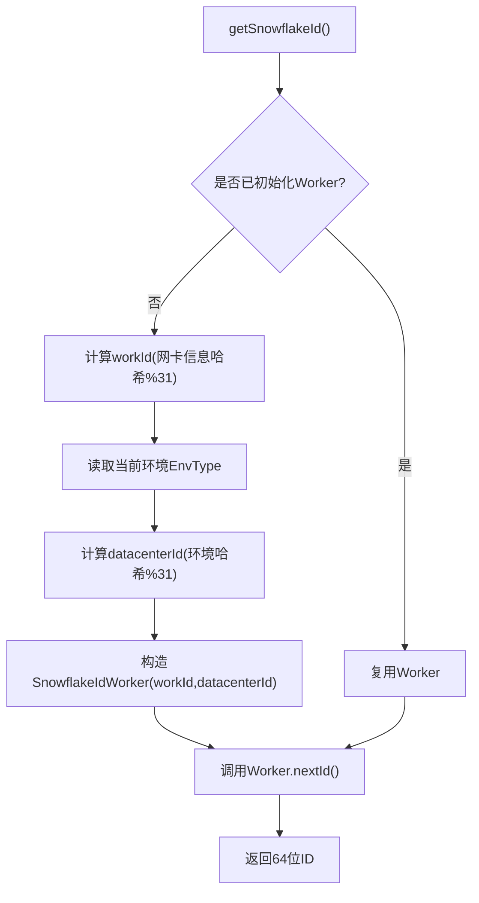
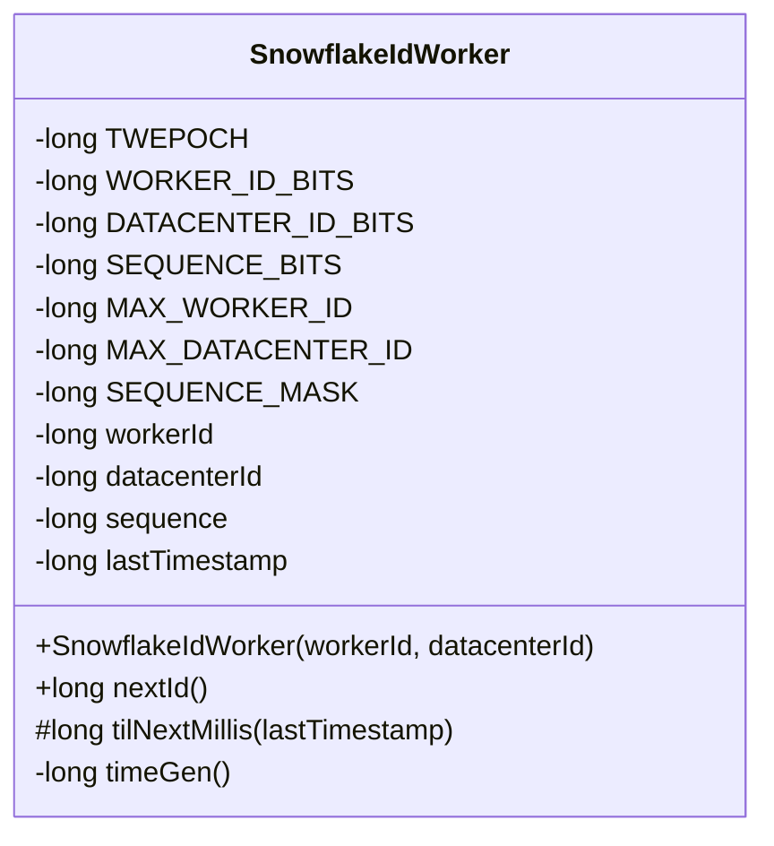
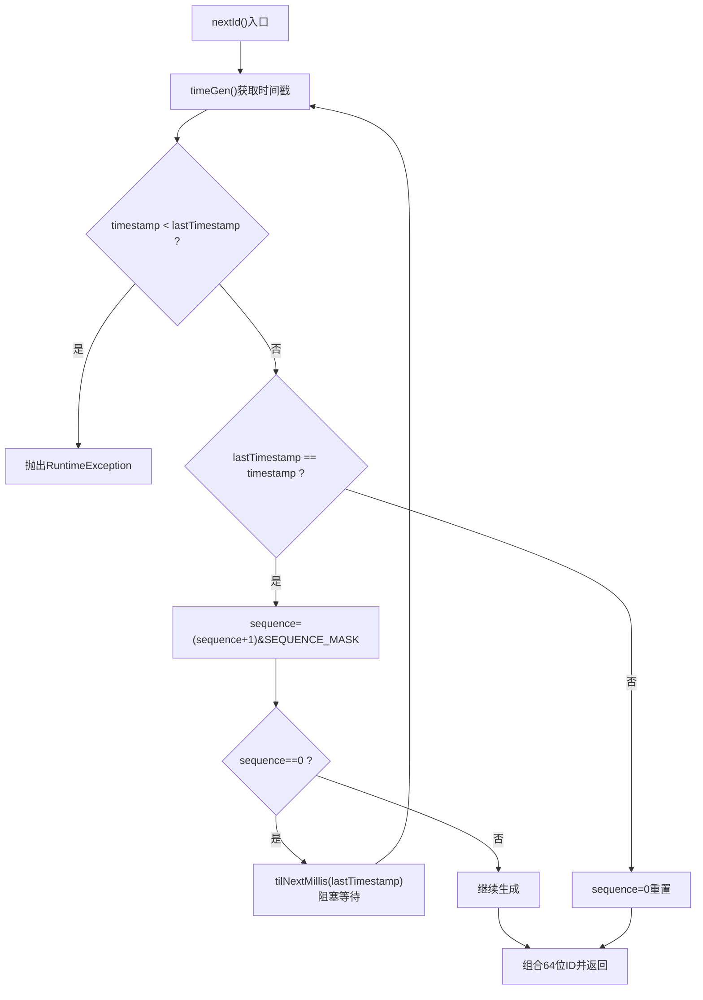
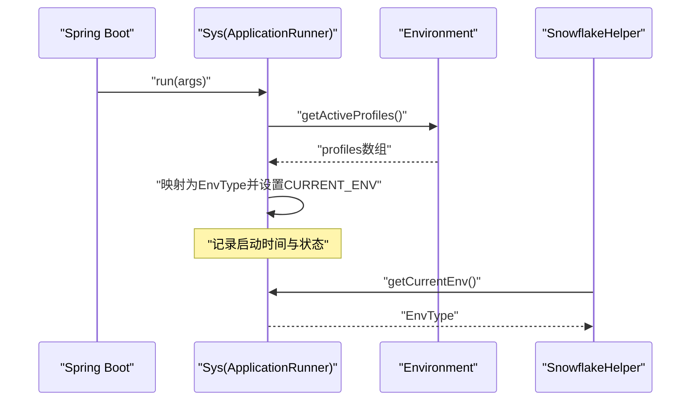
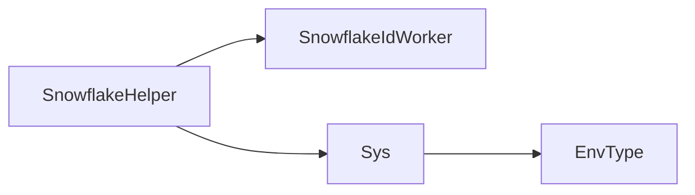

# 雪花ID生成器

<cite>
**本文引用的文件**
- [SnowflakeHelper.java](file://sh-spring/src/main/java/com/wkclz/spring/helper/SnowflakeHelper.java)
- [SnowflakeIdWorker.java](file://sh-tool/src/main/java/com/wkclz/tool/utils/SnowflakeIdWorker.java)
- [Sys.java](file://sh-spring/src/main/java/com/wkclz/spring/config/Sys.java)
- [EnvType.java](file://sh-core/src/main/java/com/wkclz/core/enums/EnvType.java)
- [US-023-雪花ID与系统初始化.md](file://docs/stories/US-023-雪花ID与系统初始化.md)
- [RedisIdGenerator.java](file://sh-redis/src/main/java/com/wkclz/redis/helper/RedisIdGenerator.java)
- [US-018-Redis-ID生成器.md](file://docs/stories/US-018-Redis-ID生成器.md)
</cite>

## 目录
1. [简介](#简介)
2. [项目结构](#项目结构)
3. [核心组件](#核心组件)
4. [架构总览](#架构总览)
5. [详细组件分析](#详细组件分析)
6. [依赖分析](#依赖分析)
7. [性能考虑](#性能考虑)
8. [故障排查指南](#故障排查指南)
9. [结论](#结论)
10. [附录](#附录)

## 简介
本技术文档围绕雪花ID生成器展开，系统性解析Snowflake算法的核心原理与实现细节，覆盖位分配策略、时钟回拨处理、最大序列号限制、机器ID冲突规避、系统初始化流程（含机器ID自动分配、环境识别与重启状态恢复）、并发与性能表现、使用示例与最佳实践，以及在分布式系统中保障唯一性的策略与优化技巧。

## 项目结构
雪花ID能力由两个模块协同提供：
- sh-spring：对外提供便捷入口与环境感知，负责机器ID与数据中心ID的来源解析与懒加载初始化。
- sh-tool：提供雪花算法核心实现，包含位分配、时钟回拨检测与阻塞等待下一毫秒的机制。
- sh-core：提供环境枚举，供系统初始化阶段识别当前运行环境。
- 文档故事：提供验收场景、流程图与关键实现路径指引。

**图表来源**
- [SnowflakeHelper.java:1-68](file://sh-spring/src/main/java/com/wkclz/spring/helper/SnowflakeHelper.java#L1-L68)
- [SnowflakeIdWorker.java:1-142](file://sh-tool/src/main/java/com/wkclz/tool/utils/SnowflakeIdWorker.java#L1-L142)
- [Sys.java:1-99](file://sh-spring/src/main/java/com/wkclz/spring/config/Sys.java#L1-L99)
- [EnvType.java:1-28](file://sh-core/src/main/java/com/wkclz/core/enums/EnvType.java#L1-L28)

**章节来源**
- [SnowflakeHelper.java:1-68](file://sh-spring/src/main/java/com/wkclz/spring/helper/SnowflakeHelper.java#L1-L68)
- [SnowflakeIdWorker.java:1-142](file://sh-tool/src/main/java/com/wkclz/tool/utils/SnowflakeIdWorker.java#L1-L142)
- [Sys.java:1-99](file://sh-spring/src/main/java/com/wkclz/spring/config/Sys.java#L1-L99)
- [EnvType.java:1-28](file://sh-core/src/main/java/com/wkclz/core/enums/EnvType.java#L1-L28)
- [US-023-雪花ID与系统初始化.md:1-43](file://docs/stories/US-023-雪花ID与系统初始化.md#L1-L43)

## 核心组件
- SnowflakeHelper：对外暴露静态方法，负责懒加载SnowflakeIdWorker并生成ID；机器ID来自网卡信息哈希取模，数据中心ID来自当前环境哈希取模。
- SnowflakeIdWorker：雪花算法核心，包含时间戳、数据中心ID、机器ID、序列号的位分配与组合；提供时钟回拨检测与阻塞等待下一毫秒的机制。
- Sys：系统启动时识别当前环境（DEV/SIT/UAT/PROD），供数据中心ID来源使用。
- EnvType：环境枚举，提供环境描述与哈希值。

**章节来源**
- [SnowflakeHelper.java:1-68](file://sh-spring/src/main/java/com/wkclz/spring/helper/SnowflakeHelper.java#L1-L68)
- [SnowflakeIdWorker.java:1-142](file://sh-tool/src/main/java/com/wkclz/tool/utils/SnowflakeIdWorker.java#L1-L142)
- [Sys.java:1-99](file://sh-spring/src/main/java/com/wkclz/spring/config/Sys.java#L1-L99)
- [EnvType.java:1-28](file://sh-core/src/main/java/com/wkclz/core/enums/EnvType.java#L1-L28)

## 架构总览
雪花ID生成的端到端流程如下：

**图表来源**
- [SnowflakeHelper.java:19-27](file://sh-spring/src/main/java/com/wkclz/spring/helper/SnowflakeHelper.java#L19-L27)
- [SnowflakeHelper.java:32-56](file://sh-spring/src/main/java/com/wkclz/spring/helper/SnowflakeHelper.java#L32-L56)
- [SnowflakeIdWorker.java:73-103](file://sh-tool/src/main/java/com/wkclz/tool/utils/SnowflakeIdWorker.java#L73-L103)
- [Sys.java:86-88](file://sh-spring/src/main/java/com/wkclz/spring/config/Sys.java#L86-L88)

## 详细组件分析

### SnowflakeHelper：入口与初始化
- 懒加载：首次调用时计算workId与datacenterId并创建SnowflakeIdWorker实例，后续复用。
- 机器ID（workId）：基于本机网卡信息字符串拼接后哈希，取绝对值再对31取模，范围[0,31]。
- 数据中心ID（datacenterId）：基于当前环境枚举的哈希，取绝对值再对31取模，范围[0,31]。
- 线程安全：对外方法加同步，避免多线程下重复初始化。

**图表来源**
- [SnowflakeHelper.java:19-27](file://sh-spring/src/main/java/com/wkclz/spring/helper/SnowflakeHelper.java#L19-L27)
- [SnowflakeHelper.java:32-56](file://sh-spring/src/main/java/com/wkclz/spring/helper/SnowflakeHelper.java#L32-L56)
- [Sys.java:86-88](file://sh-spring/src/main/java/com/wkclz/spring/config/Sys.java#L86-L88)

**章节来源**
- [SnowflakeHelper.java:1-68](file://sh-spring/src/main/java/com/wkclz/spring/helper/SnowflakeHelper.java#L1-L68)
- [Sys.java:1-99](file://sh-spring/src/main/java/com/wkclz/spring/config/Sys.java#L1-L99)
- [EnvType.java:1-28](file://sh-core/src/main/java/com/wkclz/core/enums/EnvType.java#L1-L28)
- [US-023-雪花ID与系统初始化.md:13-29](file://docs/stories/US-023-雪花ID与系统初始化.md#L13-L29)

### SnowflakeIdWorker：雪花算法核心
- 位分配与掩码
  - 时间戳：41位（毫秒级），起始基准时间（epoch）为固定值。
  - 数据中心ID：5位（可选范围0~31）。
  - 机器ID：5位（可选范围0~31）。
  - 序列号：12位（每毫秒最多4096个ID）。
- 组合规则：将各字段按位左移后通过或运算合并为64位长整型。
- 时钟回拨处理：若当前时间早于上次生成时间，直接抛出运行时异常，避免ID重复。
- 序列号溢出：同一毫秒内序列号达到上限（4096）时，阻塞等待下一毫秒。
- 性能指标：官方注释表明单机每秒可生成约26万ID，满足大多数业务高并发需求。

**图表来源**
- [SnowflakeIdWorker.java:15-103](file://sh-tool/src/main/java/com/wkclz/tool/utils/SnowflakeIdWorker.java#L15-L103)

**章节来源**
- [SnowflakeIdWorker.java:1-142](file://sh-tool/src/main/java/com/wkclz/tool/utils/SnowflakeIdWorker.java#L1-L142)

### 时钟回拨与序列号溢出处理
- 时钟回拨检测：若当前时间戳小于上次时间戳，立即抛出异常，防止ID重复。
- 序列号溢出：同一毫秒内序列号达到上限（4096）时，阻塞等待下一毫秒，确保单调递增。
- 与Redis方案对比：RedisIdGenerator采用Redis自增序列号与本地降级策略，具备更强的容错能力与更灵活的位分配（机器ID+序列号位数更大），但雪花ID在纯内存与单机场景下延迟更低、吞吐更高。

**图表来源**
- [SnowflakeIdWorker.java:73-103](file://sh-tool/src/main/java/com/wkclz/tool/utils/SnowflakeIdWorker.java#L73-L103)
- [SnowflakeIdWorker.java:111-117](file://sh-tool/src/main/java/com/wkclz/tool/utils/SnowflakeIdWorker.java#L111-L117)

**章节来源**
- [SnowflakeIdWorker.java:73-103](file://sh-tool/src/main/java/com/wkclz/tool/utils/SnowflakeIdWorker.java#L73-L103)
- [SnowflakeIdWorker.java:111-117](file://sh-tool/src/main/java/com/wkclz/tool/utils/SnowflakeIdWorker.java#L111-L117)

### 系统初始化与环境识别
- Sys在应用启动完成后执行，读取激活的profile，映射为EnvType（DEV/SIT/UAT/PROD），并记录启动时间。
- SnowflakeHelper在首次生成ID时读取当前环境，用于datacenterId的计算，从而在不同环境中实现天然隔离。

**图表来源**
- [Sys.java:38-78](file://sh-spring/src/main/java/com/wkclz/spring/config/Sys.java#L38-L78)
- [SnowflakeHelper.java:52-55](file://sh-spring/src/main/java/com/wkclz/spring/helper/SnowflakeHelper.java#L52-L55)

**章节来源**
- [Sys.java:1-99](file://sh-spring/src/main/java/com/wkclz/spring/config/Sys.java#L1-L99)
- [EnvType.java:1-28](file://sh-core/src/main/java/com/wkclz/core/enums/EnvType.java#L1-L28)
- [SnowflakeHelper.java:52-55](file://sh-spring/src/main/java/com/wkclz/spring/helper/SnowflakeHelper.java#L52-L55)

### 位分配策略与ID格式
- 雪花ID位分配（从高位到低位）：
  - 符号位：1位（正数为0，保证ID为正）。
  - 时间戳：41位（毫秒级，可使用约69年）。
  - 数据中心ID：5位（0~31）。
  - 机器ID：5位（0~31）。
  - 序列号：12位（0~4095）。
- 组合方式：通过左移与或运算将各字段拼接为64位长整型，保证ID全局递增且具备时间序特征。

**章节来源**
- [SnowflakeIdWorker.java:3-14](file://sh-tool/src/main/java/com/wkclz/tool/utils/SnowflakeIdWorker.java#L3-L14)

### 机器ID冲突与数据中心ID隔离
- 机器ID（workId）：基于网卡信息哈希取模，不同机器通常获得不同workId，降低冲突概率。
- 数据中心ID（datacenterId）：基于环境哈希取模，不同环境天然隔离，避免跨环境ID冲突。
- 若出现冲突（极小概率），可通过调整网卡信息或强制指定ID来源（例如在部署层面固定workId）进行规避。

**章节来源**
- [SnowflakeHelper.java:32-56](file://sh-spring/src/main/java/com/wkclz/spring/helper/SnowflakeHelper.java#L32-L56)

### 使用示例与策略选择
- 基本使用：通过SnowflakeHelper.getSnowflakeId()获取64位长整型ID。
- 策略选择：
  - 高吞吐、低延迟：优先雪花ID（纯内存、单机高QPS）。
  - 强一致与容错：可参考RedisIdGenerator的思路（Redis自增+本地降级），适合需要更强鲁棒性的场景。
- ID格式化与转换：雪花ID为64位长整型，可按需转换为字符串或进行业务前缀拼接。

**章节来源**
- [SnowflakeHelper.java:19-27](file://sh-spring/src/main/java/com/wkclz/spring/helper/SnowflakeHelper.java#L19-L27)
- [US-018-Redis-ID生成器.md:6-29](file://docs/stories/US-018-Redis-ID生成器.md#L6-L29)

## 依赖分析
- SnowflakeHelper依赖SnowflakeIdWorker与Sys/EnvType，负责入口与初始化。
- SnowflakeIdWorker为纯工具类，内部维护状态（序列号、上次时间戳），通过同步方法保证线程安全。
- Sys在应用启动阶段完成环境识别，为SnowflakeHelper提供datacenterId来源。

**图表来源**
- [SnowflakeHelper.java:1-11](file://sh-spring/src/main/java/com/wkclz/spring/helper/SnowflakeHelper.java#L1-L11)
- [SnowflakeIdWorker.java:1-15](file://sh-tool/src/main/java/com/wkclz/tool/utils/SnowflakeIdWorker.java#L1-L15)
- [Sys.java:1-26](file://sh-spring/src/main/java/com/wkclz/spring/config/Sys.java#L1-L26)
- [EnvType.java:1-10](file://sh-core/src/main/java/com/wkclz/core/enums/EnvType.java#L1-L10)

**章节来源**
- [SnowflakeHelper.java:1-11](file://sh-spring/src/main/java/com/wkclz/spring/helper/SnowflakeHelper.java#L1-L11)
- [SnowflakeIdWorker.java:1-15](file://sh-tool/src/main/java/com/wkclz/tool/utils/SnowflakeIdWorker.java#L1-L15)
- [Sys.java:1-26](file://sh-spring/src/main/java/com/wkclz/spring/config/Sys.java#L1-L26)
- [EnvType.java:1-10](file://sh-core/src/main/java/com/wkclz/core/enums/EnvType.java#L1-L10)

## 性能考虑
- 单机吞吐：官方注释显示每秒可生成约26万ID，满足高并发场景。
- 关键瓶颈点：
  - 同一毫秒内序列号达到上限时会阻塞等待下一毫秒，存在微小抖动。
  - 时钟回拨直接抛异常，避免重复ID但需确保系统时间同步。
- 优化建议：
  - 使用NTP保持系统时间同步，避免回拨。
  - 在高并发场景下，尽量减少同一毫秒内的峰值请求，或通过批量申请ID降低竞争。
  - 如需更强容错，可结合RedisIdGenerator的降级策略（Redis不可用时本地自增）。

**章节来源**
- [SnowflakeIdWorker.java:13-13](file://sh-tool/src/main/java/com/wkclz/tool/utils/SnowflakeIdWorker.java#L13-L13)
- [RedisIdGenerator.java:1-230](file://sh-redis/src/main/java/com/wkclz/redis/helper/RedisIdGenerator.java#L1-L230)

## 故障排查指南
- 时钟回拨异常：若抛出“时钟回拨”相关运行时异常，检查系统时间同步（NTP）与是否存在时间跳变。
- 序列号溢出抖动：同一毫秒内请求过于密集可能导致阻塞等待下一毫秒，属于预期行为；可通过削峰填谷缓解。
- 机器ID冲突：若多实例workId相同，建议调整网卡信息或在部署层固定workId。
- 环境识别异常：确认spring.profiles.active配置正确，Sys能正确映射为EnvType。

**章节来源**
- [SnowflakeIdWorker.java:76-80](file://sh-tool/src/main/java/com/wkclz/tool/utils/SnowflakeIdWorker.java#L76-L80)
- [Sys.java:45-78](file://sh-spring/src/main/java/com/wkclz/spring/config/Sys.java#L45-L78)
- [SnowflakeHelper.java:32-56](file://sh-spring/src/main/java/com/wkclz/spring/helper/SnowflakeHelper.java#L32-L56)

## 结论
雪花ID生成器在本框架中提供了高性能、低延迟的全局唯一ID能力，通过严格的位分配与时钟回拨检测保障ID单调递增与唯一性。配合Sys的环境识别与SnowflakeHelper的懒加载初始化，可在分布式环境下实现天然隔离与稳定扩展。对于需要更强容错的场景，可参考RedisIdGenerator的降级策略进行混合使用。

## 附录
- 雪花ID位分配与组合规则详见SnowflakeIdWorker中的字段与位移常量定义。
- 环境枚举与Sys初始化流程见EnvType与Sys实现。
- 文档故事提供了验收场景与流程图，便于对照验证实现。

**章节来源**
- [SnowflakeIdWorker.java:17-37](file://sh-tool/src/main/java/com/wkclz/tool/utils/SnowflakeIdWorker.java#L17-L37)
- [EnvType.java:1-28](file://sh-core/src/main/java/com/wkclz/core/enums/EnvType.java#L1-L28)
- [US-023-雪花ID与系统初始化.md:31-36](file://docs/stories/US-023-雪花ID与系统初始化.md#L31-L36)
- [US-018-Redis-ID生成器.md:31-36](file://docs/stories/US-018-Redis-ID生成器.md#L31-L36)