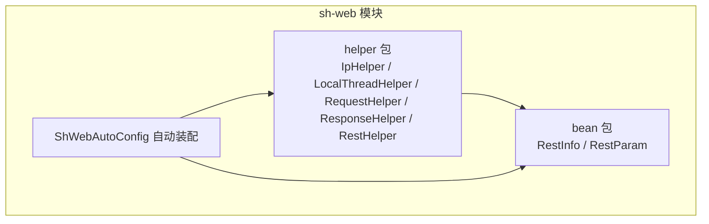
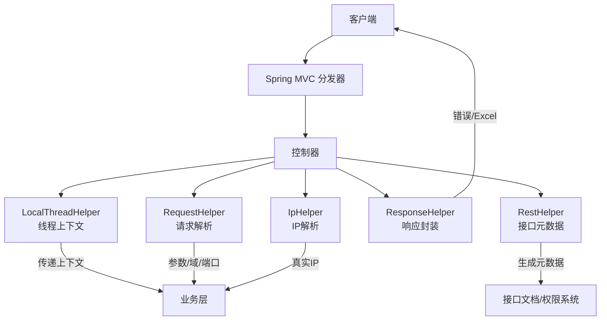
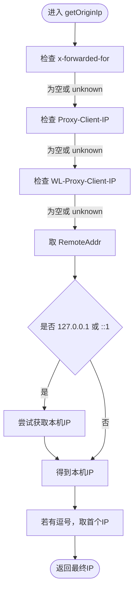
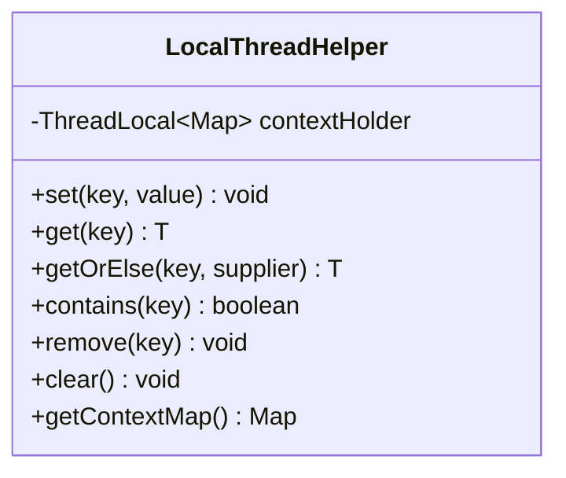
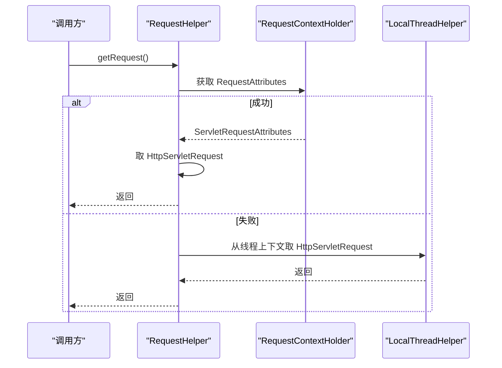
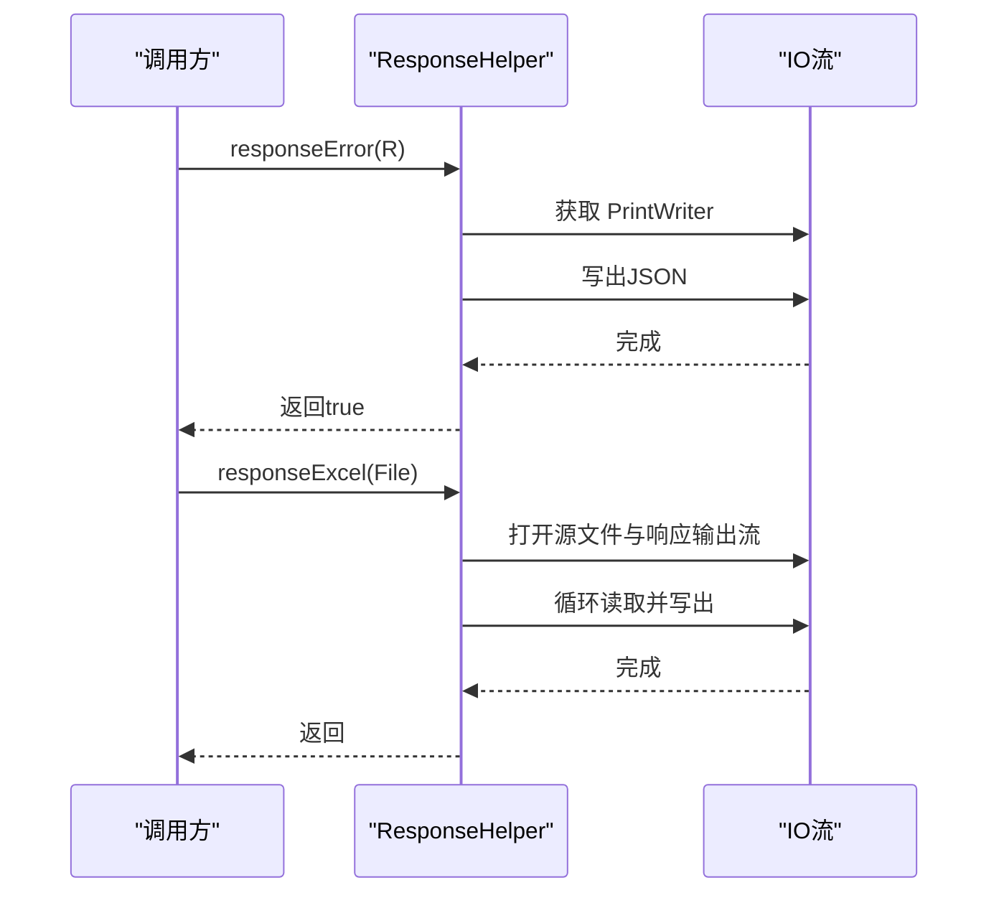
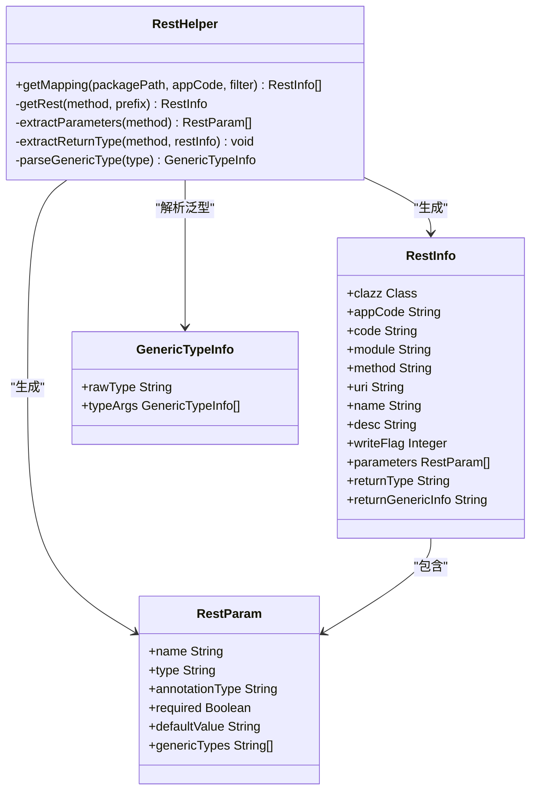
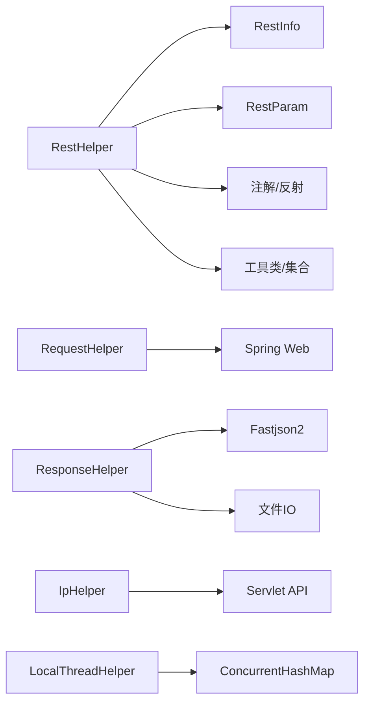

# Web辅助工具类

<cite>
**本文引用的文件**
- [IpHelper.java](file://sh-web/src/main/java/com/wkclz/web/helper/IpHelper.java)
- [LocalThreadHelper.java](file://sh-web/src/main/java/com/wkclz/web/helper/LocalThreadHelper.java)
- [RequestHelper.java](file://sh-web/src/main/java/com/wkclz/web/helper/RequestHelper.java)
- [ResponseHelper.java](file://sh-web/src/main/java/com/wkclz/web/helper/ResponseHelper.java)
- [RestHelper.java](file://sh-web/src/main/java/com/wkclz/web/helper/RestHelper.java)
- [RestInfo.java](file://sh-web/src/main/java/com/wkclz/web/bean/RestInfo.java)
- [RestParam.java](file://sh-web/src/main/java/com/wkclz/web/bean/RestParam.java)
- [RestHelperTest.java](file://sh-web/src/test/java/com/wkclz/web/helper/RestHelperTest.java)
- [ShWebAutoConfig.java](file://sh-web/src/main/java/com/wkclz/web/ShWebAutoConfig.java)
</cite>

## 目录
1. [简介](#简介)
2. [项目结构](#项目结构)
3. [核心组件](#核心组件)
4. [架构总览](#架构总览)
5. [详细组件分析](#详细组件分析)
6. [依赖分析](#依赖分析)
7. [性能考虑](#性能考虑)
8. [故障排查指南](#故障排查指南)
9. [结论](#结论)
10. [附录](#附录)

## 简介
本文件面向sh-web模块中的Web辅助工具类，系统性梳理并解读以下工具类的设计与实现要点：
- IpHelper：IP地址获取与来源识别，兼顾代理链路与本机回环场景
- LocalThreadHelper：基于ThreadLocal的多键值线程上下文存储，支持默认值提供器与清理
- RequestHelper：请求上下文与URL解析，路径匹配、参数收集、前端域与端口推导
- ResponseHelper：统一错误响应输出与Excel下载响应封装
- RestHelper：基于注解与反射的REST接口元数据提取，含参数、返回类型与泛型信息抽取

文档同时覆盖线程安全、性能优化、错误处理策略，并给出在控制器与业务层的典型使用场景与集成方式。

## 项目结构
sh-web模块采用按职责分层的组织方式，Web辅助工具类集中位于helper包，配套的REST元数据模型位于bean包；自动装配入口位于根包下。

图表来源
- [ShWebAutoConfig.java:1-12](file://sh-web/src/main/java/com/wkclz/web/ShWebAutoConfig.java#L1-L12)

章节来源
- [ShWebAutoConfig.java:1-12](file://sh-web/src/main/java/com/wkclz/web/ShWebAutoConfig.java#L1-L12)

## 核心组件
本节概览五个工具类的关键职责与典型用法：

- IpHelper
  - 职责：从HttpServletRequest中解析“上游真实IP”与“原始IP”，兼容多级代理头与本机回环
  - 关键方法：getOriginIp、getUpstreamIp
  - 使用场景：审计日志、风控策略、访问统计

- LocalThreadHelper
  - 职责：线程级上下文存储，支持多键值、默认值提供器、清理与只读快照
  - 关键方法：set、get、getOrElse、contains、remove、clear、getContextMap
  - 使用场景：Web请求上下文传递（用户信息、traceId等）

- RequestHelper
  - 职责：请求路径匹配、参数收集、请求URL与前端域/端口解析
  - 关键方法：match、getParamsFromRequest、getRequestUrl、getRequest、getFrontDomain、getFrontPort、getFrontPortalDomainPort
  - 使用场景：路由匹配、参数聚合、跨域/前端域判定

- ResponseHelper
  - 职责：统一错误响应输出与Excel下载响应
  - 关键方法：responseError、responseExcel
  - 使用场景：异常统一输出、报表导出

- RestHelper
  - 职责：扫描Controller类，提取接口URI、方法、参数、返回类型与泛型信息
  - 关键方法：getMapping、extractParameters、extractReturnType、parseGenericType
  - 使用场景：接口文档生成、权限与路由元数据构建

章节来源
- [IpHelper.java:1-51](file://sh-web/src/main/java/com/wkclz/web/helper/IpHelper.java#L1-L51)
- [LocalThreadHelper.java:1-95](file://sh-web/src/main/java/com/wkclz/web/helper/LocalThreadHelper.java#L1-L95)
- [RequestHelper.java:1-173](file://sh-web/src/main/java/com/wkclz/web/helper/RequestHelper.java#L1-L173)
- [ResponseHelper.java:1-71](file://sh-web/src/main/java/com/wkclz/web/helper/ResponseHelper.java#L1-L71)
- [RestHelper.java:1-554](file://sh-web/src/main/java/com/wkclz/web/helper/RestHelper.java#L1-L554)

## 架构总览
下图展示各工具类在Web请求生命周期中的协作关系与职责边界。

图表来源
- [LocalThreadHelper.java:1-95](file://sh-web/src/main/java/com/wkclz/web/helper/LocalThreadHelper.java#L1-L95)
- [RequestHelper.java:1-173](file://sh-web/src/main/java/com/wkclz/web/helper/RequestHelper.java#L1-L173)
- [ResponseHelper.java:1-71](file://sh-web/src/main/java/com/wkclz/web/helper/ResponseHelper.java#L1-L71)
- [IpHelper.java:1-51](file://sh-web/src/main/java/com/wkclz/web/helper/IpHelper.java#L1-L51)
- [RestHelper.java:1-554](file://sh-web/src/main/java/com/wkclz/web/helper/RestHelper.java#L1-L554)

## 详细组件分析

### IpHelper 组件分析
- 设计要点
  - 优先从代理链路头字段获取真实IP，回退至RemoteAddr；对127.0.0.1/IPv6回环进行本机IP探测
  - 多IP逗号分隔时截取首个作为客户端真实IP
- 线程安全
  - 无共享可变状态，纯静态方法，天然线程安全
- 性能
  - 常数时间复杂度；避免重复解析，减少字符串处理开销
- 错误处理
  - 本机IP解析失败记录日志但不抛出异常，保证流程继续
- 使用场景
  - 审计日志记录、风控规则判断、访问统计与地域分析

图表来源
- [IpHelper.java:17-48](file://sh-web/src/main/java/com/wkclz/web/helper/IpHelper.java#L17-L48)

章节来源
- [IpHelper.java:1-51](file://sh-web/src/main/java/com/wkclz/web/helper/IpHelper.java#L1-L51)

### LocalThreadHelper 组件分析
- 设计要点
  - 基于ThreadLocal维护线程私有Map，结合ConcurrentHashMap保证Map操作的线程安全
  - 提供默认值提供器，便于惰性计算与空值兜底
  - 必须显式调用clear，避免线程池复用导致的内存泄漏
- 线程安全
  - ThreadLocal确保线程隔离；Map内部操作通过ConcurrentHashMap保证并发安全
- 性能
  - Map读写为O(1)；getContextMap返回只读快照，适合调试
- 错误处理
  - 不抛异常，getOrElse通过提供器返回默认值
- 使用场景
  - 在拦截器/过滤器中注入用户上下文，在业务层透明获取
  - 结合WebMvc配置在请求结束时统一清理

图表来源
- [LocalThreadHelper.java:1-95](file://sh-web/src/main/java/com/wkclz/web/helper/LocalThreadHelper.java#L1-L95)

章节来源
- [LocalThreadHelper.java:1-95](file://sh-web/src/main/java/com/wkclz/web/helper/LocalThreadHelper.java#L1-L95)

### RequestHelper 组件分析
- 设计要点
  - 路径匹配：基于Ant风格规则与URI进行匹配
  - 参数收集：遍历parameterMap，拼接多值参数为字符串
  - 域与端口：从Origin/Referer推导前端域，解析协议、主机与端口
  - 请求获取：优先从RequestContextHolder获取，否则回退到线程上下文
- 线程安全
  - 无共享可变状态；仅读取请求属性，线程安全
- 性能
  - 参数拼接为O(n)；URL解析使用URI/URL，注意异常捕获成本
- 错误处理
  - URL解析异常记录日志，避免中断流程
- 使用场景
  - 跨域/前端域判定、参数聚合、接口路由匹配

图表来源
- [RequestHelper.java:83-90](file://sh-web/src/main/java/com/wkclz/web/helper/RequestHelper.java#L83-L90)

章节来源
- [RequestHelper.java:1-173](file://sh-web/src/main/java/com/wkclz/web/helper/RequestHelper.java#L1-L173)

### ResponseHelper 组件分析
- 设计要点
  - 统一错误响应：序列化R对象，清空时间戳字段，设置JSON头并写出
  - Excel下载：RFC 5987编码文件名，设置Content-Disposition与长度，流式写出
- 线程安全
  - 无共享状态，纯静态方法
- 性能
  - 流式写出，固定缓冲区大小；异常捕获避免阻塞
- 错误处理
  - 输出异常记录日志并返回false，便于上层处理
- 使用场景
  - 全局异常处理器统一输出、报表导出下载

图表来源
- [ResponseHelper.java:19-68](file://sh-web/src/main/java/com/wkclz/web/helper/ResponseHelper.java#L19-L68)

章节来源
- [ResponseHelper.java:1-71](file://sh-web/src/main/java/com/wkclz/web/helper/ResponseHelper.java#L1-L71)

### RestHelper 组件分析
- 设计要点
  - 扫描包内带@RestController或@Controller或@Router注解的类，提取URI、方法、描述、参数与返回类型
  - 参数提取：支持@RequestBody、@PathVariable、@RequestParam，含required与defaultValue
  - 返回类型提取：支持void、普通类、泛型（含嵌套）的递归解析，输出JSON化的泛型信息
  - 描述补充：通过@Router标注的模块与@Desc/@ApiDesc为接口补充描述与公开标志
- 线程安全
  - 无共享可变状态，纯静态方法
- 性能
  - 反射扫描与注解解析为O(n*m*k)，其中n为类数、m为方法数、k为参数数；建议限制扫描范围
- 错误处理
  - 注解解析异常记录日志，不影响其他接口元数据生成
- 使用场景
  - 接口文档生成、权限与路由元数据构建、API元数据平台

图表来源
- [RestHelper.java:35-554](file://sh-web/src/main/java/com/wkclz/web/helper/RestHelper.java#L35-L554)
- [RestInfo.java:1-37](file://sh-web/src/main/java/com/wkclz/web/bean/RestInfo.java#L1-L37)
- [RestParam.java:1-50](file://sh-web/src/main/java/com/wkclz/web/bean/RestParam.java#L1-L50)

章节来源
- [RestHelper.java:1-554](file://sh-web/src/main/java/com/wkclz/web/helper/RestHelper.java#L1-L554)
- [RestInfo.java:1-37](file://sh-web/src/main/java/com/wkclz/web/bean/RestInfo.java#L1-L37)
- [RestParam.java:1-50](file://sh-web/src/main/java/com/wkclz/web/bean/RestParam.java#L1-L50)
- [RestHelperTest.java:1-126](file://sh-web/src/test/java/com/wkclz/web/helper/RestHelperTest.java#L1-L126)

## 依赖分析
- 模块内依赖
  - RestHelper依赖注解与反射，以及工具类与模型类
  - RequestHelper依赖Spring Web上下文与Ant路径匹配
  - ResponseHelper依赖JSON序列化与文件IO
  - IpHelper依赖Servlet API与InetAddress
  - LocalThreadHelper独立，仅依赖Java并发集合
- 外部依赖
  - Spring Web、Jakarta Servlet、Fastjson2、Apache Commons Lang/Collections等

图表来源
- [RestHelper.java:1-554](file://sh-web/src/main/java/com/wkclz/web/helper/RestHelper.java#L1-L554)
- [RequestHelper.java:1-173](file://sh-web/src/main/java/com/wkclz/web/helper/RequestHelper.java#L1-L173)
- [ResponseHelper.java:1-71](file://sh-web/src/main/java/com/wkclz/web/helper/ResponseHelper.java#L1-L71)
- [IpHelper.java:1-51](file://sh-web/src/main/java/com/wkclz/web/helper/IpHelper.java#L1-L51)
- [LocalThreadHelper.java:1-95](file://sh-web/src/main/java/com/wkclz/web/helper/LocalThreadHelper.java#L1-L95)

## 性能考虑
- 反射与注解扫描
  - 限制扫描包范围，避免全项目扫描；必要时缓存扫描结果
- 字符串与URL解析
  - 避免重复解析，合理缓存解析结果；URL解析异常成本较高，注意日志级别
- IO与流式写出
  - 固定缓冲区大小，避免大对象一次性加载；及时flush与关闭资源
- 线程上下文
  - 显式清理，防止线程池复用导致内存泄漏；避免在上下文中存放大对象

## 故障排查指南
- IP解析异常
  - 现象：本机IP解析失败导致返回null
  - 处理：检查网络配置与主机名解析；记录日志但不中断流程
- URL解析异常
  - 现象：getDomainFromUrl/getPortFromUrl返回null
  - 处理：确认输入URL格式；检查协议与端口合法性
- Excel下载失败
  - 现象：responseExcel抛出异常或下载失败
  - 处理：检查文件路径与权限；确认响应已开始写出；捕获异常并记录日志
- 线程上下文泄漏
  - 现象：长时间运行后内存占用持续增长
  - 处理：确保在请求结束时调用LocalThreadHelper.clear；避免在上下文中存放大对象
- 接口元数据缺失
  - 现象：RestHelper未识别某些接口
  - 处理：确认控制器类被@ComponentScan扫描；检查注解使用是否正确；核对过滤条件

章节来源
- [IpHelper.java:37-40](file://sh-web/src/main/java/com/wkclz/web/helper/IpHelper.java#L37-L40)
- [RequestHelper.java:128-134](file://sh-web/src/main/java/com/wkclz/web/helper/RequestHelper.java#L128-L134)
- [ResponseHelper.java:65-67](file://sh-web/src/main/java/com/wkclz/web/helper/ResponseHelper.java#L65-L67)
- [LocalThreadHelper.java:83-85](file://sh-web/src/main/java/com/wkclz/web/helper/LocalThreadHelper.java#L83-L85)
- [RestHelper.java:476-550](file://sh-web/src/main/java/com/wkclz/web/helper/RestHelper.java#L476-L550)

## 结论
sh-web模块的Web辅助工具类围绕“请求解析、上下文传递、响应封装、接口元数据”四大维度构建，具备良好的线程安全与扩展性。通过合理的使用场景划分与清理策略，可在保证性能的同时提升开发效率与系统可观测性。

## 附录
- 集成建议
  - 在拦截器中注入LocalThreadHelper上下文并在请求结束时清理
  - 在全局异常处理器中统一调用ResponseHelper.responseError
  - 在报表导出场景中使用ResponseHelper.responseExcel
  - 在接口文档生成与权限系统中使用RestHelper.getMapping
- 最佳实践
  - 控制器层：专注业务逻辑，将IP解析、参数收集、响应封装委托给对应工具类
  - 业务层：通过LocalThreadHelper透明获取上下文，避免层层传递
  - 测试：针对RestHelper的泛型解析编写单元测试，覆盖单层与嵌套泛型场景