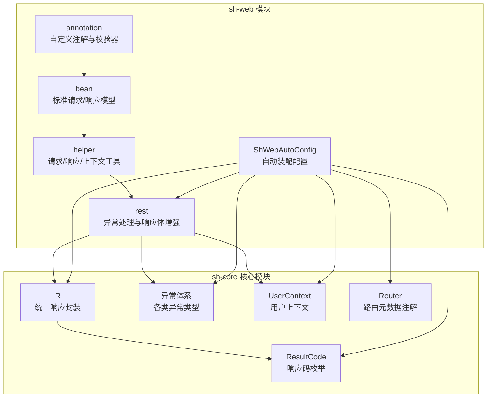
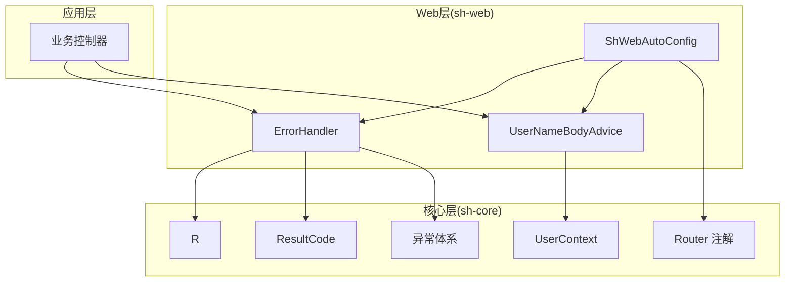
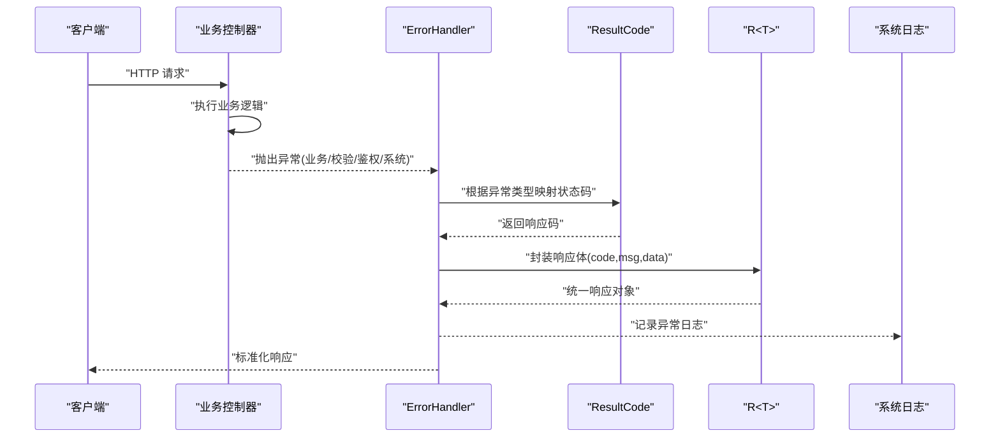
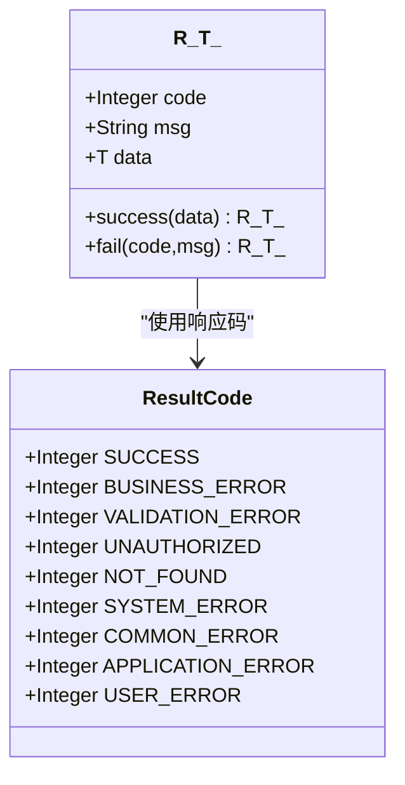
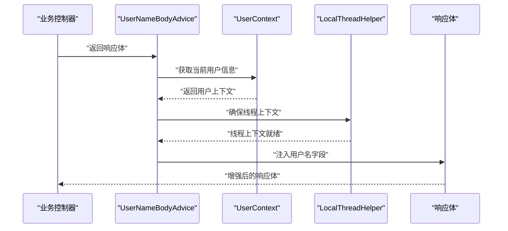
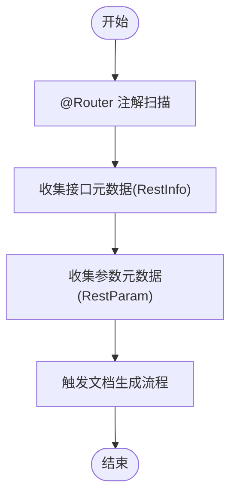
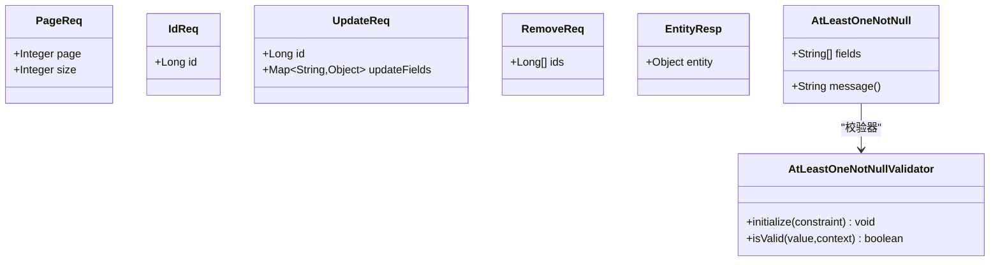
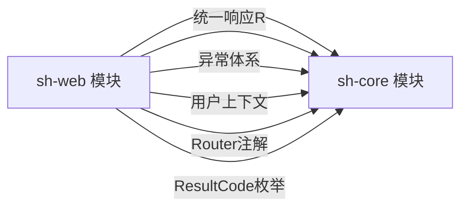

# sh-web模块（Web层集成）

<cite>
**本文档引用的文件**
- [ShWebAutoConfig.java](file://sh-web/src/main/java/com/wkclz/web/ShWebAutoConfig.java)
- [ErrorHandler.java](file://sh-web/src/main/java/com/wkclz/web/rest/ErrorHandler.java)
- [UserNameBodyAdvice.java](file://sh-web/src/main/java/com/wkclz/web/rest/UserNameBodyAdvice.java)
- [AtLeastOneNotNull.java](file://sh-web/src/main/java/com/wkclz/web/annotation/AtLeastOneNotNull.java)
- [AtLeastOneNotNullValidator.java](file://sh-web/src/main/java/com/wkclz/web/annotation/validator/AtLeastOneNotNullValidator.java)
- [R.java](file://sh-core/src/main/java/com/wkclz/core/base/R.java)
- [ResultCode.java](file://sh-core/src/main/java/com/wkclz/core/enums/ResultCode.java)
- [ApiException.java](file://sh-core/src/main/java/com/wkclz/core/exception/ApiException.java)
- [ValidationException.java](file://sh-core/src/main/java/com/wkclz/core/exception/ValidationException.java)
- [UnauthorizedException.java](file://sh-core/src/main/java/com/wkclz/core/exception/UnauthorizedException.java)
- [NotFoundException.java](file://sh-core/src/main/java/com/wkclz/core/exception/NotFoundException.java)
- [SystemException.java](file://sh-core/src/main/java/com/wkclz/core/exception/SystemException.java)
- [CommonException.java](file://sh-core/src/main/java/com/wkclz/core/exception/CommonException.java)
- [ApplicationException.java](file://sh-core/src/main/java/com/wkclz/core/exception/ApplicationException.java)
- [UserException.java](file://sh-core/src/main/java/com/wkclz/core/exception/UserException.java)
- [UserInfo.java](file://sh-core/src/main/java/com/wkclz/core/base/UserInfo.java)
- [UserContext.java](file://sh-core/src/main/java/com/wkclz/core/user/UserContext.java)
- [Router.java](file://sh-core/src/main/java/com/wkclz/core/annotation/Router.java)
- [ApiDesc.java](file://sh-core/src/main/java/com/wkclz/core/annotation/ApiDesc.java)
- [RestInfo.java](file://sh-web/src/main/java/com/wkclz/web/bean/RestInfo.java)
- [RestParam.java](file://sh-web/src/main/java/com/wkclz/web/bean/RestParam.java)
- [PageReq.java](file://sh-web/src/main/java/com/wkclz/web/bean/PageReq.java)
- [IdReq.java](file://sh-web/src/main/java/com/wkclz/web/bean/IdReq.java)
- [UpdateReq.java](file://sh-web/src/main/java/com/wkclz/web/bean/UpdateReq.java)
- [RemoveReq.java](file://sh-web/src/main/java/com/wkclz/web/bean/RemoveReq.java)
- [EntityResp.java](file://sh-web/src/main/java/com/wkclz/web/bean/EntityResp.java)
- [RestHelper.java](file://sh-web/src/main/java/com/wkclz/web/helper/RestHelper.java)
- [RequestHelper.java](file://sh-web/src/main/java/com/wkclz/web/helper/RequestHelper.java)
- [ResponseHelper.java](file://sh-web/src/main/java/com/wkclz/web/helper/ResponseHelper.java)
- [IpHelper.java](file://sh-web/src/main/java/com/wkclz/web/helper/IpHelper.java)
- [LocalThreadHelper.java](file://sh-web/src/main/java/com/wkclz/web/helper/LocalThreadHelper.java)
- [pom.xml](file://sh-web/pom.xml)
</cite>

## 目录
1. [简介](#简介)
2. [项目结构](#项目结构)
3. [核心组件](#核心组件)
4. [架构总览](#架构总览)
5. [详细组件分析](#详细组件分析)
6. [依赖关系分析](#依赖关系分析)
7. [性能考虑](#性能考虑)
8. [故障排查指南](#故障排查指南)
9. [结论](#结论)
10. [附录](#附录)

## 简介
本文件面向sh-web模块的Web层集成，系统性阐述以下主题：全局异常处理机制（含8类异常类型的分类策略与兜底流程）、统一响应封装R<T>的设计理念（响应码体系、数据封装格式、错误信息标准化）、响应体用户名自动填充UserNameBodyAdvice的工作机制与用户上下文获取流程、REST接口元数据扫描机制（@Router注解与API文档生成自动化）、标准请求Bean的参数校验体系（@AtLeastOneNotNull等自定义验证器）。同时提供Web开发最佳实践与集成示例，帮助开发者快速、规范地完成Web层开发。

## 项目结构
sh-web模块采用按功能域分层的组织方式，主要包含以下包：
- annotation：自定义注解与校验器，如@AtLeastOneNotNull及其校验器
- bean：标准请求/响应模型与REST元数据载体
- helper：请求/响应/IP/线程上下文等辅助工具
- rest：Web层异常处理器与响应体增强器
- 配置：自动装配配置类ShWebAutoConfig

图表来源
- [ShWebAutoConfig.java:1-200](file://sh-web/src/main/java/com/wkclz/web/ShWebAutoConfig.java#L1-L200)
- [R.java:1-200](file://sh-core/src/main/java/com/wkclz/core/base/R.java#L1-L200)
- [ResultCode.java:1-200](file://sh-core/src/main/java/com/wkclz/core/enums/ResultCode.java#L1-L200)
- [Router.java:1-200](file://sh-core/src/main/java/com/wkclz/core/annotation/Router.java#L1-L200)

章节来源
- [ShWebAutoConfig.java:1-200](file://sh-web/src/main/java/com/wkclz/web/ShWebAutoConfig.java#L1-L200)
- [pom.xml:1-200](file://sh-web/pom.xml#L1-L200)

## 核心组件
本节聚焦sh-web模块的关键组件与其职责：
- 全局异常处理：ErrorHandler负责捕获并分类处理各类异常，返回统一响应格式
- 统一响应封装：R<T>承载响应码、消息与数据，配合ResultCode枚举实现标准化输出
- 响应体用户名自动填充：UserNameBodyAdvice在响应阶段注入当前用户名
- 参数校验：@AtLeastOneNotNull与AtLeastOneNotNullValidator实现“至少一个字段非空”的复合校验
- REST元数据：@Router与相关Bean用于接口元数据采集与文档生成
- 辅助工具：RequestHelper、ResponseHelper、RestHelper、IpHelper、LocalThreadHelper等支撑Web层常用能力

章节来源
- [ErrorHandler.java:1-200](file://sh-web/src/main/java/com/wkclz/web/rest/ErrorHandler.java#L1-L200)
- [R.java:1-200](file://sh-core/src/main/java/com/wkclz/core/base/R.java#L1-L200)
- [ResultCode.java:1-200](file://sh-core/src/main/java/com/wkclz/core/enums/ResultCode.java#L1-L200)
- [UserNameBodyAdvice.java:1-200](file://sh-web/src/main/java/com/wkclz/web/rest/UserNameBodyAdvice.java#L1-L200)
- [AtLeastOneNotNull.java:1-200](file://sh-web/src/main/java/com/wkclz/web/annotation/AtLeastOneNotNull.java#L1-L200)
- [AtLeastOneNotNullValidator.java:1-200](file://sh-web/src/main/java/com/wkclz/web/annotation/validator/AtLeastOneNotNullValidator.java#L1-L200)
- [Router.java:1-200](file://sh-core/src/main/java/com/wkclz/core/annotation/Router.java#L1-L200)
- [RestInfo.java:1-200](file://sh-web/src/main/java/com/wkclz/web/bean/RestInfo.java#L1-L200)
- [RestParam.java:1-200](file://sh-web/src/main/java/com/wkclz/web/bean/RestParam.java#L1-L200)
- [RequestHelper.java:1-200](file://sh-web/src/main/java/com/wkclz/web/helper/RequestHelper.java#L1-L200)
- [ResponseHelper.java:1-200](file://sh-web/src/main/java/com/wkclz/web/helper/ResponseHelper.java#L1-L200)
- [RestHelper.java:1-200](file://sh-web/src/main/java/com/wkclz/web/helper/RestHelper.java#L1-L200)
- [IpHelper.java:1-200](file://sh-web/src/main/java/com/wkclz/web/helper/IpHelper.java#L1-L200)
- [LocalThreadHelper.java:1-200](file://sh-web/src/main/java/com/wkclz/web/helper/LocalThreadHelper.java#L1-L200)

## 架构总览
下图展示了sh-web模块在整体框架中的位置与交互关系：Web层通过自动装配加载异常处理、响应体增强与校验器；统一响应R<T>与ResultCode为所有接口输出提供一致契约；用户上下文与Router注解支撑鉴权与文档生成。

图表来源
- [ShWebAutoConfig.java:1-200](file://sh-web/src/main/java/com/wkclz/web/ShWebAutoConfig.java#L1-L200)
- [ErrorHandler.java:1-200](file://sh-web/src/main/java/com/wkclz/web/rest/ErrorHandler.java#L1-L200)
- [UserNameBodyAdvice.java:1-200](file://sh-web/src/main/java/com/wkclz/web/rest/UserNameBodyAdvice.java#L1-L200)
- [R.java:1-200](file://sh-core/src/main/java/com/wkclz/core/base/R.java#L1-L200)
- [ResultCode.java:1-200](file://sh-core/src/main/java/com/wkclz/core/enums/ResultCode.java#L1-L200)
- [UserContext.java:1-200](file://sh-core/src/main/java/com/wkclz/core/user/UserContext.java#L1-L200)
- [Router.java:1-200](file://sh-core/src/main/java/com/wkclz/core/annotation/Router.java#L1-L200)

## 详细组件分析

### 全局异常处理机制
sh-web通过ErrorHandler对Web层抛出的异常进行集中捕获与分类处理，确保对外输出统一、可追踪的响应格式。异常体系覆盖业务异常、参数校验异常、鉴权异常、系统异常、通用异常等场景，并结合ResultCode与R<T>实现标准化响应。

图表来源
- [ErrorHandler.java:1-200](file://sh-web/src/main/java/com/wkclz/web/rest/ErrorHandler.java#L1-L200)
- [R.java:1-200](file://sh-core/src/main/java/com/wkclz/core/base/R.java#L1-L200)
- [ResultCode.java:1-200](file://sh-core/src/main/java/com/wkclz/core/enums/ResultCode.java#L1-L200)
- [ApiException.java:1-200](file://sh-core/src/main/java/com/wkclz/core/exception/ApiException.java#L1-L200)
- [ValidationException.java:1-200](file://sh-core/src/main/java/com/wkclz/core/exception/ValidationException.java#L1-L200)
- [UnauthorizedException.java:1-200](file://sh-core/src/main/java/com/wkclz/core/exception/UnauthorizedException.java#L1-L200)
- [NotFoundException.java:1-200](file://sh-core/src/main/java/com/wkclz/core/exception/NotFoundException.java#L1-L200)
- [SystemException.java:1-200](file://sh-core/src/main/java/com/wkclz/core/exception/SystemException.java#L1-L200)
- [CommonException.java:1-200](file://sh-core/src/main/java/com/wkclz/core/exception/CommonException.java#L1-L200)
- [ApplicationException.java:1-200](file://sh-core/src/main/java/com/wkclz/core/exception/ApplicationException.java#L1-L200)
- [UserException.java:1-200](file://sh-core/src/main/java/com/wkclz/core/exception/UserException.java#L1-L200)

异常分类与兜底策略要点
- 业务异常(ApiException)：由业务代码主动抛出，携带明确的业务语义与提示，统一映射到业务响应码
- 参数校验异常(ValidationException)：参数不合法时抛出，映射到参数校验响应码，错误信息标准化
- 鉴权异常(UnauthorizedException)：权限不足或未登录，映射到鉴权失败响应码
- 资源不存在(NotFoundException)：访问资源不存在，映射到资源不存在响应码
- 系统异常(SystemException)：底层系统错误，映射到系统异常响应码并记录日志
- 通用异常(CommonException)：未归类的通用错误，兜底为通用响应码
- 应用异常(ApplicationException)：应用层异常，映射到应用异常响应码
- 用户异常(UserException)：用户相关异常，映射到用户异常响应码

章节来源
- [ErrorHandler.java:1-200](file://sh-web/src/main/java/com/wkclz/web/rest/ErrorHandler.java#L1-L200)
- [ApiException.java:1-200](file://sh-core/src/main/java/com/wkclz/core/exception/ApiException.java#L1-L200)
- [ValidationException.java:1-200](file://sh-core/src/main/java/com/wkclz/core/exception/ValidationException.java#L1-L200)
- [UnauthorizedException.java:1-200](file://sh-core/src/main/java/com/wkclz/core/exception/UnauthorizedException.java#L1-L200)
- [NotFoundException.java:1-200](file://sh-core/src/main/java/com/wkclz/core/exception/NotFoundException.java#L1-L200)
- [SystemException.java:1-200](file://sh-core/src/main/java/com/wkclz/core/exception/SystemException.java#L1-L200)
- [CommonException.java:1-200](file://sh-core/src/main/java/com/wkclz/core/exception/CommonException.java#L1-L200)
- [ApplicationException.java:1-200](file://sh-core/src/main/java/com/wkclz/core/exception/ApplicationException.java#L1-L200)
- [UserException.java:1-200](file://sh-core/src/main/java/com/wkclz/core/exception/UserException.java#L1-L200)

### 统一响应封装R<T>
R<T>是Web层统一的响应载体，其设计理念包括：
- 响应码体系：通过ResultCode枚举定义标准响应码，涵盖成功、业务失败、参数校验失败、鉴权失败、系统异常、通用异常等
- 数据封装格式：包含响应码、消息与泛型数据体，便于前端统一处理
- 错误信息标准化：异常处理后统一转换为R<T>，保证前后端契约一致

图表来源
- [R.java:1-200](file://sh-core/src/main/java/com/wkclz/core/base/R.java#L1-L200)
- [ResultCode.java:1-200](file://sh-core/src/main/java/com/wkclz/core/enums/ResultCode.java#L1-L200)

章节来源
- [R.java:1-200](file://sh-core/src/main/java/com/wkclz/core/base/R.java#L1-L200)
- [ResultCode.java:1-200](file://sh-core/src/main/java/com/wkclz/core/enums/ResultCode.java#L1-L200)

### 响应体用户名自动填充UserNameBodyAdvice
UserNameBodyAdvice在响应阶段对响应体进行增强，自动注入当前用户的用户名，提升审计与可观测性。其工作机制如下：
- 获取用户上下文：从UserContext中读取当前用户信息
- 判断响应体：仅对符合规则的响应体进行增强
- 注入用户名：向响应体写入用户名字段
- 线程安全：通过LocalThreadHelper确保多线程环境下的正确性

图表来源
- [UserNameBodyAdvice.java:1-200](file://sh-web/src/main/java/com/wkclz/web/rest/UserNameBodyAdvice.java#L1-L200)
- [UserContext.java:1-200](file://sh-core/src/main/java/com/wkclz/core/user/UserContext.java#L1-L200)
- [UserInfo.java:1-200](file://sh-core/src/main/java/com/wkclz/core/base/UserInfo.java#L1-L200)
- [LocalThreadHelper.java:1-200](file://sh-web/src/main/java/com/wkclz/web/helper/LocalThreadHelper.java#L1-L200)

章节来源
- [UserNameBodyAdvice.java:1-200](file://sh-web/src/main/java/com/wkclz/web/rest/UserNameBodyAdvice.java#L1-L200)
- [UserContext.java:1-200](file://sh-core/src/main/java/com/wkclz/core/user/UserContext.java#L1-L200)
- [UserInfo.java:1-200](file://sh-core/src/main/java/com/wkclz/core/base/UserInfo.java#L1-L200)
- [LocalThreadHelper.java:1-200](file://sh-web/src/main/java/com/wkclz/web/helper/LocalThreadHelper.java#L1-L200)

### REST接口元数据扫描机制
@Router注解用于标注REST接口的元数据，结合RestInfo、RestParam等Bean实现接口元数据的采集与文档生成自动化：
- @Router：标注在控制器方法上，声明接口的路由、描述、版本等元信息
- RestInfo：封装接口元数据，供文档生成器消费
- RestParam：封装请求参数元数据，支持参数名、类型、是否必填等
- 自动装配：ShWebAutoConfig加载相关组件，完成元数据扫描与注册

图表来源
- [Router.java:1-200](file://sh-core/src/main/java/com/wkclz/core/annotation/Router.java#L1-L200)
- [RestInfo.java:1-200](file://sh-web/src/main/java/com/wkclz/web/bean/RestInfo.java#L1-L200)
- [RestParam.java:1-200](file://sh-web/src/main/java/com/wkclz/web/bean/RestParam.java#L1-L200)
- [ApiDesc.java:1-200](file://sh-core/src/main/java/com/wkclz/core/annotation/ApiDesc.java#L1-L200)
- [ShWebAutoConfig.java:1-200](file://sh-web/src/main/java/com/wkclz/web/ShWebAutoConfig.java#L1-L200)

章节来源
- [Router.java:1-200](file://sh-core/src/main/java/com/wkclz/core/annotation/Router.java#L1-L200)
- [RestInfo.java:1-200](file://sh-web/src/main/java/com/wkclz/web/bean/RestInfo.java#L1-L200)
- [RestParam.java:1-200](file://sh-web/src/main/java/com/wkclz/web/bean/RestParam.java#L1-L200)
- [ApiDesc.java:1-200](file://sh-core/src/main/java/com/wkclz/core/annotation/ApiDesc.java#L1-L200)
- [ShWebAutoConfig.java:1-200](file://sh-web/src/main/java/com/wkclz/web/ShWebAutoConfig.java#L1-L200)

### 标准请求Bean与参数校验体系
sh-web提供标准请求Bean与参数校验体系，确保请求数据的一致性与合法性：
- 标准请求Bean：PageReq、IdReq、UpdateReq、RemoveReq、EntityResp等，统一请求/响应结构
- 参数校验：@AtLeastOneNotNull注解与AtLeastOneNotNullValidator实现“至少一个字段非空”的复合校验，适用于复杂参数组合的校验场景

图表来源
- [PageReq.java:1-200](file://sh-web/src/main/java/com/wkclz/web/bean/PageReq.java#L1-L200)
- [IdReq.java:1-200](file://sh-web/src/main/java/com/wkclz/web/bean/IdReq.java#L1-L200)
- [UpdateReq.java:1-200](file://sh-web/src/main/java/com/wkclz/web/bean/UpdateReq.java#L1-L200)
- [RemoveReq.java:1-200](file://sh-web/src/main/java/com/wkclz/web/bean/RemoveReq.java#L1-L200)
- [EntityResp.java:1-200](file://sh-web/src/main/java/com/wkclz/web/bean/EntityResp.java#L1-L200)
- [AtLeastOneNotNull.java:1-200](file://sh-web/src/main/java/com/wkclz/web/annotation/AtLeastOneNotNull.java#L1-L200)
- [AtLeastOneNotNullValidator.java:1-200](file://sh-web/src/main/java/com/wkclz/web/annotation/validator/AtLeastOneNotNullValidator.java#L1-L200)

章节来源
- [PageReq.java:1-200](file://sh-web/src/main/java/com/wkclz/web/bean/PageReq.java#L1-L200)
- [IdReq.java:1-200](file://sh-web/src/main/java/com/wkclz/web/bean/IdReq.java#L1-L200)
- [UpdateReq.java:1-200](file://sh-web/src/main/java/com/wkclz/web/bean/UpdateReq.java#L1-L200)
- [RemoveReq.java:1-200](file://sh-web/src/main/java/com/wkclz/web/bean/RemoveReq.java#L1-L200)
- [EntityResp.java:1-200](file://sh-web/src/main/java/com/wkclz/web/bean/EntityResp.java#L1-L200)
- [AtLeastOneNotNull.java:1-200](file://sh-web/src/main/java/com/wkclz/web/annotation/AtLeastOneNotNull.java#L1-L200)
- [AtLeastOneNotNullValidator.java:1-200](file://sh-web/src/main/java/com/wkclz/web/annotation/validator/AtLeastOneNotNullValidator.java#L1-L200)

## 依赖关系分析
sh-web模块与sh-core模块存在强耦合关系，前者依赖后者提供的统一响应、异常体系、用户上下文与注解元数据。下图展示关键依赖：

图表来源
- [ShWebAutoConfig.java:1-200](file://sh-web/src/main/java/com/wkclz/web/ShWebAutoConfig.java#L1-L200)
- [R.java:1-200](file://sh-core/src/main/java/com/wkclz/core/base/R.java#L1-L200)
- [ResultCode.java:1-200](file://sh-core/src/main/java/com/wkclz/core/enums/ResultCode.java#L1-L200)
- [UserContext.java:1-200](file://sh-core/src/main/java/com/wkclz/core/user/UserContext.java#L1-L200)
- [Router.java:1-200](file://sh-core/src/main/java/com/wkclz/core/annotation/Router.java#L1-L200)

章节来源
- [ShWebAutoConfig.java:1-200](file://sh-web/src/main/java/com/wkclz/web/ShWebAutoConfig.java#L1-L200)
- [R.java:1-200](file://sh-core/src/main/java/com/wkclz/core/base/R.java#L1-L200)
- [ResultCode.java:1-200](file://sh-core/src/main/java/com/wkclz/core/enums/ResultCode.java#L1-L200)
- [UserContext.java:1-200](file://sh-core/src/main/java/com/wkclz/core/user/UserContext.java#L1-L200)
- [Router.java:1-200](file://sh-core/src/main/java/com/wkclz/core/annotation/Router.java#L1-L200)

## 性能考虑
- 异常处理路径尽量短路：在业务层尽早校验参数，减少无效调用
- 响应体增强最小化：UserNameBodyAdvice仅在必要时注入用户名，避免重复序列化
- 线程上下文管理：通过LocalThreadHelper确保上下文传递，避免线程切换导致的上下文丢失
- 日志与监控：异常处理时记录关键信息，便于后续性能分析与问题定位

## 故障排查指南
- 统一响应未生效：检查ShWebAutoConfig是否正确加载，确认R<T>与ResultCode的使用一致性
- 异常未被分类处理：核对ErrorHandler的异常映射逻辑，确保每类异常都有对应分支
- 用户名未注入：检查UserContext是否正确设置，UserNameBodyAdvice是否启用
- 参数校验失效：确认@AtLeastOneNotNull注解与校验器绑定正确，且在控制器方法参数上使用
- 文档生成异常：检查@Router注解是否正确标注，RestInfo/RestParam是否完整

章节来源
- [ErrorHandler.java:1-200](file://sh-web/src/main/java/com/wkclz/web/rest/ErrorHandler.java#L1-L200)
- [UserNameBodyAdvice.java:1-200](file://sh-web/src/main/java/com/wkclz/web/rest/UserNameBodyAdvice.java#L1-L200)
- [AtLeastOneNotNullValidator.java:1-200](file://sh-web/src/main/java/com/wkclz/web/annotation/validator/AtLeastOneNotNullValidator.java#L1-L200)
- [ShWebAutoConfig.java:1-200](file://sh-web/src/main/java/com/wkclz/web/ShWebAutoConfig.java#L1-L200)

## 结论
sh-web模块通过统一响应封装、全局异常处理、响应体增强、参数校验与元数据扫描等机制，构建了高内聚、低耦合的Web层基础设施。遵循本文档的最佳实践与集成示例，可显著提升Web开发效率与系统稳定性。

## 附录
- Web开发最佳实践
  - 使用标准请求Bean统一请求/响应结构
  - 在控制器方法上使用@AtLeastOneNotNull等校验注解
  - 优先使用R<T>返回统一响应
  - 通过@Router与RestInfo/RestParam完善接口元数据
  - 异常处理遵循“早发现、早报错、统一格式”原则
- 集成示例（步骤概述）
  - 引入sh-web与sh-core依赖
  - 启用ShWebAutoConfig自动装配
  - 在控制器中使用标准请求Bean与校验注解
  - 抛出业务异常时使用ApiException等类型
  - 通过UserContext与UserNameBodyAdvice实现审计追踪