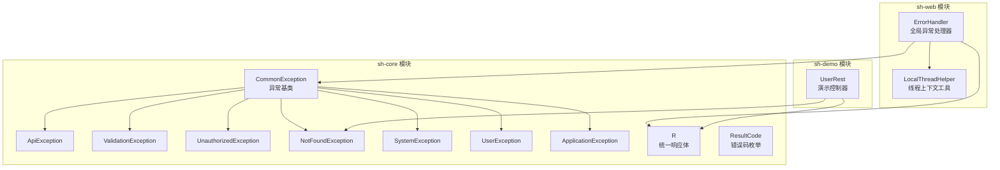
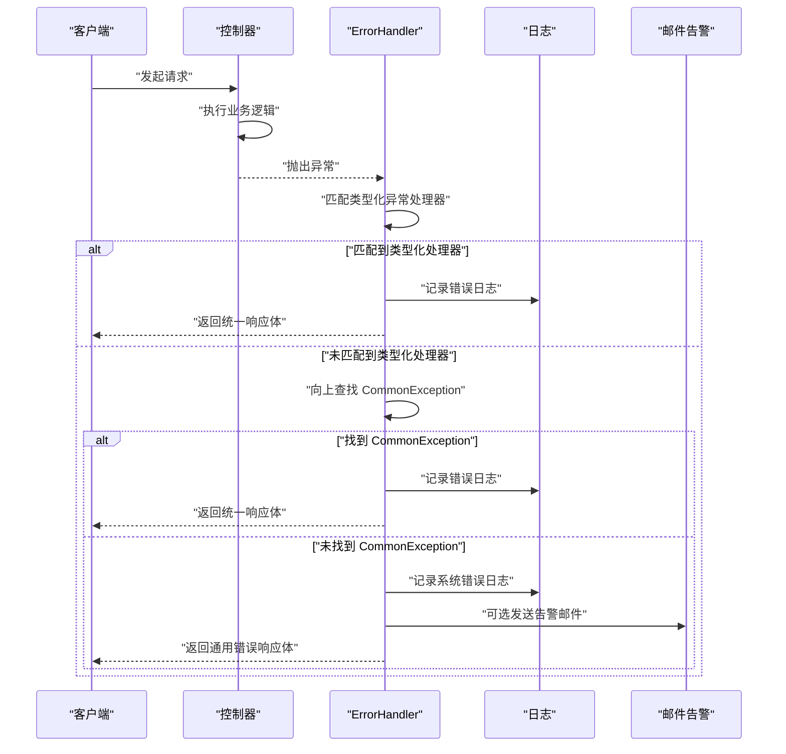
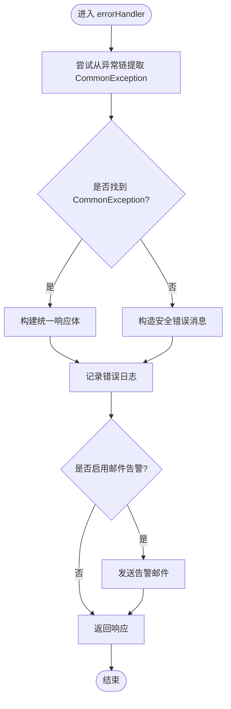
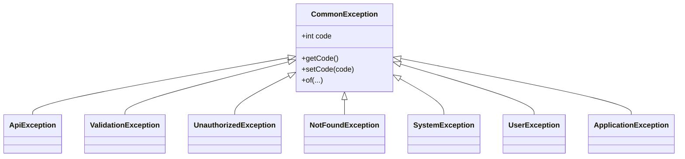
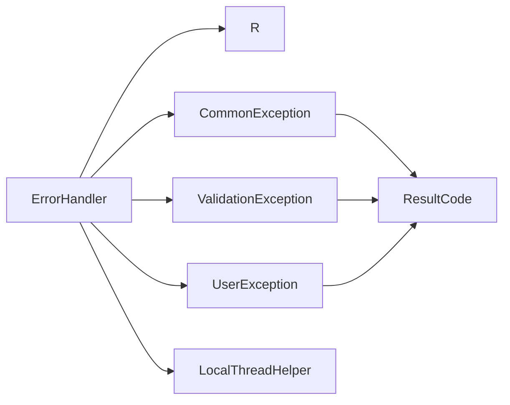

# 全局异常处理机制

<cite>
**本文引用的文件**
- [sh-web 模块 ErrorHandler.java](file://sh-web/src/main/java/com/wkclz/web/rest/ErrorHandler.java)
- [sh-core 模块 CommonException.java](file://sh-core/src/main/java/com/wkclz/core/exception/CommonException.java)
- [sh-core 模块 ApiException.java](file://sh-core/src/main/java/com/wkclz/core/exception/ApiException.java)
- [sh-core 模块 ValidationException.java](file://sh-core/src/main/java/com/wkclz/core/exception/ValidationException.java)
- [sh-core 模块 UnauthorizedException.java](file://sh-core/src/main/java/com/wkclz/core/exception/UnauthorizedException.java)
- [sh-core 模块 NotFoundException.java](file://sh-core/src/main/java/com/wkclz/core/exception/NotFoundException.java)
- [sh-core 模块 SystemException.java](file://sh-core/src/main/java/com/wkclz/core/exception/SystemException.java)
- [sh-core 模块 UserException.java](file://sh-core/src/main/java/com/wkclz/core/exception/UserException.java)
- [sh-core 模块 ApplicationException.java](file://sh-core/src/main/java/com/wkclz/core/exception/ApplicationException.java)
- [sh-core 模块 R.java](file://sh-core/src/main/java/com/wkclz/core/base/R.java)
- [sh-core 模块 ResultCode.java](file://sh-core/src/main/java/com/wkclz/core/enums/ResultCode.java)
- [sh-web 模块 LocalThreadHelper.java](file://sh-web/src/main/java/com/wkclz/web/helper/LocalThreadHelper.java)
- [sh-demo 模块 UserRest.java](file://sh-demo/src/main/java/com/wkclz/demo/rest/UserRest.java)
</cite>

## 目录
1. [简介](#简介)
2. [项目结构](#项目结构)
3. [核心组件](#核心组件)
4. [架构总览](#架构总览)
5. [详细组件分析](#详细组件分析)
6. [依赖关系分析](#依赖关系分析)
7. [性能考量](#性能考量)
8. [故障排查指南](#故障排查指南)
9. [结论](#结论)
10. [附录](#附录)

## 简介
本文件系统性梳理 sh-web 模块的全局异常处理机制，覆盖 8 种业务异常类型（ApiException、ValidationException、UnauthorizedException、NotFoundException、SystemException、UserException、ApplicationException）的分类处理策略与错误码映射；详解 ErrorHandler 的实现原理（异常捕获流程、错误响应格式化、HTTP 状态码设置）；阐述兜底异常处理机制（未捕获异常的统一处理与日志记录策略）；并提供最佳实践与自定义异常类型的扩展方法。

## 项目结构
- sh-web 模块提供基于 Spring MVC 的全局异常处理器，集中处理各类异常并输出统一响应。
- sh-core 模块提供异常基类、业务异常类型、统一响应体 R 与错误码枚举，作为异常处理的基础设施。
- sh-demo 模块演示如何在控制器中抛出业务异常，配合全局处理器返回统一响应。

图表来源
- [sh-web 模块 ErrorHandler.java:1-267](file://sh-web/src/main/java/com/wkclz/web/rest/ErrorHandler.java#L1-L267)
- [sh-core 模块 CommonException.java:1-64](file://sh-core/src/main/java/com/wkclz/core/exception/CommonException.java#L1-L64)
- [sh-core 模块 R.java:1-76](file://sh-core/src/main/java/com/wkclz/core/base/R.java#L1-L76)
- [sh-demo 模块 UserRest.java:1-98](file://sh-demo/src/main/java/com/wkclz/demo/rest/UserRest.java#L1-L98)

章节来源
- [sh-web 模块 ErrorHandler.java:1-267](file://sh-web/src/main/java/com/wkclz/web/rest/ErrorHandler.java#L1-L267)
- [sh-core 模块 CommonException.java:1-64](file://sh-core/src/main/java/com/wkclz/core/exception/CommonException.java#L1-L64)
- [sh-core 模块 R.java:1-76](file://sh-core/src/main/java/com/wkclz/core/base/R.java#L1-L76)
- [sh-demo 模块 UserRest.java:1-98](file://sh-demo/src/main/java/com/wkclz/demo/rest/UserRest.java#L1-L98)

## 核心组件
- 全局异常处理器：基于 @RestControllerAdvice，集中捕获各类异常并返回统一响应体。
- 统一响应体 R：标准化 code/msg/data/costTime 等字段，便于前端消费。
- 异常基类与派生异常：以 CommonException 为基类，派生出 8 种业务异常类型，支持 ResultCode 枚举与自定义 code/message。
- 线程上下文工具：LocalThreadHelper 提供线程级键值存储，用于在异常处理中传递请求信息与错误详情。

章节来源
- [sh-web 模块 ErrorHandler.java:40-267](file://sh-web/src/main/java/com/wkclz/web/rest/ErrorHandler.java#L40-L267)
- [sh-core 模块 R.java:11-76](file://sh-core/src/main/java/com/wkclz/core/base/R.java#L11-L76)
- [sh-core 模块 CommonException.java:10-64](file://sh-core/src/main/java/com/wkclz/core/exception/CommonException.java#L10-L64)
- [sh-web 模块 LocalThreadHelper.java:12-95](file://sh-web/src/main/java/com/wkclz/web/helper/LocalThreadHelper.java#L12-L95)

## 架构总览
全局异常处理采用“类型化捕获 + 兜底捕获”的双层策略：
- 类型化捕获：对已知异常（如参数校验、HTTP 方法/媒体类型不支持、数据库语法错误等）进行精确处理，返回对应 HTTP 状态码与统一响应。
- 兜底捕获：对未知异常，尝试向上查找 CommonException，若命中则按其 code/msg 输出；否则输出通用错误信息并记录日志与可选告警。

图表来源
- [sh-web 模块 ErrorHandler.java:131-148](file://sh-web/src/main/java/com/wkclz/web/rest/ErrorHandler.java#L131-L148)
- [sh-core 模块 R.java:61-71](file://sh-core/src/main/java/com/wkclz/core/base/R.java#L61-L71)

## 详细组件分析

### ErrorHandler 实现原理
- 注解与职责
  - 使用 @RestControllerAdvice 对控制器层异常进行统一捕获。
  - 通过 @ExceptionHandler 指定不同异常类型的处理方法，分别设置合适的 HTTP 状态码与响应体。
- 异常捕获流程
  - 类型化捕获：优先匹配具体异常类型（如 MethodArgumentNotValidException、BindException、SQLSyntaxErrorException 等），返回对应状态码与消息。
  - 兜底捕获：匹配到 Exception.class 后，先尝试从异常链中提取 CommonException；若未命中，则构造通用错误响应。
- 错误响应格式化
  - 统一使用 R.error(...) 输出，支持传入 code/msg、CommonException 或模板消息。
  - 对于用户异常（UserException）与系统异常，日志级别与告警策略不同。
- HTTP 状态码设置
  - 显式设置 response.setStatus(...)，确保与 R 中的 code 一致或语义一致。
- 日志与告警
  - 记录请求方法、URI、错误摘要与完整堆栈。
  - 可选发送邮件告警，内容包含请求详情、异常摘要与堆栈。
- 线程上下文传递
  - 将错误信息写入 LocalThreadHelper，供后续过滤器/拦截器使用。

图表来源
- [sh-web 模块 ErrorHandler.java:131-216](file://sh-web/src/main/java/com/wkclz/web/rest/ErrorHandler.java#L131-L216)
- [sh-web 模块 LocalThreadHelper.java:18-216](file://sh-web/src/main/java/com/wkclz/web/helper/LocalThreadHelper.java#L18-L216)

章节来源
- [sh-web 模块 ErrorHandler.java:40-267](file://sh-web/src/main/java/com/wkclz/web/rest/ErrorHandler.java#L40-L267)
- [sh-web 模块 LocalThreadHelper.java:12-95](file://sh-web/src/main/java/com/wkclz/web/helper/LocalThreadHelper.java#L12-L95)

### 8 种业务异常类型与错误码映射
- 异常基类与派生类
  - CommonException：所有业务异常的基类，支持 ResultCode、自定义 code/message 与模板化 of(...) 工厂方法。
  - ApiException、ValidationException、UnauthorizedException、NotFoundException、SystemException、UserException、ApplicationException：均继承自 CommonException，面向不同业务场景。
- 错误码映射
  - 若使用 ResultCode 构造，code/msg 由枚举决定；若使用自定义 code/message，则直接采用传入值。
  - 统一响应体 R.error(...) 会将 code/msg 填充到响应体字段中。

图表来源
- [sh-core 模块 CommonException.java:10-64](file://sh-core/src/main/java/com/wkclz/core/exception/CommonException.java#L10-L64)
- [sh-core 模块 ApiException.java:10-48](file://sh-core/src/main/java/com/wkclz/core/exception/ApiException.java#L10-L48)
- [sh-core 模块 ValidationException.java:10-48](file://sh-core/src/main/java/com/wkclz/core/exception/ValidationException.java#L10-L48)
- [sh-core 模块 UnauthorizedException.java:10-48](file://sh-core/src/main/java/com/wkclz/core/exception/UnauthorizedException.java#L10-L48)
- [sh-core 模块 NotFoundException.java:10-48](file://sh-core/src/main/java/com/wkclz/core/exception/NotFoundException.java#L10-L48)
- [sh-core 模块 SystemException.java:10-48](file://sh-core/src/main/java/com/wkclz/core/exception/SystemException.java#L10-L48)
- [sh-core 模块 UserException.java:10-48](file://sh-core/src/main/java/com/wkclz/core/exception/UserException.java#L10-L48)
- [sh-core 模块 ApplicationException.java:10-48](file://sh-core/src/main/java/com/wkclz/core/exception/ApplicationException.java#L10-L48)

章节来源
- [sh-core 模块 CommonException.java:10-64](file://sh-core/src/main/java/com/wkclz/core/exception/CommonException.java#L10-L64)
- [sh-core 模块 ResultCode.java:7-77](file://sh-core/src/main/java/com/wkclz/core/enums/ResultCode.java#L7-L77)
- [sh-core 模块 R.java:61-71](file://sh-core/src/main/java/com/wkclz/core/base/R.java#L61-L71)

### 类型化异常处理策略
- 参数校验类
  - MethodArgumentNotValidException：取第一个字段错误消息，返回 400。
  - BindException：取第一个字段错误消息，返回 400。
  - ValidationException：使用其 code/msg，返回 400。
- HTTP 协议类
  - HttpRequestMethodNotSupportedException：返回 405。
  - HttpMediaTypeNotSupportedException：返回 415。
  - NoResourceFoundException：返回 404。
- 数据库类
  - SQLSyntaxErrorException、BadSqlGrammarException、UncategorizedSQLException、MysqlDataTruncation：返回 500。
- 业务异常类
  - CommonException：返回 500，使用 -1 作为默认 code（可通过子类覆盖）。
- 兜底异常
  - Exception：若非业务异常，构造通用错误消息，返回 500，并记录系统错误日志与可选告警。

章节来源
- [sh-web 模块 ErrorHandler.java:49-148](file://sh-web/src/main/java/com/wkclz/web/rest/ErrorHandler.java#L49-L148)

### 兜底异常处理与日志记录
- 异常链查找
  - 在兜底处理前，最多向上追溯 3 层 cause，寻找 CommonException，避免遗漏业务异常包装。
- 日志分级
  - UserException：业务异常，记录 biz error 日志。
  - 其他异常：系统异常，记录 sys request 日志并附带完整堆栈。
- 告警策略
  - 通过 SystemConfig 控制是否启用邮件告警，若启用则拼装 HTML 内容并发送。
- 线程上下文
  - 将错误摘要写入 LocalThreadHelper，供后续流程使用。

章节来源
- [sh-web 模块 ErrorHandler.java:154-216](file://sh-web/src/main/java/com/wkclz/web/rest/ErrorHandler.java#L154-L216)
- [sh-web 模块 LocalThreadHelper.java:18-216](file://sh-web/src/main/java/com/wkclz/web/helper/LocalThreadHelper.java#L18-L216)

### 统一响应体 R 的设计
- 字段
  - code：错误码或成功码。
  - msg：错误描述或成功描述。
  - data：承载业务数据或空。
  - requestTime/responseTime/costTime：请求/响应时间与耗时。
- 工厂方法
  - ok(...)：成功响应。
  - warn(...)：警告/校验错误响应。
  - error(...)：错误响应，支持多种签名（code+msg、CommonException、模板消息等）。

章节来源
- [sh-core 模块 R.java:12-76](file://sh-core/src/main/java/com/wkclz/core/base/R.java#L12-L76)

### 示例：在控制器中抛出业务异常
- UserRest 在查询用户详情时，若用户不存在，抛出 NotFoundException.of(...)，交由全局处理器统一处理。
- 处理器将返回统一响应体，code/msg 由 NotFoundException 决定。

章节来源
- [sh-demo 模块 UserRest.java:50-56](file://sh-demo/src/main/java/com/wkclz/demo/rest/UserRest.java#L50-L56)
- [sh-core 模块 NotFoundException.java:10-48](file://sh-core/src/main/java/com/wkclz/core/exception/NotFoundException.java#L10-L48)

## 依赖关系分析
- ErrorHandler 依赖
  - sh-core：R、CommonException、UserException、ValidationException 等。
  - sh-web：LocalThreadHelper（线程上下文）、Spring MVC 异常模型。
  - 外部：日志、邮件工具、系统配置。
- 异常类型依赖
  - 8 种业务异常均依赖 CommonException 与 ResultCode，形成清晰的继承层次与错误码体系。

图表来源
- [sh-web 模块 ErrorHandler.java:6-28](file://sh-web/src/main/java/com/wkclz/web/rest/ErrorHandler.java#L6-L28)
- [sh-core 模块 CommonException.java:10-64](file://sh-core/src/main/java/com/wkclz/core/exception/CommonException.java#L10-L64)
- [sh-core 模块 ResultCode.java:7-77](file://sh-core/src/main/java/com/wkclz/core/enums/ResultCode.java#L7-L77)
- [sh-web 模块 LocalThreadHelper.java:12-95](file://sh-web/src/main/java/com/wkclz/web/helper/LocalThreadHelper.java#L12-L95)

章节来源
- [sh-web 模块 ErrorHandler.java:1-267](file://sh-web/src/main/java/com/wkclz/web/rest/ErrorHandler.java#L1-L267)
- [sh-core 模块 CommonException.java:1-64](file://sh-core/src/main/java/com/wkclz/core/exception/CommonException.java#L1-L64)
- [sh-core 模块 ResultCode.java:1-77](file://sh-core/src/main/java/com/wkclz/core/enums/ResultCode.java#L1-L77)
- [sh-web 模块 LocalThreadHelper.java:1-95](file://sh-web/src/main/java/com/wkclz/web/helper/LocalThreadHelper.java#L1-L95)

## 性能考量
- 异常链查找深度限制：最多向上追溯 3 层 cause，避免深层异常链导致的性能损耗。
- 日志与告警：仅在系统异常路径记录完整堆栈；业务异常仅记录摘要，兼顾可观测性与性能。
- 响应体序列化：R 为简单 POJO，序列化开销低；模板消息在构造阶段完成格式化，减少运行时负担。

## 故障排查指南
- 未生效的类型化处理
  - 检查异常是否被上层包装，导致类型不匹配；必要时在处理器中增加 getCommonException(...) 的调用。
- 响应码与业务码不一致
  - 确认处理器中显式设置了 response.setStatus(...)，并与 R 中 code 保持一致或语义一致。
- 响应内容泄露敏感信息
  - 兜底处理会过滤空消息，但建议在生产环境禁用堆栈直接回传客户端，确保仅记录日志。
- 邮件告警未触发
  - 检查 SystemConfig 中告警开关、SMTP 配置与收件人列表。
- 请求详情缺失
  - 确保 LocalThreadHelper 在异常发生前已写入 REQUEST_LOG，并在异常日志中正确读取。

章节来源
- [sh-web 模块 ErrorHandler.java:167-216](file://sh-web/src/main/java/com/wkclz/web/rest/ErrorHandler.java#L167-L216)
- [sh-web 模块 LocalThreadHelper.java:18-216](file://sh-web/src/main/java/com/wkclz/web/helper/LocalThreadHelper.java#L18-L216)

## 结论
该全局异常处理机制通过类型化与兜底双重策略，实现了对各类异常的精准与稳健处理；结合统一响应体与错误码体系，提升了前后端交互的一致性与可观测性；同时具备完善的日志与告警能力，有助于快速定位问题。遵循本文最佳实践与扩展方法，可在不破坏现有契约的前提下灵活新增异常类型与处理策略。

## 附录

### 最佳实践
- 优先使用 ResultCode 构造业务异常，确保错误码与语义统一。
- 对外响应仅暴露必要信息，避免直接回传堆栈；敏感信息仅记录日志。
- 在业务层尽早抛出明确的业务异常类型，便于前端针对性处理。
- 自定义异常类型时，尽量复用 CommonException 的工厂方法与模板能力。

### 自定义异常类型的扩展方法
- 新建异常类继承 CommonException，并提供多种构造函数（message、ResultCode、code+message 等）。
- 在 ErrorHandler 中添加对应的 @ExceptionHandler，设置合适的状态码与响应体。
- 如需模板化消息，沿用 of(...) 工厂方法，保持与现有异常风格一致。
- 在控制器中抛出新异常类型，确保全局处理器能够捕获并返回统一响应。

章节来源
- [sh-core 模块 CommonException.java:14-55](file://sh-core/src/main/java/com/wkclz/core/exception/CommonException.java#L14-L55)
- [sh-core 模块 R.java:61-71](file://sh-core/src/main/java/com/wkclz/core/base/R.java#L61-L71)
- [sh-web 模块 ErrorHandler.java:99-129](file://sh-web/src/main/java/com/wkclz/web/rest/ErrorHandler.java#L99-L129)