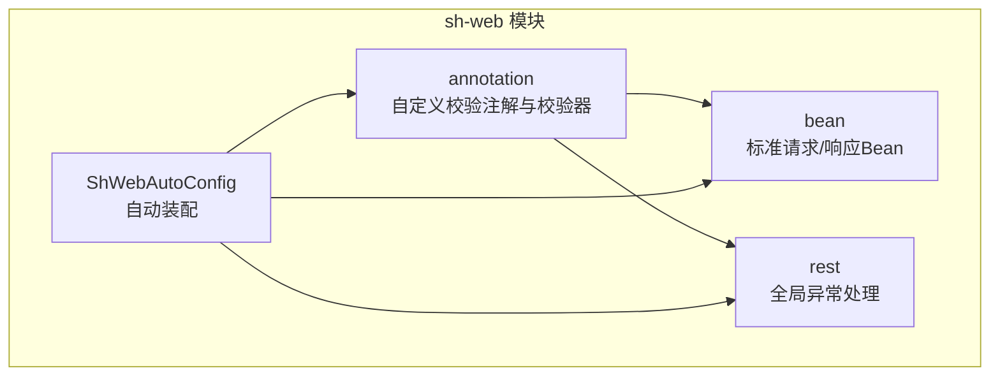
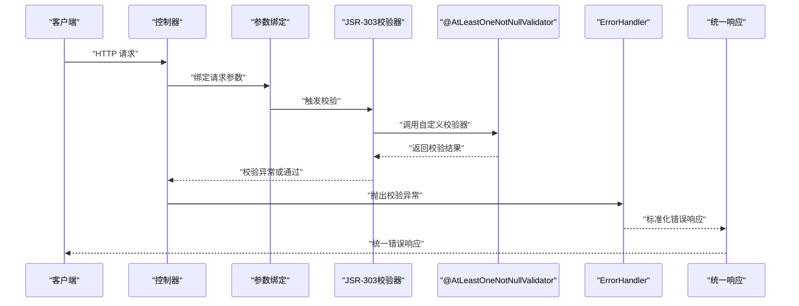
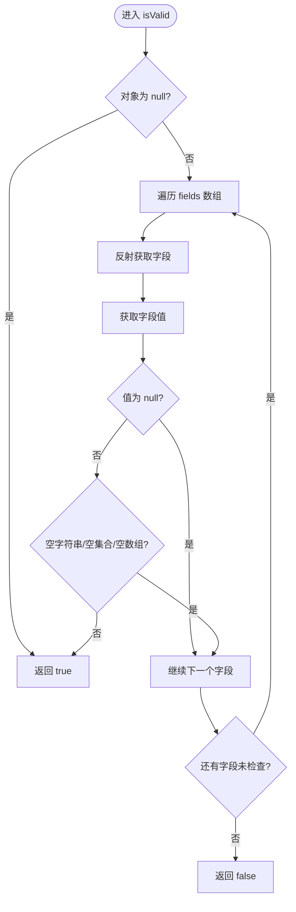
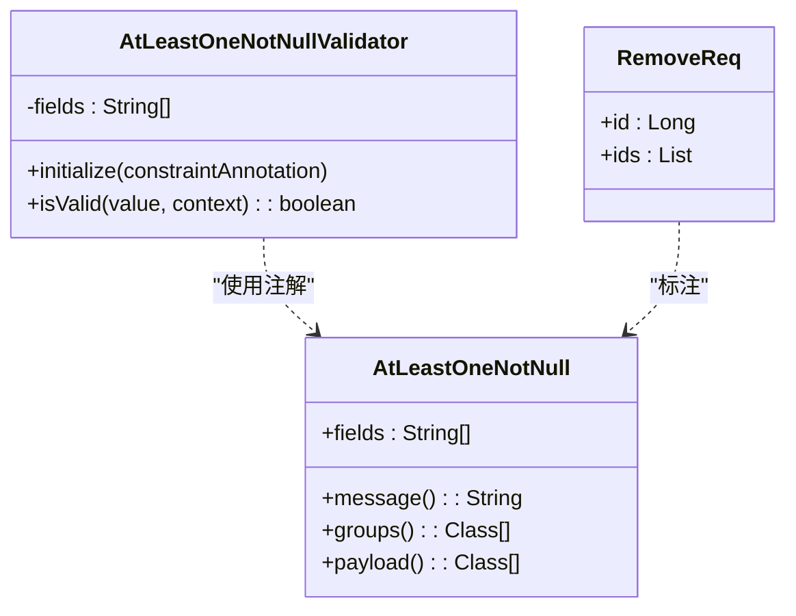

# 参数校验与标准请求Bean

<cite>
**本文档引用的文件**
- [AtLeastOneNotNull.java](file://sh-web/src/main/java/com/wkclz/web/annotation/AtLeastOneNotNull.java)
- [AtLeastOneNotNullValidator.java](file://sh-web/src/main/java/com/wkclz/web/annotation/validator/AtLeastOneNotNullValidator.java)
- [RemoveReq.java](file://sh-web/src/main/java/com/wkclz/web/bean/RemoveReq.java)
- [UpdateReq.java](file://sh-web/src/main/java/com/wkclz/web/bean/UpdateReq.java)
- [PageReq.java](file://sh-web/src/main/java/com/wkclz/web/bean/PageReq.java)
- [IdReq.java](file://sh-web/src/main/java/com/wkclz/web/bean/IdReq.java)
- [EntityResp.java](file://sh-web/src/main/java/com/wkclz/web/bean/EntityResp.java)
- [RestParam.java](file://sh-web/src/main/java/com/wkclz/web/bean/RestParam.java)
- [RestInfo.java](file://sh-web/src/main/java/com/wkclz/web/bean/RestInfo.java)
- [ErrorHandler.java](file://sh-web/src/main/java/com/wkclz/web/rest/ErrorHandler.java)
- [ShWebAutoConfig.java](file://sh-web/src/main/java/com/wkclz/web/ShWebAutoConfig.java)
- [US-015-自定义参数校验与标准请求Bean.md](file://docs/stories/US-015-自定义参数校验与标准请求Bean.md)
- [PageReqTest.java](file://sh-web/src/test/java/com/wkclz/web/bean/PageReqTest.java)
</cite>

## 目录
1. [简介](#简介)
2. [项目结构](#项目结构)
3. [核心组件](#核心组件)
4. [架构概览](#架构概览)
5. [详细组件分析](#详细组件分析)
6. [依赖关系分析](#依赖关系分析)
7. [性能考量](#性能考量)
8. [故障排查指南](#故障排查指南)
9. [结论](#结论)
10. [附录](#附录)

## 简介
本文件聚焦于sh-web模块的参数校验体系与标准请求Bean设计，系统性阐述：
- 标准请求Bean的设计理念与验证规则
- 自定义参数校验注解@AtLeastOneNotNull的实现原理与使用场景
- AtLeastOneNotNullValidator的验证逻辑与错误处理机制
- 自定义参数校验器的开发方法（ConstraintValidator接口）
- Web层参数校验的应用模式、验证顺序、错误信息国际化与性能优化策略

## 项目结构
sh-web模块采用按功能域划分的包结构，核心包含：
- annotation：自定义校验注解与校验器
- bean：标准请求/响应Bean与接口元数据模型
- rest：全局异常处理与辅助工具
- ShWebAutoConfig：模块自动装配入口

图表来源
- [ShWebAutoConfig.java:1-12](file://sh-web/src/main/java/com/wkclz/web/ShWebAutoConfig.java#L1-L12)

章节来源
- [ShWebAutoConfig.java:1-12](file://sh-web/src/main/java/com/wkclz/web/ShWebAutoConfig.java#L1-L12)

## 核心组件
本节概述参数校验体系中的关键构件及其职责：
- 自定义校验注解：@AtLeastOneNotNull，用于“至少一个字段非空”的复合校验
- 校验器实现：AtLeastOneNotNullValidator，基于反射与空值细化判断
- 标准请求Bean：IdReq、PageReq、RemoveReq、UpdateReq等，统一参数结构与基础校验
- 全局异常处理：ErrorHandler，统一捕获校验异常并输出标准化响应

章节来源
- [AtLeastOneNotNull.java:1-27](file://sh-web/src/main/java/com/wkclz/web/annotation/AtLeastOneNotNull.java#L1-L27)
- [AtLeastOneNotNullValidator.java:1-57](file://sh-web/src/main/java/com/wkclz/web/annotation/validator/AtLeastOneNotNullValidator.java#L1-L57)
- [RemoveReq.java:1-26](file://sh-web/src/main/java/com/wkclz/web/bean/RemoveReq.java#L1-L26)
- [UpdateReq.java:1-22](file://sh-web/src/main/java/com/wkclz/web/bean/UpdateReq.java#L1-L22)
- [PageReq.java:1-45](file://sh-web/src/main/java/com/wkclz/web/bean/PageReq.java#L1-L45)
- [ErrorHandler.java:1-267](file://sh-web/src/main/java/com/wkclz/web/rest/ErrorHandler.java#L1-L267)

## 架构概览
下图展示参数校验在Web层的端到端流程：控制器接收请求 -> Bean参数绑定 -> JSR-303校验（含自定义注解）-> 全局异常处理 -> 统一响应。

图表来源
- [ErrorHandler.java:106-122](file://sh-web/src/main/java/com/wkclz/web/rest/ErrorHandler.java#L106-L122)
- [AtLeastOneNotNullValidator.java:21-56](file://sh-web/src/main/java/com/wkclz/web/annotation/validator/AtLeastOneNotNullValidator.java#L21-L56)

## 详细组件分析

### 自定义注解：@AtLeastOneNotNull
- 作用域：类级别（TYPE），用于复合参数校验
- 关键属性：
  - fields：需校验的字段名数组
  - message：默认错误消息
  - groups/payload：分组与负载扩展点
- 使用方式：在请求Bean上标注，指定多个字段中至少有一个非空

章节来源
- [AtLeastOneNotNull.java:12-26](file://sh-web/src/main/java/com/wkclz/web/annotation/AtLeastOneNotNull.java#L12-L26)

### 校验器实现：AtLeastOneNotNullValidator
- 初始化：读取注解的fields数组
- 校验逻辑：
  - 对象为null直接通过
  - 反射遍历fields，逐个获取字段值
  - 空值细化判断：
    - 字符串：trim后判空
    - 集合/数组：判空集合或长度为0
  - 任一字段满足非空条件即通过
  - 全部为空则失败
- 错误处理：捕获反射异常并记录日志

图表来源
- [AtLeastOneNotNullValidator.java:21-56](file://sh-web/src/main/java/com/wkclz/web/annotation/validator/AtLeastOneNotNullValidator.java#L21-L56)

章节来源
- [AtLeastOneNotNullValidator.java:1-57](file://sh-web/src/main/java/com/wkclz/web/annotation/validator/AtLeastOneNotNullValidator.java#L1-L57)

### 标准请求Bean：RemoveReq（典型使用）
- 场景：删除接口支持单ID或批量ID两种传参方式
- 注解使用：@AtLeastOneNotNull(fields={"id","ids"}, message="id 或 ids 必须填写其中一个")
- 规则：id与ids至少提供其一，否则校验失败

章节来源
- [RemoveReq.java:13-14](file://sh-web/src/main/java/com/wkclz/web/bean/RemoveReq.java#L13-L14)

### 标准请求Bean：UpdateReq（基础校验）
- 字段：id、version
- 约束：id与version均需非空
- 用途：更新操作的基础参数校验

章节来源
- [UpdateReq.java:13-19](file://sh-web/src/main/java/com/wkclz/web/bean/UpdateReq.java#L13-L19)

### 标准请求Bean：PageReq（分页参数）
- 字段：current、size、offset
- 行为：init()方法对current与size进行默认值与边界校验，并计算offset
- 设计：实现Pageable接口，便于复用与扩展

章节来源
- [PageReq.java:24-42](file://sh-web/src/main/java/com/wkclz/web/bean/PageReq.java#L24-L42)

### 标准请求Bean：IdReq（主键参数）
- 字段：id
- 约束：@NotNull(message="主键ID不能为空")

章节来源
- [IdReq.java:13-15](file://sh-web/src/main/java/com/wkclz/web/bean/IdReq.java#L13-L15)

### 标准请求Bean：EntityResp（实体返回）
- 字段：id、createTime、createBy、updateTime、updateBy、remark、version、createByName、updateByName
- 用途：统一实体返回结构

章节来源
- [EntityResp.java:11-39](file://sh-web/src/main/java/com/wkclz/web/bean/EntityResp.java#L11-L39)

### 接口元数据模型：RestParam、RestInfo
- RestParam：描述接口参数的元信息（名称、类型、注解类型、是否必需、默认值、泛型类型）
- RestInfo：描述接口的整体元信息（类、应用编码、方法、URI、参数列表、返回类型）

章节来源
- [RestParam.java:18-48](file://sh-web/src/main/java/com/wkclz/web/bean/RestParam.java#L18-L48)
- [RestInfo.java:9-35](file://sh-web/src/main/java/com/wkclz/web/bean/RestInfo.java#L9-L35)

### 全局异常处理：ErrorHandler
- 处理范围：MethodArgumentNotValidException、BindException、ValidationException等参数校验相关异常
- 输出策略：统一返回R.error(...)，避免泄露内部细节
- 日志与告警：记录请求信息与异常堆栈，可选邮件告警

章节来源
- [ErrorHandler.java:106-122](file://sh-web/src/main/java/com/wkclz/web/rest/ErrorHandler.java#L106-L122)
- [ErrorHandler.java:167-217](file://sh-web/src/main/java/com/wkclz/web/rest/ErrorHandler.java#L167-L217)

## 依赖关系分析
- 注解与校验器：AtLeastOneNotNull -> AtLeastOneNotNullValidator
- Bean与注解：RemoveReq标注@AtLeastOneNotNull
- 控制器与校验：控制器方法参数使用标准Bean，触发JSR-303校验
- 异常处理：ErrorHandler统一承接校验异常

图表来源
- [AtLeastOneNotNull.java:16-26](file://sh-web/src/main/java/com/wkclz/web/annotation/AtLeastOneNotNull.java#L16-L26)
- [AtLeastOneNotNullValidator.java:12-19](file://sh-web/src/main/java/com/wkclz/web/annotation/validator/AtLeastOneNotNullValidator.java#L12-L19)
- [RemoveReq.java:13-14](file://sh-web/src/main/java/com/wkclz/web/bean/RemoveReq.java#L13-L14)

章节来源
- [AtLeastOneNotNull.java:1-27](file://sh-web/src/main/java/com/wkclz/web/annotation/AtLeastOneNotNull.java#L1-L27)
- [AtLeastOneNotNullValidator.java:1-57](file://sh-web/src/main/java/com/wkclz/web/annotation/validator/AtLeastOneNotNullValidator.java#L1-L57)
- [RemoveReq.java:1-26](file://sh-web/src/main/java/com/wkclz/web/bean/RemoveReq.java#L1-L26)

## 性能考量
- 反射开销：AtLeastOneNotNullValidator使用反射逐字段获取值，建议：
  - 控制fields数量（通常不超过3个）
  - 在高频路径避免对超大对象进行复杂校验
- 空值判断成本：字符串trim、集合/数组判空均为O(1)，整体复杂度与fields数量线性相关
- 缓存与预编译：可在业务层对常用校验结果进行缓存（视场景而定）
- 异常处理：ErrorHandler统一处理，避免重复日志与资源浪费

## 故障排查指南
- 校验失败但错误信息不明确
  - 检查注解message是否覆盖默认值
  - 确认字段名拼写与Bean一致
- 反射异常
  - 校验器已捕获异常并记录日志，可通过日志定位具体字段
- 参数绑定失败
  - ErrorHandler会捕获BindException并返回标准化错误
- 校验顺序问题
  - 建议先进行@AtLeastOneNotNull等复合校验，再进行字段级校验，确保错误信息清晰

章节来源
- [ErrorHandler.java:106-122](file://sh-web/src/main/java/com/wkclz/web/rest/ErrorHandler.java#L106-L122)
- [AtLeastOneNotNullValidator.java:51-53](file://sh-web/src/main/java/com/wkclz/web/annotation/validator/AtLeastOneNotNullValidator.java#L51-L53)

## 结论
sh-web模块通过标准请求Bean与自定义参数校验注解，实现了统一、可复用、可扩展的参数校验体系：
- 标准Bean统一了参数结构与基础约束
- @AtLeastOneNotNull提供了灵活的复合校验能力
- ErrorHandler保证了异常处理的一致性与安全性
- 通过合理的设计与性能优化，可在保证易用性的同时兼顾性能与可维护性

## 附录

### 自定义参数校验器开发指南
- 实现ConstraintValidator接口
  - initialize：读取注解参数并初始化校验状态
  - isValid：实现校验逻辑，返回true/false
- 最佳实践
  - 明确fields数量与字段类型
  - 对字符串进行trim处理，对集合/数组进行判空
  - 捕获并记录异常，避免影响整体流程
  - 提供清晰的message，便于前端展示

章节来源
- [AtLeastOneNotNullValidator.java:16-56](file://sh-web/src/main/java/com/wkclz/web/annotation/validator/AtLeastOneNotNullValidator.java#L16-L56)

### Web层参数校验应用模式与最佳实践
- 验证顺序
  - 复合校验（如@AtLeastOneNotNull）优先于字段级校验
  - 基础约束（@NotNull等）在Bean层面声明
- 错误信息国际化
  - 建议在注解中提供可翻译的消息键，结合Spring MessageSource实现
- 性能优化
  - 控制fields数量，避免对大型对象进行深度反射
  - 在业务层对热点参数进行快速预检
- 安全与可观测性
  - ErrorHandler统一输出，避免敏感信息泄露
  - 结合日志与邮件告警机制，提升问题发现效率

章节来源
- [ErrorHandler.java:131-148](file://sh-web/src/main/java/com/wkclz/web/rest/ErrorHandler.java#L131-L148)
- [US-015-自定义参数校验与标准请求Bean.md:13-27](file://docs/stories/US-015-自定义参数校验与标准请求Bean.md#L13-L27)