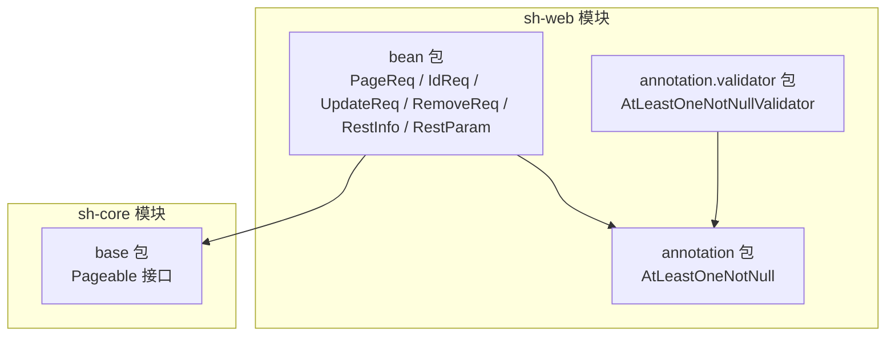
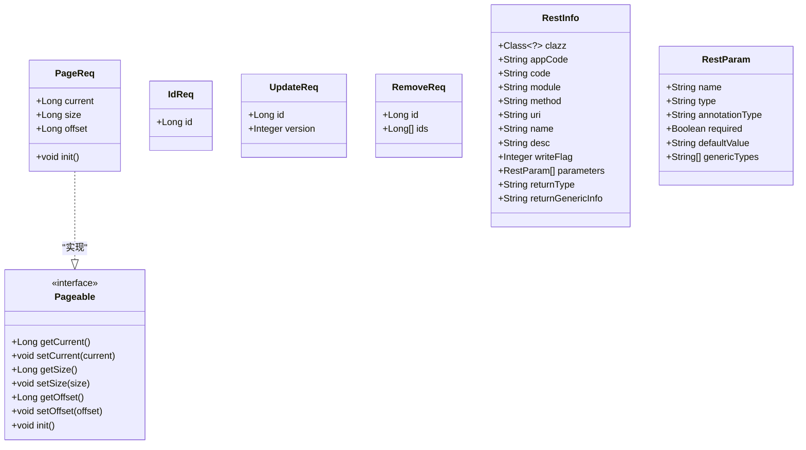
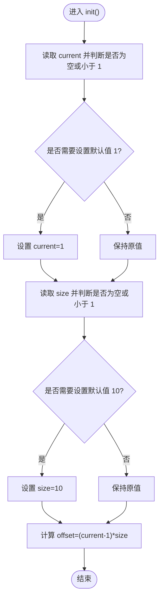
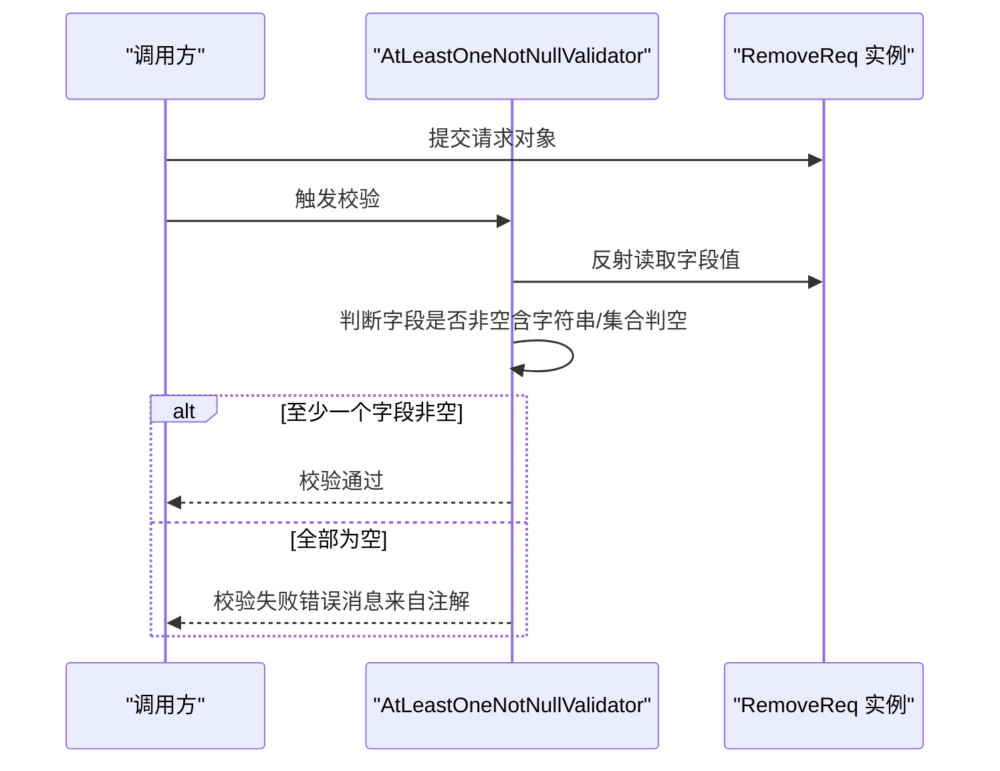
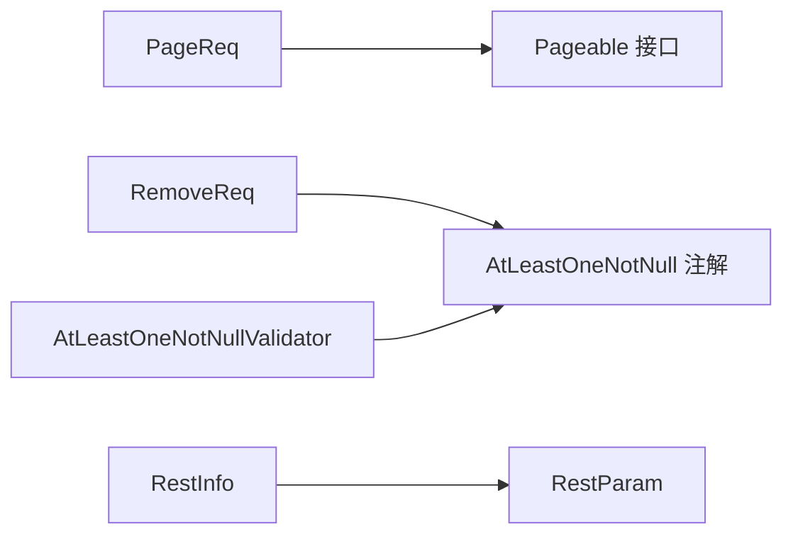

# 标准请求响应Bean

<cite>
**本文档引用的文件**
- [PageReq.java](file://sh-web/src/main/java/com/wkclz/web/bean/PageReq.java)
- [IdReq.java](file://sh-web/src/main/java/com/wkclz/web/bean/IdReq.java)
- [UpdateReq.java](file://sh-web/src/main/java/com/wkclz/web/bean/UpdateReq.java)
- [RemoveReq.java](file://sh-web/src/main/java/com/wkclz/web/bean/RemoveReq.java)
- [RestInfo.java](file://sh-web/src/main/java/com/wkclz/web/bean/RestInfo.java)
- [RestParam.java](file://sh-web/src/main/java/com/wkclz/web/bean/RestParam.java)
- [Pageable.java](file://sh-core/src/main/java/com/wkclz/core/base/Pageable.java)
- [AtLeastOneNotNull.java](file://sh-web/src/main/java/com/wkclz/web/annotation/AtLeastOneNotNull.java)
- [AtLeastOneNotNullValidator.java](file://sh-web/src/main/java/com/wkclz/web/annotation/validator/AtLeastOneNotNullValidator.java)
- [PageReqTest.java](file://sh-web/src/test/java/com/wkclz/web/bean/PageReqTest.java)
</cite>

## 目录
1. [简介](#简介)
2. [项目结构](#项目结构)
3. [核心组件](#核心组件)
4. [架构总览](#架构总览)
5. [详细组件分析](#详细组件分析)
6. [依赖分析](#依赖分析)
7. [性能考虑](#性能考虑)
8. [故障排查指南](#故障排查指南)
9. [结论](#结论)
10. [附录](#附录)

## 简介
本文件面向 sh-web 模块的标准请求响应 Bean，系统性梳理分页请求、单据 ID 请求、更新请求、删除请求等基础请求 Bean 的字段定义、使用场景与设计原则；同时阐释 REST 接口元数据模型 RestInfo 与 RestParam 的设计思路与参数描述机制。文档还提供字段命名约定、数据验证规则、序列化配置与扩展建议，帮助开发者在实际业务中正确、一致地使用这些标准 Bean。

## 项目结构
- 核心 Bean 位于 sh-web 模块的 com.wkclz.web.bean 包下，包含分页、ID、更新、删除等请求 Bean，以及 REST 元数据模型。
- 分页接口 Pageable 定义于 sh-core 模块，PageReq 实现该接口以提供统一的分页参数初始化与偏移量计算。
- 自定义校验注解 AtLeastOneNotNull 及其校验器位于 sh-web 模块的 annotation 与 validator 包中，用于 RemoveReq 的“id 或 ids 至少一个非空”约束。

**图表来源**
- [PageReq.java:1-45](file://sh-web/src/main/java/com/wkclz/web/bean/PageReq.java#L1-L45)
- [IdReq.java:1-19](file://sh-web/src/main/java/com/wkclz/web/bean/IdReq.java#L1-L19)
- [UpdateReq.java:1-22](file://sh-web/src/main/java/com/wkclz/web/bean/UpdateReq.java#L1-L22)
- [RemoveReq.java:1-26](file://sh-web/src/main/java/com/wkclz/web/bean/RemoveReq.java#L1-L26)
- [RestInfo.java:1-37](file://sh-web/src/main/java/com/wkclz/web/bean/RestInfo.java#L1-L37)
- [RestParam.java:1-50](file://sh-web/src/main/java/com/wkclz/web/bean/RestParam.java#L1-L50)
- [Pageable.java:1-93](file://sh-core/src/main/java/com/wkclz/core/base/Pageable.java#L1-L93)
- [AtLeastOneNotNull.java:1-27](file://sh-web/src/main/java/com/wkclz/web/annotation/AtLeastOneNotNull.java#L1-L27)
- [AtLeastOneNotNullValidator.java:1-57](file://sh-web/src/main/java/com/wkclz/web/annotation/validator/AtLeastOneNotNullValidator.java#L1-L57)

**章节来源**
- [PageReq.java:1-45](file://sh-web/src/main/java/com/wkclz/web/bean/PageReq.java#L1-L45)
- [Pageable.java:1-93](file://sh-core/src/main/java/com/wkclz/core/base/Pageable.java#L1-L93)

## 核心组件
本节对标准请求 Bean 进行逐项说明，涵盖字段语义、验证规则、使用场景与最佳实践。

- PageReq（分页请求）
  - 字段：current（页码）、size（每页数量）、offset（偏移量，隐藏）
  - 行为：实现 Pageable 接口，通过 init() 方法对 current 与 size 进行默认值与合法性校验，并计算 offset
  - 使用场景：所有需要分页查询的接口统一使用该 Bean，避免重复实现分页逻辑
  - 设计要点：遵循 DEFAULT_CURRENT 与 DEFAULT_SIZE 的默认策略，确保健壮性

- IdReq（单据请求）
  - 字段：id（主键 ID）
  - 行为：使用 @NotNull 对 id 进行必填校验
  - 使用场景：单条记录查询、删除、详情展示等基于主键的操作

- UpdateReq（更新请求）
  - 字段：id（主键 ID）、version（数据版本号）
  - 行为：id 与 version 均为必填；version 用于乐观锁控制
  - 使用场景：更新操作必须携带版本号，防止并发覆盖

- RemoveReq（删除请求）
  - 字段：id（单个主键）、ids（主键集合）
  - 行为：通过 @AtLeastOneNotNull 注解确保 id 与 ids 至少一个非空
  - 使用场景：支持单删与批量删除；删除前需保证数据存在且可删除

- RestInfo（REST 接口元数据）
  - 字段：clazz、appCode、code、module、method、uri、name、desc、writeFlag、parameters（列表）、returnType、returnGenericInfo
  - 用途：封装一次 REST 接口的元信息，便于接口文档生成、权限控制与监控

- RestParam（REST 接口参数元数据）
  - 字段：name、type、annotationType、required、defaultValue、genericTypes
  - 用途：描述单个参数的类型、注解位置（如 RequestBody、PathVariable、RequestParam）、是否必填、默认值与泛型信息

**章节来源**
- [PageReq.java:1-45](file://sh-web/src/main/java/com/wkclz/web/bean/PageReq.java#L1-L45)
- [IdReq.java:1-19](file://sh-web/src/main/java/com/wkclz/web/bean/IdReq.java#L1-L19)
- [UpdateReq.java:1-22](file://sh-web/src/main/java/com/wkclz/web/bean/UpdateReq.java#L1-L22)
- [RemoveReq.java:1-26](file://sh-web/src/main/java/com/wkclz/web/bean/RemoveReq.java#L1-L26)
- [RestInfo.java:1-37](file://sh-web/src/main/java/com/wkclz/web/bean/RestInfo.java#L1-L37)
- [RestParam.java:1-50](file://sh-web/src/main/java/com/wkclz/web/bean/RestParam.java#L1-L50)

## 架构总览
下图展示了标准请求 Bean 与其依赖的关系，以及与分页接口 Pageable 的对接方式。

**图表来源**
- [PageReq.java:1-45](file://sh-web/src/main/java/com/wkclz/web/bean/PageReq.java#L1-L45)
- [Pageable.java:1-93](file://sh-core/src/main/java/com/wkclz/core/base/Pageable.java#L1-L93)
- [RestInfo.java:1-37](file://sh-web/src/main/java/com/wkclz/web/bean/RestInfo.java#L1-L37)
- [RestParam.java:1-50](file://sh-web/src/main/java/com/wkclz/web/bean/RestParam.java#L1-L50)

## 详细组件分析

### PageReq 组件分析
- 设计原则
  - 统一分页参数：通过实现 Pageable 接口，复用默认页码与页大小的默认值策略
  - 健壮性：对空值与非法值进行兜底，保证 offset 的正确计算
  - 可测试性：单元测试覆盖正常值、null、非法值、负数、多次 init 调用与序列化能力

- 关键流程（init 方法）

**图表来源**
- [PageReq.java:24-42](file://sh-web/src/main/java/com/wkclz/web/bean/PageReq.java#L24-L42)
- [Pageable.java:77-91](file://sh-core/src/main/java/com/wkclz/core/base/Pageable.java#L77-L91)

- 使用示例与扩展建议
  - 示例路径：[PageReqTest.java:18-232](file://sh-web/src/test/java/com/wkclz/web/bean/PageReqTest.java#L18-L232)
  - 扩展建议：可在子类中增加业务特定的分页参数（如排序、过滤），但需保持与 Pageable 的兼容性

**章节来源**
- [PageReq.java:1-45](file://sh-web/src/main/java/com/wkclz/web/bean/PageReq.java#L1-L45)
- [Pageable.java:1-93](file://sh-core/src/main/java/com/wkclz/core/base/Pageable.java#L1-L93)
- [PageReqTest.java:1-232](file://sh-web/src/test/java/com/wkclz/web/bean/PageReqTest.java#L1-L232)

### IdReq 组件分析
- 设计原则
  - 明确单一职责：仅承载主键 ID，避免冗余字段
  - 强约束：使用 @NotNull 确保调用方必须传入 ID

- 使用场景
  - 查询详情、更新、删除等基于主键的操作

**章节来源**
- [IdReq.java:1-19](file://sh-web/src/main/java/com/wkclz/web/bean/IdReq.java#L1-L19)

### UpdateReq 组件分析
- 设计原则
  - 版本控制：version 字段用于乐观锁，防止并发覆盖
  - 必填约束：id 与 version 均为必填，确保更新的安全性

- 使用场景
  - 更新接口的请求体封装，配合服务层的版本校验

**章节来源**
- [UpdateReq.java:1-22](file://sh-web/src/main/java/com/wkclz/web/bean/UpdateReq.java#L1-L22)

### RemoveReq 组件分析
- 设计原则
  - 至少一个非空：通过自定义注解 @AtLeastOneNotNull 确保 id 或 ids 至少一个有效
  - 类型约束：id 为单个主键，ids 为主键集合，满足单删与批量删除需求

- 校验机制

**图表来源**
- [RemoveReq.java:13](file://sh-web/src/main/java/com/wkclz/web/bean/RemoveReq.java#L13)
- [AtLeastOneNotNull.java:16-27](file://sh-web/src/main/java/com/wkclz/web/annotation/AtLeastOneNotNull.java#L16-L27)
- [AtLeastOneNotNullValidator.java:21-56](file://sh-web/src/main/java/com/wkclz/web/annotation/validator/AtLeastOneNotNullValidator.java#L21-L56)

**章节来源**
- [RemoveReq.java:1-26](file://sh-web/src/main/java/com/wkclz/web/bean/RemoveReq.java#L1-L26)
- [AtLeastOneNotNull.java:1-27](file://sh-web/src/main/java/com/wkclz/web/annotation/AtLeastOneNotNull.java#L1-L27)
- [AtLeastOneNotNullValidator.java:1-57](file://sh-web/src/main/java/com/wkclz/web/annotation/validator/AtLeastOneNotNullValidator.java#L1-L57)

### RestInfo 与 RestParam 组件分析
- 设计原则
  - 元数据驱动：通过 RestInfo 封装接口级元信息，RestParam 描述参数维度
  - 可扩展性：支持返回类型与泛型信息的 JSON 字符串表示，便于上层工具链消费

- 字段说明
  - RestInfo：接口标识、模块、URI、名称、描述、写入标志、参数列表、返回类型与泛型信息
  - RestParam：参数名、类型、注解类型（如 RequestBody/PathVariable/RequestParam）、是否必填、默认值、泛型类型列表

- 使用场景
  - 接口文档生成、权限控制、监控埋点、SDK 生成等

**章节来源**
- [RestInfo.java:1-37](file://sh-web/src/main/java/com/wkclz/web/bean/RestInfo.java#L1-L37)
- [RestParam.java:1-50](file://sh-web/src/main/java/com/wkclz/web/bean/RestParam.java#L1-L50)

## 依赖分析
- PageReq 依赖 Pageable 接口，继承默认的 init() 行为，确保分页参数一致性
- RemoveReq 依赖自定义注解 AtLeastOneNotNull 与其校验器 AtLeastOneNotNullValidator，实现字段间互斥非空的复合校验
- RestInfo 与 RestParam 作为纯数据载体，无外部依赖，便于跨模块传递

**图表来源**
- [PageReq.java:3](file://sh-web/src/main/java/com/wkclz/web/bean/PageReq.java#L3)
- [Pageable.java:12](file://sh-core/src/main/java/com/wkclz/core/base/Pageable.java#L12)
- [RemoveReq.java:3](file://sh-web/src/main/java/com/wkclz/web/bean/RemoveReq.java#L3)
- [AtLeastOneNotNull.java:3](file://sh-web/src/main/java/com/wkclz/web/annotation/AtLeastOneNotNull.java#L3)
- [AtLeastOneNotNullValidator.java:3](file://sh-web/src/main/java/com/wkclz/web/annotation/validator/AtLeastOneNotNullValidator.java#L3)
- [RestInfo.java:24](file://sh-web/src/main/java/com/wkclz/web/bean/RestInfo.java#L24)
- [RestParam.java:18](file://sh-web/src/main/java/com/wkclz/web/bean/RestParam.java#L18)

**章节来源**
- [PageReq.java:1-45](file://sh-web/src/main/java/com/wkclz/web/bean/PageReq.java#L1-L45)
- [RemoveReq.java:1-26](file://sh-web/src/main/java/com/wkclz/web/bean/RemoveReq.java#L1-L26)
- [RestInfo.java:1-37](file://sh-web/src/main/java/com/wkclz/web/bean/RestInfo.java#L1-L37)
- [RestParam.java:1-50](file://sh-web/src/main/java/com/wkclz/web/bean/RestParam.java#L1-L50)

## 性能考虑
- 分页计算：offset 由 current 与 size 直接计算，时间复杂度 O(1)，空间复杂度 O(1)，开销极低
- 校验成本：@NotNull 与自定义注解校验在请求进入控制器前执行，通常不会引入额外网络往返
- 序列化：所有 Bean 实现 Serializable，便于在网络传输与缓存中使用，注意避免在高并发场景下频繁序列化大对象

## 故障排查指南
- 分页参数异常
  - 现象：current 或 size 为 null、负数或 0
  - 处理：PageReq.init() 会将其设置为默认值并重新计算 offset；若仍出现异常，请检查调用方是否重复调用 init() 导致状态错乱
  - 参考测试：[PageReqTest.java:56-149](file://sh-web/src/test/java/com/wkclz/web/bean/PageReqTest.java#L56-L149)

- 删除请求校验失败
  - 现象：id 与 ids 同时为空
  - 处理：确认至少填写其中一个；若使用集合，请确保集合非空
  - 校验器行为参考：[AtLeastOneNotNullValidator.java:21-56](file://sh-web/src/main/java/com/wkclz/web/annotation/validator/AtLeastOneNotNullValidator.java#L21-L56)

- 版本冲突（更新失败）
  - 现象：version 不匹配导致更新失败
  - 处理：前端或客户端在更新前拉取最新版本号，确保与服务端一致

**章节来源**
- [PageReqTest.java:56-149](file://sh-web/src/test/java/com/wkclz/web/bean/PageReqTest.java#L56-L149)
- [AtLeastOneNotNullValidator.java:21-56](file://sh-web/src/main/java/com/wkclz/web/annotation/validator/AtLeastOneNotNullValidator.java#L21-L56)

## 结论
sh-web 模块的标准请求响应 Bean 通过简洁明确的字段设计、严格的验证规则与统一的分页接口，实现了跨模块的一致性与可维护性。RestInfo 与 RestParam 则提供了 REST 接口元数据的标准化表达，有助于构建完善的接口生态。建议在实际开发中严格遵循字段命名约定、验证规则与序列化配置，确保系统的稳定性与可扩展性。

## 附录
- 字段命名约定
  - 使用语义化英文命名，避免缩写；布尔字段使用 is/has 前缀
  - 主键统一使用 id；分页参数使用 current、size、offset

- 数据验证规则
  - 必填字段使用 @NotNull；复合互斥字段使用自定义注解与校验器
  - 数值型字段需校验范围（如分页页码与大小）

- 序列化配置
  - 所有 Bean 实现 Serializable，便于跨进程传输
  - 如需排除字段，可在上层框架中统一配置序列化策略

- 扩展方法
  - 新增业务参数时，优先在现有 Bean 中扩展，避免创建新的同义 Bean
  - 对于复杂场景，可组合多个 Bean 或新增专用 Bean，并保持与核心接口的兼容