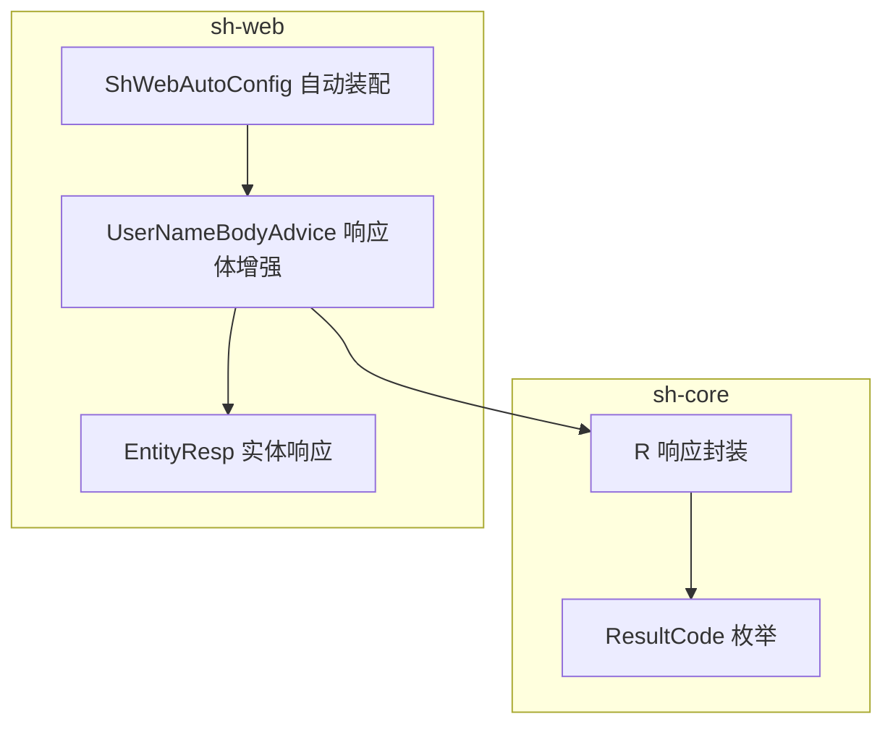
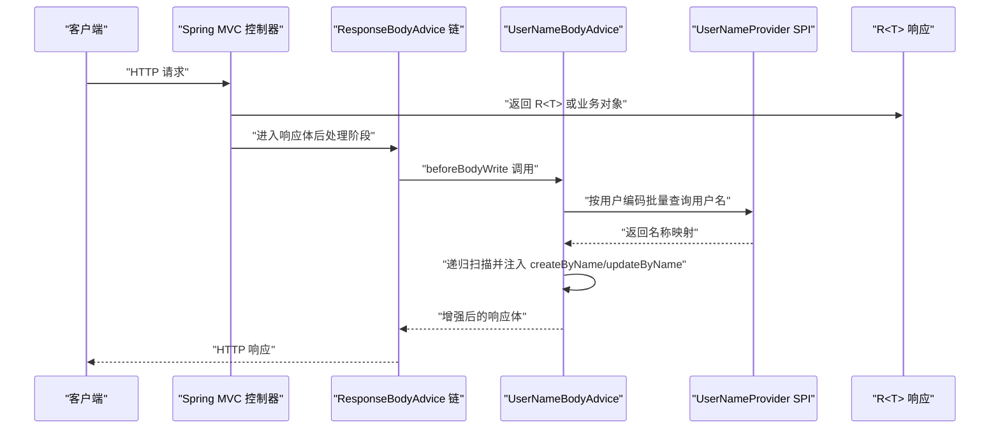
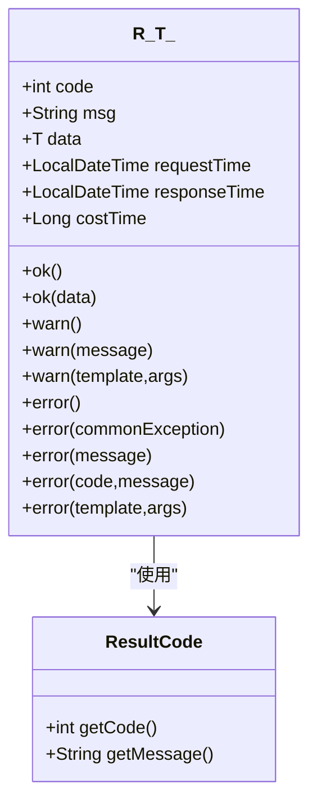
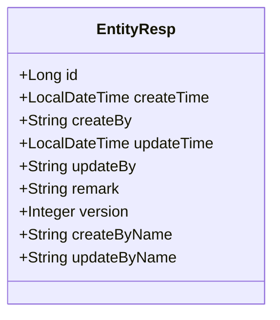
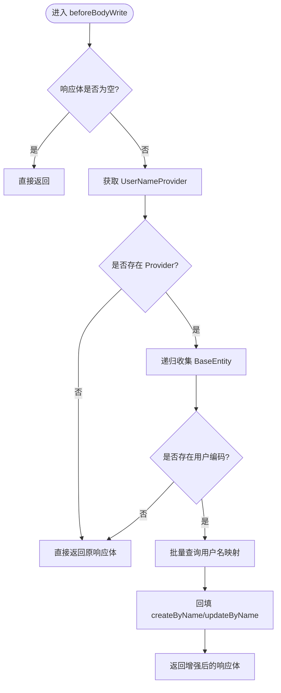
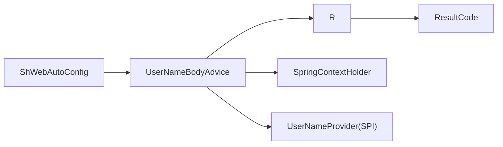

# 统一响应封装体系

<cite>
**本文引用的文件**
- [R.java](file://sh-core/src/main/java/com/wkclz/core/base/R.java)
- [ResultCode.java](file://sh-core/src/main/java/com/wkclz/core/enums/ResultCode.java)
- [EntityResp.java](file://sh-web/src/main/java/com/wkclz/web/bean/EntityResp.java)
- [UserNameBodyAdvice.java](file://sh-web/src/main/java/com/wkclz/web/rest/UserNameBodyAdvice.java)
- [ShWebAutoConfig.java](file://sh-web/src/main/java/com/wkclz/web/ShWebAutoConfig.java)
</cite>

## 目录
1. [简介](#简介)
2. [项目结构](#项目结构)
3. [核心组件](#核心组件)
4. [架构总览](#架构总览)
5. [详细组件分析](#详细组件分析)
6. [依赖分析](#依赖分析)
7. [性能考虑](#性能考虑)
8. [故障排查指南](#故障排查指南)
9. [结论](#结论)
10. [附录](#附录)

## 简介
本文件系统化梳理并深入解析“统一响应封装体系”的设计理念与实现机制，覆盖以下关键主题：
- R<T> 响应封装：响应码体系、数据封装格式与错误信息标准化
- EntityResp 实体响应：设计思路与使用场景
- UserNameBodyAdvice 响应体用户名自动填充：用户上下文获取、用户名注入机制与多租户支持
- 序列化配置与 JSON 格式化规则
- 最佳实践与自定义扩展方法

该体系通过统一的响应载体与约定式错误码，提升接口一致性、可维护性与可观测性；通过响应体增强机制，进一步优化前端消费体验。

## 项目结构
围绕统一响应封装的相关模块与文件分布如下：
- sh-core：基础模型与枚举（R<T>、ResultCode）
- sh-web：Web 层增强（EntityResp、UserNameBodyAdvice、ShWebAutoConfig）

图表来源
- [R.java:1-76](file://sh-core/src/main/java/com/wkclz/core/base/R.java#L1-L76)
- [ResultCode.java:1-77](file://sh-core/src/main/java/com/wkclz/core/enums/ResultCode.java#L1-L77)
- [EntityResp.java:1-42](file://sh-web/src/main/java/com/wkclz/web/bean/EntityResp.java#L1-L42)
- [UserNameBodyAdvice.java:1-198](file://sh-web/src/main/java/com/wkclz/web/rest/UserNameBodyAdvice.java#L1-L198)
- [ShWebAutoConfig.java:1-12](file://sh-web/src/main/java/com/wkclz/web/ShWebAutoConfig.java#L1-L12)

章节来源
- [R.java:1-76](file://sh-core/src/main/java/com/wkclz/core/base/R.java#L1-L76)
- [ResultCode.java:1-77](file://sh-core/src/main/java/com/wkclz/core/enums/ResultCode.java#L1-L77)
- [EntityResp.java:1-42](file://sh-web/src/main/java/com/wkclz/web/bean/EntityResp.java#L1-L42)
- [UserNameBodyAdvice.java:1-198](file://sh-web/src/main/java/com/wkclz/web/rest/UserNameBodyAdvice.java#L1-L198)
- [ShWebAutoConfig.java:1-12](file://sh-web/src/main/java/com/wkclz/web/ShWebAutoConfig.java#L1-L12)

## 核心组件
- R<T> 统一响应载体：承载业务响应的 code、msg、data，并内置请求/响应时间与耗时字段，提供静态工厂方法以快速构造成功、警告与错误响应。
- ResultCode 错误码体系：集中定义通用与业务类错误码，确保前后端一致的语义表达。
- EntityResp 实体响应：面向持久化实体的标准返回字段集合，包含主键、时间戳、版本号及“创建/更新人编码与姓名”等。
- UserNameBodyAdvice 响应体增强：在响应输出前自动扫描并注入“创建/更新人姓名”，基于 UserNameProvider SPI 获取名称映射，支持多租户场景下的用户上下文隔离。

章节来源
- [R.java:11-76](file://sh-core/src/main/java/com/wkclz/core/base/R.java#L11-L76)
- [ResultCode.java:7-77](file://sh-core/src/main/java/com/wkclz/core/enums/ResultCode.java#L7-L77)
- [EntityResp.java:9-42](file://sh-web/src/main/java/com/wkclz/web/bean/EntityResp.java#L9-L42)
- [UserNameBodyAdvice.java:21-198](file://sh-web/src/main/java/com/wkclz/web/rest/UserNameBodyAdvice.java#L21-L198)

## 架构总览
统一响应封装体系的运行时交互流程如下：

图表来源
- [UserNameBodyAdvice.java:32-96](file://sh-web/src/main/java/com/wkclz/web/rest/UserNameBodyAdvice.java#L32-L96)
- [R.java:11-76](file://sh-core/src/main/java/com/wkclz/core/base/R.java#L11-L76)

## 详细组件分析

### R<T> 响应封装与 ResultCode 错误码体系
- 设计理念
  - 以 R<T> 作为统一响应载体，屏蔽具体序列化细节，便于前端统一处理。
  - 将响应码与消息从数据中分离，配合 ResultCode 枚举实现语义化与可读性。
  - 内置时间与耗时字段，便于链路追踪与性能监控。
- 数据封装格式
  - 字段：code、msg、data、requestTime、responseTime、costTime
  - 静态工厂方法：ok(data)、warn(...)、error(...) 等，覆盖常见业务分支。
- 错误信息标准化
  - 使用 ResultCode 统一错误码与消息，避免分散的字符串常量。
  - 支持模板化消息与占位符替换，便于国际化与本地化扩展。

图表来源
- [R.java:11-76](file://sh-core/src/main/java/com/wkclz/core/base/R.java#L11-L76)
- [ResultCode.java:61-77](file://sh-core/src/main/java/com/wkclz/core/enums/ResultCode.java#L61-L77)

章节来源
- [R.java:11-76](file://sh-core/src/main/java/com/wkclz/core/base/R.java#L11-L76)
- [ResultCode.java:7-77](file://sh-core/src/main/java/com/wkclz/core/enums/ResultCode.java#L7-L77)

### EntityResp 实体响应设计与使用场景
- 设计思路
  - 提供实体返回的最小必要字段集合，覆盖主键、时间戳、版本号与“创建/更新人编码与姓名”。
  - 通过 Swagger 注解描述字段含义，提升接口文档可读性。
- 使用场景
  - 列表返回中的实体摘要
  - 新增/修改后的实体回显
  - 分页查询的统一实体包装
- 与 UserNameBodyAdvice 的协作
  - 当响应体包含 BaseEntity 或其子类时，UserNameBodyAdvice 可自动注入 createByName 与 updateByName 字段，减少前端二次查询与转换成本。

图表来源
- [EntityResp.java:9-42](file://sh-web/src/main/java/com/wkclz/web/bean/EntityResp.java#L9-L42)

章节来源
- [EntityResp.java:9-42](file://sh-web/src/main/java/com/wkclz/web/bean/EntityResp.java#L9-L42)

### UserNameBodyAdvice 响应体用户名自动填充
- 用户上下文获取
  - 通过 SpringContextHolder 获取 UserNameProvider SPI 实现，若未找到则跳过增强。
- 用户名注入机制
  - 递归扫描响应体中的 BaseEntity 实例，收集 createBy 与 updateBy 编码。
  - 调用 UserNameProvider 批量查询用户名映射，回填到 createByName 与 updateByName。
  - 采用反射与字段缓存策略，限制最大递归深度，避免对复杂对象造成性能问题。
- 多租户支持
  - UserNameProvider 的实现需结合当前租户上下文进行查询，确保跨租户隔离与数据安全。
  - 建议在 Provider 中按租户维度缓存用户名称映射，降低跨租户查询开销。

图表来源
- [UserNameBodyAdvice.java:32-96](file://sh-web/src/main/java/com/wkclz/web/rest/UserNameBodyAdvice.java#L32-L96)

章节来源
- [UserNameBodyAdvice.java:21-198](file://sh-web/src/main/java/com/wkclz/web/rest/UserNameBodyAdvice.java#L21-L198)

### 序列化配置与 JSON 格式化规则
- 统一响应载体 R<T>
  - 建议在全局 JSON 序列化配置中保持字段顺序稳定，便于前端解析与调试。
  - 对时间字段建议使用 ISO-8601 格式，确保跨语言兼容。
- 响应体增强
  - UserNameBodyAdvice 在响应写入前完成增强，不会影响原有序列化器行为。
  - 若存在自定义序列化器，需确保对 BaseEntity 的反射访问与字段可见性不受影响。
- 建议
  - 在网关或过滤器层统一处理时间精度与空值策略，避免在每个控制器重复处理。
  - 对敏感字段（如密码）在序列化时进行脱敏处理，必要时在序列化器中增加自定义策略。

章节来源
- [R.java:11-76](file://sh-core/src/main/java/com/wkclz/core/base/R.java#L11-L76)
- [UserNameBodyAdvice.java:32-96](file://sh-web/src/main/java/com/wkclz/web/rest/UserNameBodyAdvice.java#L32-L96)

## 依赖分析
- 模块内聚与耦合
  - R<T> 与 ResultCode 强耦合，共同构成错误码与响应体的契约。
  - UserNameBodyAdvice 依赖 Spring MVC 的 ResponseBodyAdvice 机制与 UserNameProvider SPI，具备良好的扩展性。
  - ShWebAutoConfig 负责启用 Web 相关组件扫描，保证 UserNameBodyAdvice 生效。
- 外部依赖
  - Spring Web MVC（ResponseBodyAdvice）
  - Spring 上下文持有器（SpringContextHolder）
  - Lombok（简化 POJO）
  - Swagger 注解（EntityResp 文档描述）

图表来源
- [R.java:1-10](file://sh-core/src/main/java/com/wkclz/core/base/R.java#L1-L10)
- [ResultCode.java:1-10](file://sh-core/src/main/java/com/wkclz/core/enums/ResultCode.java#L1-L10)
- [UserNameBodyAdvice.java:1-20](file://sh-web/src/main/java/com/wkclz/web/rest/UserNameBodyAdvice.java#L1-L20)
- [ShWebAutoConfig.java:1-12](file://sh-web/src/main/java/com/wkclz/web/ShWebAutoConfig.java#L1-L12)

章节来源
- [R.java:1-10](file://sh-core/src/main/java/com/wkclz/core/base/R.java#L1-L10)
- [ResultCode.java:1-10](file://sh-core/src/main/java/com/wkclz/core/enums/ResultCode.java#L1-L10)
- [UserNameBodyAdvice.java:1-20](file://sh-web/src/main/java/com/wkclz/web/rest/UserNameBodyAdvice.java#L1-L20)
- [ShWebAutoConfig.java:1-12](file://sh-web/src/main/java/com/wkclz/web/ShWebAutoConfig.java#L1-L12)

## 性能考虑
- 递归扫描深度与缓存
  - 通过 MAX_DEPTH 限制递归深度，避免深层嵌套导致的性能问题。
  - 对反射字段列表进行缓存（FIELD_CACHE），减少重复反射开销。
- 批量查询与缓存
  - UserNameBodyAdvice 先收集所有用户编码，再一次性调用 Provider 进行批量查询，降低远程调用次数。
  - 建议在 Provider 层按租户维度缓存用户名称映射，提高命中率。
- 时间与内存
  - R<T> 中的时间与耗时字段由框架自动填充，避免业务层重复计算。
  - 对于大对象列表，建议在服务层分页或延迟加载非必要字段，减少序列化体积。

## 故障排查指南
- UserNameBodyAdvice 未生效
  - 检查 ShWebAutoConfig 是否被正确引入与扫描。
  - 确认 UserNameProvider 是否存在于 Spring 容器中。
- 用户名未注入
  - 核对 BaseEntity 的 createBy/updateBy 是否存在且非空。
  - 检查 Provider 返回的名称映射是否包含对应编码。
- 性能异常
  - 关注递归深度与对象复杂度，必要时在控制器层精简响应体。
  - 对 Provider 查询进行限流与降级策略，避免雪崩效应。

章节来源
- [ShWebAutoConfig.java:6-9](file://sh-web/src/main/java/com/wkclz/web/ShWebAutoConfig.java#L6-L9)
- [UserNameBodyAdvice.java:98-115](file://sh-web/src/main/java/com/wkclz/web/rest/UserNameBodyAdvice.java#L98-L115)

## 结论
统一响应封装体系通过 R<T> 与 ResultCode 实现了响应格式与错误码的标准化，借助 UserNameBodyAdvice 实现了响应体的智能化增强，显著提升了接口的一致性与用户体验。结合合理的序列化配置与性能优化策略，可在保证扩展性的同时满足高并发场景下的稳定性要求。

## 附录
- 最佳实践
  - 统一使用 R<T> 包裹所有业务响应，避免裸数据返回。
  - 使用 ResultCode 枚举表达错误，避免硬编码字符串。
  - 在服务层尽量返回轻量化的 DTO，减少序列化与网络传输开销。
  - 对于复杂对象，优先在控制器层进行投影与裁剪。
- 自定义扩展
  - 扩展 UserNameProvider：实现按租户维度的用户名称查询与缓存。
  - 自定义响应体增强：在 UserNameBodyAdvice 基础上增加其他字段的自动填充（如部门名称、角色名称等）。
  - 自定义序列化策略：针对特定字段（如时间、金额）统一格式化规则。