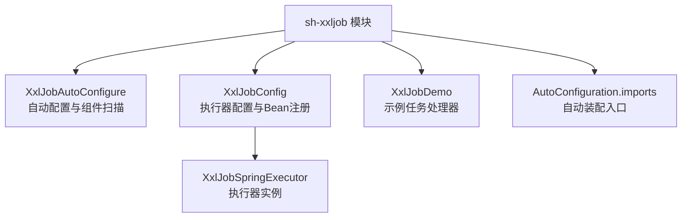
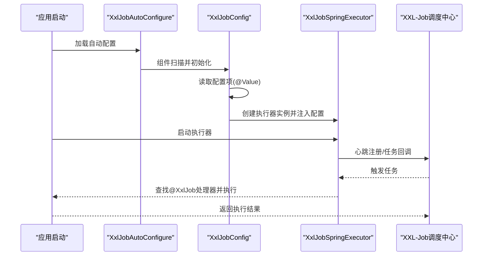
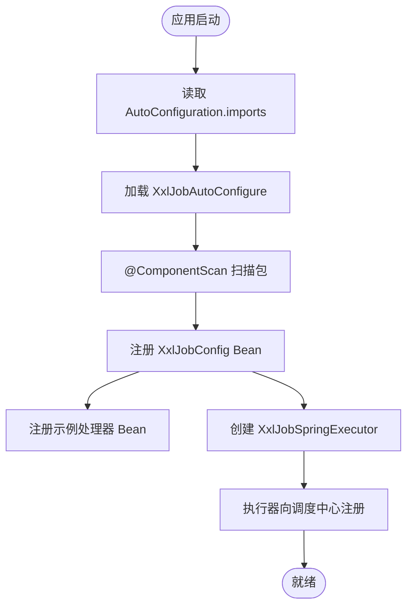
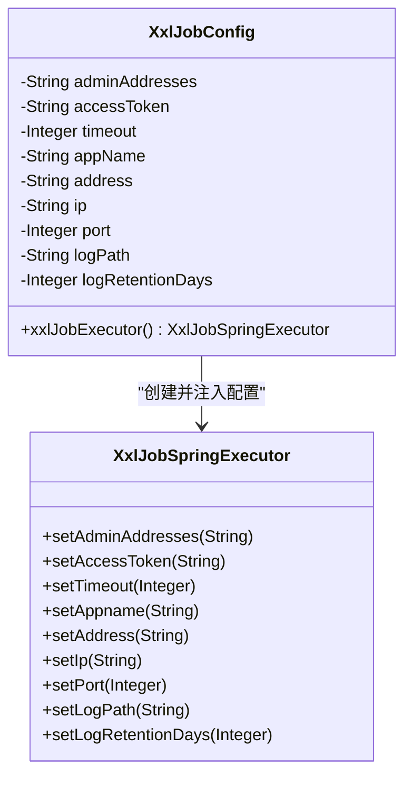
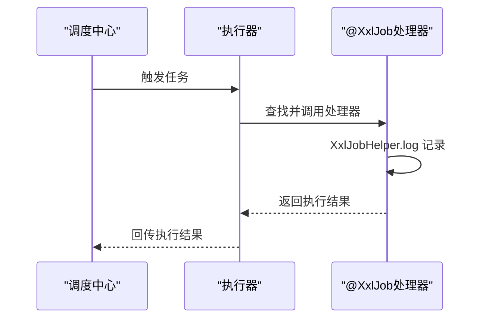
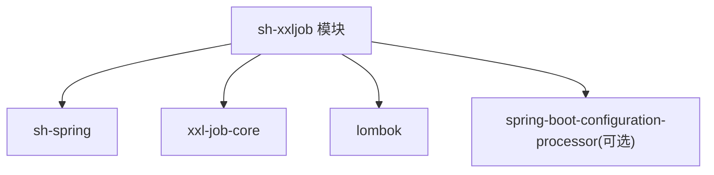

# 任务调度模块（sh-xxljob）

<cite>
**本文引用的文件**
- [XxlJobAutoConfigure.java](file://sh-xxljob/src/main/java/com/wkclz/xxljob/XxlJobAutoConfigure.java)
- [XxlJobConfig.java](file://sh-xxljob/src/main/java/com/wkclz/xxljob/config/XxlJobConfig.java)
- [XxlJobDemo.java](file://sh-xxljob/src/main/java/com/wkclz/xxljob/demo/XxlJobDemo.java)
- [pom.xml](file://sh-xxljob/pom.xml)
- [org.springframework.boot.autoconfigure.AutoConfiguration.imports](file://sh-xxljob/src/main/resources/META-INF/spring/org.springframework.boot.autoconfigure.AutoConfiguration.imports)
- [SKILL.md](file://.agents/skills/sh-xxljob/SKILL.md)
- [US-026-XXL-Job定时任务集成.md](file://docs/stories/US-026-XXL-Job定时任务集成.md)
- [application.yml](file://sh-demo/src/main/resources/config/application.yml)
</cite>

## 目录
1. [简介](#简介)
2. [项目结构](#项目结构)
3. [核心组件](#核心组件)
4. [架构总览](#架构总览)
5. [详细组件分析](#详细组件分析)
6. [依赖分析](#依赖分析)
7. [性能考虑](#性能考虑)
8. [故障排查指南](#故障排查指南)
9. [结论](#结论)
10. [附录](#附录)

## 简介
本文件为 sh-xxljob 定时任务模块的专业技术文档，面向需要在 sh-framework 中集成 XXL-Job 分布式任务调度的开发者与运维人员。内容涵盖：
- 执行器自动注册与配置参数详解（XxlJobConfig）
- 任务处理器开发规范（@XxlJob 注解与日志记录）
- 任务调度生命周期（启动、执行、监控、状态跟踪）
- 失败处理策略（重试、告警、故障恢复）
- 任务分片与负载均衡原理
- 完整开发示例（从简单定时任务到复杂业务流程）
- 最佳实践与性能优化建议

## 项目结构
sh-xxljob 模块采用“自动配置 + 执行器 Bean 注册”的轻量设计，核心文件如下：
- 自动配置类：负责扫描包并加载执行器配置
- 执行器配置类：将外部配置映射到 XxlJobSpringExecutor Bean
- 示例任务处理器：演示 @XxlJob 注解与日志记录
- 自动配置导入：通过 Spring Boot 自动装配机制启用模块



图表来源
- [XxlJobAutoConfigure.java:1-12](file://sh-xxljob/src/main/java/com/wkclz/xxljob/XxlJobAutoConfigure.java#L1-L12)
- [XxlJobConfig.java:52-66](file://sh-xxljob/src/main/java/com/wkclz/xxljob/config/XxlJobConfig.java#L52-L66)
- [org.springframework.boot.autoconfigure.AutoConfiguration.imports:1-1](file://sh-xxljob/src/main/resources/META-INF/spring/org.springframework.boot.autoconfigure.AutoConfiguration.imports#L1-L1)

章节来源
- [XxlJobAutoConfigure.java:1-12](file://sh-xxljob/src/main/java/com/wkclz/xxljob/XxlJobAutoConfigure.java#L1-L12)
- [XxlJobConfig.java:1-68](file://sh-xxljob/src/main/java/com/wkclz/xxljob/config/XxlJobConfig.java#L1-L68)
- [XxlJobDemo.java:1-14](file://sh-xxljob/src/main/java/com/wkclz/xxljob/demo/XxlJobDemo.java#L1-L14)
- [org.springframework.boot.autoconfigure.AutoConfiguration.imports:1-1](file://sh-xxljob/src/main/resources/META-INF/spring/org.springframework.boot.autoconfigure.AutoConfiguration.imports#L1-L1)

## 核心组件
- 自动配置类：通过 @AutoConfiguration 与 @ComponentScan 实现模块启用与包扫描
- 执行器配置类：以 @Value 方式读取外部配置，构建 XxlJobSpringExecutor Bean
- 示例任务处理器：展示 @XxlJob 注解与日志记录的最小可用示例

章节来源
- [XxlJobAutoConfigure.java:1-12](file://sh-xxljob/src/main/java/com/wkclz/xxljob/XxlJobAutoConfigure.java#L1-L12)
- [XxlJobConfig.java:14-66](file://sh-xxljob/src/main/java/com/wkclz/xxljob/config/XxlJobConfig.java#L14-L66)
- [XxlJobDemo.java:7-13](file://sh-xxljob/src/main/java/com/wkclz/xxljob/demo/XxlJobDemo.java#L7-L13)

## 架构总览
下图展示了 sh-xxljob 在应用启动时的装配与执行器注册流程，以及调度中心触发任务后的执行链路。



图表来源
- [XxlJobAutoConfigure.java:6-9](file://sh-xxljob/src/main/java/com/wkclz/xxljob/XxlJobAutoConfigure.java#L6-L9)
- [XxlJobConfig.java:52-66](file://sh-xxljob/src/main/java/com/wkclz/xxljob/config/XxlJobConfig.java#L52-L66)
- [US-026-XXL-Job定时任务集成.md:13-34](file://docs/stories/US-026-XXL-Job定时任务集成.md#L13-L34)

## 详细组件分析

### 自动配置与装配流程
- 通过 AutoConfiguration.imports 引入 XxlJobAutoConfigure
- @ComponentScan 扫描 com.wkclz.xxljob 包，注册 XxlJobConfig 与示例处理器
- XxlJobConfig 基于 @Value 注入配置，创建并返回 XxlJobSpringExecutor Bean



图表来源
- [org.springframework.boot.autoconfigure.AutoConfiguration.imports:1-1](file://sh-xxljob/src/main/resources/META-INF/spring/org.springframework.boot.autoconfigure.AutoConfiguration.imports#L1-L1)
- [XxlJobAutoConfigure.java:6-9](file://sh-xxljob/src/main/java/com/wkclz/xxljob/XxlJobAutoConfigure.java#L6-L9)
- [XxlJobConfig.java:52-66](file://sh-xxljob/src/main/java/com/wkclz/xxljob/config/XxlJobConfig.java#L52-L66)

章节来源
- [org.springframework.boot.autoconfigure.AutoConfiguration.imports:1-1](file://sh-xxljob/src/main/resources/META-INF/spring/org.springframework.boot.autoconfigure.AutoConfiguration.imports#L1-L1)
- [XxlJobAutoConfigure.java:1-12](file://sh-xxljob/src/main/java/com/wkclz/xxljob/XxlJobAutoConfigure.java#L1-L12)
- [XxlJobConfig.java:52-66](file://sh-xxljob/src/main/java/com/wkclz/xxljob/config/XxlJobConfig.java#L52-L66)

### 执行器配置与参数详解（XxlJobConfig）
- 调度中心地址与令牌：adminAddresses、accessToken
- 通讯超时：timeout（秒）
- 执行器标识：appName（默认取 spring.application.name）
- 注册地址与网络参数：address、ip、port
- 日志路径与保留策略：logPath、logRetentionDays
- Bean 工厂方法：xxlJobExecutor()



图表来源
- [XxlJobConfig.java:14-66](file://sh-xxljob/src/main/java/com/wkclz/xxljob/config/XxlJobConfig.java#L14-L66)

章节来源
- [XxlJobConfig.java:16-50](file://sh-xxljob/src/main/java/com/wkclz/xxljob/config/XxlJobConfig.java#L16-L50)
- [XxlJobConfig.java:52-66](file://sh-xxljob/src/main/java/com/wkclz/xxljob/config/XxlJobConfig.java#L52-L66)

### 任务处理器开发规范
- 使用 @Component 标注处理器类
- 使用 @XxlJob 注解声明任务方法，并指定处理器名称
- 使用 XxlJobHelper.log 记录日志，便于在调度中心查看
- 支持无返回值方法（默认 SUCCESS）与返回 ReturnT 的方法

```mermaid
flowchart TD
A["定义任务处理器类"] --> B["@Component 标注类"]
B --> C["@XxlJob(\"handlerName\") 标注方法"]
C --> D["XxlJobHelper.log 记录日志"]
D --> E{"是否需要返回值?"}
E --> |否| F["默认 SUCCESS"]
E --> |是| G["返回 ReturnT<T>"]
```

图表来源
- [XxlJobDemo.java:7-13](file://sh-xxljob/src/main/java/com/wkclz/xxljob/demo/XxlJobDemo.java#L7-L13)

章节来源
- [XxlJobDemo.java:7-13](file://sh-xxljob/src/main/java/com/wkclz/xxljob/demo/XxlJobDemo.java#L7-L13)
- [SKILL.md:51-77](file://.agents/skills/sh-xxljob/SKILL.md#L51-L77)

### 任务调度生命周期管理
- 启动阶段：应用启动后自动装配，执行器 Bean 创建并尝试注册
- 执行阶段：调度中心触发任务，执行器根据处理器名称定位并执行
- 监控与状态：通过 XxlJobHelper.log 将执行日志上报至调度中心
- 结果回传：任务完成后返回执行结果，供调度中心记录与展示



图表来源
- [US-026-XXL-Job定时任务集成.md:21-27](file://docs/stories/US-026-XXL-Job定时任务集成.md#L21-L27)

章节来源
- [US-026-XXL-Job定时任务集成.md:13-34](file://docs/stories/US-026-XXL-Job定时任务集成.md#L13-L34)

### 失败处理策略
- 重试机制：由 XXL-Job 调度中心在任务配置层面控制重试次数与间隔
- 告警通知：结合调度中心的任务失败告警能力，或在处理器中扩展外部告警通道
- 故障恢复：执行器自动注册失败不影响应用启动；可通过检查日志与健康检查确认执行器状态

章节来源
- [SKILL.md:106-112](file://.agents/skills/sh-xxljob/SKILL.md#L106-L112)
- [US-026-XXL-Job定时任务集成.md:36-40](file://docs/stories/US-026-XXL-Job定时任务集成.md#L36-L40)

### 任务分片与负载均衡
- 分片广播：XXL-Job 支持按分片参数广播执行，适合批量任务拆分
- 负载均衡：多执行器实例共享同一 appName，调度中心按策略分发任务
- 参数传递：通过任务参数携带分片序号与总数，实现任务分片逻辑

章节来源
- [SKILL.md:106-112](file://.agents/skills/sh-xxljob/SKILL.md#L106-L112)

### 开发示例
- 简单定时任务：参考示例处理器，定义 @XxlJob 方法并记录日志
- 复杂业务流程：在处理器中编排多个子任务，使用日志记录关键节点，必要时返回执行结果

章节来源
- [XxlJobDemo.java:7-13](file://sh-xxljob/src/main/java/com/wkclz/xxljob/demo/XxlJobDemo.java#L7-L13)
- [SKILL.md:51-77](file://.agents/skills/sh-xxljob/SKILL.md#L51-L77)

## 依赖分析
sh-xxljob 模块对核心依赖的使用情况如下：
- sh-spring：提供 Spring 上下文与通用能力
- xxl-job-core：提供执行器核心能力与 Bean 定义
- lombok：简化日志与构造代码
- spring-boot-configuration-processor：可选，用于配置处理器



图表来源
- [pom.xml:21-40](file://sh-xxljob/pom.xml#L21-L40)

章节来源
- [pom.xml:21-40](file://sh-xxljob/pom.xml#L21-L40)

## 性能考虑
- 端口与实例：单机多执行器实例需配置不同端口，避免冲突
- 日志路径与保留：合理设置日志路径与保留天数，避免磁盘压力
- 超时与令牌：根据网络环境调整超时时间，必要时配置访问令牌提升安全性
- 分片策略：对大批量任务采用分片策略，避免单点过载

章节来源
- [XxlJobConfig.java:40-50](file://sh-xxljob/src/main/java/com/wkclz/xxljob/config/XxlJobConfig.java#L40-L50)
- [SKILL.md:106-112](file://.agents/skills/sh-xxljob/SKILL.md#L106-L112)

## 故障排查指南
- 执行器未注册：检查是否配置调度中心地址；若未配置，执行器初始化会失败但不影响应用启动
- appName 默认值：未显式配置时默认取 spring.application.name
- 示例处理器影响：示例处理器会自动注册，如不需可在扫描范围内排除或移除
- 配置前缀：使用 xxl.job 前缀，与框架其他前缀区分

章节来源
- [US-026-XXL-Job定时任务集成.md:36-40](file://docs/stories/US-026-XXL-Job定时任务集成.md#L36-L40)
- [SKILL.md:106-112](file://.agents/skills/sh-xxljob/SKILL.md#L106-L112)

## 结论
sh-xxljob 模块以极简设计实现了 XXL-Job 执行器的自动装配与注册，配合 @XxlJob 注解即可快速开发定时任务。通过合理的配置与最佳实践，可在保证高可用的同时获得良好的可观测性与扩展性。

## 附录
- 配置示例（YAML）：参考知识库中的配置片段，设置调度中心地址、访问令牌、执行器标识、端口与日志路径等
- 应用示例：在 sh-demo 中可参考 application.yml 的基础配置，结合本模块完成任务开发

章节来源
- [SKILL.md:78-91](file://.agents/skills/sh-xxljob/SKILL.md#L78-L91)
- [application.yml:1-26](file://sh-demo/src/main/resources/config/application.yml#L1-L26)