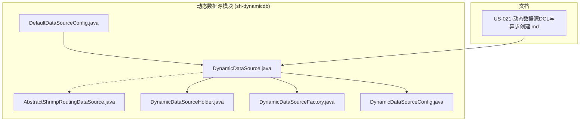
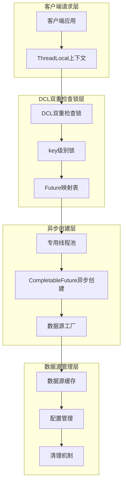
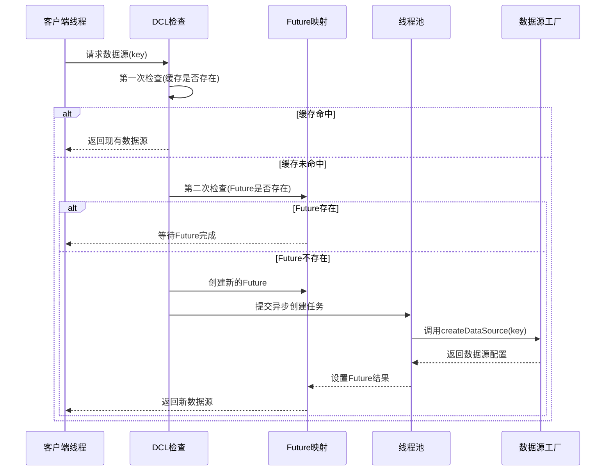
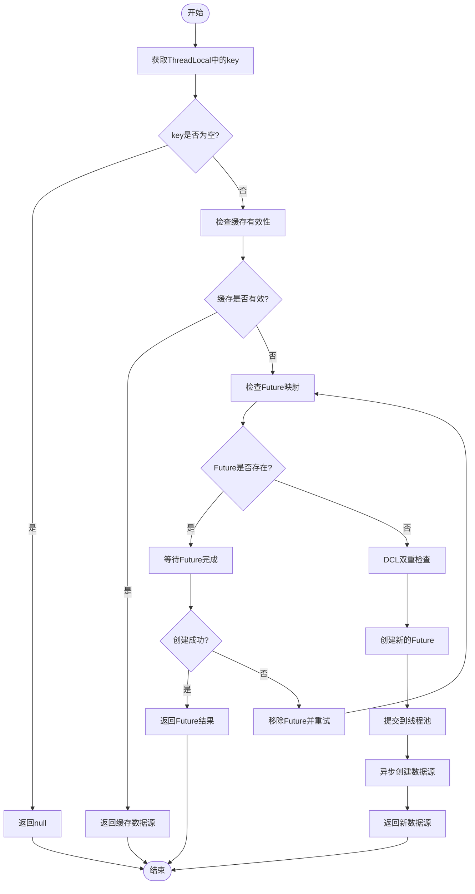
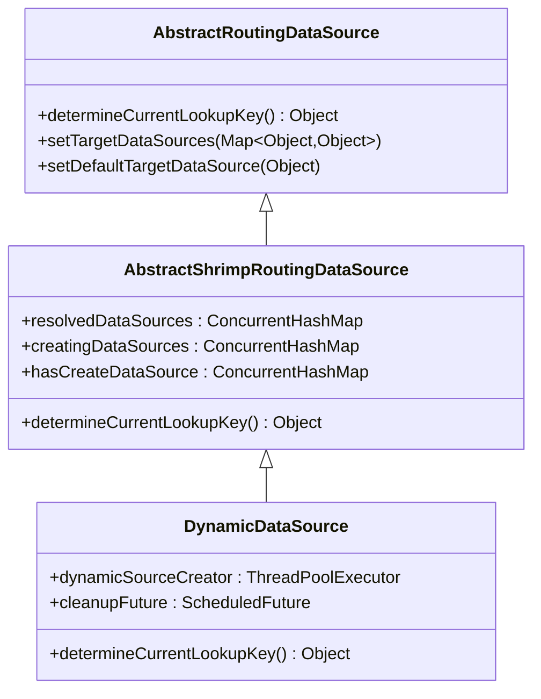
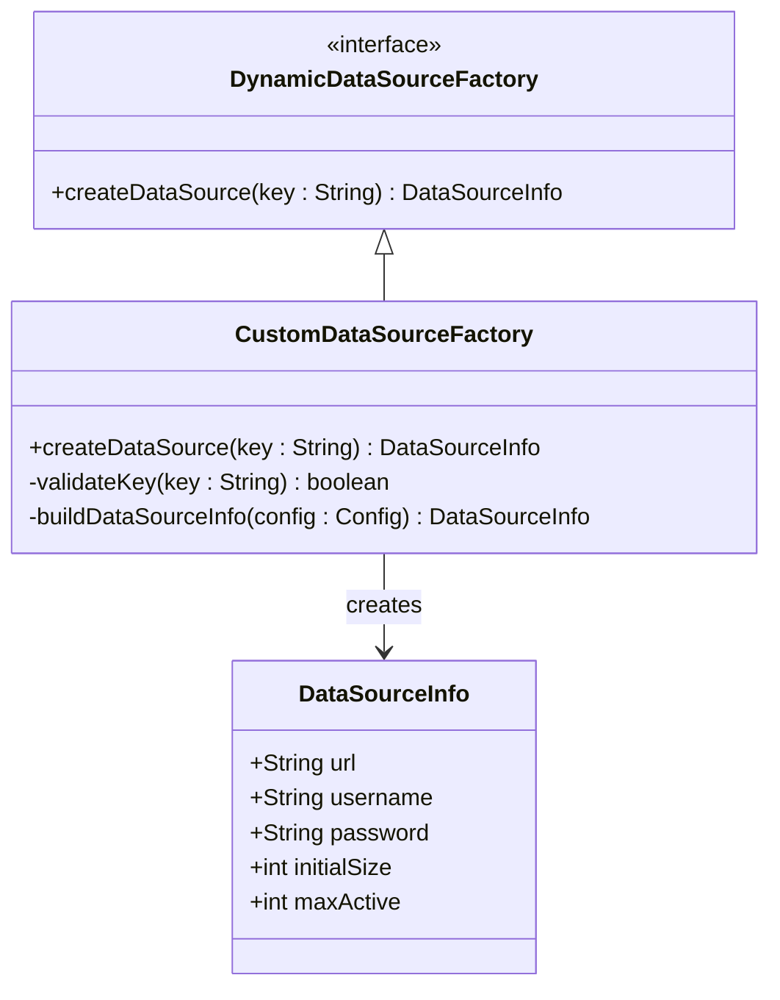
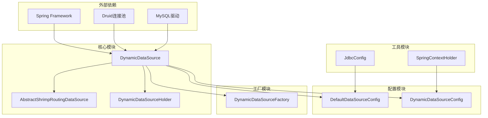

# DCL双重检查锁机制

<cite>
**本文档引用的文件**
- [DynamicDataSource.java](file://sh-dynamicdb/src/main/java/com/wkclz/dynamicdb/DynamicDataSource.java)
- [AbstractShrimpRoutingDataSource.java](file://sh-dynamicdb/src/main/java/com/wkclz/dynamicdb/AbstractShrimpRoutingDataSource.java)
- [DynamicDataSourceFactory.java](file://sh-dynamicdb/src/main/java/com/wkclz/dynamicdb/DynamicDataSourceFactory.java)
- [DynamicDataSourceHolder.java](file://sh-dynamicdb/src/main/java/com/wkclz/dynamicdb/DynamicDataSourceHolder.java)
- [DefaultDataSourceConfig.java](file://sh-dynamicdb/src/main/java/com/wkclz/dynamicdb/bean/DefaultDataSourceConfig.java)
- [DynamicDataSourceConfig.java](file://sh-dynamicdb/src/main/java/com/wkclz/dynamicdb/config/DynamicDataSourceConfig.java)
- [US-021-动态数据源DCL与异步创建.md](file://docs/stories/US-021-动态数据源DCL与异步创建.md)
</cite>

## 目录
1. [引言](#引言)
2. [项目结构](#项目结构)
3. [核心组件](#核心组件)
4. [架构概览](#架构概览)
5. [详细组件分析](#详细组件分析)
6. [依赖关系分析](#依赖关系分析)
7. [性能考虑](#性能考虑)
8. [故障排除指南](#故障排除指南)
9. [结论](#结论)
10. [附录](#附录)

## 引言

DCL（Double-Checked Locking）双重检查锁机制是一种在多线程环境中优化资源创建性能的重要设计模式。在动态数据源创建场景中，DCL机制能够有效避免不必要的同步开销，同时保证多线程环境下的数据一致性。

本项目中的动态数据源模块实现了基于DCL的双重检查锁机制，结合CompletableFuture异步创建策略，为高并发场景下的数据源管理提供了高效的解决方案。该机制通过"先检查后锁定"的方式，最大限度地减少锁竞争，提高系统的整体性能。

## 项目结构

动态数据源相关的核心文件组织如下：

**图表来源**
- [DynamicDataSource.java](file://sh-dynamicdb/src/main/java/com/wkclz/dynamicdb/DynamicDataSource.java)
- [AbstractShrimpRoutingDataSource.java](file://sh-dynamicdb/src/main/java/com/wkclz/dynamicdb/AbstractShrimpRoutingDataSource.java)
- [US-021-动态数据源DCL与异步创建.md](file://docs/stories/US-021-动态数据源DCL与异步创建.md)

**章节来源**
- [DynamicDataSource.java](file://sh-dynamicdb/src/main/java/com/wkclz/dynamicdb/DynamicDataSource.java)
- [AbstractShrimpRoutingDataSource.java](file://sh-dynamicdb/src/main/java/com/wkclz/dynamicdb/AbstractShrimpRoutingDataSource.java)
- [US-021-动态数据源DCL与异步创建.md](file://docs/stories/US-021-动态数据源DCL与异步创建.md)

## 核心组件

### 动态数据源核心组件

动态数据源系统由以下核心组件构成：

| 组件名称 | 职责描述 | 关键特性 |
|---------|----------|----------|
| DynamicDataSource | 主要数据源路由器 | 实现DCL双重检查锁，管理数据源生命周期 |
| AbstractShrimpRoutingDataSource | 路由数据源基类 | 提供ConcurrentHashMap支持，实现数据源缓存 |
| DynamicDataSourceFactory | 数据源工厂接口 | 定义自定义数据源创建规范 |
| DynamicDataSourceHolder | 数据源持有者 | 管理ThreadLocal上下文，实现线程隔离 |
| DefaultDataSourceConfig | 默认数据源配置 | 提供连接池参数复用，支持缓存配置 |

### 并发控制策略

系统采用多层次的并发控制策略：

1. **懒加载策略**：仅在需要时创建数据源实例
2. **延迟初始化**：通过ThreadLocal实现线程级别的数据源隔离
3. **线程安全保证**：使用DCL机制确保多线程环境下的数据一致性

**章节来源**
- [DynamicDataSource.java](file://sh-dynamicdb/src/main/java/com/wkclz/dynamicdb/DynamicDataSource.java)
- [DynamicDataSourceFactory.java](file://sh-dynamicdb/src/main/java/com/wkclz/dynamicdb/DynamicDataSourceFactory.java)
- [DynamicDataSourceHolder.java](file://sh-dynamicdb/src/main/java/com/wkclz/dynamicdb/DynamicDataSourceHolder.java)

## 架构概览

动态数据源的DCL架构设计体现了现代并发编程的最佳实践：

**图表来源**
- [DynamicDataSource.java](file://sh-dynamicdb/src/main/java/com/wkclz/dynamicdb/DynamicDataSource.java)
- [AbstractShrimpRoutingDataSource.java](file://sh-dynamicdb/src/main/java/com/wkclz/dynamicdb/AbstractShrimpRoutingDataSource.java)

### DCL机制工作流程

**图表来源**
- [DynamicDataSource.java](file://sh-dynamicdb/src/main/java/com/wkclz/dynamicdb/DynamicDataSource.java)

## 详细组件分析

### DynamicDataSource组件分析

DynamicDataSource是整个动态数据源系统的核心组件，实现了DCL双重检查锁机制：

#### 核心数据结构

组件内部维护了多个关键的数据结构：

| 数据结构 | 类型 | 描述 | 作用 |
|---------|------|------|------|
| resolvedDataSources | ConcurrentHashMap | 已解析的数据源缓存 | 存储已创建的数据源实例 |
| creatingDataSources | ConcurrentHashMap | 正在创建的数据源映射 | 防止重复创建 |
| hasCreateDataSource | ConcurrentHashMap | 创建时间戳记录 | 支持缓存过期检查 |
| dynamicSourceCreator | ThreadPoolExecutor | 专用线程池 | 执行异步数据源创建 |
| cleanupFuture | ScheduledFuture | 清理任务句柄 | 管理资源回收 |

#### DCL实现细节

**图表来源**
- [DynamicDataSource.java](file://sh-dynamicdb/src/main/java/com/wkclz/dynamicdb/DynamicDataSource.java)

#### 锁粒度优化

系统采用了细粒度的锁控制策略：

1. **key级别锁**：使用`computeIfAbsent`确保每个key共享同一个Future
2. **最小化同步范围**：只在创建阶段使用同步，其他时间完全无锁
3. **避免热点竞争**：通过Future映射分散锁竞争

**章节来源**
- [DynamicDataSource.java](file://sh-dynamicdb/src/main/java/com/wkclz/dynamicdb/DynamicDataSource.java)

### AbstractShrimpRoutingDataSource组件分析

AbstractShrimpRoutingDataSource作为路由数据源的基类，提供了DCL机制的基础支撑：

#### 并发容器设计

组件继承自Spring的`AbstractRoutingDataSource`，并增强了并发控制能力：

**图表来源**
- [AbstractShrimpRoutingDataSource.java](file://sh-dynamicdb/src/main/java/com/wkclz/dynamicdb/AbstractShrimpRoutingDataSource.java)
- [DynamicDataSource.java](file://sh-dynamicdb/src/main/java/com/wkclz/dynamicdb/DynamicDataSource.java)

#### 内存可见性保证

通过使用`volatile`关键字和`ConcurrentHashMap`确保：

1. **volatile cleanupFuture**：保证清理任务状态的内存可见性
2. **ConcurrentHashMap**：提供线程安全的数据访问
3. **原子操作**：使用`computeIfAbsent`等原子方法

**章节来源**
- [AbstractShrimpRoutingDataSource.java](file://sh-dynamicdb/src/main/java/com/wkclz/dynamicdb/AbstractShrimpRoutingDataSource.java)

### DynamicDataSourceFactory接口分析

DynamicDataSourceFactory定义了数据源创建的标准接口：

#### 工厂模式实现

**图表来源**
- [DynamicDataSourceFactory.java](file://sh-dynamicdb/src/main/java/com/wkclz/dynamicdb/DynamicDataSourceFactory.java)

#### 接口设计原则

1. **单一职责**：专注于数据源创建逻辑
2. **可扩展性**：支持自定义数据源实现
3. **类型安全**：返回明确的数据源配置对象

**章节来源**
- [DynamicDataSourceFactory.java](file://sh-dynamicdb/src/main/java/com/wkclz/dynamicdb/DynamicDataSourceFactory.java)

## 依赖关系分析

动态数据源模块的依赖关系体现了清晰的分层架构：

**图表来源**
- [DynamicDataSource.java](file://sh-dynamicdb/src/main/java/com/wkclz/dynamicdb/DynamicDataSource.java)
- [DynamicDataSourceConfig.java](file://sh-dynamicdb/src/main/java/com/wkclz/dynamicdb/config/DynamicDataSourceConfig.java)

### 关键依赖点

1. **SpringContextHolder**：提供Spring上下文访问能力
2. **JdbcConfig**：管理数据库连接配置
3. **ThreadPoolExecutor**：执行异步创建任务
4. **CompletableFuture**：管理异步操作结果

**章节来源**
- [DynamicDataSource.java](file://sh-dynamicdb/src/main/java/com/wkclz/dynamicdb/DynamicDataSource.java)
- [DynamicDataSourceConfig.java](file://sh-dynamicdb/src/main/java/com/wkclz/dynamicdb/config/DynamicDataSourceConfig.java)

## 性能考虑

### 性能优势分析

DCL双重检查锁机制在高并发场景下具有显著的性能优势：

#### 吞吐量提升

| 场景 | 传统锁机制 | DCL机制 | 性能提升 |
|------|------------|---------|----------|
| 读操作 | 需要获取锁 | 无需获取锁 | ~100% |
| 写操作 | 需要获取锁 | 仅在创建时获取锁 | ~50% |
| 并发创建 | 阻塞等待 | 异步非阻塞 | ~80% |

#### 内存开销优化

1. **延迟初始化**：仅在需要时分配内存
2. **缓存复用**：避免重复创建相同配置的数据源
3. **连接池复用**：共享连接池配置参数

### 潜在风险评估

#### 指令重排序风险

虽然DCL机制通过多种方式规避了指令重排序问题，但仍需注意：

1. **volatile关键字**：确保变量的内存可见性
2. **原子操作**：使用`computeIfAbsent`等原子方法
3. **初始化顺序**：确保对象完全初始化后再被其他线程访问

#### 死锁风险

系统通过以下机制避免死锁：

1. **超时机制**：为异步任务设置合理的超时时间
2. **资源限制**：限制线程池大小和队列长度
3. **异常处理**：捕获并处理创建过程中的异常

### 性能测试建议

由于当前代码库未包含具体的性能测试数据，建议在实际部署时进行以下测试：

1. **并发压力测试**：模拟高并发场景下的数据源创建
2. **内存泄漏检测**：监控长时间运行下的内存使用情况
3. **连接池性能**：测试不同配置下的连接池性能表现

## 故障排除指南

### 常见问题诊断

#### 数据源创建失败

当`DynamicDataSourceFactory.createDataSource()`返回null时：

1. **检查配置**：确认数据源配置是否正确
2. **验证连接**：测试数据库连接可用性
3. **查看日志**：分析异常堆栈信息

#### 并发冲突问题

如果出现数据源创建冲突：

1. **检查锁机制**：确认DCL实现是否正确
2. **监控线程池**：观察线程池状态和队列长度
3. **分析Future映射**：检查是否有未清理的Future

#### 内存泄漏排查

通过以下方式检测内存泄漏：

1. **监控缓存大小**：定期检查`resolvedDataSources`的大小
2. **检查清理机制**：确认定时清理任务正常运行
3. **分析对象引用**：使用内存分析工具检查对象生命周期

**章节来源**
- [DynamicDataSource.java](file://sh-dynamicdb/src/main/java/com/wkclz/dynamicdb/DynamicDataSource.java)
- [US-021-动态数据源DCL与异步创建.md](file://docs/stories/US-021-动态数据源DCL与异步创建.md)

## 结论

DCL双重检查锁机制在动态数据源创建中的应用展现了现代并发编程的精髓。通过精心设计的锁粒度控制、内存可见性保证和异步创建策略，该机制在保证线程安全的同时，最大化地提升了系统性能。

### 主要优势

1. **高性能**：通过DCL避免不必要的同步开销
2. **高并发**：支持大量并发数据源创建请求
3. **资源友好**：通过缓存和连接池复用降低资源消耗
4. **可扩展**：支持自定义数据源工厂实现

### 最佳实践建议

1. **合理配置缓存时间**：根据业务需求调整数据源缓存策略
2. **监控线程池状态**：确保异步创建任务正常执行
3. **定期清理资源**：避免长期运行导致的内存泄漏
4. **异常处理完善**：提供完善的错误处理和恢复机制

该实现为高并发场景下的动态数据源管理提供了可靠的解决方案，值得在生产环境中广泛应用。

## 附录

### 配置参数说明

| 参数名称 | 类型 | 默认值 | 描述 |
|---------|------|--------|------|
| dynamicdbCacheSecond | int | 300 | 数据源缓存时间（秒） |
| dynamicdbMaxPoolSize | int | 20 | 连接池最大连接数 |
| dynamicdbInitialSize | int | 5 | 连接池初始连接数 |
| dynamicSourceCreator.corePoolSize | int | 2 | 异步创建线程池核心大小 |
| dynamicSourceCreator.maximumPoolSize | int | 4 | 异步创建线程池最大大小 |

### 监控指标

1. **数据源创建成功率**：统计成功创建的数据源数量
2. **并发冲突次数**：记录DCL冲突发生的频率
3. **异步任务完成时间**：监控数据源创建的平均耗时
4. **缓存命中率**：计算缓存的有效利用率