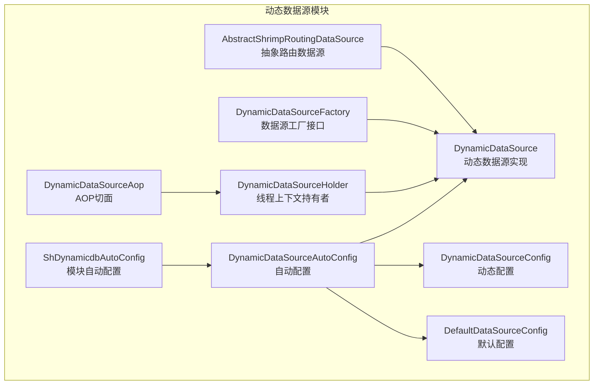
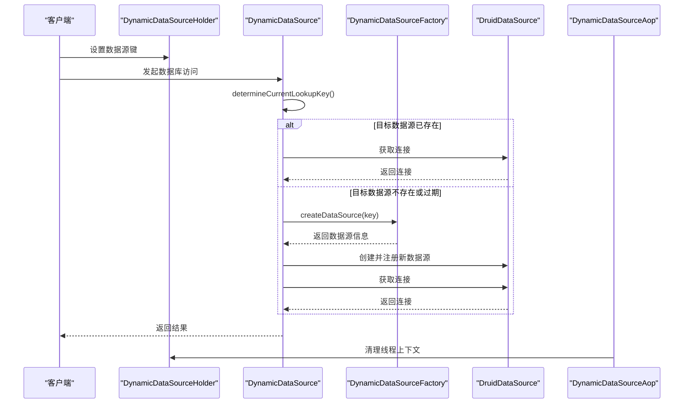
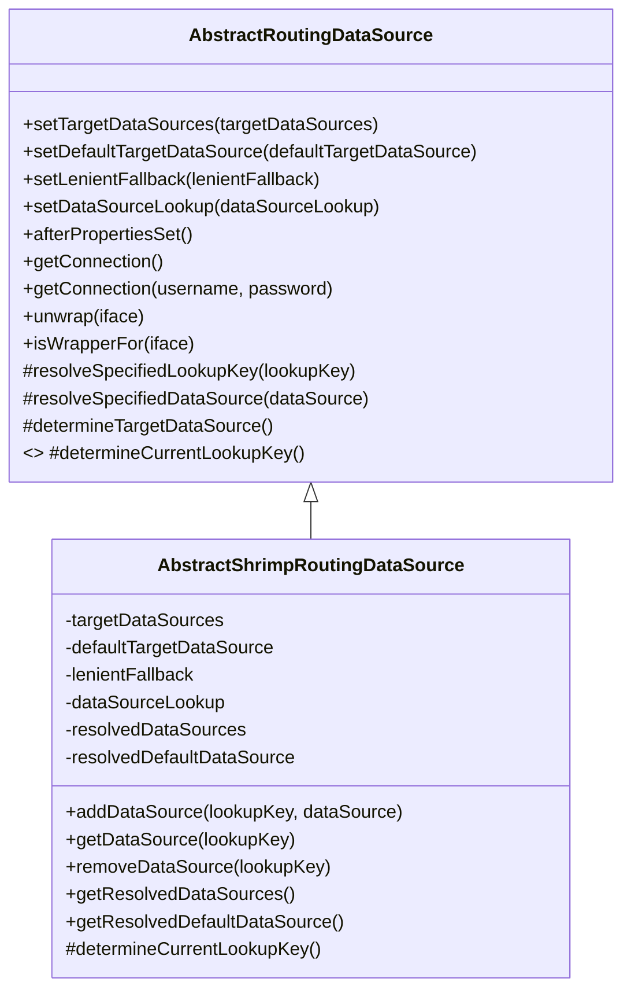
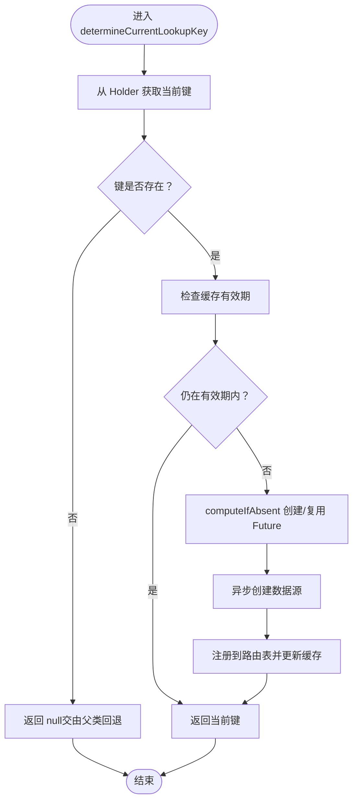
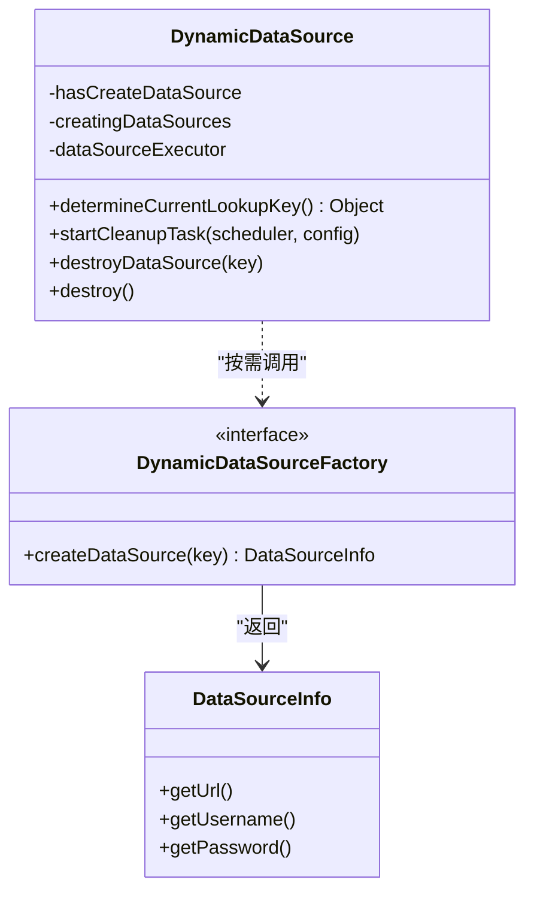
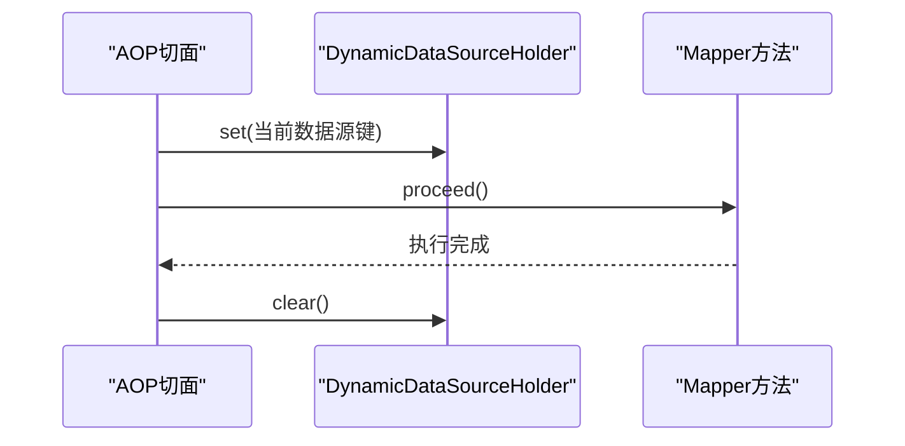
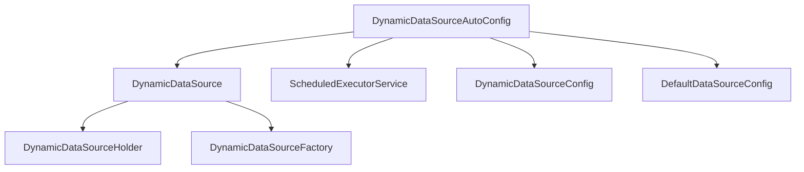
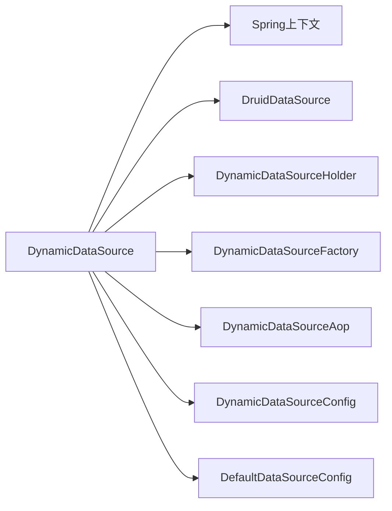

# 动态数据源架构设计

<cite>
**本文档引用的文件**
- [AbstractShrimpRoutingDataSource.java](file://sh-dynamicdb/src/main/java/com/wkclz/dynamicdb/AbstractShrimpRoutingDataSource.java)
- [DynamicDataSource.java](file://sh-dynamicdb/src/main/java/com/wkclz/dynamicdb/DynamicDataSource.java)
- [DynamicDataSourceFactory.java](file://sh-dynamicdb/src/main/java/com/wkclz/dynamicdb/DynamicDataSourceFactory.java)
- [DynamicDataSourceHolder.java](file://sh-dynamicdb/src/main/java/com/wkclz/dynamicdb/DynamicDataSourceHolder.java)
- [DynamicDataSourceAop.java](file://sh-dynamicdb/src/main/java/com/wkclz/dynamicdb/aop/DynamicDataSourceAop.java)
- [DynamicDataSourceAutoConfig.java](file://sh-dynamicdb/src/main/java/com/wkclz/dynamicdb/config/DynamicDataSourceAutoConfig.java)
- [DynamicDataSourceConfig.java](file://sh-dynamicdb/src/main/java/com/wkclz/dynamicdb/config/DynamicDataSourceConfig.java)
- [DefaultDataSourceConfig.java](file://sh-dynamicdb/src/main/java/com/wkclz/dynamicdb/bean/DefaultDataSourceConfig.java)
- [ShDynamicdbAutoConfig.java](file://sh-dynamicdb/src/main/java/com/wkclz/dynamicdb/ShDynamicdbAutoConfig.java)
</cite>

## 目录
1. [引言](#引言)
2. [项目结构](#项目结构)
3. [核心组件](#核心组件)
4. [架构总览](#架构总览)
5. [详细组件分析](#详细组件分析)
6. [依赖分析](#依赖分析)
7. [性能考虑](#性能考虑)
8. [故障排除指南](#故障排除指南)
9. [结论](#结论)
10. [附录](#附录)

## 引言
本技术文档围绕动态数据源架构设计展开，重点解析 AbstractShrimpRoutingDataSource 抽象路由数据源的设计理念与实现原理，说明其如何实现数据源的动态选择与切换；深入剖析 DynamicDataSource 的核心架构，包括数据源注册、路由决策与连接获取机制；阐述 DynamicDataSourceFactory 工厂模式的设计思想及通过 SPI 扩展机制实现可插拔的数据源配置；并给出最佳实践与设计模式的应用指导。

## 项目结构
动态数据源模块位于 sh-dynamicdb 包内，采用按职责分层的组织方式：
- 核心路由与工厂：AbstractShrimpRoutingDataSource、DynamicDataSource、DynamicDataSourceFactory
- 上下文与切面：DynamicDataSourceHolder、DynamicDataSourceAop
- 自动装配与配置：DynamicDataSourceAutoConfig、DynamicDataSourceConfig、DefaultDataSourceConfig、ShDynamicdbAutoConfig

**图表来源**
- [AbstractShrimpRoutingDataSource.java:1-170](file://sh-dynamicdb/src/main/java/com/wkclz/dynamicdb/AbstractShrimpRoutingDataSource.java#L1-L170)
- [DynamicDataSource.java:1-274](file://sh-dynamicdb/src/main/java/com/wkclz/dynamicdb/DynamicDataSource.java#L1-L274)
- [DynamicDataSourceFactory.java:1-13](file://sh-dynamicdb/src/main/java/com/wkclz/dynamicdb/DynamicDataSourceFactory.java#L1-L13)
- [DynamicDataSourceHolder.java:1-23](file://sh-dynamicdb/src/main/java/com/wkclz/dynamicdb/DynamicDataSourceHolder.java#L1-L23)
- [DynamicDataSourceAop.java:1-30](file://sh-dynamicdb/src/main/java/com/wkclz/dynamicdb/aop/DynamicDataSourceAop.java#L1-L30)
- [DynamicDataSourceAutoConfig.java:1-66](file://sh-dynamicdb/src/main/java/com/wkclz/dynamicdb/config/DynamicDataSourceAutoConfig.java#L1-L66)
- [DynamicDataSourceConfig.java:1-18](file://sh-dynamicdb/src/main/java/com/wkclz/dynamicdb/config/DynamicDataSourceConfig.java#L1-L18)
- [DefaultDataSourceConfig.java:1-33](file://sh-dynamicdb/src/main/java/com/wkclz/dynamicdb/bean/DefaultDataSourceConfig.java#L1-L33)
- [ShDynamicdbAutoConfig.java:1-12](file://sh-dynamicdb/src/main/java/com/wkclz/dynamicdb/ShDynamicdbAutoConfig.java#L1-L12)

**章节来源**
- [ShDynamicdbAutoConfig.java:1-12](file://sh-dynamicdb/src/main/java/com/wkclz/dynamicdb/ShDynamicdbAutoConfig.java#L1-L12)

## 核心组件
- AbstractShrimpRoutingDataSource：基于 Spring 的 AbstractRoutingDataSource 扩展，提供目标数据源集合管理、默认数据源解析、JNDI 查找支持以及动态路由键解析能力。
- DynamicDataSource：具体实现，覆盖 determineCurrentLookupKey，结合 DynamicDataSourceHolder 与 DynamicDataSourceFactory，实现按需创建与缓存数据源、异步创建与去重、定时清理过期数据源等。
- DynamicDataSourceFactory：SPI 工厂接口，约定按 key 返回 DataSourceInfo，供动态创建数据源。
- DynamicDataSourceHolder：线程上下文持有者，存储当前请求使用的数据源键。
- DynamicDataSourceAop：AOP 切面，在 Mapper 执行后清理线程上下文，避免泄漏。
- 配置类：DynamicDataSourceAutoConfig（自动装配）、DynamicDataSourceConfig（动态配置）、DefaultDataSourceConfig（默认连接池配置）。

**章节来源**
- [AbstractShrimpRoutingDataSource.java:17-170](file://sh-dynamicdb/src/main/java/com/wkclz/dynamicdb/AbstractShrimpRoutingDataSource.java#L17-L170)
- [DynamicDataSource.java:18-274](file://sh-dynamicdb/src/main/java/com/wkclz/dynamicdb/DynamicDataSource.java#L18-L274)
- [DynamicDataSourceFactory.java:5-12](file://sh-dynamicdb/src/main/java/com/wkclz/dynamicdb/DynamicDataSourceFactory.java#L5-L12)
- [DynamicDataSourceHolder.java:6-23](file://sh-dynamicdb/src/main/java/com/wkclz/dynamicdb/DynamicDataSourceHolder.java#L6-L23)
- [DynamicDataSourceAop.java:14-30](file://sh-dynamicdb/src/main/java/com/wkclz/dynamicdb/aop/DynamicDataSourceAop.java#L14-L30)
- [DynamicDataSourceAutoConfig.java:20-66](file://sh-dynamicdb/src/main/java/com/wkclz/dynamicdb/config/DynamicDataSourceAutoConfig.java#L20-L66)
- [DynamicDataSourceConfig.java:9-18](file://sh-dynamicdb/src/main/java/com/wkclz/dynamicdb/config/DynamicDataSourceConfig.java#L9-L18)
- [DefaultDataSourceConfig.java:9-33](file://sh-dynamicdb/src/main/java/com/wkclz/dynamicdb/bean/DefaultDataSourceConfig.java#L9-L33)

## 架构总览
动态数据源的整体工作流如下：
- 请求进入时，通过 DynamicDataSourceHolder 设置当前数据源键；
- MyBatis 执行 SQL 时，路由数据源根据当前键决定目标数据源；
- 若目标数据源尚未创建，则由 DynamicDataSourceFactory 按键创建 DataSourceInfo，再构建 Druid 数据源实例并注册到路由表；
- 定时任务周期性清理过期数据源，释放连接池资源；
- Mapper 执行完成后，AOP 清理线程上下文，防止污染后续请求。

**图表来源**
- [DynamicDataSource.java:47-139](file://sh-dynamicdb/src/main/java/com/wkclz/dynamicdb/DynamicDataSource.java#L47-L139)
- [DynamicDataSourceHolder.java:10-20](file://sh-dynamicdb/src/main/java/com/wkclz/dynamicdb/DynamicDataSourceHolder.java#L10-L20)
- [DynamicDataSourceFactory.java:10](file://sh-dynamicdb/src/main/java/com/wkclz/dynamicdb/DynamicDataSourceFactory.java#L10)
- [DynamicDataSourceAop.java:20-27](file://sh-dynamicdb/src/main/java/com/wkclz/dynamicdb/aop/DynamicDataSourceAop.java#L20-L27)

## 详细组件分析

### AbstractShrimpRoutingDataSource 分析
- 设计要点
  - 继承 Spring 的 AbstractRoutingDataSource，保留原生路由能力的同时，新增 addDataSource/getDataSource/removeDataSource 等便捷方法，便于运行时动态注册与移除数据源。
  - 支持通过 JNDI 查找数据源，具备 lenientFallback 回退策略，当无法解析到指定数据源时可回退至默认数据源。
  - afterPropertiesSet 中完成 targetDataSources 的解析与缓存，确保运行时只做一次解析，提升性能。
- 关键流程
  - determineTargetDataSource：先从当前 lookupKey 获取目标数据源，若为空且允许回退则使用默认数据源，否则抛出异常。
  - resolveSpecifiedDataSource：支持直接传入 DataSource 或字符串（JNDI 名称），并进行类型校验。
- 适用场景
  - 多租户、读写分离、按业务域切换等需要在运行时动态选择数据源的场景。

**图表来源**
- [AbstractShrimpRoutingDataSource.java:22-170](file://sh-dynamicdb/src/main/java/com/wkclz/dynamicdb/AbstractShrimpRoutingDataSource.java#L22-L170)

**章节来源**
- [AbstractShrimpRoutingDataSource.java:17-170](file://sh-dynamicdb/src/main/java/com/wkclz/dynamicdb/AbstractShrimpRoutingDataSource.java#L17-L170)

### DynamicDataSource 分析
- 设计要点
  - 覆盖 determineCurrentLookupKey，从 DynamicDataSourceHolder 获取当前键；若键为空，直接返回 null，交由父类回退策略处理。
  - 缓存机制：hasCreateDataSource 记录每个键最后创建时间；配合 DynamicDataSourceConfig 的缓存时长，避免频繁重建。
  - 并发与一致性：creatingDataSources 使用 computeIfAbsent 保证同一键的幂等创建；CompletableFuture 避免重复创建；失败时移除 Future，允许重试。
  - 异步创建：使用专用线程池（避免使用公共 ForkJoin 池），在后台创建数据源并注册到路由表。
  - 生命周期管理：destroy 方法优雅关闭线程池、取消清理任务、逐个关闭 Druid 连接池。
  - 定时清理：startCleanupTask 启动定时任务，扫描过期数据源并关闭；destroy 时停止任务。
- 关键流程
  - determineCurrentLookupKey：检查缓存有效性；若过期或缺失，触发异步创建；等待创建完成或抛出异常。
  - cleanupExpiredDataSources：遍历缓存记录，跳过正在创建中的键，关闭过期的 Druid 连接池并移除缓存。
  - destroyDataSource：取消进行中的创建任务，移除路由表项并关闭连接池。

**图表来源**
- [DynamicDataSource.java:47-139](file://sh-dynamicdb/src/main/java/com/wkclz/dynamicdb/DynamicDataSource.java#L47-L139)

**章节来源**
- [DynamicDataSource.java:18-274](file://sh-dynamicdb/src/main/java/com/wkclz/dynamicdb/DynamicDataSource.java#L18-L274)

### DynamicDataSourceFactory 工厂接口与 SPI 扩展
- 设计思想
  - 通过接口抽象数据源创建过程，允许上层业务按需实现自定义数据源加载策略（如从配置中心、服务发现、动态密钥管理等）。
  - 结合 Spring 的条件装配，仅当容器中存在该接口实现时才启用动态数据源自动配置。
- 扩展方法
  - 实现类需提供 createDataSource(key) 方法，返回 DataSourceInfo（包含连接地址、用户名、密码等必要信息）。
  - 将实现类注册为 Spring Bean，确保 DynamicDataSource 能通过 SpringContextHolder 获取到工厂实例。
- 集成方式
  - 在业务模块中声明实现类 Bean，即可无缝接入动态数据源框架，无需修改核心路由逻辑。

**图表来源**
- [DynamicDataSourceFactory.java:5-12](file://sh-dynamicdb/src/main/java/com/wkclz/dynamicdb/DynamicDataSourceFactory.java#L5-L12)
- [DynamicDataSource.java:82-109](file://sh-dynamicdb/src/main/java/com/wkclz/dynamicdb/DynamicDataSource.java#L82-L109)

**章节来源**
- [DynamicDataSourceFactory.java:5-12](file://sh-dynamicdb/src/main/java/com/wkclz/dynamicdb/DynamicDataSourceFactory.java#L5-L12)
- [DynamicDataSourceAutoConfig.java:21](file://sh-dynamicdb/src/main/java/com/wkclz/dynamicdb/config/DynamicDataSourceAutoConfig.java#L21)

### DynamicDataSourceHolder 与 AOP 切面
- DynamicDataSourceHolder
  - 使用 ThreadLocal 存储当前请求使用的数据源键，实现线程级隔离。
  - 提供 set/get/clear 方法，clear 在 finally 中由 AOP 统一调用，避免上下文泄漏。
- DynamicDataSourceAop
  - 基于 @Around 切面，匹配带有 @Mapper 注解的类，确保每次 Mapper 执行后清理线程上下文。
  - 保障多数据源场景下的线程安全与资源回收。

**图表来源**
- [DynamicDataSourceAop.java:20-27](file://sh-dynamicdb/src/main/java/com/wkclz/dynamicdb/aop/DynamicDataSourceAop.java#L20-L27)
- [DynamicDataSourceHolder.java:10-20](file://sh-dynamicdb/src/main/java/com/wkclz/dynamicdb/DynamicDataSourceHolder.java#L10-L20)

**章节来源**
- [DynamicDataSourceHolder.java:6-23](file://sh-dynamicdb/src/main/java/com/wkclz/dynamicdb/DynamicDataSourceHolder.java#L6-L23)
- [DynamicDataSourceAop.java:14-30](file://sh-dynamicdb/src/main/java/com/wkclz/dynamicdb/aop/DynamicDataSourceAop.java#L14-L30)

### 自动配置与运行时行为
- DynamicDataSourceAutoConfig
  - 条件装配：仅当容器中存在 DynamicDataSourceFactory Bean 时才创建动态数据源。
  - 初始化：设置默认数据源、空的目标数据源映射，并调用 afterPropertiesSet 完成解析。
  - 定时任务：创建单线程调度器，启动清理任务。
  - 销毁：停止调度器。
- DynamicDataSourceConfig/DefaultDataSourceConfig
  - 动态配置：缓存时长、清理间隔等参数可通过配置文件调整。
  - 默认配置：连接池参数默认值来源于 Spring Boot 配置与 Druid 默认值。

**图表来源**
- [DynamicDataSourceAutoConfig.java:20-66](file://sh-dynamicdb/src/main/java/com/wkclz/dynamicdb/config/DynamicDataSourceAutoConfig.java#L20-L66)
- [DynamicDataSourceConfig.java:9-18](file://sh-dynamicdb/src/main/java/com/wkclz/dynamicdb/config/DynamicDataSourceConfig.java#L9-L18)
- [DefaultDataSourceConfig.java:9-33](file://sh-dynamicdb/src/main/java/com/wkclz/dynamicdb/bean/DefaultDataSourceConfig.java#L9-L33)

**章节来源**
- [DynamicDataSourceAutoConfig.java:20-66](file://sh-dynamicdb/src/main/java/com/wkclz/dynamicdb/config/DynamicDataSourceAutoConfig.java#L20-L66)
- [DynamicDataSourceConfig.java:9-18](file://sh-dynamicdb/src/main/java/com/wkclz/dynamicdb/config/DynamicDataSourceConfig.java#L9-L18)
- [DefaultDataSourceConfig.java:9-33](file://sh-dynamicdb/src/main/java/com/wkclz/dynamicdb/bean/DefaultDataSourceConfig.java#L9-L33)

## 依赖分析
- 组件耦合
  - DynamicDataSource 对 Spring 上下文、线程池、定时调度器、Druid 连接池有直接依赖。
  - 通过 DynamicDataSourceFactory 与外部系统解耦，遵循开闭原则。
- 外部依赖
  - Druid 连接池：用于创建与管理数据源连接。
  - Spring JDBC：AbstractRoutingDataSource 提供路由能力。
  - Spring AOP：提供切面清理线程上下文。
- 循环依赖
  - 未见循环依赖迹象；各组件职责清晰，通过接口与配置装配协作。

**图表来源**
- [DynamicDataSource.java:82-109](file://sh-dynamicdb/src/main/java/com/wkclz/dynamicdb/DynamicDataSource.java#L82-L109)
- [DynamicDataSourceAop.java:20-27](file://sh-dynamicdb/src/main/java/com/wkclz/dynamicdb/aop/DynamicDataSourceAop.java#L20-L27)
- [DynamicDataSourceConfig.java:11-15](file://sh-dynamicdb/src/main/java/com/wkclz/dynamicdb/config/DynamicDataSourceConfig.java#L11-L15)
- [DefaultDataSourceConfig.java:20-30](file://sh-dynamicdb/src/main/java/com/wkclz/dynamicdb/bean/DefaultDataSourceConfig.java#L20-L30)

**章节来源**
- [DynamicDataSource.java:32-41](file://sh-dynamicdb/src/main/java/com/wkclz/dynamicdb/DynamicDataSource.java#L32-L41)

## 性能考虑
- 缓存与去重
  - 通过 hasCreateDataSource 与 creatingDataSources 实现键级幂等与去重，避免重复创建。
- 异步与线程池
  - 专用线程池避免阻塞公共线程池；CallerRunsPolicy 在高负载时保护系统稳定性。
- 连接池管理
  - 使用 Druid 连接池，支持统计、防火墙与日志过滤器；过期数据源定时清理，降低内存与连接占用。
- 配置优化
  - 合理设置缓存时长与清理间隔，平衡延迟与资源占用。

[本节为通用性能建议，不直接分析具体文件]

## 故障排除指南
- 现象：无法确定目标数据源
  - 排查：确认 determineCurrentLookupKey 是否返回非空键；检查 lenientFallback 配置；确认默认数据源已设置。
  - 参考：[AbstractShrimpRoutingDataSource.java:150-167](file://sh-dynamicdb/src/main/java/com/wkclz/dynamicdb/AbstractShrimpRoutingDataSource.java#L150-L167)
- 现象：数据源创建失败
  - 排查：检查 DynamicDataSourceFactory 实现是否正确返回 DataSourceInfo；确认连接参数合法；查看线程池与 Future 状态。
  - 参考：[DynamicDataSource.java:112-118](file://sh-dynamicdb/src/main/java/com/wkclz/dynamicdb/DynamicDataSource.java#L112-L118)
- 现象：连接池泄漏或资源未释放
  - 排查：确认 AOP 是否清理线程上下文；检查 destroy 与 stopCleanupTask 是否被调用；验证 Druid 关闭流程。
  - 参考：[DynamicDataSourceAop.java:24-26](file://sh-dynamicdb/src/main/java/com/wkclz/dynamicdb/aop/DynamicDataSourceAop.java#L24-L26), [DynamicDataSource.java:237-271](file://sh-dynamicdb/src/main/java/com/wkclz/dynamicdb/DynamicDataSource.java#L237-L271)
- 现象：清理任务未启动或重复启动
  - 排查：确认自动配置条件装配；检查 cleanupFuture 状态；核对配置项。
  - 参考：[DynamicDataSourceAutoConfig.java:53-57](file://sh-dynamicdb/src/main/java/com/wkclz/dynamicdb/config/DynamicDataSourceAutoConfig.java#L53-L57), [DynamicDataSource.java:144-159](file://sh-dynamicdb/src/main/java/com/wkclz/dynamicdb/DynamicDataSource.java#L144-L159)

**章节来源**
- [AbstractShrimpRoutingDataSource.java:150-167](file://sh-dynamicdb/src/main/java/com/wkclz/dynamicdb/AbstractShrimpRoutingDataSource.java#L150-L167)
- [DynamicDataSource.java:112-118](file://sh-dynamicdb/src/main/java/com/wkclz/dynamicdb/DynamicDataSource.java#L112-L118)
- [DynamicDataSourceAop.java:24-26](file://sh-dynamicdb/src/main/java/com/wkclz/dynamicdb/aop/DynamicDataSourceAop.java#L24-L26)
- [DynamicDataSourceAutoConfig.java:53-57](file://sh-dynamicdb/src/main/java/com/wkclz/dynamicdb/config/DynamicDataSourceAutoConfig.java#L53-L57)

## 结论
本架构以 AbstractShrimpRoutingDataSource 为基础，结合 DynamicDataSource 的运行时动态创建与缓存、清理机制，以及 DynamicDataSourceFactory 的 SPI 扩展能力，实现了灵活、高性能、可维护的动态数据源解决方案。通过线程上下文与 AOP 的配合，确保了线程安全与资源回收；通过自动配置与可调参数，满足不同业务场景的性能与可靠性需求。

[本节为总结性内容，不直接分析具体文件]

## 附录
- 最佳实践
  - 明确数据源键命名规范，避免冲突与歧义。
  - 合理设置缓存时长与清理间隔，兼顾性能与资源占用。
  - 在工厂实现中加入重试与熔断策略，提升可用性。
  - 使用 AOP 统一清理线程上下文，避免遗漏。
  - 对 Druid 参数进行压测与调优，确保高并发下的稳定性。
- 设计模式应用
  - 工厂模式：DynamicDataSourceFactory 抽象创建过程。
  - 策略模式：按键选择不同数据源策略。
  - 责任链/装饰器：AbstractRoutingDataSource 提供路由能力，DynamicDataSource 增强运行时行为。
  - 单例/线程局部：DynamicDataSourceHolder 保障线程隔离。

[本节为通用建议，不直接分析具体文件]