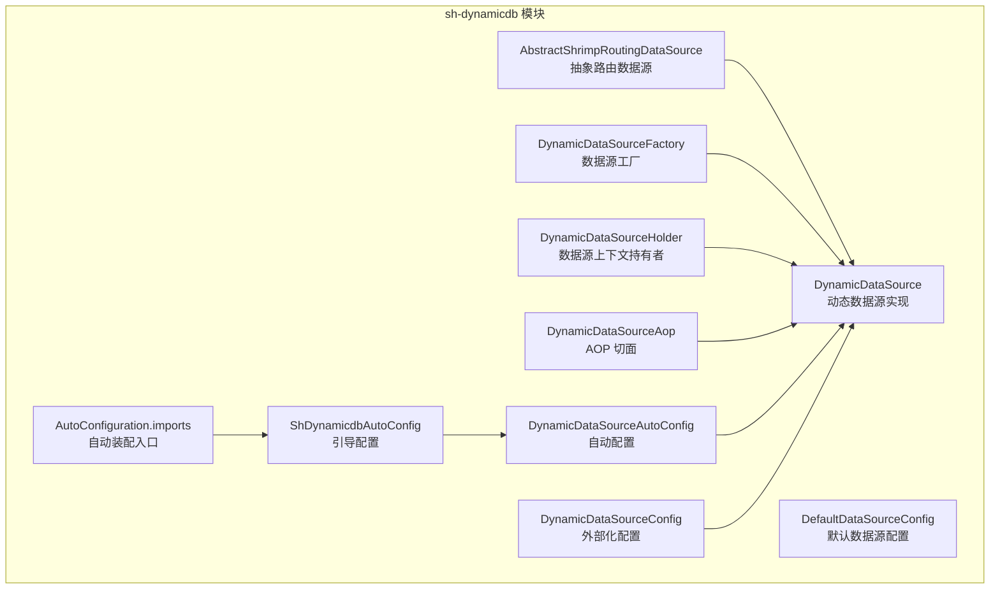
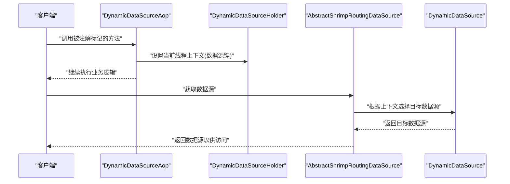
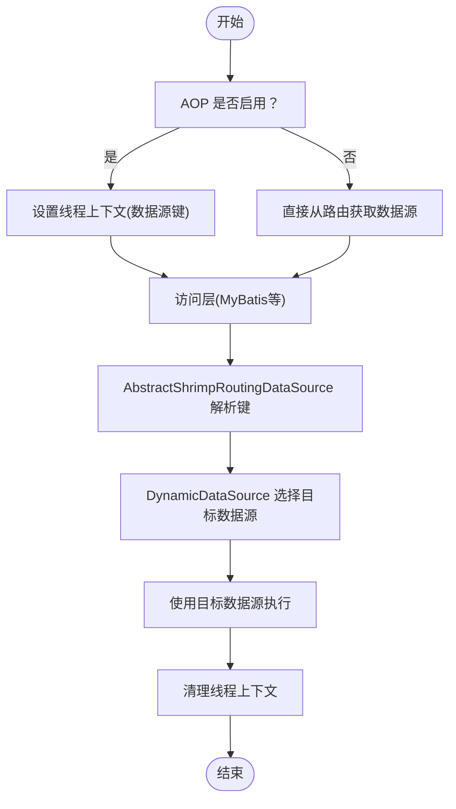
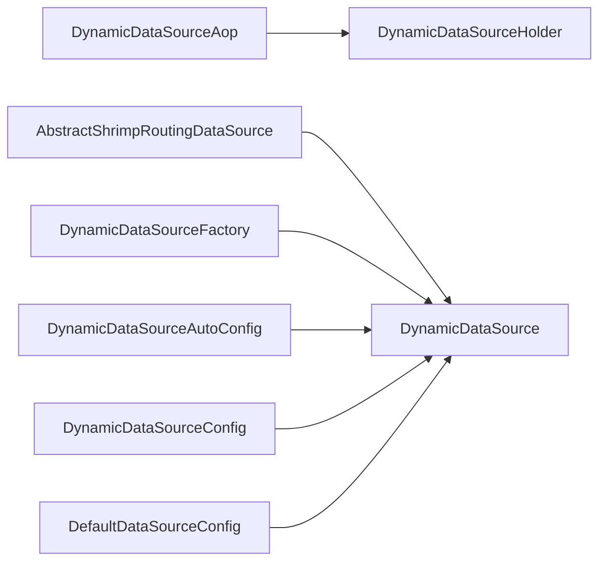

# 动态数据源模块（sh-dynamicdb）

<cite>
**本文引用的文件**
- [AbstractShrimpRoutingDataSource.java](file://sh-dynamicdb/src/main/java/com/wkclz/dynamicdb/AbstractShrimpRoutingDataSource.java)
- [DynamicDataSource.java](file://sh-dynamicdb/src/main/java/com/wkclz/dynamicdb/DynamicDataSource.java)
- [DynamicDataSourceFactory.java](file://sh-dynamicdb/src/main/java/com/wkclz/dynamicdb/DynamicDataSourceFactory.java)
- [DynamicDataSourceHolder.java](file://sh-dynamicdb/src/main/java/com/wkclz/dynamicdb/DynamicDataSourceHolder.java)
- [DynamicDataSourceAop.java](file://sh-dynamicdb/src/main/java/com/wkclz/dynamicdb/aop/DynamicDataSourceAop.java)
- [DefaultDataSourceConfig.java](file://sh-dynamicdb/src/main/java/com/wkclz/dynamicdb/bean/DefaultDataSourceConfig.java)
- [DynamicDataSourceAutoConfig.java](file://sh-dynamicdb/src/main/java/com/wkclz/dynamicdb/config/DynamicDataSourceAutoConfig.java)
- [DynamicDataSourceConfig.java](file://sh-dynamicdb/src/main/java/com/wkclz/dynamicdb/config/DynamicDataSourceConfig.java)
- [ShDynamicdbAutoConfig.java](file://sh-dynamicdb/src/main/java/com/wkclz/dynamicdb/ShDynamicdbAutoConfig.java)
- [org.springframework.boot.autoconfigure.AutoConfiguration.imports](file://sh-dynamicdb/src/main/resources/META-INF/spring/org.springframework.boot.autoconfigure.AutoConfiguration.imports)
- [pom.xml](file://sh-dynamicdb/pom.xml)
</cite>

## 目录
1. [简介](#简介)
2. [项目结构](#项目结构)
3. [核心组件](#核心组件)
4. [架构总览](#架构总览)
5. [详细组件分析](#详细组件分析)
6. [依赖关系分析](#依赖关系分析)
7. [性能考虑](#性能考虑)
8. [故障排查指南](#故障排查指南)
9. [结论](#结论)
10. [附录：使用示例与最佳实践](#附录使用示例与最佳实践)

## 简介
本文件面向 sh-dynamicdb 动态数据源模块，系统性阐述其架构设计与实现要点，重点覆盖：
- 路由机制：AbstractShrimpRoutingDataSource 的路由选择策略
- 运行时切换：基于 ThreadLocal 的上下文管理与 AOP 切面编程
- 并发优化：DCL（双重检查锁定）在数据源创建中的应用
- 异步策略：异步数据源创建与性能权衡
- 工厂与 SPI：DynamicDataSourceFactory 的工厂模式与 SPI 扩展
- 多数据源配置：连接池、健康检查与故障转移的实践建议
- 使用示例与常见问题

## 项目结构
动态数据源模块采用按职责分层的组织方式，核心类集中在 com.wkclz.dynamicdb 包下，并通过 Spring Boot 自动装配机制进行装配。

图表来源
- [AbstractShrimpRoutingDataSource.java](file://sh-dynamicdb/src/main/java/com/wkclz/dynamicdb/AbstractShrimpRoutingDataSource.java)
- [DynamicDataSource.java](file://sh-dynamicdb/src/main/java/com/wkclz/dynamicdb/DynamicDataSource.java)
- [DynamicDataSourceFactory.java](file://sh-dynamicdb/src/main/java/com/wkclz/dynamicdb/DynamicDataSourceFactory.java)
- [DynamicDataSourceHolder.java](file://sh-dynamicdb/src/main/java/com/wkclz/dynamicdb/DynamicDataSourceHolder.java)
- [DynamicDataSourceAop.java](file://sh-dynamicdb/src/main/java/com/wkclz/dynamicdb/aop/DynamicDataSourceAop.java)
- [DefaultDataSourceConfig.java](file://sh-dynamicdb/src/main/java/com/wkclz/dynamicdb/bean/DefaultDataSourceConfig.java)
- [DynamicDataSourceAutoConfig.java](file://sh-dynamicdb/src/main/java/com/wkclz/dynamicdb/config/DynamicDataSourceAutoConfig.java)
- [DynamicDataSourceConfig.java](file://sh-dynamicdb/src/main/java/com/wkclz/dynamicdb/config/DynamicDataSourceConfig.java)
- [ShDynamicdbAutoConfig.java](file://sh-dynamicdb/src/main/java/com/wkclz/dynamicdb/ShDynamicdbAutoConfig.java)
- [org.springframework.boot.autoconfigure.AutoConfiguration.imports](file://sh-dynamicdb/src/main/resources/META-INF/spring/org.springframework.boot.autoconfigure.AutoConfiguration.imports)

章节来源
- [pom.xml](file://sh-dynamicdb/pom.xml)
- [org.springframework.boot.autoconfigure.AutoConfiguration.imports](file://sh-dynamicdb/src/main/resources/META-INF/spring/org.springframework.boot.autoconfigure.AutoConfiguration.imports)

## 核心组件
- AbstractShrimpRoutingDataSource：抽象路由数据源基类，负责根据当前上下文决定目标数据源
- DynamicDataSource：具体动态数据源实现，承载数据源注册、切换与生命周期管理
- DynamicDataSourceFactory：数据源工厂，负责创建与缓存数据源实例，支持 SPI 扩展
- DynamicDataSourceHolder：线程本地上下文持有者，保存当前线程绑定的数据源键
- DynamicDataSourceAop：AOP 切面，拦截标注了路由注解的方法，设置上下文并完成切换
- DefaultDataSourceConfig：默认数据源配置项，提供基础连接参数与行为约定
- DynamicDataSourceAutoConfig / DynamicDataSourceConfig：自动装配与外部化配置
- ShDynamicdbAutoConfig：模块引导配置，整合自动装配入口

章节来源
- [AbstractShrimpRoutingDataSource.java](file://sh-dynamicdb/src/main/java/com/wkclz/dynamicdb/AbstractShrimpRoutingDataSource.java)
- [DynamicDataSource.java](file://sh-dynamicdb/src/main/java/com/wkclz/dynamicdb/DynamicDataSource.java)
- [DynamicDataSourceFactory.java](file://sh-dynamicdb/src/main/java/com/wkclz/dynamicdb/DynamicDataSourceFactory.java)
- [DynamicDataSourceHolder.java](file://sh-dynamicdb/src/main/java/com/wkclz/dynamicdb/DynamicDataSourceHolder.java)
- [DynamicDataSourceAop.java](file://sh-dynamicdb/src/main/java/com/wkclz/dynamicdb/aop/DynamicDataSourceAop.java)
- [DefaultDataSourceConfig.java](file://sh-dynamicdb/src/main/java/com/wkclz/dynamicdb/bean/DefaultDataSourceConfig.java)
- [DynamicDataSourceAutoConfig.java](file://sh-dynamicdb/src/main/java/com/wkclz/dynamicdb/config/DynamicDataSourceAutoConfig.java)
- [DynamicDataSourceConfig.java](file://sh-dynamicdb/src/main/java/com/wkclz/dynamicdb/config/DynamicDataSourceConfig.java)
- [ShDynamicdbAutoConfig.java](file://sh-dynamicdb/src/main/java/com/wkclz/dynamicdb/ShDynamicdbAutoConfig.java)

## 架构总览
动态数据源的整体工作流如下：客户端发起请求，AOP 切面根据方法上的路由注解设置线程上下文；随后 MyBatis 或其他访问层从 AbstractShrimpRoutingDataSource 中解析当前数据源键，委托到 DynamicDataSource 完成实际的数据源选择与切换。

图表来源
- [DynamicDataSourceAop.java](file://sh-dynamicdb/src/main/java/com/wkclz/dynamicdb/aop/DynamicDataSourceAop.java)
- [DynamicDataSourceHolder.java](file://sh-dynamicdb/src/main/java/com/wkclz/dynamicdb/DynamicDataSourceHolder.java)
- [AbstractShrimpRoutingDataSource.java](file://sh-dynamicdb/src/main/java/com/wkclz/dynamicdb/AbstractShrimpRoutingDataSource.java)
- [DynamicDataSource.java](file://sh-dynamicdb/src/main/java/com/wkclz/dynamicdb/DynamicDataSource.java)

## 详细组件分析

### AbstractShrimpRoutingDataSource 路由机制
- 职责：作为路由中心，依据当前线程上下文决定应使用的数据源
- 关键点：
  - 从上下文持有者获取当前数据源键
  - 将该键映射到已注册的数据源集合中
  - 若未命中或未注册，则回退到默认数据源
- 设计优势：将“上下文解析”与“数据源选择”解耦，便于扩展与测试

章节来源
- [AbstractShrimpRoutingDataSource.java](file://sh-dynamicdb/src/main/java/com/wkclz/dynamicdb/AbstractShrimpRoutingDataSource.java)

### DynamicDataSource 实现原理
- 职责：维护数据源注册表、提供注册/切换能力、封装生命周期管理
- 关键点：
  - 注册数据源：将名称与数据源实例建立映射
  - 切换策略：结合上下文键与路由规则选择目标数据源
  - 默认数据源：当上下文为空或未匹配时的兜底策略
- 与 AbstractShrimpRoutingDataSource 协作：后者负责解析，前者负责落地选择

章节来源
- [DynamicDataSource.java](file://sh-dynamicdb/src/main/java/com/wkclz/dynamicdb/DynamicDataSource.java)

### DynamicDataSourceHolder 上下文管理
- 职责：以 ThreadLocal 保存当前线程绑定的数据源键
- 关键点：
  - 设置/清除：在 AOP 前置通知中设置，在后置/异常通知中清理
  - 防泄漏：确保每个请求结束后上下文被清空，避免线程复用导致的脏读
- 与 AOP 协同：AOP 在进入/退出目标方法时写入/清理上下文

章节来源
- [DynamicDataSourceHolder.java](file://sh-dynamicdb/src/main/java/com/wkclz/dynamicdb/DynamicDataSourceHolder.java)

### DynamicDataSourceAop 路由切面
- 职责：拦截带路由注解的方法，动态设置线程上下文并完成数据源切换
- 关键点：
  - 注解识别：扫描方法上的路由注解，提取目标数据源键
  - 前置通知：设置上下文
  - 后置/异常通知：清理上下文
  - 异常处理：保证上下文清理不因异常而遗漏
- 与 AbstractShrimpRoutingDataSource 协同：通过上下文键驱动路由

章节来源
- [DynamicDataSourceAop.java](file://sh-dynamicdb/src/main/java/com/wkclz/dynamicdb/aop/DynamicDataSourceAop.java)

### DynamicDataSourceFactory 工厂与 SPI 扩展
- 职责：统一创建数据源实例，支持通过 SPI 扩展不同实现
- 关键点：
  - 工厂方法：接收配置对象，返回标准化的数据源实例
  - 缓存策略：避免重复创建，提升性能
  - SPI 扩展：允许外部模块提供自定义实现，增强可插拔性
- 与 DynamicDataSource 协同：为动态数据源提供可用的数据源实例

章节来源
- [DynamicDataSourceFactory.java](file://sh-dynamicdb/src/main/java/com/wkclz/dynamicdb/DynamicDataSourceFactory.java)

### 默认配置与自动装配
- DefaultDataSourceConfig：提供默认连接参数与行为约定，作为最小可用配置
- DynamicDataSourceAutoConfig / DynamicDataSourceConfig：自动装配与外部化配置，支持从配置文件注入
- ShDynamicdbAutoConfig：模块引导配置，整合自动装配入口

章节来源
- [DefaultDataSourceConfig.java](file://sh-dynamicdb/src/main/java/com/wkclz/dynamicdb/bean/DefaultDataSourceConfig.java)
- [DynamicDataSourceAutoConfig.java](file://sh-dynamicdb/src/main/java/com/wkclz/dynamicdb/config/DynamicDataSourceAutoConfig.java)
- [DynamicDataSourceConfig.java](file://sh-dynamicdb/src/main/java/com/wkclz/dynamicdb/config/DynamicDataSourceConfig.java)
- [ShDynamicdbAutoConfig.java](file://sh-dynamicdb/src/main/java/com/wkclz/dynamicdb/ShDynamicdbAutoConfig.java)
- [org.springframework.boot.autoconfigure.AutoConfiguration.imports](file://sh-dynamicdb/src/main/resources/META-INF/spring/org.springframework.boot.autoconfigure.AutoConfiguration.imports)

### 运行时数据源切换流程

图表来源
- [DynamicDataSourceAop.java](file://sh-dynamicdb/src/main/java/com/wkclz/dynamicdb/aop/DynamicDataSourceAop.java)
- [DynamicDataSourceHolder.java](file://sh-dynamicdb/src/main/java/com/wkclz/dynamicdb/DynamicDataSourceHolder.java)
- [AbstractShrimpRoutingDataSource.java](file://sh-dynamicdb/src/main/java/com/wkclz/dynamicdb/AbstractShrimpRoutingDataSource.java)
- [DynamicDataSource.java](file://sh-dynamicdb/src/main/java/com/wkclz/dynamicdb/DynamicDataSource.java)

## 依赖关系分析
- 组件内聚：各组件职责清晰，围绕“上下文 -> 路由 -> 选择 -> 访问”的主链路协作
- 组件耦合：AOP 与上下文持有者强耦合；路由与动态数据源弱耦合，便于替换
- 外部依赖：依赖 Spring Boot 自动装配机制与线程本地存储

图表来源
- [DynamicDataSourceAop.java](file://sh-dynamicdb/src/main/java/com/wkclz/dynamicdb/aop/DynamicDataSourceAop.java)
- [DynamicDataSourceHolder.java](file://sh-dynamicdb/src/main/java/com/wkclz/dynamicdb/DynamicDataSourceHolder.java)
- [AbstractShrimpRoutingDataSource.java](file://sh-dynamicdb/src/main/java/com/wkclz/dynamicdb/AbstractShrimpRoutingDataSource.java)
- [DynamicDataSource.java](file://sh-dynamicdb/src/main/java/com/wkclz/dynamicdb/DynamicDataSource.java)
- [DynamicDataSourceFactory.java](file://sh-dynamicdb/src/main/java/com/wkclz/dynamicdb/DynamicDataSourceFactory.java)
- [DynamicDataSourceAutoConfig.java](file://sh-dynamicdb/src/main/java/com/wkclz/dynamicdb/config/DynamicDataSourceAutoConfig.java)
- [DynamicDataSourceConfig.java](file://sh-dynamicdb/src/main/java/com/wkclz/dynamicdb/config/DynamicDataSourceConfig.java)
- [DefaultDataSourceConfig.java](file://sh-dynamicdb/src/main/java/com/wkclz/dynamicdb/bean/DefaultDataSourceConfig.java)

章节来源
- [pom.xml](file://sh-dynamicdb/pom.xml)

## 性能考虑
- DCL（双重检查锁定）在数据源创建中的作用
  - 目的：在高并发场景下减少同步开销，仅在首次创建时加锁
  - 效果：显著降低热点路径的锁竞争，提升吞吐量
  - 注意：需确保变量可见性与原子性，避免指令重排带来的风险
- 异步数据源创建策略
  - 场景：预热常用数据源、延迟初始化冷门数据源
  - 方案：使用线程池异步构建数据源，完成后注册到动态数据源
  - 权衡：异步可能带来初始化时延与失败重试成本，需结合业务峰值评估
- 连接池与资源管理
  - 建议：为每个数据源配置独立连接池，限制最大连接数与空闲时间
  - 健康检查：周期性检测连接可用性，剔除不可用实例
  - 故障转移：在主库不可用时快速切换至备用库，记录切换日志
- 线程上下文清理
  - 必须在每个请求结束时清理 ThreadLocal，防止内存泄漏与脏读

## 故障排查指南
- 症状：切换无效或始终使用默认数据源
  - 排查：确认 AOP 是否生效、注解是否正确标注、上下文是否被清理
  - 参考：AOP 切面与上下文持有者的协作流程
- 症状：内存泄漏或线程复用导致的脏读
  - 排查：检查是否在 finally 中清理上下文
  - 参考：上下文清理的前置/后置/异常分支
- 症状：高并发下创建数据源阻塞
  - 排查：是否使用 DCL 优化；是否开启异步创建
  - 参考：工厂创建与异步策略
- 症状：连接池泄漏或连接耗尽
  - 排查：连接池配置、健康检查与故障转移策略
  - 参考：连接池参数与健康检查机制

章节来源
- [DynamicDataSourceAop.java](file://sh-dynamicdb/src/main/java/com/wkclz/dynamicdb/aop/DynamicDataSourceAop.java)
- [DynamicDataSourceHolder.java](file://sh-dynamicdb/src/main/java/com/wkclz/dynamicdb/DynamicDataSourceHolder.java)
- [DynamicDataSourceFactory.java](file://sh-dynamicdb/src/main/java/com/wkclz/dynamicdb/DynamicDataSourceFactory.java)

## 结论
sh-dynamicdb 通过“AOP + ThreadLocal + 路由 + 工厂 + SPI”的组合，实现了灵活、高性能且可扩展的动态数据源方案。其关键在于：
- 明确的职责边界与清晰的协作链路
- 对并发与资源的细致优化（DCL、异步创建）
- 完善的上下文管理与异常兜底
- 可插拔的工厂与 SPI 扩展能力

## 附录：使用示例与最佳实践
- 使用示例（步骤级说明）
  - 步骤 1：在方法上添加路由注解，声明目标数据源键
  - 步骤 2：确保 AOP 切面已启用，以便自动设置/清理上下文
  - 步骤 3：在启动阶段注册所需数据源，或依赖工厂按需创建
  - 步骤 4：访问层（如 MyBatis）将根据当前上下文选择数据源
- 最佳实践
  - 数据源命名：使用语义化键名，避免冲突
  - 连接池：为每个数据源配置独立连接池，设置合理的超时与回收策略
  - 健康检查：定期探测主备库可用性，及时剔除不可用节点
  - 故障转移：在主库异常时快速切换至备用库，并记录切换事件
  - 异步创建：对冷门数据源采用异步创建，缩短首请求延迟
  - DCL 优化：在工厂创建数据源时使用双重检查锁定，降低锁竞争
  - 上下文清理：确保 finally 分支清理 ThreadLocal，避免泄漏