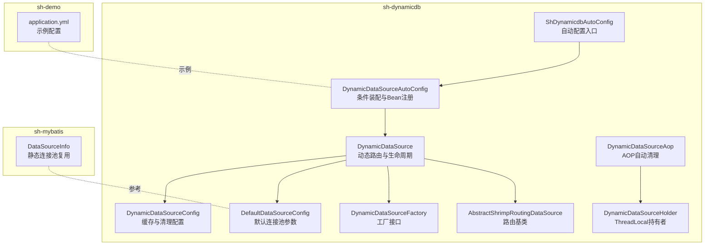
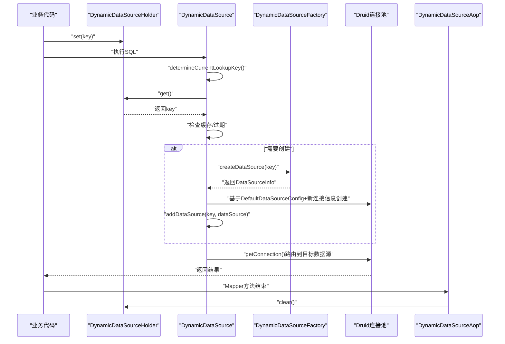
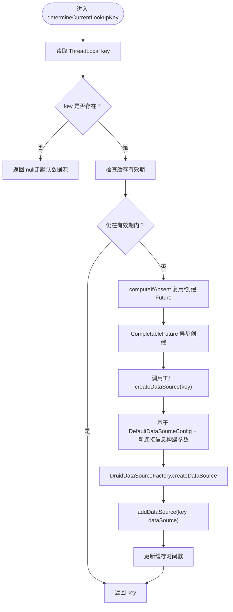
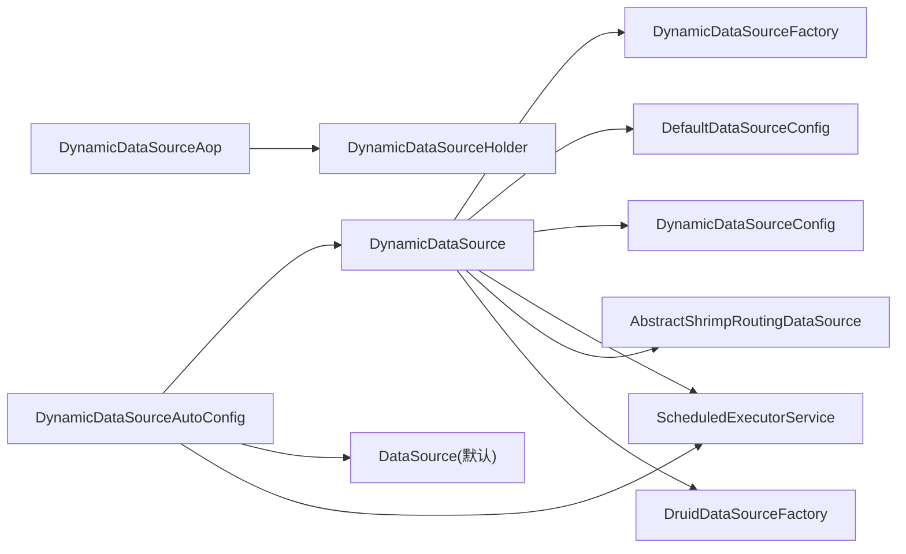

# 多数据源配置管理

<cite>
**本文引用的文件**
- [DefaultDataSourceConfig.java](file://sh-dynamicdb/src/main/java/com/wkclz/dynamicdb/bean/DefaultDataSourceConfig.java)
- [DynamicDataSource.java](file://sh-dynamicdb/src/main/java/com/wkclz/dynamicdb/DynamicDataSource.java)
- [DynamicDataSourceConfig.java](file://sh-dynamicdb/src/main/java/com/wkclz/dynamicdb/config/DynamicDataSourceConfig.java)
- [DynamicDataSourceAutoConfig.java](file://sh-dynamicdb/src/main/java/com/wkclz/dynamicdb/config/DynamicDataSourceAutoConfig.java)
- [DynamicDataSourceFactory.java](file://sh-dynamicdb/src/main/java/com/wkclz/dynamicdb/DynamicDataSourceFactory.java)
- [DynamicDataSourceHolder.java](file://sh-dynamicdb/src/main/java/com/wkclz/dynamicdb/DynamicDataSourceHolder.java)
- [DynamicDataSourceAop.java](file://sh-dynamicdb/src/main/java/com/wkclz/dynamicdb/aop/DynamicDataSourceAop.java)
- [AbstractShrimpRoutingDataSource.java](file://sh-dynamicdb/src/main/java/com/wkclz/dynamicdb/AbstractShrimpRoutingDataSource.java)
- [ShDynamicdbAutoConfig.java](file://sh-dynamicdb/src/main/java/com/wkclz/dynamicdb/ShDynamicdbAutoConfig.java)
- [DataSourceInfo.java](file://sh-mybatis/src/main/java/com/wkclz/mybatis/bean/DataSourceInfo.java)
- [application.yml](file://sh-demo/src/main/resources/config/application.yml)
- [SKILL.md](file://.agents/skills/sh-dynamicdb/SKILL.md)
- [US-020-动态数据源运行时切换.md](file://docs/stories/US-020-动态数据源运行时切换.md)
- [US-021-动态数据源DCL与异步创建.md](file://docs/stories/US-021-动态数据源DCL与异步创建.md)
- [AGENTS.md](file://AGENTS.md)
</cite>

## 目录
1. [简介](#简介)
2. [项目结构](#项目结构)
3. [核心组件](#核心组件)
4. [架构总览](#架构总览)
5. [详细组件分析](#详细组件分析)
6. [依赖分析](#依赖分析)
7. [性能考虑](#性能考虑)
8. [故障排查指南](#故障排查指南)
9. [结论](#结论)
10. [附录](#附录)

## 简介
本技术文档围绕多数据源配置管理展开，系统性介绍动态数据源的配置方法、命名规范、路由规则、生命周期管理、连接池最佳实践、动态增删与热更新机制，并提供完整配置示例与故障排查指南。目标读者既包括需要快速上手的开发者，也包括希望深入理解实现细节的架构师。

## 项目结构
- 模块定位：sh-dynamicdb 提供运行时动态切换数据源的能力，基于 Spring 的 AbstractRoutingDataSource 扩展，结合 AOP 自动清理 ThreadLocal，支持异步创建与缓存控制。
- 关键包与职责：
  - bean：默认连接池参数配置 DefaultDataSourceConfig
  - config：自动装配与运行参数 DynamicDataSourceConfig、DynamicDataSourceAutoConfig
  - 动态路由：DynamicDataSource、AbstractShrimpRoutingDataSource
  - 工厂与持有者：DynamicDataSourceFactory、DynamicDataSourceHolder
  - AOP：DynamicDataSourceAop
  - 自动配置入口：ShDynamicdbAutoConfig
- 示例与文档：sh-demo 提供示例配置；.agents/skills/sh-dynamicdb/SKILL.md 与 docs/stories 提供使用说明与验收场景。

图表来源
- [ShDynamicdbAutoConfig.java:1-12](file://sh-dynamicdb/src/main/java/com/wkclz/dynamicdb/ShDynamicdbAutoConfig.java#L1-L12)
- [DynamicDataSourceAutoConfig.java:1-66](file://sh-dynamicdb/src/main/java/com/wkclz/dynamicdb/config/DynamicDataSourceAutoConfig.java#L1-L66)
- [DynamicDataSource.java:1-274](file://sh-dynamicdb/src/main/java/com/wkclz/dynamicdb/DynamicDataSource.java#L1-L274)
- [AbstractShrimpRoutingDataSource.java:1-101](file://sh-dynamicdb/src/main/java/com/wkclz/dynamicdb/AbstractShrimpRoutingDataSource.java#L1-L101)
- [DynamicDataSourceFactory.java:1-13](file://sh-dynamicdb/src/main/java/com/wkclz/dynamicdb/DynamicDataSourceFactory.java#L1-L13)
- [DynamicDataSourceHolder.java:1-23](file://sh-dynamicdb/src/main/java/com/wkclz/dynamicdb/DynamicDataSourceHolder.java#L1-L23)
- [DynamicDataSourceAop.java:1-30](file://sh-dynamicdb/src/main/java/com/wkclz/dynamicdb/aop/DynamicDataSourceAop.java#L1-L30)
- [DefaultDataSourceConfig.java:1-33](file://sh-dynamicdb/src/main/java/com/wkclz/dynamicdb/bean/DefaultDataSourceConfig.java#L1-L33)
- [DynamicDataSourceConfig.java:1-18](file://sh-dynamicdb/src/main/java/com/wkclz/dynamicdb/config/DynamicDataSourceConfig.java#L1-L18)
- [DataSourceInfo.java:1-126](file://sh-mybatis/src/main/java/com/wkclz/mybatis/bean/DataSourceInfo.java#L1-L126)
- [application.yml:1-26](file://sh-demo/src/main/resources/config/application.yml#L1-L26)

章节来源
- [ShDynamicdbAutoConfig.java:1-12](file://sh-dynamicdb/src/main/java/com/wkclz/dynamicdb/ShDynamicdbAutoConfig.java#L1-L12)
- [DynamicDataSourceAutoConfig.java:1-66](file://sh-dynamicdb/src/main/java/com/wkclz/dynamicdb/config/DynamicDataSourceAutoConfig.java#L1-L66)
- [application.yml:1-26](file://sh-demo/src/main/resources/config/application.yml#L1-L26)

## 核心组件
- DefaultDataSourceConfig：定义默认连接池参数（初始连接数、最大活跃、最小空闲、最大等待、过滤器等），用于动态创建数据源时复用主数据源的连接池行为。
- DynamicDataSource：核心路由类，负责根据 ThreadLocal 中的 key 决定当前数据源，支持缓存控制、异步创建、销毁与清理。
- DynamicDataSourceConfig：运行时配置，如数据源缓存过期时间与清理周期。
- DynamicDataSourceAutoConfig：条件装配，注册清理调度器与 DynamicDataSource Bean，并将其设为 @Primary。
- DynamicDataSourceFactory：工厂接口，业务侧实现以根据 key 返回 DataSourceInfo。
- DynamicDataSourceHolder：线程本地存储当前数据源 key。
- DynamicDataSourceAop：AOP 切面，在 Mapper 方法执行后清理 ThreadLocal，防止泄漏。
- AbstractShrimpRoutingDataSource：扩展 Spring 路由基类，提供 addDataSource/getDataSource/removeDataSource 等能力。
- DataSourceInfo：静态连接池复用参考，用于理解连接池生命周期与参数一致性。

章节来源
- [DefaultDataSourceConfig.java:1-33](file://sh-dynamicdb/src/main/java/com/wkclz/dynamicdb/bean/DefaultDataSourceConfig.java#L1-L33)
- [DynamicDataSource.java:1-274](file://sh-dynamicdb/src/main/java/com/wkclz/dynamicdb/DynamicDataSource.java#L1-L274)
- [DynamicDataSourceConfig.java:1-18](file://sh-dynamicdb/src/main/java/com/wkclz/dynamicdb/config/DynamicDataSourceConfig.java#L1-L18)
- [DynamicDataSourceAutoConfig.java:1-66](file://sh-dynamicdb/src/main/java/com/wkclz/dynamicdb/config/DynamicDataSourceAutoConfig.java#L1-L66)
- [DynamicDataSourceFactory.java:1-13](file://sh-dynamicdb/src/main/java/com/wkclz/dynamicdb/DynamicDataSourceFactory.java#L1-L13)
- [DynamicDataSourceHolder.java:1-23](file://sh-dynamicdb/src/main/java/com/wkclz/dynamicdb/DynamicDataSourceHolder.java#L1-L23)
- [DynamicDataSourceAop.java:1-30](file://sh-dynamicdb/src/main/java/com/wkclz/dynamicdb/aop/DynamicDataSourceAop.java#L1-L30)
- [AbstractShrimpRoutingDataSource.java:1-101](file://sh-dynamicdb/src/main/java/com/wkclz/dynamicdb/AbstractShrimpRoutingDataSource.java#L1-L101)
- [DataSourceInfo.java:1-126](file://sh-mybatis/src/main/java/com/wkclz/mybatis/bean/DataSourceInfo.java#L1-L126)

## 架构总览
动态数据源通过 ThreadLocal 持有当前 key，进入数据库访问时由 DynamicDataSource 决策路由。若目标数据源不存在或过期，则异步创建并加入路由表；同时定期清理过期数据源，保证资源可控。

图表来源
- [DynamicDataSource.java:46-139](file://sh-dynamicdb/src/main/java/com/wkclz/dynamicdb/DynamicDataSource.java#L46-L139)
- [DynamicDataSourceHolder.java:10-20](file://sh-dynamicdb/src/main/java/com/wkclz/dynamicdb/DynamicDataSourceHolder.java#L10-L20)
- [DynamicDataSourceAop.java:20-27](file://sh-dynamicdb/src/main/java/com/wkclz/dynamicdb/aop/DynamicDataSourceAop.java#L20-L27)
- [DynamicDataSourceFactory.java:5-12](file://sh-dynamicdb/src/main/java/com/wkclz/dynamicdb/DynamicDataSourceFactory.java#L5-L12)
- [DefaultDataSourceConfig.java:10-31](file://sh-dynamicdb/src/main/java/com/wkclz/dynamicdb/bean/DefaultDataSourceConfig.java#L10-L31)

## 详细组件分析

### DefaultDataSourceConfig 默认配置类
- 作用：集中管理动态创建数据源时复用的连接池参数，确保与主数据源一致的行为。
- 关键点：
  - 支持从配置文件读取默认名称、用户名、密码、URL、驱动类名。
  - 连接池参数包括初始大小、最大活跃、最小空闲、最大等待、过滤器列表。
  - 通过 Spring Value 注解绑定配置键，便于在不同环境灵活覆盖。

章节来源
- [DefaultDataSourceConfig.java:10-31](file://sh-dynamicdb/src/main/java/com/wkclz/dynamicdb/bean/DefaultDataSourceConfig.java#L10-L31)
- [SKILL.md:104-117](file://.agents/skills/sh-dynamicdb/SKILL.md#L104-L117)

### DynamicDataSource 生命周期与路由
- 路由决策：determineCurrentLookupKey 从 ThreadLocal 读取 key，检查缓存有效期；过期则异步创建。
- 并发控制：使用 ConcurrentHashMap 记录“正在创建中”的 Future，同 key 共享创建过程，避免重复创建。
- 资源管理：
  - 缓存清理：定时任务扫描过期数据源并关闭 Druid 连接池。
  - 主动销毁：destroyDataSource 支持在配置变更时取消创建、移除路由并关闭连接池。
  - Bean 销毁：实现 DisposableBean，优雅关闭清理线程池与所有动态数据源。
- 连接池参数：动态数据源复用 DefaultDataSourceConfig，仅替换连接信息，保证行为一致性。

图表来源
- [DynamicDataSource.java:46-139](file://sh-dynamicdb/src/main/java/com/wkclz/dynamicdb/DynamicDataSource.java#L46-L139)
- [DynamicDataSourceFactory.java:5-12](file://sh-dynamicdb/src/main/java/com/wkclz/dynamicdb/DynamicDataSourceFactory.java#L5-L12)
- [DefaultDataSourceConfig.java:90-98](file://sh-dynamicdb/src/main/java/com/wkclz/dynamicdb/bean/DefaultDataSourceConfig.java#L90-L98)

章节来源
- [DynamicDataSource.java:25-139](file://sh-dynamicdb/src/main/java/com/wkclz/dynamicdb/DynamicDataSource.java#L25-L139)
- [DynamicDataSource.java:144-211](file://sh-dynamicdb/src/main/java/com/wkclz/dynamicdb/DynamicDataSource.java#L144-L211)
- [DynamicDataSource.java:216-271](file://sh-dynamicdb/src/main/java/com/wkclz/dynamicdb/DynamicDataSource.java#L216-L271)

### DynamicDataSourceHolder 与 AOP 清理
- Holder：在线程内保存当前数据源 key，支持 set/get/clear。
- AOP：对标注 @Mapper 的方法执行后清理 ThreadLocal，避免线程复用导致的数据源泄漏。

章节来源
- [DynamicDataSourceHolder.java:8-20](file://sh-dynamicdb/src/main/java/com/wkclz/dynamicdb/DynamicDataSourceHolder.java#L8-L20)
- [DynamicDataSourceAop.java:20-27](file://sh-dynamicdb/src/main/java/com/wkclz/dynamicdb/aop/DynamicDataSourceAop.java#L20-L27)

### 工厂接口与数据源信息
- DynamicDataSourceFactory：业务侧实现该接口，根据 key 返回 DataSourceInfo（包含 url、driverClassName、username、password）。
- DataSourceInfo：提供静态连接池复用参考，强调相同地址/账号组合共享连接池，变更需主动销毁。

章节来源
- [DynamicDataSourceFactory.java:5-12](file://sh-dynamicdb/src/main/java/com/wkclz/dynamicdb/DynamicDataSourceFactory.java#L5-L12)
- [DataSourceInfo.java:49-92](file://sh-mybatis/src/main/java/com/wkclz/mybatis/bean/DataSourceInfo.java#L49-L92)

### 自动配置与条件装配
- ShDynamicdbAutoConfig：启用组件扫描，确保模块可用。
- DynamicDataSourceAutoConfig：
  - 条件装配：仅当容器中存在 DynamicDataSourceFactory Bean 时才生效。
  - 注册清理调度器与 DynamicDataSource Bean，并设为 @Primary。
  - 启动定时清理任务，周期由配置项控制。

章节来源
- [ShDynamicdbAutoConfig.java:6-9](file://sh-dynamicdb/src/main/java/com/wkclz/dynamicdb/ShDynamicdbAutoConfig.java#L6-L9)
- [DynamicDataSourceAutoConfig.java:21-57](file://sh-dynamicdb/src/main/java/com/wkclz/dynamicdb/config/DynamicDataSourceAutoConfig.java#L21-L57)
- [SKILL.md:118-127](file://.agents/skills/sh-dynamicdb/SKILL.md#L118-L127)

### 配置参数与命名规范
- 配置前缀：sh.dynamicdb.*
- 关键参数：
  - sh.dynamicdb.cache-second：数据源缓存过期时间（秒）
  - sh.dynamicdb.cleanup-interval-second：清理任务间隔（秒）
- 默认连接池参数键（spring.datasource.druid.*）：
  - initialSize、maxActive、minIdle、maxWait、filters
- 命名规范建议：
  - key 建议采用业务域+标识（如 tenant_001、biz_a_config），保证唯一性与可读性。
  - 连接信息字段（url、username、password、driverClassName）来自 DataSourceInfo。

章节来源
- [AGENTS.md:453-454](file://AGENTS.md#L453-L454)
- [DynamicDataSourceConfig.java:11-15](file://sh-dynamicdb/src/main/java/com/wkclz/dynamicdb/config/DynamicDataSourceConfig.java#L11-L15)
- [DefaultDataSourceConfig.java:10-31](file://sh-dynamicdb/src/main/java/com/wkclz/dynamicdb/bean/DefaultDataSourceConfig.java#L10-L31)
- [SKILL.md:108-117](file://.agents/skills/sh-dynamicdb/SKILL.md#L108-L117)

### 动态添加/移除与热更新
- 动态添加：通过 DynamicDataSourceFactory 返回新的 DataSourceInfo，系统会在下次访问时异步创建并注册。
- 动态移除：调用 destroyDataSource(key) 主动销毁，或等待缓存过期由清理任务回收。
- 热更新：变更 DataSourceInfo 后，旧数据源会在缓存过期或显式销毁后被替换；清理任务会周期性扫描并关闭过期连接池。

章节来源
- [DynamicDataSource.java:144-159](file://sh-dynamicdb/src/main/java/com/wkclz/dynamicdb/DynamicDataSource.java#L144-L159)
- [DynamicDataSource.java:174-211](file://sh-dynamicdb/src/main/java/com/wkclz/dynamicdb/DynamicDataSource.java#L174-L211)
- [DynamicDataSource.java:216-234](file://sh-dynamicdb/src/main/java/com/wkclz/dynamicdb/DynamicDataSource.java#L216-L234)

## 依赖分析
- 组件耦合：
  - DynamicDataSource 依赖 DynamicDataSourceFactory、DefaultDataSourceConfig、DynamicDataSourceConfig、SpringContextHolder。
  - DynamicDataSourceAutoConfig 依赖 DataSource（默认数据源）、DynamicDataSourceConfig、ScheduledExecutorService。
  - DynamicDataSourceAop 依赖 DynamicDataSourceHolder。
- 外部依赖：
  - Druid 连接池（DruidDataSource、DruidDataSourceFactory）。
  - Spring JDBC 路由基类（AbstractRoutingDataSource）。
- 潜在风险：
  - 未实现 DynamicDataSourceFactory 时，动态数据源不激活，不影响默认数据源。
  - 过度频繁的热更新可能导致连接池抖动，需合理设置缓存与清理周期。

图表来源
- [DynamicDataSource.java:1-274](file://sh-dynamicdb/src/main/java/com/wkclz/dynamicdb/DynamicDataSource.java#L1-L274)
- [DynamicDataSourceAutoConfig.java:1-66](file://sh-dynamicdb/src/main/java/com/wkclz/dynamicdb/config/DynamicDataSourceAutoConfig.java#L1-L66)
- [DynamicDataSourceAop.java:1-30](file://sh-dynamicdb/src/main/java/com/wkclz/dynamicdb/aop/DynamicDataSourceAop.java#L1-L30)
- [AbstractShrimpRoutingDataSource.java:1-101](file://sh-dynamicdb/src/main/java/com/wkclz/dynamicdb/AbstractShrimpRoutingDataSource.java#L1-L101)

章节来源
- [DynamicDataSource.java:1-274](file://sh-dynamicdb/src/main/java/com/wkclz/dynamicdb/DynamicDataSource.java#L1-L274)
- [DynamicDataSourceAutoConfig.java:1-66](file://sh-dynamicdb/src/main/java/com/wkclz/dynamicdb/config/DynamicDataSourceAutoConfig.java#L1-L66)

## 性能考虑
- 连接池参数一致性：动态数据源复用 DefaultDataSourceConfig，减少参数漂移带来的性能差异。
- 异步创建与复用：通过 Future 复用与线程池隔离，避免阻塞主线程与重复创建。
- 缓存与清理：合理的缓存过期时间与清理间隔平衡内存占用与创建开销。
- 监控指标建议：关注连接池活跃数、等待时间、创建失败次数、清理回收数量等。

章节来源
- [DefaultDataSourceConfig.java:20-31](file://sh-dynamicdb/src/main/java/com/wkclz/dynamicdb/bean/DefaultDataSourceConfig.java#L20-L31)
- [DynamicDataSource.java:32-41](file://sh-dynamicdb/src/main/java/com/wkclz/dynamicdb/DynamicDataSource.java#L32-L41)
- [DynamicDataSource.java:144-159](file://sh-dynamicdb/src/main/java/com/wkclz/dynamicdb/DynamicDataSource.java#L144-L159)

## 故障排查指南
- 症状：无法切换到目标数据源
  - 排查：确认已实现并注册 DynamicDataSourceFactory；确认业务代码正确 set(key)；确认 key 唯一且符合命名规范。
  - 参考：条件装配与使用示例说明。
- 症状：连接池异常或连接泄漏
  - 排查：确保 Mapper 方法执行后 ThreadLocal 被清理；检查 AOP 是否生效；观察清理任务是否正常运行。
- 症状：创建失败或超时
  - 排查：检查 DataSourceInfo 返回的连接信息是否正确；核对连接池参数与网络连通性；适当调整最大等待与最大活跃。
- 症状：内存占用上升
  - 排查：调整缓存过期时间与清理间隔；确认配置变更后是否触发主动销毁或过期回收。

章节来源
- [SKILL.md:118-127](file://.agents/skills/sh-dynamicdb/SKILL.md#L118-L127)
- [DynamicDataSourceAop.java:20-27](file://sh-dynamicdb/src/main/java/com/wkclz/dynamicdb/aop/DynamicDataSourceAop.java#L20-L27)
- [US-020-动态数据源运行时切换.md:43-47](file://docs/stories/US-020-动态数据源运行时切换.md#L43-L47)
- [US-021-动态数据源DCL与异步创建.md:34-39](file://docs/stories/US-021-动态数据源DCL与异步创建.md#L34-L39)

## 结论
本模块通过策略模式与条件装配，将动态数据源能力以非侵入方式接入现有系统。配合异步创建、缓存控制与定时清理，既能满足多租户/多配置的灵活路由需求，又能保证资源可控与性能稳定。建议在生产环境中结合监控指标持续优化缓存与清理策略，并严格遵循命名规范与配置键约定。

## 附录

### 配置示例与最佳实践
- 示例配置（摘自示例工程）：
  - 基础服务与 Jackson 配置
  - MyBatis Mapper 位置与驼峰映射
  - 分页插件方言与参数
- 动态数据源配置键：
  - sh.dynamicdb.cache-second：默认 60 秒
  - sh.dynamicdb.cleanup-interval-second：默认 120 秒
- 连接池参数键（spring.datasource.druid.*）：
  - initialSize、maxActive、minIdle、maxWait、filters

章节来源
- [application.yml:1-26](file://sh-demo/src/main/resources/config/application.yml#L1-L26)
- [AGENTS.md:453-454](file://AGENTS.md#L453-L454)
- [DefaultDataSourceConfig.java:20-31](file://sh-dynamicdb/src/main/java/com/wkclz/dynamicdb/bean/DefaultDataSourceConfig.java#L20-L31)

### 使用步骤摘要
- 实现 DynamicDataSourceFactory，按 key 返回 DataSourceInfo。
- 在业务方法开始前设置 DynamicDataSourceHolder.set(key)，结束后确保 ThreadLocal 被清理。
- 如需热更新，变更 DataSourceInfo 后等待过期或主动 destroyDataSource(key)。
- 通过配置项调节缓存与清理周期，结合监控指标评估最优参数。

章节来源
- [SKILL.md:134-175](file://.agents/skills/sh-dynamicdb/SKILL.md#L134-L175)
- [DynamicDataSourceAop.java:20-27](file://sh-dynamicdb/src/main/java/com/wkclz/dynamicdb/aop/DynamicDataSourceAop.java#L20-L27)