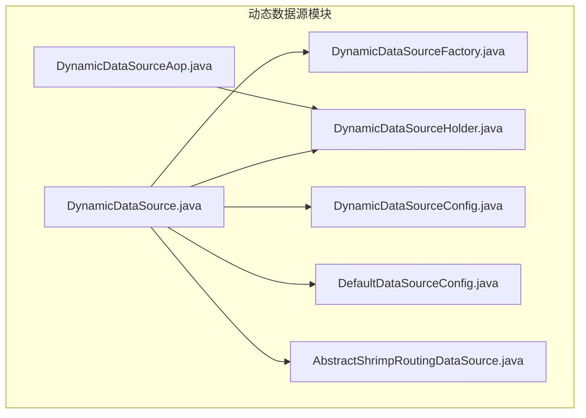
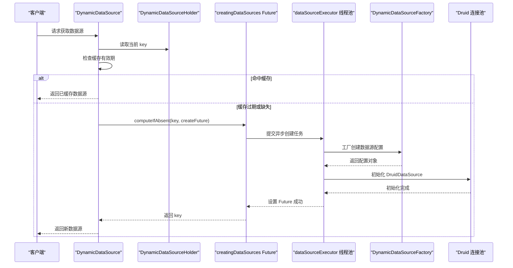
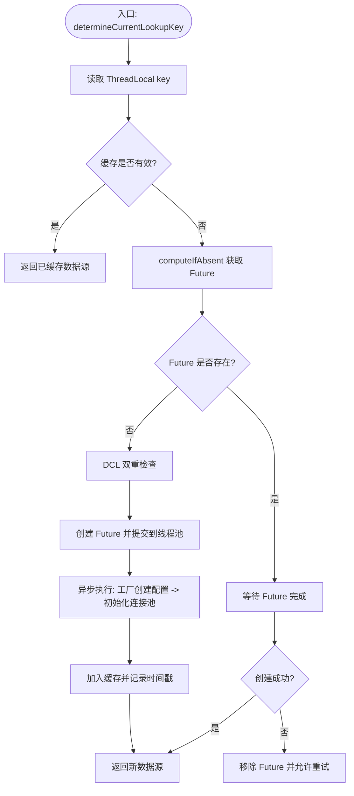
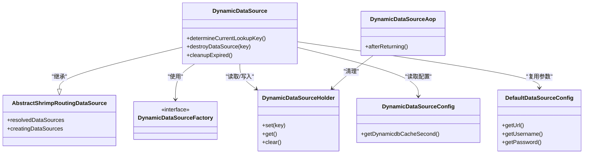

# 异步数据源创建

<cite>
**本文引用的文件**
- [DynamicDataSource.java](file://sh-dynamicdb/src/main/java/com/wkclz/dynamicdb/DynamicDataSource.java)
- [AbstractShrimpRoutingDataSource.java](file://sh-dynamicdb/src/main/java/com/wkclz/dynamicdb/AbstractShrimpRoutingDataSource.java)
- [DynamicDataSourceFactory.java](file://sh-dynamicdb/src/main/java/com/wkclz/dynamicdb/DynamicDataSourceFactory.java)
- [DynamicDataSourceHolder.java](file://sh-dynamicdb/src/main/java/com/wkclz/dynamicdb/DynamicDataSourceHolder.java)
- [DynamicDataSourceConfig.java](file://sh-dynamicdb/src/main/java/com/wkclz/dynamicdb/config/DynamicDataSourceConfig.java)
- [DefaultDataSourceConfig.java](file://sh-dynamicdb/src/main/java/com/wkclz/dynamicdb/bean/DefaultDataSourceConfig.java)
- [DynamicDataSourceAop.java](file://sh-dynamicdb/src/main/java/com/wkclz/dynamicdb/aop/DynamicDataSourceAop.java)
- [US-021-动态数据源DCL与异步创建.md](file://docs/stories/US-021-动态数据源DCL与异步创建.md)
- [US-020-动态数据源运行时切换.md](file://docs/stories/US-020-动态数据源运行时切换.md)
</cite>

## 目录
1. [简介](#简介)
2. [项目结构](#项目结构)
3. [核心组件](#核心组件)
4. [架构总览](#架构总览)
5. [详细组件分析](#详细组件分析)
6. [依赖关系分析](#依赖关系分析)
7. [性能考量](#性能考量)
8. [故障排查指南](#故障排查指南)
9. [结论](#结论)
10. [附录](#附录)

## 简介
本文件围绕“异步数据源创建”机制进行系统化技术文档整理，目标包括：
- 解析异步数据源创建的实现策略与性能优化原理
- 说明如何通过异步初始化降低应用启动时间与请求延迟
- 详述触发条件、执行流程与状态管理机制
- 阐明资源分配、连接池初始化与健康检查的异步处理方式
- 说明异步创建与同步获取的协调机制（状态查询、等待策略、超时处理）
- 提供配置参数与调优建议（并发度、队列、资源限制）
- 给出使用示例与性能对比思路，以及不同场景的最佳实践

## 项目结构
本机制主要位于 sh-dynamicdb 模块，涉及动态数据源路由、工厂接口、配置与 AOP 清理等组件；配套文档以用户故事形式描述了异步创建与双重检查锁（DCL）的实现要点。

图表来源
- [DynamicDataSource.java](file://sh-dynamicdb/src/main/java/com/wkclz/dynamicdb/DynamicDataSource.java)
- [AbstractShrimpRoutingDataSource.java](file://sh-dynamicdb/src/main/java/com/wkclz/dynamicdb/AbstractShrimpRoutingDataSource.java)
- [DynamicDataSourceFactory.java](file://sh-dynamicdb/src/main/java/com/wkclz/dynamicdb/DynamicDataSourceFactory.java)
- [DynamicDataSourceHolder.java](file://sh-dynamicdb/src/main/java/com/wkclz/dynamicdb/DynamicDataSourceHolder.java)
- [DynamicDataSourceConfig.java](file://sh-dynamicdb/src/main/java/com/wkclz/dynamicdb/config/DynamicDataSourceConfig.java)
- [DefaultDataSourceConfig.java](file://sh-dynamicdb/src/main/java/com/wkclz/dynamicdb/bean/DefaultDataSourceConfig.java)
- [DynamicDataSourceAop.java](file://sh-dynamicdb/src/main/java/com/wkclz/dynamicdb/aop/DynamicDataSourceAop.java)

章节来源
- [US-021-动态数据源DCL与异步创建.md](file://docs/stories/US-021-动态数据源DCL与异步创建.md)
- [US-020-动态数据源运行时切换.md](file://docs/stories/US-020-动态数据源运行时切换.md)

## 核心组件
- DynamicDataSource：动态数据源路由与异步创建的核心实现，负责根据 ThreadLocal 的 key 决定当前数据源，采用 DCL 与 CompletableFuture 实现并发安全与异步初始化。
- AbstractShrimpRoutingDataSource：路由数据源基类，提供并发容器支持（如 ConcurrentHashMap）以支撑 key 级别的状态管理。
- DynamicDataSourceFactory：数据源工厂接口，业务侧实现该接口以提供具体数据源配置。
- DynamicDataSourceHolder：线程本地存储数据源标识，用于在请求生命周期内传递当前目标数据源 key。
- DynamicDataSourceConfig：动态数据源配置，包含缓存时间等参数。
- DefaultDataSourceConfig：默认数据源配置模板，用于复用连接池参数。
- DynamicDataSourceAop：AOP 切面，在 Mapper 执行后自动清理 ThreadLocal，避免泄漏。

章节来源
- [DynamicDataSource.java](file://sh-dynamicdb/src/main/java/com/wkclz/dynamicdb/DynamicDataSource.java)
- [AbstractShrimpRoutingDataSource.java](file://sh-dynamicdb/src/main/java/com/wkclz/dynamicdb/AbstractShrimpRoutingDataSource.java)
- [DynamicDataSourceFactory.java](file://sh-dynamicdb/src/main/java/com/wkclz/dynamicdb/DynamicDataSourceFactory.java)
- [DynamicDataSourceHolder.java](file://sh-dynamicdb/src/main/java/com/wkclz/dynamicdb/DynamicDataSourceHolder.java)
- [DynamicDataSourceConfig.java](file://sh-dynamicdb/src/main/java/com/wkclz/dynamicdb/config/DynamicDataSourceConfig.java)
- [DefaultDataSourceConfig.java](file://sh-dynamicdb/src/main/java/com/wkclz/dynamicdb/bean/DefaultDataSourceConfig.java)
- [DynamicDataSourceAop.java](file://sh-dynamicdb/src/main/java/com/wkclz/dynamicdb/aop/DynamicDataSourceAop.java)

## 架构总览
下图展示异步数据源创建的整体流程：从 determineCurrentLookupKey 开始，到 CompletableFuture 异步创建、连接池初始化与状态更新，再到后续请求的快速命中与缓存清理。

图表来源
- [DynamicDataSource.java](file://sh-dynamicdb/src/main/java/com/wkclz/dynamicdb/DynamicDataSource.java)
- [DynamicDataSourceFactory.java](file://sh-dynamicdb/src/main/java/com/wkclz/dynamicdb/DynamicDataSourceFactory.java)

## 详细组件分析

### DynamicDataSource：异步创建与状态管理
- 触发条件
  - determineCurrentLookupKey 读取 ThreadLocal 的 key
  - 若缓存未过期则直接返回；否则进入异步创建流程
- 并发控制
  - 使用 computeIfAbsent 在 key 级别共享 Future，避免重复创建
  - DCL：在 computeIfAbsent 外层再次检查，确保仅创建一次
- 异步执行
  - 将创建任务提交至专用线程池 dataSourceExecutor
  - 新线程中调用工厂接口获取配置，再初始化 DruidDataSource
- 状态管理
  - 创建成功：加入 resolvedDataSources，记录 hasCreateDataSource 时间戳
  - 创建失败：Future 移除，允许重试
  - 销毁：destroyDataSource 支持取消进行中的 Future 并关闭连接池
- 缓存清理
  - 定期扫描过期键，关闭 Druid 连接池并移除缓存项

图表来源
- [DynamicDataSource.java](file://sh-dynamicdb/src/main/java/com/wkclz/dynamicdb/DynamicDataSource.java)

章节来源
- [DynamicDataSource.java](file://sh-dynamicdb/src/main/java/com/wkclz/dynamicdb/DynamicDataSource.java)

### AbstractShrimpRoutingDataSource：并发容器与路由基础
- 提供并发容器支持，保证 resolvedDataSources、creatingDataSources 等在高并发下的正确性
- 为 DynamicDataSource 的 key 级别锁与缓存管理提供基础设施

章节来源
- [AbstractShrimpRoutingDataSource.java](file://sh-dynamicdb/src/main/java/com/wkclz/dynamicdb/AbstractShrimpRoutingDataSource.java)

### DynamicDataSourceFactory：业务实现点
- 业务侧需实现该接口以提供目标数据源的配置信息
- 异步创建流程中由工厂返回配置，随后在新线程中初始化 DruidDataSource

章节来源
- [DynamicDataSourceFactory.java](file://sh-dynamicdb/src/main/java/com/wkclz/dynamicdb/DynamicDataSourceFactory.java)

### DynamicDataSourceHolder：线程本地标识
- 在请求开始时设置当前目标数据源 key
- AOP 切面在 Mapper 执行完成后自动清理，避免 ThreadLocal 泄漏

章节来源
- [DynamicDataSourceHolder.java](file://sh-dynamicdb/src/main/java/com/wkclz/dynamicdb/DynamicDataSourceHolder.java)
- [DynamicDataSourceAop.java](file://sh-dynamicdb/src/main/java/com/wkclz/dynamicdb/aop/DynamicDataSourceAop.java)

### DynamicDataSourceConfig 与 DefaultDataSourceConfig：配置与参数复用
- DynamicDataSourceConfig 提供缓存时间等动态配置
- DefaultDataSourceConfig 作为默认连接池参数模板，便于复用与统一管理

章节来源
- [DynamicDataSourceConfig.java](file://sh-dynamicdb/src/main/java/com/wkclz/dynamicdb/config/DynamicDataSourceConfig.java)
- [DefaultDataSourceConfig.java](file://sh-dynamicdb/src/main/java/com/wkclz/dynamicdb/bean/DefaultDataSourceConfig.java)

## 依赖关系分析
- DynamicDataSource 依赖：
  - DynamicDataSourceFactory（业务配置提供者）
  - DynamicDataSourceHolder（线程上下文 key）
  - DynamicDataSourceConfig（缓存时间等参数）
  - DefaultDataSourceConfig（连接池参数模板）
  - AbstractShrimpRoutingDataSource（并发容器与路由基类）
  - DynamicDataSourceAop（生命周期清理）

图表来源
- [DynamicDataSource.java](file://sh-dynamicdb/src/main/java/com/wkclz/dynamicdb/DynamicDataSource.java)
- [AbstractShrimpRoutingDataSource.java](file://sh-dynamicdb/src/main/java/com/wkclz/dynamicdb/AbstractShrimpRoutingDataSource.java)
- [DynamicDataSourceFactory.java](file://sh-dynamicdb/src/main/java/com/wkclz/dynamicdb/DynamicDataSourceFactory.java)
- [DynamicDataSourceHolder.java](file://sh-dynamicdb/src/main/java/com/wkclz/dynamicdb/DynamicDataSourceHolder.java)
- [DynamicDataSourceConfig.java](file://sh-dynamicdb/src/main/java/com/wkclz/dynamicdb/config/DynamicDataSourceConfig.java)
- [DefaultDataSourceConfig.java](file://sh-dynamicdb/src/main/java/com/wkclz/dynamicdb/bean/DefaultDataSourceConfig.java)
- [DynamicDataSourceAop.java](file://sh-dynamicdb/src/main/java/com/wkclz/dynamicdb/aop/DynamicDataSourceAop.java)

## 性能考量
- 启动时间优化
  - 通过异步创建避免首次请求阻塞，显著降低冷启动延迟
- 请求延迟优化
  - key 级别 Future 共享，避免并发重复创建
  - 缓存时间窗口内直接命中，减少 IO 与初始化开销
- 资源与并发
  - 专用线程池与有界队列，防止资源耗尽
  - CallerRunsPolicy 在饱和时由调用线程执行，避免丢弃
- 连接池与健康检查
  - 异步初始化 DruidDataSource，避免主线程阻塞
  - 定期清理过期连接池，释放内存与连接资源
- 超时与等待
  - CompletableFuture.get() 可结合超时策略使用，避免长时间阻塞
  - 缓存过期与重建策略平衡一致性与性能

## 故障排查指南
- 常见问题与定位
  - 多线程并发创建：检查 computeIfAbsent 与 DCL 是否生效，确认 Future 是否被正确移除或完成
  - 创建失败：查看工厂返回值与异常日志，确认 Future 完成回调是否移除了失败的 Future
  - 连接池泄漏：确认 AOP 是否在后置通知中清理 ThreadLocal，定期清理任务是否正常执行
  - 缓存未命中：核对缓存时间配置与 key 生成规则
- 关键日志点
  - “dataSource creation started/failed/success”
  - “cleaned up expired dataSource”
  - “cancelled in-progress creation”

章节来源
- [DynamicDataSource.java](file://sh-dynamicdb/src/main/java/com/wkclz/dynamicdb/DynamicDataSource.java)
- [DynamicDataSourceAop.java](file://sh-dynamicdb/src/main/java/com/wkclz/dynamicdb/aop/DynamicDataSourceAop.java)

## 结论
异步数据源创建通过 DCL 与 CompletableFuture 实现并发安全与高性能初始化，配合缓存与定期清理策略，有效降低启动与请求延迟。通过专用线程池与有界队列保障资源可控，结合 AOP 生命周期管理避免上下文泄漏。该机制在多租户、动态路由等场景具有显著优势，建议按业务并发与资源情况合理调参。

## 附录

### 使用示例与最佳实践
- 示例步骤（概念性说明）
  - 实现 DynamicDataSourceFactory 接口，返回目标数据源配置
  - 在请求入口设置 DynamicDataSourceHolder.set(key)，执行 Mapper 后自动清理
  - 调整 DynamicDataSourceConfig 的缓存时间，平衡一致性与性能
  - 监控连接池指标与异步创建队列长度，必要时扩容线程池或调整队列容量
- 最佳实践
  - 为不同业务域设置独立 key，避免跨域干扰
  - 对热点 key 配置较短缓存时间，确保配置变更及时生效
  - 在高并发场景下，适当提高线程池核心/最大线程数与队列容量
  - 定期评估过期清理频率，避免频繁重建造成抖动

### 配置参数与调优建议
- 缓存时间（秒）
  - 影响：缓存命中率与配置变更时效
  - 建议：根据业务变更频率与请求量权衡，默认可参考配置类提供的参数
- 线程池参数
  - 核心/最大线程数：依据并发请求数与创建耗时估算
  - 队列容量：结合请求突发与 GC 行为设定，避免内存压力
  - 拒绝策略：CallerRunsPolicy 适合低延迟场景，避免丢弃任务
- 连接池参数
  - 基于 DefaultDataSourceConfig 复用，按业务峰值调优最小/最大连接数与空闲时间
- 清理策略
  - 定期扫描过期键并关闭连接池，避免资源泄漏

章节来源
- [DynamicDataSourceConfig.java](file://sh-dynamicdb/src/main/java/com/wkclz/dynamicdb/config/DynamicDataSourceConfig.java)
- [DefaultDataSourceConfig.java](file://sh-dynamicdb/src/main/java/com/wkclz/dynamicdb/bean/DefaultDataSourceConfig.java)
- [DynamicDataSource.java](file://sh-dynamicdb/src/main/java/com/wkclz/dynamicdb/DynamicDataSource.java)