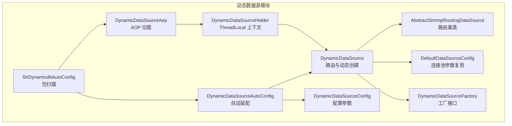
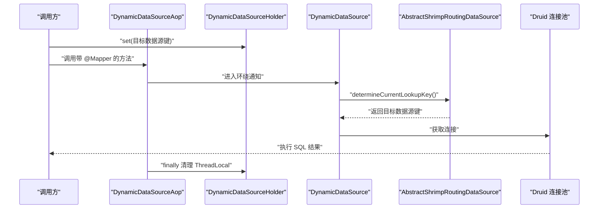
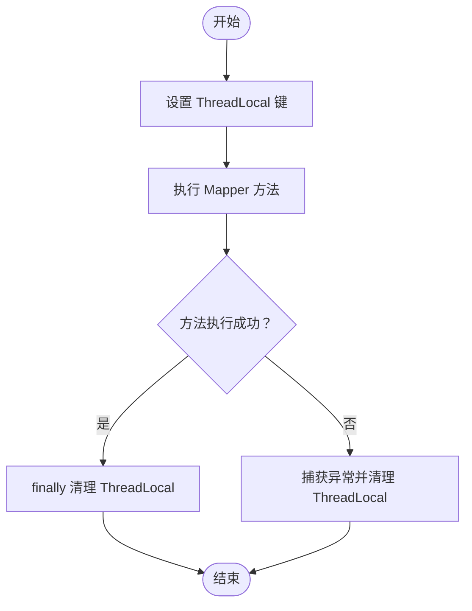
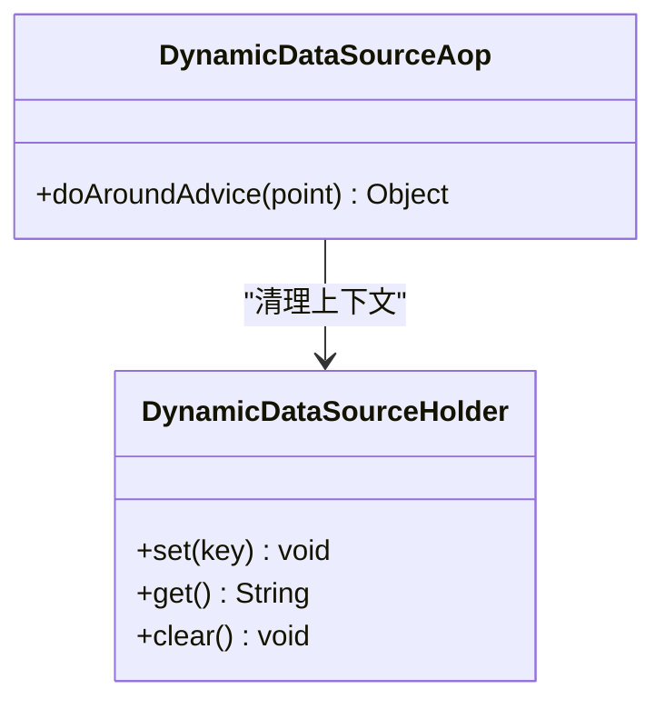
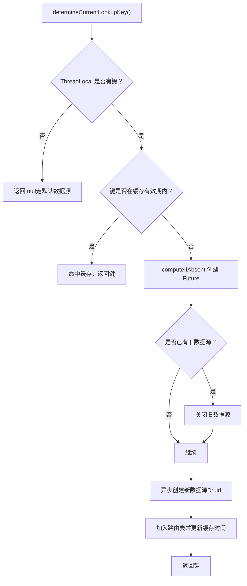
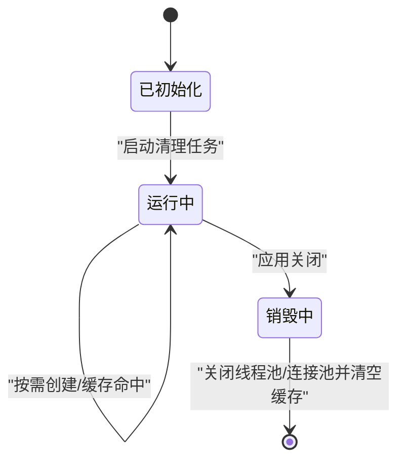
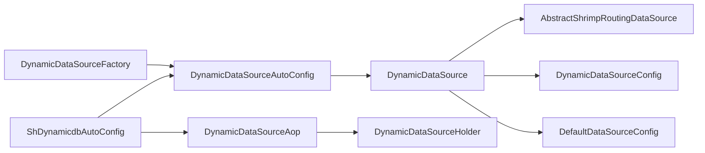

# 运行时数据源切换

<cite>
**本文引用的文件**
- [DynamicDataSourceHolder.java](file://sh-dynamicdb/src/main/java/com/wkclz/dynamicdb/DynamicDataSourceHolder.java)
- [DynamicDataSourceAop.java](file://sh-dynamicdb/src/main/java/com/wkclz/dynamicdb/aop/DynamicDataSourceAop.java)
- [DynamicDataSource.java](file://sh-dynamicdb/src/main/java/com/wkclz/dynamicdb/DynamicDataSource.java)
- [DynamicDataSourceFactory.java](file://sh-dynamicdb/src/main/java/com/wkclz/dynamicdb/DynamicDataSourceFactory.java)
- [DynamicDataSourceAutoConfig.java](file://sh-dynamicdb/src/main/java/com/wkclz/dynamicdb/config/DynamicDataSourceAutoConfig.java)
- [DynamicDataSourceConfig.java](file://sh-dynamicdb/src/main/java/com/wkclz/dynamicdb/config/DynamicDataSourceConfig.java)
- [AbstractShrimpRoutingDataSource.java](file://sh-dynamicdb/src/main/java/com/wkclz/dynamicdb/AbstractShrimpRoutingDataSource.java)
- [DefaultDataSourceConfig.java](file://sh-dynamicdb/src/main/java/com/wkclz/dynamicdb/bean/DefaultDataSourceConfig.java)
- [ShDynamicdbAutoConfig.java](file://sh-dynamicdb/src/main/java/com/wkclz/dynamicdb/ShDynamicdbAutoConfig.java)
</cite>

## 目录
1. [简介](#简介)
2. [项目结构](#项目结构)
3. [核心组件](#核心组件)
4. [架构总览](#架构总览)
5. [组件详解](#组件详解)
6. [依赖关系分析](#依赖关系分析)
7. [性能考量](#性能考量)
8. [故障排查指南](#故障排查指南)
9. [结论](#结论)
10. [附录](#附录)

## 简介
本技术文档围绕“运行时数据源切换”能力展开，重点阐述以下内容：
- ThreadLocal 上下文管理机制在数据源切换中的关键作用，覆盖上下文存储、传递与清理的完整流程；
- 基于注解驱动的 AOP 切面 DynamicDataSourceAop 如何实现数据源的自动切换；
- AOP 切面的织入时机、执行顺序与异常处理机制；
- 数据源切换的生命周期管理（方法调用前后状态维护）；
- 提供可落地的使用示例（注解配置、方法标注与切换策略）；
- 性能优化建议与常见问题排查方法。

## 项目结构
动态数据源相关代码集中在 sh-dynamicdb 模块，采用“面向接口 + AOP + Spring 自动装配”的设计思路：
- 核心路由与上下文：DynamicDataSource、DynamicDataSourceHolder、AbstractShrimpRoutingDataSource
- AOP 切面：DynamicDataSourceAop（基于 Mapper 注解）
- 自动装配：DynamicDataSourceAutoConfig、ShDynamicdbAutoConfig
- 配置与参数：DynamicDataSourceConfig、DefaultDataSourceConfig
- 工厂接口：DynamicDataSourceFactory（由使用者实现）

图表来源
- [DynamicDataSourceHolder.java:1-23](file://sh-dynamicdb/src/main/java/com/wkclz/dynamicdb/DynamicDataSourceHolder.java#L1-L23)
- [DynamicDataSourceAop.java:1-30](file://sh-dynamicdb/src/main/java/com/wkclz/dynamicdb/aop/DynamicDataSourceAop.java#L1-L30)
- [DynamicDataSource.java:1-274](file://sh-dynamicdb/src/main/java/com/wkclz/dynamicdb/DynamicDataSource.java#L1-L274)
- [AbstractShrimpRoutingDataSource.java:1-170](file://sh-dynamicdb/src/main/java/com/wkclz/dynamicdb/AbstractShrimpRoutingDataSource.java#L1-L170)
- [DynamicDataSourceAutoConfig.java:1-66](file://sh-dynamicdb/src/main/java/com/wkclz/dynamicdb/config/DynamicDataSourceAutoConfig.java#L1-L66)
- [DynamicDataSourceConfig.java:1-18](file://sh-dynamicdb/src/main/java/com/wkclz/dynamicdb/config/DynamicDataSourceConfig.java#L1-L18)
- [DefaultDataSourceConfig.java:1-33](file://sh-dynamicdb/src/main/java/com/wkclz/dynamicdb/bean/DefaultDataSourceConfig.java#L1-L33)
- [DynamicDataSourceFactory.java:1-13](file://sh-dynamicdb/src/main/java/com/wkclz/dynamicdb/DynamicDataSourceFactory.java#L1-L13)
- [ShDynamicdbAutoConfig.java:1-12](file://sh-dynamicdb/src/main/java/com/wkclz/dynamicdb/ShDynamicdbAutoConfig.java#L1-L12)

章节来源
- [ShDynamicdbAutoConfig.java:1-12](file://sh-dynamicdb/src/main/java/com/wkclz/dynamicdb/ShDynamicdbAutoConfig.java#L1-L12)
- [DynamicDataSourceAutoConfig.java:1-66](file://sh-dynamicdb/src/main/java/com/wkclz/dynamicdb/config/DynamicDataSourceAutoConfig.java#L1-L66)

## 核心组件
- DynamicDataSourceHolder：线程本地存储当前请求使用的数据源键，提供 set/get/clear 三段式 API，确保线程内上下文一致。
- DynamicDataSource：继承路由基类，实现 determineCurrentLookupKey，结合缓存与异步创建，按需构建目标数据源；同时提供清理任务与优雅停机。
- DynamicDataSourceAop：环绕切面，匹配带有 MyBatis Mapper 注解的方法，执行后清理 ThreadLocal，避免线程复用导致的上下文泄漏。
- AbstractShrimpRoutingDataSource：扩展 Spring 的 AbstractRoutingDataSource，提供 addDataSource/removeDataSource 等便捷方法与解析逻辑。
- DynamicDataSourceAutoConfig：条件装配，当存在 DynamicDataSourceFactory 时，注册 DynamicDataSource 并启动清理任务。
- DynamicDataSourceConfig/DefaultDataSourceConfig：分别承载运行时配置与连接池参数复用策略。
- DynamicDataSourceFactory：由使用者实现，根据 lookupKey 返回 DataSourceInfo，驱动动态数据源创建。

章节来源
- [DynamicDataSourceHolder.java:1-23](file://sh-dynamicdb/src/main/java/com/wkclz/dynamicdb/DynamicDataSourceHolder.java#L1-L23)
- [DynamicDataSource.java:1-274](file://sh-dynamicdb/src/main/java/com/wkclz/dynamicdb/DynamicDataSource.java#L1-L274)
- [DynamicDataSourceAop.java:1-30](file://sh-dynamicdb/src/main/java/com/wkclz/dynamicdb/aop/DynamicDataSourceAop.java#L1-L30)
- [AbstractShrimpRoutingDataSource.java:1-170](file://sh-dynamicdb/src/main/java/com/wkclz/dynamicdb/AbstractShrimpRoutingDataSource.java#L1-L170)
- [DynamicDataSourceAutoConfig.java:1-66](file://sh-dynamicdb/src/main/java/com/wkclz/dynamicdb/config/DynamicDataSourceAutoConfig.java#L1-L66)
- [DynamicDataSourceConfig.java:1-18](file://sh-dynamicdb/src/main/java/com/wkclz/dynamicdb/config/DynamicDataSourceConfig.java#L1-L18)
- [DefaultDataSourceConfig.java:1-33](file://sh-dynamicdb/src/main/java/com/wkclz/dynamicdb/bean/DefaultDataSourceConfig.java#L1-L33)
- [DynamicDataSourceFactory.java:1-13](file://sh-dynamicdb/src/main/java/com/wkclz/dynamicdb/DynamicDataSourceFactory.java#L1-L13)

## 架构总览
运行时数据源切换的整体流程如下：
- 应用启动时，若检测到 DynamicDataSourceFactory Bean，则自动装配 DynamicDataSource 作为 Primary DataSource；
- 业务方法执行前，通过某种机制（例如上下文设置或注解驱动）将目标数据源键写入 ThreadLocal；
- MyBatis 查询执行时，路由数据源根据 ThreadLocal 中的键选择目标数据源；
- 方法执行完成后，AOP 切面清理 ThreadLocal，防止线程复用引发的上下文污染；
- DynamicDataSource 内部维护缓存与异步创建，按需构建新数据源并加入路由表。

图表来源
- [DynamicDataSourceAop.java:1-30](file://sh-dynamicdb/src/main/java/com/wkclz/dynamicdb/aop/DynamicDataSourceAop.java#L1-L30)
- [DynamicDataSource.java:46-139](file://sh-dynamicdb/src/main/java/com/wkclz/dynamicdb/DynamicDataSource.java#L46-L139)
- [AbstractShrimpRoutingDataSource.java:150-167](file://sh-dynamicdb/src/main/java/com/wkclz/dynamicdb/AbstractShrimpRoutingDataSource.java#L150-L167)
- [DynamicDataSourceHolder.java:1-23](file://sh-dynamicdb/src/main/java/com/wkclz/dynamicdb/DynamicDataSourceHolder.java#L1-L23)

## 组件详解

### ThreadLocal 上下文管理机制
- 存储：在业务入口处将目标数据源键写入 ThreadLocal；
- 传递：由于是线程本地变量，无需显式传参即可在同一线程链路中共享；
- 清理：在 AOP 环绕通知的 finally 分支中清除 ThreadLocal，避免线程池复用导致的脏读。

图表来源
- [DynamicDataSourceHolder.java:1-23](file://sh-dynamicdb/src/main/java/com/wkclz/dynamicdb/DynamicDataSourceHolder.java#L1-L23)
- [DynamicDataSourceAop.java:20-27](file://sh-dynamicdb/src/main/java/com/wkclz/dynamicdb/aop/DynamicDataSourceAop.java#L20-L27)

章节来源
- [DynamicDataSourceHolder.java:1-23](file://sh-dynamicdb/src/main/java/com/wkclz/dynamicdb/DynamicDataSourceHolder.java#L1-L23)
- [DynamicDataSourceAop.java:1-30](file://sh-dynamicdb/src/main/java/com/wkclz/dynamicdb/aop/DynamicDataSourceAop.java#L1-L30)

### AOP 切面编程与注解驱动
- 切点表达式：匹配带有 MyBatis Mapper 注解的类型；
- 环绕通知：在 proceed() 前后分别进行上下文设置与清理；
- 异常处理：无论正常返回还是抛出异常，finally 分支都会清理 ThreadLocal，保证线程安全。

图表来源
- [DynamicDataSourceAop.java:1-30](file://sh-dynamicdb/src/main/java/com/wkclz/dynamicdb/aop/DynamicDataSourceAop.java#L1-L30)
- [DynamicDataSourceHolder.java:1-23](file://sh-dynamicdb/src/main/java/com/wkclz/dynamicdb/DynamicDataSourceHolder.java#L1-L23)

章节来源
- [DynamicDataSourceAop.java:1-30](file://sh-dynamicdb/src/main/java/com/wkclz/dynamicdb/aop/DynamicDataSourceAop.java#L1-L30)

### 路由与动态创建
- determineCurrentLookupKey：优先从 ThreadLocal 读取键；若缓存未过期则直接返回；否则触发异步创建；
- 缓存与去重：使用 ConcurrentHashMap 记录创建时间，使用 CompletableFuture 避免同 key 并发重复创建；
- 异步创建：通过专用线程池创建 Druid 数据源，复用默认连接池参数，仅替换连接信息；
- 定时清理：周期扫描过期数据源并关闭，释放连接池资源；
- 优雅停机：实现 DisposableBean，关闭清理任务、线程池与所有动态数据源。

图表来源
- [DynamicDataSource.java:46-139](file://sh-dynamicdb/src/main/java/com/wkclz/dynamicdb/DynamicDataSource.java#L46-L139)
- [DefaultDataSourceConfig.java:1-33](file://sh-dynamicdb/src/main/java/com/wkclz/dynamicdb/bean/DefaultDataSourceConfig.java#L1-L33)

章节来源
- [DynamicDataSource.java:1-274](file://sh-dynamicdb/src/main/java/com/wkclz/dynamicdb/DynamicDataSource.java#L1-L274)
- [AbstractShrimpRoutingDataSource.java:1-170](file://sh-dynamicdb/src/main/java/com/wkclz/dynamicdb/AbstractShrimpRoutingDataSource.java#L1-L170)
- [DefaultDataSourceConfig.java:1-33](file://sh-dynamicdb/src/main/java/com/wkclz/dynamicdb/bean/DefaultDataSourceConfig.java#L1-L33)

### 生命周期管理
- 初始化：自动装配注册 DynamicDataSource，设置默认数据源与目标数据源集合；
- 运行期：按需创建数据源，缓存管理，定时清理；
- 销毁：停止清理任务，关闭线程池，逐个关闭 Druid 连接池，清空缓存。

图表来源
- [DynamicDataSourceAutoConfig.java:43-57](file://sh-dynamicdb/src/main/java/com/wkclz/dynamicdb/config/DynamicDataSourceAutoConfig.java#L43-L57)
- [DynamicDataSource.java:144-271](file://sh-dynamicdb/src/main/java/com/wkclz/dynamicdb/DynamicDataSource.java#L144-L271)

章节来源
- [DynamicDataSourceAutoConfig.java:1-66](file://sh-dynamicdb/src/main/java/com/wkclz/dynamicdb/config/DynamicDataSourceAutoConfig.java#L1-L66)
- [DynamicDataSource.java:1-274](file://sh-dynamicdb/src/main/java/com/wkclz/dynamicdb/DynamicDataSource.java#L1-L274)

### 使用示例（步骤说明）
- 实现工厂接口：提供一个实现 DynamicDataSourceFactory 的 Bean，根据传入的 key 返回 DataSourceInfo；
- 设置上下文：在业务入口处将目标数据源键写入 ThreadLocal；
- 标注 Mapper：在需要切换数据源的 Mapper 接口上添加 MyBatis 的 Mapper 注解；
- 触发执行：调用该 Mapper 方法，AOP 切面会自动清理 ThreadLocal；
- 配置参数：通过配置项设置缓存时长与清理间隔。

章节来源
- [DynamicDataSourceFactory.java:1-13](file://sh-dynamicdb/src/main/java/com/wkclz/dynamicdb/DynamicDataSourceFactory.java#L1-L13)
- [DynamicDataSourceAop.java:1-30](file://sh-dynamicdb/src/main/java/com/wkclz/dynamicdb/aop/DynamicDataSourceAop.java#L1-L30)
- [DynamicDataSourceConfig.java:1-18](file://sh-dynamicdb/src/main/java/com/wkclz/dynamicdb/config/DynamicDataSourceConfig.java#L1-L18)

## 依赖关系分析
- 条件装配：只有当容器中存在 DynamicDataSourceFactory Bean 时，才启用动态数据源自动装配；
- 主数据源替换：DynamicDataSource 以 @Primary 身份替换默认 DataSource；
- 包扫描：通过 ShDynamicdbAutoConfig 对动态数据源包进行组件扫描；
- 配置注入：DynamicDataSourceConfig 与 DefaultDataSourceConfig 从配置文件读取参数。

图表来源
- [DynamicDataSourceAutoConfig.java:20-57](file://sh-dynamicdb/src/main/java/com/wkclz/dynamicdb/config/DynamicDataSourceAutoConfig.java#L20-L57)
- [DynamicDataSource.java:1-274](file://sh-dynamicdb/src/main/java/com/wkclz/dynamicdb/DynamicDataSource.java#L1-L274)
- [AbstractShrimpRoutingDataSource.java:1-170](file://sh-dynamicdb/src/main/java/com/wkclz/dynamicdb/AbstractShrimpRoutingDataSource.java#L1-L170)
- [DynamicDataSourceConfig.java:1-18](file://sh-dynamicdb/src/main/java/com/wkclz/dynamicdb/config/DynamicDataSourceConfig.java#L1-L18)
- [DefaultDataSourceConfig.java:1-33](file://sh-dynamicdb/src/main/java/com/wkclz/dynamicdb/bean/DefaultDataSourceConfig.java#L1-L33)
- [DynamicDataSourceAop.java:1-30](file://sh-dynamicdb/src/main/java/com/wkclz/dynamicdb/aop/DynamicDataSourceAop.java#L1-L30)
- [ShDynamicdbAutoConfig.java:1-12](file://sh-dynamicdb/src/main/java/com/wkclz/dynamicdb/ShDynamicdbAutoConfig.java#L1-L12)

章节来源
- [DynamicDataSourceAutoConfig.java:1-66](file://sh-dynamicdb/src/main/java/com/wkclz/dynamicdb/config/DynamicDataSourceAutoConfig.java#L1-L66)
- [ShDynamicdbAutoConfig.java:1-12](file://sh-dynamicdb/src/main/java/com/wkclz/dynamicdb/ShDynamicdbAutoConfig.java#L1-L12)

## 性能考量
- 缓存策略：通过缓存时间窗口减少重复创建开销，降低频繁切换带来的抖动；
- 并发控制：使用 computeIfAbsent 与 CompletableFuture 实现 key 级别的去重与复用，避免同 key 并发重复创建；
- 线程池隔离：专用线程池避免与业务线程争抢，采用 CallerRunsPolicy 保护性降级；
- 连接池参数复用：动态创建时复用默认连接池参数，减少配置差异导致的性能波动；
- 定时清理：定期关闭过期连接池，释放内存与连接资源，避免长期运行的资源泄露。

章节来源
- [DynamicDataSource.java:25-41](file://sh-dynamicdb/src/main/java/com/wkclz/dynamicdb/DynamicDataSource.java#L25-L41)
- [DynamicDataSource.java:144-211](file://sh-dynamicdb/src/main/java/com/wkclz/dynamicdb/DynamicDataSource.java#L144-L211)
- [DefaultDataSourceConfig.java:1-33](file://sh-dynamicdb/src/main/java/com/wkclz/dynamicdb/bean/DefaultDataSourceConfig.java#L1-L33)

## 故障排查指南
- 现象：方法执行后 ThreadLocal 未清理，后续请求复用到错误数据源
  - 排查：确认 AOP 切面是否生效（Mapper 注解是否正确）、finally 分支是否执行；
  - 参考：[DynamicDataSourceAop.java:20-27](file://sh-dynamicdb/src/main/java/com/wkclz/dynamicdb/aop/DynamicDataSourceAop.java#L20-L27)
- 现象：动态数据源创建失败或超时
  - 排查：检查工厂实现是否正确返回 DataSourceInfo、网络连通性、连接参数合法性；
  - 参考：[DynamicDataSource.java:80-109](file://sh-dynamicdb/src/main/java/com/wkclz/dynamicdb/DynamicDataSource.java#L80-L109)
- 现象：连接池资源未释放导致内存增长
  - 排查：确认清理任务是否启动、应用优雅停机流程是否执行；
  - 参考：[DynamicDataSourceAutoConfig.java:43-57](file://sh-dynamicdb/src/main/java/com/wkclz/dynamicdb/config/DynamicDataSourceAutoConfig.java#L43-L57)，[DynamicDataSource.java:236-271](file://sh-dynamicdb/src/main/java/com/wkclz/dynamicdb/DynamicDataSource.java#L236-L271)
- 现象：高并发下重复创建数据源
  - 排查：确认 key 命中缓存策略、Future 去重逻辑是否生效；
  - 参考：[DynamicDataSource.java:63-120](file://sh-dynamicdb/src/main/java/com/wkclz/dynamicdb/DynamicDataSource.java#L63-L120)

章节来源
- [DynamicDataSourceAop.java:1-30](file://sh-dynamicdb/src/main/java/com/wkclz/dynamicdb/aop/DynamicDataSourceAop.java#L1-L30)
- [DynamicDataSource.java:1-274](file://sh-dynamicdb/src/main/java/com/wkclz/dynamicdb/DynamicDataSource.java#L1-L274)
- [DynamicDataSourceAutoConfig.java:1-66](file://sh-dynamicdb/src/main/java/com/wkclz/dynamicdb/config/DynamicDataSourceAutoConfig.java#L1-L66)

## 结论
通过 ThreadLocal 上下文与 AOP 切面的协同，配合路由基类与动态创建机制，系统实现了“声明式”的运行时数据源切换。其关键优势在于：
- 低侵入：仅需在业务入口设置上下文并在 Mapper 上标注注解；
- 高可靠：finally 清理保障线程安全；缓存与去重避免重复创建；
- 易运维：自动装配与配置项简化部署；定时清理与优雅停机降低运维成本。

## 附录
- 配置项参考
  - 数据源缓存时长：sh.dynamicdb.cache-second（默认秒）
  - 清理任务间隔：sh.dynamicdb.cleanup-interval-second（默认秒）
- 连接池参数复用：动态创建时复用默认连接池参数，仅替换连接信息

章节来源
- [DynamicDataSourceConfig.java:1-18](file://sh-dynamicdb/src/main/java/com/wkclz/dynamicdb/config/DynamicDataSourceConfig.java#L1-L18)
- [DefaultDataSourceConfig.java:1-33](file://sh-dynamicdb/src/main/java/com/wkclz/dynamicdb/bean/DefaultDataSourceConfig.java#L1-L33)