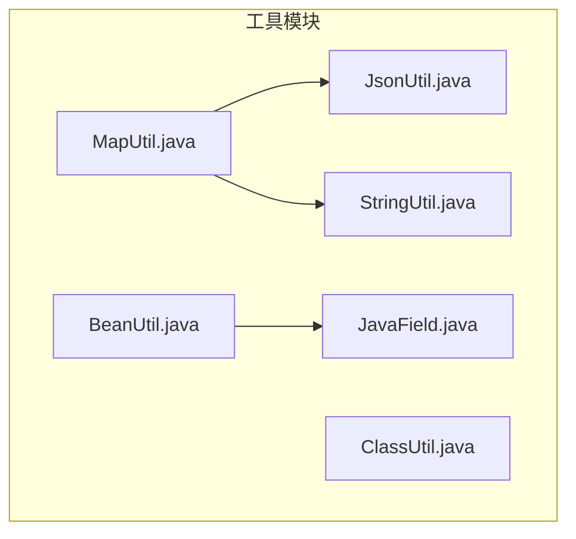
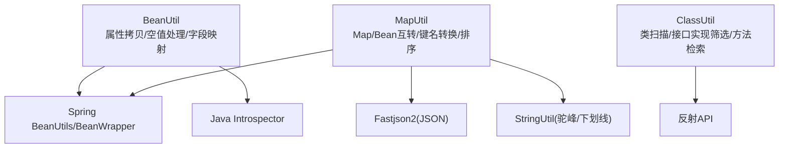
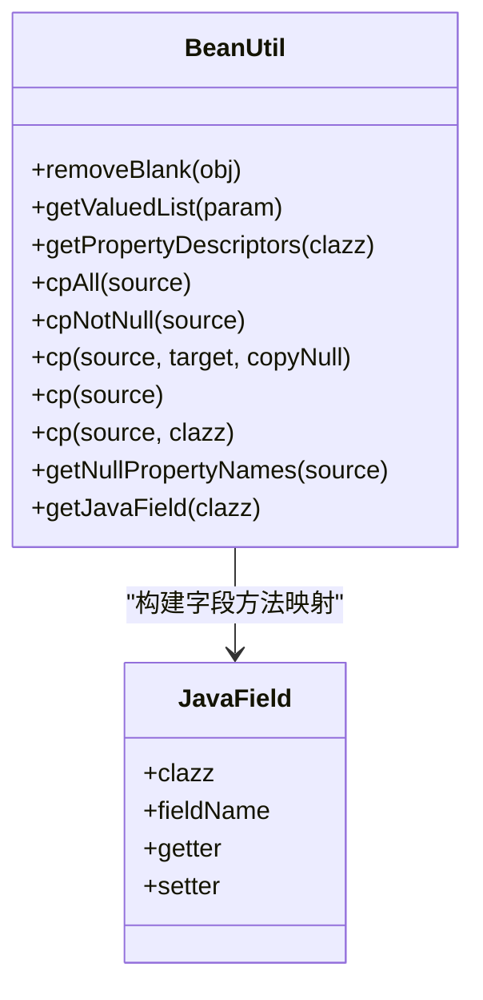
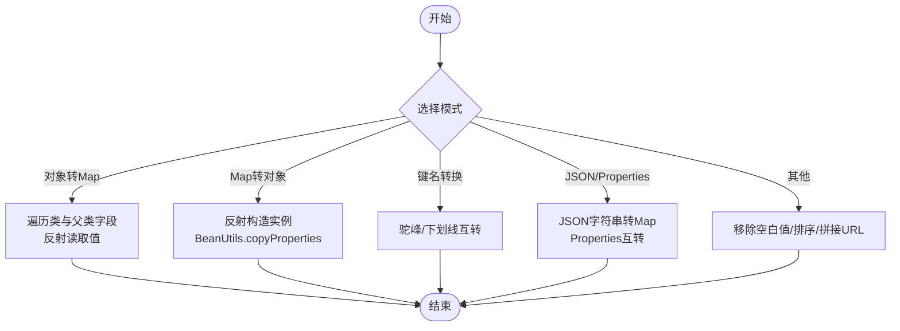
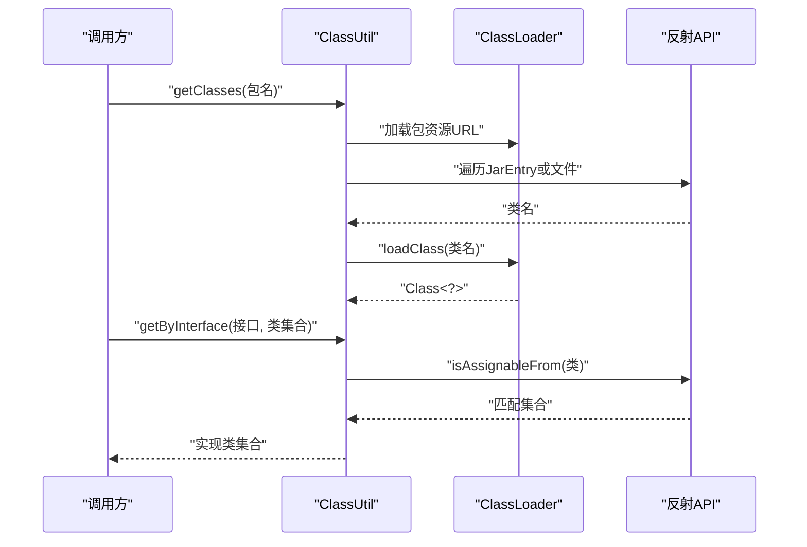
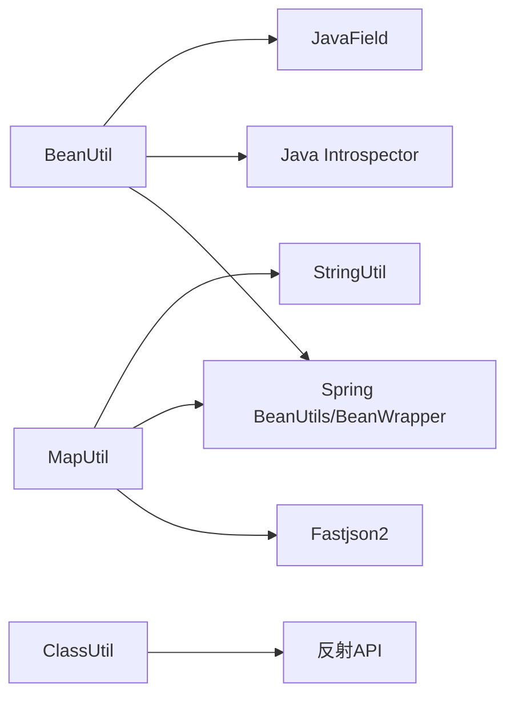

# Bean操作工具

<cite>
**本文引用的文件**
- [BeanUtil.java](file://sh-tool/src/main/java/com/wkclz/tool/utils/BeanUtil.java)
- [MapUtil.java](file://sh-tool/src/main/java/com/wkclz/tool/utils/MapUtil.java)
- [ClassUtil.java](file://sh-tool/src/main/java/com/wkclz/tool/utils/ClassUtil.java)
- [JavaField.java](file://sh-tool/src/main/java/com/wkclz/tool/bean/JavaField.java)
- [JsonUtil.java](file://sh-tool/src/main/java/com/wkclz/tool/utils/JsonUtil.java)
- [StringUtil.java](file://sh-tool/src/main/java/com/wkclz/tool/utils/StringUtil.java)
</cite>

## 目录
1. [简介](#简介)
2. [项目结构](#项目结构)
3. [核心组件](#核心组件)
4. [架构总览](#架构总览)
5. [详细组件分析](#详细组件分析)
6. [依赖分析](#依赖分析)
7. [性能考量](#性能考量)
8. [故障排查指南](#故障排查指南)
9. [结论](#结论)
10. [附录](#附录)

## 简介
本文件围绕Bean操作工具展开，重点覆盖以下能力：
- BeanUtil：基于反射的Bean属性拷贝、空值处理、批量复制、字段方法映射等
- MapUtil：Map与Bean互转、JSON字符串转Map、驼峰与下划线键名互转、Map排序与序列化等
- ClassUtil：类扫描、方法检索、接口实现类筛选等

文档同时给出典型应用场景（Bean映射、属性提取、对象序列化）与最佳实践（异常处理、性能优化），帮助读者在框架扩展与动态编程中高效使用。

## 项目结构
工具模块位于 sh-tool，Bean操作相关的核心类如下：
- utils/BeanUtil.java：Bean反射工具
- utils/MapUtil.java：Map与Bean互转及键名转换
- utils/ClassUtil.java：类扫描与方法检索
- bean/JavaField.java：字段与getter/setter描述载体
- utils/JsonUtil.java：JSON工具（与MapUtil配合）
- utils/StringUtil.java：字符串工具（与MapUtil配合）

图表来源
- [BeanUtil.java:1-293](file://sh-tool/src/main/java/com/wkclz/tool/utils/BeanUtil.java#L1-L293)
- [MapUtil.java:1-318](file://sh-tool/src/main/java/com/wkclz/tool/utils/MapUtil.java#L1-L318)
- [ClassUtil.java:1-256](file://sh-tool/src/main/java/com/wkclz/tool/utils/ClassUtil.java#L1-L256)
- [JavaField.java](file://sh-tool/src/main/java/com/wkclz/tool/bean/JavaField.java)
- [JsonUtil.java](file://sh-tool/src/main/java/com/wkclz/tool/utils/JsonUtil.java)
- [StringUtil.java](file://sh-tool/src/main/java/com/wkclz/tool/utils/StringUtil.java)

章节来源
- [BeanUtil.java:1-293](file://sh-tool/src/main/java/com/wkclz/tool/utils/BeanUtil.java#L1-L293)
- [MapUtil.java:1-318](file://sh-tool/src/main/java/com/wkclz/tool/utils/MapUtil.java#L1-L318)
- [ClassUtil.java:1-256](file://sh-tool/src/main/java/com/wkclz/tool/utils/ClassUtil.java#L1-L256)

## 核心组件
- BeanUtil：提供Bean属性拷贝（含空值策略）、批量复制、空字符串清理、值非空getter列表、基于Introspector的属性描述符缓存、字段方法映射（JavaField）等
- MapUtil：提供对象转Map/MapList、Map转对象/对象列表、JSON字符串转Map、驼峰与下划线键名互转、移除空白值、Map排序、Properties互转等
- ClassUtil：提供包扫描获取类、按接口筛选实现类、按方法名递归查找方法等

章节来源
- [BeanUtil.java:26-293](file://sh-tool/src/main/java/com/wkclz/tool/utils/BeanUtil.java#L26-L293)
- [MapUtil.java:15-318](file://sh-tool/src/main/java/com/wkclz/tool/utils/MapUtil.java#L15-L318)
- [ClassUtil.java:25-256](file://sh-tool/src/main/java/com/wkclz/tool/utils/ClassUtil.java#L25-L256)

## 架构总览
三者均通过反射与Spring Bean工具协作，形成“对象-属性-方法”的统一处理层，并与字符串与JSON工具协同完成键名转换与序列化。

图表来源
- [BeanUtil.java:7-18](file://sh-tool/src/main/java/com/wkclz/tool/utils/BeanUtil.java#L7-L18)
- [MapUtil.java:3-8](file://sh-tool/src/main/java/com/wkclz/tool/utils/MapUtil.java#L3-L8)
- [ClassUtil.java:10-21](file://sh-tool/src/main/java/com/wkclz/tool/utils/ClassUtil.java#L10-L21)
- [StringUtil.java](file://sh-tool/src/main/java/com/wkclz/tool/utils/StringUtil.java)
- [JsonUtil.java](file://sh-tool/src/main/java/com/wkclz/tool/utils/JsonUtil.java)

## 详细组件分析

### BeanUtil 组件分析
- 属性拷贝
  - 支持全量拷贝与仅拷贝非空属性两种策略
  - 对List进行批量复制，内部通过反射构造目标实例并逐个拷贝
- 空值处理
  - 提供移除空字符串与移除空白值的工具方法
  - 提供获取值非空的getter方法列表
- 字段方法映射
  - 基于反射收集字段与方法，构建JavaField映射表，便于后续动态调用
- 缓存机制
  - 使用ConcurrentHashMap缓存属性描述符、实体字段、类方法映射，降低重复反射开销

图表来源
- [BeanUtil.java:26-293](file://sh-tool/src/main/java/com/wkclz/tool/utils/BeanUtil.java#L26-L293)
- [JavaField.java](file://sh-tool/src/main/java/com/wkclz/tool/bean/JavaField.java)

章节来源
- [BeanUtil.java:38-56](file://sh-tool/src/main/java/com/wkclz/tool/utils/BeanUtil.java#L38-L56)
- [BeanUtil.java:60-79](file://sh-tool/src/main/java/com/wkclz/tool/utils/BeanUtil.java#L60-L79)
- [BeanUtil.java:82-97](file://sh-tool/src/main/java/com/wkclz/tool/utils/BeanUtil.java#L82-L97)
- [BeanUtil.java:106-156](file://sh-tool/src/main/java/com/wkclz/tool/utils/BeanUtil.java#L106-L156)
- [BeanUtil.java:166-196](file://sh-tool/src/main/java/com/wkclz/tool/utils/BeanUtil.java#L166-L196)
- [BeanUtil.java:204-217](file://sh-tool/src/main/java/com/wkclz/tool/utils/BeanUtil.java#L204-L217)
- [BeanUtil.java:223-273](file://sh-tool/src/main/java/com/wkclz/tool/utils/BeanUtil.java#L223-L273)

### MapUtil 组件分析
- Map与Bean互转
  - 对象转Map/MapList：遍历类及其父类的字段，使用反射读取值
  - Map转对象/对象列表：通过BeanUtils.copyProperties完成赋值
- 键名转换
  - 驼峰与下划线互转，支持Map与LinkedHashMap
- JSON与Properties互转
  - JSON字符串转Map；Properties转Map/Map转Properties
- 其他
  - 移除空白值、Map排序（按键名排序）、拼接为URL字符串

图表来源
- [MapUtil.java:27-64](file://sh-tool/src/main/java/com/wkclz/tool/utils/MapUtil.java#L27-L64)
- [MapUtil.java:112-125](file://sh-tool/src/main/java/com/wkclz/tool/utils/MapUtil.java#L112-L125)
- [MapUtil.java:194-220](file://sh-tool/src/main/java/com/wkclz/tool/utils/MapUtil.java#L194-L220)
- [MapUtil.java:134-142](file://sh-tool/src/main/java/com/wkclz/tool/utils/MapUtil.java#L134-L142)
- [MapUtil.java:270-292](file://sh-tool/src/main/java/com/wkclz/tool/utils/MapUtil.java#L270-L292)

章节来源
- [MapUtil.java:27-64](file://sh-tool/src/main/java/com/wkclz/tool/utils/MapUtil.java#L27-L64)
- [MapUtil.java:93-125](file://sh-tool/src/main/java/com/wkclz/tool/utils/MapUtil.java#L93-L125)
- [MapUtil.java:134-142](file://sh-tool/src/main/java/com/wkclz/tool/utils/MapUtil.java#L134-L142)
- [MapUtil.java:194-220](file://sh-tool/src/main/java/com/wkclz/tool/utils/MapUtil.java#L194-L220)
- [MapUtil.java:232-245](file://sh-tool/src/main/java/com/wkclz/tool/utils/MapUtil.java#L232-L245)
- [MapUtil.java:247-261](file://sh-tool/src/main/java/com/wkclz/tool/utils/MapUtil.java#L247-L261)
- [MapUtil.java:270-292](file://sh-tool/src/main/java/com/wkclz/tool/utils/MapUtil.java#L270-L292)
- [MapUtil.java:300-307](file://sh-tool/src/main/java/com/wkclz/tool/utils/MapUtil.java#L300-L307)

### ClassUtil 组件分析
- 类扫描
  - 支持file与jar协议，递归扫描包下所有类
- 接口实现筛选
  - 基于isAssignableFrom筛选指定接口的实现类
- 方法检索
  - 递归在类及其父类中按方法名查找方法

图表来源
- [ClassUtil.java:62-147](file://sh-tool/src/main/java/com/wkclz/tool/utils/ClassUtil.java#L62-L147)
- [ClassUtil.java:194-222](file://sh-tool/src/main/java/com/wkclz/tool/utils/ClassUtil.java#L194-L222)
- [ClassUtil.java:37-53](file://sh-tool/src/main/java/com/wkclz/tool/utils/ClassUtil.java#L37-L53)

章节来源
- [ClassUtil.java:62-147](file://sh-tool/src/main/java/com/wkclz/tool/utils/ClassUtil.java#L62-L147)
- [ClassUtil.java:157-189](file://sh-tool/src/main/java/com/wkclz/tool/utils/ClassUtil.java#L157-L189)
- [ClassUtil.java:194-222](file://sh-tool/src/main/java/com/wkclz/tool/utils/ClassUtil.java#L194-L222)
- [ClassUtil.java:37-53](file://sh-tool/src/main/java/com/wkclz/tool/utils/ClassUtil.java#L37-L53)

## 依赖分析
- BeanUtil
  - 依赖Spring BeanUtils/BeanWrapper进行属性拷贝与包装
  - 依赖Java Introspector获取属性描述符
  - 依赖JavaField作为字段方法映射载体
- MapUtil
  - 依赖Fastjson2进行JSON字符串解析
  - 依赖Spring BeanUtils进行Map与Bean的属性复制
  - 依赖StringUtil进行驼峰/下划线转换
- ClassUtil
  - 依赖反射API进行类加载与方法查找

图表来源
- [BeanUtil.java:7-18](file://sh-tool/src/main/java/com/wkclz/tool/utils/BeanUtil.java#L7-L18)
- [MapUtil.java:3-8](file://sh-tool/src/main/java/com/wkclz/tool/utils/MapUtil.java#L3-L8)
- [ClassUtil.java:10-21](file://sh-tool/src/main/java/com/wkclz/tool/utils/ClassUtil.java#L10-L21)
- [JavaField.java](file://sh-tool/src/main/java/com/wkclz/tool/bean/JavaField.java)
- [StringUtil.java](file://sh-tool/src/main/java/com/wkclz/tool/utils/StringUtil.java)

章节来源
- [BeanUtil.java:7-18](file://sh-tool/src/main/java/com/wkclz/tool/utils/BeanUtil.java#L7-L18)
- [MapUtil.java:3-8](file://sh-tool/src/main/java/com/wkclz/tool/utils/MapUtil.java#L3-L8)
- [ClassUtil.java:10-21](file://sh-tool/src/main/java/com/wkclz/tool/utils/ClassUtil.java#L10-L21)

## 性能考量
- 反射缓存
  - BeanUtil对属性描述符、实体字段、类方法映射采用ConcurrentHashMap缓存，避免重复反射开销
- 批量处理
  - BeanUtil对List进行批量复制时，优先复用已构造的目标实例，减少重复反射与构造成本
- I/O与类加载
  - ClassUtil扫描类时，优先使用当前线程上下文类加载器，避免触发不必要的静态初始化
- 属性拷贝策略
  - MapUtil与BeanUtil在拷贝时尽量使用BeanUtils.copyProperties，减少手写反射赋值的复杂度与潜在性能问题

章节来源
- [BeanUtil.java:29-31](file://sh-tool/src/main/java/com/wkclz/tool/utils/BeanUtil.java#L29-L31)
- [BeanUtil.java:177-196](file://sh-tool/src/main/java/com/wkclz/tool/utils/BeanUtil.java#L177-L196)
- [ClassUtil.java:181-182](file://sh-tool/src/main/java/com/wkclz/tool/utils/ClassUtil.java#L181-L182)

## 故障排查指南
- 反射异常
  - BeanUtil与MapUtil在反射读取/设置字段或调用方法时捕获异常并记录日志，建议检查字段可见性与方法签名
- 构造异常
  - BeanUtil与MapUtil在反射构造实例时可能抛出异常，需确保目标类存在无参构造函数
- 键名不一致
  - MapUtil的驼峰/下划线转换依赖StringUtil，若键名不符合预期，检查转换逻辑与大小写规则
- 类扫描失败
  - ClassUtil在file与jar协议下扫描类，若找不到类，检查包路径与打包方式

章节来源
- [BeanUtil.java:52-54](file://sh-tool/src/main/java/com/wkclz/tool/utils/BeanUtil.java#L52-L54)
- [BeanUtil.java:122-125](file://sh-tool/src/main/java/com/wkclz/tool/utils/BeanUtil.java#L122-L125)
- [MapUtil.java:42-44](file://sh-tool/src/main/java/com/wkclz/tool/utils/MapUtil.java#L42-L44)
- [MapUtil.java:120-123](file://sh-tool/src/main/java/com/wkclz/tool/utils/MapUtil.java#L120-L123)
- [MapUtil.java:196-202](file://sh-tool/src/main/java/com/wkclz/tool/utils/MapUtil.java#L196-L202)
- [ClassUtil.java:134-137](file://sh-tool/src/main/java/com/wkclz/tool/utils/ClassUtil.java#L134-L137)

## 结论
BeanUtil、MapUtil与ClassUtil构成一套完整的Bean与Map操作工具集，结合反射与Spring工具，实现了高可用的属性拷贝、键名转换、类扫描与方法检索能力。通过缓存与批量处理优化，兼顾易用性与性能。在框架扩展与动态编程场景中，可基于这些工具快速实现Bean映射、属性提取与对象序列化等常见需求。

## 附录
- 实际应用场景示例（以路径代替具体代码）
  - Bean映射与属性提取
    - 使用BeanUtil的属性拷贝与空值处理，将源对象映射为目标对象并剔除空字符串
      - 示例路径：[BeanUtil.cpAll:106-108](file://sh-tool/src/main/java/com/wkclz/tool/utils/BeanUtil.java#L106-L108)
      - 示例路径：[BeanUtil.removeBlank:38-56](file://sh-tool/src/main/java/com/wkclz/tool/utils/BeanUtil.java#L38-L56)
  - Map与Bean互转
    - 使用MapUtil将对象转Map/MapList，或将Map转对象/对象列表
      - 示例路径：[MapUtil.obj2Map:27-64](file://sh-tool/src/main/java/com/wkclz/tool/utils/MapUtil.java#L27-L64)
      - 示例路径：[MapUtil.map2Obj:112-125](file://sh-tool/src/main/java/com/wkclz/tool/utils/MapUtil.java#L112-L125)
  - 键名转换与序列化
    - 使用MapUtil的驼峰/下划线互转与JSON字符串转Map，再结合BeanUtil进行序列化
      - 示例路径：[MapUtil.toReplaceMapKeyLow:194-220](file://sh-tool/src/main/java/com/wkclz/tool/utils/MapUtil.java#L194-L220)
      - 示例路径：[MapUtil.jsonString2Map:134-142](file://sh-tool/src/main/java/com/wkclz/tool/utils/MapUtil.java#L134-L142)
  - 类扫描与接口实现筛选
    - 使用ClassUtil扫描包下类并筛选指定接口的实现类
      - 示例路径：[ClassUtil.getClasses:62-147](file://sh-tool/src/main/java/com/wkclz/tool/utils/ClassUtil.java#L62-L147)
      - 示例路径：[ClassUtil.getByInterface:194-222](file://sh-tool/src/main/java/com/wkclz/tool/utils/ClassUtil.java#L194-L222)
  - 动态编程与框架扩展
    - 使用BeanUtil的字段方法映射与ClassUtil的方法检索，实现动态调用与插件化扩展
      - 示例路径：[BeanUtil.getJavaField:223-273](file://sh-tool/src/main/java/com/wkclz/tool/utils/BeanUtil.java#L223-L273)
      - 示例路径：[ClassUtil.getModelMethod:37-53](file://sh-tool/src/main/java/com/wkclz/tool/utils/ClassUtil.java#L37-L53)