# 业务通用工具

<cite>
**本文引用的文件**
- [AreaUtil.java](file://sh-tool/src/main/java/com/wkclz/tool/utils/AreaUtil.java)
- [CheckPwdUtil.java](file://sh-tool/src/main/java/com/wkclz/tool/utils/CheckPwdUtil.java)
- [CompressUtil.java](file://sh-tool/src/main/java/com/wkclz/tool/utils/CompressUtil.java)
- [EnumUtil.java](file://sh-tool/src/main/java/com/wkclz/tool/utils/EnumUtil.java)
- [IntegerUtil.java](file://sh-tool/src/main/java/com/wkclz/tool/utils/IntegerUtil.java)
- [JsUtil.java](file://sh-tool/src/main/java/com/wkclz/tool/utils/JsUtil.java)
- [JsonUtil.java](file://sh-tool/src/main/java/com/wkclz/tool/utils/JsonUtil.java)
- [PropertiesUtil.java](file://sh-tool/src/main/java/com/wkclz/tool/utils/PropertiesUtil.java)
- [QrCodeUtil.java](file://sh-tool/src/main/java/com/wkclz/tool/utils/QrCodeUtil.java)
- [ValidateCode.java](file://sh-tool/src/main/java/com/wkclz/tool/utils/ValidateCode.java)
- [ServerStateUtil.java](file://sh-tool/src/main/java/com/wkclz/tool/utils/ServerStateUtil.java)
- [BeanUtil.java](file://sh-tool/src/main/java/com/wkclz/tool/utils/BeanUtil.java)
- [StringUtil.java](file://sh-tool/src/main/java/com/wkclz/tool/utils/StringUtil.java)
- [DateUtil.java](file://sh-tool/src/main/java/com/wkclz/tool/utils/DateUtil.java)
- [FileUtil.java](file://sh-tool/src/main/java/com/wkclz/tool/utils/FileUtil.java)
- [MapUtil.java](file://sh-tool/src/main/java/com/wkclz/tool/utils/MapUtil.java)
- [ClassUtil.java](file://sh-tool/src/main/java/com/wkclz/tool/utils/ClassUtil.java)
</cite>

## 目录
1. [简介](#简介)
2. [项目结构](#项目结构)
3. [核心组件](#核心组件)
4. [架构总览](#架构总览)
5. [详细组件分析](#详细组件分析)
6. [依赖关系分析](#依赖关系分析)
7. [性能考量](#性能考量)
8. [故障排查指南](#故障排查指南)
9. [结论](#结论)
10. [附录](#附录)

## 简介
本指南面向业务开发与运维场景，系统梳理并讲解 sh-tool 模块中的通用工具集，包括但不限于：
- 行政区划数据处理：AreaUtil
- 密码强度检查：CheckPwdUtil
- 数据压缩与解压：CompressUtil
- 枚举值处理与转换：EnumUtil
- 整数与长整型列表转换：IntegerUtil
- 前端交互辅助：JsUtil
- JSON 数据处理与序列化：JsonUtil
- 配置文件管理：PropertiesUtil
- 二维码生成与识别：QrCodeUtil
- 图形验证码生成：ValidateCode
- 服务器状态监控：ServerStateUtil

文档提供各工具类的功能说明、典型应用场景、最佳实践与常见问题排查建议，帮助快速落地到实际业务。

## 项目结构
sh-tool 模块位于 sh-tool/src/main/java/com/wkclz/tool/utils，包含多个独立的工具类，覆盖数据处理、序列化、压缩、校验、监控等多个维度。整体采用“按职责分层”的组织方式，便于复用与维护。

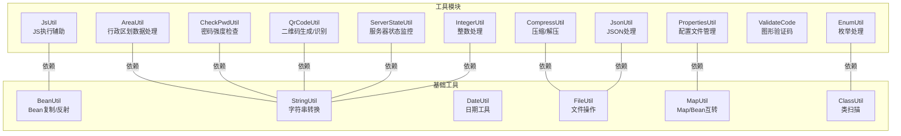

图表来源
- [AreaUtil.java:1-341](file://sh-tool/src/main/java/com/wkclz/tool/utils/AreaUtil.java#L1-L341)
- [CheckPwdUtil.java:1-342](file://sh-tool/src/main/java/com/wkclz/tool/utils/CheckPwdUtil.java#L1-L342)
- [CompressUtil.java:1-185](file://sh-tool/src/main/java/com/wkclz/tool/utils/CompressUtil.java#L1-L185)
- [EnumUtil.java:1-111](file://sh-tool/src/main/java/com/wkclz/tool/utils/EnumUtil.java#L1-L111)
- [IntegerUtil.java:1-48](file://sh-tool/src/main/java/com/wkclz/tool/utils/IntegerUtil.java#L1-L48)
- [JsUtil.java:1-94](file://sh-tool/src/main/java/com/wkclz/tool/utils/JsUtil.java#L1-L94)
- [JsonUtil.java:1-144](file://sh-tool/src/main/java/com/wkclz/tool/utils/JsonUtil.java#L1-L144)
- [PropertiesUtil.java:1-150](file://sh-tool/src/main/java/com/wkclz/tool/utils/PropertiesUtil.java#L1-L150)
- [QrCodeUtil.java:1-134](file://sh-tool/src/main/java/com/wkclz/tool/utils/QrCodeUtil.java#L1-L134)
- [ValidateCode.java:1-262](file://sh-tool/src/main/java/com/wkclz/tool/utils/ValidateCode.java#L1-L262)
- [ServerStateUtil.java:1-218](file://sh-tool/src/main/java/com/wkclz/tool/utils/ServerStateUtil.java#L1-L218)
- [BeanUtil.java:1-293](file://sh-tool/src/main/java/com/wkclz/tool/utils/BeanUtil.java#L1-L293)
- [StringUtil.java:1-167](file://sh-tool/src/main/java/com/wkclz/tool/utils/StringUtil.java#L1-L167)
- [DateUtil.java:1-132](file://sh-tool/src/main/java/com/wkclz/tool/utils/DateUtil.java#L1-L132)
- [FileUtil.java:1-168](file://sh-tool/src/main/java/com/wkclz/tool/utils/FileUtil.java#L1-L168)
- [MapUtil.java:1-318](file://sh-tool/src/main/java/com/wkclz/tool/utils/MapUtil.java#L1-L318)
- [ClassUtil.java:1-256](file://sh-tool/src/main/java/com/wkclz/tool/utils/ClassUtil.java#L1-L256)

章节来源
- [AreaUtil.java:1-341](file://sh-tool/src/main/java/com/wkclz/tool/utils/AreaUtil.java#L1-L341)
- [CheckPwdUtil.java:1-342](file://sh-tool/src/main/java/com/wkclz/tool/utils/CheckPwdUtil.java#L1-L342)
- [CompressUtil.java:1-185](file://sh-tool/src/main/java/com/wkclz/tool/utils/CompressUtil.java#L1-L185)
- [EnumUtil.java:1-111](file://sh-tool/src/main/java/com/wkclz/tool/utils/EnumUtil.java#L1-L111)
- [IntegerUtil.java:1-48](file://sh-tool/src/main/java/com/wkclz/tool/utils/IntegerUtil.java#L1-L48)
- [JsUtil.java:1-94](file://sh-tool/src/main/java/com/wkclz/tool/utils/JsUtil.java#L1-L94)
- [JsonUtil.java:1-144](file://sh-tool/src/main/java/com/wkclz/tool/utils/JsonUtil.java#L1-L144)
- [PropertiesUtil.java:1-150](file://sh-tool/src/main/java/com/wkclz/tool/utils/PropertiesUtil.java#L1-L150)
- [QrCodeUtil.java:1-134](file://sh-tool/src/main/java/com/wkclz/tool/utils/QrCodeUtil.java#L1-L134)
- [ValidateCode.java:1-262](file://sh-tool/src/main/java/com/wkclz/tool/utils/ValidateCode.java#L1-L262)
- [ServerStateUtil.java:1-218](file://sh-tool/src/main/java/com/wkclz/tool/utils/ServerStateUtil.java#L1-L218)
- [BeanUtil.java:1-293](file://sh-tool/src/main/java/com/wkclz/tool/utils/BeanUtil.java#L1-L293)
- [StringUtil.java:1-167](file://sh-tool/src/main/java/com/wkclz/tool/utils/StringUtil.java#L1-L167)
- [DateUtil.java:1-132](file://sh-tool/src/main/java/com/wkclz/tool/utils/DateUtil.java#L1-L132)
- [FileUtil.java:1-168](file://sh-tool/src/main/java/com/wkclz/tool/utils/FileUtil.java#L1-L168)
- [MapUtil.java:1-318](file://sh-tool/src/main/java/com/wkclz/tool/utils/MapUtil.java#L1-L318)
- [ClassUtil.java:1-256](file://sh-tool/src/main/java/com/wkclz/tool/utils/ClassUtil.java#L1-L256)

## 核心组件
- 行政区划数据处理：AreaUtil 提供爬取国家统计局行政区划数据的能力，支持省市区/乡镇/村层级的采集与缓存，适合首次建库或数据同步场景。
- 密码强度检查：CheckPwdUtil 提供高强度与中低强度两类密码校验策略，支持评分与规则扣分，适用于注册登录、密码策略合规场景。
- 压缩与解压：CompressUtil 提供 ZIP 压缩与解压能力，支持保留目录结构与安全路径校验，适合批量导出、报表打包等场景。
- 枚举处理：EnumUtil 提供基于注解与反射的枚举扫描与键值映射，便于统一字典与前端展示。
- 整数处理：IntegerUtil 提供字符串到整型/长整型列表的转换，结合正则过滤非法输入，适合批量 ID 处理。
- JS 执行辅助：JsUtil 基于 Rhino 执行 JS 脚本，支持函数缓存与参数传递，适合动态规则计算与前端脚本迁移。
- JSON 处理：JsonUtil 提供文件读写、格式化与空白清理，便于配置与日志 JSON 的规范化。
- 配置文件管理：PropertiesUtil 提供 .properties 文件读写、Map/Properties/Object 互转，适合运行时配置管理。
- 二维码生成与识别：QrCodeUtil 提供二维码/条形码生成、Base64 编码与网络资源下载，适合分享链接、小程序码等场景。
- 图形验证码：ValidateCode 提供多种类型验证码文本与图片生成，支持干扰线与颜色定制，适合登录/注册防刷。
- 服务器状态监控：ServerStateUtil 提供 JVM 运行时、内存、GC、线程、磁盘等系统指标采集，适合健康检查与告警。

章节来源
- [AreaUtil.java:1-341](file://sh-tool/src/main/java/com/wkclz/tool/utils/AreaUtil.java#L1-L341)
- [CheckPwdUtil.java:1-342](file://sh-tool/src/main/java/com/wkclz/tool/utils/CheckPwdUtil.java#L1-L342)
- [CompressUtil.java:1-185](file://sh-tool/src/main/java/com/wkclz/tool/utils/CompressUtil.java#L1-L185)
- [EnumUtil.java:1-111](file://sh-tool/src/main/java/com/wkclz/tool/utils/EnumUtil.java#L1-L111)
- [IntegerUtil.java:1-48](file://sh-tool/src/main/java/com/wkclz/tool/utils/IntegerUtil.java#L1-L48)
- [JsUtil.java:1-94](file://sh-tool/src/main/java/com/wkclz/tool/utils/JsUtil.java#L1-L94)
- [JsonUtil.java:1-144](file://sh-tool/src/main/java/com/wkclz/tool/utils/JsonUtil.java#L1-L144)
- [PropertiesUtil.java:1-150](file://sh-tool/src/main/java/com/wkclz/tool/utils/PropertiesUtil.java#L1-L150)
- [QrCodeUtil.java:1-134](file://sh-tool/src/main/java/com/wkclz/tool/utils/QrCodeUtil.java#L1-L134)
- [ValidateCode.java:1-262](file://sh-tool/src/main/java/com/wkclz/tool/utils/ValidateCode.java#L1-L262)
- [ServerStateUtil.java:1-218](file://sh-tool/src/main/java/com/wkclz/tool/utils/ServerStateUtil.java#L1-L218)

## 架构总览
以下为工具类之间的典型调用关系与协作模式：

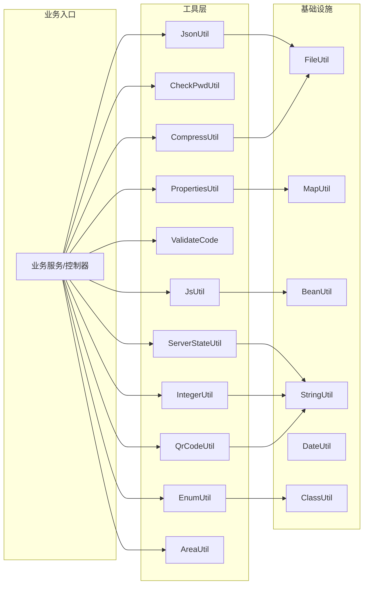

图表来源
- [JsUtil.java:1-94](file://sh-tool/src/main/java/com/wkclz/tool/utils/JsUtil.java#L1-L94)
- [CheckPwdUtil.java:1-342](file://sh-tool/src/main/java/com/wkclz/tool/utils/CheckPwdUtil.java#L1-L342)
- [CompressUtil.java:1-185](file://sh-tool/src/main/java/com/wkclz/tool/utils/CompressUtil.java#L1-L185)
- [QrCodeUtil.java:1-134](file://sh-tool/src/main/java/com/wkclz/tool/utils/QrCodeUtil.java#L1-L134)
- [ValidateCode.java:1-262](file://sh-tool/src/main/java/com/wkclz/tool/utils/ValidateCode.java#L1-L262)
- [PropertiesUtil.java:1-150](file://sh-tool/src/main/java/com/wkclz/tool/utils/PropertiesUtil.java#L1-L150)
- [JsonUtil.java:1-144](file://sh-tool/src/main/java/com/wkclz/tool/utils/JsonUtil.java#L1-L144)
- [ServerStateUtil.java:1-218](file://sh-tool/src/main/java/com/wkclz/tool/utils/ServerStateUtil.java#L1-L218)
- [IntegerUtil.java:1-48](file://sh-tool/src/main/java/com/wkclz/tool/utils/IntegerUtil.java#L1-L48)
- [EnumUtil.java:1-111](file://sh-tool/src/main/java/com/wkclz/tool/utils/EnumUtil.java#L1-L111)
- [AreaUtil.java:1-341](file://sh-tool/src/main/java/com/wkclz/tool/utils/AreaUtil.java#L1-L341)
- [FileUtil.java:1-168](file://sh-tool/src/main/java/com/wkclz/tool/utils/FileUtil.java#L1-L168)
- [MapUtil.java:1-318](file://sh-tool/src/main/java/com/wkclz/tool/utils/MapUtil.java#L1-L318)
- [BeanUtil.java:1-293](file://sh-tool/src/main/java/com/wkclz/tool/utils/BeanUtil.java#L1-L293)
- [StringUtil.java:1-167](file://sh-tool/src/main/java/com/wkclz/tool/utils/StringUtil.java#L1-L167)
- [DateUtil.java:1-132](file://sh-tool/src/main/java/com/wkclz/tool/utils/DateUtil.java#L1-L132)
- [ClassUtil.java:1-256](file://sh-tool/src/main/java/com/wkclz/tool/utils/ClassUtil.java#L1-L256)

## 详细组件分析

### 行政区划数据处理（AreaUtil）
- 功能概述
  - 通过国家统计局公开数据源抓取省市区/乡镇/村层级行政区划，构建完整树形结构。
  - 支持本地缓存与断点续爬，具备重试机制与异常处理。
- 关键流程
  - 爬取省 -> 市 -> 县 -> 乡镇 -> 村/居委/街道，逐级递归。
  - 使用 HTML 解析与本地缓存避免重复抓取。
- 典型场景
  - 首次建库、行政区划导入、数据同步与更新。
- 最佳实践
  - 控制并发与延时，遵守站点 robots 与访问频率。
  - 结合缓存目录与失败重试，确保稳定性。
- 风险提示
  - 数据源可能变更，需定期校验与适配。
  - 大规模抓取需考虑网络与存储成本。

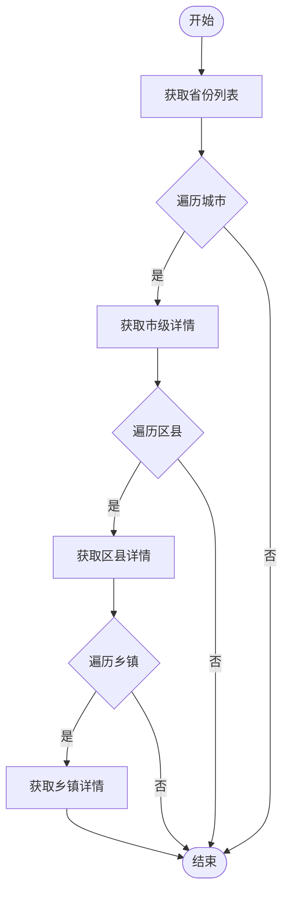

图表来源
- [AreaUtil.java:43-268](file://sh-tool/src/main/java/com/wkclz/tool/utils/AreaUtil.java#L43-L268)

章节来源
- [AreaUtil.java:1-341](file://sh-tool/src/main/java/com/wkclz/tool/utils/AreaUtil.java#L1-L341)

### 密码强度检查（CheckPwdUtil）
- 功能概述
  - 提供两类校验：高强度评分与中低强度阈值校验。
  - 高强度策略包含加分项（长度、字符类型多样性、中间穿插）与多项扣分项（纯字母/纯数字、重复字符、连续序列等），最终归一化到 0-100 分。
  - 中低强度策略校验长度范围与最少字符类型数。
- 典型场景
  - 用户注册/改密、密码策略合规、风控评分。
- 最佳实践
  - 建议优先使用高强度策略，结合业务阈值调整。
  - 对于中低强度策略，建议配合二次校验与历史密码检测。
- 风险提示
  - 评分策略需随业务演进调整，避免过度宽松或严格。

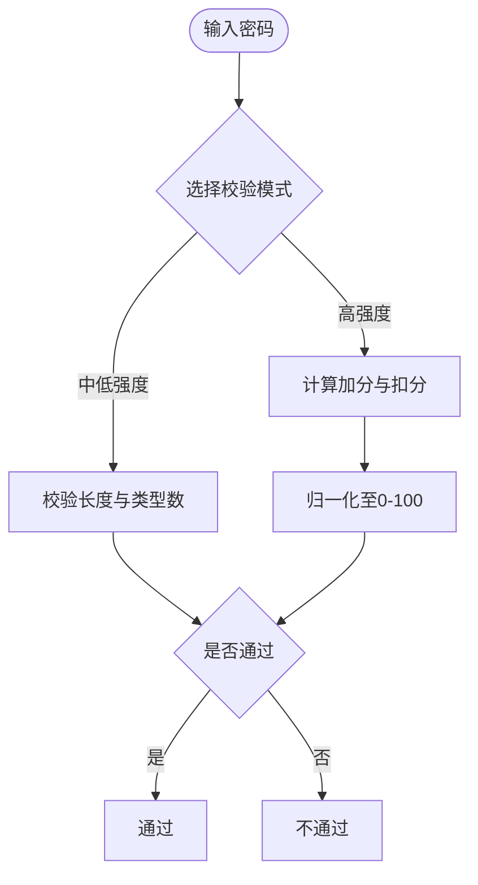

图表来源
- [CheckPwdUtil.java:276-342](file://sh-tool/src/main/java/com/wkclz/tool/utils/CheckPwdUtil.java#L276-L342)

章节来源
- [CheckPwdUtil.java:1-342](file://sh-tool/src/main/java/com/wkclz/tool/utils/CheckPwdUtil.java#L1-L342)

### 压缩与解压（CompressUtil）
- 功能概述
  - 支持将目录压缩为 ZIP，并可选择是否保留目录结构。
  - 支持 ZIP 解压，包含路径安全校验，防止目录穿越。
- 典型场景
  - 日志打包、批量导出、报表归档。
- 最佳实践
  - 保留目录结构时注意同名文件冲突风险。
  - 解压前校验来源可信度，避免恶意路径。
- 风险提示
  - 目录穿越攻击：严格校验解压路径前缀。

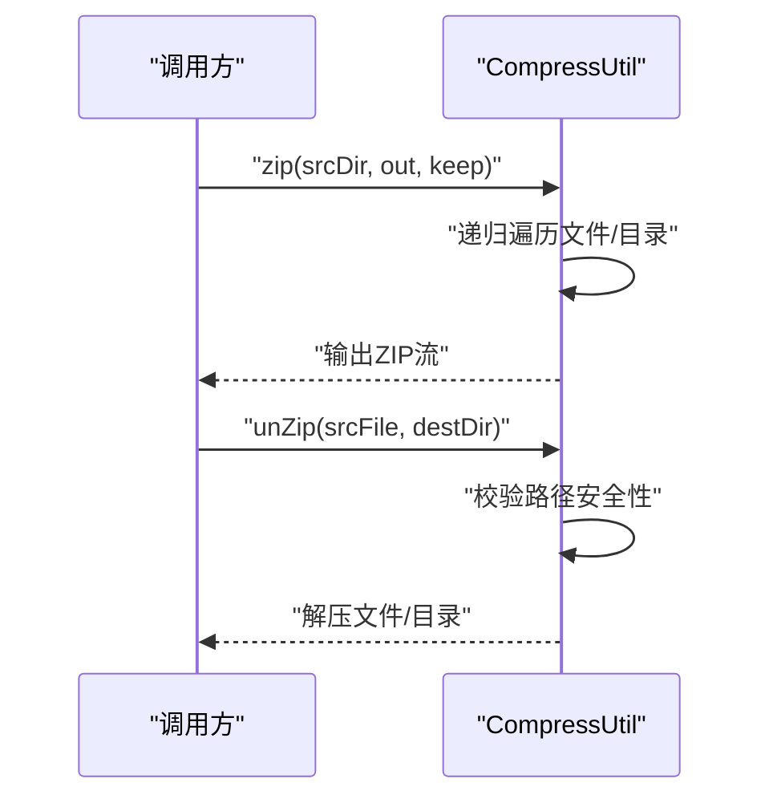

图表来源
- [CompressUtil.java:35-181](file://sh-tool/src/main/java/com/wkclz/tool/utils/CompressUtil.java#L35-L181)

章节来源
- [CompressUtil.java:1-185](file://sh-tool/src/main/java/com/wkclz/tool/utils/CompressUtil.java#L1-L185)

### 枚举处理（EnumUtil）
- 功能概述
  - 基于包扫描与反射，提取枚举类型及其键值映射，支持注解描述。
  - 适用于统一字典、前端下拉与接口返回。
- 典型场景
  - 枚举字典表、状态码映射、前端渲染。
- 最佳实践
  - 枚举命名与注解保持一致，便于维护。
  - 结合缓存减少重复扫描开销。
- 风险提示
  - 反射成本较高，建议在启动阶段预热。

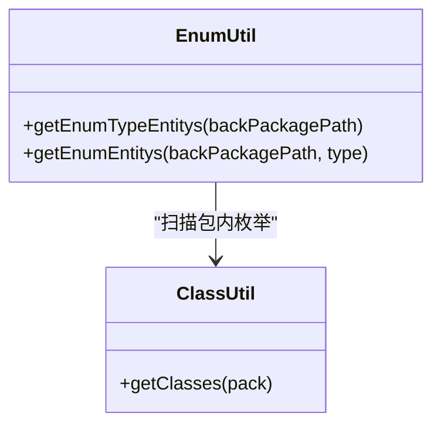

图表来源
- [EnumUtil.java:43-109](file://sh-tool/src/main/java/com/wkclz/tool/utils/EnumUtil.java#L43-L109)
- [ClassUtil.java:62-147](file://sh-tool/src/main/java/com/wkclz/tool/utils/ClassUtil.java#L62-L147)

章节来源
- [EnumUtil.java:1-111](file://sh-tool/src/main/java/com/wkclz/tool/utils/EnumUtil.java#L1-L111)
- [ClassUtil.java:1-256](file://sh-tool/src/main/java/com/wkclz/tool/utils/ClassUtil.java#L1-L256)

### 整数处理（IntegerUtil）
- 功能概述
  - 将逗号/分号/竖线分隔的字符串转换为整型/长整型列表，内部使用正则过滤非正整数。
- 典型场景
  - 批量 ID 处理、权限范围、批量操作。
- 最佳实践
  - 输入前先清洗与校验，避免异常值进入后续流程。
- 风险提示
  - 非数字字符会被忽略，需确保输入格式正确。

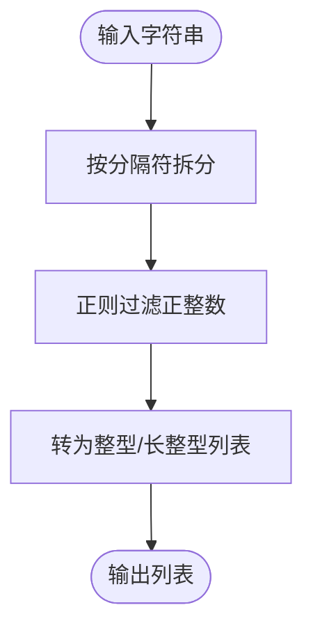

图表来源
- [IntegerUtil.java:22-44](file://sh-tool/src/main/java/com/wkclz/tool/utils/IntegerUtil.java#L22-L44)

章节来源
- [IntegerUtil.java:1-48](file://sh-tool/src/main/java/com/wkclz/tool/utils/IntegerUtil.java#L1-L48)

### JS 执行辅助（JsUtil）
- 功能概述
  - 基于 Rhino 执行 JS 脚本，支持函数缓存与参数传递，返回字符串结果。
- 典型场景
  - 动态规则计算、前端脚本迁移、简单表达式求值。
- 最佳实践
  - 脚本需符合函数声明规范，参数以对象形式传入。
  - 对热点脚本进行缓存，避免重复编译。
- 风险提示
  - 仅限沙箱环境，避免执行不受信任脚本。

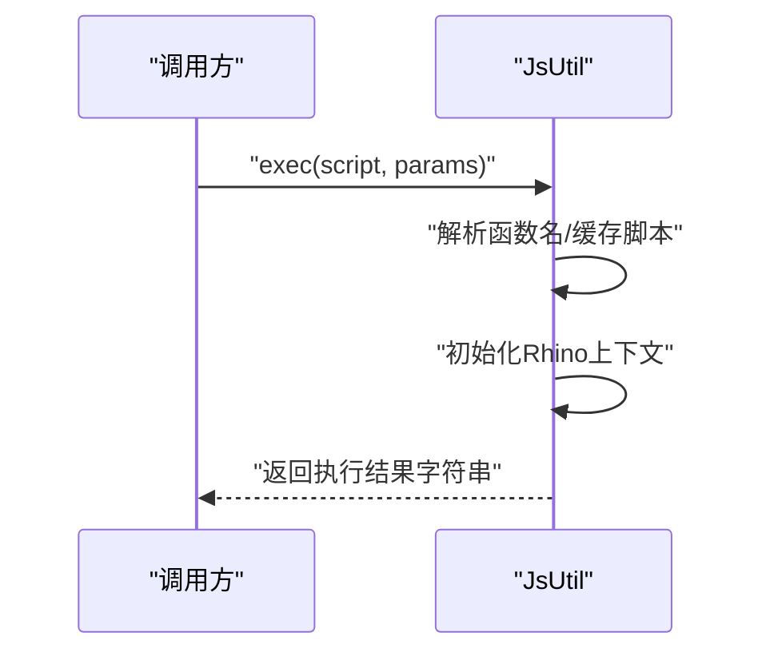

图表来源
- [JsUtil.java:18-75](file://sh-tool/src/main/java/com/wkclz/tool/utils/JsUtil.java#L18-L75)

章节来源
- [JsUtil.java:1-94](file://sh-tool/src/main/java/com/wkclz/tool/utils/JsUtil.java#L1-L94)

### JSON 处理（JsonUtil）
- 功能概述
  - 读取 JSON 文件并反序列化为对象；将对象序列化为格式化 JSON 并写入文件；移除空白字符提升兼容性。
- 典型场景
  - 配置文件读写、日志 JSON 规范化、模板数据持久化。
- 最佳实践
  - 写入前进行格式化，便于人工审阅与版本对比。
  - 对空路径进行防御性判断。
- 风险提示
  - 大文件读写需关注 IO 性能与磁盘空间。

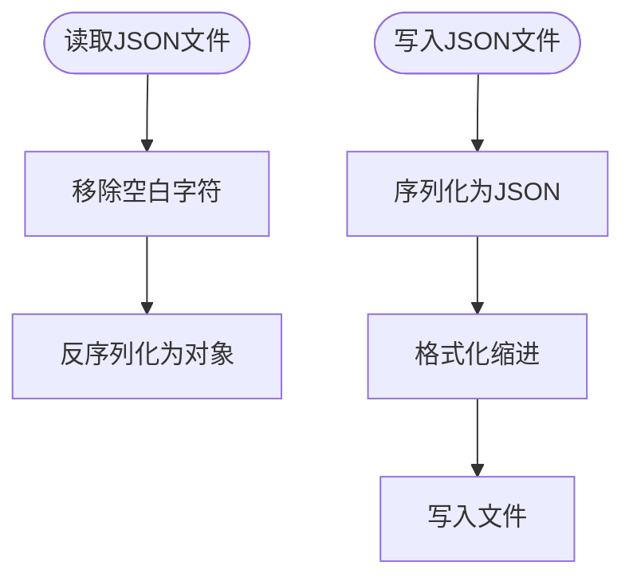

图表来源
- [JsonUtil.java:26-59](file://sh-tool/src/main/java/com/wkclz/tool/utils/JsonUtil.java#L26-L59)

章节来源
- [JsonUtil.java:1-144](file://sh-tool/src/main/java/com/wkclz/tool/utils/JsonUtil.java#L1-L144)

### 配置文件管理（PropertiesUtil）
- 功能概述
  - .properties 文件读取/写入、Map/Properties/Object 互转、按键排序存储。
- 典型场景
  - 运行时配置管理、动态开关、灰度参数。
- 最佳实践
  - 写入时合并新旧配置并排序，避免无序差异。
  - 对空文件进行容错处理。
- 风险提示
  - 手动编辑可能导致格式破坏，建议通过工具维护。

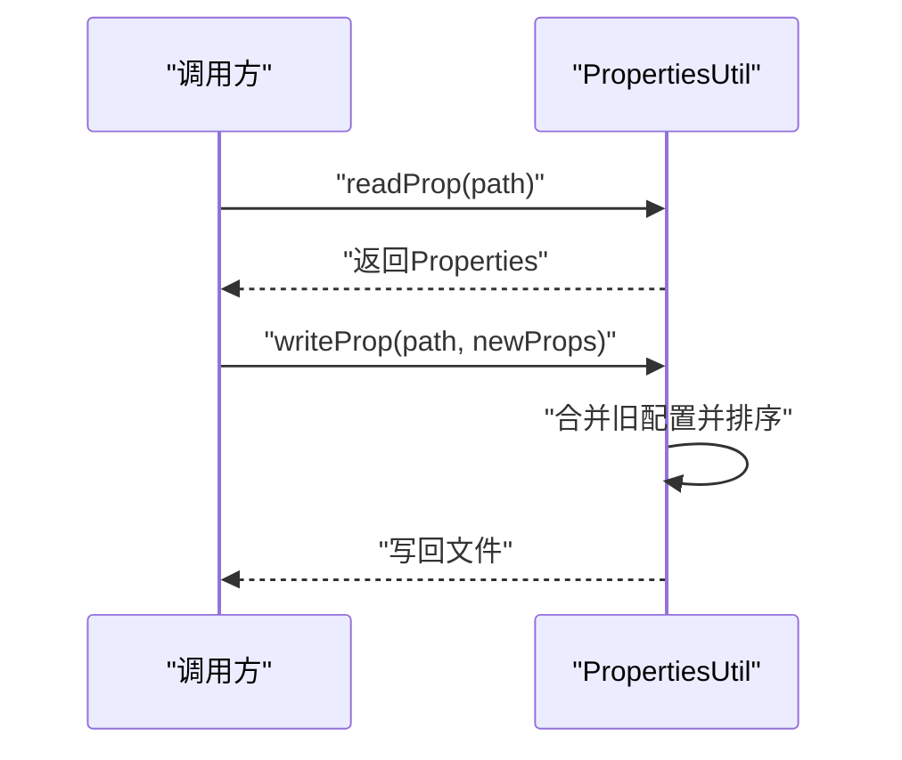

图表来源
- [PropertiesUtil.java:75-116](file://sh-tool/src/main/java/com/wkclz/tool/utils/PropertiesUtil.java#L75-L116)

章节来源
- [PropertiesUtil.java:1-150](file://sh-tool/src/main/java/com/wkclz/tool/utils/PropertiesUtil.java#L1-L150)

### 二维码生成与识别（QrCodeUtil）
- 功能概述
  - 支持二维码与条形码生成，输出 Base64 或文件；支持网络资源下载为 Base64。
- 典型场景
  - 分享链接、小程序码、资产标签。
- 最佳实践
  - 指定合适的尺寸与纠错等级，兼顾清晰度与体积。
  - 生成 Base64 时注意前缀与传输开销。
- 风险提示
  - 网络资源下载需校验 URL 有效性与大小限制。

```mermaid
sequenceDiagram
participant Caller as "调用方"
participant QRU as "QrCodeUtil"
Caller->>QRU : "createBase64QrCode(url)"
QRU->>QRU : "编码为BitMatrix"
QRU->>QRU : "转BufferedImage"
QRU-->>Caller : "返回data : image/png;base64,..."
```

图表来源
- [QrCodeUtil.java:41-115](file://sh-tool/src/main/java/com/wkclz/tool/utils/QrCodeUtil.java#L41-L115)

章节来源
- [QrCodeUtil.java:1-134](file://sh-tool/src/main/java/com/wkclz/tool/utils/QrCodeUtil.java#L1-L134)

### 图形验证码（ValidateCode）
- 功能概述
  - 生成多种类型的验证码文本与图片，支持干扰线、字体颜色与位置随机。
- 典型场景
  - 登录/注册防刷、人机校验。
- 最佳实践
  - 控制字符集与长度，避免歧义字符。
  - 干扰线数量与颜色应平衡美观与识别难度。
- 风险提示
  - 随机性依赖 SecureRandom，确保熵源稳定。

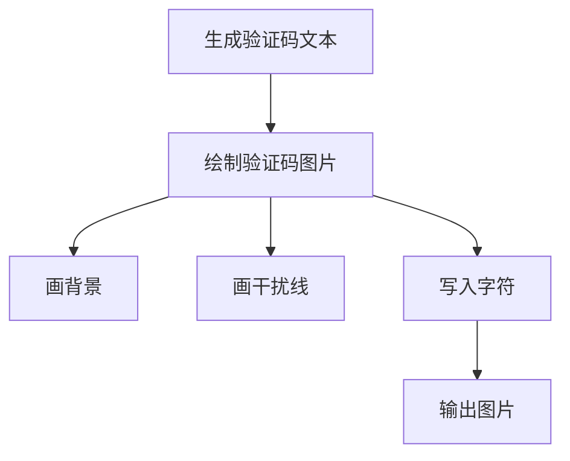

图表来源
- [ValidateCode.java:62-247](file://sh-tool/src/main/java/com/wkclz/tool/utils/ValidateCode.java#L62-L247)

章节来源
- [ValidateCode.java:1-262](file://sh-tool/src/main/java/com/wkclz/tool/utils/ValidateCode.java#L1-L262)

### 服务器状态监控（ServerStateUtil）
- 功能概述
  - 采集 JVM 类加载、编译、操作系统、运行时、线程、内存、GC、内存池、磁盘等指标。
- 典型场景
  - 健康检查、性能监控、容量规划。
- 最佳实践
  - 定期采样并落库/上报，设置阈值告警。
  - 关注 GC 次数与时间、堆内存峰值与阈值。
- 风险提示
  - 指标采集可能带来额外开销，建议按需采样。

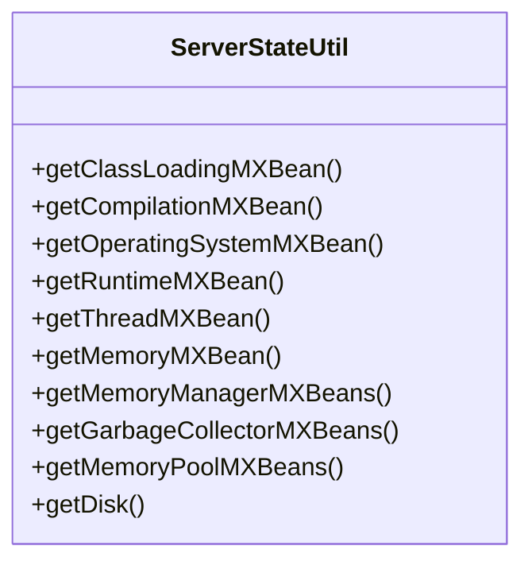

图表来源
- [ServerStateUtil.java:20-215](file://sh-tool/src/main/java/com/wkclz/tool/utils/ServerStateUtil.java#L20-L215)

章节来源
- [ServerStateUtil.java:1-218](file://sh-tool/src/main/java/com/wkclz/tool/utils/ServerStateUtil.java#L1-L218)

## 依赖关系分析
- 工具间耦合
  - 多数工具为纯工具类，低耦合高内聚；少数存在对基础工具的间接依赖（如 JSON/文件操作、Map/Bean 转换）。
- 外部依赖
  - 压缩：java.util.zip
  - JSON：Fastjson2
  - JS：Rhino
  - 图像：ZXing、ImageIO
  - 反射：Spring BeanUtils、Java Reflection
- 循环依赖
  - 当前未发现直接循环依赖；工具类之间通过组合而非继承关系协作。

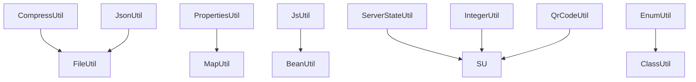

图表来源
- [CompressUtil.java:1-185](file://sh-tool/src/main/java/com/wkclz/tool/utils/CompressUtil.java#L1-L185)
- [JsonUtil.java:1-144](file://sh-tool/src/main/java/com/wkclz/tool/utils/JsonUtil.java#L1-L144)
- [PropertiesUtil.java:1-150](file://sh-tool/src/main/java/com/wkclz/tool/utils/PropertiesUtil.java#L1-L150)
- [JsUtil.java:1-94](file://sh-tool/src/main/java/com/wkclz/tool/utils/JsUtil.java#L1-L94)
- [ServerStateUtil.java:1-218](file://sh-tool/src/main/java/com/wkclz/tool/utils/ServerStateUtil.java#L1-L218)
- [EnumUtil.java:1-111](file://sh-tool/src/main/java/com/wkclz/tool/utils/EnumUtil.java#L1-L111)
- [IntegerUtil.java:1-48](file://sh-tool/src/main/java/com/wkclz/tool/utils/IntegerUtil.java#L1-L48)
- [QrCodeUtil.java:1-134](file://sh-tool/src/main/java/com/wkclz/tool/utils/QrCodeUtil.java#L1-L134)
- [FileUtil.java:1-168](file://sh-tool/src/main/java/com/wkclz/tool/utils/FileUtil.java#L1-L168)
- [MapUtil.java:1-318](file://sh-tool/src/main/java/com/wkclz/tool/utils/MapUtil.java#L1-L318)
- [BeanUtil.java:1-293](file://sh-tool/src/main/java/com/wkclz/tool/utils/BeanUtil.java#L1-L293)
- [StringUtil.java:1-167](file://sh-tool/src/main/java/com/wkclz/tool/utils/StringUtil.java#L1-L167)
- [ClassUtil.java:1-256](file://sh-tool/src/main/java/com/wkclz/tool/utils/ClassUtil.java#L1-L256)

章节来源
- [CompressUtil.java:1-185](file://sh-tool/src/main/java/com/wkclz/tool/utils/CompressUtil.java#L1-L185)
- [JsonUtil.java:1-144](file://sh-tool/src/main/java/com/wkclz/tool/utils/JsonUtil.java#L1-L144)
- [PropertiesUtil.java:1-150](file://sh-tool/src/main/java/com/wkclz/tool/utils/PropertiesUtil.java#L1-L150)
- [JsUtil.java:1-94](file://sh-tool/src/main/java/com/wkclz/tool/utils/JsUtil.java#L1-L94)
- [ServerStateUtil.java:1-218](file://sh-tool/src/main/java/com/wkclz/tool/utils/ServerStateUtil.java#L1-L218)
- [EnumUtil.java:1-111](file://sh-tool/src/main/java/com/wkclz/tool/utils/EnumUtil.java#L1-L111)
- [IntegerUtil.java:1-48](file://sh-tool/src/main/java/com/wkclz/tool/utils/IntegerUtil.java#L1-L48)
- [QrCodeUtil.java:1-134](file://sh-tool/src/main/java/com/wkclz/tool/utils/QrCodeUtil.java#L1-L134)
- [FileUtil.java:1-168](file://sh-tool/src/main/java/com/wkclz/tool/utils/FileUtil.java#L1-L168)
- [MapUtil.java:1-318](file://sh-tool/src/main/java/com/wkclz/tool/utils/MapUtil.java#L1-L318)
- [BeanUtil.java:1-293](file://sh-tool/src/main/java/com/wkclz/tool/utils/BeanUtil.java#L1-L293)
- [StringUtil.java:1-167](file://sh-tool/src/main/java/com/wkclz/tool/utils/StringUtil.java#L1-L167)
- [ClassUtil.java:1-256](file://sh-tool/src/main/java/com/wkclz/tool/utils/ClassUtil.java#L1-L256)

## 性能考量
- I/O 密集型
  - 压缩/解压与文件读写受磁盘与网络影响较大，建议批量处理与异步化。
- CPU 密集型
  - 密码强度评分与二维码编码涉及较多计算，建议缓存热点数据与合理采样。
- 反射与反射链路
  - 枚举扫描与 Bean 复制存在反射开销，建议在启动阶段预热并缓存结果。
- 线程与上下文
  - JS 执行使用 Rhino 上下文，注意线程安全与资源释放。

## 故障排查指南
- 压缩/解压
  - 症状：解压报路径越界或创建文件失败。
  - 处理：确认目标目录前缀校验与父目录存在性。
- 密码强度
  - 症状：高强度评分异常或中低强度不通过。
  - 处理：核对输入长度、字符类型与重复/连续规则。
- JSON 读写
  - 症状：写入失败或格式异常。
  - 处理：检查文件权限、磁盘空间与序列化对象结构。
- 配置文件
  - 症状：写入后顺序混乱或覆盖异常。
  - 处理：使用排序 Map 与合并策略，避免并发写入。
- 二维码
  - 症状：生成为空或 Base64 前缀缺失。
  - 处理：确认编码参数与图像写出成功。
- 验证码
  - 症状：图片模糊或字符难以识别。
  - 处理：调整字体大小、干扰线与颜色对比度。
- 服务器监控
  - 症状：指标采集失败或数值异常。
  - 处理：检查 MXBean 可用性与权限，关注 GC 与内存阈值。

章节来源
- [CompressUtil.java:131-181](file://sh-tool/src/main/java/com/wkclz/tool/utils/CompressUtil.java#L131-L181)
- [CheckPwdUtil.java:276-342](file://sh-tool/src/main/java/com/wkclz/tool/utils/CheckPwdUtil.java#L276-L342)
- [JsonUtil.java:40-58](file://sh-tool/src/main/java/com/wkclz/tool/utils/JsonUtil.java#L40-L58)
- [PropertiesUtil.java:92-116](file://sh-tool/src/main/java/com/wkclz/tool/utils/PropertiesUtil.java#L92-L116)
- [QrCodeUtil.java:105-127](file://sh-tool/src/main/java/com/wkclz/tool/utils/QrCodeUtil.java#L105-L127)
- [ValidateCode.java:172-222](file://sh-tool/src/main/java/com/wkclz/tool/utils/ValidateCode.java#L172-L222)
- [ServerStateUtil.java:127-215](file://sh-tool/src/main/java/com/wkclz/tool/utils/ServerStateUtil.java#L127-L215)

## 结论
本工具集覆盖了业务开发与运维中的高频需求，具备良好的可扩展性与可维护性。建议在生产环境中结合自身场景进行参数调优与安全加固，并建立完善的监控与告警体系，持续优化性能与稳定性。

## 附录
- 实际业务应用示例与最佳实践
  - 注册登录：使用 CheckPwdUtil 进行密码强度校验，结合 ValidateCode 防刷。
  - 数据导出：使用 CompressUtil 将报表打包为 ZIP，便于传输与归档。
  - 配置管理：使用 PropertiesUtil 动态维护运行时参数，结合 JsonUtil 管理模板数据。
  - 二维码分享：使用 QrCodeUtil 生成分享码，支持 Base64 传输。
  - 枚举字典：使用 EnumUtil 统一枚举键值，降低前后端耦合。
  - 批量 ID：使用 IntegerUtil 清洗与转换，避免异常值进入下游。
  - JS 规则：使用 JsUtil 执行动态规则，替代硬编码。
  - 服务器监控：使用 ServerStateUtil 采集关键指标，支撑容量与稳定性治理。