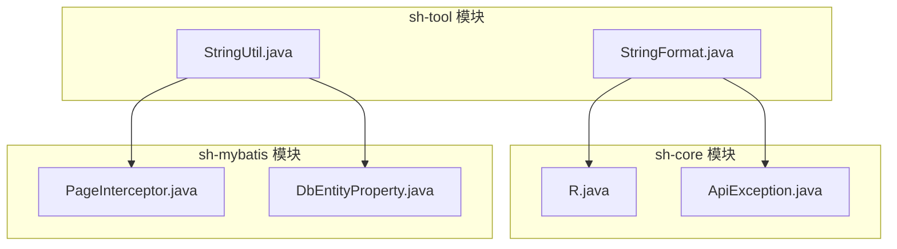
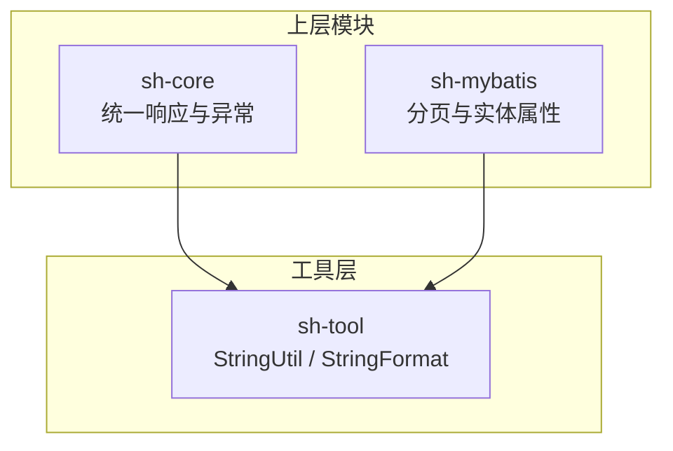
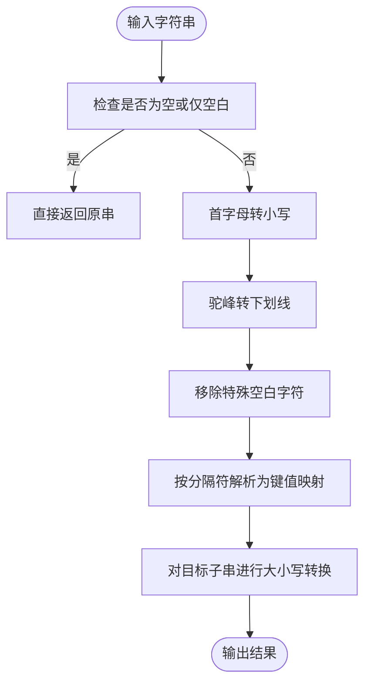
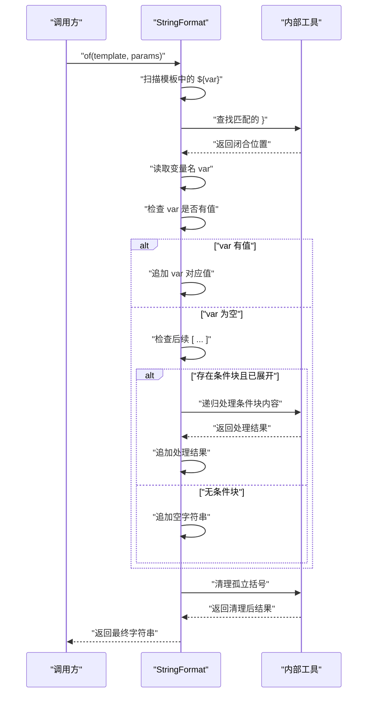
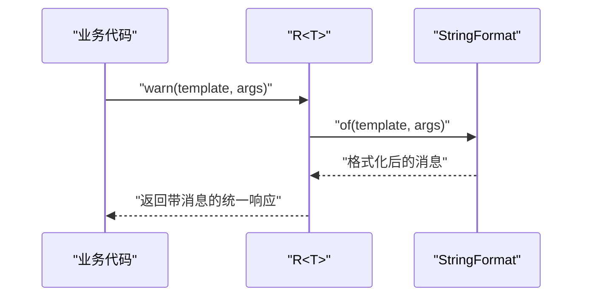
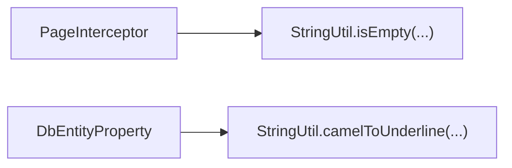
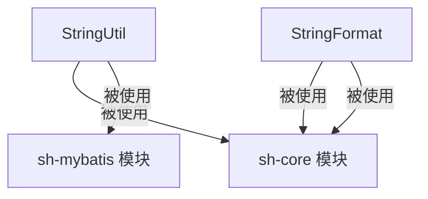

# 字符串格式化工具

<cite>
**本文档引用的文件**
- [StringUtil.java](file://sh-tool/src/main/java/com/wkclz/tool/utils/StringUtil.java)
- [StringFormat.java](file://sh-tool/src/main/java/com/wkclz/tool/utils/StringFormat.java)
- [R.java](file://sh-core/src/main/java/com/wkclz/core/base/R.java)
- [ApiException.java](file://sh-core/src/main/java/com/wkclz/core/exception/ApiException.java)
- [PageInterceptor.java](file://sh-mybatis/src/main/java/com/github/pagehelper/PageInterceptor.java)
- [DbEntityProperty.java](file://sh-mybatis/src/main/java/com/wkclz/mybatis/bean/DbEntityProperty.java)
</cite>

## 目录
1. [简介](#简介)
2. [项目结构](#项目结构)
3. [核心组件](#核心组件)
4. [架构概览](#架构概览)
5. [详细组件分析](#详细组件分析)
6. [依赖分析](#依赖分析)
7. [性能考虑](#性能考虑)
8. [故障排除指南](#故障排除指南)
9. [结论](#结论)
10. [附录](#附录)

## 简介
本文件面向字符串格式化工具的使用者与维护者，系统性地介绍 StringUtil 与 StringFormat 两大工具类的功能特性、实现原理与最佳实践。文档覆盖以下主题：
- StringUtil 的字符串验证、大小写转换、驼峰与下划线互转、特殊字符清理、变量解析等能力
- StringFormat 的顺序占位符与命名占位符两种模板机制、条件渲染与嵌套处理、括号清理策略
- 在数据预处理、日志与异常消息格式化、ORM 层命名转换等场景中的应用
- 性能优化建议与常见问题排查

## 项目结构
字符串格式化工具位于 sh-tool 模块的 utils 包中，并被 sh-core、sh-mybatis 等模块广泛使用。

图表来源
- [StringUtil.java:1-167](file://sh-tool/src/main/java/com/wkclz/tool/utils/StringUtil.java#L1-L167)
- [StringFormat.java:1-328](file://sh-tool/src/main/java/com/wkclz/tool/utils/StringFormat.java#L1-L328)
- [R.java:1-76](file://sh-core/src/main/java/com/wkclz/core/base/R.java#L1-L76)
- [ApiException.java:1-48](file://sh-core/src/main/java/com/wkclz/core/exception/ApiException.java#L1-L48)
- [PageInterceptor.java:80-279](file://sh-mybatis/src/main/java/com/github/pagehelper/PageInterceptor.java#L80-L279)
- [DbEntityProperty.java:60-214](file://sh-mybatis/src/main/java/com/wkclz/mybatis/bean/DbEntityProperty.java#L60-L214)

章节来源
- [StringUtil.java:1-167](file://sh-tool/src/main/java/com/wkclz/tool/utils/StringUtil.java#L1-L167)
- [StringFormat.java:1-328](file://sh-tool/src/main/java/com/wkclz/tool/utils/StringFormat.java#L1-L328)

## 核心组件
- StringUtil：提供字符串清洗、大小写转换、驼峰与下划线互转、变量解析与特殊字符处理等基础能力，适用于数据预处理与命名规范化。
- StringFormat：提供两类模板格式化能力：
  - 顺序占位符：以 {} 表示，按参数顺序替换，参数不足时保留占位符。
  - 命名占位符：以 ${var} 表示，支持条件渲染 ${var}[内容]，以及嵌套条件与括号清理。

章节来源
- [StringUtil.java:15-167](file://sh-tool/src/main/java/com/wkclz/tool/utils/StringUtil.java#L15-L167)
- [StringFormat.java:6-328](file://sh-tool/src/main/java/com/wkclz/tool/utils/StringFormat.java#L6-L328)

## 架构概览
字符串格式化工具在框架中的角色定位：
- 作为基础设施被上层模块复用：统一响应体 R、异常体系、MyBatis 插件与实体属性处理均依赖其能力。
- 通过 StringFormat 实现模板化消息与 SQL 片段拼装；通过 StringUtil 实现输入清洗与命名转换。

图表来源
- [R.java:1-76](file://sh-core/src/main/java/com/wkclz/core/base/R.java#L1-L76)
- [ApiException.java:1-48](file://sh-core/src/main/java/com/wkclz/core/exception/ApiException.java#L1-L48)
- [PageInterceptor.java:80-279](file://sh-mybatis/src/main/java/com/github/pagehelper/PageInterceptor.java#L80-L279)
- [DbEntityProperty.java:60-214](file://sh-mybatis/src/main/java/com/wkclz/mybatis/bean/DbEntityProperty.java#L60-L214)
- [StringUtil.java:1-167](file://sh-tool/src/main/java/com/wkclz/tool/utils/StringUtil.java#L1-L167)
- [StringFormat.java:1-328](file://sh-tool/src/main/java/com/wkclz/tool/utils/StringFormat.java#L1-L328)

## 详细组件分析

### StringUtil 组件分析
- 功能清单
  - 驼峰与下划线互转：支持下划线转驼峰、首字母大小写转换、驼峰转下划线
  - 字符串清洗：移除制表符、换行符等特殊空白字符，合并多余空格
  - 变量解析：将形如 key=value 的字符串按分隔符拆分为键值映射
  - 安全替换：对目标子串进行大小写转换，递归处理重复片段
- 典型应用场景
  - 数据预处理：清洗输入文本、统一大小写
  - ORM 映射：将 Java 字段名转换为数据库列名
  - 配置解析：从字符串中提取键值对

图表来源
- [StringUtil.java:27-156](file://sh-tool/src/main/java/com/wkclz/tool/utils/StringUtil.java#L27-L156)

章节来源
- [StringUtil.java:15-167](file://sh-tool/src/main/java/com/wkclz/tool/utils/StringUtil.java#L15-L167)

### StringFormat 组件分析
- 顺序占位符机制
  - 占位符形式：{}
  - 替换规则：按出现顺序依次替换，参数不足时保留占位符
  - 错误处理：模板为 null 时抛出非法参数异常
- 命名占位符与条件渲染
  - 占位符形式：${var}
  - 条件渲染：${var}[内容]，当 var 为空时整段不渲染
  - 嵌套处理：条件块内可继续使用命名占位符与条件渲染
  - 括号清理：移除孤立的 [ 或 ]，保留成对括号
- 典型应用场景
  - 统一响应与异常消息格式化
  - 日志与调试信息模板化
  - SQL 片段与动态参数的组合

图表来源
- [StringFormat.java:88-157](file://sh-tool/src/main/java/com/wkclz/tool/utils/StringFormat.java#L88-L157)

章节来源
- [StringFormat.java:6-328](file://sh-tool/src/main/java/com/wkclz/tool/utils/StringFormat.java#L6-L328)

### 组件在框架中的集成与使用

#### 统一响应与异常消息格式化
- R 类在警告与错误场景中使用 StringFormat 进行模板化消息生成
- 异常类（如 ApiException）提供静态工厂方法，支持模板与参数列表

图表来源
- [R.java:53-75](file://sh-core/src/main/java/com/wkclz/core/base/R.java#L53-L75)
- [StringFormat.java:23-63](file://sh-tool/src/main/java/com/wkclz/tool/utils/StringFormat.java#L23-L63)

章节来源
- [R.java:1-76](file://sh-core/src/main/java/com/wkclz/core/base/R.java#L1-L76)
- [ApiException.java:1-48](file://sh-core/src/main/java/com/wkclz/core/exception/ApiException.java#L1-L48)

#### MyBatis 分页插件与实体属性处理
- PageInterceptor 中使用 StringUtil 判断系统属性与环境变量是否为空
- DbEntityProperty 使用 StringUtil 将 Java 字段名转换为数据库列名

图表来源
- [PageInterceptor.java:84-98](file://sh-mybatis/src/main/java/com/github/pagehelper/PageInterceptor.java#L84-L98)
- [DbEntityProperty.java:63-65](file://sh-mybatis/src/main/java/com/wkclz/mybatis/bean/DbEntityProperty.java#L63-L65)

章节来源
- [PageInterceptor.java:80-279](file://sh-mybatis/src/main/java/com/github/pagehelper/PageInterceptor.java#L80-L279)
- [DbEntityProperty.java:60-214](file://sh-mybatis/src/main/java/com/wkclz/mybatis/bean/DbEntityProperty.java#L60-L214)

## 依赖分析
- 内部依赖
  - StringFormat 与 StringUtil 为纯工具类，无外部依赖
  - 上层模块（sh-core、sh-mybatis）依赖工具类提供的能力
- 耦合度评估
  - 工具类高内聚、低耦合，便于复用
  - 上层模块通过静态方法调用，耦合度可控

图表来源
- [StringUtil.java:1-167](file://sh-tool/src/main/java/com/wkclz/tool/utils/StringUtil.java#L1-L167)
- [StringFormat.java:1-328](file://sh-tool/src/main/java/com/wkclz/tool/utils/StringFormat.java#L1-L328)
- [R.java:1-76](file://sh-core/src/main/java/com/wkclz/core/base/R.java#L1-L76)
- [ApiException.java:1-48](file://sh-core/src/main/java/com/wkclz/core/exception/ApiException.java#L1-L48)
- [PageInterceptor.java:80-279](file://sh-mybatis/src/main/java/com/github/pagehelper/PageInterceptor.java#L80-L279)
- [DbEntityProperty.java:60-214](file://sh-mybatis/src/main/java/com/wkclz/mybatis/bean/DbEntityProperty.java#L60-L214)

## 性能考虑
- 字符串构建
  - StringUtil 使用 StringBuilder 进行拼接，时间复杂度 O(n)，空间复杂度 O(n)
  - StringFormat 在顺序占位符路径中采用子串截取与追加，整体线性复杂度
- 条件渲染与嵌套
  - 命名占位符路径包含多次扫描与递归处理，建议控制模板层级与变量数量
  - 嵌套条件渲染时，注意避免深层递归导致的性能开销
- 建议
  - 对高频调用的模板，优先使用顺序占位符以减少解析成本
  - 避免在热路径中频繁创建大型模板字符串，可考虑缓存或复用
  - 对于大量数据的格式化输出，优先使用批量处理策略

## 故障排除指南
- 模板为 null
  - 现象：抛出非法参数异常
  - 处理：确保传入非空模板
- 参数不足
  - 现象：保留未被替换的占位符
  - 处理：补齐参数或调整模板
- 条件渲染无效
  - 现象：变量为空时条件块未渲染
  - 处理：确认变量值是否为 null 或空字符串
- 孤立括号残留
  - 现象：模板中出现孤立 [ 或 ]
  - 处理：使用 StringFormat 的清理逻辑，或修正模板语法
- 输入为空或仅空白
  - 现象：大小写转换与互转返回原串
  - 处理：在调用前进行判空处理

章节来源
- [StringFormat.java:23-63](file://sh-tool/src/main/java/com/wkclz/tool/utils/StringFormat.java#L23-L63)
- [StringUtil.java:27-44](file://sh-tool/src/main/java/com/wkclz/tool/utils/StringUtil.java#L27-L44)

## 结论
StringUtil 与 StringFormat 提供了完备的字符串处理与格式化能力，既满足日常的数据清洗与命名转换需求，又支持灵活的消息模板化与条件渲染。通过在 sh-core 与 sh-mybatis 中的实际应用可见，这两类工具在统一响应、异常处理与 ORM 映射方面发挥着关键作用。遵循本文的性能建议与最佳实践，可在保证可读性的同时提升系统整体效率。

## 附录
- 常见使用场景速查
  - 数据预处理：使用 StringUtil 清洗特殊字符与统一大小写
  - 响应与异常消息：使用 StringFormat 的顺序占位符快速生成
  - 条件渲染：使用 StringFormat 的命名占位符与条件块
  - ORM 映射：使用 StringUtil 驼峰与下划线互转
- 最佳实践
  - 模板设计：保持简洁，避免过度嵌套
  - 参数管理：集中管理参数来源，避免硬编码
  - 错误处理：对模板与参数进行前置校验
  - 性能优化：在热点路径中优先选择顺序占位符，减少解析成本