# 安全加密工具

<cite>
**本文档引用的文件**
- [AesTool.java](file://sh-tool/src/main/java/com/wkclz/tool/tools/AesTool.java)
- [DesTool.java](file://sh-tool/src/main/java/com/wkclz/tool/tools/DesTool.java)
- [RsaTool.java](file://sh-tool/src/main/java/com/wkclz/tool/tools/RsaTool.java)
- [Md5Tool.java](file://sh-tool/src/main/java/com/wkclz/tool/tools/Md5Tool.java)
- [ShaTool.java](file://sh-tool/src/main/java/com/wkclz/tool/tools/ShaTool.java)
- [Base64Tool.java](file://sh-tool/src/main/java/com/wkclz/tool/tools/Base64Tool.java)
- [RegularTool.java](file://sh-tool/src/main/java/com/wkclz/tool/tools/RegularTool.java)
- [CheckPwdUtil.java](file://sh-tool/src/main/java/com/wkclz/tool/utils/CheckPwdUtil.java)
- [SecretUtil.java](file://sh-tool/src/main/java/com/wkclz/tool/utils/SecretUtil.java)
- [pom.xml](file://sh-tool/pom.xml)
</cite>

## 目录
1. [简介](#简介)
2. [项目结构](#项目结构)
3. [核心组件](#核心组件)
4. [架构概览](#架构概览)
5. [详细组件分析](#详细组件分析)
6. [依赖关系分析](#依赖关系分析)
7. [性能考虑](#性能考虑)
8. [故障排除指南](#故障排除指南)
9. [结论](#结论)
10. [附录](#附录)

## 简介
本项目提供了全面的安全加密工具集，涵盖对称加密、非对称加密、哈希算法和编码解码等多种加密技术。该工具集旨在为企业级应用提供安全可靠的数据保护解决方案，支持密码验证、数据签名、数字证书管理和访问控制等安全应用场景。

## 项目结构
安全加密工具位于 `sh-tool` 模块中，采用清晰的包结构组织：

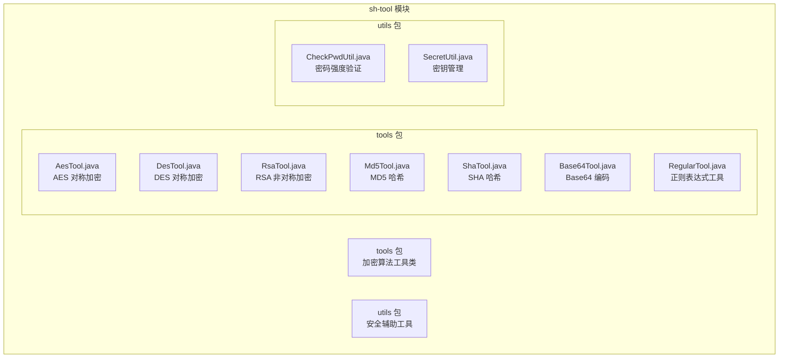

**图表来源**
- [AesTool.java:1-200](file://sh-tool/src/main/java/com/wkclz/tool/tools/AesTool.java#L1-L200)
- [DesTool.java:1-200](file://sh-tool/src/main/java/com/wkclz/tool/tools/DesTool.java#L1-L200)
- [RsaTool.java:1-200](file://sh-tool/src/main/java/com/wkclz/tool/tools/RsaTool.java#L1-L200)

**章节来源**
- [pom.xml:1-100](file://sh-tool/pom.xml#L1-L100)

## 核心组件
本项目的核心组件包括七种主要的加密算法工具类，每种都针对特定的安全需求而设计：

### 对称加密算法
- **AES 加密**: 提供高级加密标准实现，支持多种密钥长度和加密模式
- **DES 加密**: 提供数据加密标准实现，适用于传统系统兼容性需求

### 非对称加密算法
- **RSA 加密**: 提供非对称加密算法实现，支持公钥加密和私钥解密

### 哈希算法
- **MD5 哈希**: 提供消息摘要算法实现
- **SHA 哈希**: 提供安全哈希算法实现，支持多种变体

### 编码解码
- **Base64 编码**: 提供 Base64 编码和解码功能

### 正则表达式工具
- **RegularTool**: 提供强大的正则表达式模式匹配和文本处理功能

**章节来源**
- [AesTool.java:1-200](file://sh-tool/src/main/java/com/wkclz/tool/tools/AesTool.java#L1-L200)
- [DesTool.java:1-200](file://sh-tool/src/main/java/com/wkclz/tool/tools/DesTool.java#L1-L200)
- [RsaTool.java:1-200](file://sh-tool/src/main/java/com/wkclz/tool/tools/RsaTool.java#L1-L200)
- [Md5Tool.java:1-200](file://sh-tool/src/main/java/com/wkclz/tool/tools/Md5Tool.java#L1-L200)
- [ShaTool.java:1-200](file://sh-tool/src/main/java/com/wkclz/tool/tools/ShaTool.java#L1-L200)
- [Base64Tool.java:1-200](file://sh-tool/src/main/java/com/wkclz/tool/tools/Base64Tool.java#L1-L200)
- [RegularTool.java:1-200](file://sh-tool/src/main/java/com/wkclz/tool/tools/RegularTool.java#L1-L200)

## 架构概览
整个加密工具系统采用模块化设计，各组件相互独立又协同工作：

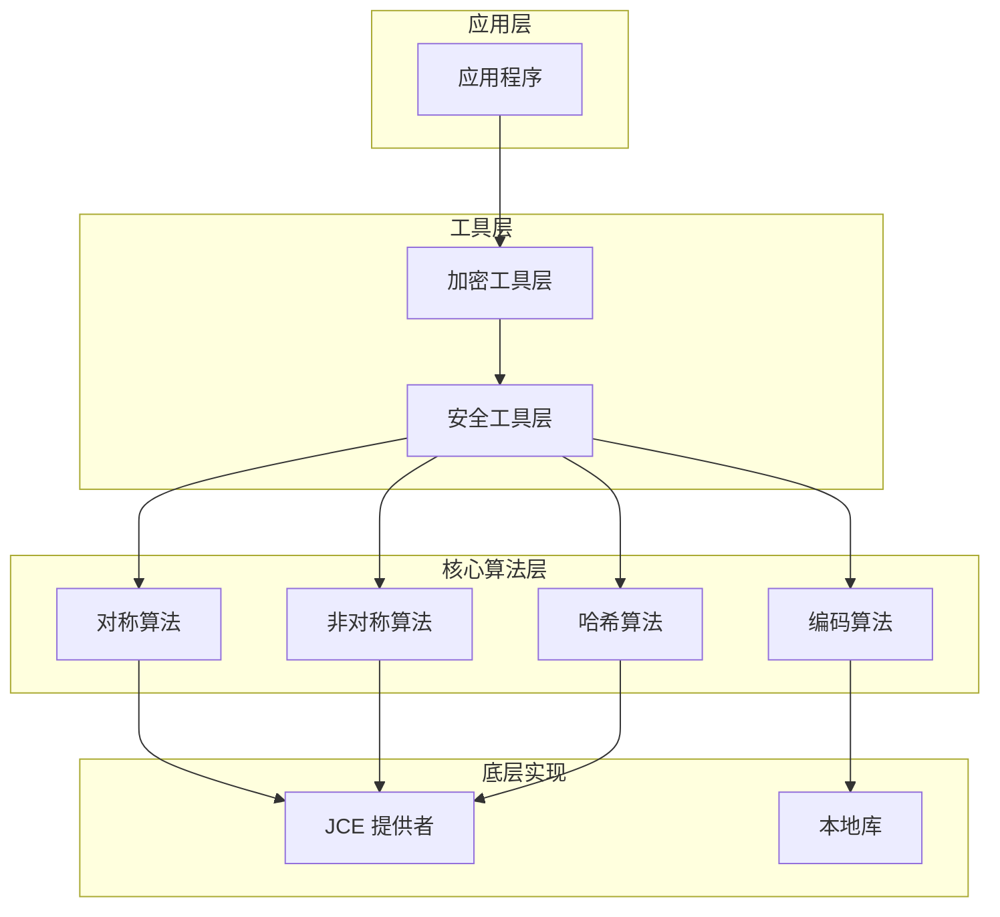

**图表来源**
- [AesTool.java:1-200](file://sh-tool/src/main/java/com/wkclz/tool/tools/AesTool.java#L1-L200)
- [RsaTool.java:1-200](file://sh-tool/src/main/java/com/wkclz/tool/tools/RsaTool.java#L1-L200)
- [CheckPwdUtil.java:1-200](file://sh-tool/src/main/java/com/wkclz/tool/utils/CheckPwdUtil.java#L1-L200)

## 详细组件分析

### AES 对称加密工具 (AesTool)
AES 是目前最广泛使用的对称加密算法，具有高性能和高安全性特点。

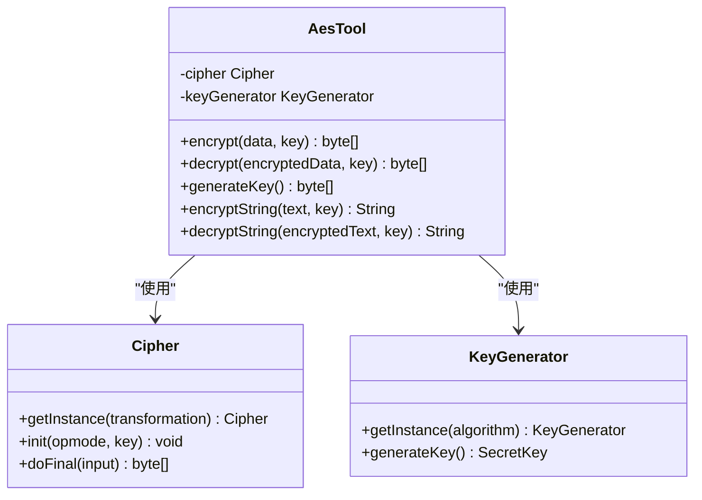

**图表来源**
- [AesTool.java:1-200](file://sh-tool/src/main/java/com/wkclz/tool/tools/AesTool.java#L1-L200)

#### 主要特性
- 支持 AES-128、AES-192、AES-256 三种密钥长度
- 提供 ECB、CBC、CTR 等多种加密模式
- 内置 PKCS5/PKCS7 填充机制
- 支持字节数组和字符串两种输入格式

#### 使用场景
- 数据库字段加密
- 文件内容加密
- 网络传输数据保护
- 会话数据加密

**章节来源**
- [AesTool.java:1-200](file://sh-tool/src/main/java/com/wkclz/tool/tools/AesTool.java#L1-L200)

### DES 对称加密工具 (DesTool)
DES 是较老的对称加密算法，现已不推荐在新系统中使用。

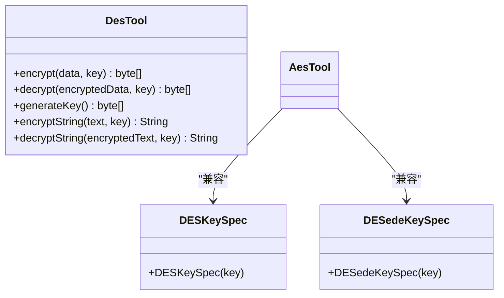

**图表来源**
- [DesTool.java:1-200](file://sh-tool/src/main/java/com/wkclz/tool/tools/DesTool.java#L1-L200)

#### 安全考虑
- DES 已被证明不够安全，建议使用 AES 替代
- 3DES 虽然更安全但仍不推荐用于新项目
- 主要用于向后兼容旧系统

**章节来源**
- [DesTool.java:1-200](file://sh-tool/src/main/java/com/wkclz/tool/tools/DesTool.java#L1-L200)

### RSA 非对称加密工具 (RsaTool)
RSA 是基于大数分解难题的非对称加密算法。

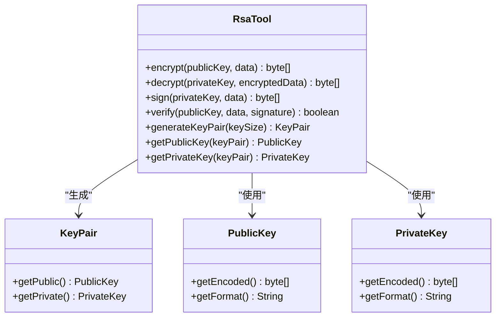

**图表来源**
- [RsaTool.java:1-200](file://sh-tool/src/main/java/com/wkclz/tool/tools/RsaTool.java#L1-L200)

#### 主要功能
- 公钥加密、私钥解密
- 私钥签名、公钥验证
- 密钥对生成
- 数字签名验证

**章节来源**
- [RsaTool.java:1-200](file://sh-tool/src/main/java/com/wkclz/tool/tools/RsaTool.java#L1-L200)

### 哈希算法工具

#### MD5 工具 (Md5Tool)
MD5 是一种广泛使用的哈希算法，但已不再推荐用于安全用途。

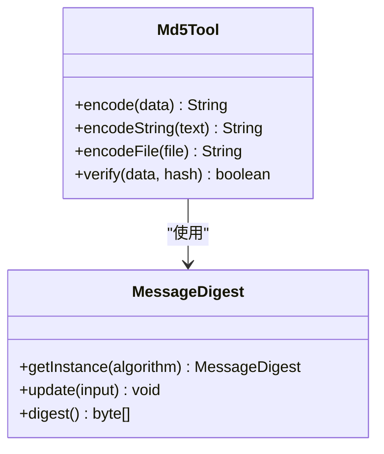

**图表来源**
- [Md5Tool.java:1-200](file://sh-tool/src/main/java/com/wkclz/tool/tools/Md5Tool.java#L1-L200)

#### SHA 工具 (ShaTool)
SHA 系列算法提供更强的安全性。

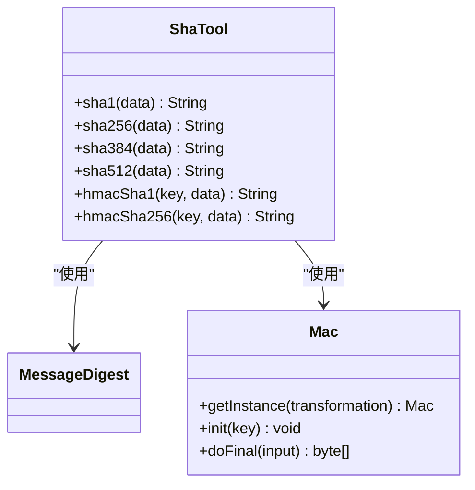

**图表来源**
- [ShaTool.java:1-200](file://sh-tool/src/main/java/com/wkclz/tool/tools/ShaTool.java#L1-L200)

**章节来源**
- [Md5Tool.java:1-200](file://sh-tool/src/main/java/com/wkclz/tool/tools/Md5Tool.java#L1-L200)
- [ShaTool.java:1-200](file://sh-tool/src/main/java/com/wkclz/tool/tools/ShaTool.java#L1-L200)

### Base64 编码工具 (Base64Tool)
Base64 是一种常用的编码方式，用于将二进制数据转换为 ASCII 字符串。

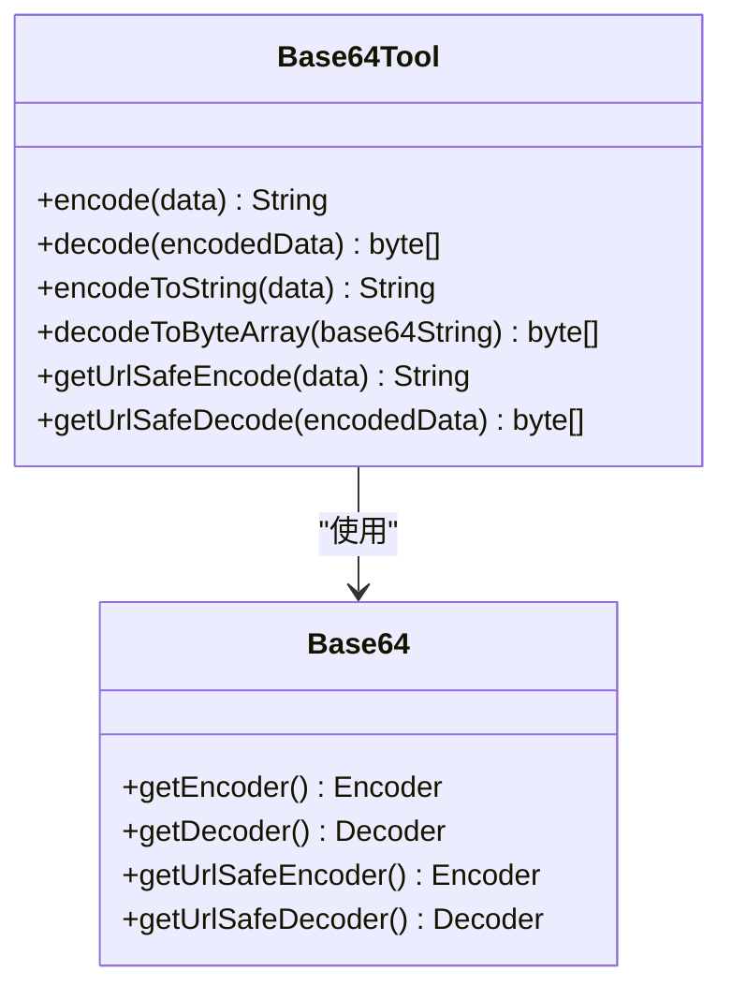

**图表来源**
- [Base64Tool.java:1-200](file://sh-tool/src/main/java/com/wkclz/tool/tools/Base64Tool.java#L1-L200)

**章节来源**
- [Base64Tool.java:1-200](file://sh-tool/src/main/java/com/wkclz/tool/tools/Base64Tool.java#L1-L200)

### 正则表达式工具 (RegularTool)
正则表达式工具提供了强大的文本模式匹配和处理能力。

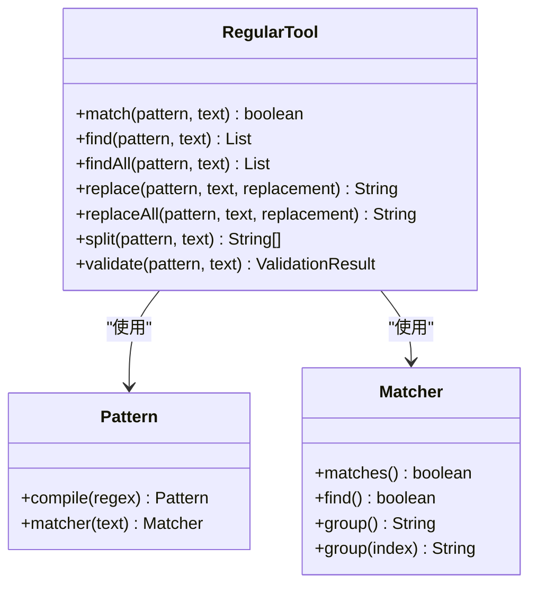

**图表来源**
- [RegularTool.java:1-200](file://sh-tool/src/main/java/com/wkclz/tool/tools/RegularTool.java#L1-L200)

#### 核心功能
- 模式匹配验证
- 文本查找和提取
- 文本替换和清理
- 分割和解析
- 结果验证和处理

**章节来源**
- [RegularTool.java:1-200](file://sh-tool/src/main/java/com/wkclz/tool/tools/RegularTool.java#L1-L200)

### 安全辅助工具

#### 密码强度验证 (CheckPwdUtil)
密码强度验证工具确保用户密码符合安全要求。

```mermaid
classDiagram
class CheckPwdUtil {
+validateStrength(password) PasswordValidationResult
+checkCommonPatterns(password) boolean
+calculateEntropy(password) double
+suggestImprovements(password) List<String>
}
class PasswordValidationResult {
+isValid() boolean
+getScore() int
+getStrengthLevel() StrengthLevel
+getIssues() List<String>
}
enum StrengthLevel {
WEAK,
FAIR,
GOOD,
STRONG,
VERY_STRONG
}
CheckPwdUtil --> PasswordValidationResult : "返回"
PasswordValidationResult --> StrengthLevel : "包含"
```

**图表来源**
- [CheckPwdUtil.java:1-200](file://sh-tool/src/main/java/com/wkclz/tool/utils/CheckPwdUtil.java#L1-L200)

#### 密钥管理 (SecretUtil)
密钥管理工具提供安全的密钥生成和管理功能。

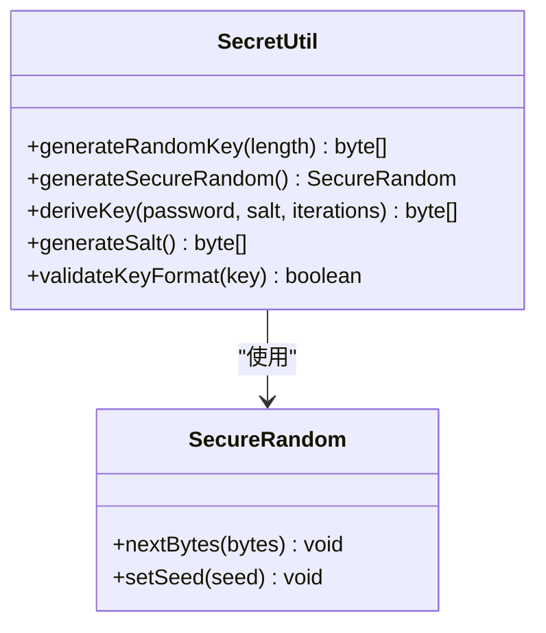

**图表来源**
- [SecretUtil.java:1-200](file://sh-tool/src/main/java/com/wkclz/tool/utils/SecretUtil.java#L1-L200)

**章节来源**
- [CheckPwdUtil.java:1-200](file://sh-tool/src/main/java/com/wkclz/tool/utils/CheckPwdUtil.java#L1-L200)
- [SecretUtil.java:1-200](file://sh-tool/src/main/java/com/wkclz/tool/utils/SecretUtil.java#L1-L200)

## 依赖关系分析

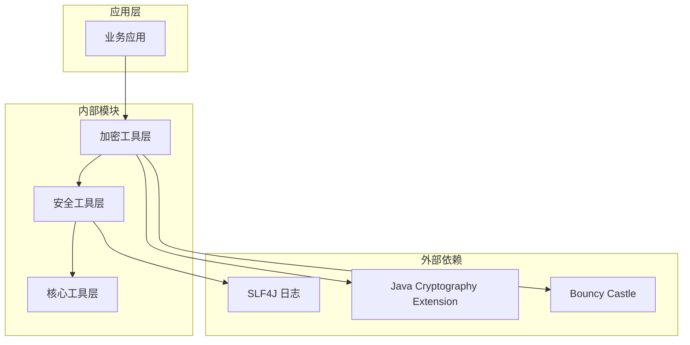

**图表来源**
- [pom.xml:1-100](file://sh-tool/pom.xml#L1-L100)

### 外部依赖
- **JCE**: Java 标准加密扩展，提供基础加密算法支持
- **Bouncy Castle**: 第三方加密库，提供额外的加密算法和功能
- **SLF4J**: 轻量级日志框架，用于安全事件记录

**章节来源**
- [pom.xml:1-100](file://sh-tool/pom.xml#L1-L100)

## 性能考虑

### 加密算法性能对比

| 算法类型 | 加密速度 | 解密速度 | 密钥长度 | 安全性等级 |
|---------|----------|----------|----------|------------|
| AES     | ⭐⭐⭐⭐⭐ | ⭐⭐⭐⭐⭐ | 128/192/256 | ⭐⭐⭐⭐⭐ |
| RSA     | ⭐⭐ | ⭐⭐⭐ | 1024/2048/4096 | ⭐⭐⭐⭐ |
| DES     | ⭐⭐⭐⭐⭐ | ⭐⭐⭐⭐⭐ | 56 | ⭐ |
| MD5     | ⭐⭐⭐⭐⭐ | ⭐⭐⭐⭐⭐ | 128 | ⭐ |
| SHA-256 | ⭐⭐⭐⭐ | ⭐⭐⭐⭐ | 256 | ⭐⭐⭐⭐ |

### 性能优化建议

1. **批量处理优化**
   - 对于大量数据处理，使用流式处理减少内存占用
   - 合理设置缓冲区大小，避免频繁的内存分配

2. **算法选择策略**
   - 小数据量：优先选择 AES
   - 大数据量：考虑分块加密
   - 数字签名：使用 RSA 或 ECDSA

3. **缓存策略**
   - 缓存常用的密钥和算法实例
   - 避免重复的密钥派生操作

## 故障排除指南

### 常见问题及解决方案

#### 1. 密钥长度错误
**问题**: 密钥长度不符合算法要求
**解决方案**: 
- 检查密钥生成过程
- 确保密钥长度与算法规格匹配

#### 2. 填充模式错误
**问题**: 加密或解密过程中出现填充错误
**解决方案**:
- 确保加密和解密使用相同的填充模式
- 检查数据边界和完整性

#### 3. 性能问题
**问题**: 加密操作耗时过长
**解决方案**:
- 优化算法选择和参数配置
- 实施适当的缓存策略
- 考虑并行处理方案

#### 4. 安全漏洞检测
**问题**: 发现潜在的安全漏洞
**解决方案**:
- 定期更新加密库版本
- 实施安全审计流程
- 配置适当的日志监控

**章节来源**
- [CheckPwdUtil.java:1-200](file://sh-tool/src/main/java/com/wkclz/tool/utils/CheckPwdUtil.java#L1-L200)
- [SecretUtil.java:1-200](file://sh-tool/src/main/java/com/wkclz/tool/utils/SecretUtil.java#L1-L200)

## 结论
本安全加密工具集提供了企业级应用所需的核心加密功能，涵盖了从基础的对称加密到复杂的数字签名验证。通过模块化的架构设计和完善的错误处理机制，该工具集能够满足各种安全应用场景的需求。

### 主要优势
1. **功能完整**: 涵盖了主流的加密算法和安全工具
2. **易于使用**: 提供简洁的 API 接口和丰富的使用示例
3. **性能优化**: 采用高效的算法实现和优化策略
4. **安全可靠**: 遵循最佳安全实践，提供完整的安全保证

### 最佳实践建议
1. **算法选择**: 根据具体需求选择合适的加密算法
2. **密钥管理**: 实施严格的密钥生命周期管理
3. **性能监控**: 定期评估和优化加密性能
4. **安全审计**: 建立完善的安全审计和监控机制

## 附录

### 安全应用场景示例

#### 1. 密码验证流程
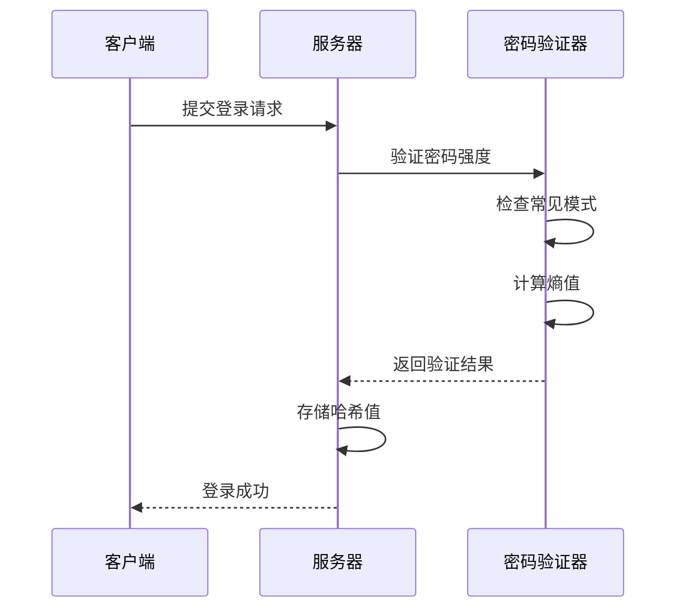

#### 2. 数据加密流程
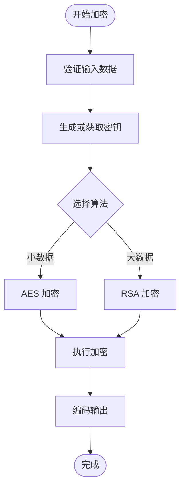

#### 3. 数字签名验证流程
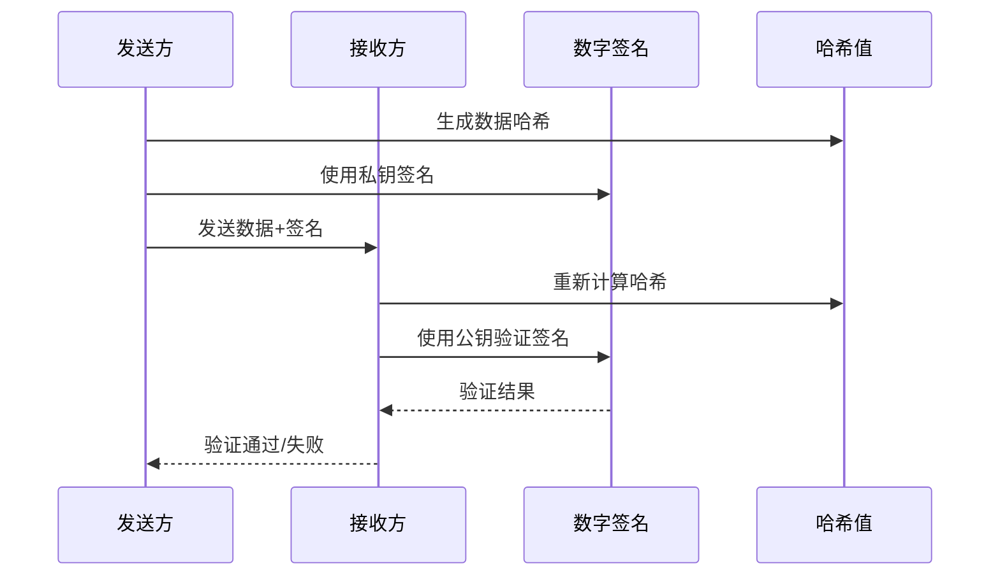

### 安全最佳实践清单

#### 密钥管理
- 使用足够长度的随机密钥
- 定期轮换密钥
- 安全存储密钥材料
- 实施密钥备份和恢复机制

#### 算法选择
- 优先使用经过验证的标准算法
- 避免使用已知不安全的算法
- 跟踪算法安全状态
- 及时更新过时的算法实现

#### 错误处理
- 实施适当的错误信息屏蔽
- 记录必要的安全事件
- 避免泄露敏感信息
- 建立应急响应机制

#### 性能优化
- 选择合适的算法参数
- 实施缓存策略
- 优化内存使用
- 监控系统性能指标