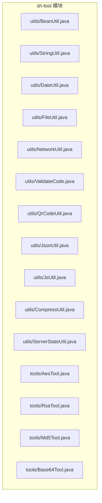
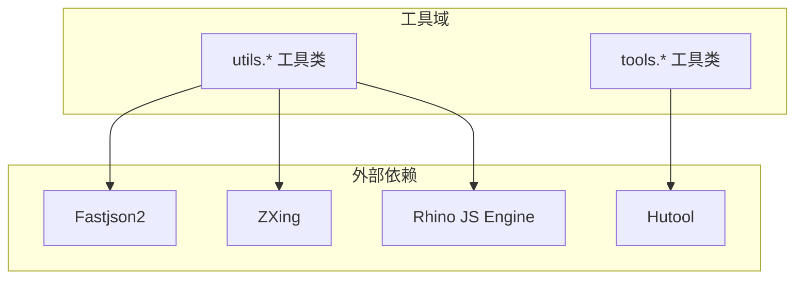
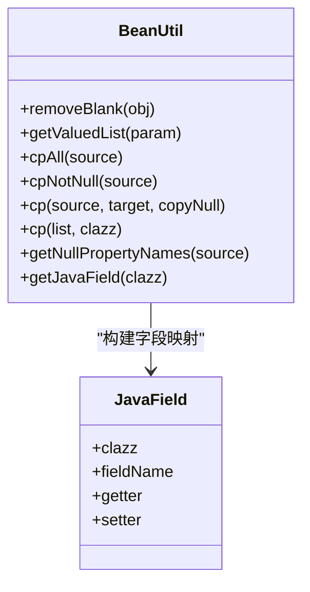
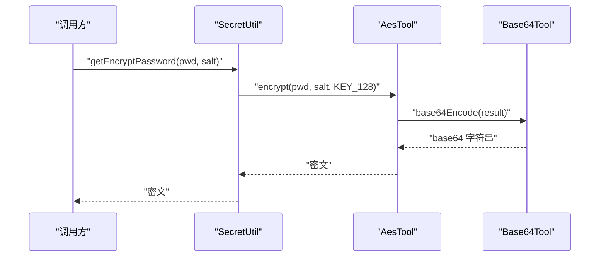
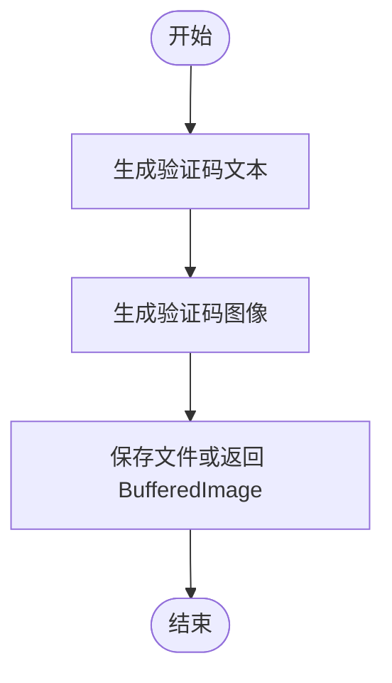
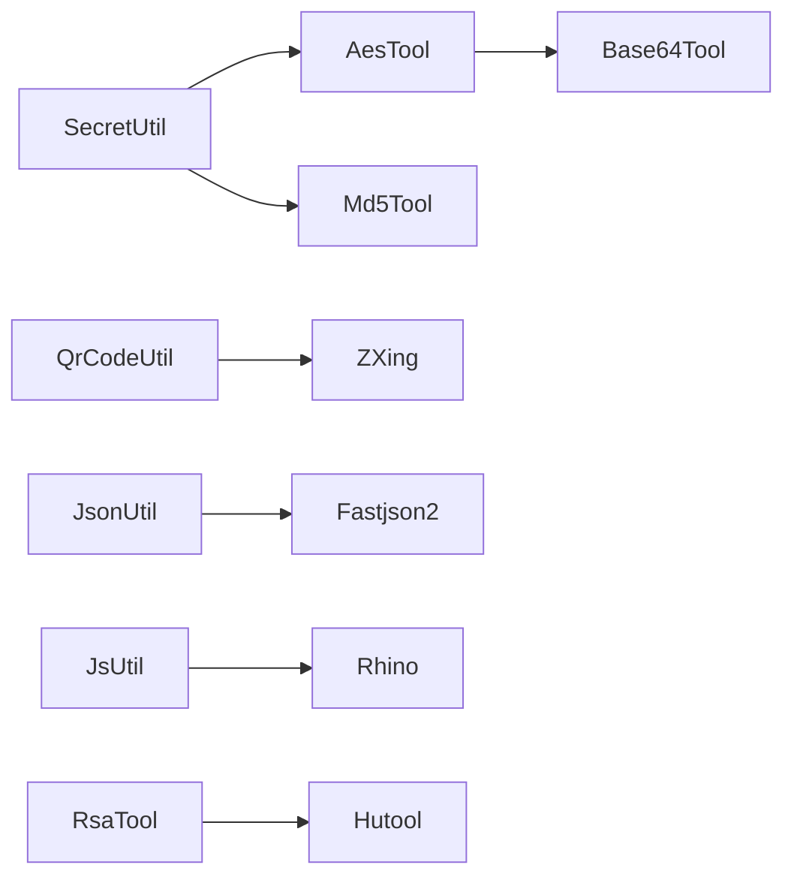

# 工具模块（sh-tool）

<cite>
**本文引用的文件**
- [StringUtil.java](file://sh-tool/src/main/java/com/wkclz/tool/utils/StringUtil.java)
- [BeanUtil.java](file://sh-tool/src/main/java/com/wkclz/tool/utils/BeanUtil.java)
- [DateUtil.java](file://sh-tool/src/main/java/com/wkclz/tool/utils/DateUtil.java)
- [FileUtil.java](file://sh-tool/src/main/java/com/wkclz/tool/utils/FileUtil.java)
- [NetworkUtil.java](file://sh-tool/src/main/java/com/wkclz/tool/utils/NetworkUtil.java)
- [AesTool.java](file://sh-tool/src/main/java/com/wkclz/tool/tools/AesTool.java)
- [RsaTool.java](file://sh-tool/src/main/java/com/wkclz/tool/tools/RsaTool.java)
- [Md5Tool.java](file://sh-tool/src/main/java/com/wkclz/tool/tools/Md5Tool.java)
- [Base64Tool.java](file://sh-tool/src/main/java/com/wkclz/tool/tools/Base64Tool.java)
- [ValidateCode.java](file://sh-tool/src/main/java/com/wkclz/tool/utils/ValidateCode.java)
- [QrCodeUtil.java](file://sh-tool/src/main/java/com/wkclz/tool/utils/QrCodeUtil.java)
- [SecretUtil.java](file://sh-tool/src/main/java/com/wkclz/tool/utils/SecretUtil.java)
- [JsonUtil.java](file://sh-tool/src/main/java/com/wkclz/tool/utils/JsonUtil.java)
- [JsUtil.java](file://sh-tool/src/main/java/com/wkclz/tool/utils/JsUtil.java)
- [CompressUtil.java](file://sh-tool/src/main/java/com/wkclz/tool/utils/CompressUtil.java)
- [ServerStateUtil.java](file://sh-tool/src/main/java/com/wkclz/tool/utils/ServerStateUtil.java)
</cite>

## 目录
1. [简介](#简介)
2. [项目结构](#项目结构)
3. [核心组件](#核心组件)
4. [架构总览](#架构总览)
5. [详细组件分析](#详细组件分析)
6. [依赖分析](#依赖分析)
7. [性能考虑](#性能考虑)
8. [故障排查指南](#故障排查指南)
9. [结论](#结论)
10. [附录](#附录)

## 简介
本文件为 sh-tool 工具模块的全面实用指南，覆盖字符串格式化、Bean 操作、日期时间、文件 IO、网络工具、加密工具集、综合工具集（正则、验证码、二维码）等能力，并提供使用要点与性能优化建议。文档面向不同技术背景读者，既提供高层概览也包含代码级分析与可视化。

## 项目结构
sh-tool 模块位于 sh-tool 子工程中，采用按功能域划分的包结构：
- utils：通用工具类集合（字符串、Bean、日期、文件、网络、验证码、二维码、JSON、JS、压缩、服务器状态等）
- tools：加密算法工具（AES、RSA、MD5、Base64 等）

**图表来源**
- [BeanUtil.java:1-293](file://sh-tool/src/main/java/com/wkclz/tool/utils/BeanUtil.java#L1-L293)
- [StringUtil.java:1-167](file://sh-tool/src/main/java/com/wkclz/tool/utils/StringUtil.java#L1-L167)
- [DateUtil.java:1-132](file://sh-tool/src/main/java/com/wkclz/tool/utils/DateUtil.java#L1-L132)
- [FileUtil.java:1-168](file://sh-tool/src/main/java/com/wkclz/tool/utils/FileUtil.java#L1-L168)
- [NetworkUtil.java:1-154](file://sh-tool/src/main/java/com/wkclz/tool/utils/NetworkUtil.java#L1-L154)
- [ValidateCode.java:1-262](file://sh-tool/src/main/java/com/wkclz/tool/utils/ValidateCode.java#L1-L262)
- [QrCodeUtil.java:1-134](file://sh-tool/src/main/java/com/wkclz/tool/utils/QrCodeUtil.java#L1-L134)
- [JsonUtil.java:1-144](file://sh-tool/src/main/java/com/wkclz/tool/utils/JsonUtil.java#L1-L144)
- [JsUtil.java:1-94](file://sh-tool/src/main/java/com/wkclz/tool/utils/JsUtil.java#L1-L94)
- [CompressUtil.java:1-185](file://sh-tool/src/main/java/com/wkclz/tool/utils/CompressUtil.java#L1-L185)
- [ServerStateUtil.java:1-218](file://sh-tool/src/main/java/com/wkclz/tool/utils/ServerStateUtil.java#L1-L218)
- [AesTool.java:1-92](file://sh-tool/src/main/java/com/wkclz/tool/tools/AesTool.java#L1-L92)
- [RsaTool.java:1-127](file://sh-tool/src/main/java/com/wkclz/tool/tools/RsaTool.java#L1-L127)
- [Md5Tool.java](file://sh-tool/src/main/java/com/wkclz/tool/tools/Md5Tool.java)
- [Base64Tool.java](file://sh-tool/src/main/java/com/wkclz/tool/tools/Base64Tool.java)

**章节来源**
- [BeanUtil.java:1-293](file://sh-tool/src/main/java/com/wkclz/tool/utils/BeanUtil.java#L1-L293)
- [StringUtil.java:1-167](file://sh-tool/src/main/java/com/wkclz/tool/utils/StringUtil.java#L1-L167)
- [DateUtil.java:1-132](file://sh-tool/src/main/java/com/wkclz/tool/utils/DateUtil.java#L1-L132)
- [FileUtil.java:1-168](file://sh-tool/src/main/java/com/wkclz/tool/utils/FileUtil.java#L1-L168)
- [NetworkUtil.java:1-154](file://sh-tool/src/main/java/com/wkclz/tool/utils/NetworkUtil.java#L1-L154)
- [ValidateCode.java:1-262](file://sh-tool/src/main/java/com/wkclz/tool/utils/ValidateCode.java#L1-L262)
- [QrCodeUtil.java:1-134](file://sh-tool/src/main/java/com/wkclz/tool/utils/QrCodeUtil.java#L1-L134)
- [JsonUtil.java:1-144](file://sh-tool/src/main/java/com/wkclz/tool/utils/JsonUtil.java#L1-L144)
- [JsUtil.java:1-94](file://sh-tool/src/main/java/com/wkclz/tool/utils/JsUtil.java#L1-L94)
- [CompressUtil.java:1-185](file://sh-tool/src/main/java/com/wkclz/tool/utils/CompressUtil.java#L1-L185)
- [ServerStateUtil.java:1-218](file://sh-tool/src/main/java/com/wkclz/tool/utils/ServerStateUtil.java#L1-L218)
- [AesTool.java:1-92](file://sh-tool/src/main/java/com/wkclz/tool/tools/AesTool.java#L1-L92)
- [RsaTool.java:1-127](file://sh-tool/src/main/java/com/wkclz/tool/tools/RsaTool.java#L1-L127)
- [Md5Tool.java](file://sh-tool/src/main/java/com/wkclz/tool/tools/Md5Tool.java)
- [Base64Tool.java](file://sh-tool/src/main/java/com/wkclz/tool/tools/Base64Tool.java)

## 核心组件
- 字符串格式化工具：提供驼峰与下划线互转、首字母大小写转换、变量字符串解析、大小写规范化、特殊字符清理等。
- Bean 操作工具：基于反射的属性拷贝、空值剔除、属性名提取、实体字段映射缓存、列表批量复制等。
- 日期时间工具：日期字符串解析、当日起始时间、相对时间差描述（天/时/分/秒）。
- 文件操作工具：临时目录定位、文件读写、删除、大小格式化、递归遍历。
- 网络工具：本机 IPv4 地址获取、网卡信息枚举、内网地址判断。
- 加密工具集：AES 对称加密、RSA 非对称加密、MD5 哈希、Base64 编解码、密码加解密门面。
- 综合工具集：验证码生成（文本与图像）、二维码/条形码生成（含小程序链接直读）、JSON 格式化与读写、JS 脚本执行、文件压缩/解压、服务器状态采集（JMX）。

**章节来源**
- [StringUtil.java:15-167](file://sh-tool/src/main/java/com/wkclz/tool/utils/StringUtil.java#L15-L167)
- [BeanUtil.java:26-293](file://sh-tool/src/main/java/com/wkclz/tool/utils/BeanUtil.java#L26-L293)
- [DateUtil.java:18-132](file://sh-tool/src/main/java/com/wkclz/tool/utils/DateUtil.java#L18-L132)
- [FileUtil.java:12-168](file://sh-tool/src/main/java/com/wkclz/tool/utils/FileUtil.java#L12-L168)
- [NetworkUtil.java:11-154](file://sh-tool/src/main/java/com/wkclz/tool/utils/NetworkUtil.java#L11-L154)
- [AesTool.java:11-92](file://sh-tool/src/main/java/com/wkclz/tool/tools/AesTool.java#L11-L92)
- [RsaTool.java:13-127](file://sh-tool/src/main/java/com/wkclz/tool/tools/RsaTool.java#L13-L127)
- [ValidateCode.java:11-262](file://sh-tool/src/main/java/com/wkclz/tool/utils/ValidateCode.java#L11-L262)
- [QrCodeUtil.java:30-134](file://sh-tool/src/main/java/com/wkclz/tool/utils/QrCodeUtil.java#L30-L134)
- [JsonUtil.java:14-144](file://sh-tool/src/main/java/com/wkclz/tool/utils/JsonUtil.java#L14-L144)
- [JsUtil.java:11-94](file://sh-tool/src/main/java/com/wkclz/tool/utils/JsUtil.java#L11-L94)
- [CompressUtil.java:22-185](file://sh-tool/src/main/java/com/wkclz/tool/utils/CompressUtil.java#L22-L185)
- [ServerStateUtil.java:18-218](file://sh-tool/src/main/java/com/wkclz/tool/utils/ServerStateUtil.java#L18-L218)

## 架构总览
整体采用“工具域分层”设计，utils 与 tools 分离职责：utils 负责通用数据处理与系统能力封装，tools 负责加密算法实现。各工具类通过明确的静态方法暴露能力，便于跨模块复用。

**图表来源**
- [JsonUtil.java:3](file://sh-tool/src/main/java/com/wkclz/tool/utils/JsonUtil.java#L3)
- [QrCodeUtil.java:3-14](file://sh-tool/src/main/java/com/wkclz/tool/utils/QrCodeUtil.java#L3-L14)
- [RsaTool.java:3-6](file://sh-tool/src/main/java/com/wkclz/tool/tools/RsaTool.java#L3-L6)
- [JsUtil.java:5-7](file://sh-tool/src/main/java/com/wkclz/tool/utils/JsUtil.java#L5-L7)

## 详细组件分析

### 字符串格式化工具（StringUtil）
- 功能要点
  - 驼峰与下划线互转：支持空值保护与边界处理。
  - 首字母大小写转换：针对空值与空串的安全处理。
  - 变量字符串解析：按分隔符拆分并解析键值对。
  - 大小写规范化：递归替换指定子串为小写。
  - 特殊字符清理：统一空白字符，合并多余空格。
- 性能与健壮性
  - 使用 StringBuilder 进行拼接，避免重复字符串对象。
  - 正则模式预编译，减少重复开销。
- 使用示例（路径参考）
  - [驼峰转下划线:77-95](file://sh-tool/src/main/java/com/wkclz/tool/utils/StringUtil.java#L77-L95)
  - [变量解析为 Map:104-119](file://sh-tool/src/main/java/com/wkclz/tool/utils/StringUtil.java#L104-L119)
  - [大小写规范化:129-140](file://sh-tool/src/main/java/com/wkclz/tool/utils/StringUtil.java#L129-L140)

**章节来源**
- [StringUtil.java:15-167](file://sh-tool/src/main/java/com/wkclz/tool/utils/StringUtil.java#L15-L167)

### Bean 操作工具（BeanUtil）
- 功能要点
  - 属性拷贝：支持全量与非空拷贝，内部使用 BeanWrapper 与 Spring BeanUtils。
  - 空值剔除：遍历属性，将 trim 后为空的值置空。
  - 属性名提取：获取非空属性对应的 getter 列表。
  - 反射缓存：缓存 PropertyDescriptor、实体字段、方法映射，降低反射成本。
  - 列表复制：批量实例化目标类型并复制属性。
- 设计模式
  - 反射 + 缓存：通过 ConcurrentHashMap 缓存元数据，提升重复调用性能。
  - 泛型与异常处理：统一捕获反射异常并记录日志。
- 使用示例（路径参考）
  - [Bean 全量拷贝:106-127](file://sh-tool/src/main/java/com/wkclz/tool/utils/BeanUtil.java#L106-L127)
  - [Bean 非空拷贝:110-112](file://sh-tool/src/main/java/com/wkclz/tool/utils/BeanUtil.java#L110-L112)
  - [列表复制:177-196](file://sh-tool/src/main/java/com/wkclz/tool/utils/BeanUtil.java#L177-L196)
  - [空值剔除:38-56](file://sh-tool/src/main/java/com/wkclz/tool/utils/BeanUtil.java#L38-L56)

**图表来源**
- [BeanUtil.java:26-293](file://sh-tool/src/main/java/com/wkclz/tool/utils/BeanUtil.java#L26-L293)
- [JavaField.java](file://sh-tool/src/main/java/com/wkclz/tool/bean/JavaField.java)

**章节来源**
- [BeanUtil.java:26-293](file://sh-tool/src/main/java/com/wkclz/tool/utils/BeanUtil.java#L26-L293)

### 日期时间工具（DateUtil）
- 功能要点
  - 字符串解析：自动识别 yyyy-MM-dd 与 yyyy-MM-dd HH:mm:ss，补齐默认时间。
  - 当日开始：将当前日期归零至当日 00:00:00。
  - 相对时间差：计算历史到未来或当前的时间差，输出天/时/分/秒组合描述。
- 使用示例（路径参考）
  - [日期解析:36-52](file://sh-tool/src/main/java/com/wkclz/tool/utils/DateUtil.java#L36-L52)
  - [当日起始:56-63](file://sh-tool/src/main/java/com/wkclz/tool/utils/DateUtil.java#L56-L63)
  - [时间差描述:69-128](file://sh-tool/src/main/java/com/wkclz/tool/utils/DateUtil.java#L69-L128)

**章节来源**
- [DateUtil.java:18-132](file://sh-tool/src/main/java/com/wkclz/tool/utils/DateUtil.java#L18-L132)

### 文件操作工具（FileUtil）
- 功能要点
  - 临时目录：根据系统属性 user.dir 定位 tmp 目录，支持自定义子路径。
  - 递归遍历：遍历目录树，收集文件绝对路径。
  - 读写文件：读取文本内容、创建新文件并写入。
  - 删除文件：支持递归删除目录及其子项。
  - 大小格式化：B/K/M/G 自动换算与保留两位小数。
- 使用示例（路径参考）
  - [临时目录路径:21-40](file://sh-tool/src/main/java/com/wkclz/tool/utils/FileUtil.java#L21-L40)
  - [文件读取:75-96](file://sh-tool/src/main/java/com/wkclz/tool/utils/FileUtil.java#L75-L96)
  - [文件写入:98-118](file://sh-tool/src/main/java/com/wkclz/tool/utils/FileUtil.java#L98-L118)
  - [文件删除:121-143](file://sh-tool/src/main/java/com/wkclz/tool/utils/FileUtil.java#L121-L143)
  - [大小格式化:151-164](file://sh-tool/src/main/java/com/wkclz/tool/utils/FileUtil.java#L151-L164)

**章节来源**
- [FileUtil.java:12-168](file://sh-tool/src/main/java/com/wkclz/tool/utils/FileUtil.java#L12-L168)

### 网络工具（NetworkUtil）
- 功能要点
  - 本机 IPv4 地址：枚举网卡与地址，过滤回环与 docker 接口，返回首个可用地址。
  - 网卡信息：收集接口名称、显示名、主机地址、可达性、各类地址标识等。
  - 内网地址判断：支持 IPv4 私有/链路本地、IPv6 链路本地/ULA。
- 使用示例（路径参考）
  - [获取本机 IP:13-53](file://sh-tool/src/main/java/com/wkclz/tool/utils/NetworkUtil.java#L13-L53)
  - [获取所有 IP 列表:55-99](file://sh-tool/src/main/java/com/wkclz/tool/utils/NetworkUtil.java#L55-L99)
  - [内网地址判断:102-129](file://sh-tool/src/main/java/com/wkclz/tool/utils/NetworkUtil.java#L102-L129)

**章节来源**
- [NetworkUtil.java:11-154](file://sh-tool/src/main/java/com/wkclz/tool/utils/NetworkUtil.java#L11-L154)

### 加密工具集
- AES 工具（AesTool）
  - 支持 128/192/256 位密钥长度，默认 128。
  - 基于 SHA1PRNG 初始化随机种子，使用 ECB/PKCS5Padding。
  - 与 Base64Tool 协作进行编码/解码。
  - 使用示例（路径参考）
    - [加密:21-36](file://sh-tool/src/main/java/com/wkclz/tool/tools/AesTool.java#L21-L36)
    - [解密:42-57](file://sh-tool/src/main/java/com/wkclz/tool/tools/AesTool.java#L42-L57)
- RSA 工具（RsaTool）
  - 支持 1024/2048/4096 位密钥生成，返回 Base64 编码的公私钥。
  - 提供公钥加密/私钥解密、私钥加密/公钥解密。
  - 支持将 PEM 私钥字符串转换为私钥对象。
  - 使用示例（路径参考）
    - [生成密钥对:15-46](file://sh-tool/src/main/java/com/wkclz/tool/tools/RsaTool.java#L15-L46)
    - [公钥加密:60-64](file://sh-tool/src/main/java/com/wkclz/tool/tools/RsaTool.java#L60-L64)
    - [私钥解密:66-69](file://sh-tool/src/main/java/com/wkclz/tool/tools/RsaTool.java#L66-L69)
- MD5 工具（Md5Tool）
  - 提供 MD5 哈希能力，配合 SecretUtil 生成密钥。
- Base64 工具（Base64Tool）
  - 提供 Base64 编解码能力，被 AES/RSA/二维码等广泛使用。

**图表来源**
- [SecretUtil.java:59-92](file://sh-tool/src/main/java/com/wkclz/tool/utils/SecretUtil.java#L59-L92)
- [AesTool.java:21-36](file://sh-tool/src/main/java/com/wkclz/tool/tools/AesTool.java#L21-L36)
- [Base64Tool.java](file://sh-tool/src/main/java/com/wkclz/tool/tools/Base64Tool.java)

**章节来源**
- [AesTool.java:11-92](file://sh-tool/src/main/java/com/wkclz/tool/tools/AesTool.java#L11-L92)
- [RsaTool.java:13-127](file://sh-tool/src/main/java/com/wkclz/tool/tools/RsaTool.java#L13-L127)
- [Md5Tool.java](file://sh-tool/src/main/java/com/wkclz/tool/tools/Md5Tool.java)
- [Base64Tool.java](file://sh-tool/src/main/java/com/wkclz/tool/tools/Base64Tool.java)
- [SecretUtil.java:15-156](file://sh-tool/src/main/java/com/wkclz/tool/utils/SecretUtil.java#L15-L156)

### 综合工具集
- 验证码（ValidateCode）
  - 支持纯数字、纯字母、混合类型，可排除特定字符。
  - 支持生成文本验证码与图像验证码（带干扰线、字体颜色可配）。
  - 使用示例（路径参考）
    - [生成文本验证码:62-157](file://sh-tool/src/main/java/com/wkclz/tool/utils/ValidateCode.java#L62-L157)
    - [生成图像验证码:172-222](file://sh-tool/src/main/java/com/wkclz/tool/utils/ValidateCode.java#L172-L222)
- 二维码（QrCodeUtil）
  - 支持二维码与条形码生成，输出 BufferedImage 或 Base64。
  - 支持直接读取远程 URL 并转 Base64。
  - 使用示例（路径参考）
    - [生成二维码 Base64:41-44](file://sh-tool/src/main/java/com/wkclz/tool/utils/QrCodeUtil.java#L41-L44)
    - [生成条形码 Base64:52-55](file://sh-tool/src/main/java/com/wkclz/tool/utils/QrCodeUtil.java#L52-L55)
    - [远程 URL 转 Base64:64-83](file://sh-tool/src/main/java/com/wkclz/tool/utils/QrCodeUtil.java#L64-L83)
- JSON 工具（JsonUtil）
  - 读取 JSON 文件并反序列化，写入 JSON 文件并格式化。
  - 使用示例（路径参考）
    - [读取 JSON:26-33](file://sh-tool/src/main/java/com/wkclz/tool/utils/JsonUtil.java#L26-L33)
    - [写入 JSON:40-59](file://sh-tool/src/main/java/com/wkclz/tool/utils/JsonUtil.java#L40-L59)
- JS 执行（JsUtil）
  - 基于 Rhino 引擎执行传入的 JavaScript 函数，支持参数 Map/JSONObject/字符串。
  - 使用示例（路径参考）
    - [执行 JS:18-44](file://sh-tool/src/main/java/com/wkclz/tool/utils/JsUtil.java#L18-L44)
- 压缩工具（CompressUtil）
  - ZIP 压缩与解压，支持保留目录结构，防止 ZipSlip。
  - 使用示例（路径参考）
    - [压缩目录:35-58](file://sh-tool/src/main/java/com/wkclz/tool/utils/CompressUtil.java#L35-L58)
    - [解压文件:131-181](file://sh-tool/src/main/java/com/wkclz/tool/utils/CompressUtil.java#L131-L181)
- 服务器状态（ServerStateUtil）
  - 采集类加载、编译、操作系统、平台 MBean、运行时、线程、内存、GC、内存池、磁盘等信息。
  - 使用示例（路径参考）
    - [操作系统信息:39-62](file://sh-tool/src/main/java/com/wkclz/tool/utils/ServerStateUtil.java#L39-L62)
    - [磁盘信息:202-215](file://sh-tool/src/main/java/com/wkclz/tool/utils/ServerStateUtil.java#L202-L215)

**图表来源**
- [ValidateCode.java:172-222](file://sh-tool/src/main/java/com/wkclz/tool/utils/ValidateCode.java#L172-L222)

**章节来源**
- [ValidateCode.java:11-262](file://sh-tool/src/main/java/com/wkclz/tool/utils/ValidateCode.java#L11-L262)
- [QrCodeUtil.java:30-134](file://sh-tool/src/main/java/com/wkclz/tool/utils/QrCodeUtil.java#L30-L134)
- [JsonUtil.java:14-144](file://sh-tool/src/main/java/com/wkclz/tool/utils/JsonUtil.java#L14-L144)
- [JsUtil.java:11-94](file://sh-tool/src/main/java/com/wkclz/tool/utils/JsUtil.java#L11-L94)
- [CompressUtil.java:22-185](file://sh-tool/src/main/java/com/wkclz/tool/utils/CompressUtil.java#L22-L185)
- [ServerStateUtil.java:18-218](file://sh-tool/src/main/java/com/wkclz/tool/utils/ServerStateUtil.java#L18-L218)

## 依赖分析
- 内部依赖
  - SecretUtil 依赖 AesTool 与 Md5Tool，形成密码加解密门面。
  - AesTool 依赖 Base64Tool 进行编码。
  - QrCodeUtil 依赖 ZXing 生成二维码/条形码。
  - JsonUtil 依赖 Fastjson2 进行序列化与反序列化。
  - JsUtil 依赖 Rhino JS 引擎执行脚本。
  - RsaTool 依赖 Hutool 的 RSA 实现。
- 外部依赖
  - Fastjson2、ZXing、Hutool、Rhino JS Engine。

**图表来源**
- [SecretUtil.java:3-10](file://sh-tool/src/main/java/com/wkclz/tool/utils/SecretUtil.java#L3-L10)
- [AesTool.java:3-10](file://sh-tool/src/main/java/com/wkclz/tool/tools/AesTool.java#L3-L10)
- [QrCodeUtil.java:3-24](file://sh-tool/src/main/java/com/wkclz/tool/utils/QrCodeUtil.java#L3-L24)
- [JsonUtil.java:3-12](file://sh-tool/src/main/java/com/wkclz/tool/utils/JsonUtil.java#L3-L12)
- [JsUtil.java:5-9](file://sh-tool/src/main/java/com/wkclz/tool/utils/JsUtil.java#L5-L9)
- [RsaTool.java:3-11](file://sh-tool/src/main/java/com/wkclz/tool/tools/RsaTool.java#L3-L11)

**章节来源**
- [SecretUtil.java:15-156](file://sh-tool/src/main/java/com/wkclz/tool/utils/SecretUtil.java#L15-L156)
- [AesTool.java:11-92](file://sh-tool/src/main/java/com/wkclz/tool/tools/AesTool.java#L11-L92)
- [QrCodeUtil.java:30-134](file://sh-tool/src/main/java/com/wkclz/tool/utils/QrCodeUtil.java#L30-L134)
- [JsonUtil.java:14-144](file://sh-tool/src/main/java/com/wkclz/tool/utils/JsonUtil.java#L14-L144)
- [JsUtil.java:11-94](file://sh-tool/src/main/java/com/wkclz/tool/utils/JsUtil.java#L11-L94)
- [RsaTool.java:13-127](file://sh-tool/src/main/java/com/wkclz/tool/tools/RsaTool.java#L13-L127)

## 性能考虑
- 反射与缓存
  - BeanUtil 对 PropertyDescriptor、实体字段、方法映射进行缓存，避免重复反射开销。
  - 建议：在高频场景下复用同一类型对象，减少缓存抖动。
- 字符串处理
  - StringUtil 使用 StringBuilder 与预编译正则，避免频繁字符串拼接与重复编译。
- IO 与压缩
  - FileUtil 与 CompressUtil 使用缓冲区与流式处理，建议在大文件场景下设置合适的缓冲大小。
  - 压缩时启用“保留目录结构”可避免同名文件冲突。
- 加密
  - AesTool 默认使用 SHA1PRNG 初始化种子，建议在生产环境使用更安全的密钥管理方案。
  - RSA 密钥长度建议使用 2048/4096 位，兼顾安全性与性能。
- JS 执行
  - JsUtil 对函数进行 MD5 哈希缓存，避免重复编译脚本；建议控制脚本复杂度与执行频率。

[本节为通用指导，无需列出具体文件来源]

## 故障排查指南
- Bean 拷贝异常
  - 现象：拷贝过程中抛出反射异常。
  - 排查：确认源对象与目标对象属性匹配、目标类具备无参构造函数。
  - 参考：[BeanUtil.cpAll:106-127](file://sh-tool/src/main/java/com/wkclz/tool/utils/BeanUtil.java#L106-L127)
- 文件读写失败
  - 现象：读取/写入文件抛出异常。
  - 排查：检查文件路径、权限、是否存在；FileUtil 在写入前会检查文件是否已存在。
  - 参考：[FileUtil.writeFile:98-118](file://sh-tool/src/main/java/com/wkclz/tool/utils/FileUtil.java#L98-L118)
- 压缩解压异常
  - 现象：解压时报“Zip entry outside target dir”。
  - 排查：确保解压路径规范化，避免目录穿越攻击。
  - 参考：[CompressUtil.unZip:131-181](file://sh-tool/src/main/java/com/wkclz/tool/utils/CompressUtil.java#L131-L181)
- 网络地址判断异常
  - 现象：内网地址判断抛出非法 IP 异常。
  - 排查：确认输入为合法 IP 字符串，支持 IPv4/IPv6。
  - 参考：[NetworkUtil.isInnerAddress:102-129](file://sh-tool/src/main/java/com/wkclz/tool/utils/NetworkUtil.java#L102-L129)
- 加密异常
  - 现象：AES/RSA 加解密失败。
  - 排查：核对密钥长度与格式、Base64 编解码正确性。
  - 参考：[AesTool.encrypt:21-36](file://sh-tool/src/main/java/com/wkclz/tool/tools/AesTool.java#L21-L36)、[RsaTool.genKeyPair:15-46](file://sh-tool/src/main/java/com/wkclz/tool/tools/RsaTool.java#L15-L46)

**章节来源**
- [BeanUtil.java:106-127](file://sh-tool/src/main/java/com/wkclz/tool/utils/BeanUtil.java#L106-L127)
- [FileUtil.java:98-118](file://sh-tool/src/main/java/com/wkclz/tool/utils/FileUtil.java#L98-L118)
- [CompressUtil.java:131-181](file://sh-tool/src/main/java/com/wkclz/tool/utils/CompressUtil.java#L131-L181)
- [NetworkUtil.java:102-129](file://sh-tool/src/main/java/com/wkclz/tool/utils/NetworkUtil.java#L102-L129)
- [AesTool.java:21-36](file://sh-tool/src/main/java/com/wkclz/tool/tools/AesTool.java#L21-L36)
- [RsaTool.java:15-46](file://sh-tool/src/main/java/com/wkclz/tool/tools/RsaTool.java#L15-L46)

## 结论
sh-tool 工具模块以清晰的职责划分与稳健的实现，提供了从字符串处理、Bean 操作、日期时间、文件 IO、网络、加密到综合工具的完整能力矩阵。通过反射缓存、流式 IO、压缩防护与加密算法封装，模块在易用性与性能之间取得良好平衡。建议在生产环境中结合密钥管理、路径校验与资源池配置进一步强化安全与稳定性。

[本节为总结性内容，无需列出具体文件来源]

## 附录
- 使用示例（路径参考）
  - 字符串格式化：[驼峰转下划线:77-95](file://sh-tool/src/main/java/com/wkclz/tool/utils/StringUtil.java#L77-L95)
  - Bean 操作：[Bean 全量拷贝:106-127](file://sh-tool/src/main/java/com/wkclz/tool/utils/BeanUtil.java#L106-L127)
  - 日期时间：[时间差描述:69-128](file://sh-tool/src/main/java/com/wkclz/tool/utils/DateUtil.java#L69-L128)
  - 文件操作：[文件读取:75-96](file://sh-tool/src/main/java/com/wkclz/tool/utils/FileUtil.java#L75-L96)
  - 网络工具：[获取本机 IP:13-53](file://sh-tool/src/main/java/com/wkclz/tool/utils/NetworkUtil.java#L13-L53)
  - 加密工具：[AES 加密:21-36](file://sh-tool/src/main/java/com/wkclz/tool/tools/AesTool.java#L21-L36)、[RSA 生成密钥对:15-46](file://sh-tool/src/main/java/com/wkclz/tool/tools/RsaTool.java#L15-L46)
  - 综合工具：[验证码图像生成:172-222](file://sh-tool/src/main/java/com/wkclz/tool/utils/ValidateCode.java#L172-L222)、[二维码 Base64:41-44](file://sh-tool/src/main/java/com/wkclz/tool/utils/QrCodeUtil.java#L41-L44)、[JSON 写入:40-59](file://sh-tool/src/main/java/com/wkclz/tool/utils/JsonUtil.java#L40-L59)、[JS 执行:18-44](file://sh-tool/src/main/java/com/wkclz/tool/utils/JsUtil.java#L18-L44)、[ZIP 压缩:35-58](file://sh-tool/src/main/java/com/wkclz/tool/utils/CompressUtil.java#L35-L58)、[服务器状态采集:39-62](file://sh-tool/src/main/java/com/wkclz/tool/utils/ServerStateUtil.java#L39-L62)