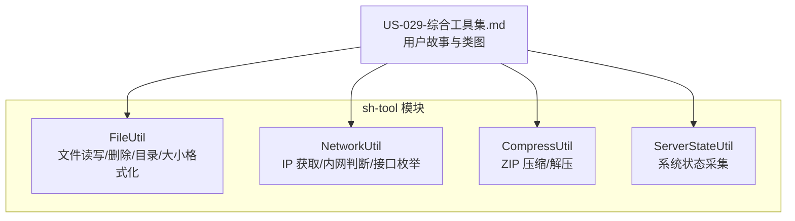
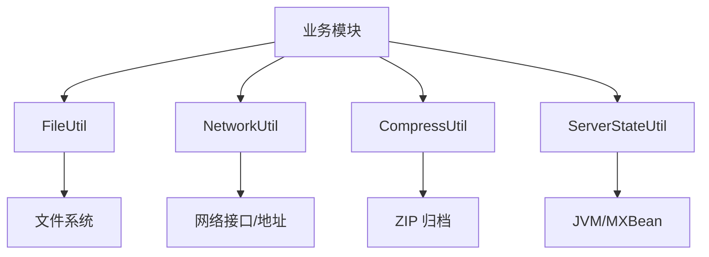
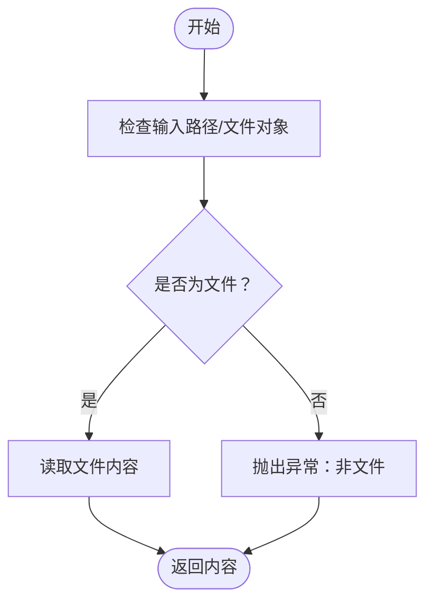
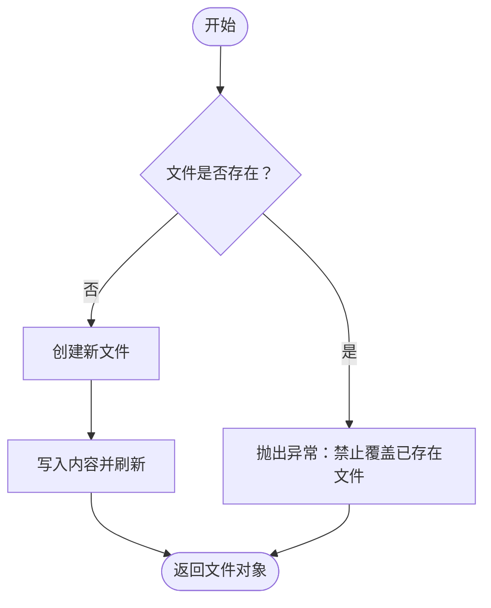
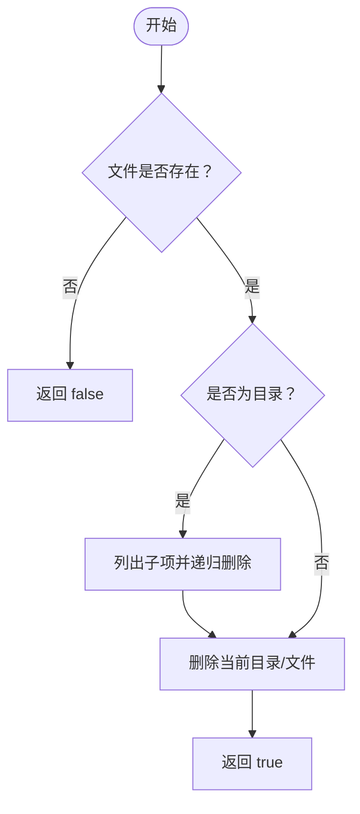
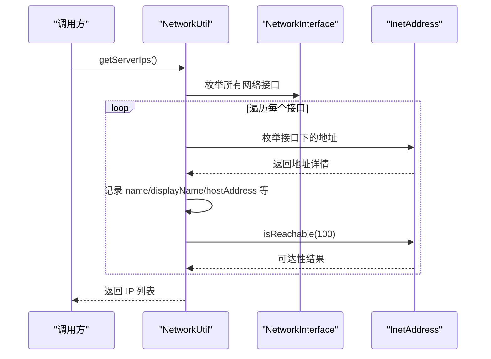
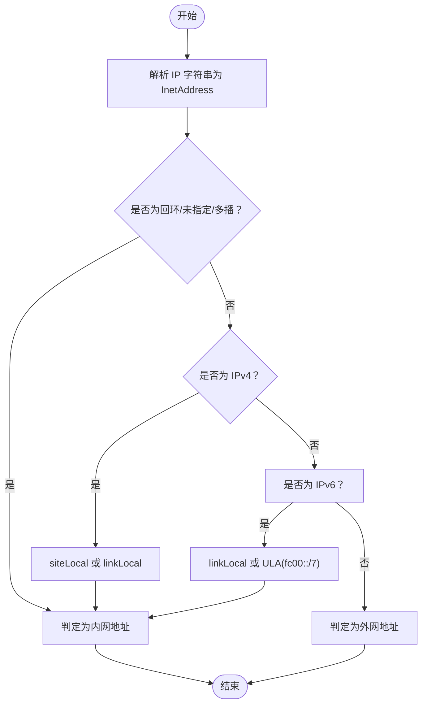
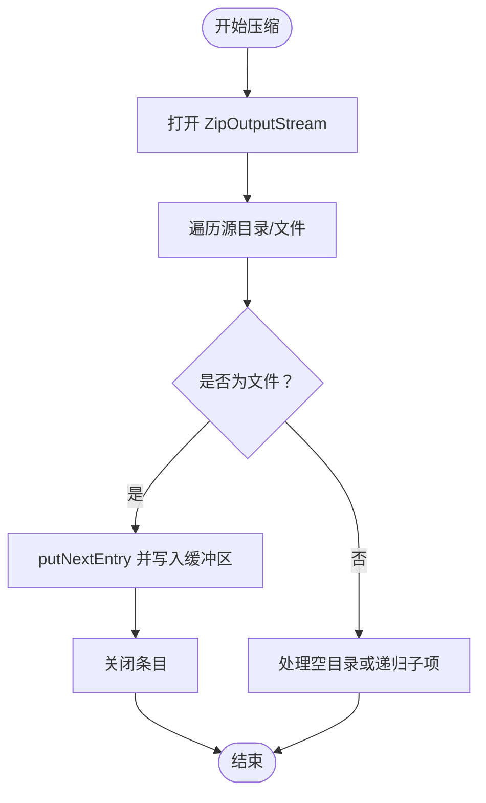
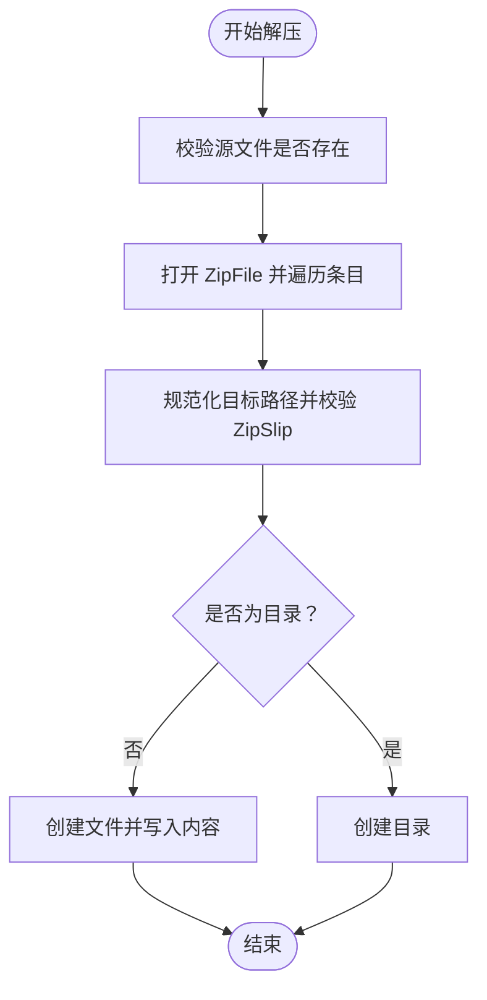
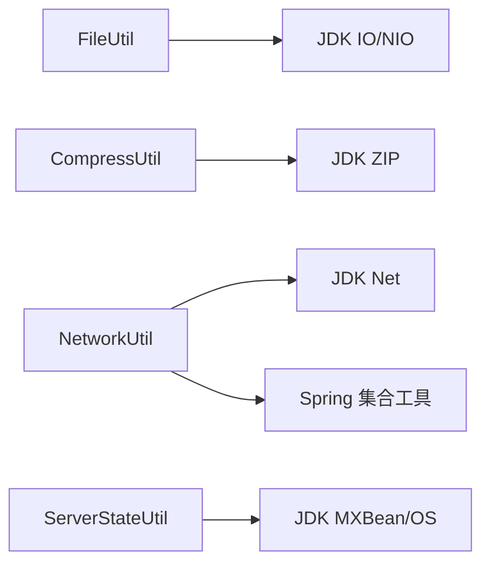

# 文件与网络工具

<cite>
**本文引用的文件**
- [FileUtil.java](file://sh-tool/src/main/java/com/wkclz/tool/utils/FileUtil.java)
- [NetworkUtil.java](file://sh-tool/src/main/java/com/wkclz/tool/utils/NetworkUtil.java)
- [CompressUtil.java](file://sh-tool/src/main/java/com/wkclz/tool/utils/CompressUtil.java)
- [ServerStateUtil.java](file://sh-tool/src/main/java/com/wkclz/tool/utils/ServerStateUtil.java)
- [US-029-综合工具集.md](file://docs/stories/US-029-综合工具集.md)
</cite>

## 目录
1. [简介](#简介)
2. [项目结构](#项目结构)
3. [核心组件](#核心组件)
4. [架构总览](#架构总览)
5. [详细组件分析](#详细组件分析)
6. [依赖关系分析](#依赖关系分析)
7. [性能考虑](#性能考虑)
8. [故障排查指南](#故障排查指南)
9. [结论](#结论)
10. [附录](#附录)

## 简介
本文件面向“文件与网络工具”的使用与实践，围绕以下目标展开：
- 全面介绍 FileUtil 的文件操作能力：读写、目录遍历、临时目录、文件大小格式化与删除。
- 深入解析 NetworkUtil 的网络状态检测能力：获取服务器 IP、列举所有 IP、判断内网地址。
- 补充压缩解压能力（CompressUtil）以支撑批量数据导出与归档。
- 提供文件处理、网络监控、系统状态检测的实际应用场景与最佳实践。
- 给出网络安全与性能优化建议。

## 项目结构
- 工具模块位于 sh-tool，核心类集中在 utils 包；文档位于 docs/stories。
- 本次文档聚焦于文件工具、网络工具与压缩工具，以及用于系统状态观测的 ServerStateUtil。

图表来源
- [US-029-综合工具集.md:1-84](file://docs/stories/US-029-综合工具集.md#L1-L84)
- [FileUtil.java:1-168](file://sh-tool/src/main/java/com/wkclz/tool/utils/FileUtil.java#L1-L168)
- [NetworkUtil.java:1-154](file://sh-tool/src/main/java/com/wkclz/tool/utils/NetworkUtil.java#L1-L154)
- [CompressUtil.java:1-185](file://sh-tool/src/main/java/com/wkclz/tool/utils/CompressUtil.java#L1-L185)
- [ServerStateUtil.java:1-218](file://sh-tool/src/main/java/com/wkclz/tool/utils/ServerStateUtil.java#L1-L218)

章节来源
- [US-029-综合工具集.md:1-84](file://docs/stories/US-029-综合工具集.md#L1-L84)

## 核心组件
- FileUtil：提供文件读取、写入、删除、临时目录与文件大小格式化等基础能力。
- NetworkUtil：提供服务器 IP 获取、列举所有 IP、内网地址判断等网络状态检测能力。
- CompressUtil：提供 ZIP 压缩与解压能力，并内置 ZipSlip 防护。
- ServerStateUtil：提供系统运行时状态采集（CPU、内存、GC、磁盘等），辅助网络与文件处理场景的性能监控。

章节来源
- [FileUtil.java:1-168](file://sh-tool/src/main/java/com/wkclz/tool/utils/FileUtil.java#L1-L168)
- [NetworkUtil.java:1-154](file://sh-tool/src/main/java/com/wkclz/tool/utils/NetworkUtil.java#L1-L154)
- [CompressUtil.java:1-185](file://sh-tool/src/main/java/com/wkclz/tool/utils/CompressUtil.java#L1-L185)
- [ServerStateUtil.java:1-218](file://sh-tool/src/main/java/com/wkclz/tool/utils/ServerStateUtil.java#L1-L218)

## 架构总览
从职责划分看，上述工具类属于“基础设施层”，为上层业务提供通用能力：
- FileUtil 与 CompressUtil 面向“数据导入导出”与“归档打包”场景。
- NetworkUtil 面向“网络连通性与地址合法性”场景。
- ServerStateUtil 面向“系统健康度与资源占用”监控场景。

图表来源
- [FileUtil.java:1-168](file://sh-tool/src/main/java/com/wkclz/tool/utils/FileUtil.java#L1-L168)
- [NetworkUtil.java:1-154](file://sh-tool/src/main/java/com/wkclz/tool/utils/NetworkUtil.java#L1-L154)
- [CompressUtil.java:1-185](file://sh-tool/src/main/java/com/wkclz/tool/utils/CompressUtil.java#L1-L185)
- [ServerStateUtil.java:1-218](file://sh-tool/src/main/java/com/wkclz/tool/utils/ServerStateUtil.java#L1-L218)

## 详细组件分析

### FileUtil 组件分析
- 功能要点
  - 读取文件：支持按路径或 File 对象读取文本内容。
  - 写入文件：创建新文件并写入内容，具备覆盖保护与异常处理。
  - 删除文件/目录：递归删除目录及其子项，最终删除目标文件。
  - 临时目录：根据用户工作目录生成 tmp 子目录，支持自定义子路径。
  - 目录遍历：递归收集目录下的全部文件绝对路径。
  - 文件大小格式化：将字节数转换为 B/K/M/G 的可读字符串。

图表来源
- [FileUtil.java:75-96](file://sh-tool/src/main/java/com/wkclz/tool/utils/FileUtil.java#L75-L96)

图表来源
- [FileUtil.java:98-118](file://sh-tool/src/main/java/com/wkclz/tool/utils/FileUtil.java#L98-L118)

图表来源
- [FileUtil.java:121-143](file://sh-tool/src/main/java/com/wkclz/tool/utils/FileUtil.java#L121-L143)

章节来源
- [FileUtil.java:21-40](file://sh-tool/src/main/java/com/wkclz/tool/utils/FileUtil.java#L21-L40)
- [FileUtil.java:43-66](file://sh-tool/src/main/java/com/wkclz/tool/utils/FileUtil.java#L43-L66)
- [FileUtil.java:75-96](file://sh-tool/src/main/java/com/wkclz/tool/utils/FileUtil.java#L75-L96)
- [FileUtil.java:98-118](file://sh-tool/src/main/java/com/wkclz/tool/utils/FileUtil.java#L98-L118)
- [FileUtil.java:121-143](file://sh-tool/src/main/java/com/wkclz/tool/utils/FileUtil.java#L121-L143)
- [FileUtil.java:151-164](file://sh-tool/src/main/java/com/wkclz/tool/utils/FileUtil.java#L151-L164)

### NetworkUtil 组件分析
- 功能要点
  - 获取服务器 IP：遍历网络接口，过滤回环与 docker 接口，返回可用 IPv4 地址。
  - 列举所有 IP：返回包含接口名、显示名、可达性、各类地址标记等信息的列表。
  - 内网地址判断：支持 IPv4 私有/链路本地、IPv6 链路本地/ULA（fc00::/7）、回环/未指定/多播等判定。

图表来源
- [NetworkUtil.java:55-99](file://sh-tool/src/main/java/com/wkclz/tool/utils/NetworkUtil.java#L55-L99)

图表来源
- [NetworkUtil.java:102-129](file://sh-tool/src/main/java/com/wkclz/tool/utils/NetworkUtil.java#L102-L129)

章节来源
- [NetworkUtil.java:13-53](file://sh-tool/src/main/java/com/wkclz/tool/utils/NetworkUtil.java#L13-L53)
- [NetworkUtil.java:55-99](file://sh-tool/src/main/java/com/wkclz/tool/utils/NetworkUtil.java#L55-L99)
- [NetworkUtil.java:102-129](file://sh-tool/src/main/java/com/wkclz/tool/utils/NetworkUtil.java#L102-L129)

### CompressUtil 组件分析
- 功能要点
  - ZIP 压缩：支持保留目录结构或扁平化压缩，记录耗时并记录日志。
  - ZIP 解压：支持目录恢复与空目录处理，内置 ZipSlip 防护（校验解压路径必须位于目标目录内）。
  - 异常处理：统一包装为运行时异常，便于上层捕获与处理。

图表来源
- [CompressUtil.java:48-122](file://sh-tool/src/main/java/com/wkclz/tool/utils/CompressUtil.java#L48-L122)

图表来源
- [CompressUtil.java:131-181](file://sh-tool/src/main/java/com/wkclz/tool/utils/CompressUtil.java#L131-L181)

章节来源
- [CompressUtil.java:35-58](file://sh-tool/src/main/java/com/wkclz/tool/utils/CompressUtil.java#L35-L58)
- [CompressUtil.java:69-122](file://sh-tool/src/main/java/com/wkclz/tool/utils/CompressUtil.java#L69-L122)
- [CompressUtil.java:131-181](file://sh-tool/src/main/java/com/wkclz/tool/utils/CompressUtil.java#L131-L181)

### ServerStateUtil 组件分析
- 功能要点
  - 类加载、编译、操作系统、平台 MBean、运行时、线程、内存、内存池、垃圾回收器、磁盘空间等指标采集。
  - 为网络与文件处理场景提供系统健康度参考，辅助容量规划与性能调优。

章节来源
- [ServerStateUtil.java:18-218](file://sh-tool/src/main/java/com/wkclz/tool/utils/ServerStateUtil.java#L18-L218)

## 依赖关系分析
- FileUtil 与 CompressUtil 均依赖 JDK 标准库（nio、zip、io 等），无外部依赖。
- NetworkUtil 依赖 JDK 网络接口与 Spring 工具集合（集合判空）。
- ServerStateUtil 依赖 JDK MXBean 与系统文件根目录枚举。

图表来源
- [FileUtil.java:1-168](file://sh-tool/src/main/java/com/wkclz/tool/utils/FileUtil.java#L1-L168)
- [CompressUtil.java:1-185](file://sh-tool/src/main/java/com/wkclz/tool/utils/CompressUtil.java#L1-L185)
- [NetworkUtil.java:1-154](file://sh-tool/src/main/java/com/wkclz/tool/utils/NetworkUtil.java#L1-L154)
- [ServerStateUtil.java:1-218](file://sh-tool/src/main/java/com/wkclz/tool/utils/ServerStateUtil.java#L1-L218)

## 性能考虑
- 文件读写
  - 使用缓冲流与合适的数据量分块写入，避免一次性大对象导致内存抖动。
  - 对频繁小文件读写场景，建议合并为批量操作或采用流式处理。
- 压缩解压
  - 合理设置缓冲区大小，避免过小导致多次系统调用，过大导致内存占用。
  - 解压时启用 ZipSlip 防护，同时尽量避免在解压过程中进行额外的权限变更。
- 网络检测
  - IP 枚举与可达性探测应限制超时与并发数量，避免阻塞主线程。
  - 内网地址判断仅做快速判定，避免在热路径中重复解析同一 IP。
- 系统状态采集
  - MXBean 采集涉及 JVM 采样，建议定期采样并缓存关键指标，降低开销。

## 故障排查指南
- 文件读取失败
  - 检查路径是否为文件而非目录；确认文件存在且可读。
  - 查看日志定位具体异常来源。
- 文件写入失败
  - 若提示“文件已存在，无法覆盖”，请调整目标路径或允许覆盖策略。
  - 检查磁盘空间与权限。
- 删除失败
  - 确认目标路径存在；若为目录，确保其为空或已递归清理。
- 压缩/解压异常
  - 解压报错“Zip entry outside target dir”：检查压缩包是否被篡改或包含路径穿越。
  - 压缩空目录需开启保留目录结构选项。
- 网络 IP 获取为空
  - 检查网络接口状态与权限；确认未被容器网络屏蔽。
  - 内网判断异常：确认传入的是合法 IP 字符串。

章节来源
- [FileUtil.java:88-96](file://sh-tool/src/main/java/com/wkclz/tool/utils/FileUtil.java#L88-L96)
- [FileUtil.java:103-117](file://sh-tool/src/main/java/com/wkclz/tool/utils/FileUtil.java#L103-L117)
- [CompressUtil.java:146-148](file://sh-tool/src/main/java/com/wkclz/tool/utils/CompressUtil.java#L146-L148)
- [NetworkUtil.java:20-24](file://sh-tool/src/main/java/com/wkclz/tool/utils/NetworkUtil.java#L20-L24)

## 结论
- FileUtil、NetworkUtil、CompressUtil 与 ServerStateUtil 构成了 sh-tool 中的“文件与网络工具”核心能力集。
- 它们分别覆盖了文件 I/O、网络状态检测、归档打包与系统状态观测，适用于数据导入导出、日志管理、网络连通性监控与系统健康度评估等场景。
- 建议在生产环境中结合日志与监控，持续关注性能与安全边界。

## 附录
- 实际应用场景示例（说明性描述）
  - 数据导入导出：使用 FileUtil 读取配置/日志文件，结合 CompressUtil 进行批量导出归档。
  - 日志管理：通过 FileUtil 获取临时目录，写入运行日志；定期清理旧日志。
  - 网络监控：使用 NetworkUtil 获取服务器 IP 与内网地址判断，辅助服务发现与访问控制。
  - 系统状态检测：结合 ServerStateUtil 采集 CPU/内存/GC/磁盘指标，指导容量与性能优化。