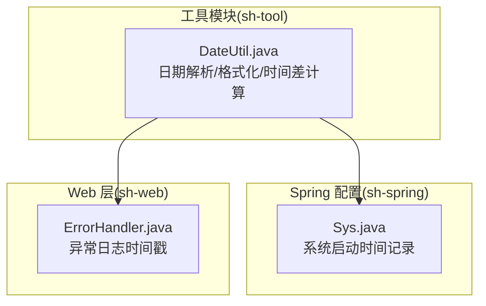
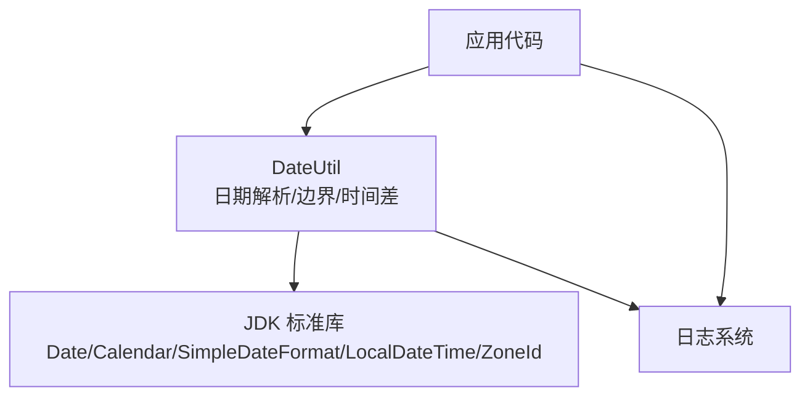
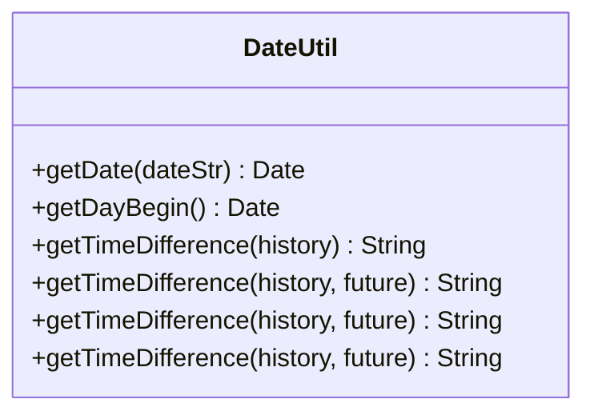
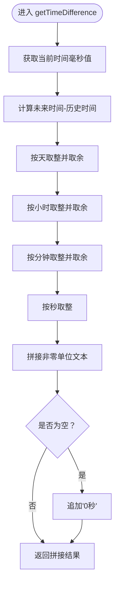
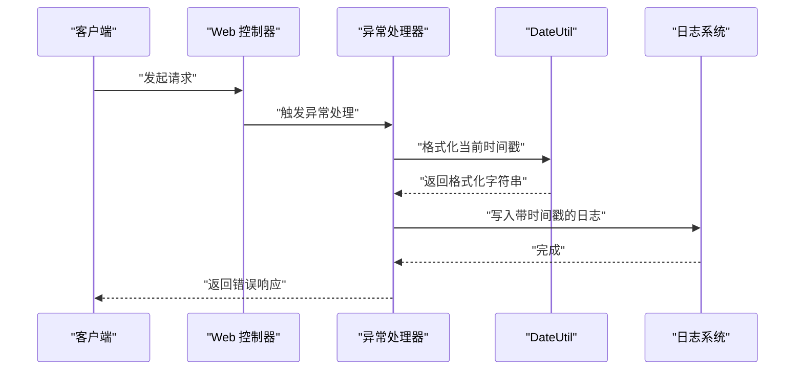
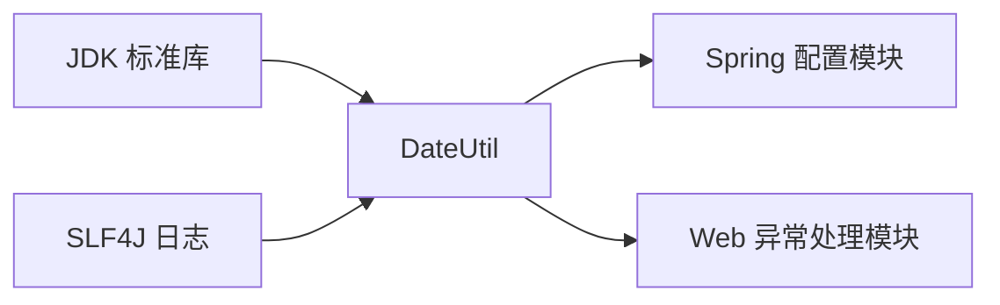

# 日期时间工具

<cite>
**本文引用的文件**
- [DateUtil.java](file://sh-tool/src/main/java/com/wkclz/tool/utils/DateUtil.java)
- [Sys.java](file://sh-spring/src/main/java/com/wkclz/spring/config/Sys.java)
- [ErrorHandler.java](file://sh-web/src/main/java/com/wkclz/web/rest/ErrorHandler.java)
</cite>

## 目录
1. [简介](#简介)
2. [项目结构](#项目结构)
3. [核心组件](#核心组件)
4. [架构总览](#架构总览)
5. [详细组件分析](#详细组件分析)
6. [依赖关系分析](#依赖关系分析)
7. [性能考量](#性能考量)
8. [故障排查指南](#故障排查指南)
9. [结论](#结论)
10. [附录](#附录)

## 简介
本指南围绕日期时间工具展开，重点介绍 DateUtil 类在日期解析、格式化、计算与比较等方面的能力；同时结合框架内其他组件的使用方式，说明本地化与时区处理思路、常见业务场景（如报表统计、数据筛选、时间窗口计算）的实践建议，并对时区与夏令时转换注意事项进行提示。

## 项目结构
DateUtil 位于工具模块中，作为日期时间处理的基础能力被多个模块复用。下图展示了与日期时间处理相关的关键文件及其交互关系：

图表来源
- [DateUtil.java:1-131](file://sh-tool/src/main/java/com/wkclz/tool/utils/DateUtil.java#L1-L131)
- [Sys.java:75-75](file://sh-spring/src/main/java/com/wkclz/spring/config/Sys.java#L75-L75)
- [ErrorHandler.java:198-198](file://sh-web/src/main/java/com/wkclz/web/rest/ErrorHandler.java#L198-L198)

章节来源
- [DateUtil.java:1-131](file://sh-tool/src/main/java/com/wkclz/tool/utils/DateUtil.java#L1-L131)
- [Sys.java:75-75](file://sh-spring/src/main/java/com/wkclz/spring/config/Sys.java#L75-L75)
- [ErrorHandler.java:198-198](file://sh-web/src/main/java/com/wkclz/web/rest/ErrorHandler.java#L198-L198)

## 核心组件
- 日期解析：支持将字符串解析为日期对象，兼容“年-月-日”和“年-月-日 时:分:秒”两种输入长度，并在解析失败时记录日志并抛出运行时异常。
- 日期边界：提供获取当天零点的方法，便于构造“当日”时间窗口。
- 时间差展示：支持以“天/时/分/秒”的人性化文本形式展示两个时间点之间的差值，内部基于毫秒级差值计算。

章节来源
- [DateUtil.java:36-52](file://sh-tool/src/main/java/com/wkclz/tool/utils/DateUtil.java#L36-L52)
- [DateUtil.java:56-63](file://sh-tool/src/main/java/com/wkclz/tool/utils/DateUtil.java#L56-L63)
- [DateUtil.java:69-128](file://sh-tool/src/main/java/com/wkclz/tool/utils/DateUtil.java#L69-L128)

## 架构总览
下图展示了 DateUtil 在系统中的典型调用路径与职责边界：

图表来源
- [DateUtil.java:1-131](file://sh-tool/src/main/java/com/wkclz/tool/utils/DateUtil.java#L1-L131)

## 详细组件分析

### DateUtil 类分析
- 设计要点
  - 使用静态方法提供无状态的日期处理能力，便于跨模块直接调用。
  - 内部常量定义常用日期格式与单位换算，提升可读性与一致性。
  - 对解析失败进行日志记录，避免静默失败。
- 关键方法
  - 日期解析：根据输入长度自动补齐默认时间部分，再按固定格式解析。
  - 当日零点：通过 Calendar 设置时分秒为 0 实现。
  - 时间差展示：根据毫秒差分段累加“天/时/分/秒”，并在为空时兜底为“0秒”。

图表来源
- [DateUtil.java:18-131](file://sh-tool/src/main/java/com/wkclz/tool/utils/DateUtil.java#L18-L131)

章节来源
- [DateUtil.java:18-131](file://sh-tool/src/main/java/com/wkclz/tool/utils/DateUtil.java#L18-L131)

### 时区与本地化处理
- 本地化
  - 解析阶段使用本地默认时区进行字符串到日期的转换。
  - 输出展示阶段采用系统默认时区进行 LocalDateTime 到毫秒的转换。
- 时区转换
  - 当前实现未显式传入目标时区，因此不涉及跨时区转换。
  - 若需跨时区处理，建议在调用方明确指定 ZoneId 并进行转换后再交由工具处理。

章节来源
- [DateUtil.java:85-89](file://sh-tool/src/main/java/com/wkclz/tool/utils/DateUtil.java#L85-L89)

### 时间差计算流程
以下流程图展示了“时间差人性化展示”的实现逻辑：

图表来源
- [DateUtil.java:91-128](file://sh-tool/src/main/java/com/wkclz/tool/utils/DateUtil.java#L91-L128)

章节来源
- [DateUtil.java:91-128](file://sh-tool/src/main/java/com/wkclz/tool/utils/DateUtil.java#L91-L128)

### 典型调用序列
以下序列图展示了异常处理器记录时间戳的典型调用链路，体现 DateUtil 的使用位置与职责：

图表来源
- [ErrorHandler.java:198-198](file://sh-web/src/main/java/com/wkclz/web/rest/ErrorHandler.java#L198-L198)
- [DateUtil.java:1-131](file://sh-tool/src/main/java/com/wkclz/tool/utils/DateUtil.java#L1-L131)

章节来源
- [ErrorHandler.java:198-198](file://sh-web/src/main/java/com/wkclz/web/rest/ErrorHandler.java#L198-L198)
- [DateUtil.java:1-131](file://sh-tool/src/main/java/com/wkclz/tool/utils/DateUtil.java#L1-L131)

## 依赖关系分析
- 模块内依赖
  - DateUtil 依赖 JDK 标准库（Date/Calendar/SimpleDateFormat/LocalDateTime/ZoneId）。
  - 日志记录依赖 SLF4J。
- 跨模块使用
  - Spring 配置模块在系统启动时间记录中使用了日期格式化能力。
  - Web 异常处理器在日志中使用了日期格式化能力。

图表来源
- [DateUtil.java:1-131](file://sh-tool/src/main/java/com/wkclz/tool/utils/DateUtil.java#L1-L131)
- [Sys.java:75-75](file://sh-spring/src/main/java/com/wkclz/spring/config/Sys.java#L75-L75)
- [ErrorHandler.java:198-198](file://sh-web/src/main/java/com/wkclz/web/rest/ErrorHandler.java#L198-L198)

章节来源
- [DateUtil.java:1-131](file://sh-tool/src/main/java/com/wkclz/tool/utils/DateUtil.java#L1-L131)
- [Sys.java:75-75](file://sh-spring/src/main/java/com/wkclz/spring/config/Sys.java#L75-L75)
- [ErrorHandler.java:198-198](file://sh-web/src/main/java/com/wkclz/web/rest/ErrorHandler.java#L198-L198)

## 性能考量
- 解析性能
  - 使用固定格式解析，避免正则或复杂模式匹配，解析开销较低。
  - 对于高频解析场景，可考虑缓存常用格式实例以减少对象创建。
- 计算性能
  - 时间差计算为纯整数运算，开销极低。
  - 文本拼接使用可变字符串构建，建议在极端高并发场景评估字符串池化策略。
- 时区与本地化
  - 默认时区解析与展示依赖系统默认时区，避免频繁切换时区可降低切换成本。

## 故障排查指南
- 输入格式问题
  - 当输入字符串长度不符合预设格式时，解析会抛出运行时异常。请确保传入“年-月-日”或“年-月-日 时:分:秒”格式。
- 解析异常
  - 解析失败会被记录到日志，请检查输入字符串是否符合预期格式以及是否存在非法字符。
- 时间差显示异常
  - 若未来时间早于历史时间，结果将为负值对应的“天/时/分/秒”组合；若两者相等则显示“0秒”。请确认传入的时间参数顺序。

章节来源
- [DateUtil.java:36-52](file://sh-tool/src/main/java/com/wkclz/tool/utils/DateUtil.java#L36-L52)
- [DateUtil.java:44-50](file://sh-tool/src/main/java/com/wkclz/tool/utils/DateUtil.java#L44-L50)
- [DateUtil.java:91-128](file://sh-tool/src/main/java/com/wkclz/tool/utils/DateUtil.java#L91-L128)

## 结论
DateUtil 提供了简洁而实用的日期解析、日期边界与时间差展示能力，满足大多数业务场景下的日期时间处理需求。对于需要跨时区与本地化适配的场景，建议在调用方明确时区并进行转换后再交由工具处理。在高频场景下，可进一步优化解析与字符串拼接的性能表现。

## 附录

### 常见业务场景与使用建议
- 报表统计
  - 使用“当日零点”方法构造统计起始时间，配合数据库时间范围查询实现日粒度统计。
- 数据筛选
  - 将用户输入的日期字符串解析为 Date 后，结合 SQL 的 BETWEEN 或日期函数进行筛选。
- 时间窗口计算
  - 使用时间差方法生成“X天X时X分X秒”的人性化文案，用于前端展示或日志记录。

章节来源
- [DateUtil.java:56-63](file://sh-tool/src/main/java/com/wkclz/tool/utils/DateUtil.java#L56-L63)
- [DateUtil.java:69-128](file://sh-tool/src/main/java/com/wkclz/tool/utils/DateUtil.java#L69-L128)

### 时区与夏令时注意事项
- 当前实现未显式指定时区，解析与展示均使用系统默认时区。
- 夏令时切换可能导致同一时刻在不同时区的表示存在差异，建议在涉及跨时区展示或存储时，明确指定目标时区并进行转换。

章节来源
- [DateUtil.java:85-89](file://sh-tool/src/main/java/com/wkclz/tool/utils/DateUtil.java#L85-L89)