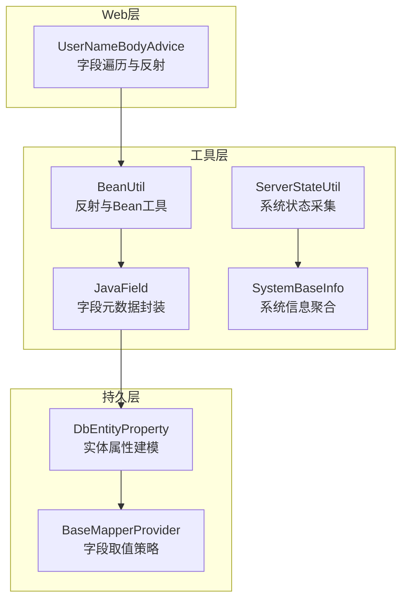
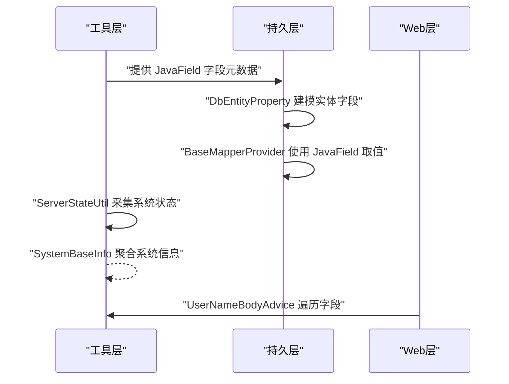
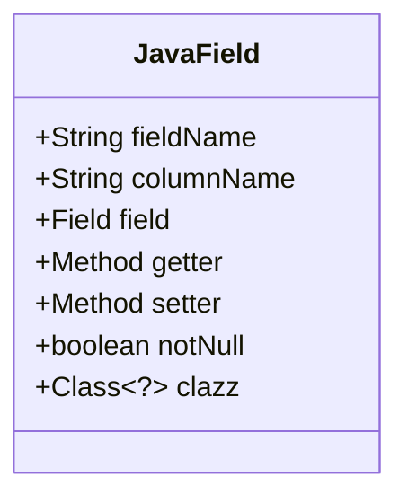
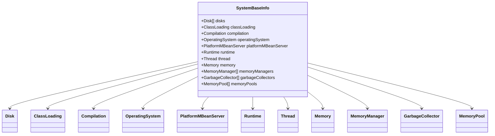
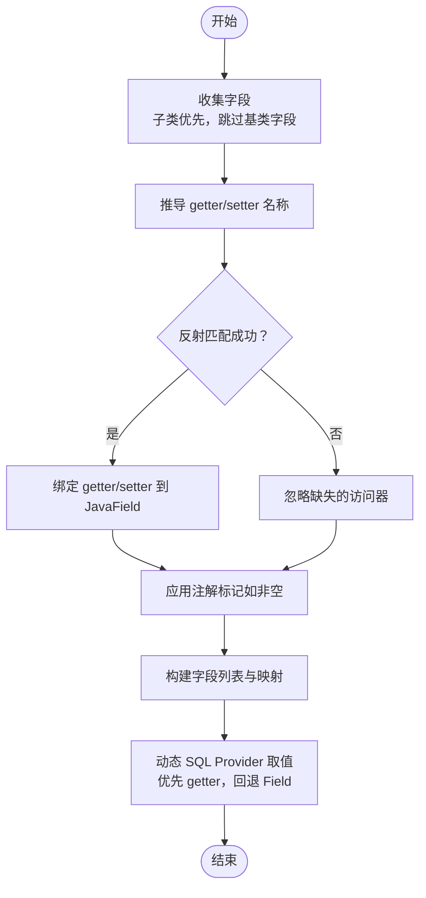
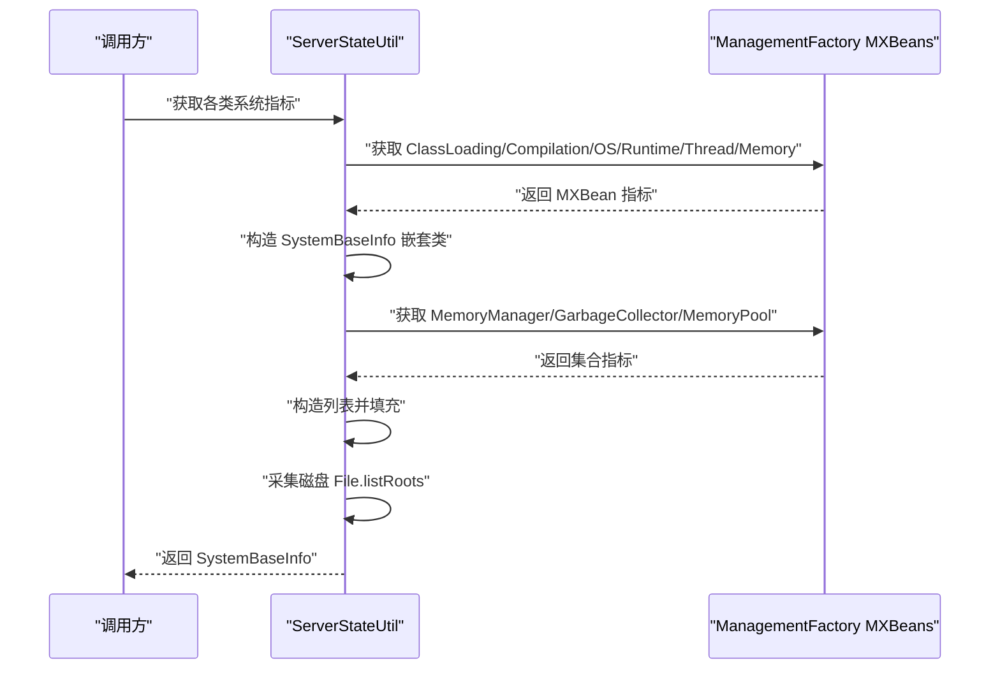
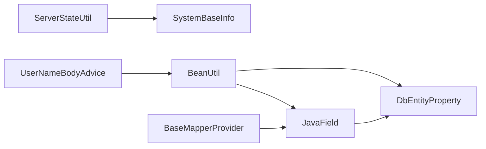

# 系统与数据模型

<cite>
**本文引用的文件**
- [JavaField.java](file://sh-tool/src/main/java/com/wkclz/tool/bean/JavaField.java)
- [SystemBaseInfo.java](file://sh-tool/src/main/java/com/wkclz/tool/bean/SystemBaseInfo.java)
- [BeanUtil.java](file://sh-tool/src/main/java/com/wkclz/tool/utils/BeanUtil.java)
- [ServerStateUtil.java](file://sh-tool/src/main/java/com/wkclz/tool/utils/ServerStateUtil.java)
- [DbEntityProperty.java](file://sh-mybatis/src/main/java/com/wkclz/mybatis/bean/DbEntityProperty.java)
- [BaseMapperProvider.java](file://sh-mybatis/src/main/java/com/wkclz/mybatis/mapper/impl/BaseMapperProvider.java)
- [UserNameBodyAdvice.java](file://sh-web/src/main/java/com/wkclz/web/rest/UserNameBodyAdvice.java)
</cite>

## 目录
1. [简介](#简介)
2. [项目结构](#项目结构)
3. [核心组件](#核心组件)
4. [架构总览](#架构总览)
5. [详细组件分析](#详细组件分析)
6. [依赖分析](#依赖分析)
7. [性能考虑](#性能考虑)
8. [故障排查指南](#故障排查指南)
9. [结论](#结论)
10. [附录](#附录)

## 简介
本文件聚焦于系统与数据模型，围绕两类关键数据模型展开：JavaField 类用于封装 Java 字段的元数据与反射信息；SystemBaseInfo 类用于采集与封装系统基本信息及硬件资源监控指标。文档将系统性阐述这两个模型的设计理念、实现细节、在框架中的作用与典型应用场景，并提供可直接定位到源码位置的“代码片段路径”，帮助读者快速上手与扩展。

## 项目结构
本项目采用多模块划分，其中与系统与数据模型直接相关的关键模块如下：
- sh-tool：提供基础工具与数据模型，包含 JavaField 与 SystemBaseInfo 数据模型及其工具类。
- sh-mybatis：基于 JavaField 进行字段元数据处理，支撑动态 SQL 与实体映射。
- sh-web：面向 Web 层的辅助组件，涉及字段反射访问与上下文处理。

图表来源
- [JavaField.java:13-23](file://sh-tool/src/main/java/com/wkclz/tool/bean/JavaField.java#L13-L23)
- [SystemBaseInfo.java:14-26](file://sh-tool/src/main/java/com/wkclz/tool/bean/SystemBaseInfo.java#L14-L26)
- [BeanUtil.java:223-273](file://sh-tool/src/main/java/com/wkclz/tool/utils/BeanUtil.java#L223-L273)
- [ServerStateUtil.java:18-217](file://sh-tool/src/main/java/com/wkclz/tool/utils/ServerStateUtil.java#L18-L217)
- [DbEntityProperty.java:137-209](file://sh-mybatis/src/main/java/com/wkclz/mybatis/bean/DbEntityProperty.java#L137-L209)
- [BaseMapperProvider.java:59-65](file://sh-mybatis/src/main/java/com/wkclz/mybatis/mapper/impl/BaseMapperProvider.java#L59-L65)
- [UserNameBodyAdvice.java:181-196](file://sh-web/src/main/java/com/wkclz/web/rest/UserNameBodyAdvice.java#L181-L196)

章节来源
- [JavaField.java:1-23](file://sh-tool/src/main/java/com/wkclz/tool/bean/JavaField.java#L1-L23)
- [SystemBaseInfo.java:1-156](file://sh-tool/src/main/java/com/wkclz/tool/bean/SystemBaseInfo.java#L1-L156)
- [BeanUtil.java:1-293](file://sh-tool/src/main/java/com/wkclz/tool/utils/BeanUtil.java#L1-L293)
- [ServerStateUtil.java:1-218](file://sh-tool/src/main/java/com/wkclz/tool/utils/ServerStateUtil.java#L1-L218)
- [DbEntityProperty.java:1-213](file://sh-mybatis/src/main/java/com/wkclz/mybatis/bean/DbEntityProperty.java#L1-L213)
- [BaseMapperProvider.java:36-65](file://sh-mybatis/src/main/java/com/wkclz/mybatis/mapper/impl/BaseMapperProvider.java#L36-L65)
- [UserNameBodyAdvice.java:172-197](file://sh-web/src/main/java/com/wkclz/web/rest/UserNameBodyAdvice.java#L172-L197)

## 核心组件
- JavaField：封装字段名称、数据库列名、字段对象、getter/setter 方法、非空标记以及字段类型等，用于在 ORM 与反射场景中统一表达字段元数据。
- SystemBaseInfo：以嵌套类形式组织系统信息，涵盖磁盘、类加载、编译、操作系统、MBeanServer、运行时、线程、内存、内存管理器、垃圾回收器、内存池等维度，便于集中采集与传输。

章节来源
- [JavaField.java:13-23](file://sh-tool/src/main/java/com/wkclz/tool/bean/JavaField.java#L13-L23)
- [SystemBaseInfo.java:14-156](file://sh-tool/src/main/java/com/wkclz/tool/bean/SystemBaseInfo.java#L14-L156)

## 架构总览
下图展示数据模型在框架中的角色与交互关系：工具层提供 JavaField 与 SystemBaseInfo，持久层通过 DbEntityProperty 建模实体字段并利用 JavaField 完成 getter/setter 查找与字段取值；ServerStateUtil 将 JVM/MXBean 信息映射到 SystemBaseInfo；Web 层通过反射工具对字段进行遍历与访问。

图表来源
- [BeanUtil.java:223-273](file://sh-tool/src/main/java/com/wkclz/tool/utils/BeanUtil.java#L223-L273)
- [DbEntityProperty.java:137-209](file://sh-mybatis/src/main/java/com/wkclz/mybatis/bean/DbEntityProperty.java#L137-L209)
- [BaseMapperProvider.java:59-65](file://sh-mybatis/src/main/java/com/wkclz/mybatis/mapper/impl/BaseMapperProvider.java#L59-L65)
- [ServerStateUtil.java:18-217](file://sh-tool/src/main/java/com/wkclz/tool/utils/ServerStateUtil.java#L18-L217)
- [UserNameBodyAdvice.java:181-196](file://sh-web/src/main/java/com/wkclz/web/rest/UserNameBodyAdvice.java#L181-L196)

## 详细组件分析

### JavaField 组件分析
- 设计目标：统一 Java 字段的元数据与反射信息，降低上层对反射 API 的直接依赖，提升可维护性与可测试性。
- 关键字段与职责
  - fieldName：字段名称
  - columnName：数据库列名（便于 ORM 映射）
  - field：Field 对象（用于直接读写）
  - getter/setter：Method 对象（优先通过 getter 访问，回退到 Field）
  - notNull：是否非空约束
  - clazz：字段类型
- 典型用法
  - 在实体建模阶段收集字段与 getter/setter
  - 在动态 SQL 或字段复制场景中按需调用 getter/setter
- 性能与健壮性
  - 通过缓存减少反射开销
  - 对缺失 getter/setter 的字段进行容错处理

图表来源
- [JavaField.java:13-23](file://sh-tool/src/main/java/com/wkclz/tool/bean/JavaField.java#L13-L23)

章节来源
- [JavaField.java:13-23](file://sh-tool/src/main/java/com/wkclz/tool/bean/JavaField.java#L13-L23)
- [BeanUtil.java:223-273](file://sh-tool/src/main/java/com/wkclz/tool/utils/BeanUtil.java#L223-L273)
- [DbEntityProperty.java:137-209](file://sh-mybatis/src/main/java/com/wkclz/mybatis/bean/DbEntityProperty.java#L137-L209)
- [BaseMapperProvider.java:59-65](file://sh-mybatis/src/main/java/com/wkclz/mybatis/mapper/impl/BaseMapperProvider.java#L59-L65)

### SystemBaseInfo 组件分析
- 设计目标：以结构化方式封装 JVM 与系统监控指标，便于统一采集、传输与可视化。
- 结构组成
  - 磁盘信息：分区、总空间、可用空间、已用空间
  - 类加载：已加载类数、累计加载/卸载数
  - 编译：编译耗时、编译器名称
  - 操作系统：名称、架构、CPU 数、系统负载、版本、内存与交换区大小、进程 CPU 时间
  - MBeanServer：MBean 数量、默认域、域列表
  - 运行时：JVM 名称、输入参数、类路径、库路径、启动时间、运行时长、规格信息、虚拟机信息、系统属性
  - 线程：线程数、线程 ID 列表、线程信息、守护线程数、峰值线程数、累计启动线程数、当前线程 CPU/用户时间
  - 内存：堆与非堆内存使用情况、等待终结对象数量
  - 内存管理器：名称、关联的内存池
  - 垃圾回收器：名称、回收次数、回收时间、关联的内存池
  - 内存池：名称、有效性、类型、使用量/峰值/回收时使用量、阈值与阈值超限统计
- 采集流程
  - 通过 ServerStateUtil 将 ManagementFactory 各 MXBean 的指标映射到 SystemBaseInfo 的各嵌套类中
  - 支持磁盘空间采集（File.listRoots）

图表来源
- [SystemBaseInfo.java:14-156](file://sh-tool/src/main/java/com/wkclz/tool/bean/SystemBaseInfo.java#L14-L156)
- [ServerStateUtil.java:18-217](file://sh-tool/src/main/java/com/wkclz/tool/utils/ServerStateUtil.java#L18-L217)

章节来源
- [SystemBaseInfo.java:14-156](file://sh-tool/src/main/java/com/wkclz/tool/bean/SystemBaseInfo.java#L14-L156)
- [ServerStateUtil.java:18-217](file://sh-tool/src/main/java/com/wkclz/tool/utils/ServerStateUtil.java#L18-L217)

### 字段元数据处理流程（DbEntityProperty 与 BeanUtil）
- 字段收集与去重：自子类到父类逐级收集字段，跳过特定基类字段，保证子类字段优先
- Getter/Setter 推断：根据字段名推导 getter/setter 名称并尝试反射匹配
- 标记与过滤：结合注解标记非空等属性，构建字段集合与映射
- 字段取值：在动态 SQL Provider 中优先使用 getter，缺失时回退到 Field 直接读取

图表来源
- [DbEntityProperty.java:137-209](file://sh-mybatis/src/main/java/com/wkclz/mybatis/bean/DbEntityProperty.java#L137-L209)
- [BeanUtil.java:223-273](file://sh-tool/src/main/java/com/wkclz/tool/utils/BeanUtil.java#L223-L273)
- [BaseMapperProvider.java:59-65](file://sh-mybatis/src/main/java/com/wkclz/mybatis/mapper/impl/BaseMapperProvider.java#L59-L65)

章节来源
- [DbEntityProperty.java:137-209](file://sh-mybatis/src/main/java/com/wkclz/mybatis/bean/DbEntityProperty.java#L137-L209)
- [BeanUtil.java:223-273](file://sh-tool/src/main/java/com/wkclz/tool/utils/BeanUtil.java#L223-L273)
- [BaseMapperProvider.java:59-65](file://sh-mybatis/src/main/java/com/wkclz/mybatis/mapper/impl/BaseMapperProvider.java#L59-L65)

### 系统信息采集序列（ServerStateUtil）
- 采集步骤
  - 类加载：加载数、累计/卸载数
  - 编译：编译耗时、编译器名称
  - 操作系统：名称、架构、CPU 数、系统负载、版本、内存/交换区、进程 CPU 时间
  - MBeanServer：MBean 数量、默认域、域列表
  - 运行时：JVM 规格、虚拟机信息、系统属性、启动/运行时长
  - 线程：线程数、线程 ID 列表、线程信息、守护/峰值/累计启动数、当前线程 CPU/用户时间
  - 内存：堆/非堆内存使用、等待终结对象数
  - 内存管理器：名称、内存池列表
  - 垃圾回收器：名称、回收次数/时间、内存池列表
  - 内存池：名称、有效性、类型、使用/峰值/回收时使用、阈值与超限统计
  - 磁盘：根目录列表、总/可用/已用空间

图表来源
- [ServerStateUtil.java:18-217](file://sh-tool/src/main/java/com/wkclz/tool/utils/ServerStateUtil.java#L18-L217)
- [SystemBaseInfo.java:14-156](file://sh-tool/src/main/java/com/wkclz/tool/bean/SystemBaseInfo.java#L14-L156)

章节来源
- [ServerStateUtil.java:18-217](file://sh-tool/src/main/java/com/wkclz/tool/utils/ServerStateUtil.java#L18-L217)
- [SystemBaseInfo.java:14-156](file://sh-tool/src/main/java/com/wkclz/tool/bean/SystemBaseInfo.java#L14-L156)

## 依赖分析
- JavaField 与 DbEntityProperty：前者作为承载字段元数据的数据载体，后者负责从实体类中提取字段并构建 JavaField 列表，二者在持久层广泛配合。
- BeanUtil：提供反射工具能力，包括字段与 getter/setter 的缓存与查找，被 DbEntityProperty 与 Web 层复用。
- ServerStateUtil：依赖 ManagementFactory 的 MXBean，将 JVM/OS 指标映射到 SystemBaseInfo。
- BaseMapperProvider：在动态 SQL 场景中使用 JavaField 的 getter/setter 进行字段取值。
- UserNameBodyAdvice：在 Web 层对对象树进行字段遍历时使用反射访问。

图表来源
- [JavaField.java:13-23](file://sh-tool/src/main/java/com/wkclz/tool/bean/JavaField.java#L13-L23)
- [DbEntityProperty.java:137-209](file://sh-mybatis/src/main/java/com/wkclz/mybatis/bean/DbEntityProperty.java#L137-L209)
- [BeanUtil.java:223-273](file://sh-tool/src/main/java/com/wkclz/tool/utils/BeanUtil.java#L223-L273)
- [ServerStateUtil.java:18-217](file://sh-tool/src/main/java/com/wkclz/tool/utils/ServerStateUtil.java#L18-L217)
- [BaseMapperProvider.java:59-65](file://sh-mybatis/src/main/java/com/wkclz/mybatis/mapper/impl/BaseMapperProvider.java#L59-L65)
- [UserNameBodyAdvice.java:181-196](file://sh-web/src/main/java/com/wkclz/web/rest/UserNameBodyAdvice.java#L181-L196)

章节来源
- [DbEntityProperty.java:137-209](file://sh-mybatis/src/main/java/com/wkclz/mybatis/bean/DbEntityProperty.java#L137-L209)
- [BeanUtil.java:223-273](file://sh-tool/src/main/java/com/wkclz/tool/utils/BeanUtil.java#L223-L273)
- [ServerStateUtil.java:18-217](file://sh-tool/src/main/java/com/wkclz/tool/utils/ServerStateUtil.java#L18-L217)
- [BaseMapperProvider.java:59-65](file://sh-mybatis/src/main/java/com/wkclz/mybatis/mapper/impl/BaseMapperProvider.java#L59-L65)
- [UserNameBodyAdvice.java:181-196](file://sh-web/src/main/java/com/wkclz/web/rest/UserNameBodyAdvice.java#L181-L196)

## 性能考虑
- 反射缓存：BeanUtil 对字段与 getter/setter 的解析结果进行缓存，避免重复反射带来的性能损耗。
- 字段取值策略：BaseMapperProvider 优先使用 getter，缺失时再回退到 Field，兼顾灵活性与性能。
- 系统指标采集：ServerStateUtil 仅在需要时触发 MXBean 查询，建议按需采集或分批采集，避免频繁 I/O 与系统调用。
- 建议
  - 对高频字段访问场景，尽量在初始化阶段完成元数据收集与缓存。
  - 控制系统指标采集频率，结合业务需求设置合理的采样周期。
  - 对大对象树的反射遍历应谨慎，避免深度递归导致的性能问题。

## 故障排查指南
- 字段访问失败
  - 现象：通过 JavaField 的 getter/setter 访问字段抛出异常
  - 排查要点：确认 getter/setter 是否存在、可见性是否允许、字段类型是否匹配
  - 参考实现：BaseMapperProvider 对字段取值的回退逻辑
  - 章节来源
    - [BaseMapperProvider.java:59-65](file://sh-mybatis/src/main/java/com/wkclz/mybatis/mapper/impl/BaseMapperProvider.java#L59-L65)
- 反射权限问题
  - 现象：无法访问某些字段或方法
  - 排查要点：检查字段/方法的访问修饰符，必要时启用 setAccessible
  - 参考实现：UserNameBodyAdvice 对字段遍历中 setAccessible 的使用
  - 章节来源
    - [UserNameBodyAdvice.java:181-196](file://sh-web/src/main/java/com/wkclz/web/rest/UserNameBodyAdvice.java#L181-L196)
- 系统指标为空或异常
  - 现象：SystemBaseInfo 某些字段为空或异常
  - 排查要点：确认运行环境是否支持对应 MXBean、JDK 版本差异、权限限制
  - 参考实现：ServerStateUtil 对 MXBean 的映射与容错处理
  - 章节来源
    - [ServerStateUtil.java:18-217](file://sh-tool/src/main/java/com/wkclz/tool/utils/ServerStateUtil.java#L18-L217)

## 结论
JavaField 与 SystemBaseInfo 分别承担了“字段元数据”与“系统信息”的建模职责，贯穿工具层、持久层与 Web 层。通过 BeanUtil 的反射工具与 ServerStateUtil 的系统采集，框架实现了对 Java 字段与 JVM/OS 指标的统一抽象与高效使用。在实际应用中，建议遵循缓存优先、按需采集、容错处理与跨平台兼容的原则，确保系统的稳定性与可维护性。

## 附录
- 实际应用示例（代码片段路径）
  - 字段元数据采集与缓存：[BeanUtil.java:223-273](file://sh-tool/src/main/java/com/wkclz/tool/utils/BeanUtil.java#L223-L273)
  - 实体字段建模与 getter/setter 绑定：[DbEntityProperty.java:137-209](file://sh-mybatis/src/main/java/com/wkclz/mybatis/bean/DbEntityProperty.java#L137-L209)
  - 动态 SQL 字段取值策略：[BaseMapperProvider.java:59-65](file://sh-mybatis/src/main/java/com/wkclz/mybatis/mapper/impl/BaseMapperProvider.java#L59-L65)
  - 系统信息采集与映射：[ServerStateUtil.java:18-217](file://sh-tool/src/main/java/com/wkclz/tool/utils/ServerStateUtil.java#L18-L217)
  - Web 层字段遍历与反射访问：[UserNameBodyAdvice.java:181-196](file://sh-web/src/main/java/com/wkclz/web/rest/UserNameBodyAdvice.java#L181-L196)