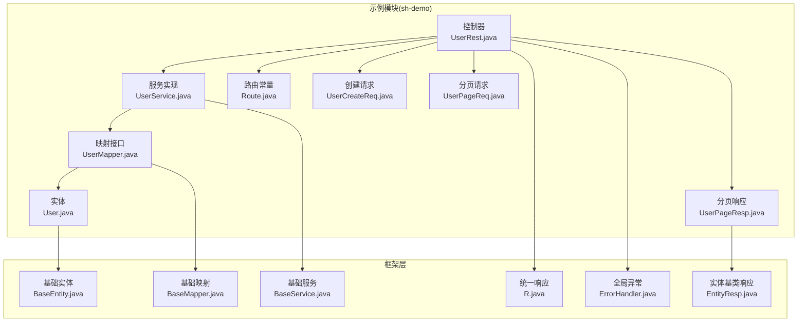
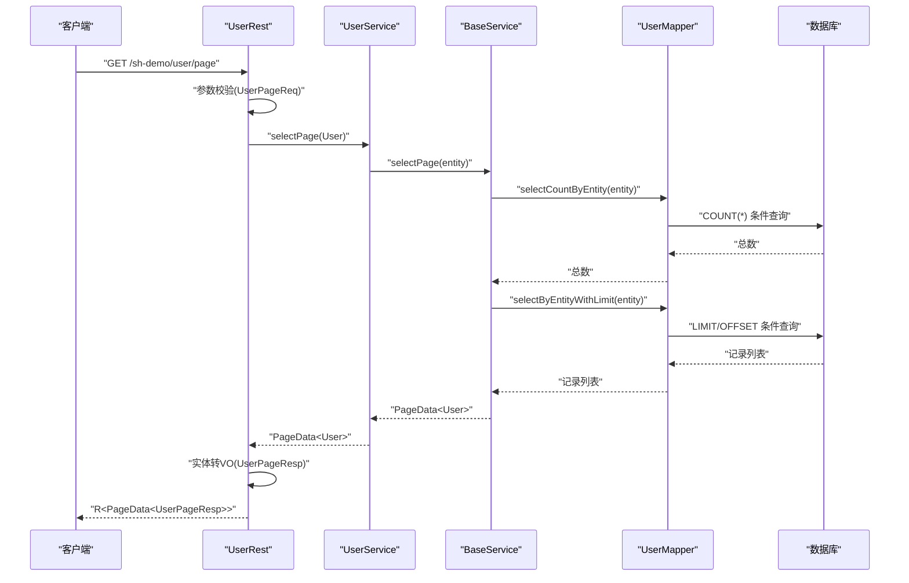
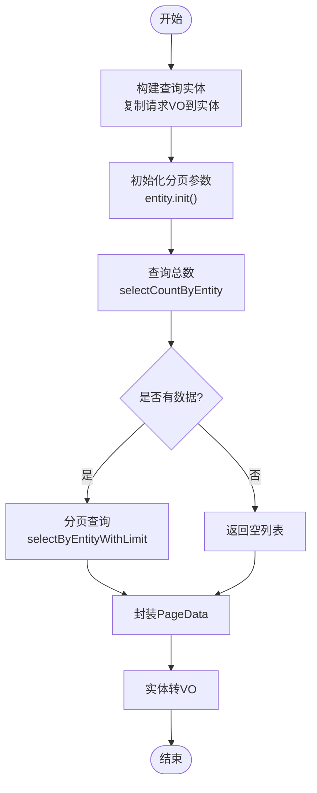
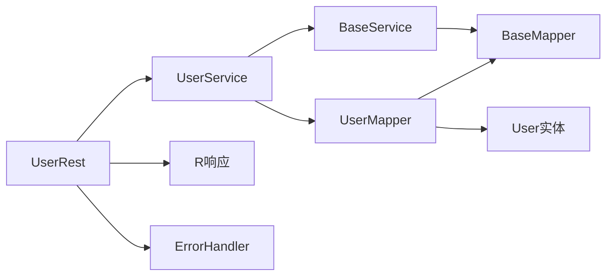

# CRUD标准范式

<cite>
**本文引用的文件**
- [BaseEntity.java](file://sh-core/src/main/java/com/wkclz/core/base/BaseEntity.java)
- [BaseMapper.java](file://sh-mybatis/src/main/java/com/wkclz/mybatis/mapper/BaseMapper.java)
- [BaseService.java](file://sh-mybatis/src/main/java/com/wkclz/mybatis/service/BaseService.java)
- [R.java](file://sh-core/src/main/java/com/wkclz/core/base/R.java)
- [ErrorHandler.java](file://sh-web/src/main/java/com/wkclz/web/rest/ErrorHandler.java)
- [EntityResp.java](file://sh-web/src/main/java/com/wkclz/web/bean/EntityResp.java)
- [User.java](file://sh-demo/src/main/java/com/wkclz/demo/bean/entity/User.java)
- [UserMapper.java](file://sh-demo/src/main/java/com/wkclz/demo/mapper/UserMapper.java)
- [UserService.java](file://sh-demo/src/main/java/com/wkclz/demo/service/UserService.java)
- [UserRest.java](file://sh-demo/src/main/java/com/wkclz/demo/rest/UserRest.java)
- [Route.java](file://sh-demo/src/main/java/com/wkclz/demo/rest/Route.java)
- [UserCreateReq.java](file://sh-demo/src/main/java/com/wkclz/demo/bean/vo/user/UserCreateReq.java)
- [UserPageReq.java](file://sh-demo/src/main/java/com/wkclz/demo/bean/vo/user/UserPageReq.java)
- [UserPageResp.java](file://sh-demo/src/main/java/com/wkclz/demo/bean/vo/user/UserPageResp.java)
- [US-030-示例模块CRUD标准范式.md](file://docs/stories/US-030-示例模块CRUD标准范式.md)
</cite>

## 目录
1. [简介](#简介)
2. [项目结构](#项目结构)
3. [核心组件](#核心组件)
4. [架构总览](#架构总览)
5. [详细组件分析](#详细组件分析)
6. [依赖分析](#依赖分析)
7. [性能考量](#性能考量)
8. [故障排查指南](#故障排查指南)
9. [结论](#结论)
10. [附录](#附录)

## 简介
本文件面向希望基于sh-framework快速实现“标准CRUD”的开发者，提供从实体定义到REST接口的完整范式说明。该范式以BaseEntity、BaseMapper、BaseService为核心，结合统一响应R、全局异常处理ErrorHandler以及VO/Route设计，形成“实体-映射-服务-接口”一体化的开发流程。文档同时覆盖分页查询、条件查询、批量操作、数据验证、异常处理与响应封装，并给出测试与调试建议。

## 项目结构
下图展示CRUD标准范式在示例模块中的组织方式与层次关系：

**图表来源**
- [UserRest.java:1-98](file://sh-demo/src/main/java/com/wkclz/demo/rest/UserRest.java#L1-L98)
- [Route.java:1-25](file://sh-demo/src/main/java/com/wkclz/demo/rest/Route.java#L1-L25)
- [User.java:1-28](file://sh-demo/src/main/java/com/wkclz/demo/bean/entity/User.java#L1-L28)
- [UserMapper.java:1-10](file://sh-demo/src/main/java/com/wkclz/demo/mapper/UserMapper.java#L1-L10)
- [UserService.java:1-12](file://sh-demo/src/main/java/com/wkclz/demo/service/UserService.java#L1-L12)
- [BaseEntity.java:1-94](file://sh-core/src/main/java/com/wkclz/core/base/BaseEntity.java#L1-L94)
- [BaseMapper.java:1-88](file://sh-mybatis/src/main/java/com/wkclz/mybatis/mapper/BaseMapper.java#L1-L88)
- [BaseService.java:1-214](file://sh-mybatis/src/main/java/com/wkclz/mybatis/service/BaseService.java#L1-L214)
- [R.java:1-76](file://sh-core/src/main/java/com/wkclz/core/base/R.java#L1-L76)
- [ErrorHandler.java:1-267](file://sh-web/src/main/java/com/wkclz/web/rest/ErrorHandler.java#L1-L267)
- [EntityResp.java:1-42](file://sh-web/src/main/java/com/wkclz/web/bean/EntityResp.java#L1-L42)

**章节来源**
- [US-030-示例模块CRUD标准范式.md:1-54](file://docs/stories/US-030-示例模块CRUD标准范式.md#L1-L54)

## 核心组件
- 基础实体(BaseEntity)
  - 提供审计字段、租户/用户上下文、分页与查询辅助字段，以及拷贝工具方法，便于在请求/响应与实体间进行安全复制。
- 基础映射(BaseMapper)
  - 定义14类单表CRUD能力：插入/批量插入、删除/批量删除、更新/选择性更新、按ID/IDs查询、条件查询/带分页查询、统计、唯一查询等。
- 基础服务(BaseService)
  - 对BaseMapper进行组合，提供事务化封装、批量拆分、分页查询（含总数与列表）、以及常用查询聚合方法。
- 统一响应(R)
  - 规范接口返回结构，包含code/msg/data及请求/响应时间、耗时等辅助信息，便于前端统一处理。
- 全局异常(ErrorHandler)
  - 捕获各类异常，输出结构化错误响应，并在必要时发送告警邮件，保障线上稳定性。
- 实体响应(EntityResp)
  - 作为分页响应的实体基类，统一审计字段输出。

**章节来源**
- [BaseEntity.java:1-94](file://sh-core/src/main/java/com/wkclz/core/base/BaseEntity.java#L1-L94)
- [BaseMapper.java:1-88](file://sh-mybatis/src/main/java/com/wkclz/mybatis/mapper/BaseMapper.java#L1-L88)
- [BaseService.java:1-214](file://sh-mybatis/src/main/java/com/wkclz/mybatis/service/BaseService.java#L1-L214)
- [R.java:1-76](file://sh-core/src/main/java/com/wkclz/core/base/R.java#L1-L76)
- [ErrorHandler.java:1-267](file://sh-web/src/main/java/com/wkclz/web/rest/ErrorHandler.java#L1-L267)
- [EntityResp.java:1-42](file://sh-web/src/main/java/com/wkclz/web/bean/EntityResp.java#L1-L42)

## 架构总览
下图展示一次典型“分页查询”请求在框架内的调用链路与数据流：

**图表来源**
- [UserRest.java:30-44](file://sh-demo/src/main/java/com/wkclz/demo/rest/UserRest.java#L30-L44)
- [BaseService.java:194-211](file://sh-mybatis/src/main/java/com/wkclz/mybatis/service/BaseService.java#L194-L211)
- [BaseMapper.java:80-82](file://sh-mybatis/src/main/java/com/wkclz/mybatis/mapper/BaseMapper.java#L80-L82)
- [UserPageReq.java:1-24](file://sh-demo/src/main/java/com/wkclz/demo/bean/vo/user/UserPageReq.java#L1-L24)

## 详细组件分析

### 实体定义与继承(BaseEntity)
- 设计要点
  - 继承DbColumnEntity并实现Pageable，天然具备分页与查询辅助字段。
  - 内置copy/copyIfNotNull工具，支持空值安全复制，降低DTO与实体间的映射风险。
  - 支持orderBy、ids、keyword、timeFrom/timeTo等查询辅助字段，便于条件查询。
- 最佳实践
  - 在实体类中仅声明业务字段，避免冗余；审计字段由BaseEntity统一注入。
  - 使用@FieldDesc标注字段含义，提升接口文档可读性。

**章节来源**
- [BaseEntity.java:11-94](file://sh-core/src/main/java/com/wkclz/core/base/BaseEntity.java#L11-L94)

### 映射接口实现(BaseMapper)
- 设计要点
  - 通过Provider模式生成动态SQL，屏蔽手写SQL成本，自动适配字段变更。
  - 提供14类方法：插入/批量插入、删除/批量删除、更新/选择性更新、按ID/IDs查询、条件查询/带分页查询、统计、唯一查询。
  - 支持乐观锁字段（如version）在更新Provider中生效。
- 最佳实践
  - 优先使用selectByEntityWithLimit进行分页查询，避免一次性加载大结果集。
  - 批量操作需控制批次大小，防止内存溢出或数据库压力过大。

**章节来源**
- [BaseMapper.java:10-88](file://sh-mybatis/src/main/java/com/wkclz/mybatis/mapper/BaseMapper.java#L10-L88)

### 业务逻辑扩展(BaseService)
- 设计要点
  - 默认批处理大小为1000，自动拆分批量操作，兼顾吞吐与稳定性。
  - selectPage内部完成分页初始化、总数统计与列表查询，直接返回PageData。
  - 统一封装事务注解，保证CRUD一致性。
- 最佳实践
  - 复杂业务可在子类中扩展，但尽量保持与BaseService一致的职责边界。
  - 对外暴露的方法应尽量复用BaseMapper能力，减少重复实现。

**章节来源**
- [BaseService.java:19-214](file://sh-mybatis/src/main/java/com/wkclz/mybatis/service/BaseService.java#L19-L214)

### REST控制器编写(UserRest)
- 设计要点
  - 使用Swagger注解描述接口语义，配合Route集中管理路径。
  - 参数校验采用@Valid + JSR-303约束，请求体/参数分别对应不同VO。
  - 统一使用R封装响应，异常通过全局异常处理器捕获并格式化。
  - 详情查询在未找到时抛出NotFoundException，便于前端识别资源不存在。
- 最佳实践
  - 控制器仅做参数校验、上下文设置与结果封装，核心逻辑委托给Service。
  - 对批量删除支持单个/多个ID，增强接口兼容性。

**章节来源**
- [UserRest.java:22-98](file://sh-demo/src/main/java/com/wkclz/demo/rest/UserRest.java#L22-L98)
- [Route.java:6-25](file://sh-demo/src/main/java/com/wkclz/demo/rest/Route.java#L6-L25)

### VO与响应模型
- 请求VO
  - UserCreateReq：创建请求，使用@NotBlank/@NotNull等约束。
  - UserPageReq：分页请求，继承PageReq，扩展业务查询字段。
- 响应VO
  - UserPageResp：继承EntityResp，统一审计字段输出。
- 最佳实践
  - VO与实体分离，避免将持久化字段直接暴露给前端。
  - 响应VO继承EntityResp，确保审计字段一致性。

**章节来源**
- [UserCreateReq.java:1-29](file://sh-demo/src/main/java/com/wkclz/demo/bean/vo/user/UserCreateReq.java#L1-L29)
- [UserPageReq.java:1-24](file://sh-demo/src/main/java/com/wkclz/demo/bean/vo/user/UserPageReq.java#L1-L24)
- [UserPageResp.java:1-25](file://sh-demo/src/main/java/com/wkclz/demo/bean/vo/user/UserPageResp.java#L1-L25)
- [EntityResp.java:1-42](file://sh-web/src/main/java/com/wkclz/web/bean/EntityResp.java#L1-L42)

### 统一响应与异常处理
- 统一响应R
  - 提供ok/error/warn等静态工厂方法，支持ResultCode枚举与模板化消息。
- 全局异常ErrorHandler
  - 捕获参数校验、SQL语法、数据库异常、通用异常等，统一返回R.error结构。
  - 对系统异常记录日志并可选发送邮件告警，便于问题追踪。
- 最佳实践
  - 业务异常应抛出受控异常（如ValidationException、UserException），由ErrorHandler统一处理。
  - 不向客户端暴露敏感堆栈信息，仅记录日志并返回友好提示。

**章节来源**
- [R.java:11-76](file://sh-core/src/main/java/com/wkclz/core/base/R.java#L11-L76)
- [ErrorHandler.java:36-148](file://sh-web/src/main/java/com/wkclz/web/rest/ErrorHandler.java#L36-L148)

### 分页查询、条件查询与批量操作
- 分页查询
  - 控制器接收UserPageReq，复制到User实体后调用BaseService.selectPage，返回PageData<User>再映射为UserPageResp。
- 条件查询
  - 使用selectByEntity/selectOneByEntity，结合BaseEntity的keyword、ids、timeFrom/timeTo等辅助字段。
- 批量操作
  - BaseService.insertBatch自动拆分为每批1000条；删除支持deleteByIds；更新支持updateBatch与updateByIdSelective。

**图表来源**
- [BaseService.java:194-211](file://sh-mybatis/src/main/java/com/wkclz/mybatis/service/BaseService.java#L194-L211)
- [UserRest.java:30-44](file://sh-demo/src/main/java/com/wkclz/demo/rest/UserRest.java#L30-L44)

**章节来源**
- [BaseService.java:194-211](file://sh-mybatis/src/main/java/com/wkclz/mybatis/service/BaseService.java#L194-L211)
- [UserRest.java:30-44](file://sh-demo/src/main/java/com/wkclz/demo/rest/UserRest.java#L30-L44)

## 依赖分析
- 组件耦合
  - UserRest依赖UserService，UserService依赖UserMapper，UserMapper依赖BaseMapper与实体User。
  - BaseService对BaseMapper强依赖，提供事务与批处理封装。
- 外部依赖
  - MyBatis动态SQL Provider负责SQL生成与执行。
  - Spring MVC统一参数校验与异常处理。
- 循环依赖
  - 当前结构为单向依赖，无循环依赖风险。

**图表来源**
- [UserRest.java:1-98](file://sh-demo/src/main/java/com/wkclz/demo/rest/UserRest.java#L1-L98)
- [UserService.java:1-12](file://sh-demo/src/main/java/com/wkclz/demo/service/UserService.java#L1-L12)
- [UserMapper.java:1-10](file://sh-demo/src/main/java/com/wkclz/demo/mapper/UserMapper.java#L1-L10)
- [BaseMapper.java:1-88](file://sh-mybatis/src/main/java/com/wkclz/mybatis/mapper/BaseMapper.java#L1-L88)
- [BaseService.java:1-214](file://sh-mybatis/src/main/java/com/wkclz/mybatis/service/BaseService.java#L1-L214)
- [R.java:1-76](file://sh-core/src/main/java/com/wkclz/core/base/R.java#L1-L76)
- [ErrorHandler.java:1-267](file://sh-web/src/main/java/com/wkclz/web/rest/ErrorHandler.java#L1-L267)

**章节来源**
- [UserRest.java:1-98](file://sh-demo/src/main/java/com/wkclz/demo/rest/UserRest.java#L1-L98)
- [UserService.java:1-12](file://sh-demo/src/main/java/com/wkclz/demo/service/UserService.java#L1-L12)
- [UserMapper.java:1-10](file://sh-demo/src/main/java/com/wkclz/demo/mapper/UserMapper.java#L1-L10)
- [BaseMapper.java:1-88](file://sh-mybatis/src/main/java/com/wkclz/mybatis/mapper/BaseMapper.java#L1-L88)
- [BaseService.java:1-214](file://sh-mybatis/src/main/java/com/wkclz/mybatis/service/BaseService.java#L1-L214)

## 性能考量
- 批量操作
  - BaseService默认批大小为1000，避免单次提交过大导致内存与网络压力。
- 分页查询
  - 使用selectByEntityWithLimit限制结果集，结合索引优化条件查询。
- 连接与事务
  - BaseService使用@Transactional，确保CRUD原子性；合理设置超时与重试策略。
- 缓存与降载
  - 对高频只读查询可引入Redis缓存；对热点接口进行限流与熔断。

## 故障排查指南
- 参数校验失败
  - 现象：返回400且消息来自字段校验。
  - 排查：检查请求VO上的@NotBlank/@NotNull等约束是否满足。
- 资源不存在
  - 现象：查询详情返回404。
  - 排查：确认ID是否存在；控制器中对null抛出NotFoundException。
- 数据库异常
  - 现象：返回500并记录系统异常日志。
  - 排查：查看ErrorHandler日志与告警邮件；定位SQL语法或连接问题。
- 响应结构异常
  - 现象：前端无法解析响应。
  - 排查：确认控制器返回R<T>，且T符合预期；检查VO字段映射。

**章节来源**
- [UserRest.java:48-57](file://sh-demo/src/main/java/com/wkclz/demo/rest/UserRest.java#L48-L57)
- [ErrorHandler.java:99-148](file://sh-web/src/main/java/com/wkclz/web/rest/ErrorHandler.java#L99-L148)
- [R.java:37-76](file://sh-core/src/main/java/com/wkclz/core/base/R.java#L37-L76)

## 结论
通过“实体-映射-服务-接口-VO-路由-响应-异常”的完整链路，sh-framework提供了可复用、可扩展、可测试的CRUD标准范式。遵循本文档的步骤与最佳实践，开发者可以快速搭建高质量的REST服务，同时获得统一的响应格式、完善的异常处理与良好的性能表现。

## 附录
- 开发步骤清单
  - 定义实体：继承BaseEntity，声明业务字段。
  - 定义映射：实现BaseMapper<T>接口。
  - 定义服务：继承BaseService<T, M>，按需扩展。
  - 定义VO：创建请求/响应VO，明确校验规则。
  - 定义路由：使用@Router与@ApiDesc集中管理路径。
  - 编写控制器：实现REST接口，统一使用R封装响应。
  - 测试与调试：覆盖分页、条件、批量、异常等场景，结合日志与告警定位问题。

**章节来源**
- [US-030-示例模块CRUD标准范式.md:11-34](file://docs/stories/US-030-示例模块CRUD标准范式.md#L11-L34)