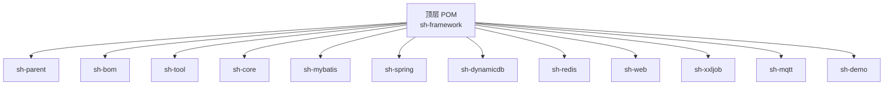
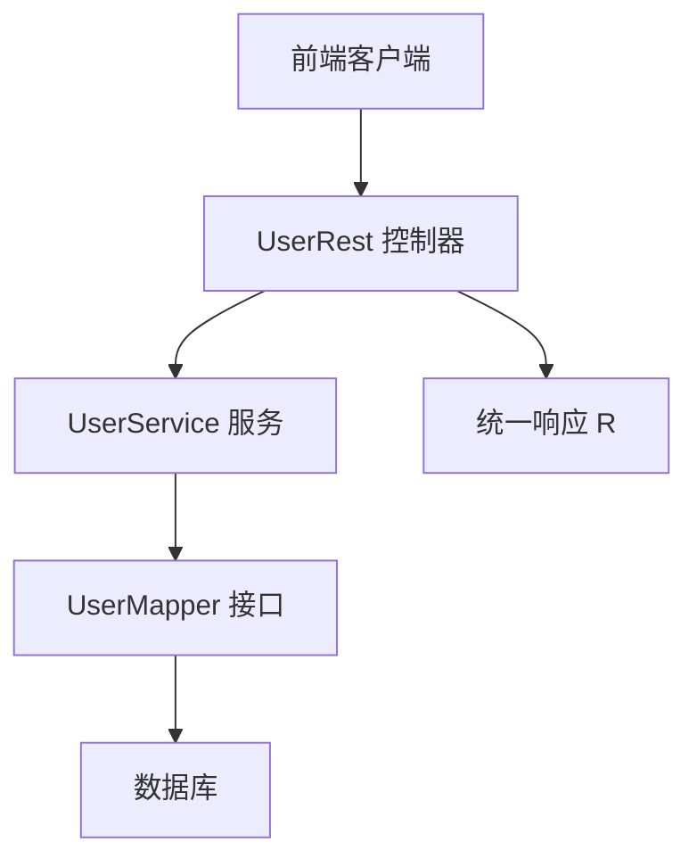
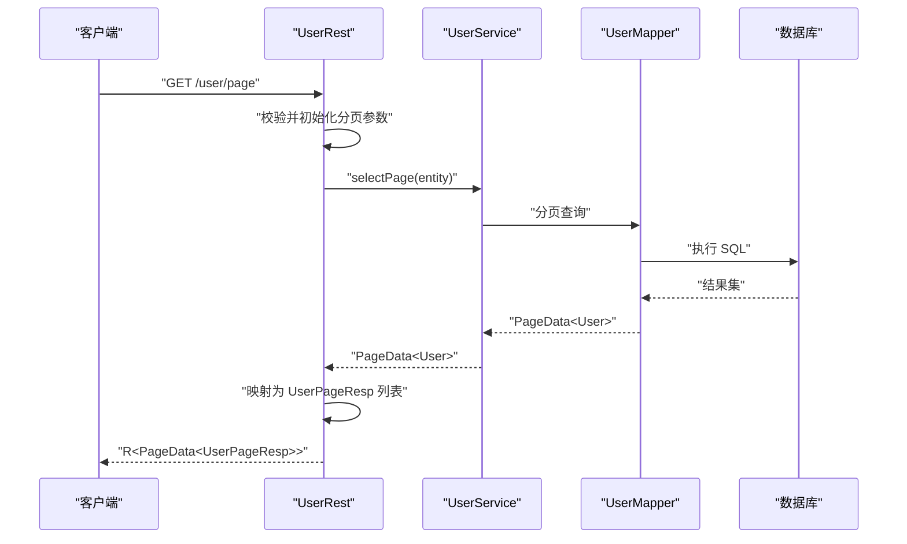
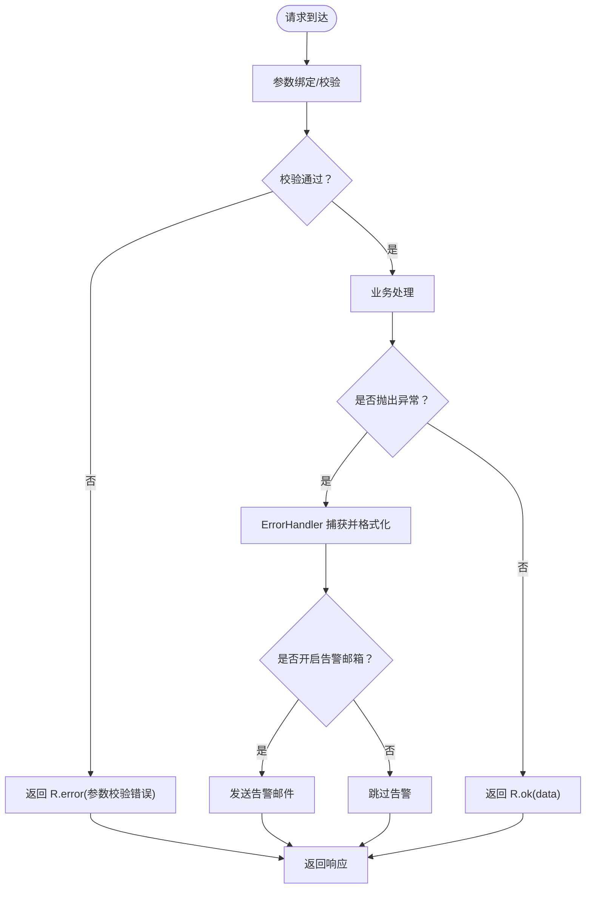
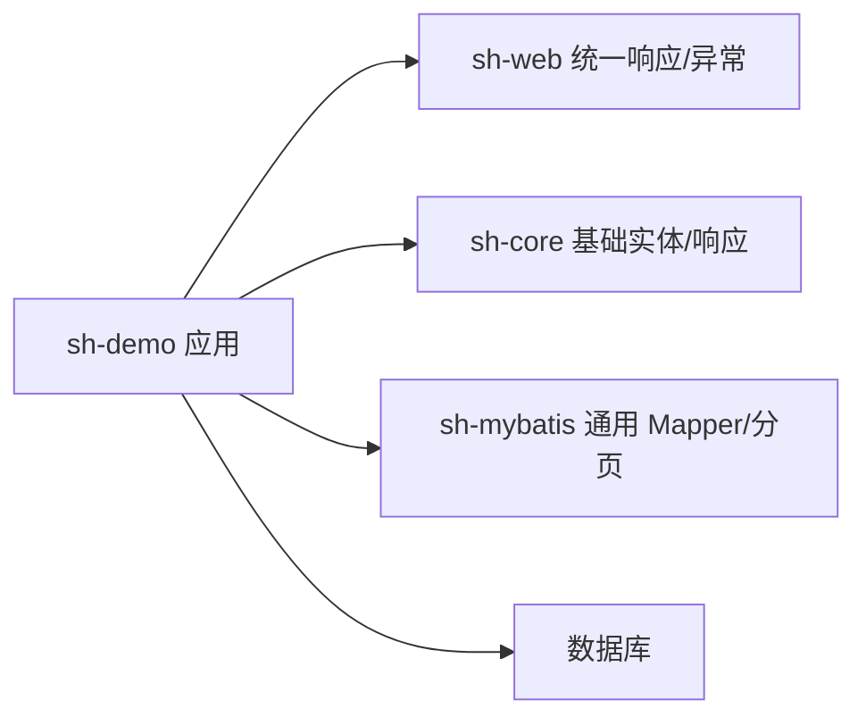

# 开发指南

<cite>
**本文引用的文件**
- [pom.xml](file://pom.xml)
- [README.md](file://README.md)
- [DemoApplication.java](file://sh-demo/src/main/java/com/wkclz/demo/DemoApplication.java)
- [application.yml](file://sh-demo/src/main/resources/config/application.yml)
- [BaseEntity.java](file://sh-core/src/main/java/com/wkclz/core/base/BaseEntity.java)
- [R.java](file://sh-core/src/main/java/com/wkclz/core/base/R.java)
- [UserRest.java](file://sh-demo/src/main/java/com/wkclz/demo/rest/UserRest.java)
- [UserService.java](file://sh-demo/src/main/java/com/wkclz/demo/service/UserService.java)
- [UserMapper.java](file://sh-demo/src/main/java/com/wkclz/demo/mapper/UserMapper.java)
- [User.java](file://sh-demo/src/main/java/com/wkclz/demo/bean/entity/User.java)
- [UserCreateReq.java](file://sh-demo/src/main/java/com/wkclz/demo/bean/vo/user/UserCreateReq.java)
- [UserPageReq.java](file://sh-demo/src/main/java/com/wkclz/demo/bean/vo/user/UserPageReq.java)
- [UserUpdateReq.java](file://sh-demo/src/main/java/com/wkclz/demo/bean/vo/user/UserUpdateReq.java)
- [PageReq.java](file://sh-web/src/main/java/com/wkclz/web/bean/PageReq.java)
- [EntityResp.java](file://sh-web/src/main/java/com/wkclz/web/bean/EntityResp.java)
- [ErrorHandler.java](file://sh-web/src/main/java/com/wkclz/web/rest/ErrorHandler.java)
</cite>

## 目录
1. [简介](#简介)
2. [项目结构](#项目结构)
3. [核心组件](#核心组件)
4. [架构总览](#架构总览)
5. [详细组件分析](#详细组件分析)
6. [依赖分析](#依赖分析)
7. [性能考虑](#性能考虑)
8. [故障排查指南](#故障排查指南)
9. [结论](#结论)
10. [附录](#附录)

## 简介
本指南面向使用 sh-framework 的开发者，系统讲解基于“实体-请求-服务-持久层-接口”的 CRUD 标准范式落地流程，并覆盖项目搭建、模块依赖、数据库连接、环境变量、最佳实践、常见问题、单元测试、模块扩展、性能优化与监控等主题。示例以 sh-demo 模块中的用户管理为例，贯穿从实体定义到 REST 接口的完整链路。

## 项目结构
sh-framework 采用 Maven 多模块聚合工程组织，顶层 POM 声明了各子模块，示例应用 sh-demo 展示了标准范式的完整实现路径。

图示来源
- [pom.xml:21-34](file://pom.xml#L21-L34)

章节来源
- [pom.xml:1-36](file://pom.xml#L1-L36)
- [README.md:1-3](file://README.md#L1-L3)

## 核心组件
- 统一响应模型 R：封装 code、msg、data 及请求/响应时间、耗时，提供 ok/error/warn 等静态工厂方法，确保前后端一致的响应契约。
- 分页基类 PageReq：提供 current、size、offset 初始化与校验，保证分页参数合法化。
- 实体基类 BaseEntity：继承 DbColumnEntity 并实现 Pageable，内置创建/更新人、租户/用户上下文字段、时间范围与关键词检索等通用属性，以及拷贝工具方法。
- Web 层统一异常处理 ErrorHandler：集中捕获各类异常，输出结构化错误响应，并可选发送告警邮件。

章节来源
- [R.java:1-76](file://sh-core/src/main/java/com/wkclz/core/base/R.java#L1-L76)
- [PageReq.java:1-45](file://sh-web/src/main/java/com/wkclz/web/bean/PageReq.java#L1-L45)
- [BaseEntity.java:1-94](file://sh-core/src/main/java/com/wkclz/core/base/BaseEntity.java#L1-L94)
- [ErrorHandler.java:1-267](file://sh-web/src/main/java/com/wkclz/web/rest/ErrorHandler.java#L1-L267)

## 架构总览
下图展示示例应用的典型调用链：前端请求经 REST 控制器进入，控制器调用 Service，Service 基于 MyBatis Mapper 进行数据库访问，最终通过统一响应模型返回。

图示来源
- [UserRest.java:22-98](file://sh-demo/src/main/java/com/wkclz/demo/rest/UserRest.java#L22-L98)
- [UserService.java:8-12](file://sh-demo/src/main/java/com/wkclz/demo/service/UserService.java#L8-L12)
- [UserMapper.java:7-10](file://sh-demo/src/main/java/com/wkclz/demo/mapper/UserMapper.java#L7-L10)
- [R.java:12-76](file://sh-core/src/main/java/com/wkclz/core/base/R.java#L12-L76)

## 详细组件分析

### 实体与 VO/DTO 设计
- 实体 User：继承 BaseEntity，承载用户核心字段；通过 Swagger 注解描述字段含义与示例，便于文档生成与联调。
- 请求对象：
  - UserCreateReq：创建场景的入参，包含必填校验与示例。
  - UserPageReq：继承 PageReq，扩展按字段模糊查询能力。
  - UserUpdateReq：继承 UpdateReq，用于选择性更新。
- 响应对象：
  - PageData 与 EntityResp：由框架提供，EntityResp 覆盖通用审计字段，便于统一返回。

章节来源
- [User.java:14-28](file://sh-demo/src/main/java/com/wkclz/demo/bean/entity/User.java#L14-L28)
- [UserCreateReq.java:12-29](file://sh-demo/src/main/java/com/wkclz/demo/bean/vo/user/UserCreateReq.java#L12-L29)
- [UserPageReq.java:9-24](file://sh-demo/src/main/java/com/wkclz/demo/bean/vo/user/UserPageReq.java#L9-L24)
- [UserUpdateReq.java:9-21](file://sh-demo/src/main/java/com/wkclz/demo/bean/vo/user/UserUpdateReq.java#L9-L21)
- [EntityResp.java:11-42](file://sh-web/src/main/java/com/wkclz/web/bean/EntityResp.java#L11-L42)

### REST 接口实现（CRUD）
- 分页查询：接收 UserPageReq，转换为实体后交由 Service 分页查询，再将实体列表映射为响应对象列表，最后统一封装为 PageData<R>。
- 详情查询：接收 IdReq，调用 Service 查询并映射为响应对象。
- 创建：接收 UserCreateReq，复制到实体后入库，返回创建后的响应对象。
- 更新：接收 UserUpdateReq，执行选择性更新，返回影响行数。
- 删除：支持单个与批量删除，返回影响行数。
- 登录用户上下文：示例中通过 UserContext 注入当前用户信息，便于审计字段自动填充。

图示来源
- [UserRest.java:30-44](file://sh-demo/src/main/java/com/wkclz/demo/rest/UserRest.java#L30-L44)
- [UserService.java:9-11](file://sh-demo/src/main/java/com/wkclz/demo/service/UserService.java#L9-L11)
- [UserMapper.java:7-10](file://sh-demo/src/main/java/com/wkclz/demo/mapper/UserMapper.java#L7-L10)
- [PageReq.java:24-42](file://sh-web/src/main/java/com/wkclz/web/bean/PageReq.java#L24-L42)

章节来源
- [UserRest.java:22-98](file://sh-demo/src/main/java/com/wkclz/demo/rest/UserRest.java#L22-L98)

### 服务层与持久层
- BaseService：框架提供的通用服务基类，封装常用 CRUD 操作，简化业务实现。
- BaseMapper：框架提供的通用 Mapper 接口，结合 MyBatis 提供的 Provider 实现，减少重复 SQL。

章节来源
- [UserService.java:8-12](file://sh-demo/src/main/java/com/wkclz/demo/service/UserService.java#L8-L12)
- [UserMapper.java:7-10](file://sh-demo/src/main/java/com/wkclz/demo/mapper/UserMapper.java#L7-L10)

### 统一响应与异常处理
- 统一响应 R：所有接口返回 R<T>，包含 code、msg、data、请求/响应时间与耗时，便于前端统一处理。
- 全局异常处理 ErrorHandler：覆盖参数校验、SQL 语法、未找到资源、媒体类型不支持、通用异常等，输出结构化错误并可选发送邮件告警。

图示来源
- [ErrorHandler.java:99-148](file://sh-web/src/main/java/com/wkclz/web/rest/ErrorHandler.java#L99-L148)
- [R.java:37-76](file://sh-core/src/main/java/com/wkclz/core/base/R.java#L37-L76)

章节来源
- [R.java:1-76](file://sh-core/src/main/java/com/wkclz/core/base/R.java#L1-L76)
- [ErrorHandler.java:1-267](file://sh-web/src/main/java/com/wkclz/web/rest/ErrorHandler.java#L1-L267)

## 依赖分析
- 示例应用 sh-demo 依赖 sh-web 提供统一响应与异常处理、sh-mybatis 提供通用 Mapper 与分页能力、sh-core 提供基础实体与响应模型。
- 数据库连接与 MyBatis 配置位于示例应用的配置文件中，声明了数据源驱动、MyBatis 映射路径与分页插件参数。

图示来源
- [DemoApplication.java:7-8](file://sh-demo/src/main/java/com/wkclz/demo/DemoApplication.java#L7-L8)
- [application.yml:9-26](file://sh-demo/src/main/resources/config/application.yml#L9-L26)

章节来源
- [DemoApplication.java:1-15](file://sh-demo/src/main/java/com/wkclz/demo/DemoApplication.java#L1-L15)
- [application.yml:1-26](file://sh-demo/src/main/resources/config/application.yml#L1-L26)

## 性能考虑
- 分页参数合法性：PageReq.init 对 current 与 size 进行默认值与边界校验，避免无效分页导致的全表扫描。
- 字段映射与拷贝：示例中使用 BeanUtils 进行对象拷贝，建议在大批量映射时评估性能，必要时采用更高效的映射方案。
- SQL 优化：结合 MyBatis 拦截器与 Provider 生成的 SQL，确保索引命中与查询条件合理。
- 缓存策略：可引入 sh-redis 模块进行热点数据缓存，降低数据库压力。
- 日志与监控：利用统一异常处理的错误日志与可选邮件告警，结合系统监控指标（如响应时间、错误率、数据库慢查询）进行持续优化。

## 故障排查指南
- 参数校验失败：检查请求体与路径参数是否符合 VO 定义的约束，关注 MethodArgumentNotValidException 与 BindException 的处理。
- SQL 语法错误：确认 SQL 语句与表结构一致性，关注 BadSqlGrammarException、SQLSyntaxErrorException 的处理。
- 未找到资源：确认路由与 ID 是否正确，NoResourceFoundException 将被统一转为 404。
- 通用异常：非预期异常会被捕获并格式化为统一错误响应，同时记录详细日志，必要时开启告警邮件以便快速定位。

章节来源
- [ErrorHandler.java:49-148](file://sh-web/src/main/java/com/wkclz/web/rest/ErrorHandler.java#L49-L148)

## 结论
sh-framework 通过统一响应、异常处理、分页基类与通用 Mapper，显著降低了 CRUD 类业务的样板代码成本。遵循本文的实体-请求-服务-持久层-接口范式，可在 sh-demo 的基础上快速扩展更多领域模型与接口，同时保持一致的开发体验与质量标准。

## 附录

### 项目搭建与配置清单
- 模块依赖：在父级 POM 中声明所需模块，示例应用 sh-demo 即为标准范式演示。
- 数据库连接：在示例应用配置文件中设置数据源驱动与连接参数。
- MyBatis 配置：指定 mapper XML 路径与驼峰映射，启用分页插件。
- 环境变量：通过 Spring Profile 切换不同环境配置，示例中已声明激活 profile。

章节来源
- [pom.xml:21-34](file://pom.xml#L21-L34)
- [application.yml:1-26](file://sh-demo/src/main/resources/config/application.yml#L1-L26)

### 最佳实践建议
- 代码规范：统一使用 Lombok 简化 POJO，使用 Swagger 注解完善接口文档。
- 命名约定：包名采用领域模型分层命名，类名清晰表达职责。
- 架构设计：严格分层，控制器只做编排与参数处理，服务层专注业务，持久层专注数据访问。
- 安全与可观测性：统一异常处理与日志输出，必要时开启告警邮件。

### 单元测试与覆盖率
- 测试建议：针对 Service 与工具类编写单元测试，覆盖正常路径与边界条件；对异常分支进行断言验证。
- 覆盖率目标：建议关键路径覆盖率不低于 80%，核心业务逻辑不低于 90%。

### 模块扩展方法
- 新建功能模块：参考 sh-demo 的目录结构，新增实体、VO、Mapper、Service、REST 控制器与测试。
- 集成第三方组件：在对应模块中添加依赖与自动装配配置，遵循 Spring Boot 自动配置约定。

### 性能优化与监控指标
- 性能优化：分页参数校验、SQL 索引优化、缓存热点数据、日志脱敏与限流。
- 监控指标：请求量、错误率、P99 延迟、数据库慢查询、GC 与内存使用情况。