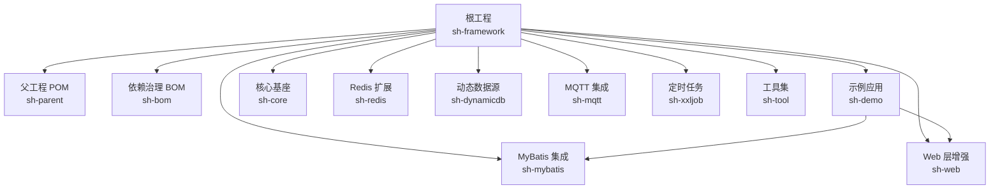
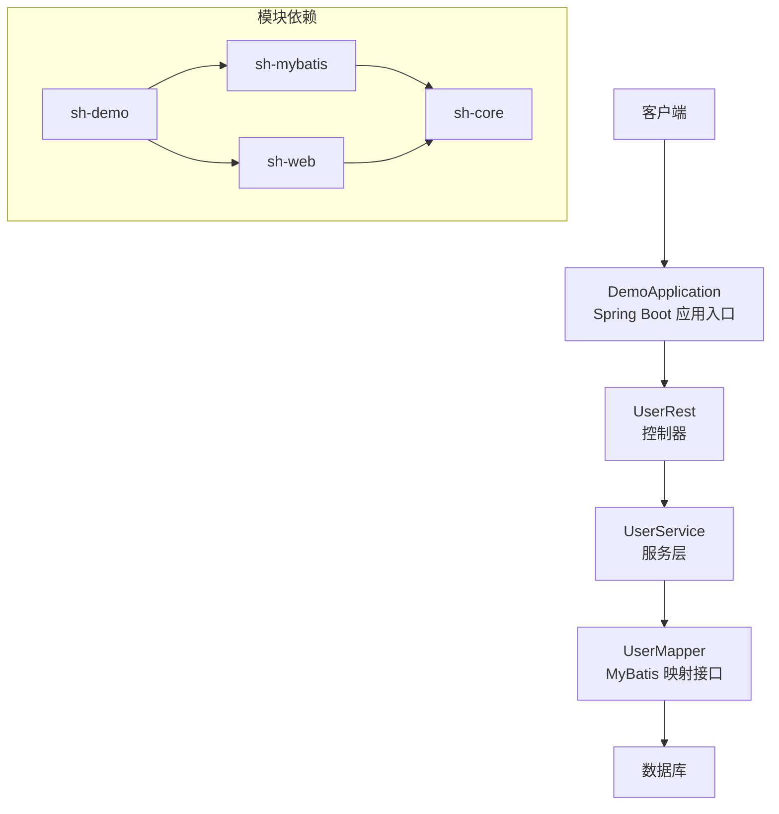
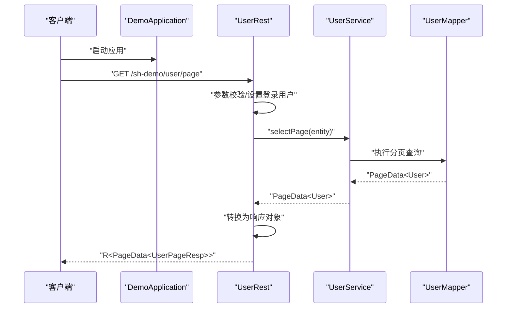
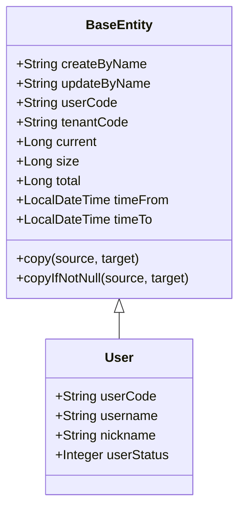
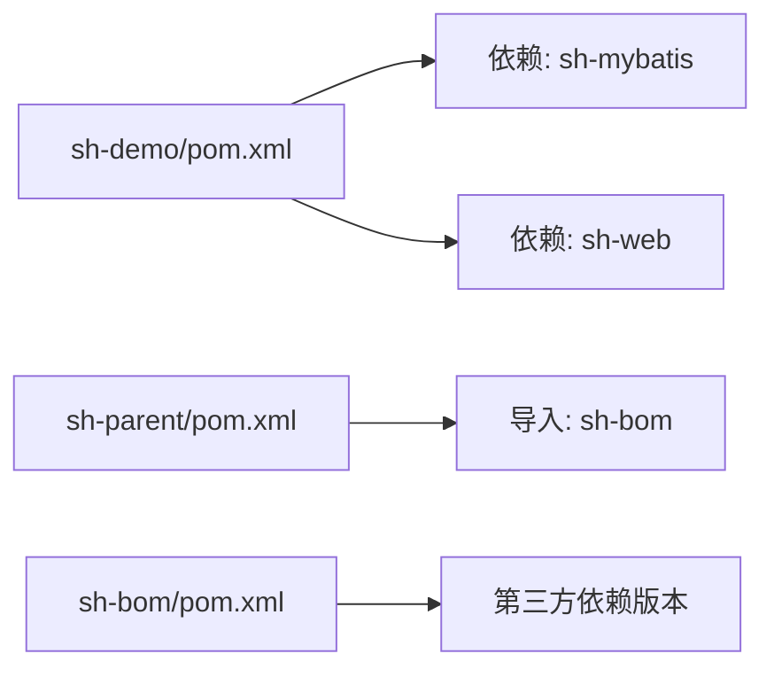

# 快速开始

<cite>
**本文引用的文件**
- [README.md](file://README.md)
- [pom.xml](file://pom.xml)
- [sh-parent/pom.xml](file://sh-parent/pom.xml)
- [sh-bom/pom.xml](file://sh-bom/pom.xml)
- [sh-demo/pom.xml](file://sh-demo/pom.xml)
- [sh-demo/src/main/java/com/wkclz/demo/DemoApplication.java](file://sh-demo/src/main/java/com/wkclz/demo/DemoApplication.java)
- [sh-demo/src/main/resources/config/application.yml](file://sh-demo/src/main/resources/config/application.yml)
- [sh-demo/src/main/java/com/wkclz/demo/rest/UserRest.java](file://sh-demo/src/main/java/com/wkclz/demo/rest/UserRest.java)
- [sh-demo/src/main/java/com/wkclz/demo/rest/Route.java](file://sh-demo/src/main/java/com/wkclz/demo/rest/Route.java)
- [sh-demo/src/main/java/com/wkclz/demo/service/UserService.java](file://sh-demo/src/main/java/com/wkclz/demo/service/UserService.java)
- [sh-demo/src/main/java/com/wkclz/demo/mapper/UserMapper.java](file://sh-demo/src/main/java/com/wkclz/demo/mapper/UserMapper.java)
- [sh-demo/src/main/java/com/wkclz/demo/bean/entity/User.java](file://sh-demo/src/main/java/com/wkclz/demo/bean/entity/User.java)
- [sh-core/src/main/java/com/wkclz/core/base/BaseEntity.java](file://sh-core/src/main/java/com/wkclz/core/base/BaseEntity.java)
- [sh-web/src/main/java/com/wkclz/web/ShWebAutoConfig.java](file://sh-web/src/main/java/com/wkclz/web/ShWebAutoConfig.java)
- [sh-mybatis/src/main/java/com/wkclz/mybatis/ShMyBatisAutoConfig.java](file://sh-mybatis/src/main/java/com/wkclz/mybatis/ShMyBatisAutoConfig.java)
</cite>

## 目录
1. [简介](#简介)
2. [项目结构](#项目结构)
3. [核心组件](#核心组件)
4. [架构概览](#架构概览)
5. [详细组件分析](#详细组件分析)
6. [依赖分析](#依赖分析)
7. [性能考虑](#性能考虑)
8. [故障排查指南](#故障排查指南)
9. [结论](#结论)
10. [附录](#附录)

## 简介
本指南面向首次接触 sh-framework 的开发者，目标是在约 30 分钟内完成从零到一的最小可运行示例，涵盖环境准备、项目初始化、依赖配置、基础运行与验证，并对常见问题提供解决方案。示例基于内置的 CRUD 示例模块，展示用户管理的完整流程。

## 项目结构
sh-framework 采用多模块聚合工程组织，顶层 POM 声明了所有子模块；各模块职责清晰，示例应用位于 sh-demo，核心能力由 sh-core、sh-web、sh-mybatis 等模块提供。

图表来源
- [pom.xml:21-34](file://pom.xml#L21-L34)
- [sh-parent/pom.xml:20-86](file://sh-parent/pom.xml#L20-L86)

章节来源
- [pom.xml:1-36](file://pom.xml#L1-L36)
- [sh-parent/pom.xml:1-247](file://sh-parent/pom.xml#L1-L247)

## 核心组件
- sh-core：提供统一响应、分页、异常体系、用户上下文等基础能力。
- sh-web：提供 Web 自动装配、统一异常处理、请求/响应辅助等。
- sh-mybatis：提供通用 Mapper、拦截器、分页、表结构信息等。
- sh-demo：示例应用，演示标准 CRUD 流程与路由组织方式。

章节来源
- [sh-core/src/main/java/com/wkclz/core/base/BaseEntity.java:1-94](file://sh-core/src/main/java/com/wkclz/core/base/BaseEntity.java#L1-L94)
- [sh-web/src/main/java/com/wkclz/web/ShWebAutoConfig.java:1-12](file://sh-web/src/main/java/com/wkclz/web/ShWebAutoConfig.java#L1-L12)
- [sh-mybatis/src/main/java/com/wkclz/mybatis/ShMyBatisAutoConfig.java:1-14](file://sh-mybatis/src/main/java/com/wkclz/mybatis/ShMyBatisAutoConfig.java#L1-L14)

## 架构概览
下图展示了示例应用从请求到数据库访问的整体调用链路，以及各模块间的依赖关系。

图表来源
- [sh-demo/src/main/java/com/wkclz/demo/DemoApplication.java:1-15](file://sh-demo/src/main/java/com/wkclz/demo/DemoApplication.java#L1-L15)
- [sh-demo/src/main/java/com/wkclz/demo/rest/UserRest.java:1-98](file://sh-demo/src/main/java/com/wkclz/demo/rest/UserRest.java#L1-L98)
- [sh-demo/src/main/java/com/wkclz/demo/service/UserService.java:1-12](file://sh-demo/src/main/java/com/wkclz/demo/service/UserService.java#L1-L12)
- [sh-demo/src/main/java/com/wkclz/demo/mapper/UserMapper.java:1-10](file://sh-demo/src/main/java/com/wkclz/demo/mapper/UserMapper.java#L1-L10)

## 详细组件分析

### 示例应用启动与路由
- DemoApplication：标准 Spring Boot 入口，开启 Mapper 扫描。
- Route：统一定义 REST 路由前缀与各接口路径，便于集中管理。
- UserRest：实现分页查询、详情、创建、更新、删除等标准 CRUD 接口。
- UserService：继承通用服务基类，复用通用能力。
- UserMapper：继承通用 Mapper 接口，配合 XML 实现 SQL。

图表来源
- [sh-demo/src/main/java/com/wkclz/demo/DemoApplication.java:1-15](file://sh-demo/src/main/java/com/wkclz/demo/DemoApplication.java#L1-L15)
- [sh-demo/src/main/java/com/wkclz/demo/rest/UserRest.java:30-44](file://sh-demo/src/main/java/com/wkclz/demo/rest/UserRest.java#L30-L44)
- [sh-demo/src/main/java/com/wkclz/demo/service/UserService.java:1-12](file://sh-demo/src/main/java/com/wkclz/demo/service/UserService.java#L1-L12)
- [sh-demo/src/main/java/com/wkclz/demo/mapper/UserMapper.java:1-10](file://sh-demo/src/main/java/com/wkclz/demo/mapper/UserMapper.java#L1-L10)

章节来源
- [sh-demo/src/main/java/com/wkclz/demo/DemoApplication.java:1-15](file://sh-demo/src/main/java/com/wkclz/demo/DemoApplication.java#L1-L15)
- [sh-demo/src/main/java/com/wkclz/demo/rest/Route.java:1-25](file://sh-demo/src/main/java/com/wkclz/demo/rest/Route.java#L1-L25)
- [sh-demo/src/main/java/com/wkclz/demo/rest/UserRest.java:1-98](file://sh-demo/src/main/java/com/wkclz/demo/rest/UserRest.java#L1-L98)
- [sh-demo/src/main/java/com/wkclz/demo/service/UserService.java:1-12](file://sh-demo/src/main/java/com/wkclz/demo/service/UserService.java#L1-L12)
- [sh-demo/src/main/java/com/wkclz/demo/mapper/UserMapper.java:1-10](file://sh-demo/src/main/java/com/wkclz/demo/mapper/UserMapper.java#L1-L10)

### 数据模型与基类
- BaseEntity：统一字段（创建人、租户、分页、时间范围等），提供拷贝工具方法。
- User：示例实体，继承 BaseEntity，包含用户基本信息。

图表来源
- [sh-core/src/main/java/com/wkclz/core/base/BaseEntity.java:1-94](file://sh-core/src/main/java/com/wkclz/core/base/BaseEntity.java#L1-L94)
- [sh-demo/src/main/java/com/wkclz/demo/bean/entity/User.java:1-28](file://sh-demo/src/main/java/com/wkclz/demo/bean/entity/User.java#L1-L28)

章节来源
- [sh-core/src/main/java/com/wkclz/core/base/BaseEntity.java:1-94](file://sh-core/src/main/java/com/wkclz/core/base/BaseEntity.java#L1-L94)
- [sh-demo/src/main/java/com/wkclz/demo/bean/entity/User.java:1-28](file://sh-demo/src/main/java/com/wkclz/demo/bean/entity/User.java#L1-L28)

## 依赖分析
- sh-parent：统一管理编译版本、依赖版本、插件配置与扁平化 POM。
- sh-bom：集中声明第三方依赖版本，避免版本漂移。
- sh-demo：仅引入 sh-mybatis 与 sh-web，即可获得 Web 与持久化能力。
- sh-web/sh-mybatis：通过自动装配与组件扫描，按需启用功能。

图表来源
- [sh-demo/pom.xml:21-31](file://sh-demo/pom.xml#L21-L31)
- [sh-parent/pom.xml:32-40](file://sh-parent/pom.xml#L32-L40)
- [sh-bom/pom.xml:53-280](file://sh-bom/pom.xml#L53-L280)

章节来源
- [sh-demo/pom.xml:1-42](file://sh-demo/pom.xml#L1-L42)
- [sh-parent/pom.xml:1-247](file://sh-parent/pom.xml#L1-L247)
- [sh-bom/pom.xml:1-285](file://sh-bom/pom.xml#L1-L285)

## 性能考虑
- 使用分页查询与合理索引，避免一次性加载大量数据。
- 利用通用 Mapper 的选择性更新，减少不必要的字段写入。
- 控制日志输出级别，避免在高并发场景下产生过多 I/O。
- 合理配置连接池与超时策略，避免资源泄露。

## 故障排查指南
- 启动失败或端口占用
  - 检查 application.yml 中 server.port 是否被占用，必要时修改为未占用端口。
  - 参考路径：[application.yml:1-26](file://sh-demo/src/main/resources/config/application.yml#L1-L26)
- 数据库连接异常
  - 确认 datasource 配置正确，驱动类名与连接地址无误。
  - 参考路径：[application.yml:9-12](file://sh-demo/src/main/resources/config/application.yml#L9-L12)
- MyBatis 映射未生效
  - 确保 Mapper 接口上存在 @Mapper 注解，且 MapperScan 范围覆盖到该接口。
  - 参考路径：[UserMapper.java:1-10](file://sh-demo/src/main/java/com/wkclz/demo/mapper/UserMapper.java#L1-L10)
- 控制器无法访问
  - 确认 @SpringBootApplication 已启用组件扫描，且控制器包路径正确。
  - 参考路径：[DemoApplication.java:1-15](file://sh-demo/src/main/java/com/wkclz/demo/DemoApplication.java#L1-L15)
- 分页参数无效
  - 确认请求中携带分页参数 current 与 size，或使用 Pageable 参数绑定。
  - 参考路径：[BaseEntity.java:41-48](file://sh-core/src/main/java/com/wkclz/core/base/BaseEntity.java#L41-L48)
- 登录用户上下文缺失
  - 示例接口在处理前设置了用户上下文，若业务需要，请确保上下文设置逻辑符合实际需求。
  - 参考路径：[UserRest.java:91-96](file://sh-demo/src/main/java/com/wkclz/demo/rest/UserRest.java#L91-L96)

## 结论
通过本指南，您已掌握在 30 分钟内从零搭建并运行第一个 sh-framework CRUD 示例的全流程。建议在本地先完成一次完整验证后，再逐步引入数据库、Redis、MQTT 等扩展模块，按需启用动态数据源与定时任务等高级特性。

## 附录

### 环境准备与安装步骤
- JDK 25
  - 确保本地 JDK 版本为 25，编译与运行均使用该版本。
  - 参考路径：[sh-parent/pom.xml:23-26](file://sh-parent/pom.xml#L23-L26)
- Maven
  - 使用 Maven 3.6+，确保网络可访问中央仓库与快照仓库。
  - 参考路径：[pom.xml:15-19](file://pom.xml#L15-L19)

### 项目初始化与运行
- 初始化
  - 在本地克隆仓库后，使用 Maven 清理并安装所有模块，确保依赖下载完成。
  - 参考路径：[pom.xml:21-34](file://pom.xml#L21-L34)
- 运行示例应用
  - 在 sh-demo 模块中执行 Spring Boot 启动类。
  - 参考路径：[DemoApplication.java:11-13](file://sh-demo/src/main/java/com/wkclz/demo/DemoApplication.java#L11-L13)
- 访问接口
  - 使用浏览器或 API 工具访问示例路由前缀 /sh-demo 下的各接口。
  - 参考路径：[Route.java:9](file://sh-demo/src/main/java/com/wkclz/demo/rest/Route.java#L9)

### IDE 配置建议
- 编译器版本
  - 将项目编译版本设置为 JDK 25，避免兼容性问题。
  - 参考路径：[sh-parent/pom.xml:23-26](file://sh-parent/pom.xml#L23-L26)
- Lombok 支持
  - 开启注解处理器支持，避免 Lombok 生成的 getter/setter 等方法报错。
  - 参考路径：[sh-parent/pom.xml:207-212](file://sh-parent/pom.xml#L207-L212)
- 组件扫描
  - 确保 Spring Boot 启动类所在包可扫描到控制器与服务层。
  - 参考路径：[DemoApplication.java:7-8](file://sh-demo/src/main/java/com/wkclz/demo/DemoApplication.java#L7-L8)

### 常见初始化问题与解决方案
- 依赖解析失败
  - 检查网络与代理设置，必要时配置镜像仓库。
- 插件版本不匹配
  - 使用 sh-parent 提供的插件版本，避免手动升级导致的不兼容。
  - 参考路径：[sh-parent/pom.xml:164-243](file://sh-parent/pom.xml#L164-L243)
- 自动装配未生效
  - 确认 sh-web 与 sh-mybatis 的自动装配类已启用，或在启动类中添加相应扫描。
  - 参考路径：[ShWebAutoConfig.java:1-12](file://sh-web/src/main/java/com/wkclz/web/ShWebAutoConfig.java#L1-L12)
  - 参考路径：[ShMyBatisAutoConfig.java:1-14](file://sh-mybatis/src/main/java/com/wkclz/mybatis/ShMyBatisAutoConfig.java#L1-L14)