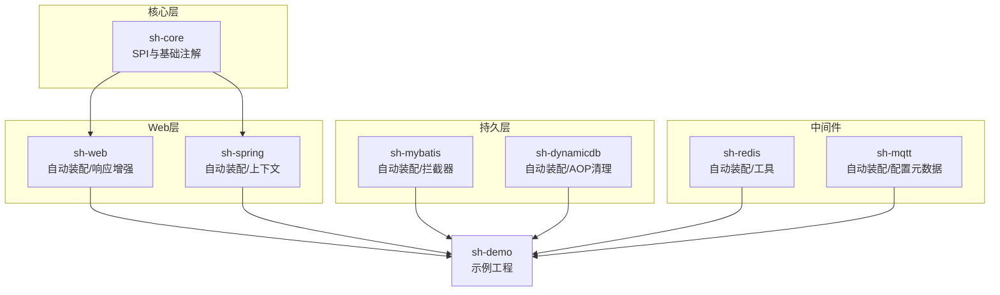
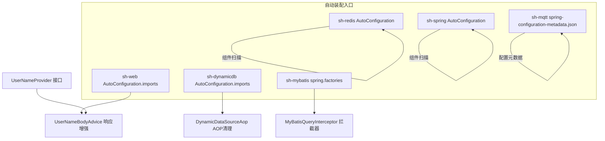
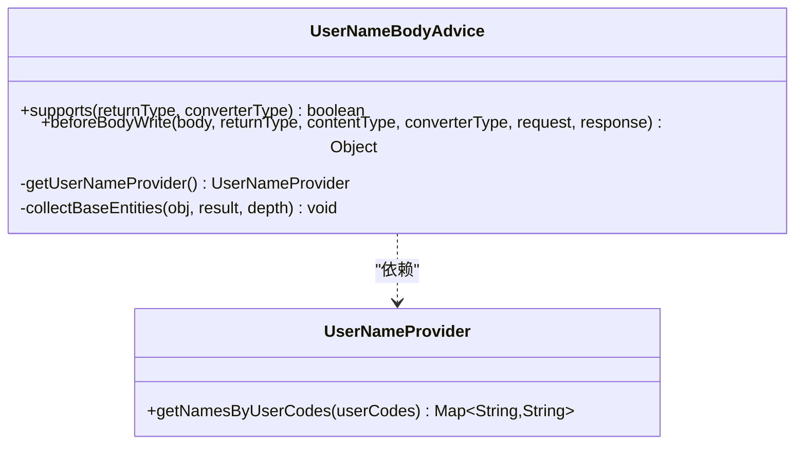
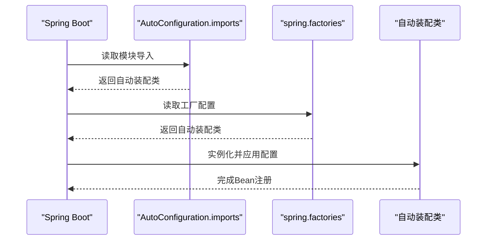
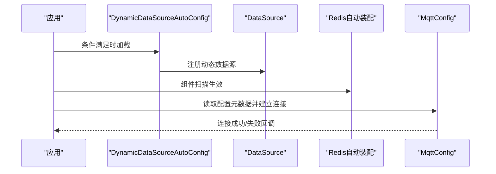
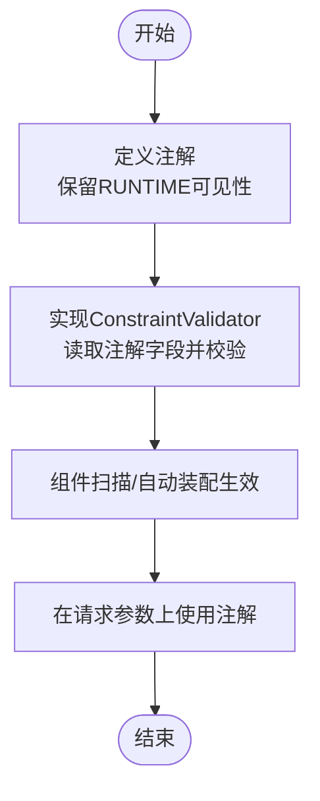
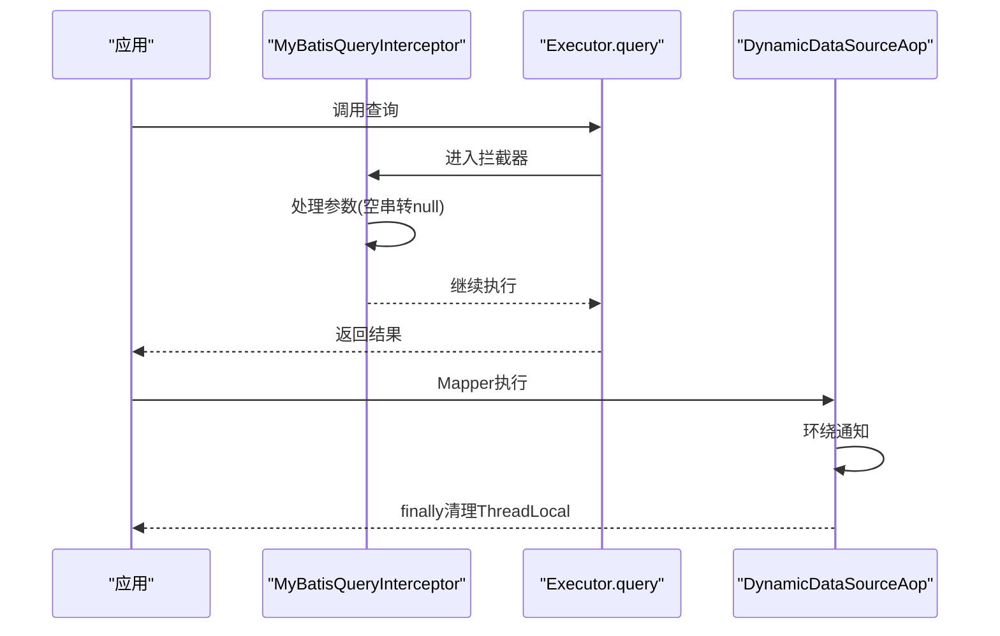
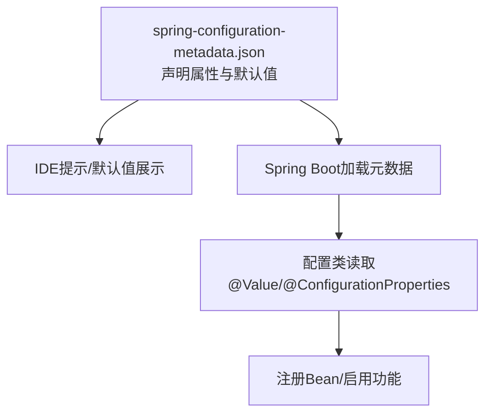
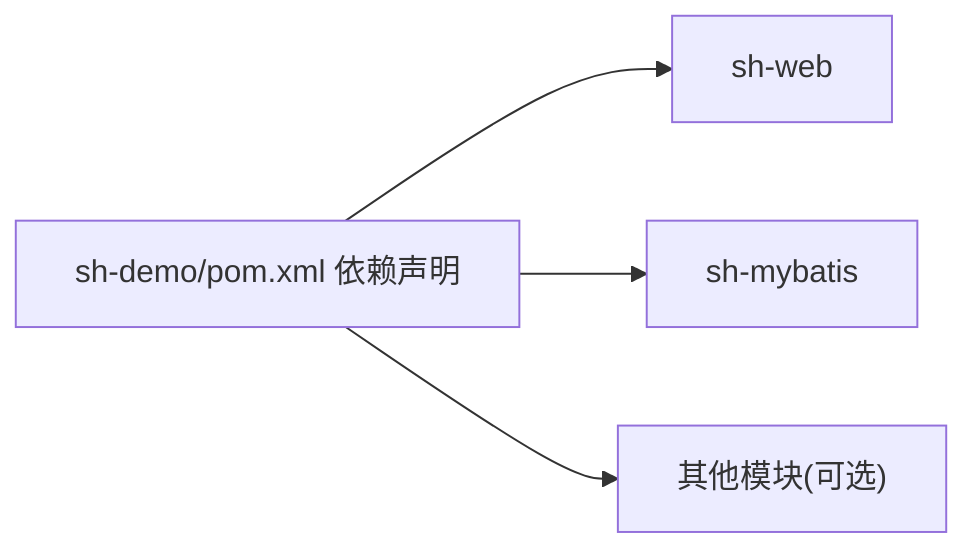

# 扩展开发

<cite>
**本文引用的文件**
- [sh-core/src/main/java/com/wkclz/core/spi/UserNameProvider.java](file://sh-core/src/main/java/com/wkclz/core/spi/UserNameProvider.java)
- [sh-web/src/main/java/com/wkclz/web/rest/UserNameBodyAdvice.java](file://sh-web/src/main/java/com/wkclz/web/rest/UserNameBodyAdvice.java)
- [sh-dynamicdb/src/main/resources/META-INF/spring/org.springframework.boot.autoconfigure.AutoConfiguration.imports](file://sh-dynamicdb/src/main/resources/META-INF/spring/org.springframework.boot.autoconfigure.AutoConfiguration.imports)
- [sh-mqtt/src/main/resources/META-INF/spring-configuration-metadata.json](file://sh-mqtt/src/main/resources/META-INF/spring-configuration-metadata.json)
- [sh-mybatis/src/main/resources/META-INF/spring.factories](file://sh-mybatis/src/main/resources/META-INF/spring.factories)
- [sh-web/src/main/resources/META-INF/spring/org.springframework.boot.autoconfigure.AutoConfiguration.imports](file://sh-web/src/main/resources/META-INF/spring/org.springframework.boot.autoconfigure.AutoConfiguration.imports)
- [sh-redis/src/main/java/com/wkclz/redis/ShRedisAutoConfig.java](file://sh-redis/src/main/java/com/wkclz/redis/ShRedisAutoConfig.java)
- [sh-spring/src/main/java/com/wkclz/spring/ShSpringAutoConfig.java](file://sh-spring/src/main/java/com/wkclz/spring/ShSpringAutoConfig.java)
- [sh-dynamicdb/src/main/java/com/wkclz/dynamicdb/config/DynamicDataSourceAutoConfig.java](file://sh-dynamicdb/src/main/java/com/wkclz/dynamicdb/config/DynamicDataSourceAutoConfig.java)
- [sh-mqtt/src/main/java/com/wkclz/mqtt/config/MqttConfig.java](file://sh-mqtt/src/main/java/com/wkclz/mqtt/config/MqttConfig.java)
- [sh-core/src/main/java/com/wkclz/core/annotation/ApiDesc.java](file://sh-core/src/main/java/com/wkclz/core/annotation/ApiDesc.java)
- [sh-web/src/main/java/com/wkclz/web/annotation/validator/AtLeastOneNotNullValidator.java](file://sh-web/src/main/java/com/wkclz/web/annotation/validator/AtLeastOneNotNullValidator.java)
- [sh-mybatis/src/main/java/com/wkclz/mybatis/interceptor/MyBatisQueryInterceptor.java](file://sh-mybatis/src/main/java/com/wkclz/mybatis/interceptor/MyBatisQueryInterceptor.java)
- [sh-dynamicdb/src/main/java/com/wkclz/dynamicdb/aop/DynamicDataSourceAop.java](file://sh-dynamicdb/src/main/java/com/wkclz/dynamicdb/aop/DynamicDataSourceAop.java)
- [sh-demo/pom.xml](file://sh-demo/pom.xml)
</cite>

## 目录
1. 引言
2. 项目结构
3. 核心组件
4. 架构总览
5. 详细组件分析
6. 依赖分析
7. 性能考虑
8. 故障排查指南
9. 结论
10. 附录

## 引言
本指南面向希望基于 sh-framework 框架进行扩展开发的工程师，系统讲解如何创建新功能模块、配置自动装配、利用 SPI 扩展点、集成第三方组件、开发自定义注解与拦截器/AOP 切面、扩展配置项，以及扩展模块的测试与发布流程。文档以仓库中现有模块为蓝本，提炼可复用的扩展模式与最佳实践。

## 项目结构
sh-framework 采用多模块聚合结构，核心能力通过独立模块提供，每个模块遵循“约定优于配置”的原则，通过 Spring Boot 的自动装配机制实现即插即用。典型模块包括：
- sh-core：基础能力与 SPI 扩展点定义
- sh-web：Web 层自动装配与响应增强
- sh-mybatis：MyBatis 自动装配与拦截器
- sh-dynamicdb：动态数据源自动装配与 AOP 清理
- sh-redis：Redis 自动装配与工具
- sh-mqtt：MQTT 客户端自动装配与配置元数据
- sh-spring：Spring 上下文与通用工具自动装配
- sh-tool：工具集
- sh-demo：示例工程，演示模块组合使用

图表来源
- [sh-web/src/main/resources/META-INF/spring/org.springframework.boot.autoconfigure.AutoConfiguration.imports:1-2](file://sh-web/src/main/resources/META-INF/spring/org.springframework.boot.autoconfigure.AutoConfiguration.imports#L1-L2)
- [sh-spring/src/main/java/com/wkclz/spring/ShSpringAutoConfig.java:1-13](file://sh-spring/src/main/java/com/wkclz/spring/ShSpringAutoConfig.java#L1-L13)
- [sh-mybatis/src/main/resources/META-INF/spring.factories:1-3](file://sh-mybatis/src/main/resources/META-INF/spring.factories#L1-L3)
- [sh-dynamicdb/src/main/resources/META-INF/spring/org.springframework.boot.autoconfigure.AutoConfiguration.imports:1-2](file://sh-dynamicdb/src/main/resources/META-INF/spring/org.springframework.boot.autoconfigure.AutoConfiguration.imports#L1-L2)
- [sh-redis/src/main/java/com/wkclz/redis/ShRedisAutoConfig.java:1-12](file://sh-redis/src/main/java/com/wkclz/redis/ShRedisAutoConfig.java#L1-L12)
- [sh-mqtt/src/main/resources/META-INF/spring-configuration-metadata.json:1-29](file://sh-mqtt/src/main/resources/META-INF/spring-configuration-metadata.json#L1-L29)
- [sh-demo/pom.xml:21-31](file://sh-demo/pom.xml#L21-L31)

章节来源
- [sh-demo/pom.xml:21-31](file://sh-demo/pom.xml#L21-L31)

## 核心组件
- SPI 扩展点：在核心模块定义扩展接口，其他模块按需实现并被框架自动发现与装配。
- 自动装配：通过 Spring Boot 的自动装配导入文件或 spring.factories 实现模块级自动装配。
- 响应增强：Web 层通过 Advice 在输出前注入扩展信息（如用户名映射）。
- 拦截器与 AOP：MyBatis 拦截器与动态数据源 AOP 切面分别在 SQL 执行前后注入行为。
- 配置元数据：通过 spring-configuration-metadata.json 提供 IDE 友好提示与默认值。

章节来源
- [sh-core/src/main/java/com/wkclz/core/spi/UserNameProvider.java:7-12](file://sh-core/src/main/java/com/wkclz/core/spi/UserNameProvider.java#L7-L12)
- [sh-web/src/main/java/com/wkclz/web/rest/UserNameBodyAdvice.java:23-96](file://sh-web/src/main/java/com/wkclz/web/rest/UserNameBodyAdvice.java#L23-L96)
- [sh-mybatis/src/main/java/com/wkclz/mybatis/interceptor/MyBatisQueryInterceptor.java:24-42](file://sh-mybatis/src/main/java/com/wkclz/mybatis/interceptor/MyBatisQueryInterceptor.java#L24-L42)
- [sh-dynamicdb/src/main/java/com/wkclz/dynamicdb/aop/DynamicDataSourceAop.java:16-27](file://sh-dynamicdb/src/main/java/com/wkclz/dynamicdb/aop/DynamicDataSourceAop.java#L16-L27)

## 架构总览
下图展示了模块间依赖与自动装配的关键交互路径，体现“约定即配置”的装配策略与“SPI 扩展点”驱动的可插拔特性。

图表来源
- [sh-web/src/main/resources/META-INF/spring/org.springframework.boot.autoconfigure.AutoConfiguration.imports:1-2](file://sh-web/src/main/resources/META-INF/spring/org.springframework.boot.autoconfigure.AutoConfiguration.imports#L1-L2)
- [sh-dynamicdb/src/main/resources/META-INF/spring/org.springframework.boot.autoconfigure.AutoConfiguration.imports:1-2](file://sh-dynamicdb/src/main/resources/META-INF/spring/org.springframework.boot.autoconfigure.AutoConfiguration.imports#L1-L2)
- [sh-redis/src/main/java/com/wkclz/redis/ShRedisAutoConfig.java:6-9](file://sh-redis/src/main/java/com/wkclz/redis/ShRedisAutoConfig.java#L6-L9)
- [sh-spring/src/main/java/com/wkclz/spring/ShSpringAutoConfig.java:7-10](file://sh-spring/src/main/java/com/wkclz/spring/ShSpringAutoConfig.java#L7-L10)
- [sh-mybatis/src/main/resources/META-INF/spring.factories:1-3](file://sh-mybatis/src/main/resources/META-INF/spring.factories#L1-L3)
- [sh-mqtt/src/main/resources/META-INF/spring-configuration-metadata.json:1-29](file://sh-mqtt/src/main/resources/META-INF/spring-configuration-metadata.json#L1-L29)
- [sh-core/src/main/java/com/wkclz/core/spi/UserNameProvider.java:7-12](file://sh-core/src/main/java/com/wkclz/core/spi/UserNameProvider.java#L7-L12)
- [sh-web/src/main/java/com/wkclz/web/rest/UserNameBodyAdvice.java:23-96](file://sh-web/src/main/java/com/wkclz/web/rest/UserNameBodyAdvice.java#L23-L96)
- [sh-dynamicdb/src/main/java/com/wkclz/dynamicdb/aop/DynamicDataSourceAop.java:16-27](file://sh-dynamicdb/src/main/java/com/wkclz/dynamicdb/aop/DynamicDataSourceAop.java#L16-L27)
- [sh-mybatis/src/main/java/com/wkclz/mybatis/interceptor/MyBatisQueryInterceptor.java:24-42](file://sh-mybatis/src/main/java/com/wkclz/mybatis/interceptor/MyBatisQueryInterceptor.java#L24-L42)

## 详细组件分析

### SPI 扩展机制：UserNameProvider 与 UserNameBodyAdvice
- SPI 接口定义：在核心模块定义 UserNameProvider，默认方法返回空映射，便于扩展方按需实现。
- 响应增强：Web 层 Advice 在序列化前扫描响应体中的实体字段，收集创建人/更新人代码，调用 UserNameProvider 获取名称映射并回填到实体中。
- 自动发现：Advice 通过 Spring 上下文查找 UserNameProvider 实例，首次检查后缓存，避免重复扫描。

图表来源
- [sh-core/src/main/java/com/wkclz/core/spi/UserNameProvider.java:7-12](file://sh-core/src/main/java/com/wkclz/core/spi/UserNameProvider.java#L7-L12)
- [sh-web/src/main/java/com/wkclz/web/rest/UserNameBodyAdvice.java:23-115](file://sh-web/src/main/java/com/wkclz/web/rest/UserNameBodyAdvice.java#L23-L115)

章节来源
- [sh-core/src/main/java/com/wkclz/core/spi/UserNameProvider.java:7-12](file://sh-core/src/main/java/com/wkclz/core/spi/UserNameProvider.java#L7-L12)
- [sh-web/src/main/java/com/wkclz/web/rest/UserNameBodyAdvice.java:23-115](file://sh-web/src/main/java/com/wkclz/web/rest/UserNameBodyAdvice.java#L23-L115)

### 自动装配配置：模块导入与工厂
- AutoConfiguration.imports：模块通过该文件声明自动装配类，Spring Boot 在启动时加载。
- spring.factories：在 EnableAutoConfiguration 键下声明自动装配类，兼容旧版机制。
- 组件扫描：部分模块通过 @AutoConfiguration + @ComponentScan 简化组件注册。

图表来源
- [sh-dynamicdb/src/main/resources/META-INF/spring/org.springframework.boot.autoconfigure.AutoConfiguration.imports:1-2](file://sh-dynamicdb/src/main/resources/META-INF/spring/org.springframework.boot.autoconfigure.AutoConfiguration.imports#L1-L2)
- [sh-web/src/main/resources/META-INF/spring/org.springframework.boot.autoconfigure.AutoConfiguration.imports:1-2](file://sh-web/src/main/resources/META-INF/spring/org.springframework.boot.autoconfigure.AutoConfiguration.imports#L1-L2)
- [sh-mybatis/src/main/resources/META-INF/spring.factories:1-3](file://sh-mybatis/src/main/resources/META-INF/spring.factories#L1-L3)
- [sh-redis/src/main/java/com/wkclz/redis/ShRedisAutoConfig.java:6-9](file://sh-redis/src/main/java/com/wkclz/redis/ShRedisAutoConfig.java#L6-L9)
- [sh-spring/src/main/java/com/wkclz/spring/ShSpringAutoConfig.java:7-10](file://sh-spring/src/main/java/com/wkclz/spring/ShSpringAutoConfig.java#L7-L10)

章节来源
- [sh-dynamicdb/src/main/resources/META-INF/spring/org.springframework.boot.autoconfigure.AutoConfiguration.imports:1-2](file://sh-dynamicdb/src/main/resources/META-INF/spring/org.springframework.boot.autoconfigure.AutoConfiguration.imports#L1-L2)
- [sh-web/src/main/resources/META-INF/spring/org.springframework.boot.autoconfigure.AutoConfiguration.imports:1-2](file://sh-web/src/main/resources/META-INF/spring/org.springframework.boot.autoconfigure.AutoConfiguration.imports#L1-L2)
- [sh-mybatis/src/main/resources/META-INF/spring.factories:1-3](file://sh-mybatis/src/main/resources/META-INF/spring.factories#L1-L3)
- [sh-redis/src/main/java/com/wkclz/redis/ShRedisAutoConfig.java:6-9](file://sh-redis/src/main/java/com/wkclz/redis/ShRedisAutoConfig.java#L6-L9)
- [sh-spring/src/main/java/com/wkclz/spring/ShSpringAutoConfig.java:7-10](file://sh-spring/src/main/java/com/wkclz/spring/ShSpringAutoConfig.java#L7-L10)

### 第三方组件集成：数据库驱动、缓存客户端、消息中间件
- 数据库驱动：动态数据源模块通过自动装配类注册 DataSource 与清理调度器，并在条件满足时启用动态数据源。
- 缓存客户端：Redis 模块通过自动装配类完成组件扫描与配置，便于直接使用 Redis 工具类。
- 消息中间件：MQTT 模块通过配置类与配置元数据提供连接参数、证书与回调处理，支持启用/禁用与自动重连。

图表来源
- [sh-dynamicdb/src/main/java/com/wkclz/dynamicdb/config/DynamicDataSourceAutoConfig.java:20-57](file://sh-dynamicdb/src/main/java/com/wkclz/dynamicdb/config/DynamicDataSourceAutoConfig.java#L20-L57)
- [sh-redis/src/main/java/com/wkclz/redis/ShRedisAutoConfig.java:6-9](file://sh-redis/src/main/java/com/wkclz/redis/ShRedisAutoConfig.java#L6-L9)
- [sh-mqtt/src/main/java/com/wkclz/mqtt/config/MqttConfig.java:61-119](file://sh-mqtt/src/main/java/com/wkclz/mqtt/config/MqttConfig.java#L61-L119)

章节来源
- [sh-dynamicdb/src/main/java/com/wkclz/dynamicdb/config/DynamicDataSourceAutoConfig.java:20-57](file://sh-dynamicdb/src/main/java/com/wkclz/dynamicdb/config/DynamicDataSourceAutoConfig.java#L20-L57)
- [sh-redis/src/main/java/com/wkclz/redis/ShRedisAutoConfig.java:6-9](file://sh-redis/src/main/java/com/wkclz/redis/ShRedisAutoConfig.java#L6-L9)
- [sh-mqtt/src/main/java/com/wkclz/mqtt/config/MqttConfig.java:61-119](file://sh-mqtt/src/main/java/com/wkclz/mqtt/config/MqttConfig.java#L61-L119)

### 自定义注解与验证器：注解定义、处理器实现与自动注册
- 注解定义：在核心模块定义注解，保留运行期可见性以便运行时解析。
- 验证器实现：实现 JSR-303 验证器接口，按注解声明的字段进行校验逻辑。
- 自动注册：验证器通常随组件扫描或 Spring Boot 自动装配生效；注解与验证器配合使用，实现参数级校验。

图表来源
- [sh-core/src/main/java/com/wkclz/core/annotation/ApiDesc.java:17-23](file://sh-core/src/main/java/com/wkclz/core/annotation/ApiDesc.java#L17-L23)
- [sh-web/src/main/java/com/wkclz/web/annotation/validator/AtLeastOneNotNullValidator.java:12-56](file://sh-web/src/main/java/com/wkclz/web/annotation/validator/AtLeastOneNotNullValidator.java#L12-L56)

章节来源
- [sh-core/src/main/java/com/wkclz/core/annotation/ApiDesc.java:17-23](file://sh-core/src/main/java/com/wkclz/core/annotation/ApiDesc.java#L17-L23)
- [sh-web/src/main/java/com/wkclz/web/annotation/validator/AtLeastOneNotNullValidator.java:12-56](file://sh-web/src/main/java/com/wkclz/web/annotation/validator/AtLeastOneNotNullValidator.java#L12-L56)

### 拦截器与 AOP 切面：扩展执行逻辑
- MyBatis 拦截器：在查询执行前对参数进行处理（如空字符串转 null），保持拦截器职责单一。
- 动态数据源 AOP：围绕 Mapper 执行进行环绕通知，在 finally 中清理 ThreadLocal，避免内存泄漏。

图表来源
- [sh-mybatis/src/main/java/com/wkclz/mybatis/interceptor/MyBatisQueryInterceptor.java:24-92](file://sh-mybatis/src/main/java/com/wkclz/mybatis/interceptor/MyBatisQueryInterceptor.java#L24-L92)
- [sh-dynamicdb/src/main/java/com/wkclz/dynamicdb/aop/DynamicDataSourceAop.java:16-27](file://sh-dynamicdb/src/main/java/com/wkclz/dynamicdb/aop/DynamicDataSourceAop.java#L16-L27)

章节来源
- [sh-mybatis/src/main/java/com/wkclz/mybatis/interceptor/MyBatisQueryInterceptor.java:24-92](file://sh-mybatis/src/main/java/com/wkclz/mybatis/interceptor/MyBatisQueryInterceptor.java#L24-L92)
- [sh-dynamicdb/src/main/java/com/wkclz/dynamicdb/aop/DynamicDataSourceAop.java:16-27](file://sh-dynamicdb/src/main/java/com/wkclz/dynamicdb/aop/DynamicDataSourceAop.java#L16-L27)

### 配置项扩展：新增属性与默认值
- 配置元数据：在模块资源目录下提供 spring-configuration-metadata.json，声明属性名、类型、默认值与描述，IDE 可获得智能提示。
- 配置类：通过 @Value 或绑定对象读取配置，结合条件装配实现按需启用。

图表来源
- [sh-mqtt/src/main/resources/META-INF/spring-configuration-metadata.json:1-29](file://sh-mqtt/src/main/resources/META-INF/spring-configuration-metadata.json#L1-L29)
- [sh-mqtt/src/main/java/com/wkclz/mqtt/config/MqttConfig.java:30-48](file://sh-mqtt/src/main/java/com/wkclz/mqtt/config/MqttConfig.java#L30-L48)

章节来源
- [sh-mqtt/src/main/resources/META-INF/spring-configuration-metadata.json:1-29](file://sh-mqtt/src/main/resources/META-INF/spring-configuration-metadata.json#L1-L29)
- [sh-mqtt/src/main/java/com/wkclz/mqtt/config/MqttConfig.java:30-48](file://sh-mqtt/src/main/java/com/wkclz/mqtt/config/MqttConfig.java#L30-L48)

## 依赖分析
- 模块耦合：各模块通过 sh-parent 聚合管理版本与插件；示例模块 sh-demo 显式引入 web 与 mybatis 模块，体现“按需组合”的装配思想。
- 自动装配依赖：模块通过 AutoConfiguration.imports 或 spring.factories 间接依赖于 Spring Boot 的自动装配基础设施。
- 运行时依赖：Web、MyBatis、动态数据源、Redis、MQTT 等模块在运行时相互独立，可通过引入不同模块实现差异化组合。

图表来源
- [sh-demo/pom.xml:21-31](file://sh-demo/pom.xml#L21-L31)

章节来源
- [sh-demo/pom.xml:21-31](file://sh-demo/pom.xml#L21-L31)

## 性能考虑
- 拦截器与 AOP：尽量保持拦截逻辑轻量，避免在热路径做重型计算；必要时使用缓存（如 Advice 中的 Provider 查找结果）。
- 动态数据源：清理任务与线程池配置需合理，避免资源泄露与线程池膨胀。
- 配置元数据：为常用配置提供合理默认值，减少运行时分支判断与空值处理成本。
- 响应增强：对深度遍历与反射访问进行限制与缓存，避免对大对象树造成性能压力。

## 故障排查指南
- SPI 未生效：确认 UserNameProvider 实现类被组件扫描到，且 Advice 能从上下文中获取到实现实例。
- 自动装配未触发：检查 AutoConfiguration.imports 或 spring.factories 是否正确，确保包路径与类名一致。
- MyBatis 拦截器无效：确认拦截器被 Spring 管理（@Component）且签名匹配 Executor.query。
- 动态数据源 AOP 未清理：检查切点表达式与 finally 逻辑，确保在异常情况下也能清理 ThreadLocal。
- MQTT 连接失败：核对配置项（端点、用户名、密码、CA 路径等），查看日志中的原因码与异常堆栈。

章节来源
- [sh-web/src/main/java/com/wkclz/web/rest/UserNameBodyAdvice.java:98-115](file://sh-web/src/main/java/com/wkclz/web/rest/UserNameBodyAdvice.java#L98-L115)
- [sh-dynamicdb/src/main/java/com/wkclz/dynamicdb/aop/DynamicDataSourceAop.java:16-27](file://sh-dynamicdb/src/main/java/com/wkclz/dynamicdb/aop/DynamicDataSourceAop.java#L16-L27)
- [sh-mqtt/src/main/java/com/wkclz/mqtt/config/MqttConfig.java:111-118](file://sh-mqtt/src/main/java/com/wkclz/mqtt/config/MqttConfig.java#L111-L118)

## 结论
sh-framework 通过“自动装配 + SPI 扩展 + 拦截器/AOP + 配置元数据”的组合，提供了清晰、可扩展且易于维护的模块化架构。开发者可据此快速创建新模块、集成第三方组件、扩展配置项与自定义注解，并通过合理的性能与故障排查策略保障线上稳定性。

## 附录

### 创建新功能模块的步骤清单
- 模块结构设计
  - 新建 Maven 模块，继承 sh-parent 版本与插件配置
  - 在 src/main/resources 下放置自动装配导入文件或 spring.factories
- 依赖配置
  - 在 sh-demo 或目标应用中引入新模块依赖
- 自动装配配置
  - 在 AutoConfiguration.imports 或 spring.factories 中声明自动装配类
  - 如需组件扫描，使用 @AutoConfiguration + @ComponentScan
- SPI 扩展点
  - 在核心模块定义接口，其他模块实现并被自动发现
- 第三方组件集成
  - 提供配置类与 spring-configuration-metadata.json，声明配置项与默认值
  - 在自动装配类中注册相关 Bean
- 自定义注解与验证器
  - 定义注解并在验证器中实现校验逻辑
  - 确保验证器随组件扫描生效
- 拦截器与 AOP 切面
  - 拦截器：实现 Interceptor 并标注 @Component，声明 @Intercepts
  - AOP：定义 Aspect 并在 finally 中清理状态
- 配置项扩展
  - 在模块资源目录提供 spring-configuration-metadata.json
  - 在配置类中读取 @Value 或绑定对象
- 测试与发布
  - 在 sh-demo 中集成新模块进行端到端验证
  - 编写单元测试覆盖关键流程
  - 发布至私有仓库或中央仓库，更新依赖版本

章节来源
- [sh-dynamicdb/src/main/resources/META-INF/spring/org.springframework.boot.autoconfigure.AutoConfiguration.imports:1-2](file://sh-dynamicdb/src/main/resources/META-INF/spring/org.springframework.boot.autoconfigure.AutoConfiguration.imports#L1-L2)
- [sh-mybatis/src/main/resources/META-INF/spring.factories:1-3](file://sh-mybatis/src/main/resources/META-INF/spring.factories#L1-L3)
- [sh-mqtt/src/main/resources/META-INF/spring-configuration-metadata.json:1-29](file://sh-mqtt/src/main/resources/META-INF/spring-configuration-metadata.json#L1-L29)
- [sh-web/src/main/resources/META-INF/spring/org.springframework.boot.autoconfigure.AutoConfiguration.imports:1-2](file://sh-web/src/main/resources/META-INF/spring/org.springframework.boot.autoconfigure.AutoConfiguration.imports#L1-L2)
- [sh-redis/src/main/java/com/wkclz/redis/ShRedisAutoConfig.java:6-9](file://sh-redis/src/main/java/com/wkclz/redis/ShRedisAutoConfig.java#L6-L9)
- [sh-spring/src/main/java/com/wkclz/spring/ShSpringAutoConfig.java:7-10](file://sh-spring/src/main/java/com/wkclz/spring/ShSpringAutoConfig.java#L7-L10)
- [sh-core/src/main/java/com/wkclz/core/spi/UserNameProvider.java:7-12](file://sh-core/src/main/java/com/wkclz/core/spi/UserNameProvider.java#L7-L12)
- [sh-web/src/main/java/com/wkclz/web/rest/UserNameBodyAdvice.java:23-115](file://sh-web/src/main/java/com/wkclz/web/rest/UserNameBodyAdvice.java#L23-L115)
- [sh-mybatis/src/main/java/com/wkclz/mybatis/interceptor/MyBatisQueryInterceptor.java:24-92](file://sh-mybatis/src/main/java/com/wkclz/mybatis/interceptor/MyBatisQueryInterceptor.java#L24-L92)
- [sh-dynamicdb/src/main/java/com/wkclz/dynamicdb/aop/DynamicDataSourceAop.java:16-27](file://sh-dynamicdb/src/main/java/com/wkclz/dynamicdb/aop/DynamicDataSourceAop.java#L16-L27)
- [sh-demo/pom.xml:21-31](file://sh-demo/pom.xml#L21-L31)