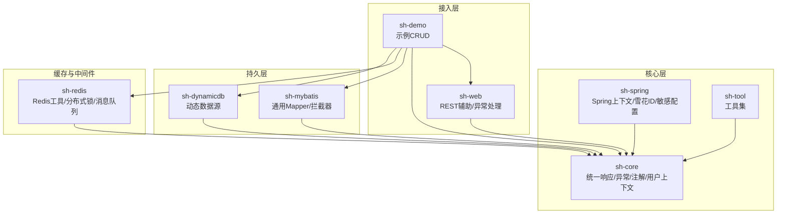
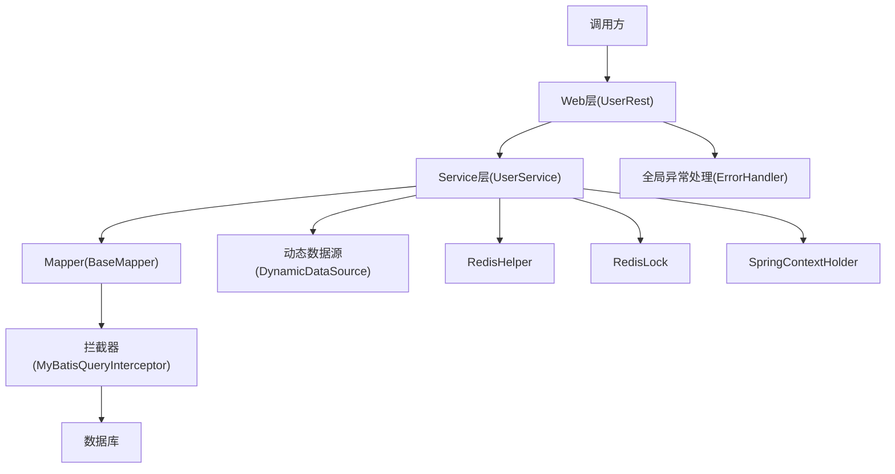
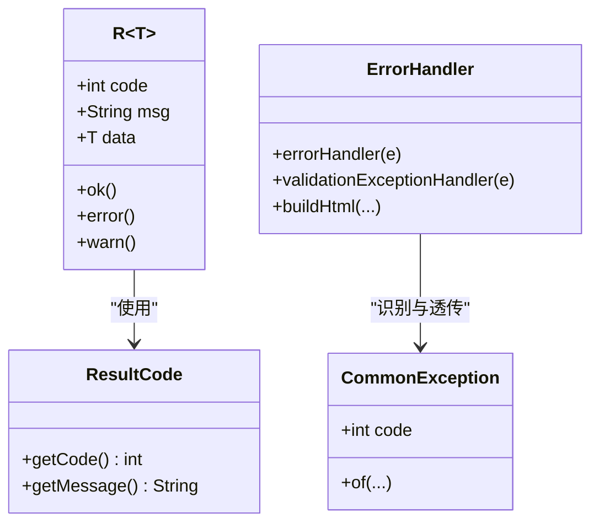
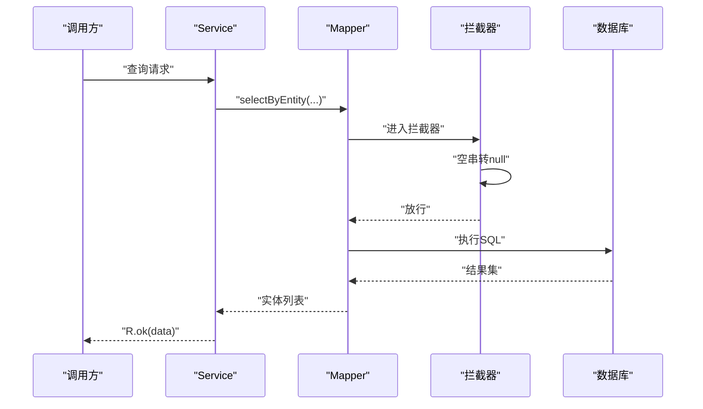
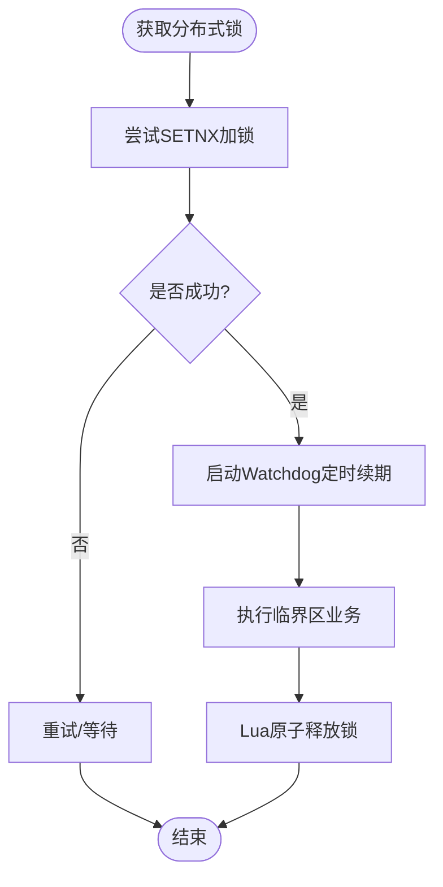
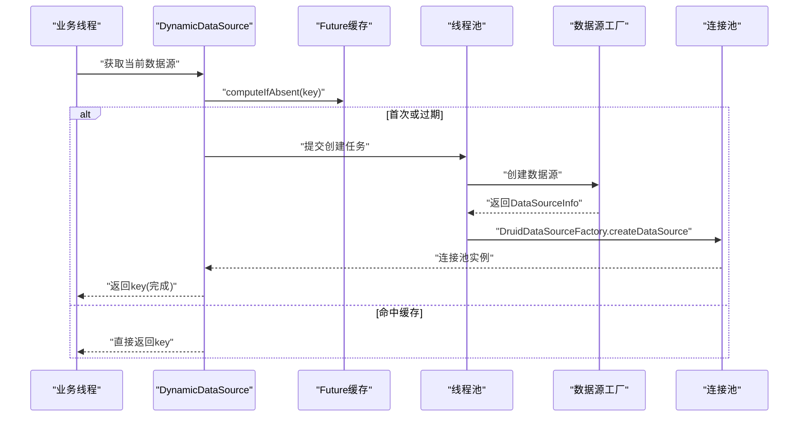
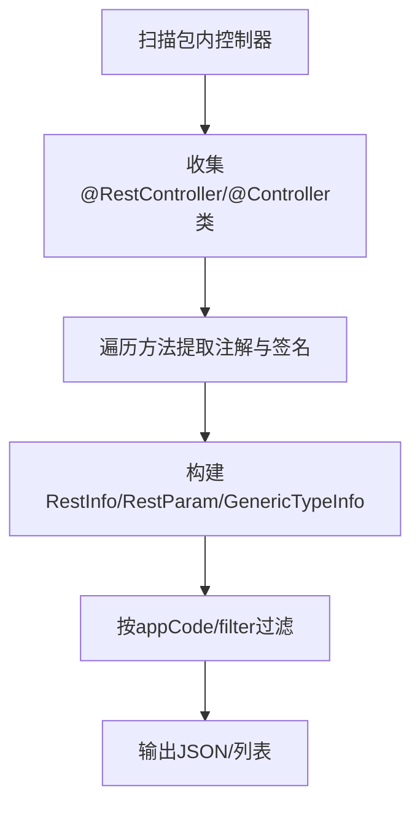
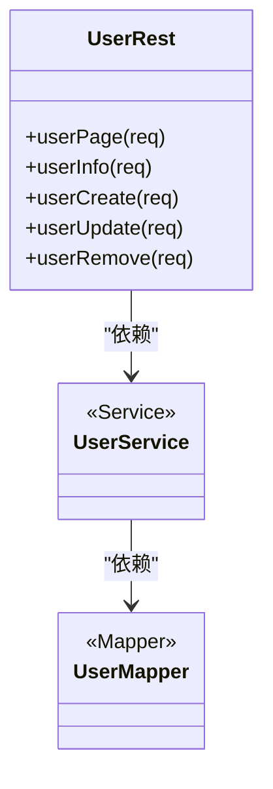
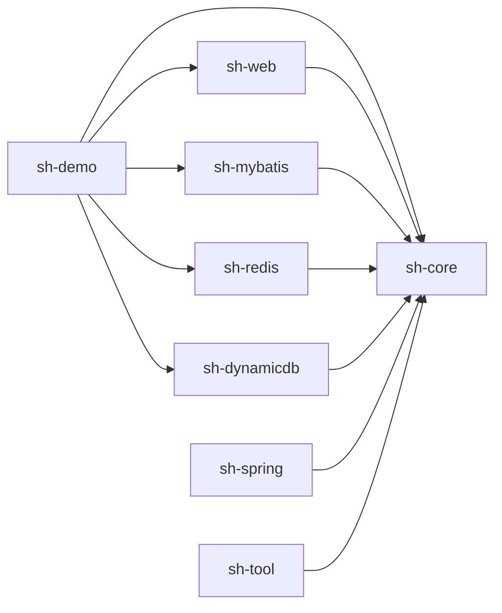

# 最佳实践

<cite>
**本文引用的文件**   
- [README.md](file://README.md)
- [BaseEntity.java](file://sh-core/src/main/java/com/wkclz/core/base/BaseEntity.java)
- [R.java](file://sh-core/src/main/java/com/wkclz/core/base/R.java)
- [ResultCode.java](file://sh-core/src/main/java/com/wkclz/core/enums/ResultCode.java)
- [CommonException.java](file://sh-core/src/main/java/com/wkclz/core/exception/CommonException.java)
- [ErrorHandler.java](file://sh-web/src/main/java/com/wkclz/web/rest/ErrorHandler.java)
- [BaseMapper.java](file://sh-mybatis/src/main/java/com/wkclz/mybatis/mapper/BaseMapper.java)
- [MyBatisQueryInterceptor.java](file://sh-mybatis/src/main/java/com/wkclz/mybatis/interceptor/MyBatisQueryInterceptor.java)
- [RedisHelper.java](file://sh-redis/src/main/java/com/wkclz/redis/helper/RedisHelper.java)
- [RedisLock.java](file://sh-redis/src/main/java/com/wkclz/redis/helper/RedisLock.java)
- [DynamicDataSource.java](file://sh-dynamicdb/src/main/java/com/wkclz/dynamicdb/DynamicDataSource.java)
- [RestHelper.java](file://sh-web/src/main/java/com/wkclz/web/helper/RestHelper.java)
- [SpringContextHolder.java](file://sh-spring/src/main/java/com/wkclz/spring/config/SpringContextHolder.java)
- [UserRest.java](file://sh-demo/src/main/java/com/wkclz/demo/rest/UserRest.java)
- [UserService.java](file://sh-demo/src/main/java/com/wkclz/demo/service/UserService.java)
- [UserMapper.java](file://sh-demo/src/main/java/com/wkclz/demo/mapper/UserMapper.java)
</cite>

## 目录
1. [简介](#简介)
2. [项目结构](#项目结构)
3. [核心组件](#核心组件)
4. [架构总览](#架构总览)
5. [组件详解](#组件详解)
6. [依赖关系分析](#依赖关系分析)
7. [性能优化](#性能优化)
8. [安全编码规范](#安全编码规范)
9. [日志与监控](#日志与监控)
10. [可维护性设计](#可维护性设计)
11. [结论](#结论)

## 简介
本指南面向使用 sh-framework 的开发者，系统总结代码规范、命名约定、架构设计原则、性能优化、安全编码、日志与监控以及可维护性设计建议。文档以仓库现有实现为依据，结合示例模块展示最佳实践。

## 项目结构
sh-framework 采用多模块分层设计，围绕“核心能力 + 业务支撑”组织：
- sh-core：统一响应、异常、枚举、注解、用户上下文等基础能力
- sh-web：REST 辅助、异常统一处理、请求/响应帮助器
- sh-mybatis：通用 Mapper、拦截器、分页与 SQL 辅助
- sh-redis：Redis 工具、分布式锁、消息队列
- sh-dynamicdb：动态数据源路由与缓存
- sh-spring：Spring 上下文持有、雪花 ID、敏感配置加解密
- sh-tool：常用工具集
- sh-demo：示例模块，演示 CRUD 标准范式

**图表来源**
- [README.md:1-3](file://README.md#L1-L3)
- [BaseEntity.java:1-94](file://sh-core/src/main/java/com/wkclz/core/base/BaseEntity.java#L1-L94)
- [R.java:1-76](file://sh-core/src/main/java/com/wkclz/core/base/R.java#L1-L76)
- [ResultCode.java:1-77](file://sh-core/src/main/java/com/wkclz/core/enums/ResultCode.java#L1-L77)
- [ErrorHandler.java:1-267](file://sh-web/src/main/java/com/wkclz/web/rest/ErrorHandler.java#L1-L267)
- [BaseMapper.java:1-88](file://sh-mybatis/src/main/java/com/wkclz/mybatis/mapper/BaseMapper.java#L1-L88)
- [RedisHelper.java:1-513](file://sh-redis/src/main/java/com/wkclz/redis/helper/RedisHelper.java#L1-L513)
- [DynamicDataSource.java:1-274](file://sh-dynamicdb/src/main/java/com/wkclz/dynamicdb/DynamicDataSource.java#L1-L274)
- [RestHelper.java:1-554](file://sh-web/src/main/java/com/wkclz/web/helper/RestHelper.java#L1-L554)
- [SpringContextHolder.java:1-64](file://sh-spring/src/main/java/com/wkclz/spring/config/SpringContextHolder.java#L1-L64)
- [UserRest.java:1-98](file://sh-demo/src/main/java/com/wkclz/demo/rest/UserRest.java#L1-L98)
- [UserService.java:1-12](file://sh-demo/src/main/java/com/wkclz/demo/service/UserService.java#L1-L12)
- [UserMapper.java:1-10](file://sh-demo/src/main/java/com/wkclz/demo/mapper/UserMapper.java#L1-L10)

**章节来源**
- [README.md:1-3](file://README.md#L1-L3)

## 核心组件
- 统一响应模型与结果码
  - R<T>：统一封装响应结构，包含状态码、消息、数据及请求/响应时间、耗时
  - ResultCode：集中定义业务与系统级结果码
- 异常体系
  - CommonException：业务异常基类，支持模板化消息与链路透传
  - Web 层 ErrorHandler：全局异常捕获，区分用户异常与系统异常，安全输出，必要时邮件告警
- 数据访问
  - BaseMapper：单表通用 CRUD 与分页查询接口
  - MyBatisQueryInterceptor：查询参数空串转 null，减少无效条件
- 缓存与并发
  - RedisHelper：对象/字符串/数字/集合/有序集合/列表等全类型操作
  - RedisLock：基于 Lua 的可续期分布式锁，含 Watchdog 自动续期
- 动态数据源
  - DynamicDataSource：按 key 异步创建与缓存数据源，定时清理过期实例
- REST 辅助
  - RestHelper：扫描控制器元数据，生成接口清单与参数/泛型信息
- Spring 上下文
  - SpringContextHolder：全局持有 ApplicationContext，便于非容器对象获取 Bean

**章节来源**
- [R.java:1-76](file://sh-core/src/main/java/com/wkclz/core/base/R.java#L1-L76)
- [ResultCode.java:1-77](file://sh-core/src/main/java/com/wkclz/core/enums/ResultCode.java#L1-L77)
- [CommonException.java:1-64](file://sh-core/src/main/java/com/wkclz/core/exception/CommonException.java#L1-L64)
- [ErrorHandler.java:1-267](file://sh-web/src/main/java/com/wkclz/web/rest/ErrorHandler.java#L1-L267)
- [BaseMapper.java:1-88](file://sh-mybatis/src/main/java/com/wkclz/mybatis/mapper/BaseMapper.java#L1-L88)
- [MyBatisQueryInterceptor.java:1-122](file://sh-mybatis/src/main/java/com/wkclz/mybatis/interceptor/MyBatisQueryInterceptor.java#L1-L122)
- [RedisHelper.java:1-513](file://sh-redis/src/main/java/com/wkclz/redis/helper/RedisHelper.java#L1-L513)
- [RedisLock.java:1-328](file://sh-redis/src/main/java/com/wkclz/redis/helper/RedisLock.java#L1-L328)
- [DynamicDataSource.java:1-274](file://sh-dynamicdb/src/main/java/com/wkclz/dynamicdb/DynamicDataSource.java#L1-L274)
- [RestHelper.java:1-554](file://sh-web/src/main/java/com/wkclz/web/helper/RestHelper.java#L1-L554)
- [SpringContextHolder.java:1-64](file://sh-spring/src/main/java/com/wkclz/spring/config/SpringContextHolder.java#L1-L64)

## 架构总览
sh-framework 以“统一响应 + 异常 + 数据访问 + 缓存并发 + 动态数据源 + REST 辅助 + Spring 上下文”为核心，形成清晰的分层与职责边界，便于扩展与维护。

**图表来源**
- [UserRest.java:1-98](file://sh-demo/src/main/java/com/wkclz/demo/rest/UserRest.java#L1-L98)
- [UserService.java:1-12](file://sh-demo/src/main/java/com/wkclz/demo/service/UserService.java#L1-L12)
- [UserMapper.java:1-10](file://sh-demo/src/main/java/com/wkclz/demo/mapper/UserMapper.java#L1-L10)
- [BaseMapper.java:1-88](file://sh-mybatis/src/main/java/com/wkclz/mybatis/mapper/BaseMapper.java#L1-L88)
- [MyBatisQueryInterceptor.java:1-122](file://sh-mybatis/src/main/java/com/wkclz/mybatis/interceptor/MyBatisQueryInterceptor.java#L1-L122)
- [DynamicDataSource.java:1-274](file://sh-dynamicdb/src/main/java/com/wkclz/dynamicdb/DynamicDataSource.java#L1-L274)
- [RedisHelper.java:1-513](file://sh-redis/src/main/java/com/wkclz/redis/helper/RedisHelper.java#L1-L513)
- [RedisLock.java:1-328](file://sh-redis/src/main/java/com/wkclz/redis/helper/RedisLock.java#L1-L328)
- [ErrorHandler.java:1-267](file://sh-web/src/main/java/com/wkclz/web/rest/ErrorHandler.java#L1-L267)
- [SpringContextHolder.java:1-64](file://sh-spring/src/main/java/com/wkclz/spring/config/SpringContextHolder.java#L1-L64)

## 组件详解

### 统一响应与异常处理
- 统一响应 R<T>
  - 字段：code、msg、data、requestTime、responseTime、costTime
  - 提供 ok/error/warn 等静态构造方法，简化调用
- 结果码 ResultCode
  - 覆盖通用、鉴权、业务、网络等场景，便于前端与监控侧统一消费
- 异常体系
  - CommonException 支持多种构造方式与模板化消息
  - ErrorHandler 全局捕获，区分用户异常与系统异常；安全地输出错误信息；可选邮件告警
- 设计要点
  - 单一职责：R 专注响应封装；ResultCode 专注语义化结果码；ErrorHandler 专注异常收敛
  - 开闭原则：新增业务码只需扩展 ResultCode；新增异常类型只需继承 CommonException

**图表来源**
- [R.java:1-76](file://sh-core/src/main/java/com/wkclz/core/base/R.java#L1-L76)
- [ResultCode.java:1-77](file://sh-core/src/main/java/com/wkclz/core/enums/ResultCode.java#L1-L77)
- [CommonException.java:1-64](file://sh-core/src/main/java/com/wkclz/core/exception/CommonException.java#L1-L64)
- [ErrorHandler.java:1-267](file://sh-web/src/main/java/com/wkclz/web/rest/ErrorHandler.java#L1-L267)

**章节来源**
- [R.java:1-76](file://sh-core/src/main/java/com/wkclz/core/base/R.java#L1-L76)
- [ResultCode.java:1-77](file://sh-core/src/main/java/com/wkclz/core/enums/ResultCode.java#L1-L77)
- [CommonException.java:1-64](file://sh-core/src/main/java/com/wkclz/core/exception/CommonException.java#L1-L64)
- [ErrorHandler.java:1-267](file://sh-web/src/main/java/com/wkclz/web/rest/ErrorHandler.java#L1-L267)

### 数据访问与拦截器
- BaseMapper
  - 提供 insert/insertBatch/delete/update/select 系列方法，覆盖常见单表操作
  - 通过 Provider 生成 SQL，避免手写 SQL 的重复劳动
- MyBatisQueryInterceptor
  - 查询前将空字符串参数置为 null，避免产生无效条件，提升查询效率与准确性

**图表来源**
- [BaseMapper.java:1-88](file://sh-mybatis/src/main/java/com/wkclz/mybatis/mapper/BaseMapper.java#L1-L88)
- [MyBatisQueryInterceptor.java:1-122](file://sh-mybatis/src/main/java/com/wkclz/mybatis/interceptor/MyBatisQueryInterceptor.java#L1-L122)

**章节来源**
- [BaseMapper.java:1-88](file://sh-mybatis/src/main/java/com/wkclz/mybatis/mapper/BaseMapper.java#L1-L88)
- [MyBatisQueryInterceptor.java:1-122](file://sh-mybatis/src/main/java/com/wkclz/mybatis/interceptor/MyBatisQueryInterceptor.java#L1-L122)

### 缓存与并发控制
- RedisHelper
  - 提供对象/字符串/数字/集合/有序集合/列表等全类型操作，支持过期、存在性检查、批量删除等
- RedisLock
  - 基于 SETNX + Lua 原子释放；支持 Watchdog 自动续期，降低死锁风险
- 设计要点
  - 单一职责：RedisHelper 专注数据读写；RedisLock 专注分布式锁语义
  - 开闭原则：新增缓存策略可在 RedisHelper 扩展；锁行为变化通过配置与脚本调整

**图表来源**
- [RedisHelper.java:1-513](file://sh-redis/src/main/java/com/wkclz/redis/helper/RedisHelper.java#L1-L513)
- [RedisLock.java:1-328](file://sh-redis/src/main/java/com/wkclz/redis/helper/RedisLock.java#L1-L328)

**章节来源**
- [RedisHelper.java:1-513](file://sh-redis/src/main/java/com/wkclz/redis/helper/RedisHelper.java#L1-L513)
- [RedisLock.java:1-328](file://sh-redis/src/main/java/com/wkclz/redis/helper/RedisLock.java#L1-L328)

### 动态数据源
- DynamicDataSource
  - 按 lookupKey 异步创建数据源，使用缓存与 Future 避免重复创建
  - 定时清理过期数据源，优雅关闭线程池与连接池
- 设计要点
  - 单一职责：负责数据源生命周期与缓存
  - 开闭原则：新增数据源类型可通过工厂扩展；清理策略可配置

**图表来源**
- [DynamicDataSource.java:1-274](file://sh-dynamicdb/src/main/java/com/wkclz/dynamicdb/DynamicDataSource.java#L1-L274)

**章节来源**
- [DynamicDataSource.java:1-274](file://sh-dynamicdb/src/main/java/com/wkclz/dynamicdb/DynamicDataSource.java#L1-L274)

### REST 辅助与接口元数据
- RestHelper
  - 扫描控制器，提取 URI、方法、参数、注解、泛型等元数据，生成接口清单
- 设计要点
  - 单一职责：专注于接口元数据采集与描述
  - 开闭原则：新增注解描述可通过扩展注解与解析逻辑

**图表来源**
- [RestHelper.java:1-554](file://sh-web/src/main/java/com/wkclz/web/helper/RestHelper.java#L1-L554)

**章节来源**
- [RestHelper.java:1-554](file://sh-web/src/main/java/com/wkclz/web/helper/RestHelper.java#L1-L554)

### 示例模块：CRUD 标准范式
- UserRest：分页查询、详情、创建、更新、删除
- UserService：继承 BaseService，复用通用能力
- UserMapper：继承 BaseMapper，零样板 SQL
- 设计要点
  - 单一职责：REST 仅负责编排与参数校验；Service 负责业务流程；Mapper 负责数据访问
  - 开闭原则：新增实体只需复制 VO/Entity/Mapper/Rest/Service 模板

**图表来源**
- [UserRest.java:1-98](file://sh-demo/src/main/java/com/wkclz/demo/rest/UserRest.java#L1-L98)
- [UserService.java:1-12](file://sh-demo/src/main/java/com/wkclz/demo/service/UserService.java#L1-L12)
- [UserMapper.java:1-10](file://sh-demo/src/main/java/com/wkclz/demo/mapper/UserMapper.java#L1-L10)

**章节来源**
- [UserRest.java:1-98](file://sh-demo/src/main/java/com/wkclz/demo/rest/UserRest.java#L1-L98)
- [UserService.java:1-12](file://sh-demo/src/main/java/com/wkclz/demo/service/UserService.java#L1-L12)
- [UserMapper.java:1-10](file://sh-demo/src/main/java/com/wkclz/demo/mapper/UserMapper.java#L1-L10)

## 依赖关系分析
- 模块间依赖
  - sh-demo 依赖 sh-web/sh-core/sh-mybatis/sh-redis/sh-dynamicdb
  - sh-web 依赖 sh-core
  - sh-mybatis 依赖 sh-core
  - sh-redis 依赖 sh-core
  - sh-dynamicdb 依赖 sh-core
  - sh-spring 依赖 sh-core
  - sh-tool 为通用工具，被各模块复用
- 组件耦合
  - Web 层通过 R/ErrorHanlder 与异常体系解耦
  - Service 层通过 Mapper 抽象与 MyBatis 解耦
  - 缓存与锁通过 RedisHelper/RedisLock 与业务解耦
  - 动态数据源通过 SpringContextHolder 与业务解耦

**图表来源**
- [README.md:1-3](file://README.md#L1-L3)
- [UserRest.java:1-98](file://sh-demo/src/main/java/com/wkclz/demo/rest/UserRest.java#L1-L98)
- [BaseMapper.java:1-88](file://sh-mybatis/src/main/java/com/wkclz/mybatis/mapper/BaseMapper.java#L1-L88)
- [RedisHelper.java:1-513](file://sh-redis/src/main/java/com/wkclz/redis/helper/RedisHelper.java#L1-L513)
- [DynamicDataSource.java:1-274](file://sh-dynamicdb/src/main/java/com/wkclz/dynamicdb/DynamicDataSource.java#L1-L274)
- [SpringContextHolder.java:1-64](file://sh-spring/src/main/java/com/wkclz/spring/config/SpringContextHolder.java#L1-L64)

**章节来源**
- [README.md:1-3](file://README.md#L1-L3)

## 性能优化
- 数据库查询优化
  - 使用 MyBatisQueryInterceptor 将空串参数置为 null，减少无效条件
  - BaseMapper 提供分页查询与按实体条件查询，避免全表扫描
- 缓存策略
  - RedisHelper 提供过期设置、批量删除、存在性检查，合理设置 TTL
  - RedisLock 使用 Watchdog 自动续期，避免业务长时间占用导致锁提前释放
- 并发控制
  - 动态数据源使用线程池与 Future 缓存，避免重复创建与阻塞
  - 使用 setIfAbsent 原子加锁，降低竞争开销
- 可观测性
  - R 中记录请求/响应时间与耗时，便于定位慢调用

**章节来源**
- [MyBatisQueryInterceptor.java:1-122](file://sh-mybatis/src/main/java/com/wkclz/mybatis/interceptor/MyBatisQueryInterceptor.java#L1-L122)
- [BaseMapper.java:1-88](file://sh-mybatis/src/main/java/com/wkclz/mybatis/mapper/BaseMapper.java#L1-L88)
- [RedisHelper.java:1-513](file://sh-redis/src/main/java/com/wkclz/redis/helper/RedisHelper.java#L1-L513)
- [RedisLock.java:1-328](file://sh-redis/src/main/java/com/wkclz/redis/helper/RedisLock.java#L1-L328)
- [DynamicDataSource.java:1-274](file://sh-dynamicdb/src/main/java/com/wkclz/dynamicdb/DynamicDataSource.java#L1-L274)
- [R.java:1-76](file://sh-core/src/main/java/com/wkclz/core/base/R.java#L1-L76)

## 安全编码规范
- SQL 注入防护
  - 使用 BaseMapper 与 Provider 生成 SQL，避免拼接
  - MyBatisQueryInterceptor 将空串置为 null，减少误判为有效条件
- XSS 防护
  - ErrorHandler 在构建告警邮件 HTML 时对文本进行 HTML 转义
- 敏感数据处理
  - sh-spring 提供敏感配置的加解密能力（详见模块说明）
- 异常安全
  - ErrorHandler 不向客户端暴露完整堆栈，仅记录日志并可选邮件告警

**章节来源**
- [BaseMapper.java:1-88](file://sh-mybatis/src/main/java/com/wkclz/mybatis/mapper/BaseMapper.java#L1-L88)
- [MyBatisQueryInterceptor.java:1-122](file://sh-mybatis/src/main/java/com/wkclz/mybatis/interceptor/MyBatisQueryInterceptor.java#L1-L122)
- [ErrorHandler.java:220-261](file://sh-web/src/main/java/com/wkclz/web/rest/ErrorHandler.java#L220-L261)

## 日志与监控
- 日志记录
  - Web 层异常处理记录请求方法、URI、错误摘要与堆栈
  - Redis/动态数据源等组件均使用 SLF4J 记录关键事件
- 监控指标
  - R 中记录请求/响应时间与耗时，可用于埋点与报警
  - 可基于日志与 R 耗时统计构建 P99/P95 等指标

**章节来源**
- [ErrorHandler.java:167-217](file://sh-web/src/main/java/com/wkclz/web/rest/ErrorHandler.java#L167-L217)
- [R.java:18-21](file://sh-core/src/main/java/com/wkclz/core/base/R.java#L18-L21)

## 可维护性设计
- 代码规范与命名约定
  - 包结构：按能力域划分（core/web/mybatis/redis/dynamicdb/spring/tool/demo）
  - 类命名：名词短语，如 R、ResultCode、BaseMapper、RedisHelper、RedisLock、DynamicDataSource、RestHelper、SpringContextHolder
  - 方法命名：动词短语，如 insert、delete、update、select、set、get、tryLock、releaseLock、startCleanupTask
  - 注释标准：公共 API 与复杂逻辑需提供中文注释，说明用途、参数、返回值与注意事项
- 架构设计原则
  - 单一职责：每个模块/类聚焦一个职责
  - 开闭原则：通过扩展而非修改实现能力增强
- 可维护性建议
  - 保持接口稳定，新增能力通过扩展点实现
  - 统一异常与响应模型，降低调用方适配成本
  - 严格遵循依赖方向，避免循环依赖

## 结论
sh-framework 通过统一响应、异常、数据访问、缓存并发与动态数据源等能力，提供了高内聚、低耦合的开发基座。遵循本文最佳实践，可在保证安全性与可观测性的前提下，持续提升性能与可维护性。