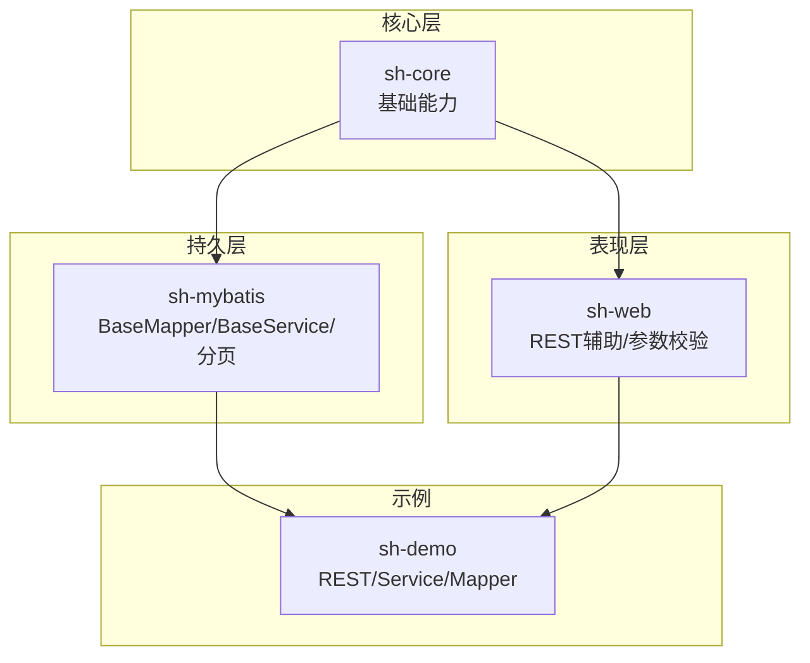
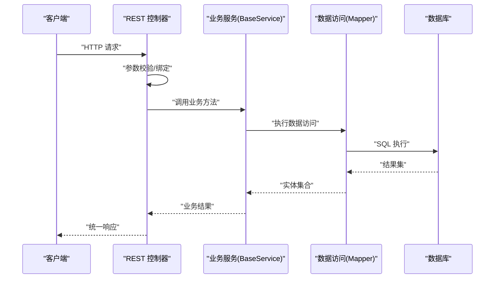
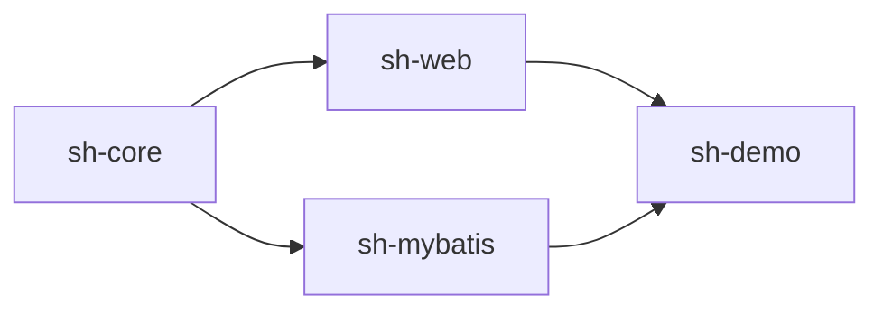

# 测试指南

<cite>
**本文档引用的文件**
- [PageableTest.java](file://sh-core/src/test/java/com/wkclz/core/base/PageableTest.java)
- [PageQueryTest.java](file://sh-mybatis/src/test/java/com/wkclz/mybatis/helper/PageQueryTest.java)
- [PageReqTest.java](file://sh-web/src/test/java/com/wkclz/web/bean/PageReqTest.java)
- [RestHelperTest.java](file://sh-web/src/test/java/com/wkclz/web/helper/RestHelperTest.java)
- [BaseService.java](file://sh-mybatis/src/main/java/com/wkclz/mybatis/service/BaseService.java)
- [BaseMapper.java](file://sh-mybatis/src/main/java/com/wkclz/mybatis/mapper/BaseMapper.java)
- [UserRest.java](file://sh-demo/src/main/java/com/wkclz/demo/rest/UserRest.java)
- [UserMapper.java](file://sh-demo/src/main/java/com/wkclz/demo/mapper/UserMapper.java)
- [UserService.java](file://sh-demo/src/main/java/com/wkclz/demo/service/UserService.java)
- [application.yml](file://sh-demo/src/main/resources/config/application.yml)
- [pom.xml](file://pom.xml)
- [sh-mybatis/pom.xml](file://sh-mybatis/pom.xml)
- [sh-web/pom.xml](file://sh-web/pom.xml)
- [sh-core/pom.xml](file://sh-core/pom.xml)
</cite>

## 目录
1. [简介](#简介)
2. [项目结构](#项目结构)
3. [核心组件](#核心组件)
4. [架构概览](#架构概览)
5. [详细组件分析](#详细组件分析)
6. [依赖分析](#依赖分析)
7. [性能考虑](#性能考虑)
8. [故障排查指南](#故障排查指南)
9. [结论](#结论)
10. [附录](#附录)

## 简介
本测试指南面向 sh-framework 框架，提供从单元测试到集成测试、Mock 测试、覆盖率要求、自动化测试配置、性能与压力测试以及测试数据与环境管理的完整实践方案。文档以仓库中现有的测试用例为基础，结合框架中的核心组件（如 BaseService、BaseMapper、REST 控制器等），给出可操作的测试策略与最佳实践。

## 项目结构
sh-framework 采用多模块 Maven 结构，核心模块包括：
- sh-core：基础能力（分页、统一响应、异常体系、用户上下文等）
- sh-mybatis：MyBatis 封装（BaseMapper、BaseService、分页查询工具）
- sh-web：Web 层（REST 辅助、参数校验、响应封装）
- sh-demo：示例模块（演示 CRUD 标准范式）
- 其他模块：动态数据源、Redis、MQTT、XXL-Job 等

下图展示与测试相关的关键模块关系：

图表来源
- [pom.xml](file://pom.xml)
- [sh-mybatis/pom.xml](file://sh-mybatis/pom.xml)
- [sh-web/pom.xml](file://sh-web/pom.xml)
- [sh-core/pom.xml](file://sh-core/pom.xml)

章节来源
- [pom.xml](file://pom.xml)

## 核心组件
本节聚焦于测试相关的三个关键组件：BaseService、Mapper 接口、REST 控制器，并说明它们在测试中的职责与关注点。

- BaseService
  - 负责业务服务层的通用能力封装，通常包含数据访问、事务控制、业务规则等。
  - 测试要点：参数校验、异常路径、事务传播行为、与 Mapper 的协作。
  - 参考路径：[BaseService.java](file://sh-mybatis/src/main/java/com/wkclz/mybatis/service/BaseService.java)

- Mapper 接口
  - 定义数据访问契约，配合通用 Provider 提供增删改查等通用 SQL。
  - 测试要点：SQL 生成正确性、条件拼接、分页参数传递、批量操作。
  - 参考路径：[BaseMapper.java](file://sh-mybatis/src/main/java/com/wkclz/mybatis/mapper/BaseMapper.java)

- REST 控制器
  - 提供对外 HTTP 接口，负责参数解析、校验、调用服务层并返回统一响应。
  - 测试要点：路由映射、参数校验、异常处理、统一响应封装。
  - 参考路径：[UserRest.java](file://sh-demo/src/main/java/com/wkclz/demo/rest/UserRest.java)

章节来源
- [BaseService.java](file://sh-mybatis/src/main/java/com/wkclz/mybatis/service/BaseService.java)
- [BaseMapper.java](file://sh-mybatis/src/main/java/com/wkclz/mybatis/mapper/BaseMapper.java)
- [UserRest.java](file://sh-demo/src/main/java/com/wkclz/demo/rest/UserRest.java)

## 架构概览
下图展示了测试视角下的典型请求流程，从 REST 控制器到服务层再到数据访问层，以及测试中可注入的 Mock 点。

图表来源
- [UserRest.java](file://sh-demo/src/main/java/com/wkclz/demo/rest/UserRest.java)
- [UserService.java](file://sh-demo/src/main/java/com/wkclz/demo/service/UserService.java)
- [UserMapper.java](file://sh-demo/src/main/java/com/wkclz/demo/mapper/UserMapper.java)

## 详细组件分析

### BaseService 单元测试
- 测试目标
  - 验证业务方法的正常路径与异常路径
  - 验证与 Mapper 的协作是否正确
  - 验证事务传播与回滚行为（如适用）
- 建议的测试策略
  - 使用 Mockito 模拟 Mapper，验证方法调用次数与参数
  - 使用 @DataJpaTest 或 @ImportAutoConfiguration（根据实际持久层）进行轻量集成测试
  - 对异常场景进行断言，确保异常被正确包装或抛出
- 关键关注点
  - 参数校验失败时的异常抛出
  - 并发场景下的幂等性与一致性
  - 与外部系统的交互（如消息队列、缓存）通过接口抽象进行 Mock

章节来源
- [BaseService.java](file://sh-mybatis/src/main/java/com/wkclz/mybatis/service/BaseService.java)

### Mapper 接口单元测试
- 测试目标
  - 验证通用 Mapper 的 SQL 生成与条件拼接
  - 验证分页参数传递与偏移量计算
  - 验证批量插入/更新/删除的正确性
- 建议的测试策略
  - 使用内存数据库（如 H2）进行真实 SQL 验证
  - 使用 Mockito 验证 SQL 构造逻辑（如通过拦截器或测试桩）
  - 对复杂条件（多表关联、子查询）进行边界值测试
- 关键关注点
  - 分页参数的默认值与边界值（最小/最大）
  - 条件为空时的 SQL 生成
  - 批量操作的性能与事务一致性

章节来源
- [BaseMapper.java](file://sh-mybatis/src/main/java/com/wkclz/mybatis/mapper/BaseMapper.java)

### REST 控制器单元测试
- 测试目标
  - 验证路由映射与参数绑定
  - 验证参数校验与异常处理
  - 验证统一响应封装与状态码
- 建议的测试策略
  - 使用 Spring Boot Test 与 @WebMvcTest 或 @ImportAutoConfiguration
  - 使用 MockMvc 进行端到端请求模拟
  - 对异常处理器进行单独测试，确保错误信息符合预期
- 关键关注点
  - 路由参数与查询参数的组合
  - 文件上传/下载场景的边界值
  - 统一响应的泛型提取与序列化

章节来源
- [UserRest.java](file://sh-demo/src/main/java/com/wkclz/demo/rest/UserRest.java)

### 分页与参数校验测试（现有用例）
- Pageable 接口与 BaseEntity 的分页行为
  - 测试默认值、空值处理、非法值处理、偏移量计算、多次 init 调用、边界值
  - 参考路径：[PageableTest.java](file://sh-core/src/test/java/com/wkclz/core/base/PageableTest.java)
- PageQuery 分页查询与 Pageable 接口
  - 基于 BaseEntity 与 Pageable 的分页查询，包含静态方法 Mock、异常清理、参数自动初始化
  - 参考路径：[PageQueryTest.java](file://sh-mybatis/src/test/java/com/wkclz/mybatis/helper/PageQueryTest.java)
- PageReq 参数对象
  - PageReq 实现 Pageable 接口，验证 getter/setter、init 行为、序列化能力
  - 参考路径：[PageReqTest.java](file://sh-web/src/test/java/com/wkclz/web/bean/PageReqTest.java)
- REST 返回类型提取
  - 通过反射提取多层泛型返回类型，验证 R<T> 包装与泛型信息
  - 参考路径：[RestHelperTest.java](file://sh-web/src/test/java/com/wkclz/web/helper/RestHelperTest.java)

章节来源
- [PageableTest.java](file://sh-core/src/test/java/com/wkclz/core/base/PageableTest.java)
- [PageQueryTest.java](file://sh-mybatis/src/test/java/com/wkclz/mybatis/helper/PageQueryTest.java)
- [PageReqTest.java](file://sh-web/src/test/java/com/wkclz/web/bean/PageReqTest.java)
- [RestHelperTest.java](file://sh-web/src/test/java/com/wkclz/web/helper/RestHelperTest.java)

## 依赖分析
- 模块间耦合
  - sh-web 依赖 sh-core 提供的统一响应与异常体系
  - sh-mybatis 依赖 sh-core 的分页与实体基类
  - sh-demo 作为示例，依赖 sh-web、sh-mybatis 与 sh-core
- 测试依赖
  - 单元测试：JUnit 5、Mockito
  - 集成测试：Spring Boot Test、内存数据库（如 H2）
  - 性能测试：JMH、Gatling（建议）

图表来源
- [pom.xml](file://pom.xml)

章节来源
- [pom.xml](file://pom.xml)

## 性能考虑
- 数据库连接池测试
  - 使用 HikariCP/H2 进行连接池容量与超时测试
  - 验证连接泄漏与空闲回收策略
- 缓存命中率测试
  - 使用内存缓存（如 Caffeine）进行读写放大与命中率评估
  - 对热点数据进行并发访问测试
- 并发性能测试
  - 使用 JMH 进行微基准测试，评估关键方法的吞吐量与延迟
  - 使用 Gatling/JMeter 进行端到端压力测试，覆盖 REST、Service、Mapper 层

## 故障排查指南
- 常见问题
  - 分页参数未初始化导致偏移量异常
  - PageHelper 清理未执行导致后续查询污染
  - 参数校验失败但未正确包装为统一响应
- 排查步骤
  - 检查 Pageable.init() 是否被调用
  - 确认异常处理器是否正确捕获并转换
  - 使用日志与断点定位具体失败环节

章节来源
- [PageQueryTest.java](file://sh-mybatis/src/test/java/com/wkclz/mybatis/helper/PageQueryTest.java)
- [RestHelperTest.java](file://sh-web/src/test/java/com/wkclz/web/helper/RestHelperTest.java)

## 结论
本指南提供了基于现有代码的测试实践蓝图：以单元测试为基础，结合 Mock 与集成测试，覆盖核心组件与典型业务流程；通过合理的覆盖率目标与自动化流水线，持续保障质量与交付效率。建议在 CI/CD 中引入覆盖率检查与性能回归测试，形成闭环的质量保障体系。

## 附录

### 单元测试编写方法
- BaseService
  - 使用 Mockito 模拟依赖，验证方法调用与返回值
  - 对异常路径进行断言，确保异常被正确处理
- Mapper 接口
  - 使用内存数据库验证 SQL 正确性
  - 对复杂条件进行边界值测试
- REST 控制器
  - 使用 MockMvc 发起请求，验证路由与响应

章节来源
- [BaseService.java](file://sh-mybatis/src/main/java/com/wkclz/mybatis/service/BaseService.java)
- [BaseMapper.java](file://sh-mybatis/src/main/java/com/wkclz/mybatis/mapper/BaseMapper.java)
- [UserRest.java](file://sh-demo/src/main/java/com/wkclz/demo/rest/UserRest.java)

### 集成测试策略
- 数据库测试
  - 使用 @DataJpaTest 或 @ImportAutoConfiguration
  - 配置内存数据库（如 H2），执行真实 SQL
- 缓存测试
  - 使用内存缓存（如 Caffeine）进行读写与过期策略验证
- 消息队列测试
  - 使用本地 broker（如 RabbitMQ/ActiveMQ）或内存队列进行端到端验证

### Mock 测试使用方法
- 外部依赖与服务
  - 使用 Mockito 对外部服务进行 Mock，隔离网络与第三方系统
  - 对静态方法使用 MockedStatic（参考 PageQueryTest 中对 PageHelper 的 Mock）

章节来源
- [PageQueryTest.java](file://sh-mybatis/src/test/java/com/wkclz/mybatis/helper/PageQueryTest.java)

### 测试覆盖率要求与提升
- 覆盖率指标
  - 单元测试覆盖率：≥ 80%
  - 分支覆盖率：≥ 80%
  - 行覆盖率：≥ 85%
- 提升方法
  - 针对高风险路径补充测试用例
  - 使用分支覆盖报告定位缺失分支
  - 引入覆盖率插件（JaCoCo）在 CI 中强制阈值

### 自动化测试配置与执行
- CI/CD 集成
  - 在流水线中执行单元测试与集成测试
  - 生成测试报告（JUnit XML、覆盖率报告）
- 测试报告生成
  - 使用 Surefire/Failsafe 插件生成 JUnit XML
  - 使用 JaCoCo 生成覆盖率报告并在 CI 中校验

### 性能与压力测试
- 微基准测试（JMH）
  - 对关键方法进行吞吐量与延迟测试
- 端到端压力测试（Gatling/JMeter）
  - 覆盖 REST、Service、Mapper 层，评估并发与资源使用

### 测试数据管理与测试环境配置
- 测试数据
  - 使用固定种子与预置数据，保证可重复性
  - 对敏感数据进行脱敏或替换
- 测试环境
  - 使用 application-test.yml 或测试专用配置
  - 配置内存数据库、缓存与消息队列的测试镜像

章节来源
- [application.yml](file://sh-demo/src/main/resources/config/application.yml)