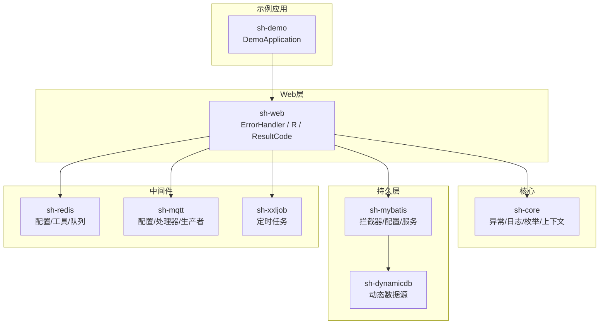
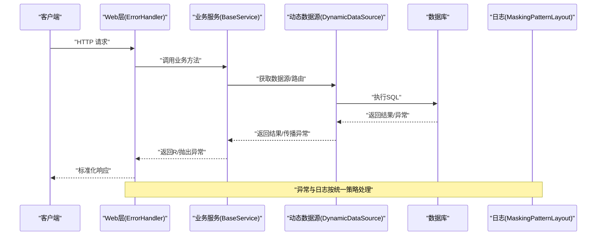
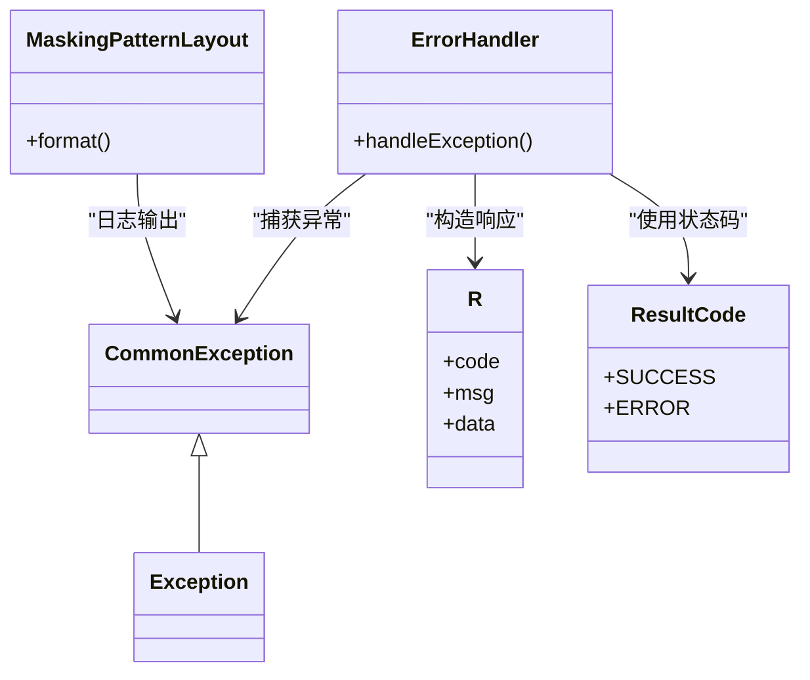
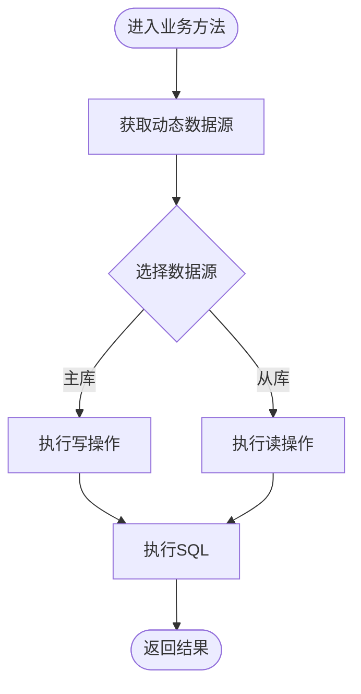
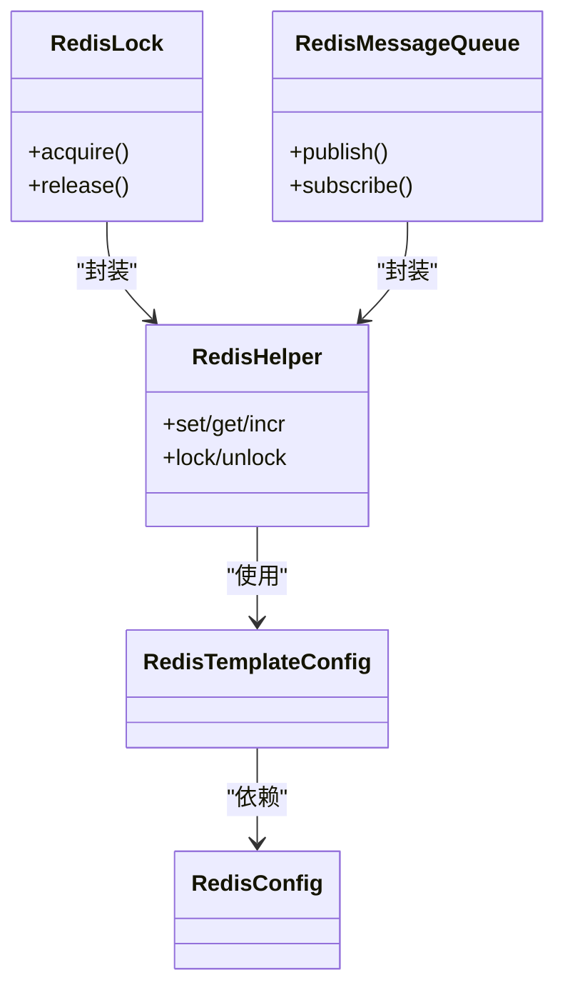
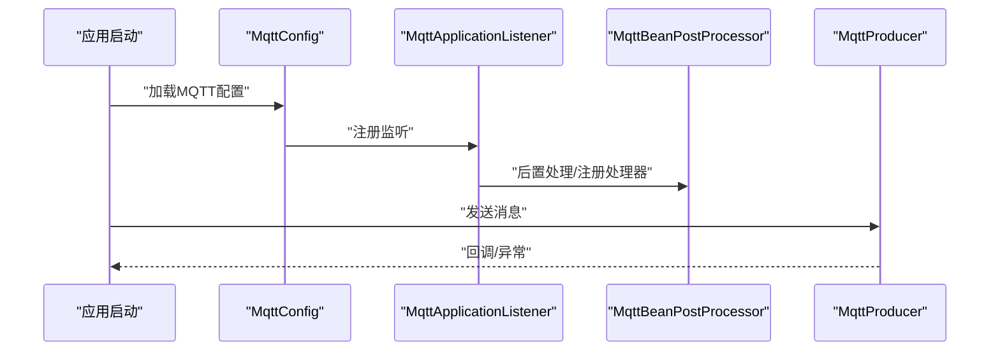
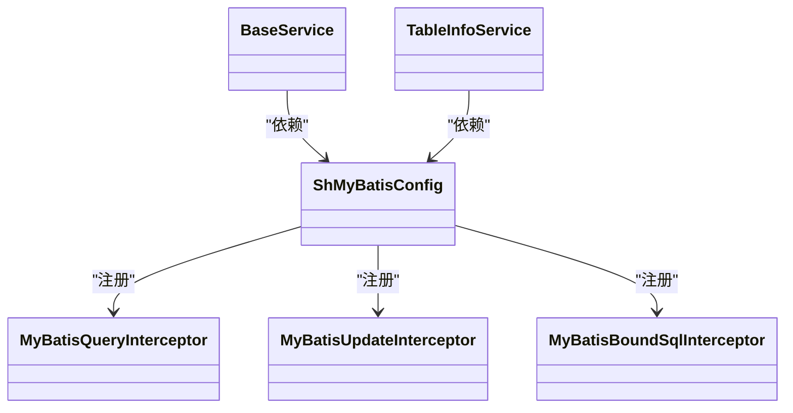
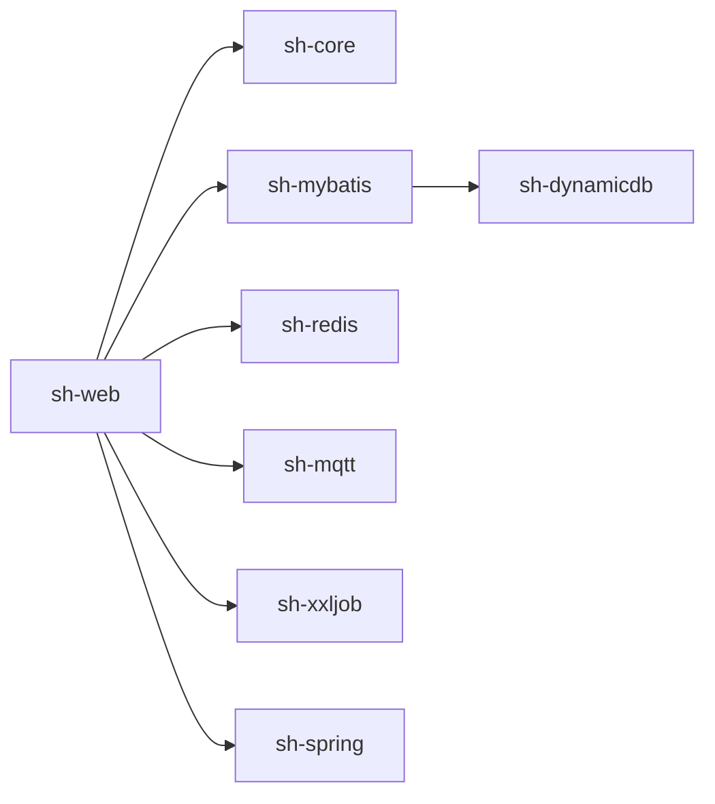

# 问题排查

<cite>
**本文引用的文件**
- [CommonException.java](file://sh-core/src/main/java/com/wkclz/core/exception/CommonException.java)
- [application.yml](file://sh-demo/src/main/resources/config/application.yml)
- [MaskingPatternLayout.java](file://sh-core/src/main/java/com/wkclz/core/log/MaskingPatternLayout.java)
- [ErrorHandler.java](file://sh-web/src/main/java/com/wkclz/web/rest/ErrorHandler.java)
- [R.java](file://sh-core/src/main/java/com/wkclz/core/base/R.java)
- [ResultCode.java](file://sh-core/src/main/java/com/wkclz/core/enums/ResultCode.java)
- [DynamicDataSourceAutoConfig.java](file://sh-dynamicdb/src/main/java/com/wkclz/dynamicdb/config/DynamicDataSourceAutoConfig.java)
- [DynamicDataSourceConfig.java](file://sh-dynamicdb/src/main/java/com/wkclz/dynamicdb/config/DynamicDataSourceConfig.java)
- [DynamicDataSource.java](file://sh-dynamicdb/src/main/java/com/wkclz/dynamicdb/DynamicDataSource.java)
- [DynamicDataSourceAop.java](file://sh-dynamicdb/src/main/java/com/wkclz/dynamicdb/aop/DynamicDataSourceAop.java)
- [MqttConfig.java](file://sh-mqtt/src/main/java/com/wkclz/mqtt/config/MqttConfig.java)
- [MqttApplicationListener.java](file://sh-mqtt/src/main/java/com/wkclz/mqtt/config/MqttApplicationListener.java)
- [MqttBeanPostProcessor.java](file://sh-mqtt/src/main/java/com/wkclz/mqtt/config/MqttBeanPostProcessor.java)
- [MqttHandlerFactory.java](file://sh-mqtt/src/main/java/com/wkclz/mqtt/handler/MqttHandlerFactory.java)
- [MqttProducer.java](file://sh-mqtt/src/main/java/com/wkclz/mqtt/client/MqttProducer.java)
- [MqttTimeoutException.java](file://sh-mqtt/src/main/java/com/wkclz/mqtt/exception/MqttTimeoutException.java)
- [MqttRemoteException.java](file://sh-mqtt/src/main/java/com/wkclz/mqtt/exception/MqttRemoteException.java)
- [MqttBeansException.java](file://sh-mqtt/src/main/java/com/wkclz/mqtt/exception/MqttBeansException.java)
- [RedisConfig.java](file://sh-redis/src/main/java/com/wkclz/redis/config/RedisConfig.java)
- [RedisTemplateConfig.java](file://sh-redis/src/main/java/com/wkclz/redis/config/RedisTemplateConfig.java)
- [RedisHelper.java](file://sh-redis/src/main/java/com/wkclz/redis/helper/RedisHelper.java)
- [RedisLock.java](file://sh-redis/src/main/java/com/wkclz/redis/helper/RedisLock.java)
- [RedisMessageQueue.java](file://sh-redis/src/main/java/com/wkclz/redis/queue/RedisMessageQueue.java)
- [ShMyBatisConfig.java](file://sh-mybatis/src/main/java/com/wkclz/mybatis/config/ShMyBatisConfig.java)
- [MyBatisQueryInterceptor.java](file://sh-mybatis/src/main/java/com/wkclz/mybatis/interceptor/MyBatisQueryInterceptor.java)
- [MyBatisUpdateInterceptor.java](file://sh-mybatis/src/main/java/com/wkclz/mybatis/interceptor/MyBatisUpdateInterceptor.java)
- [MyBatisBoundSqlInterceptor.java](file://sh-mybatis/src/main/java/com/wkclz/mybatis/interceptor/MyBatisBoundSqlInterceptor.java)
- [BaseService.java](file://sh-mybatis/src/main/java/com/wkclz/mybatis/service/BaseService.java)
- [TableInfoService.java](file://sh-mybatis/src/main/java/com/wkclz/mybatis/service/TableInfoService.java)
- [SnowflakeHelper.java](file://sh-spring/src/main/java/com/wkclz/spring/helper/SnowflakeHelper.java)
- [SensitiveConfigDecryptor.java](file://sh-spring/src/main/java/com/wkclz/spring/config/SensitiveConfigDecryptor.java)
- [SensitiveConfigEncryptor.java](file://sh-spring/src/main/java/com/wkclz/spring/config/SensitiveConfigEncryptor.java)
- [XxlJobConfig.java](file://sh-xxljob/src/main/java/com/wkclz/xxljob/config/XxlJobConfig.java)
- [risk-analysis.md](file://docs/risk-analysis.md)
- [US-003-异常体系与分类处理.md](file://docs/stories/US-003-异常体系与分类处理.md)
- [US-012-全局异常处理与邮件告警.md](file://docs/stories/US-012-全局异常处理与邮件告警.md)
- [US-017-Redis分布式锁.md](file://docs/stories/US-017-Redis分布式锁.md)
- [US-020-动态数据源运行时切换.md](file://docs/stories/US-020-动态数据源运行时切换.md)
- [US-024-MQTT注解驱动消息发布订阅.md](file://docs/stories/US-024-MQTT注解驱动消息发布订阅.md)
- [fix-dynamicdb-connection-pool-leak/spec.md](file://.trae/specs/fix-dynamicdb-connection-pool-leak/spec.md)
- [fix-dynamicdb-dcl-blocking/tasks.md](file://.trae/specs/fix-dynamicdb-dcl-blocking/tasks.md)
- [fix-fastjson2-autotype-vuln/spec.md](file://.trae/specs/fix-fastjson2-autotype-vuln/spec.md)
- [fix-redis-lock-watchdog/checklist.md](file://.trae/specs/fix-redis-lock-watchdog/checklist.md)
- [fix-sensitive-config-plaintext/tasks.md](file://.trae/specs/fix-sensitive-config-plaintext/tasks.md)
- [fix-sql-injection-updateby/spec.md](file://.trae/specs/fix-sql-injection-updateby/spec.md)
- [fix-threadlocal-leak/spec.md](file://.trae/specs/fix-threadlocal-leak/spec.md)
- [optimize-sql-provider-reflection/spec.md](file://.trae/specs/optimize-sql-provider-reflection/spec.md)
</cite>

## 目录
1. [简介](#简介)
2. [项目结构](#项目结构)
3. [核心组件](#核心组件)
4. [架构总览](#架构总览)
5. [详细组件分析](#详细组件分析)
6. [依赖分析](#依赖分析)
7. [性能考虑](#性能考虑)
8. [故障排查指南](#故障排查指南)
9. [结论](#结论)
10. [附录](#附录)

## 简介
本指南面向sh-framework使用者与维护者，聚焦于常见问题的诊断与解决路径，覆盖启动失败、连接超时、数据不一致、并发冲突、异常与日志、性能瓶颈（慢查询/内存/线程阻塞）、配置问题（数据源/缓存/MQTT）以及调试与监控建议。文档以仓库内实际实现为依据，结合风险分析与专项修复规范，帮助快速定位问题根因并给出可执行的排查步骤。

## 项目结构
sh-framework采用多模块分层设计：核心能力在sh-core，持久层与MyBatis扩展在sh-mybatis，动态数据源在sh-dynamicdb，缓存在sh-redis，MQTT在sh-mqtt，Web层与异常处理在sh-web，分布式ID与敏感配置在sh-spring，定时任务在sh-xxljob，示例应用在sh-demo。各模块通过Spring Boot自动装配机制集成，配合统一异常、日志脱敏、结果封装等基础设施协同工作。

图示来源
- [application.yml:1-200](file://sh-demo/src/main/resources/config/application.yml#L1-L200)
- [ErrorHandler.java:1-200](file://sh-web/src/main/java/com/wkclz/web/rest/ErrorHandler.java#L1-L200)
- [R.java:1-120](file://sh-core/src/main/java/com/wkclz/core/base/R.java#L1-L120)
- [ResultCode.java:1-120](file://sh-core/src/main/java/com/wkclz/core/enums/ResultCode.java#L1-L120)
- [DynamicDataSourceAutoConfig.java:1-120](file://sh-dynamicdb/src/main/java/com/wkclz/dynamicdb/config/DynamicDataSourceAutoConfig.java#L1-L120)
- [DynamicDataSourceConfig.java:1-120](file://sh-dynamicdb/src/main/java/com/wkclz/dynamicdb/config/DynamicDataSourceConfig.java#L1-L120)
- [DynamicDataSource.java:1-200](file://sh-dynamicdb/src/main/java/com/wkclz/dynamicdb/DynamicDataSource.java#L1-L200)
- [DynamicDataSourceAop.java:1-120](file://sh-dynamicdb/src/main/java/com/wkclz/dynamicdb/aop/DynamicDataSourceAop.java#L1-L120)
- [RedisConfig.java:1-120](file://sh-redis/src/main/java/com/wkclz/redis/config/RedisConfig.java#L1-L120)
- [RedisTemplateConfig.java:1-120](file://sh-redis/src/main/java/com/wkclz/redis/config/RedisTemplateConfig.java#L1-L120)
- [RedisHelper.java:1-200](file://sh-redis/src/main/java/com/wkclz/redis/helper/RedisHelper.java#L1-L200)
- [RedisMessageQueue.java:1-200](file://sh-redis/src/main/java/com/wkclz/redis/queue/RedisMessageQueue.java#L1-L200)
- [MqttConfig.java:1-200](file://sh-mqtt/src/main/java/com/wkclz/mqtt/config/MqttConfig.java#L1-L200)
- [MqttApplicationListener.java:1-120](file://sh-mqtt/src/main/java/com/wkclz/mqtt/config/MqttApplicationListener.java#L1-L120)
- [MqttBeanPostProcessor.java:1-120](file://sh-mqtt/src/main/java/com/wkclz/mqtt/config/MqttBeanPostProcessor.java#L1-L120)
- [MqttHandlerFactory.java:1-120](file://sh-mqtt/src/main/java/com/wkclz/mqtt/handler/MqttHandlerFactory.java#L1-L120)
- [MqttProducer.java:1-200](file://sh-mqtt/src/main/java/com/wkclz/mqtt/client/MqttProducer.java#L1-L200)
- [ShMyBatisConfig.java:1-120](file://sh-mybatis/src/main/java/com/wkclz/mybatis/config/ShMyBatisConfig.java#L1-L120)
- [MyBatisQueryInterceptor.java:1-200](file://sh-mybatis/src/main/java/com/wkclz/mybatis/interceptor/MyBatisQueryInterceptor.java#L1-L200)
- [MyBatisUpdateInterceptor.java:1-200](file://sh-mybatis/src/main/java/com/wkclz/mybatis/interceptor/MyBatisUpdateInterceptor.java#L1-L200)
- [MyBatisBoundSqlInterceptor.java:1-200](file://sh-mybatis/src/main/java/com/wkclz/mybatis/interceptor/MyBatisBoundSqlInterceptor.java#L1-L200)
- [SnowflakeHelper.java:1-120](file://sh-spring/src/main/java/com/wkclz/spring/helper/SnowflakeHelper.java#L1-L120)
- [SensitiveConfigDecryptor.java:1-120](file://sh-spring/src/main/java/com/wkclz/spring/config/SensitiveConfigDecryptor.java#L1-L120)
- [SensitiveConfigEncryptor.java:1-120](file://sh-spring/src/main/java/com/wkclz/spring/config/SensitiveConfigEncryptor.java#L1-L120)
- [XxlJobConfig.java:1-120](file://sh-xxljob/src/main/java/com/wkclz/xxljob/config/XxlJobConfig.java#L1-L120)

章节来源
- [application.yml:1-200](file://sh-demo/src/main/resources/config/application.yml#L1-L200)

## 核心组件
- 统一异常与结果封装：通过异常基类与结果封装对象对外输出标准化响应，便于前端与监控系统消费。
- 日志脱敏：对敏感字段进行脱敏输出，降低信息泄露风险。
- 动态数据源：支持运行时切换主从/多数据源，配合AOP与自动配置实现透明路由。
- 缓存与分布式锁：提供Redis配置、模板、工具类与消息队列封装，支撑高并发场景。
- MQTT：注解驱动的消息发布/订阅，含配置、监听、后置处理器与异常类型。
- MyBatis扩展：拦截器链路（查询/更新/BoundSql），服务基类与表信息服务，提升SQL一致性与可维护性。
- 分布式ID与敏感配置：雪花ID与敏感配置加解密，保障唯一性与安全性。
- 定时任务：基于XXL-Job的自动配置与示例。

章节来源
- [CommonException.java:1-200](file://sh-core/src/main/java/com/wkclz/core/exception/CommonException.java#L1-L200)
- [MaskingPatternLayout.java:1-200](file://sh-core/src/main/java/com/wkclz/core/log/MaskingPatternLayout.java#L1-L200)
- [R.java:1-120](file://sh-core/src/main/java/com/wkclz/core/base/R.java#L1-L120)
- [ResultCode.java:1-120](file://sh-core/src/main/java/com/wkclz/core/enums/ResultCode.java#L1-L120)
- [DynamicDataSourceAutoConfig.java:1-120](file://sh-dynamicdb/src/main/java/com/wkclz/dynamicdb/config/DynamicDataSourceAutoConfig.java#L1-L120)
- [DynamicDataSourceConfig.java:1-120](file://sh-dynamicdb/src/main/java/com/wkclz/dynamicdb/config/DynamicDataSourceConfig.java#L1-L120)
- [DynamicDataSource.java:1-200](file://sh-dynamicdb/src/main/java/com/wkclz/dynamicdb/DynamicDataSource.java#L1-L200)
- [DynamicDataSourceAop.java:1-120](file://sh-dynamicdb/src/main/java/com/wkclz/dynamicdb/aop/DynamicDataSourceAop.java#L1-L120)
- [RedisConfig.java:1-120](file://sh-redis/src/main/java/com/wkclz/redis/config/RedisConfig.java#L1-L120)
- [RedisTemplateConfig.java:1-120](file://sh-redis/src/main/java/com/wkclz/redis/config/RedisTemplateConfig.java#L1-L120)
- [RedisHelper.java:1-200](file://sh-redis/src/main/java/com/wkclz/redis/helper/RedisHelper.java#L1-L200)
- [RedisMessageQueue.java:1-200](file://sh-redis/src/main/java/com/wkclz/redis/queue/RedisMessageQueue.java#L1-L200)
- [MqttConfig.java:1-200](file://sh-mqtt/src/main/java/com/wkclz/mqtt/config/MqttConfig.java#L1-L200)
- [MqttApplicationListener.java:1-120](file://sh-mqtt/src/main/java/com/wkclz/mqtt/config/MqttApplicationListener.java#L1-L120)
- [MqttBeanPostProcessor.java:1-120](file://sh-mqtt/src/main/java/com/wkclz/mqtt/config/MqttBeanPostProcessor.java#L1-L120)
- [MqttHandlerFactory.java:1-120](file://sh-mqtt/src/main/java/com/wkclz/mqtt/handler/MqttHandlerFactory.java#L1-L120)
- [MqttProducer.java:1-200](file://sh-mqtt/src/main/java/com/wkclz/mqtt/client/MqttProducer.java#L1-L200)
- [ShMyBatisConfig.java:1-120](file://sh-mybatis/src/main/java/com/wkclz/mybatis/config/ShMyBatisConfig.java#L1-L120)
- [MyBatisQueryInterceptor.java:1-200](file://sh-mybatis/src/main/java/com/wkclz/mybatis/interceptor/MyBatisQueryInterceptor.java#L1-L200)
- [MyBatisUpdateInterceptor.java:1-200](file://sh-mybatis/src/main/java/com/wkclz/mybatis/interceptor/MyBatisUpdateInterceptor.java#L1-L200)
- [MyBatisBoundSqlInterceptor.java:1-200](file://sh-mybatis/src/main/java/com/wkclz/mybatis/interceptor/MyBatisBoundSqlInterceptor.java#L1-L200)
- [SnowflakeHelper.java:1-120](file://sh-spring/src/main/java/com/wkclz/spring/helper/SnowflakeHelper.java#L1-L120)
- [SensitiveConfigDecryptor.java:1-120](file://sh-spring/src/main/java/com/wkclz/spring/config/SensitiveConfigDecryptor.java#L1-L120)
- [SensitiveConfigEncryptor.java:1-120](file://sh-spring/src/main/java/com/wkclz/spring/config/SensitiveConfigEncryptor.java#L1-L120)
- [XxlJobConfig.java:1-120](file://sh-xxljob/src/main/java/com/wkclz/xxljob/config/XxlJobConfig.java#L1-L120)

## 架构总览
下图展示从请求到持久层的关键流转，以及异常与日志在各层的落点，有助于定位“启动失败/连接超时/数据不一致/并发冲突”等典型问题。

图示来源
- [ErrorHandler.java:1-200](file://sh-web/src/main/java/com/wkclz/web/rest/ErrorHandler.java#L1-L200)
- [R.java:1-120](file://sh-core/src/main/java/com/wkclz/core/base/R.java#L1-L120)
- [DynamicDataSource.java:1-200](file://sh-dynamicdb/src/main/java/com/wkclz/dynamicdb/DynamicDataSource.java#L1-L200)
- [MyBatisQueryInterceptor.java:1-200](file://sh-mybatis/src/main/java/com/wkclz/mybatis/interceptor/MyBatisQueryInterceptor.java#L1-L200)
- [MaskingPatternLayout.java:1-200](file://sh-core/src/main/java/com/wkclz/core/log/MaskingPatternLayout.java#L1-L200)

## 详细组件分析

### 异常与日志体系
- 统一异常：通过异常基类与结果封装对象，确保错误信息与状态码标准化输出。
- 日志脱敏：对敏感字段进行脱敏输出，避免日志泄露。
- 全局异常处理：Web层集中捕获异常并转换为统一响应，必要时触发告警。

图示来源
- [CommonException.java:1-200](file://sh-core/src/main/java/com/wkclz/core/exception/CommonException.java#L1-L200)
- [R.java:1-120](file://sh-core/src/main/java/com/wkclz/core/base/R.java#L1-L120)
- [ResultCode.java:1-120](file://sh-core/src/main/java/com/wkclz/core/enums/ResultCode.java#L1-L120)
- [ErrorHandler.java:1-200](file://sh-web/src/main/java/com/wkclz/web/rest/ErrorHandler.java#L1-L200)
- [MaskingPatternLayout.java:1-200](file://sh-core/src/main/java/com/wkclz/core/log/MaskingPatternLayout.java#L1-L200)

章节来源
- [CommonException.java:1-200](file://sh-core/src/main/java/com/wkclz/core/exception/CommonException.java#L1-L200)
- [R.java:1-120](file://sh-core/src/main/java/com/wkclz/core/base/R.java#L1-L120)
- [ResultCode.java:1-120](file://sh-core/src/main/java/com/wkclz/core/enums/ResultCode.java#L1-L120)
- [ErrorHandler.java:1-200](file://sh-web/src/main/java/com/wkclz/web/rest/ErrorHandler.java#L1-L200)
- [MaskingPatternLayout.java:1-200](file://sh-core/src/main/java/com/wkclz/core/log/MaskingPatternLayout.java#L1-L200)

### 动态数据源与并发控制
- 自动配置与运行时切换：通过自动配置与AOP实现数据源路由，支持主从切换与多数据源。
- 并发冲突与连接池泄漏：专项修复规范中明确了DCL阻塞与连接池泄漏的排查要点。

图示来源
- [DynamicDataSourceAutoConfig.java:1-120](file://sh-dynamicdb/src/main/java/com/wkclz/dynamicdb/config/DynamicDataSourceAutoConfig.java#L1-L120)
- [DynamicDataSourceConfig.java:1-120](file://sh-dynamicdb/src/main/java/com/wkclz/dynamicdb/config/DynamicDataSourceConfig.java#L1-L120)
- [DynamicDataSource.java:1-200](file://sh-dynamicdb/src/main/java/com/wkclz/dynamicdb/DynamicDataSource.java#L1-L200)
- [DynamicDataSourceAop.java:1-120](file://sh-dynamicdb/src/main/java/com/wkclz/dynamicdb/aop/DynamicDataSourceAop.java#L1-L120)

章节来源
- [DynamicDataSourceAutoConfig.java:1-120](file://sh-dynamicdb/src/main/java/com/wkclz/dynamicdb/config/DynamicDataSourceAutoConfig.java#L1-L120)
- [DynamicDataSourceConfig.java:1-120](file://sh-dynamicdb/src/main/java/com/wkclz/dynamicdb/config/DynamicDataSourceConfig.java#L1-L120)
- [DynamicDataSource.java:1-200](file://sh-dynamicdb/src/main/java/com/wkclz/dynamicdb/DynamicDataSource.java#L1-L200)
- [DynamicDataSourceAop.java:1-120](file://sh-dynamicdb/src/main/java/com/wkclz/dynamicdb/aop/DynamicDataSourceAop.java#L1-L120)
- [fix-dynamicdb-connection-pool-leak/spec.md:1-200](file://.trae/specs/fix-dynamicdb-connection-pool-leak/spec.md#L1-L200)
- [fix-dynamicdb-dcl-blocking/tasks.md:1-200](file://.trae/specs/fix-dynamicdb-dcl-blocking/tasks.md#L1-L200)

### 缓存与分布式锁
- Redis配置与模板：提供序列化、连接与模板配置，支撑多种数据类型缓存。
- 分布式锁与消息队列：基于Redis实现分布式锁与消息队列，含看门狗与示例。
- 风险修复：针对Redis锁看门狗的专项检查清单。

图示来源
- [RedisConfig.java:1-120](file://sh-redis/src/main/java/com/wkclz/redis/config/RedisConfig.java#L1-L120)
- [RedisTemplateConfig.java:1-120](file://sh-redis/src/main/java/com/wkclz/redis/config/RedisTemplateConfig.java#L1-L120)
- [RedisHelper.java:1-200](file://sh-redis/src/main/java/com/wkclz/redis/helper/RedisHelper.java#L1-L200)
- [RedisLock.java:1-200](file://sh-redis/src/main/java/com/wkclz/redis/helper/RedisLock.java#L1-L200)
- [RedisMessageQueue.java:1-200](file://sh-redis/src/main/java/com/wkclz/redis/queue/RedisMessageQueue.java#L1-L200)
- [US-017-Redis分布式锁.md:1-200](file://docs/stories/US-017-Redis分布式锁.md#L1-L200)
- [fix-redis-lock-watchdog/checklist.md:1-200](file://.trae/specs/fix-redis-lock-watchdog/checklist.md#L1-L200)

章节来源
- [RedisConfig.java:1-120](file://sh-redis/src/main/java/com/wkclz/redis/config/RedisConfig.java#L1-L120)
- [RedisTemplateConfig.java:1-120](file://sh-redis/src/main/java/com/wkclz/redis/config/RedisTemplateConfig.java#L1-L120)
- [RedisHelper.java:1-200](file://sh-redis/src/main/java/com/wkclz/redis/helper/RedisHelper.java#L1-L200)
- [RedisLock.java:1-200](file://sh-redis/src/main/java/com/wkclz/redis/helper/RedisLock.java#L1-L200)
- [RedisMessageQueue.java:1-200](file://sh-redis/src/main/java/com/wkclz/redis/queue/RedisMessageQueue.java#L1-L200)

### MQTT消息通信
- 注解驱动：通过注解声明主题与消息处理，自动注册与路由。
- 配置与监听：应用启动时完成客户端初始化与主题订阅。
- 异常类型：提供超时、远程异常与Bean异常类型，便于区分问题场景。

图示来源
- [MqttConfig.java:1-200](file://sh-mqtt/src/main/java/com/wkclz/mqtt/config/MqttConfig.java#L1-L200)
- [MqttApplicationListener.java:1-120](file://sh-mqtt/src/main/java/com/wkclz/mqtt/config/MqttApplicationListener.java#L1-L120)
- [MqttBeanPostProcessor.java:1-120](file://sh-mqtt/src/main/java/com/wkclz/mqtt/config/MqttBeanPostProcessor.java#L1-L120)
- [MqttHandlerFactory.java:1-120](file://sh-mqtt/src/main/java/com/wkclz/mqtt/handler/MqttHandlerFactory.java#L1-L120)
- [MqttProducer.java:1-200](file://sh-mqtt/src/main/java/com/wkclz/mqtt/client/MqttProducer.java#L1-L200)
- [MqttTimeoutException.java:1-120](file://sh-mqtt/src/main/java/com/wkclz/mqtt/exception/MqttTimeoutException.java#L1-L120)
- [MqttRemoteException.java:1-120](file://sh-mqtt/src/main/java/com/wkclz/mqtt/exception/MqttRemoteException.java#L1-L120)
- [MqttBeansException.java:1-120](file://sh-mqtt/src/main/java/com/wkclz/mqtt/exception/MqttBeansException.java#L1-L120)

章节来源
- [MqttConfig.java:1-200](file://sh-mqtt/src/main/java/com/wkclz/mqtt/config/MqttConfig.java#L1-L200)
- [MqttApplicationListener.java:1-120](file://sh-mqtt/src/main/java/com/wkclz/mqtt/config/MqttApplicationListener.java#L1-L120)
- [MqttBeanPostProcessor.java:1-120](file://sh-mqtt/src/main/java/com/wkclz/mqtt/config/MqttBeanPostProcessor.java#L1-L120)
- [MqttHandlerFactory.java:1-120](file://sh-mqtt/src/main/java/com/wkclz/mqtt/handler/MqttHandlerFactory.java#L1-L120)
- [MqttProducer.java:1-200](file://sh-mqtt/src/main/java/com/wkclz/mqtt/client/MqttProducer.java#L1-L200)
- [MqttTimeoutException.java:1-120](file://sh-mqtt/src/main/java/com/wkclz/mqtt/exception/MqttTimeoutException.java#L1-L120)
- [MqttRemoteException.java:1-120](file://sh-mqtt/src/main/java/com/wkclz/mqtt/exception/MqttRemoteException.java#L1-L120)
- [MqttBeansException.java:1-120](file://sh-mqtt/src/main/java/com/wkclz/mqtt/exception/MqttBeansException.java#L1-L120)

### MyBatis拦截器与服务基类
- 拦截器链：查询、更新、BoundSql拦截，统一SQL行为与审计。
- 服务基类：提供通用增删改查与表信息服务，减少重复代码。

图示来源
- [ShMyBatisConfig.java:1-120](file://sh-mybatis/src/main/java/com/wkclz/mybatis/config/ShMyBatisConfig.java#L1-L120)
- [MyBatisQueryInterceptor.java:1-200](file://sh-mybatis/src/main/java/com/wkclz/mybatis/interceptor/MyBatisQueryInterceptor.java#L1-L200)
- [MyBatisUpdateInterceptor.java:1-200](file://sh-mybatis/src/main/java/com/wkclz/mybatis/interceptor/MyBatisUpdateInterceptor.java#L1-L200)
- [MyBatisBoundSqlInterceptor.java:1-200](file://sh-mybatis/src/main/java/com/wkclz/mybatis/interceptor/MyBatisBoundSqlInterceptor.java#L1-L200)
- [BaseService.java:1-200](file://sh-mybatis/src/main/java/com/wkclz/mybatis/service/BaseService.java#L1-L200)
- [TableInfoService.java:1-200](file://sh-mybatis/src/main/java/com/wkclz/mybatis/service/TableInfoService.java#L1-L200)

章节来源
- [ShMyBatisConfig.java:1-120](file://sh-mybatis/src/main/java/com/wkclz/mybatis/config/ShMyBatisConfig.java#L1-L120)
- [MyBatisQueryInterceptor.java:1-200](file://sh-mybatis/src/main/java/com/wkclz/mybatis/interceptor/MyBatisQueryInterceptor.java#L1-L200)
- [MyBatisUpdateInterceptor.java:1-200](file://sh-mybatis/src/main/java/com/wkclz/mybatis/interceptor/MyBatisUpdateInterceptor.java#L1-L200)
- [MyBatisBoundSqlInterceptor.java:1-200](file://sh-mybatis/src/main/java/com/wkclz/mybatis/interceptor/MyBatisBoundSqlInterceptor.java#L1-L200)
- [BaseService.java:1-200](file://sh-mybatis/src/main/java/com/wkclz/mybatis/service/BaseService.java#L1-L200)
- [TableInfoService.java:1-200](file://sh-mybatis/src/main/java/com/wkclz/mybatis/service/TableInfoService.java#L1-L200)

## 依赖分析
- Web层依赖核心模块与MyBatis扩展；MyBatis扩展依赖动态数据源；缓存与MQTT作为外部依赖通过配置注入；分布式ID与敏感配置提供基础能力。
- 自动装配导入文件位于各模块的META-INF目录，确保组件按需启用。

图示来源
- [application.yml:1-200](file://sh-demo/src/main/resources/config/application.yml#L1-L200)
- [DynamicDataSourceAutoConfig.java:1-120](file://sh-dynamicdb/src/main/java/com/wkclz/dynamicdb/config/DynamicDataSourceAutoConfig.java#L1-L120)
- [RedisConfig.java:1-120](file://sh-redis/src/main/java/com/wkclz/redis/config/RedisConfig.java#L1-L120)
- [MqttConfig.java:1-200](file://sh-mqtt/src/main/java/com/wkclz/mqtt/config/MqttConfig.java#L1-L200)
- [ShMyBatisConfig.java:1-120](file://sh-mybatis/src/main/java/com/wkclz/mybatis/config/ShMyBatisConfig.java#L1-L120)
- [XxlJobConfig.java:1-120](file://sh-xxljob/src/main/java/com/wkclz/xxljob/config/XxlJobConfig.java#L1-L120)
- [SensitiveConfigDecryptor.java:1-120](file://sh-spring/src/main/java/com/wkclz/spring/config/SensitiveConfigDecryptor.java#L1-L120)

章节来源
- [application.yml:1-200](file://sh-demo/src/main/resources/config/application.yml#L1-L200)

## 性能考虑
- 数据库慢查询：通过MyBatis拦截器记录SQL与耗时，结合分页与索引设计优化；关注BoundSql拦截器对SQL的规范化输出。
- 内存泄漏：关注线程本地变量清理与连接池泄漏，参考专项修复规范中的排查清单。
- 线程阻塞：动态数据源的DCL阻塞与连接池泄漏是重点，应结合日志与指标定位阻塞点。
- 反射优化：SQL提供者反射优化专项可减少启动与运行时开销。

章节来源
- [MyBatisBoundSqlInterceptor.java:1-200](file://sh-mybatis/src/main/java/com/wkclz/mybatis/interceptor/MyBatisBoundSqlInterceptor.java#L1-L200)
- [fix-threadlocal-leak/spec.md:1-200](file://.trae/specs/fix-threadlocal-leak/spec.md#L1-L200)
- [fix-dynamicdb-connection-pool-leak/spec.md:1-200](file://.trae/specs/fix-dynamicdb-connection-pool-leak/spec.md#L1-L200)
- [fix-dynamicdb-dcl-blocking/tasks.md:1-200](file://.trae/specs/fix-dynamicdb-dcl-blocking/tasks.md#L1-L200)
- [optimize-sql-provider-reflection/spec.md:1-200](file://.trae/specs/optimize-sql-provider-reflection/spec.md#L1-L200)

## 故障排查指南

### 启动失败
- 排查要点
  - 自动装配导入是否正确：确认各模块的自动装配导入文件是否存在且未被覆盖。
  - 配置文件加载顺序：检查示例应用的配置文件是否正确加载，是否存在覆盖或缺失项。
  - 依赖冲突：检查pom依赖版本，避免与Spring Boot默认版本冲突。
- 快速定位
  - 查看应用启动日志，定位自动配置类加载失败或Bean初始化异常。
  - 对照示例应用的配置文件，逐项核对关键配置项。

章节来源
- [application.yml:1-200](file://sh-demo/src/main/resources/config/application.yml#L1-L200)
- [DynamicDataSourceAutoConfig.java:1-120](file://sh-dynamicdb/src/main/java/com/wkclz/dynamicdb/config/DynamicDataSourceAutoConfig.java#L1-L120)
- [RedisConfig.java:1-120](file://sh-redis/src/main/java/com/wkclz/redis/config/RedisConfig.java#L1-L120)
- [MqttConfig.java:1-200](file://sh-mqtt/src/main/java/com/wkclz/mqtt/config/MqttConfig.java#L1-L200)
- [ShMyBatisConfig.java:1-120](file://sh-mybatis/src/main/java/com/wkclz/mybatis/config/ShMyBatisConfig.java#L1-L120)
- [XxlJobConfig.java:1-120](file://sh-xxljob/src/main/java/com/wkclz/xxljob/config/XxlJobConfig.java#L1-L120)

### 连接超时
- 数据库连接超时
  - 检查动态数据源配置与连接池参数，确认主从库地址、账号密码与网络可达性。
  - 关注连接池泄漏与DCL阻塞，结合日志定位阻塞点。
- 缓存连接失败
  - 校验Redis连接参数与网络连通性；确认序列化配置与模板初始化成功。
- MQTT连接异常
  - 校验Broker地址、认证与SSL/TLS配置；查看应用启动监听与Bean后置处理是否正常注册。

章节来源
- [DynamicDataSourceConfig.java:1-120](file://sh-dynamicdb/src/main/java/com/wkclz/dynamicdb/config/DynamicDataSourceConfig.java#L1-L120)
- [fix-dynamicdb-connection-pool-leak/spec.md:1-200](file://.trae/specs/fix-dynamicdb-connection-pool-leak/spec.md#L1-L200)
- [fix-dynamicdb-dcl-blocking/tasks.md:1-200](file://.trae/specs/fix-dynamicdb-dcl-blocking/tasks.md#L1-L200)
- [RedisConfig.java:1-120](file://sh-redis/src/main/java/com/wkclz/redis/config/RedisConfig.java#L1-L120)
- [MqttConfig.java:1-200](file://sh-mqtt/src/main/java/com/wkclz/mqtt/config/MqttConfig.java#L1-L200)

### 数据不一致
- 常见原因
  - 读写分离延迟导致的脏读；动态数据源路由错误；事务边界不当。
- 排查步骤
  - 核对动态数据源路由策略与AOP切面生效情况。
  - 检查业务方法的事务传播与隔离级别。
  - 结合日志与拦截器输出，确认SQL执行顺序与目标库。

章节来源
- [DynamicDataSourceAop.java:1-120](file://sh-dynamicdb/src/main/java/com/wkclz/dynamicdb/aop/DynamicDataSourceAop.java#L1-L120)
- [MyBatisQueryInterceptor.java:1-200](file://sh-mybatis/src/main/java/com/wkclz/mybatis/interceptor/MyBatisQueryInterceptor.java#L1-L200)
- [US-020-动态数据源运行时切换.md:1-200](file://docs/stories/US-020-动态数据源运行时切换.md#L1-L200)

### 并发冲突
- 锁相关问题
  - 分布式锁未释放或看门狗失效：参考专项检查清单，确认锁续期与释放逻辑。
  - 线程本地变量泄漏：参考专项修复规范，确保在线程结束时清理ThreadLocal。
- 数据竞争
  - 动态数据源DCL阻塞：结合任务清单定位阻塞点，优化异步创建流程。

章节来源
- [RedisLock.java:1-200](file://sh-redis/src/main/java/com/wkclz/redis/helper/RedisLock.java#L1-L200)
- [fix-redis-lock-watchdog/checklist.md:1-200](file://.trae/specs/fix-redis-lock-watchdog/checklist.md#L1-L200)
- [fix-threadlocal-leak/spec.md:1-200](file://.trae/specs/fix-threadlocal-leak/spec.md#L1-L200)
- [fix-dynamicdb-dcl-blocking/tasks.md:1-200](file://.trae/specs/fix-dynamicdb-dcl-blocking/tasks.md#L1-L200)

### 异常处理与日志分析
- 异常分类
  - 使用统一异常基类与结果封装对象，确保错误码与消息标准化。
  - 全局异常处理器将异常转换为统一响应，并可选触发告警。
- 日志脱敏
  - 对敏感字段进行脱敏输出，避免日志泄露。
- 告警策略
  - 可结合文档中的全局异常处理与邮件告警实践，建立分级告警。

章节来源
- [CommonException.java:1-200](file://sh-core/src/main/java/com/wkclz/core/exception/CommonException.java#L1-L200)
- [R.java:1-120](file://sh-core/src/main/java/com/wkclz/core/base/R.java#L1-L120)
- [ResultCode.java:1-120](file://sh-core/src/main/java/com/wkclz/core/enums/ResultCode.java#L1-L120)
- [ErrorHandler.java:1-200](file://sh-web/src/main/java/com/wkclz/web/rest/ErrorHandler.java#L1-L200)
- [MaskingPatternLayout.java:1-200](file://sh-core/src/main/java/com/wkclz/core/log/MaskingPatternLayout.java#L1-L200)
- [US-012-全局异常处理与邮件告警.md:1-200](file://docs/stories/US-012-全局异常处理与邮件告警.md#L1-L200)

### 性能问题识别与优化
- 慢查询定位
  - 利用MyBatis拦截器记录SQL与耗时，结合分页与索引优化。
- 内存泄漏
  - 关注线程本地变量与连接池泄漏，参考专项修复规范。
- 线程阻塞
  - 动态数据源DCL阻塞与连接池泄漏，结合日志与指标定位。
- 反射优化
  - SQL提供者反射优化专项，减少启动与运行时开销。

章节来源
- [MyBatisBoundSqlInterceptor.java:1-200](file://sh-mybatis/src/main/java/com/wkclz/mybatis/interceptor/MyBatisBoundSqlInterceptor.java#L1-L200)
- [fix-threadlocal-leak/spec.md:1-200](file://.trae/specs/fix-threadlocal-leak/spec.md#L1-L200)
- [fix-dynamicdb-connection-pool-leak/spec.md:1-200](file://.trae/specs/fix-dynamicdb-connection-pool-leak/spec.md#L1-L200)
- [fix-dynamicdb-dcl-blocking/tasks.md:1-200](file://.trae/specs/fix-dynamicdb-dcl-blocking/tasks.md#L1-L200)
- [optimize-sql-provider-reflection/spec.md:1-200](file://.trae/specs/optimize-sql-provider-reflection/spec.md#L1-L200)

### 配置问题排查
- 数据源配置错误
  - 校验动态数据源配置与连接池参数，确认主从库地址、账号密码与网络可达性。
- 缓存连接失败
  - 校验Redis连接参数与网络连通性；确认序列化配置与模板初始化成功。
- MQTT连接异常
  - 校验Broker地址、认证与SSL/TLS配置；查看应用启动监听与Bean后置处理是否正常注册。
- 敏感配置
  - 使用敏感配置加解密工具，避免明文存储；参考专项任务清单。

章节来源
- [DynamicDataSourceConfig.java:1-120](file://sh-dynamicdb/src/main/java/com/wkclz/dynamicdb/config/DynamicDataSourceConfig.java#L1-L120)
- [RedisConfig.java:1-120](file://sh-redis/src/main/java/com/wkclz/redis/config/RedisConfig.java#L1-L120)
- [MqttConfig.java:1-200](file://sh-mqtt/src/main/java/com/wkclz/mqtt/config/MqttConfig.java#L1-L200)
- [SensitiveConfigDecryptor.java:1-120](file://sh-spring/src/main/java/com/wkclz/spring/config/SensitiveConfigDecryptor.java#L1-L120)
- [SensitiveConfigEncryptor.java:1-120](file://sh-spring/src/main/java/com/wkclz/spring/config/SensitiveConfigEncryptor.java#L1-L120)
- [fix-sensitive-config-plaintext/tasks.md:1-200](file://.trae/specs/fix-sensitive-config-plaintext/tasks.md#L1-L200)

### 调试工具与技巧
- IDE调试
  - 在示例应用入口启动，设置断点于Web层、业务服务与拦截器，观察参数与返回值。
- 远程调试
  - 通过JVM参数开启远程调试端口，连接远端进程进行断点调试。
- 性能分析
  - 使用火焰图/采样分析定位热点方法；结合MyBatis拦截器输出与日志，缩小范围。

章节来源
- [application.yml:1-200](file://sh-demo/src/main/resources/config/application.yml#L1-L200)
- [MyBatisQueryInterceptor.java:1-200](file://sh-mybatis/src/main/java/com/wkclz/mybatis/interceptor/MyBatisQueryInterceptor.java#L1-L200)

### 风险与安全
- 安全漏洞
  - 针对fastjson2自动类型识别漏洞的修复规范，确保依赖升级与配置收紧。
- SQL注入
  - 更新语句注入专项修复规范，确保动态SQL安全与白名单校验。
- 风险分析
  - 参考整体风险分析文档，形成持续的风险评估与修复闭环。

章节来源
- [fix-fastjson2-autotype-vuln/spec.md:1-200](file://.trae/specs/fix-fastjson2-autotype-vuln/spec.md#L1-L200)
- [fix-sql-injection-updateby/spec.md:1-200](file://.trae/specs/fix-sql-injection-updateby/spec.md#L1-L200)
- [risk-analysis.md:1-200](file://docs/risk-analysis.md#L1-L200)

## 结论
本指南基于sh-framework的实际实现，提供了从启动、连接、数据一致性、并发冲突到异常与日志、性能瓶颈、配置问题的系统化排查路径，并结合专项修复规范与风险分析文档，帮助团队快速定位问题根因并制定改进措施。建议在日常运维中结合日志脱敏、统一异常处理与监控告警，形成闭环治理。

## 附录
- 相关故事文档与专项规范可作为补充阅读，进一步理解设计背景与最佳实践。
- 示例应用配置文件可作为配置核对清单，逐项比对线上环境。

章节来源
- [US-003-异常体系与分类处理.md:1-200](file://docs/stories/US-003-异常体系与分类处理.md#L1-L200)
- [US-012-全局异常处理与邮件告警.md:1-200](file://docs/stories/US-012-全局异常处理与邮件告警.md#L1-L200)
- [US-017-Redis分布式锁.md:1-200](file://docs/stories/US-017-Redis分布式锁.md#L1-L200)
- [US-020-动态数据源运行时切换.md:1-200](file://docs/stories/US-020-动态数据源运行时切换.md#L1-L200)
- [US-024-MQTT注解驱动消息发布订阅.md:1-200](file://docs/stories/US-024-MQTT注解驱动消息发布订阅.md#L1-L200)