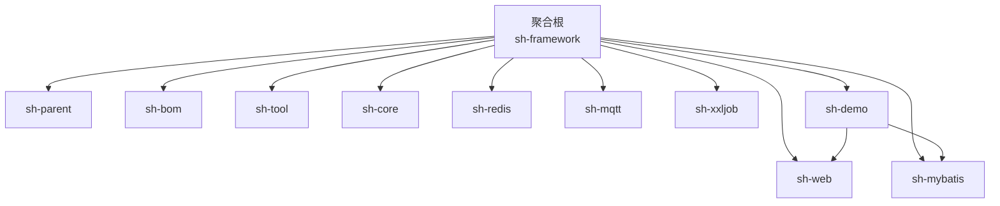
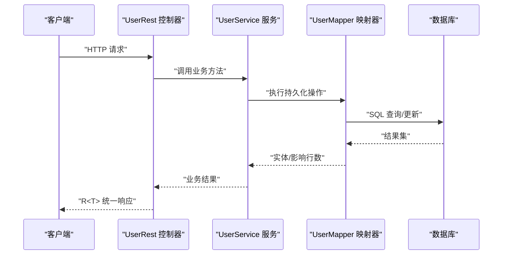
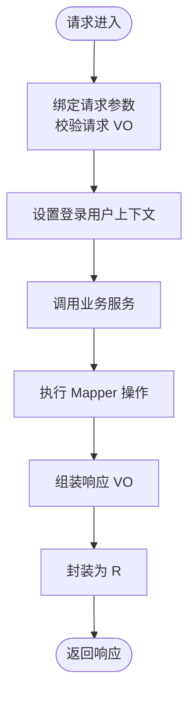
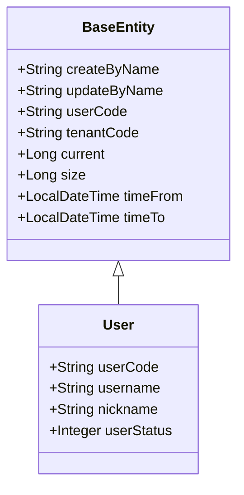
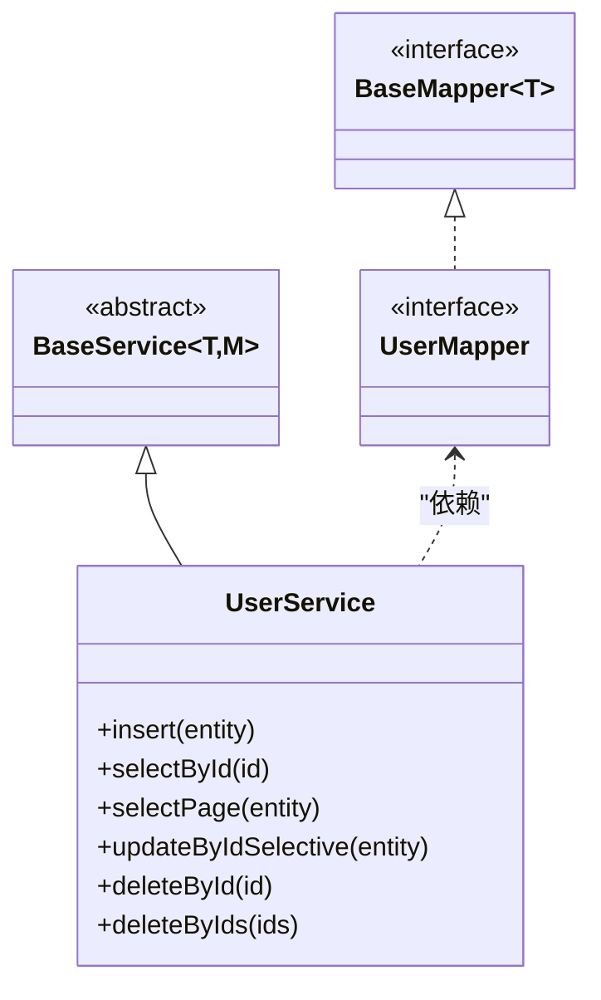
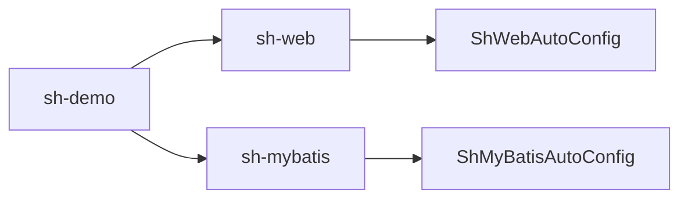

# 快速开始

<cite>
**本文引用的文件**
- [README.md](file://README.md)
- [pom.xml](file://pom.xml)
- [sh-demo/pom.xml](file://sh-demo/pom.xml)
- [sh-demo/src/main/resources/config/application.yml](file://sh-demo/src/main/resources/config/application.yml)
- [sh-demo/src/main/java/com/wkclz/demo/DemoApplication.java](file://sh-demo/src/main/java/com/wkclz/demo/DemoApplication.java)
- [sh-demo/src/main/java/com/wkclz/demo/rest/UserRest.java](file://sh-demo/src/main/java/com/wkclz/demo/rest/UserRest.java)
- [sh-demo/src/main/java/com/wkclz/demo/service/UserService.java](file://sh-demo/src/main/java/com/wkclz/demo/service/UserService.java)
- [sh-demo/src/main/java/com/wkclz/demo/mapper/UserMapper.java](file://sh-demo/src/main/java/com/wkclz/demo/mapper/UserMapper.java)
- [sh-demo/src/main/java/com/wkclz/demo/bean/entity/User.java](file://sh-demo/src/main/java/com/wkclz/demo/bean/entity/User.java)
- [sh-demo/src/main/java/com/wkclz/demo/rest/Route.java](file://sh-demo/src/main/java/com/wkclz/demo/rest/Route.java)
- [sh-core/src/main/java/com/wkclz/core/base/BaseEntity.java](file://sh-core/src/main/java/com/wkclz/core/base/BaseEntity.java)
- [sh-core/src/main/java/com/wkclz/core/base/R.java](file://sh-core/src/main/java/com/wkclz/core/base/R.java)
- [sh-web/src/main/java/com/wkclz/web/ShWebAutoConfig.java](file://sh-web/src/main/java/com/wkclz/web/ShWebAutoConfig.java)
- [sh-mybatis/src/main/java/com/wkclz/mybatis/ShMyBatisAutoConfig.java](file://sh-mybatis/src/main/java/com/wkclz/mybatis/ShMyBatisAutoConfig.java)
- [sh-redis/src/main/java/com/wkclz/redis/ShRedisAutoConfig.java](file://sh-redis/src/main/java/com/wkclz/redis/ShRedisAutoConfig.java)
</cite>

## 目录
1. [简介](#简介)
2. [项目结构](#项目结构)
3. [核心组件](#核心组件)
4. [架构概览](#架构概览)
5. [详细组件分析](#详细组件分析)
6. [依赖分析](#依赖分析)
7. [性能考虑](#性能考虑)
8. [故障排除指南](#故障排除指南)
9. [结论](#结论)
10. [附录](#附录)

## 简介
本指南面向首次接触 sh-framework 的开发者，帮助你在约 30 分钟内完成环境准备、项目搭建与第一个示例应用的运行。你将学习如何：
- 准备 JDK 与 Maven 环境
- 使用 IDE 导入与构建项目
- 运行 sh-demo 示例模块
- 理解 CRUD 标准范式与统一返回结构
- 配置数据库、Redis 与 MQTT Broker（可选）

## 项目结构
sh-framework 是一个多模块 Maven 聚合工程，采用分层与功能域划分的模块化设计。核心模块包括：
- sh-core：基础能力（实体基类、统一返回、异常体系等）
- sh-web：Web 层自动装配与 REST 基础设施
- sh-mybatis：MyBatis 自动装配与通用 Mapper
- sh-demo：示例模块，演示标准 CRUD 范式与统一返回结构
- 其他模块：sh-redis、sh-mqtt、sh-xxljob 等（可按需启用）

图表来源
- [pom.xml:21-34](file://pom.xml#L21-L34)

章节来源
- [pom.xml:1-36](file://pom.xml#L1-L36)

## 核心组件
- 统一返回结构 R：所有接口返回统一包装对象，包含状态码、消息与数据，并记录请求/响应时间与耗时。
- 实体基类 BaseEntity：内置分页、排序、时间范围等查询辅助字段，便于通用查询与分页。
- Web 自动装配：通过 ShWebAutoConfig 扫描 Web 相关组件，提供 REST 基础设施。
- MyBatis 自动装配：通过 ShMyBatisAutoConfig 扫描 Mapper 与自动配置，简化持久层接入。

章节来源
- [sh-core/src/main/java/com/wkclz/core/base/R.java:1-76](file://sh-core/src/main/java/com/wkclz/core/base/R.java#L1-L76)
- [sh-core/src/main/java/com/wkclz/core/base/BaseEntity.java:1-94](file://sh-core/src/main/java/com/wkclz/core/base/BaseEntity.java#L1-L94)
- [sh-web/src/main/java/com/wkclz/web/ShWebAutoConfig.java:1-12](file://sh-web/src/main/java/com/wkclz/web/ShWebAutoConfig.java#L1-L12)
- [sh-mybatis/src/main/java/com/wkclz/mybatis/ShMyBatisAutoConfig.java:1-14](file://sh-mybatis/src/main/java/com/wkclz/mybatis/ShMyBatisAutoConfig.java#L1-L14)

## 架构概览
下图展示了 sh-demo 的典型运行链路：客户端发起 REST 请求，经由 Web 层进入控制器，调用服务层，再通过通用 Mapper 访问数据库，最终以统一返回结构 R 包裹数据返回。

图表来源
- [sh-demo/src/main/java/com/wkclz/demo/rest/UserRest.java:1-98](file://sh-demo/src/main/java/com/wkclz/demo/rest/UserRest.java#L1-L98)
- [sh-demo/src/main/java/com/wkclz/demo/service/UserService.java:1-12](file://sh-demo/src/main/java/com/wkclz/demo/service/UserService.java#L1-L12)
- [sh-demo/src/main/java/com/wkclz/demo/mapper/UserMapper.java:1-10](file://sh-demo/src/main/java/com/wkclz/demo/mapper/UserMapper.java#L1-L10)

## 详细组件分析

### 环境准备与 IDE 设置
- JDK 版本
  - 聚合根 POM 中声明编译目标为 25，请确保本地安装 JDK 25 或更高版本。
- Maven 配置
  - 使用 Maven 3.6+，建议使用 3.9+ 以获得更好的依赖解析与插件支持。
- IDE 设置
  - 推荐使用 IntelliJ IDEA 或 VS Code + Spring Boot 插件
  - 导入方式：打开仓库根目录的 pom.xml，等待索引与依赖下载完成
  - 如需热部署，可开启 Lombok 注解处理与 Spring Boot DevTools（非必需）

章节来源
- [pom.xml:15-19](file://pom.xml#L15-L19)

### 创建与运行 sh-demo 示例
- 步骤 1：克隆或下载仓库后，使用 IDE 打开根目录 pom.xml
- 步骤 2：在 sh-demo 模块中找到入口类，直接运行其 main 方法启动应用
  - 入口类路径参考：[DemoApplication.java:1-15](file://sh-demo/src/main/java/com/wkclz/demo/DemoApplication.java#L1-L15)
- 步骤 3：应用默认监听端口为 8080，可通过配置文件调整
  - 默认配置参考：[application.yml:1-26](file://sh-demo/src/main/resources/config/application.yml#L1-L26)
- 步骤 4：访问 Swagger UI（若启用）或直接使用 curl/postman 测试接口

章节来源
- [sh-demo/src/main/java/com/wkclz/demo/DemoApplication.java:1-15](file://sh-demo/src/main/java/com/wkclz/demo/DemoApplication.java#L1-L15)
- [sh-demo/src/main/resources/config/application.yml:1-26](file://sh-demo/src/main/resources/config/application.yml#L1-L26)

### CRUD 标准范式与接口说明
sh-demo 提供了标准的用户管理接口，遵循“请求 VO → 业务服务 → Mapper → 数据库”的链路，并以统一返回结构 R 包裹结果。

- 分页查询
  - 路由前缀与接口定义参考：[Route.java:1-25](file://sh-demo/src/main/java/com/wkclz/demo/rest/Route.java#L1-L25)
  - 控制器实现参考：[UserRest.java:30-44](file://sh-demo/src/main/java/com/wkclz/demo/rest/UserRest.java#L30-L44)
- 详情查询
  - 控制器实现参考：[UserRest.java:46-57](file://sh-demo/src/main/java/com/wkclz/demo/rest/UserRest.java#L46-L57)
- 新增用户
  - 控制器实现参考：[UserRest.java:59-69](file://sh-demo/src/main/java/com/wkclz/demo/rest/UserRest.java#L59-L69)
- 更新用户
  - 控制器实现参考：[UserRest.java:71-79](file://sh-demo/src/main/java/com/wkclz/demo/rest/UserRest.java#L71-L79)
- 删除用户（单个/批量）
  - 控制器实现参考：[UserRest.java:81-89](file://sh-demo/src/main/java/com/wkclz/demo/rest/UserRest.java#L81-L89)

图表来源
- [sh-demo/src/main/java/com/wkclz/demo/rest/UserRest.java:1-98](file://sh-demo/src/main/java/com/wkclz/demo/rest/UserRest.java#L1-L98)

章节来源
- [sh-demo/src/main/java/com/wkclz/demo/rest/Route.java:1-25](file://sh-demo/src/main/java/com/wkclz/demo/rest/Route.java#L1-L25)
- [sh-demo/src/main/java/com/wkclz/demo/rest/UserRest.java:1-98](file://sh-demo/src/main/java/com/wkclz/demo/rest/UserRest.java#L1-L98)

### 数据模型与实体关系
- 用户实体 User 继承自 BaseEntity，具备分页与查询辅助字段
- 控制器通过 BeanUtils 将请求/响应对象与实体进行映射

图表来源
- [sh-core/src/main/java/com/wkclz/core/base/BaseEntity.java:1-94](file://sh-core/src/main/java/com/wkclz/core/base/BaseEntity.java#L1-L94)
- [sh-demo/src/main/java/com/wkclz/demo/bean/entity/User.java:1-28](file://sh-demo/src/main/java/com/wkclz/demo/bean/entity/User.java#L1-L28)

章节来源
- [sh-core/src/main/java/com/wkclz/core/base/BaseEntity.java:1-94](file://sh-core/src/main/java/com/wkclz/core/base/BaseEntity.java#L1-L94)
- [sh-demo/src/main/java/com/wkclz/demo/bean/entity/User.java:1-28](file://sh-demo/src/main/java/com/wkclz/demo/bean/entity/User.java#L1-L28)

### 服务与 Mapper 结构
- BaseService 作为通用业务基类，UserService 继承之，提供标准 CRUD 能力
- BaseMapper 由 ShMyBatisAutoConfig 自动扫描并注册，UserMapper 通过注解声明

图表来源
- [sh-demo/src/main/java/com/wkclz/demo/service/UserService.java:1-12](file://sh-demo/src/main/java/com/wkclz/demo/service/UserService.java#L1-L12)
- [sh-demo/src/main/java/com/wkclz/demo/mapper/UserMapper.java:1-10](file://sh-demo/src/main/java/com/wkclz/demo/mapper/UserMapper.java#L1-L10)

章节来源
- [sh-demo/src/main/java/com/wkclz/demo/service/UserService.java:1-12](file://sh-demo/src/main/java/com/wkclz/demo/service/UserService.java#L1-L12)
- [sh-demo/src/main/java/com/wkclz/demo/mapper/UserMapper.java:1-10](file://sh-demo/src/main/java/com/wkclz/demo/mapper/UserMapper.java#L1-L10)

## 依赖分析
sh-demo 的依赖关系如下：
- sh-demo 依赖 sh-web 与 sh-mybatis
- sh-web 与 sh-mybatis 通过各自的自动装配类进行组件扫描与 Mapper 扫描

图表来源
- [sh-demo/pom.xml:21-31](file://sh-demo/pom.xml#L21-L31)
- [sh-web/src/main/java/com/wkclz/web/ShWebAutoConfig.java:1-12](file://sh-web/src/main/java/com/wkclz/web/ShWebAutoConfig.java#L1-L12)
- [sh-mybatis/src/main/java/com/wkclz/mybatis/ShMyBatisAutoConfig.java:1-14](file://sh-mybatis/src/main/java/com/wkclz/mybatis/ShMyBatisAutoConfig.java#L1-L14)

章节来源
- [sh-demo/pom.xml:1-42](file://sh-demo/pom.xml#L1-L42)

## 性能考虑
- 统一返回结构 R 已内置请求/响应时间与耗时字段，便于接口性能观测
- BaseEntity 内置分页字段，建议在查询接口中优先使用分页参数，避免一次性加载大量数据
- MyBatis 自动装配已启用驼峰映射与分页插件，减少重复配置

## 故障排除指南
- 应用无法启动或端口占用
  - 检查 application.yml 中 server.port 是否被占用；必要时修改为其他端口
  - 参考：[application.yml:1-26](file://sh-demo/src/main/resources/config/application.yml#L1-L26)
- 数据库连接失败
  - 确认 datasource 驱动与连接信息正确；默认使用 MySQL 驱动
  - 参考：[application.yml:9-12](file://sh-demo/src/main/resources/config/application.yml#L9-L12)
- MyBatis Mapper 未扫描
  - 确认 ShMyBatisAutoConfig 已生效且 MapperScan 路径正确
  - 参考：[ShMyBatisAutoConfig.java:1-14](file://sh-mybatis/src/main/java/com/wkclz/mybatis/ShMyBatisAutoConfig.java#L1-L14)
- Redis 配置相关问题（可选）
  - 若启用 sh-redis，确认 ShRedisAutoConfig 生效并正确配置连接参数
  - 参考：[ShRedisAutoConfig.java:1-12](file://sh-redis/src/main/java/com/wkclz/redis/ShRedisAutoConfig.java#L1-L12)
- MQTT Broker 配置相关问题（可选）
  - 若启用 sh-mqtt，确认 MqttConfig 与 Broker 地址、认证信息正确
  - 参考：[sh-mqtt 模块说明](file://sh-mqtt/README.md)

章节来源
- [sh-demo/src/main/resources/config/application.yml:1-26](file://sh-demo/src/main/resources/config/application.yml#L1-L26)
- [sh-mybatis/src/main/java/com/wkclz/mybatis/ShMyBatisAutoConfig.java:1-14](file://sh-mybatis/src/main/java/com/wkclz/mybatis/ShMyBatisAutoConfig.java#L1-L14)
- [sh-redis/src/main/java/com/wkclz/redis/ShRedisAutoConfig.java:1-12](file://sh-redis/src/main/java/com/wkclz/redis/ShRedisAutoConfig.java#L1-L12)

## 结论
通过本指南，你已经完成了：
- 环境准备与项目导入
- 运行 sh-demo 示例
- 理解 CRUD 标准范式与统一返回结构
- 掌握常见配置与故障排除方法
建议在本地继续探索 sh-web、sh-mybatis、sh-redis、sh-mqtt 等模块，逐步扩展你的应用能力。

## 附录

### 常见开发环境配置清单
- 数据库连接
  - 在 application.yml 中配置 spring.datasource.* 项（如 url、username、password、driver-class-name）
  - 参考：[application.yml:9-12](file://sh-demo/src/main/resources/config/application.yml#L9-L12)
- Redis（可选）
  - 在 application.yml 中配置 spring.redis.* 项（如 host、port、password、database）
  - 参考：[ShRedisAutoConfig.java:1-12](file://sh-redis/src/main/java/com/wkclz/redis/ShRedisAutoConfig.java#L1-L12)
- MQTT Broker（可选）
  - 在 application.yml 中配置 mqtt.* 项（如 broker、username、password）
  - 参考：[sh-mqtt 模块说明](file://sh-mqtt/README.md)