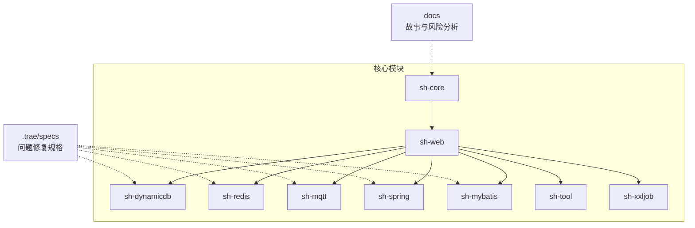
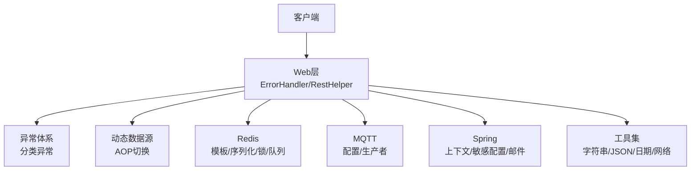
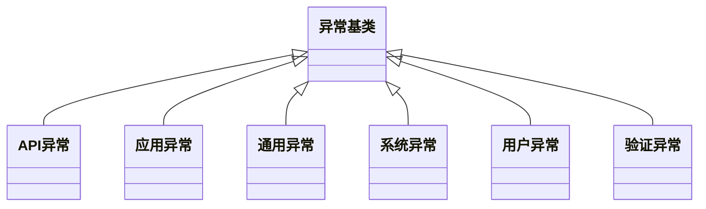
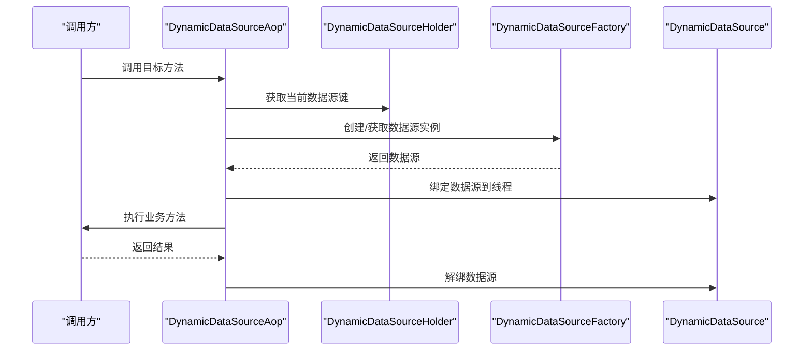
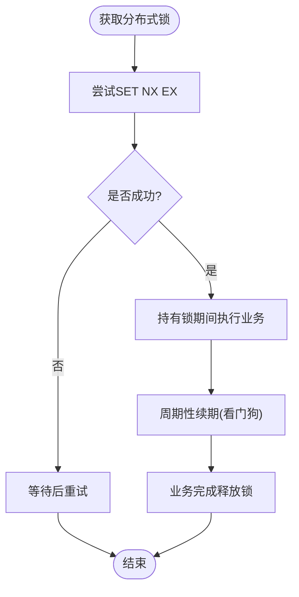
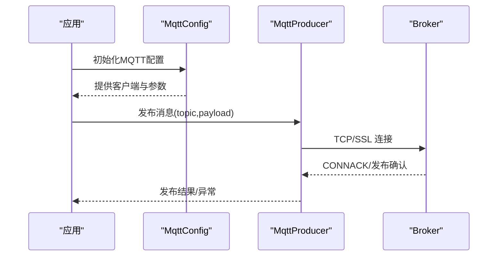
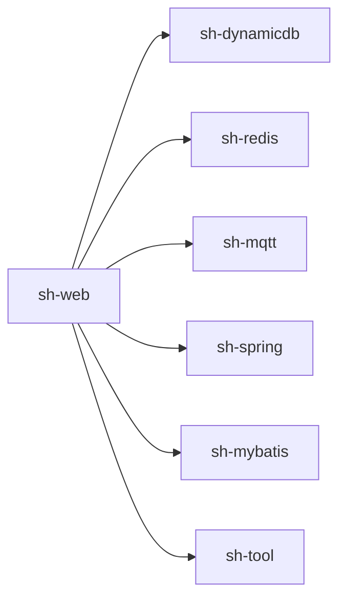

# 故障排除与FAQ

<cite>
**本文引用的文件**   
- [README.md](file://README.md)
- [AGENTS.md](file://AGENTS.md)
- [docs/risk-analysis.md](file://docs/risk-analysis.md)
- [.trae/specs/fix-fastjson2-autotype-vuln/spec.md](file://.trae/specs/fix-fastjson2-autotype-vuln/spec.md)
- [.trae/specs/fix-fastjson2-autotype-vuln/checklist.md](file://.trae/specs/fix-fastjson2-autotype-vuln/checklist.md)
- [.trae/specs/fix-sensitive-config-plaintext/tasks.md](file://.trae/specs/fix-sensitive-config-plaintext/tasks.md)
- [.trae/specs/fix-dynamicdb-connection-pool-leak/spec.md](file://.trae/specs/fix-dynamicdb-connection-pool-leak/spec.md)
- [.trae/specs/fix-dynamicdb-dcl-blocking/spec.md](file://.trae/specs/fix-dynamicdb-dcl-blocking/spec.md)
- [.trae/specs/fix-threadlocal-leak/spec.md](file://.trae/specs/fix-threadlocal-leak/spec.md)
- [.trae/specs/fix-redis-lock-watchdog/spec.md](file://.trae/specs/fix-redis-lock-watchdog/spec.md)
- [.trae/specs/fix-sql-injection-updateby/spec.md](file://.trae/specs/fix-sql-injection-updateby/spec.md)
- [.trae/specs/optimize-sql-provider-reflection/spec.md](file://.trae/specs/optimize-sql-provider-reflection/spec.md)
- [sh-core/src/main/java/com/wkclz/core/exception/ApiException.java](file://sh-core/src/main/java/com/wkclz/core/exception/ApiException.java)
- [sh-core/src/main/java/com/wkclz/core/exception/ApplicationException.java](file://sh-core/src/main/java/com/wkclz/core/exception/ApplicationException.java)
- [sh-core/src/main/java/com/wkclz/core/exception/CommonException.java](file://sh-core/src/main/java/com/wkclz/core/exception/CommonException.java)
- [sh-core/src/main/java/com/wkclz/core/exception/SystemException.java](file://sh-core/src/main/java/com/wkclz/core/exception/SystemException.java)
- [sh-core/src/main/java/com/wkclz/core/exception/UserException.java](file://sh-core/src/main/java/com/wkclz/core/exception/UserException.java)
- [sh-core/src/main/java/com/wkclz/core/exception/ValidationException.java](file://sh-core/src/main/java/com/wkclz/core/exception/ValidationException.java)
- [sh-web/src/main/java/com/wkclz/web/rest/ErrorHandler.java](file://sh-web/src/main/java/com/wkclz/web/rest/ErrorHandler.java)
- [sh-web/src/main/java/com/wkclz/web/helper/LocalThreadHelper.java](file://sh-web/src/main/java/com/wkclz/web/helper/LocalThreadHelper.java)
- [sh-web/src/main/java/com/wkclz/web/helper/RequestHelper.java](file://sh-web/src/main/java/com/wkclz/web/helper/RequestHelper.java)
- [sh-web/src/main/java/com/wkclz/web/helper/ResponseHelper.java](file://sh-web/src/main/java/com/wkclz/web/helper/ResponseHelper.java)
- [sh-web/src/main/java/com/wkclz/web/helper/RestHelper.java](file://sh-web/src/main/java/com/wkclz/web/helper/RestHelper.java)
- [sh-web/src/main/resources/META-INF/spring/org.springframework.boot.autoconfigure.AutoConfiguration.imports](file://sh-web/src/main/resources/META-INF/spring/org.springframework.boot.autoconfigure.AutoConfiguration.imports)
- [sh-dynamicdb/src/main/java/com/wkclz/dynamicdb/DynamicDataSource.java](file://sh-dynamicdb/src/main/java/com/wkclz/dynamicdb/DynamicDataSource.java)
- [sh-dynamicdb/src/main/java/com/wkclz/dynamicdb/DynamicDataSourceFactory.java](file://sh-dynamicdb/src/main/java/com/wkclz/dynamicdb/DynamicDataSourceFactory.java)
- [sh-dynamicdb/src/main/java/com/wkclz/dynamicdb/DynamicDataSourceHolder.java](file://sh-dynamicdb/src/main/java/com/wkclz/dynamicdb/DynamicDataSourceHolder.java)
- [sh-dynamicdb/src/main/java/com/wkclz/dynamicdb/aop/DynamicDataSourceAop.java](file://sh-dynamicdb/src/main/java/com/wkclz/dynamicdb/aop/DynamicDataSourceAop.java)
- [sh-dynamicdb/src/main/java/com/wkclz/dynamicdb/config/DynamicDataSourceAutoConfig.java](file://sh-dynamicdb/src/main/java/com/wkclz/dynamicdb/config/DynamicDataSourceAutoConfig.java)
- [sh-dynamicdb/src/main/java/com/wkclz/dynamicdb/config/DynamicDataSourceConfig.java](file://sh-dynamicdb/src/main/java/com/wkclz/dynamicdb/config/DynamicDataSourceConfig.java)
- [sh-dynamicdb/src/main/resources/META-INF/spring/org.springframework.boot.autoconfigure.AutoConfiguration.imports](file://sh-dynamicdb/src/main/resources/META-INF/spring/org.springframework.boot.autoconfigure.AutoConfiguration.imports)
- [sh-redis/src/main/java/com/wkclz/redis/helper/RedisHelper.java](file://sh-redis/src/main/java/com/wkclz/redis/helper/RedisHelper.java)
- [sh-redis/src/main/java/com/wkclz/redis/helper/RedisLock.java](file://sh-redis/src/main/java/com/wkclz/redis/helper/RedisLock.java)
- [sh-redis/src/main/java/com/wkclz/redis/queue/RedisMessageQueue.java](file://sh-redis/src/main/java/com/wkclz/redis/queue/RedisMessageQueue.java)
- [sh-redis/src/main/java/com/wkclz/redis/serializer/Fastjson2JsonRedisSerializer.java](file://sh-redis/src/main/java/com/wkclz/redis/serializer/Fastjson2JsonRedisSerializer.java)
- [sh-redis/src/main/java/com/wkclz/redis/config/RedisConfig.java](file://sh-redis/src/main/java/com/wkclz/redis/config/RedisConfig.java)
- [sh-redis/src/main/java/com/wkclz/redis/config/RedisTemplateConfig.java](file://sh-redis/src/main/java/com/wkclz/redis/config/RedisTemplateConfig.java)
- [sh-redis/src/main/resources/META-INF/spring/org.springframework.boot.autoconfigure.AutoConfiguration.imports](file://sh-redis/src/main/resources/META-INF/spring/org.springframework.boot.autoconfigure.AutoConfiguration.imports)
- [sh-mqtt/src/main/java/com/wkclz/mqtt/config/MqttConfig.java](file://sh-mqtt/src/main/java/com/wkclz/mqtt/config/MqttConfig.java)
- [sh-mqtt/src/main/java/com/wkclz/mqtt/client/MqttProducer.java](file://sh-mqtt/src/main/java/com/wkclz/mqtt/client/MqttProducer.java)
- [sh-mqtt/src/main/java/com/wkclz/mqtt/exception/MqttBeansException.java](file://sh-mqtt/src/main/java/com/wkclz/mqtt/exception/MqttBeansException.java)
- [sh-mqtt/src/main/java/com/wkclz/mqtt/exception/MqttRemoteException.java](file://sh-mqtt/src/main/java/com/wkclz/mqtt/exception/MqttRemoteException.java)
- [sh-mqtt/src/main/java/com/wkclz/mqtt/exception/MqttSendException.java](file://sh-mqtt/src/main/java/com/wkclz/mqtt/exception/MqttSendException.java)
- [sh-mqtt/src/main/java/com/wkclz/mqtt/exception/MqttTimeoutException.java](file://sh-mqtt/src/main/java/com/wkclz/mqtt/exception/MqttTimeoutException.java)
- [sh-mqtt/src/main/resources/META-INF/spring/org.springframework.boot.autoconfigure.AutoConfiguration.imports](file://sh-mqtt/src/main/resources/META-INF/spring/org.springframework.boot.autoconfigure.AutoConfiguration.imports)
- [sh-spring/src/main/java/com/wkclz/spring/config/SensitiveConfigDecryptor.java](file://sh-spring/src/main/java/com/wkclz/spring/config/SensitiveConfigDecryptor.java)
- [sh-spring/src/main/java/com/wkclz/spring/config/SensitiveConfigEncryptor.java](file://sh-spring/src/main/java/com/wkclz/spring/config/SensitiveConfigEncryptor.java)
- [sh-spring/src/main/java/com/wkclz/spring/utils/MailUtil.java](file://sh-spring/src/main/java/com/wkclz/spring/utils/MailUtil.java)
- [sh-spring/src/main/resources/META-INF/spring/org.springframework.boot.autoconfigure.AutoConfiguration.imports](file://sh-spring/src/main/resources/META-INF/spring/org.springframework.boot.autoconfigure.AutoConfiguration.imports)
- [sh-tool/src/main/java/com/wkclz/tool/utils/StringUtil.java](file://sh-tool/src/main/java/com/wkclz/tool/utils/StringUtil.java)
- [sh-tool/src/main/java/com/wkclz/tool/utils/JsonUtil.java](file://sh-tool/src/main/java/com/wkclz/tool/utils/JsonUtil.java)
- [sh-tool/src/main/java/com/wkclz/tool/utils/ServerStateUtil.java](file://sh-tool/src/main/java/com/wkclz/tool/utils/ServerStateUtil.java)
- [sh-tool/src/main/java/com/wkclz/tool/utils/NetworkUtil.java](file://sh-tool/src/main/java/com/wkclz/tool/utils/NetworkUtil.java)
- [sh-tool/src/main/java/com/wkclz/tool/utils/ValidateCode.java](file://sh-tool/src/main/java/com/wkclz/tool/utils/ValidateCode.java)
- [sh-tool/src/main/java/com/wkclz/tool/utils/SecretUtil.java](file://sh-tool/src/main/java/com/wkclz/tool/utils/SecretUtil.java)
- [sh-tool/src/main/java/com/wkclz/tool/utils/BeanUtil.java](file://sh-tool/src/main/java/com/wkclz/tool/utils/BeanUtil.java)
- [sh-tool/src/main/java/com/wkclz/tool/utils/MapUtil.java](file://sh-tool/src/main/java/com/wkclz/tool/utils/MapUtil.java)
- [sh-tool/src/main/java/com/wkclz/tool/utils/DateUtil.java](file://sh-tool/src/main/java/com/wkclz/tool/utils/DateUtil.java)
- [sh-tool/src/main/java/com/wkclz/tool/utils/FileUtil.java](file://sh-tool/src/main/java/com/wkclz/tool/utils/FileUtil.java)
- [sh-tool/src/main/java/com/wkclz/tool/utils/EnumUtil.java](file://sh-tool/src/main/java/com/wkclz/tool/utils/EnumUtil.java)
- [sh-tool/src/main/java/com/wkclz/tool/utils/IntegerUtil.java](file://sh-tool/src/main/java/com/wkclz/tool/utils/IntegerUtil.java)
- [sh-tool/src/main/java/com/wkclz/tool/utils/QrCodeUtil.java](file://sh-tool/src/main/java/com/wkclz/tool/utils/QrCodeUtil.java)
- [sh-tool/src/main/java/com/wkclz/tool/utils/AreaUtil.java](file://sh-tool/src/main/java/com/wkclz/tool/utils/AreaUtil.java)
- [sh-tool/src/main/java/com/wkclz/tool/utils/CheckPwdUtil.java](file://sh-tool/src/main/java/com/wkclz/tool/utils/CheckPwdUtil.java)
- [sh-tool/src/main/java/com/wkclz/tool/utils/ClassUtil.java](file://sh-tool/src/main/java/com/wkclz/tool/utils/ClassUtil.java)
- [sh-tool/src/main/java/com/wkclz/tool/utils/PropertiesUtil.java](file://sh-tool/src/main/java/com/wkclz/tool/utils/PropertiesUtil.java)
- [sh-tool/src/main/java/com/wkclz/tool/utils/CompressUtil.java](file://sh-tool/src/main/java/com/wkclz/tool/utils/CompressUtil.java)
- [sh-tool/src/main/java/com/wkclz/tool/utils/RsaTool.java](file://sh-tool/src/main/java/com/wkclz/tool/utils/RsaTool.java)
- [sh-tool/src/main/java/com/wkclz/tool/utils/AesTool.java](file://sh-tool/src/main/java/com/wkclz/tool/utils/AesTool.java)
- [sh-tool/src/main/java/com/wkclz/tool/utils/Base64Tool.java](file://sh-tool/src/main/java/com/wkclz/tool/utils/Base64Tool.java)
- [sh-tool/src/main/java/com/wkclz/tool/utils/Md5Tool.java](file://sh-tool/src/main/java/com/wkclz/tool/utils/Md5Tool.java)
- [sh-tool/src/main/java/com/wkclz/tool/utils/ShaTool.java](file://sh-tool/src/main/java/com/wkclz/tool/utils/ShaTool.java)
- [sh-tool/src/main/java/com/wkclz/tool/utils/JsUtil.java](file://sh-tool/src/main/java/com/wkclz/tool/utils/JsUtil.java)
- [sh-tool/src/main/java/com/wkclz/tool/utils/RegularTool.java](file://sh-tool/src/main/java/com/wkclz/tool/utils/RegularTool.java)
- [sh-tool/src/main/java/com/wkclz/tool/utils/ServerStateUtil.java](file://sh-tool/src/main/java/com/wkclz/tool/utils/ServerStateUtil.java)
- [sh-demo/src/main/resources/config/application.yml](file://sh-demo/src/main/resources/config/application.yml)
</cite>

## 目录
1. 引言
2. 项目结构
3. 核心组件
4. 架构总览
5. 详细组件分析
6. 依赖关系分析
7. 性能考虑
8. 故障排除指南
9. 结论
10. 附录

## 引言
本文件面向sh-framework使用者与维护者，提供系统化的故障排除与常见问题解答（FAQ）。内容覆盖安全风险分析、TRAE规格中的问题修复记录、开发期常见问题（配置错误、依赖冲突、性能问题）、调试与日志分析、监控与告警、异常处理最佳实践、性能调优建议以及社区支持与反馈流程。所有结论均基于仓库内实际代码与文档，确保可追溯性与可操作性。

## 项目结构
sh-framework采用多模块聚合结构，核心模块包括：
- sh-core：基础能力与异常体系
- sh-web：Web层与全局异常处理
- sh-dynamicdb：动态数据源与连接池管理
- sh-redis：Redis客户端与分布式锁
- sh-mqtt：MQTT消息发布订阅
- sh-spring：Spring上下文与敏感配置加解密
- sh-mybatis：MyBatis增强与拦截器
- sh-tool：通用工具集
- sh-xxljob：定时任务集成
- docs：故事文档与风险分析
- .trae/specs：问题修复规格与任务清单

图示来源
- [pom.xml](file://pom.xml)
- [sh-web/src/main/resources/META-INF/spring/org.springframework.boot.autoconfigure.AutoConfiguration.imports](file://sh-web/src/main/resources/META-INF/spring/org.springframework.boot.autoconfigure.AutoConfiguration.imports)
- [sh-dynamicdb/src/main/resources/META-INF/spring/org.springframework.boot.autoconfigure.AutoConfiguration.imports](file://sh-dynamicdb/src/main/resources/META-INF/spring/org.springframework.boot.autoconfigure.AutoConfiguration.imports)
- [sh-redis/src/main/resources/META-INF/spring/org.springframework.boot.autoconfigure.AutoConfiguration.imports](file://sh-redis/src/main/resources/META-INF/spring/org.springframework.boot.autoconfigure.AutoConfiguration.imports)
- [sh-mqtt/src/main/resources/META-INF/spring/org.springframework.boot.autoconfigure.AutoConfiguration.imports](file://sh-mqtt/src/main/resources/META-INF/spring/org.springframework.boot.autoconfigure.AutoConfiguration.imports)
- [sh-spring/src/main/resources/META-INF/spring/org.springframework.boot.autoconfigure.AutoConfiguration.imports](file://sh-spring/src/main/resources/META-INF/spring/org.springframework.boot.autoconfigure.AutoConfiguration.imports)

章节来源
- [pom.xml](file://pom.xml)
- [README.md](file://README.md)

## 核心组件
- 异常体系：统一异常基类与分类异常，便于全局捕获与分级处理。
- Web层：全局异常处理器、请求/响应辅助、线程本地工具。
- 动态数据源：AOP切换、工厂与持有器、自动装配配置。
- Redis：模板配置、序列化器、分布式锁与消息队列。
- MQTT：配置、生产者、异常类型与自动装配。
- Spring：上下文持有、敏感配置加解密、邮件工具。
- MyBatis：拦截器、通用Mapper提供者、自动装配。
- 工具集：字符串、JSON、日期、网络、加解密等常用工具。
- 文档与规格：风险分析、功能故事、问题修复规格。

章节来源
- [sh-core/src/main/java/com/wkclz/core/exception/ApiException.java](file://sh-core/src/main/java/com/wkclz/core/exception/ApiException.java)
- [sh-core/src/main/java/com/wkclz/core/exception/ApplicationException.java](file://sh-core/src/main/java/com/wkclz/core/exception/ApplicationException.java)
- [sh-core/src/main/java/com/wkclz/core/exception/CommonException.java](file://sh-core/src/main/java/com/wkclz/core/exception/CommonException.java)
- [sh-core/src/main/java/com/wkclz/core/exception/SystemException.java](file://sh-core/src/main/java/com/wkclz/core/exception/SystemException.java)
- [sh-core/src/main/java/com/wkclz/core/exception/UserException.java](file://sh-core/src/main/java/com/wkclz/core/exception/UserException.java)
- [sh-core/src/main/java/com/wkclz/core/exception/ValidationException.java](file://sh-core/src/main/java/com/wkclz/core/exception/ValidationException.java)
- [sh-web/src/main/java/com/wkclz/web/rest/ErrorHandler.java](file://sh-web/src/main/java/com/wkclz/web/rest/ErrorHandler.java)
- [sh-web/src/main/java/com/wkclz/web/helper/LocalThreadHelper.java](file://sh-web/src/main/java/com/wkclz/web/helper/LocalThreadHelper.java)
- [sh-dynamicdb/src/main/java/com/wkclz/dynamicdb/aop/DynamicDataSourceAop.java](file://sh-dynamicdb/src/main/java/com/wkclz/dynamicdb/aop/DynamicDataSourceAop.java)
- [sh-dynamicdb/src/main/java/com/wkclz/dynamicdb/DynamicDataSource.java](file://sh-dynamicdb/src/main/java/com/wkclz/dynamicdb/DynamicDataSource.java)
- [sh-dynamicdb/src/main/java/com/wkclz/dynamicdb/DynamicDataSourceFactory.java](file://sh-dynamicdb/src/main/java/com/wkclz/dynamicdb/DynamicDataSourceFactory.java)
- [sh-dynamicdb/src/main/java/com/wkclz/dynamicdb/DynamicDataSourceHolder.java](file://sh-dynamicdb/src/main/java/com/wkclz/dynamicdb/DynamicDataSourceHolder.java)
- [sh-redis/src/main/java/com/wkclz/redis/config/RedisConfig.java](file://sh-redis/src/main/java/com/wkclz/redis/config/RedisConfig.java)
- [sh-redis/src/main/java/com/wkclz/redis/serializer/Fastjson2JsonRedisSerializer.java](file://sh-redis/src/main/java/com/wkclz/redis/serializer/Fastjson2JsonRedisSerializer.java)
- [sh-redis/src/main/java/com/wkclz/redis/helper/RedisLock.java](file://sh-redis/src/main/java/com/wkclz/redis/helper/RedisLock.java)
- [sh-redis/src/main/java/com/wkclz/redis/queue/RedisMessageQueue.java](file://sh-redis/src/main/java/com/wkclz/redis/queue/RedisMessageQueue.java)
- [sh-mqtt/src/main/java/com/wkclz/mqtt/config/MqttConfig.java](file://sh-mqtt/src/main/java/com/wkclz/mqtt/config/MqttConfig.java)
- [sh-mqtt/src/main/java/com/wkclz/mqtt/client/MqttProducer.java](file://sh-mqtt/src/main/java/com/wkclz/mqtt/client/MqttProducer.java)
- [sh-spring/src/main/java/com/wkclz/spring/config/SensitiveConfigDecryptor.java](file://sh-spring/src/main/java/com/wkclz/spring/config/SensitiveConfigDecryptor.java)
- [sh-spring/src/main/java/com/wkclz/spring/config/SensitiveConfigEncryptor.java](file://sh-spring/src/main/java/com/wkclz/spring/config/SensitiveConfigEncryptor.java)
- [sh-spring/src/main/java/com/wkclz/spring/utils/MailUtil.java](file://sh-spring/src/main/java/com/wkclz/spring/utils/MailUtil.java)
- [sh-tool/src/main/java/com/wkclz/tool/utils/StringUtil.java](file://sh-tool/src/main/java/com/wkclz/tool/utils/StringUtil.java)
- [sh-tool/src/main/java/com/wkclz/tool/utils/JsonUtil.java](file://sh-tool/src/main/java/com/wkclz/tool/utils/JsonUtil.java)

## 架构总览
下图展示Web层到各基础设施模块的典型调用链，体现异常处理、动态数据源切换、Redis与MQTT交互、Spring上下文与工具集的协作。

图示来源
- [sh-web/src/main/java/com/wkclz/web/rest/ErrorHandler.java](file://sh-web/src/main/java/com/wkclz/web/rest/ErrorHandler.java)
- [sh-web/src/main/java/com/wkclz/web/helper/RestHelper.java](file://sh-web/src/main/java/com/wkclz/web/helper/RestHelper.java)
- [sh-dynamicdb/src/main/java/com/wkclz/dynamicdb/aop/DynamicDataSourceAop.java](file://sh-dynamicdb/src/main/java/com/wkclz/dynamicdb/aop/DynamicDataSourceAop.java)
- [sh-redis/src/main/java/com/wkclz/redis/config/RedisConfig.java](file://sh-redis/src/main/java/com/wkclz/redis/config/RedisConfig.java)
- [sh-mqtt/src/main/java/com/wkclz/mqtt/config/MqttConfig.java](file://sh-mqtt/src/main/java/com/wkclz/mqtt/config/MqttConfig.java)
- [sh-spring/src/main/java/com/wkclz/spring/config/SensitiveConfigDecryptor.java](file://sh-spring/src/main/java/com/wkclz/spring/config/SensitiveConfigDecryptor.java)
- [sh-tool/src/main/java/com/wkclz/tool/utils/StringUtil.java](file://sh-tool/src/main/java/com/wkclz/tool/utils/StringUtil.java)

## 详细组件分析

### 异常体系与全局异常处理
- 分类异常：涵盖API、应用、通用、系统、用户、验证等异常类型，便于前端与监控侧进行差异化处理。
- 全局异常处理器：集中捕获未处理异常，结合统一响应封装返回标准错误结构。
- 最佳实践：在业务层抛出语义明确的异常；在控制器或服务边界进行捕获与转换；对外仅暴露必要信息，避免泄露内部细节。

图示来源
- [sh-core/src/main/java/com/wkclz/core/exception/ApiException.java](file://sh-core/src/main/java/com/wkclz/core/exception/ApiException.java)
- [sh-core/src/main/java/com/wkclz/core/exception/ApplicationException.java](file://sh-core/src/main/java/com/wkclz/core/exception/ApplicationException.java)
- [sh-core/src/main/java/com/wkclz/core/exception/CommonException.java](file://sh-core/src/main/java/com/wkclz/core/exception/CommonException.java)
- [sh-core/src/main/java/com/wkclz/core/exception/SystemException.java](file://sh-core/src/main/java/com/wkclz/core/exception/SystemException.java)
- [sh-core/src/main/java/com/wkclz/core/exception/UserException.java](file://sh-core/src/main/java/com/wkclz/core/exception/UserException.java)
- [sh-core/src/main/java/com/wkclz/core/exception/ValidationException.java](file://sh-core/src/main/java/com/wkclz/core/exception/ValidationException.java)

章节来源
- [sh-web/src/main/java/com/wkclz/web/rest/ErrorHandler.java](file://sh-web/src/main/java/com/wkclz/web/rest/ErrorHandler.java)
- [sh-core/src/main/java/com/wkclz/core/exception/ApiException.java](file://sh-core/src/main/java/com/wkclz/core/exception/ApiException.java)
- [sh-core/src/main/java/com/wkclz/core/exception/ApplicationException.java](file://sh-core/src/main/java/com/wkclz/core/exception/ApplicationException.java)
- [sh-core/src/main/java/com/wkclz/core/exception/CommonException.java](file://sh-core/src/main/java/com/wkclz/core/exception/CommonException.java)
- [sh-core/src/main/java/com/wkclz/core/exception/SystemException.java](file://sh-core/src/main/java/com/wkclz/core/exception/SystemException.java)
- [sh-core/src/main/java/com/wkclz/core/exception/UserException.java](file://sh-core/src/main/java/com/wkclz/core/exception/UserException.java)
- [sh-core/src/main/java/com/wkclz/core/exception/ValidationException.java](file://sh-core/src/main/java/com/wkclz/core/exception/ValidationException.java)

### 动态数据源与连接池
- AOP切换：通过切面在方法执行前后切换数据源，保证读写分离与多数据源场景下的正确路由。
- 工厂与持有器：负责数据源实例化与当前线程绑定的数据源标识。
- 常见问题：连接泄漏、DCL阻塞、异步初始化竞争。
- 修复要点：完善关闭与回收、引入无阻塞策略、确保线程安全初始化。

图示来源
- [sh-dynamicdb/src/main/java/com/wkclz/dynamicdb/aop/DynamicDataSourceAop.java](file://sh-dynamicdb/src/main/java/com/wkclz/dynamicdb/aop/DynamicDataSourceAop.java)
- [sh-dynamicdb/src/main/java/com/wkclz/dynamicdb/DynamicDataSourceHolder.java](file://sh-dynamicdb/src/main/java/com/wkclz/dynamicdb/DynamicDataSourceHolder.java)
- [sh-dynamicdb/src/main/java/com/wkclz/dynamicdb/DynamicDataSourceFactory.java](file://sh-dynamicdb/src/main/java/com/wkclz/dynamicdb/DynamicDataSourceFactory.java)
- [sh-dynamicdb/src/main/java/com/wkclz/dynamicdb/DynamicDataSource.java](file://sh-dynamicdb/src/main/java/com/wkclz/dynamicdb/DynamicDataSource.java)

章节来源
- [.trae/specs/fix-dynamicdb-connection-pool-leak/spec.md](file://.trae/specs/fix-dynamicdb-connection-pool-leak/spec.md)
- [.trae/specs/fix-dynamicdb-dcl-blocking/spec.md](file://.trae/specs/fix-dynamicdb-dcl-blocking/spec.md)
- [sh-dynamicdb/src/main/java/com/wkclz/dynamicdb/aop/DynamicDataSourceAop.java](file://sh-dynamicdb/src/main/java/com/wkclz/dynamicdb/aop/DynamicDataSourceAop.java)
- [sh-dynamicdb/src/main/java/com/wkclz/dynamicdb/DynamicDataSource.java](file://sh-dynamicdb/src/main/java/com/wkclz/dynamicdb/DynamicDataSource.java)
- [sh-dynamicdb/src/main/java/com/wkclz/dynamicdb/DynamicDataSourceFactory.java](file://sh-dynamicdb/src/main/java/com/wkclz/dynamicdb/DynamicDataSourceFactory.java)
- [sh-dynamicdb/src/main/java/com/wkclz/dynamicdb/DynamicDataSourceHolder.java](file://sh-dynamicdb/src/main/java/com/wkclz/dynamicdb/DynamicDataSourceHolder.java)

### Redis 客户端与分布式锁
- 模板配置：统一RedisTemplate与序列化策略，保障跨类型存储一致性。
- 分布式锁：基于Redis实现可重入与看门狗机制，防止过期导致的竞态。
- 消息队列：基于Redis的发布/订阅与队列，支持示例实现。
- 常见问题：序列化兼容、锁误释放、WatchDog失效。
- 修复要点：统一序列化器、完善续期与释放逻辑、增加健康检查。

图示来源
- [sh-redis/src/main/java/com/wkclz/redis/helper/RedisLock.java](file://sh-redis/src/main/java/com/wkclz/redis/helper/RedisLock.java)
- [sh-redis/src/main/java/com/wkclz/redis/serializer/Fastjson2JsonRedisSerializer.java](file://sh-redis/src/main/java/com/wkclz/redis/serializer/Fastjson2JsonRedisSerializer.java)
- [sh-redis/src/main/java/com/wkclz/redis/queue/RedisMessageQueue.java](file://sh-redis/src/main/java/com/wkclz/redis/queue/RedisMessageQueue.java)
- [.trae/specs/fix-redis-lock-watchdog/spec.md](file://.trae/specs/fix-redis-lock-watchdog/spec.md)

章节来源
- [sh-redis/src/main/java/com/wkclz/redis/config/RedisConfig.java](file://sh-redis/src/main/java/com/wkclz/redis/config/RedisConfig.java)
- [sh-redis/src/main/java/com/wkclz/redis/config/RedisTemplateConfig.java](file://sh-redis/src/main/java/com/wkclz/redis/config/RedisTemplateConfig.java)
- [sh-redis/src/main/java/com/wkclz/redis/serializer/Fastjson2JsonRedisSerializer.java](file://sh-redis/src/main/java/com/wkclz/redis/serializer/Fastjson2JsonRedisSerializer.java)
- [sh-redis/src/main/java/com/wkclz/redis/helper/RedisLock.java](file://sh-redis/src/main/java/com/wkclz/redis/helper/RedisLock.java)
- [sh-redis/src/main/java/com/wkclz/redis/queue/RedisMessageQueue.java](file://sh-redis/src/main/java/com/wkclz/redis/queue/RedisMessageQueue.java)
- [.trae/specs/fix-redis-lock-watchdog/spec.md](file://.trae/specs/fix-redis-lock-watchdog/spec.md)

### MQTT 消息发布订阅
- 配置与自动装配：提供MqttConfig与相关后处理器，支持注解驱动的消息发布/订阅。
- 生产者与异常：发送异常、超时、远程异常、Bean装配异常等类型化异常。
- 常见问题：SSL/TLS认证失败、断线重连策略不当、主题映射冲突。
- 修复要点：完善证书与信任链配置、优化重连退避策略、规范化主题命名。

图示来源
- [sh-mqtt/src/main/java/com/wkclz/mqtt/config/MqttConfig.java](file://sh-mqtt/src/main/java/com/wkclz/mqtt/config/MqttConfig.java)
- [sh-mqtt/src/main/java/com/wkclz/mqtt/client/MqttProducer.java](file://sh-mqtt/src/main/java/com/wkclz/mqtt/client/MqttProducer.java)
- [sh-mqtt/src/main/java/com/wkclz/mqtt/exception/MqttBeansException.java](file://sh-mqtt/src/main/java/com/wkclz/mqtt/exception/MqttBeansException.java)
- [sh-mqtt/src/main/java/com/wkclz/mqtt/exception/MqttRemoteException.java](file://sh-mqtt/src/main/java/com/wkclz/mqtt/exception/MqttRemoteException.java)
- [sh-mqtt/src/main/java/com/wkclz/mqtt/exception/MqttSendException.java](file://sh-mqtt/src/main/java/com/wkclz/mqtt/exception/MqttSendException.java)
- [sh-mqtt/src/main/java/com/wkclz/mqtt/exception/MqttTimeoutException.java](file://sh-mqtt/src/main/java/com/wkclz/mqtt/exception/MqttTimeoutException.java)

章节来源
- [sh-mqtt/src/main/java/com/wkclz/mqtt/config/MqttConfig.java](file://sh-mqtt/src/main/java/com/wkclz/mqtt/config/MqttConfig.java)
- [sh-mqtt/src/main/java/com/wkclz/mqtt/client/MqttProducer.java](file://sh-mqtt/src/main/java/com/wkclz/mqtt/client/MqttProducer.java)
- [sh-mqtt/src/main/java/com/wkclz/mqtt/exception/MqttBeansException.java](file://sh-mqtt/src/main/java/com/wkclz/mqtt/exception/MqttBeansException.java)
- [sh-mqtt/src/main/java/com/wkclz/mqtt/exception/MqttRemoteException.java](file://sh-mqtt/src/main/java/com/wkclz/mqtt/exception/MqttRemoteException.java)
- [sh-mqtt/src/main/java/com/wkclz/mqtt/exception/MqttSendException.java](file://sh-mqtt/src/main/java/com/wkclz/mqtt/exception/MqttSendException.java)
- [sh-mqtt/src/main/java/com/wkclz/mqtt/exception/MqttTimeoutException.java](file://sh-mqtt/src/main/java/com/wkclz/mqtt/exception/MqttTimeoutException.java)

### Spring 上下文与敏感配置
- 上下文持有：提供全局Spring上下文访问能力，便于在静态场景中获取Bean。
- 敏感配置：提供敏感配置的加解密器，避免明文存储。
- 邮件工具：封装邮件发送能力，用于告警通知。
- 常见问题：上下文为空、加解密算法不一致、邮件服务器配置错误。
- 修复要点：延迟初始化保护、对称算法一致性、SMTP配置校验。

章节来源
- [sh-spring/src/main/java/com/wkclz/spring/config/SensitiveConfigDecryptor.java](file://sh-spring/src/main/java/com/wkclz/spring/config/SensitiveConfigDecryptor.java)
- [sh-spring/src/main/java/com/wkclz/spring/config/SensitiveConfigEncryptor.java](file://sh-spring/src/main/java/com/wkclz/spring/config/SensitiveConfigEncryptor.java)
- [sh-spring/src/main/java/com/wkclz/spring/utils/MailUtil.java](file://sh-spring/src/main/java/com/wkclz/spring/utils/MailUtil.java)

### MyBatis 增强与拦截器
- 拦截器：对查询、更新、绑定SQL进行增强，支持动态SQL生成与自动填充。
- 通用Mapper：提供多种Provider实现，简化CRUD。
- 常见问题：反射开销、SQL注入风险、自动填充字段不一致。
- 修复要点：优化反射路径、严格白名单与参数校验、统一字段映射。

章节来源
- [.trae/specs/optimize-sql-provider-reflection/spec.md](file://.trae/specs/optimize-sql-provider-reflection/spec.md)
- [.trae/specs/fix-sql-injection-updateby/spec.md](file://.trae/specs/fix-sql-injection-updateby/spec.md)

## 依赖关系分析
- 自动装配导入：各模块通过META-INF spring自动装配文件声明，确保按需启用。
- Web层作为入口：依赖动态数据源、Redis、MQTT、Spring、MyBatis与工具集。
- 低耦合高内聚：异常体系与工具集被广泛复用，减少重复实现。

图示来源
- [sh-web/src/main/resources/META-INF/spring/org.springframework.boot.autoconfigure.AutoConfiguration.imports](file://sh-web/src/main/resources/META-INF/spring/org.springframework.boot.autoconfigure.AutoConfiguration.imports)
- [sh-dynamicdb/src/main/resources/META-INF/spring/org.springframework.boot.autoconfigure.AutoConfiguration.imports](file://sh-dynamicdb/src/main/resources/META-INF/spring/org.springframework.boot.autoconfigure.AutoConfiguration.imports)
- [sh-redis/src/main/resources/META-INF/spring/org.springframework.boot.autoconfigure.AutoConfiguration.imports](file://sh-redis/src/main/resources/META-INF/spring/org.springframework.boot.autoconfigure.AutoConfiguration.imports)
- [sh-mqtt/src/main/resources/META-INF/spring/org.springframework.boot.autoconfigure.AutoConfiguration.imports](file://sh-mqtt/src/main/resources/META-INF/spring/org.springframework.boot.autoconfigure.AutoConfiguration.imports)
- [sh-spring/src/main/resources/META-INF/spring/org.springframework.boot.autoconfigure.AutoConfiguration.imports](file://sh-spring/src/main/resources/META-INF/spring/org.springframework.boot.autoconfigure.AutoConfiguration.imports)

章节来源
- [sh-web/src/main/resources/META-INF/spring/org.springframework.boot.autoconfigure.AutoConfiguration.imports](file://sh-web/src/main/resources/META-INF/spring/org.springframework.boot.autoconfigure.AutoConfiguration.imports)

## 性能考虑
- 反射优化：减少不必要的反射调用，优先使用编译期绑定与缓存。
- 连接池与资源回收：确保连接池参数合理，及时关闭与回收资源，避免泄漏。
- 缓存与序列化：统一序列化策略，避免大对象频繁序列化带来的GC压力。
- 锁竞争：分布式锁应尽量缩短持有时长，开启看门狗续期，降低锁粒度。
- SQL优化：使用拦截器与Provider时，确保SQL构建高效且参数绑定正确。

## 故障排除指南

### 安全风险与修复
- fastjson2 自动类型反序列化漏洞
  - 风险：反序列化时可能触发任意代码执行。
  - 修复：禁用autotype或严格白名单；统一使用安全的序列化器。
  - 参考规格与检查清单
    - 规格文档：[spec.md](file://.trae/specs/fix-fastjson2-autotype-vuln/spec.md)
    - 检查清单：[checklist.md](file://.trae/specs/fix-fastjson2-autotype-vuln/checklist.md)
- 敏感配置明文存储
  - 风险：配置文件中包含明文密码或密钥。
  - 修复：使用敏感配置加解密器，禁止明文入库。
  - 参考任务清单：[tasks.md](file://.trae/specs/fix-sensitive-config-plaintext/tasks.md)
- 动态数据源连接池泄漏
  - 风险：连接未正确归还导致连接池枯竭。
  - 修复：完善关闭逻辑、异常分支回收、连接池监控。
  - 参考规格：[spec.md](file://.trae/specs/fix-dynamicdb-connection-pool-leak/spec.md)
- 动态数据源DCL阻塞
  - 风险：双重检查锁定导致初始化阻塞。
  - 修复：采用无阻塞初始化策略与原子更新。
  - 参考规格：[spec.md](file://.trae/specs/fix-dynamicdb-dcl-blocking/spec.md)
- 线程本地泄漏
  - 风险：线程本地变量未清理导致内存泄漏。
  - 修复：在请求结束时清理线程本地数据。
  - 参考规格：[spec.md](file://.trae/specs/fix-threadlocal-leak/spec.md)
- Redis分布式锁看门狗失效
  - 风险：锁过期但业务未完成，引发竞态。
  - 修复：启用看门狗续期、异常退出时强制释放。
  - 参考规格：[spec.md](file://.trae/specs/fix-redis-lock-watchdog/spec.md)
- SQL注入（更新by条件）
  - 风险：动态拼接where条件存在注入风险。
  - 修复：严格参数化、白名单校验、拦截器增强。
  - 参考规格：[spec.md](file://.trae/specs/fix-sql-injection-updateby/spec.md)
- SQL Provider反射优化
  - 风险：反射调用带来性能损耗。
  - 修复：缓存反射结果、减少重复解析。
  - 参考规格：[spec.md](file://.trae/specs/optimize-sql-provider-reflection/spec.md)

章节来源
- [.trae/specs/fix-fastjson2-autotype-vuln/spec.md](file://.trae/specs/fix-fastjson2-autotype-vuln/spec.md)
- [.trae/specs/fix-fastjson2-autotype-vuln/checklist.md](file://.trae/specs/fix-fastjson2-autotype-vuln/checklist.md)
- [.trae/specs/fix-sensitive-config-plaintext/tasks.md](file://.trae/specs/fix-sensitive-config-plaintext/tasks.md)
- [.trae/specs/fix-dynamicdb-connection-pool-leak/spec.md](file://.trae/specs/fix-dynamicdb-connection-pool-leak/spec.md)
- [.trae/specs/fix-dynamicdb-dcl-blocking/spec.md](file://.trae/specs/fix-dynamicdb-dcl-blocking/spec.md)
- [.trae/specs/fix-threadlocal-leak/spec.md](file://.trae/specs/fix-threadlocal-leak/spec.md)
- [.trae/specs/fix-redis-lock-watchdog/spec.md](file://.trae/specs/fix-redis-lock-watchdog/spec.md)
- [.trae/specs/fix-sql-injection-updateby/spec.md](file://.trae/specs/fix-sql-injection-updateby/spec.md)
- [.trae/specs/optimize-sql-provider-reflection/spec.md](file://.trae/specs/optimize-sql-provider-reflection/spec.md)

### 配置错误
- 症状：启动失败、Bean无法注入、连接超时。
- 排查步骤：
  - 检查application.yml关键配置项（如数据库、Redis、MQTT）。
  - 确认敏感配置是否正确加解密。
  - 查看自动装配导入文件是否生效。
- 示例参考：[application.yml](file://sh-demo/src/main/resources/config/application.yml)

章节来源
- [sh-demo/src/main/resources/config/application.yml](file://sh-demo/src/main/resources/config/application.yml)

### 依赖冲突
- 症状：类找不到、版本不兼容、自动装配冲突。
- 排查步骤：
  - 使用maven dependency:tree排查传递依赖。
  - 检查各模块pom与BOM版本。
  - 确保同一库版本在父pom中统一约束。
- 参考：根pom与各模块pom

章节来源
- [pom.xml](file://pom.xml)

### 性能问题
- 症状：接口响应慢、CPU占用高、GC频繁。
- 排查步骤：
  - 关注动态数据源连接池使用率与泄漏迹象。
  - 检查Redis序列化与锁竞争情况。
  - 分析MyBatis拦截器生成SQL的复杂度。
  - 启用JVM与应用级监控，定位热点方法。
- 参考：各模块配置与工具集

章节来源
- [sh-dynamicdb/src/main/java/com/wkclz/dynamicdb/config/DynamicDataSourceAutoConfig.java](file://sh-dynamicdb/src/main/java/com/wkclz/dynamicdb/config/DynamicDataSourceAutoConfig.java)
- [sh-redis/src/main/java/com/wkclz/redis/config/RedisTemplateConfig.java](file://sh-redis/src/main/java/com/wkclz/redis/config/RedisTemplateConfig.java)
- [sh-tool/src/main/java/com/wkclz/tool/utils/ServerStateUtil.java](file://sh-tool/src/main/java/com/wkclz/tool/utils/ServerStateUtil.java)

### 日志与调试
- 日志脱敏：MaskingPatternLayout用于敏感信息脱敏输出。
- 调试技巧：
  - 在Web层使用RestHelper/RequestHelper定位请求上下文。
  - 在动态数据源AOP处打印数据源切换点。
  - 在Redis锁与MQTT异常处增加细粒度日志。
- 参考：日志与Web辅助类

章节来源
- [sh-core/src/main/java/com/wkclz/core/log/MaskingPatternLayout.java](file://sh-core/src/main/java/com/wkclz/core/log/MaskingPatternLayout.java)
- [sh-web/src/main/java/com/wkclz/web/helper/RestHelper.java](file://sh-web/src/main/java/com/wkclz/web/helper/RestHelper.java)
- [sh-web/src/main/java/com/wkclz/web/helper/RequestHelper.java](file://sh-web/src/main/java/com/wkclz/web/helper/RequestHelper.java)
- [sh-dynamicdb/src/main/java/com/wkclz/dynamicdb/aop/DynamicDataSourceAop.java](file://sh-dynamicdb/src/main/java/com/wkclz/dynamicdb/aop/DynamicDataSourceAop.java)
- [sh-redis/src/main/java/com/wkclz/redis/helper/RedisLock.java](file://sh-redis/src/main/java/com/wkclz/redis/helper/RedisLock.java)
- [sh-mqtt/src/main/java/com/wkclz/mqtt/exception/MqttSendException.java](file://sh-mqtt/src/main/java/com/wkclz/mqtt/exception/MqttSendException.java)

### 监控与告警
- 指标建议：
  - 动态数据源：活跃连接数、最大等待时间、创建/销毁计数。
  - Redis：命令耗时分布、键空间命中率、锁持有数量。
  - MQTT：连接状态、发布/接收速率、异常计数。
  - MyBatis：SQL执行时延、慢查询计数。
- 告警策略：
  - 连接池空/满、Redis命令超时、MQTT断线、异常比率突增。
- 工具：MailUtil可用于发送告警邮件。

章节来源
- [sh-spring/src/main/java/com/wkclz/spring/utils/MailUtil.java](file://sh-spring/src/main/java/com/wkclz/spring/utils/MailUtil.java)

### 异常处理最佳实践
- 业务异常与系统异常分离，对外统一包装。
- 全局异常处理器记录堆栈与请求上下文，便于追踪。
- 对外响应不泄露内部异常细节，仅返回必要提示。

章节来源
- [sh-web/src/main/java/com/wkclz/web/rest/ErrorHandler.java](file://sh-web/src/main/java/com/wkclz/web/rest/ErrorHandler.java)
- [sh-core/src/main/java/com/wkclz/core/exception/ApiException.java](file://sh-core/src/main/java/com/wkclz/core/exception/ApiException.java)

### 线程本地清理
- 症状：长时间运行后内存增长。
- 处理：在请求结束时调用LocalThreadHelper清理线程本地数据。

章节来源
- [sh-web/src/main/java/com/wkclz/web/helper/LocalThreadHelper.java](file://sh-web/src/main/java/com/wkclz/web/helper/LocalThreadHelper.java)

## 结论
本指南基于仓库内的实际代码与TRAE规格文档，提供了从安全风险到性能调优的系统化排障路径。建议在生产环境严格执行配置校验、安全加固与监控告警，并在升级与变更前对照TRAE规格逐项核验。

## 附录

### 社区支持与问题反馈
- 仓库说明与角色说明：[README.md](file://README.md)
- 代理与技能说明：[AGENTS.md](file://AGENTS.md)
- 风险分析文档：[docs/risk-analysis.md](file://docs/risk-analysis.md)

章节来源
- [README.md](file://README.md)
- [AGENTS.md](file://AGENTS.md)
- [docs/risk-analysis.md](file://docs/risk-analysis.md)