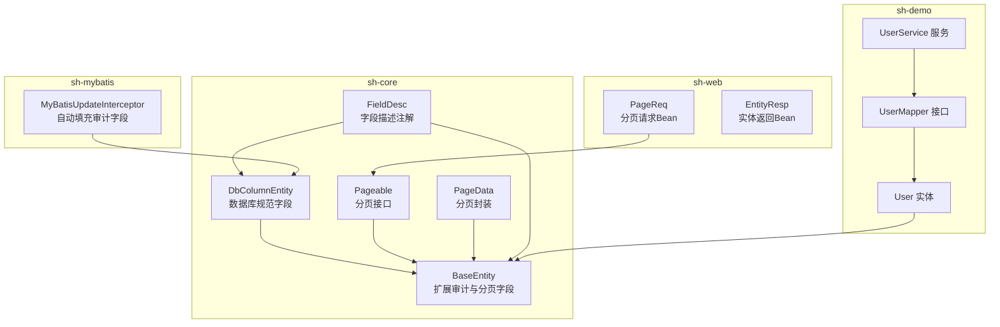
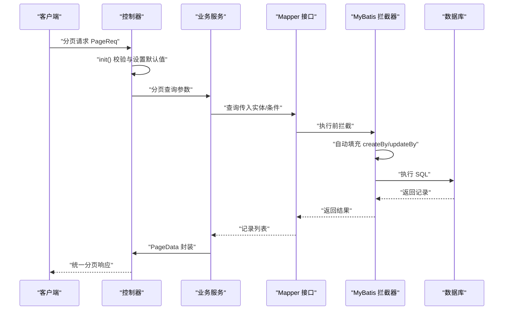
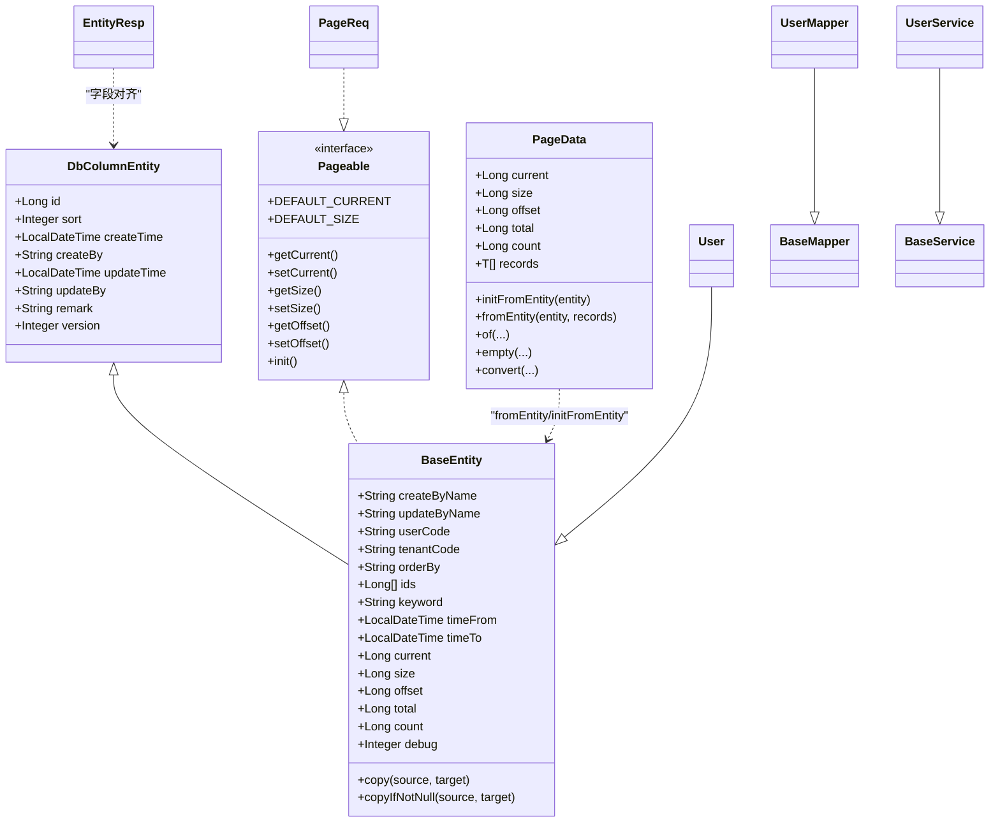

# 实体体系与数据规范

<cite>
**本文引用的文件**
- [DbColumnEntity.java](file://sh-core/src/main/java/com/wkclz/core/base/DbColumnEntity.java)
- [BaseEntity.java](file://sh-core/src/main/java/com/wkclz/core/base/BaseEntity.java)
- [Pageable.java](file://sh-core/src/main/java/com/wkclz/core/base/Pageable.java)
- [PageData.java](file://sh-core/src/main/java/com/wkclz/core/base/PageData.java)
- [FieldDesc.java](file://sh-core/src/main/java/com/wkclz/core/annotation/FieldDesc.java)
- [User.java](file://sh-demo/src/main/java/com/wkclz/demo/bean/entity/User.java)
- [UserMapper.java](file://sh-demo/src/main/java/com/wkclz/demo/mapper/UserMapper.java)
- [UserService.java](file://sh-demo/src/main/java/com/wkclz/demo/service/UserService.java)
- [PageReq.java](file://sh-web/src/main/java/com/wkclz/web/bean/PageReq.java)
- [EntityResp.java](file://sh-web/src/main/java/com/wkclz/web/bean/EntityResp.java)
- [PageableTest.java](file://sh-core/src/test/java/com/wkclz/core/base/PageableTest.java)
- [MyBatisUpdateInterceptor.java](file://sh-mybatis/src/main/java/com/wkclz/mybatis/interceptor/MyBatisUpdateInterceptor.java)
- [UserNameBodyAdvice.java](file://sh-web/src/main/java/com/wkclz/web/rest/UserNameBodyAdvice.java)
- [US-001-实体体系与数据规范.md](file://docs/stories/US-001-实体体系与数据规范.md)
- [US-010-MyBatis拦截器与自动填充.md](file://docs/stories/US-010-MyBatis拦截器与自动填充.md)
</cite>

## 目录
1. [简介](#简介)
2. [项目结构](#项目结构)
3. [核心组件](#核心组件)
4. [架构概览](#架构概览)
5. [详细组件分析](#详细组件分析)
6. [依赖分析](#依赖分析)
7. [性能考虑](#性能考虑)
8. [故障排查指南](#故障排查指南)
9. [结论](#结论)
10. [附录](#附录)

## 简介
本文件系统化梳理 sh-framework 的实体体系与数据规范，围绕 DbColumnEntity 到 BaseEntity 的层次结构设计，阐述审计字段（创建人、修改人、创建时间、修改时间）的自动填充机制，详解 PageData 分页封装的设计思路与最佳实践，并给出实体类定义、使用场景与注意事项，帮助开发者快速、一致地构建业务实体与分页查询。

## 项目结构
实体体系主要位于 sh-core 模块的 base 包；Web 层对分页请求进行标准化封装；演示模块展示了实体与 Mapper/Service 的典型用法；MyBatis 拦截器负责自动填充审计字段；Web 层的响应体与控制器增强负责将用户编码填充为姓名等。

图表来源
- [DbColumnEntity.java:1-39](file://sh-core/src/main/java/com/wkclz/core/base/DbColumnEntity.java#L1-L39)
- [BaseEntity.java:1-94](file://sh-core/src/main/java/com/wkclz/core/base/BaseEntity.java#L1-L94)
- [Pageable.java:1-93](file://sh-core/src/main/java/com/wkclz/core/base/Pageable.java#L1-L93)
- [PageData.java:1-185](file://sh-core/src/main/java/com/wkclz/core/base/PageData.java#L1-L185)
- [FieldDesc.java:1-27](file://sh-core/src/main/java/com/wkclz/core/annotation/FieldDesc.java#L1-L27)
- [PageReq.java:1-45](file://sh-web/src/main/java/com/wkclz/web/bean/PageReq.java#L1-L45)
- [EntityResp.java:1-42](file://sh-web/src/main/java/com/wkclz/web/bean/EntityResp.java#L1-L42)
- [User.java:1-28](file://sh-demo/src/main/java/com/wkclz/demo/bean/entity/User.java#L1-L28)
- [UserMapper.java:1-10](file://sh-demo/src/main/java/com/wkclz/demo/mapper/UserMapper.java#L1-L10)
- [UserService.java:1-12](file://sh-demo/src/main/java/com/wkclz/demo/service/UserService.java#L1-L12)
- [MyBatisUpdateInterceptor.java:1-85](file://sh-mybatis/src/main/java/com/wkclz/mybatis/interceptor/MyBatisUpdateInterceptor.java#L1-L85)

章节来源
- [DbColumnEntity.java:1-39](file://sh-core/src/main/java/com/wkclz/core/base/DbColumnEntity.java#L1-L39)
- [BaseEntity.java:1-94](file://sh-core/src/main/java/com/wkclz/core/base/BaseEntity.java#L1-L94)
- [Pageable.java:1-93](file://sh-core/src/main/java/com/wkclz/core/base/Pageable.java#L1-L93)
- [PageData.java:1-185](file://sh-core/src/main/java/com/wkclz/core/base/PageData.java#L1-L185)
- [FieldDesc.java:1-27](file://sh-core/src/main/java/com/wkclz/core/annotation/FieldDesc.java#L1-L27)
- [PageReq.java:1-45](file://sh-web/src/main/java/com/wkclz/web/bean/PageReq.java#L1-L45)
- [EntityResp.java:1-42](file://sh-web/src/main/java/com/wkclz/web/bean/EntityResp.java#L1-L42)
- [User.java:1-28](file://sh-demo/src/main/java/com/wkclz/demo/bean/entity/User.java#L1-L28)
- [UserMapper.java:1-10](file://sh-demo/src/main/java/com/wkclz/demo/mapper/UserMapper.java#L1-L10)
- [UserService.java:1-12](file://sh-demo/src/main/java/com/wkclz/demo/service/UserService.java#L1-L12)
- [MyBatisUpdateInterceptor.java:1-85](file://sh-mybatis/src/main/java/com/wkclz/mybatis/interceptor/MyBatisUpdateInterceptor.java#L1-L85)

## 核心组件
- DbColumnEntity：定义数据库规范字段（主键、排序、创建/更新时间与人员、备注、版本号），确保所有实体具备一致的持久化元数据。
- BaseEntity：在 DbColumnEntity 基础上扩展审计姓名、用户/租户编码、查询辅助字段（排序、ids、keyword、时间范围）、分页参数（current、size、offset、total、count），并提供属性拷贝工具方法。
- Pageable：定义分页参数的获取与初始化（含默认值与偏移量计算），BaseEntity 实现该接口以统一分页行为。
- PageData：统一分页响应封装，支持从 BaseEntity 初始化分页信息、快速创建、空分页、类型转换等。
- FieldDesc：字段描述注解，用于标注字段含义与约束，便于文档生成与工具链使用。
- Web 层 PageReq：实现 Pageable 的请求 Bean，负责参数校验与初始化。
- EntityResp：面向前端的实体返回模型，与 DbColumnEntity 字段保持一致，便于序列化输出。
- MyBatis 拦截器：自动填充 createBy/updateBy，并清理空字符串查询条件，保证数据一致性与查询健壮性。
- UserNameBodyAdvice：将 createBy/updateBy 映射为 createByName/updateByName，提升前端可读性。

章节来源
- [DbColumnEntity.java:1-39](file://sh-core/src/main/java/com/wkclz/core/base/DbColumnEntity.java#L1-L39)
- [BaseEntity.java:1-94](file://sh-core/src/main/java/com/wkclz/core/base/BaseEntity.java#L1-L94)
- [Pageable.java:1-93](file://sh-core/src/main/java/com/wkclz/core/base/Pageable.java#L1-L93)
- [PageData.java:1-185](file://sh-core/src/main/java/com/wkclz/core/base/PageData.java#L1-L185)
- [FieldDesc.java:1-27](file://sh-core/src/main/java/com/wkclz/core/annotation/FieldDesc.java#L1-L27)
- [PageReq.java:1-45](file://sh-web/src/main/java/com/wkclz/web/bean/PageReq.java#L1-L45)
- [EntityResp.java:1-42](file://sh-web/src/main/java/com/wkclz/web/bean/EntityResp.java#L1-L42)
- [MyBatisUpdateInterceptor.java:1-85](file://sh-mybatis/src/main/java/com/wkclz/mybatis/interceptor/MyBatisUpdateInterceptor.java#L1-L85)
- [UserNameBodyAdvice.java:65-102](file://sh-web/src/main/java/com/wkclz/web/rest/UserNameBodyAdvice.java#L65-L102)

## 架构概览
下图展示实体体系与分页、拦截器、Web 层的交互关系，体现“统一基类 + 自动填充 + 统一分页”的整体设计。

图表来源
- [PageReq.java:24-42](file://sh-web/src/main/java/com/wkclz/web/bean/PageReq.java#L24-L42)
- [PageData.java:56-61](file://sh-core/src/main/java/com/wkclz/core/base/PageData.java#L56-L61)
- [MyBatisUpdateInterceptor.java:46-72](file://sh-mybatis/src/main/java/com/wkclz/mybatis/interceptor/MyBatisUpdateInterceptor.java#L46-L72)

## 详细组件分析

### DbColumnEntity：数据库规范字段
- 设计要点
  - 统一主键 id、排序 sort、创建/更新时间、创建/更新人标识、备注 remark、版本 version。
  - 通过 FieldDesc 注解标注字段含义，便于文档与工具链识别。
- 使用建议
  - 所有业务实体均应继承该类，确保持久化元数据一致。
  - 若业务需要多租户/用户维度，可在子类中扩展 userCode/tenantCode 等字段。

章节来源
- [DbColumnEntity.java:1-39](file://sh-core/src/main/java/com/wkclz/core/base/DbColumnEntity.java#L1-L39)
- [FieldDesc.java:1-27](file://sh-core/src/main/java/com/wkclz/core/annotation/FieldDesc.java#L1-L27)

### BaseEntity：扩展审计与分页字段
- 设计要点
  - 在 DbColumnEntity 基础上新增：审计姓名 createByName/updateByName、用户/租户编码 userCode/tenantCode、查询辅助字段（orderBy、ids、keyword、timeFrom/timeTo）、分页字段 current/size/offset/total/count。
  - 实现 Pageable 接口，提供 init() 默认值与偏移量计算。
  - 提供 copy/copyIfNotNull 静态方法，基于反射进行属性拷贝（支持空目标实例自动构造）。
- 审计字段自动填充机制
  - MyBatis 拦截器在 INSERT/UPDATE 时自动设置 createBy/updateBy，并清空时间字段以交由数据库自动填充。
  - Web 层 UserNameBodyAdvice 将 createBy/updateBy 映射为 createByName/updateByName，提升前端可读性。
- 最佳实践
  - 实体继承 BaseEntity，避免重复声明审计字段。
  - 在业务层调用 init() 规范化分页参数，确保 offset 正确。
  - 使用 copy/copyIfNotNull 进行实体间属性迁移，减少样板代码。

章节来源
- [BaseEntity.java:1-94](file://sh-core/src/main/java/com/wkclz/core/base/BaseEntity.java#L1-L94)
- [Pageable.java:77-91](file://sh-core/src/main/java/com/wkclz/core/base/Pageable.java#L77-L91)
- [MyBatisUpdateInterceptor.java:46-72](file://sh-mybatis/src/main/java/com/wkclz/mybatis/interceptor/MyBatisUpdateInterceptor.java#L46-L72)
- [UserNameBodyAdvice.java:77-90](file://sh-web/src/main/java/com/wkclz/web/rest/UserNameBodyAdvice.java#L77-L90)

### Pageable：分页参数标准化
- 设计要点
  - 定义 current、size、offset 的获取/设置方法与默认值（DEFAULT_CURRENT=1，DEFAULT_SIZE=10）。
  - init() 方法统一处理空值与非法值，并计算 offset=(current-1)*size。
- 行为验证
  - 单元测试覆盖了 null、非法值、负数、边界值等场景，确保行为稳定可靠。
- 最佳实践
  - Web 请求 Bean（如 PageReq）实现 Pageable，并在接收请求后调用 init()。
  - 控制器/服务层直接使用 BaseEntity 实例的分页参数，避免重复定义。

章节来源
- [Pageable.java:1-93](file://sh-core/src/main/java/com/wkclz/core/base/Pageable.java#L1-L93)
- [PageReq.java:24-42](file://sh-web/src/main/java/com/wkclz/web/bean/PageReq.java#L24-L42)
- [PageableTest.java:17-237](file://sh-core/src/test/java/com/wkclz/core/base/PageableTest.java#L17-L237)

### PageData：分页封装
- 设计要点
  - 统一承载 current、size、offset、total、count、records 等分页信息。
  - 提供 fromEntity/initFromEntity 从 BaseEntity 初始化分页参数。
  - 提供 of/empty/convert 等静态工厂方法，支持快速创建、空分页与类型转换。
- 使用场景
  - 服务层查询完成后，将结果与总数封装为 PageData，返回给控制器。
  - 支持不同领域模型之间的分页数据转换（保持分页信息不变）。
- 最佳实践
  - 优先使用 fromEntity 将请求实体的分页参数透传至响应。
  - 对于已知总数的场景，使用 of(records, total, current, size)；对于未知总数但已有集合，使用 of(records, current, size) 自动计算总数。

章节来源
- [PageData.java:1-185](file://sh-core/src/main/java/com/wkclz/core/base/PageData.java#L1-L185)

### 实体类定义与使用示例
- User 实体
  - 继承 BaseEntity，扩展业务字段（userCode、username、nickname、userStatus）。
  - 通过 UserMapper 继承 BaseMapper，复用通用 CRUD 能力。
  - 通过 UserService 继承 BaseService，获得基础服务能力。
- 使用流程
  - 控制器接收 PageReq，调用 init() 规范化分页参数。
  - 服务层执行查询，返回 PageData。
  - 控制器返回统一分页响应。

章节来源
- [User.java:1-28](file://sh-demo/src/main/java/com/wkclz/demo/bean/entity/User.java#L1-L28)
- [UserMapper.java:1-10](file://sh-demo/src/main/java/com/wkclz/demo/mapper/UserMapper.java#L1-L10)
- [UserService.java:1-12](file://sh-demo/src/main/java/com/wkclz/demo/service/UserService.java#L1-L12)

### 审计字段自动填充机制
- MyBatis 拦截器
  - 在执行 INSERT 时设置 createBy/updateBy，并清空 createTime/updateTime 交由数据库自动填充。
  - 在执行 UPDATE 时仅设置 updateBy，并清空 createBy，避免覆盖原值。
- Web 层增强
  - UserNameBodyAdvice 将 createBy/updateBy 映射为 createByName/updateByName，提升前端可读性。
- 注意事项
  - 若 UserContext 未设置 userCode，拦截器不会强制要求操作人，避免影响匿名场景。
  - 空字符串查询条件会被拦截器替换为 null，避免误匹配。

章节来源
- [MyBatisUpdateInterceptor.java:46-72](file://sh-mybatis/src/main/java/com/wkclz/mybatis/interceptor/MyBatisUpdateInterceptor.java#L46-L72)
- [UserNameBodyAdvice.java:77-90](file://sh-web/src/main/java/com/wkclz/web/rest/UserNameBodyAdvice.java#L77-L90)
- [US-010-MyBatis拦截器与自动填充.md:1-54](file://docs/stories/US-010-MyBatis拦截器与自动填充.md#L1-L54)

## 依赖分析
- 继承关系
  - DbColumnEntity 为数据库规范字段基类。
  - BaseEntity 继承 DbColumnEntity 并实现 Pageable。
  - PageData 独立封装分页响应，可与 BaseEntity 协作。
- 注解与工具
  - FieldDesc 为字段提供语义描述，贯穿实体与响应模型。
- Web 与持久层协作
  - PageReq 实现 Pageable，控制器接收请求后规范化分页。
  - MyBatis 拦截器在执行前自动填充审计字段，保障数据一致性。
- 示例模块
  - User 实体、UserMapper、UserService 展示了“继承 BaseEntity + 继承通用 Mapper/Service”的标准范式。

图表来源
- [DbColumnEntity.java:1-39](file://sh-core/src/main/java/com/wkclz/core/base/DbColumnEntity.java#L1-L39)
- [BaseEntity.java:1-94](file://sh-core/src/main/java/com/wkclz/core/base/BaseEntity.java#L1-L94)
- [Pageable.java:1-93](file://sh-core/src/main/java/com/wkclz/core/base/Pageable.java#L1-L93)
- [PageData.java:1-185](file://sh-core/src/main/java/com/wkclz/core/base/PageData.java#L1-L185)
- [User.java:1-28](file://sh-demo/src/main/java/com/wkclz/demo/bean/entity/User.java#L1-L28)
- [UserMapper.java:1-10](file://sh-demo/src/main/java/com/wkclz/demo/mapper/UserMapper.java#L1-L10)
- [UserService.java:1-12](file://sh-demo/src/main/java/com/wkclz/demo/service/UserService.java#L1-L12)
- [PageReq.java:1-45](file://sh-web/src/main/java/com/wkclz/web/bean/PageReq.java#L1-L45)
- [EntityResp.java:1-42](file://sh-web/src/main/java/com/wkclz/web/bean/EntityResp.java#L1-L42)

章节来源
- [US-001-实体体系与数据规范.md:1-52](file://docs/stories/US-001-实体体系与数据规范.md#L1-L52)

## 性能考虑
- 分页偏移量计算
  - BaseEntity/PageReq 的 init() 采用 O(1) 计算 offset=(current-1)*size，避免复杂逻辑。
- 拦截器处理
  - MyBatis 拦截器仅在 INSERT/UPDATE 场景设置审计字段，开销极低。
- 空字符串清理
  - 查询拦截器将空字符串替换为 null，有助于索引命中与 SQL 执行计划优化。
- 建议
  - 控制分页 size 合理上限，避免超大页码导致 offset 过大。
  - 使用 BaseEntity.copy/copyIfNotNull 进行属性迁移，减少手动赋值带来的性能与维护成本。

## 故障排查指南
- 分页参数异常
  - 症状：offset 为负或异常大。
  - 排查：确认 PageReq/BaseEntity.init() 是否被调用；检查 current/size 是否为 null 或非法值。
- 审计字段为空
  - 症状：createBy/updateBy 为 null。
  - 排查：确认 UserContext 是否设置 userCode；拦截器是否生效；匿名场景是否允许。
- 响应中姓名字段缺失
  - 症状：createByName/updateByName 为空。
  - 排查：UserNameBodyAdvice 是否启用；userCode 是否存在对应名称映射。
- 分页响应字段不一致
  - 症状：前端字段与实体不一致。
  - 排查：EntityResp 与 DbColumnEntity 字段是否对齐；是否遗漏字段。

章节来源
- [PageableTest.java:17-237](file://sh-core/src/test/java/com/wkclz/core/base/PageableTest.java#L17-L237)
- [MyBatisUpdateInterceptor.java:32-42](file://sh-mybatis/src/main/java/com/wkclz/mybatis/interceptor/MyBatisUpdateInterceptor.java#L32-L42)
- [UserNameBodyAdvice.java:77-90](file://sh-web/src/main/java/com/wkclz/web/rest/UserNameBodyAdvice.java#L77-L90)
- [EntityResp.java:1-42](file://sh-web/src/main/java/com/wkclz/web/bean/EntityResp.java#L1-L42)

## 结论
sh-framework 的实体体系以 DbColumnEntity 为基础，BaseEntity 扩展审计与分页能力，配合 Pageable/PageData 形成“统一基类 + 标准分页 + 自动填充”的完整方案。通过拦截器与 Web 层增强，实现审计字段自动填充与前端友好展示。遵循本文规范，可显著降低重复编码、提升一致性与可维护性。

## 附录
- 实体类最佳实践清单
  - 继承 BaseEntity，避免重复声明审计字段。
  - 在控制器/服务层调用 init() 规范化分页参数。
  - 使用 PageData.fromEntity 将请求分页参数透传至响应。
  - 使用 copy/copyIfNotNull 进行实体属性迁移。
  - 业务字段使用 @Schema/@FieldDesc 标注，便于文档与工具链识别。
- 典型使用场景
  - 列表查询：PageReq -> BaseService -> PageData。
  - 新增/修改：实体继承 BaseEntity，拦截器自动填充 createBy/updateBy。
  - 响应展示：EntityResp 与 DbColumnEntity 字段对齐，UserNameBodyAdvice 填充姓名。