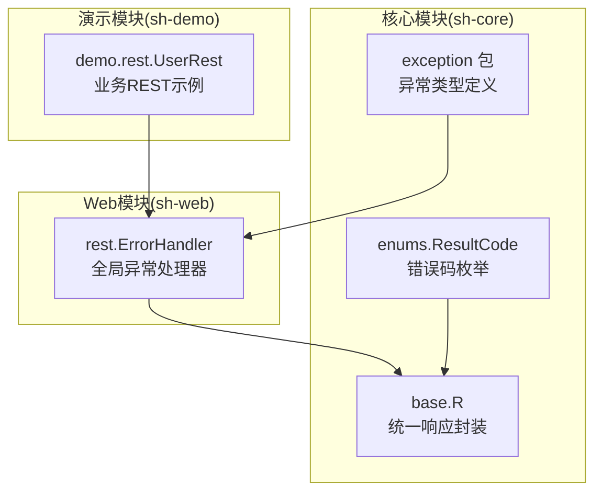
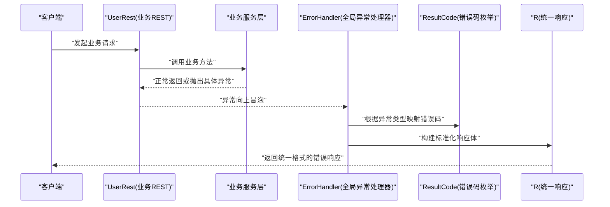
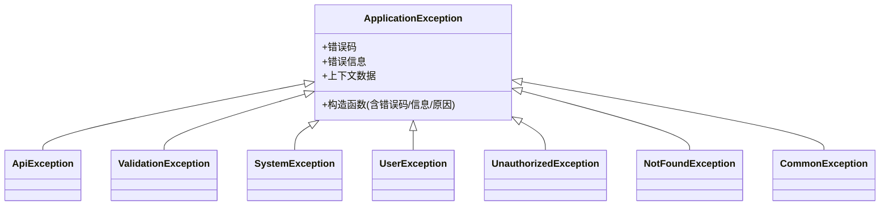
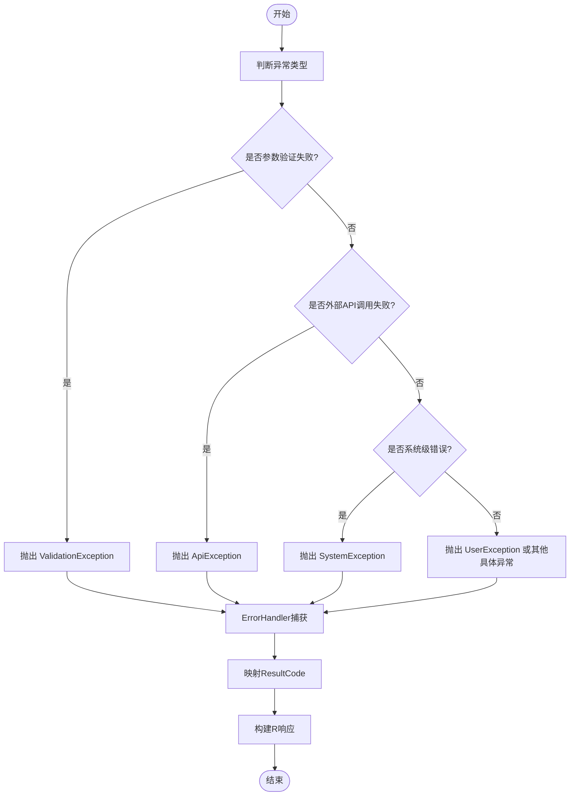
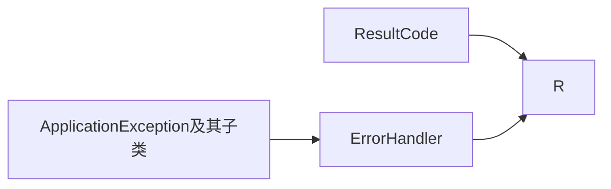

# 异常体系与分类处理

<cite>
**本文引用的文件**
- [ApplicationException.java](file://sh-core/src/main/java/com/wkclz/core/exception/ApplicationException.java)
- [ApiException.java](file://sh-core/src/main/java/com/wkclz/core/exception/ApiException.java)
- [CommonException.java](file://sh-core/src/main/java/com/wkclz/core/exception/CommonException.java)
- [NotFoundException.java](file://sh-core/src/main/java/com/wkclz/core/exception/NotFoundException.java)
- [SystemException.java](file://sh-core/src/main/java/com/wkclz/core/exception/SystemException.java)
- [UnauthorizedException.java](file://sh-core/src/main/java/com/wkclz/core/exception/UnauthorizedException.java)
- [UserException.java](file://sh-core/src/main/java/com/wkclz/core/exception/UserException.java)
- [ValidationException.java](file://sh-core/src/main/java/com/wkclz/core/exception/ValidationException.java)
- [ResultCode.java](file://sh-core/src/main/java/com/wkclz/core/enums/ResultCode.java)
- [R.java](file://sh-core/src/main/java/com/wkclz/core/base/R.java)
- [ErrorHandler.java](file://sh-web/src/main/java/com/wkclz/web/rest/ErrorHandler.java)
- [UserRest.java](file://sh-demo/src/main/java/com/wkclz/demo/rest/UserRest.java)
- [UserException.java](file://sh-mqtt/src/main/java/com/wkclz/mqtt/exception/UserException.java)
</cite>

## 目录
1. [引言](#引言)
2. [项目结构](#项目结构)
3. [核心组件](#核心组件)
4. [架构概览](#架构概览)
5. [详细组件分析](#详细组件分析)
6. [依赖关系分析](#依赖关系分析)
7. [性能考虑](#性能考虑)
8. [故障排除指南](#故障排除指南)
9. [结论](#结论)
10. [附录](#附录)

## 引言
本文件为 sh-framework 的异常体系技术文档，系统性阐述从 ApplicationException 基类到各具体异常类型的层次结构与使用规范。文档重点覆盖以下方面：
- 异常分类体系：明确各类异常的职责边界与适用场景（API 调用异常、参数验证异常、系统级异常、用户级异常、未授权访问、资源不存在、通用异常）。
- 异常处理最佳实践：如何正确抛出与捕获异常，异常信息的标准化格式，以及与统一响应封装 R 的协同机制。
- 错误码设计原则：基于 ResultCode 枚举的错误码体系，确保前后端一致的错误语义与可维护性。
- 实战示例：通过 Demo 模块与 Web 层 ErrorHandler 的实际用法，展示不同业务场景下的异常使用模式。

## 项目结构
sh-framework 将异常体系集中于核心模块 sh-core 的 exception 包中，并与 web 模块的 ErrorHandler 协同工作，形成“异常定义—异常处理—统一响应”的闭环。同时，ResultCode 与 R 提供了标准化的错误码与响应结构支撑。

**图表来源**
- [ApplicationException.java](file://sh-core/src/main/java/com/wkclz/core/exception/ApplicationException.java)
- [ResultCode.java](file://sh-core/src/main/java/com/wkclz/core/enums/ResultCode.java)
- [R.java](file://sh-core/src/main/java/com/wkclz/core/base/R.java)
- [ErrorHandler.java](file://sh-web/src/main/java/com/wkclz/web/rest/ErrorHandler.java)
- [UserRest.java](file://sh-demo/src/main/java/com/wkclz/demo/rest/UserRest.java)

**章节来源**
- [ApplicationException.java](file://sh-core/src/main/java/com/wkclz/core/exception/ApplicationException.java)
- [ResultCode.java](file://sh-core/src/main/java/com/wkclz/core/enums/ResultCode.java)
- [R.java](file://sh-core/src/main/java/com/wkclz/core/base/R.java)
- [ErrorHandler.java](file://sh-web/src/main/java/com/wkclz/web/rest/ErrorHandler.java)
- [UserRest.java](file://sh-demo/src/main/java/com/wkclz/demo/rest/UserRest.java)

## 核心组件
本节对异常体系中的关键类进行深入解析，包括基类与各具体异常类型的设计意图、继承关系、构造方式与典型使用场景。

- ApplicationException（应用层异常基类）
  - 设计目的：作为所有业务异常的父类，统一异常信息与错误码承载能力。
  - 关键特性：通常包含错误码、错误信息、上下文数据等字段；支持链式异常与可选的业务数据包装。
  - 典型用途：作为自定义异常的基类，确保统一的序列化与处理策略。

- ApiException（API 调用异常）
  - 场景定位：封装外部服务或远程接口调用失败的情况，如网络超时、HTTP 状态异常、第三方返回错误等。
  - 处理建议：区分可重试与不可重试场景，结合熔断与降级策略；对外保持稳定的错误语义。

- ValidationException（参数验证异常）
  - 场景定位：输入参数校验失败时抛出，如字段为空、格式不正确、范围越界等。
  - 处理建议：与 Bean 验证框架配合，收集并返回详细的校验错误列表，便于前端展示。

- SystemException（系统级异常）
  - 场景定位：底层系统错误，如数据库连接异常、线程池耗尽、内存溢出等。
  - 处理建议：记录详细日志与堆栈，必要时触发告警；对外以通用错误码响应，避免泄露内部实现细节。

- UserException（用户级异常）
  - 场景定位：面向用户的业务规则违反，如密码错误、账户状态异常、操作权限不足等。
  - 处理建议：提供清晰的提示信息与可执行的操作指引，提升用户体验。

- UnauthorizedException（未授权访问异常）
  - 场景定位：鉴权失败或令牌无效，如登录过期、权限不足、签名错误等。
  - 处理建议：区分会话过期与权限不足两类，引导用户重新登录或申请权限。

- NotFoundException（资源不存在异常）
  - 场景定位：请求的目标资源不存在，如用户 ID、订单号、文件路径等。
  - 处理建议：返回明确的提示信息，避免暴露系统内部路径或标识符细节。

- CommonException（通用异常）
  - 场景定位：无法归类到上述特定类型的异常，作为兜底异常使用。
  - 处理建议：统一记录日志与错误码，保证系统稳定性与可观测性。

**章节来源**
- [ApplicationException.java](file://sh-core/src/main/java/com/wkclz/core/exception/ApplicationException.java)
- [ApiException.java](file://sh-core/src/main/java/com/wkclz/core/exception/ApiException.java)
- [ValidationException.java](file://sh-core/src/main/java/com/wkclz/core/exception/ValidationException.java)
- [SystemException.java](file://sh-core/src/main/java/com/wkclz/core/exception/SystemException.java)
- [UserException.java](file://sh-core/src/main/java/com/wkclz/core/exception/UserException.java)
- [UnauthorizedException.java](file://sh-core/src/main/java/com/wkclz/core/exception/UnauthorizedException.java)
- [NotFoundException.java](file://sh-core/src/main/java/com/wkclz/core/exception/NotFoundException.java)
- [CommonException.java](file://sh-core/src/main/java/com/wkclz/core/exception/CommonException.java)

## 架构概览
下图展示了异常体系在系统中的流转过程：业务层抛出具体异常 → Web 层由 ErrorHandler 统一捕获 → 结合 ResultCode 与 R 返回标准化响应。

**图表来源**
- [UserRest.java](file://sh-demo/src/main/java/com/wkclz/demo/rest/UserRest.java)
- [ErrorHandler.java](file://sh-web/src/main/java/com/wkclz/web/rest/ErrorHandler.java)
- [ResultCode.java](file://sh-core/src/main/java/com/wkclz/core/enums/ResultCode.java)
- [R.java](file://sh-core/src/main/java/com/wkclz/core/base/R.java)

## 详细组件分析

### 异常层次结构与关系

**图表来源**
- [ApplicationException.java](file://sh-core/src/main/java/com/wkclz/core/exception/ApplicationException.java)
- [ApiException.java](file://sh-core/src/main/java/com/wkclz/core/exception/ApiException.java)
- [ValidationException.java](file://sh-core/src/main/java/com/wkclz/core/exception/ValidationException.java)
- [SystemException.java](file://sh-core/src/main/java/com/wkclz/core/exception/SystemException.java)
- [UserException.java](file://sh-core/src/main/java/com/wkclz/core/exception/UserException.java)
- [UnauthorizedException.java](file://sh-core/src/main/java/com/wkclz/core/exception/UnauthorizedException.java)
- [NotFoundException.java](file://sh-core/src/main/java/com/wkclz/core/exception/NotFoundException.java)
- [CommonException.java](file://sh-core/src/main/java/com/wkclz/core/exception/CommonException.java)

**章节来源**
- [ApplicationException.java](file://sh-core/src/main/java/com/wkclz/core/exception/ApplicationException.java)
- [ApiException.java](file://sh-core/src/main/java/com/wkclz/core/exception/ApiException.java)
- [ValidationException.java](file://sh-core/src/main/java/com/wkclz/core/exception/ValidationException.java)
- [SystemException.java](file://sh-core/src/main/java/com/wkclz/core/exception/SystemException.java)
- [UserException.java](file://sh-core/src/main/java/com/wkclz/core/exception/UserException.java)
- [UnauthorizedException.java](file://sh-core/src/main/java/com/wkclz/core/exception/UnauthorizedException.java)
- [NotFoundException.java](file://sh-core/src/main/java/com/wkclz/core/exception/NotFoundException.java)
- [CommonException.java](file://sh-core/src/main/java/com/wkclz/core/exception/CommonException.java)

### 异常处理流程与最佳实践
- 抛出异常的原则
  - 明确异常类型：优先选择最贴近业务语义的具体异常类型，避免滥用通用异常。
  - 传递关键上下文：在异常对象中携带必要的业务上下文（如用户 ID、请求 ID），便于追踪与审计。
  - 控制异常粒度：参数校验失败使用 ValidationException，外部调用失败使用 ApiException，系统底层错误使用 SystemException。
- 捕获与处理策略
  - 在 Web 层统一由 ErrorHandler 捕获并转换为标准化响应；在业务层仅负责抛出，不进行跨层的 try-catch。
  - 对于可恢复的系统异常（如临时数据库连接问题），可在上层进行有限次重试或降级处理。
- 标准化响应
  - 使用 R 作为统一响应载体，结合 ResultCode 提供稳定且语义明确的错误码与消息。
  - 异常信息对外仅暴露必要内容，避免泄露敏感实现细节。

**图表来源**
- [ErrorHandler.java](file://sh-web/src/main/java/com/wkclz/web/rest/ErrorHandler.java)
- [ResultCode.java](file://sh-core/src/main/java/com/wkclz/core/enums/ResultCode.java)
- [R.java](file://sh-core/src/main/java/com/wkclz/core/base/R.java)

**章节来源**
- [ErrorHandler.java](file://sh-web/src/main/java/com/wkclz/web/rest/ErrorHandler.java)
- [ResultCode.java](file://sh-core/src/main/java/com/wkclz/core/enums/ResultCode.java)
- [R.java](file://sh-core/src/main/java/com/wkclz/core/base/R.java)

### 错误码设计与统一响应
- 错误码设计原则
  - 唯一性：每个错误码对应唯一的错误语义，避免歧义。
  - 可扩展性：预留错误码空间，支持未来新增业务场景。
  - 一致性：前后端约定一致的错误码与消息格式，便于联调与排障。
- 统一响应 R
  - R 作为统一响应封装，包含状态码、消息与数据体；异常处理时由 ErrorHandler 将异常映射为 R 格式返回。
  - 建议在异常对象中保留原始错误码与上下文，以便日志与监控系统进行关联分析。

**章节来源**
- [ResultCode.java](file://sh-core/src/main/java/com/wkclz/core/enums/ResultCode.java)
- [R.java](file://sh-core/src/main/java/com/wkclz/core/base/R.java)

### 实战示例：在业务场景中的异常使用模式
- 参数验证场景
  - 当请求参数不符合业务规则时，抛出 ValidationException，由 ErrorHandler 统一转换为带详细校验信息的响应。
- 外部服务调用失败
  - 当调用第三方接口返回异常或网络超时时，抛出 ApiException，区分可重试与不可重试场景。
- 用户权限不足
  - 当用户无权执行某操作时，抛出 UnauthorizedException，引导用户重新登录或申请权限。
- 资源不存在
  - 当请求的目标资源不存在时，抛出 NotFoundException，返回明确提示信息。
- 系统异常兜底
  - 当出现未预期的系统错误时，抛出 SystemException 或 CommonException，确保系统稳定与可观测性。

**章节来源**
- [UserRest.java](file://sh-demo/src/main/java/com/wkclz/demo/rest/UserRest.java)
- [ValidationException.java](file://sh-core/src/main/java/com/wkclz/core/exception/ValidationException.java)
- [ApiException.java](file://sh-core/src/main/java/com/wkclz/core/exception/ApiException.java)
- [UnauthorizedException.java](file://sh-core/src/main/java/com/wkclz/core/exception/UnauthorizedException.java)
- [NotFoundException.java](file://sh-core/src/main/java/com/wkclz/core/exception/NotFoundException.java)
- [SystemException.java](file://sh-core/src/main/java/com/wkclz/core/exception/SystemException.java)
- [CommonException.java](file://sh-core/src/main/java/com/wkclz/core/exception/CommonException.java)

## 依赖关系分析
异常体系与 Web 层 ErrorHandler 的耦合关系如下：
- 异常类型定义位于 sh-core，提供统一的异常层次；
- ErrorHandler 位于 sh-web，负责捕获异常并将其转换为 R 格式的响应；
- ResultCode 与 R 位于 sh-core，提供错误码与统一响应的基础设施。

**图表来源**
- [ApplicationException.java](file://sh-core/src/main/java/com/wkclz/core/exception/ApplicationException.java)
- [ErrorHandler.java](file://sh-web/src/main/java/com/wkclz/web/rest/ErrorHandler.java)
- [ResultCode.java](file://sh-core/src/main/java/com/wkclz/core/enums/ResultCode.java)
- [R.java](file://sh-core/src/main/java/com/wkclz/core/base/R.java)

**章节来源**
- [ApplicationException.java](file://sh-core/src/main/java/com/wkclz/core/exception/ApplicationException.java)
- [ErrorHandler.java](file://sh-web/src/main/java/com/wkclz/web/rest/ErrorHandler.java)
- [ResultCode.java](file://sh-core/src/main/java/com/wkclz/core/enums/ResultCode.java)
- [R.java](file://sh-core/src/main/java/com/wkclz/core/base/R.java)

## 性能考虑
- 异常开销控制：避免在热路径频繁抛出异常，优先使用正常流程与快速失败策略；仅在真正异常情况下抛出异常。
- 日志与监控：对 SystemException 与未捕获异常进行集中记录与告警，避免过多细粒度日志影响性能。
- 序列化成本：统一响应 R 的序列化应尽量简洁，避免在异常响应中携带大量上下文数据。

## 故障排除指南
- 常见问题
  - 异常未被统一处理：检查 ErrorHandler 是否正确注册与生效，确认异常类型是否在映射范围内。
  - 错误码不一致：核对 ResultCode 枚举与业务异常的映射关系，确保前后端约定一致。
  - 响应格式异常：确认 R 的序列化配置与 Content-Type 设置，避免跨域或编码问题导致的解析失败。
- 排查步骤
  - 启用异常日志：在 ErrorHandler 中打印异常堆栈与关键上下文，定位问题根因。
  - 分类验证：针对不同异常类型分别构造测试用例，验证映射与响应格式。
  - 回归测试：在新增异常类型或修改映射规则后，进行全面回归测试。

**章节来源**
- [ErrorHandler.java](file://sh-web/src/main/java/com/wkclz/web/rest/ErrorHandler.java)
- [ResultCode.java](file://sh-core/src/main/java/com/wkclz/core/enums/ResultCode.java)
- [R.java](file://sh-core/src/main/java/com/wkclz/core/base/R.java)

## 结论
sh-framework 的异常体系通过 ApplicationException 基类与具体异常类型的清晰分工，结合 ErrorHandler 的统一处理与 R 的标准化响应，实现了高内聚、低耦合的异常管理机制。遵循本文提供的分类原则、最佳实践与错误码设计，可显著提升系统的可维护性、可观测性与用户体验。

## 附录
- 相关文件索引
  - 异常基类与具体异常类型：[ApplicationException.java](file://sh-core/src/main/java/com/wkclz/core/exception/ApplicationException.java)、[ApiException.java](file://sh-core/src/main/java/com/wkclz/core/exception/ApiException.java)、[ValidationException.java](file://sh-core/src/main/java/com/wkclz/core/exception/ValidationException.java)、[SystemException.java](file://sh-core/src/main/java/com/wkclz/core/exception/SystemException.java)、[UserException.java](file://sh-core/src/main/java/com/wkclz/core/exception/UserException.java)、[UnauthorizedException.java](file://sh-core/src/main/java/com/wkclz/core/exception/UnauthorizedException.java)、[NotFoundException.java](file://sh-core/src/main/java/com/wkclz/core/exception/NotFoundException.java)、[CommonException.java](file://sh-core/src/main/java/com/wkclz/core/exception/CommonException.java)
  - 错误码与统一响应：[ResultCode.java](file://sh-core/src/main/java/com/wkclz/core/enums/ResultCode.java)、[R.java](file://sh-core/src/main/java/com/wkclz/core/base/R.java)
  - 异常处理与实战示例：[ErrorHandler.java](file://sh-web/src/main/java/com/wkclz/web/rest/ErrorHandler.java)、[UserRest.java](file://sh-demo/src/main/java/com/wkclz/demo/rest/UserRest.java)