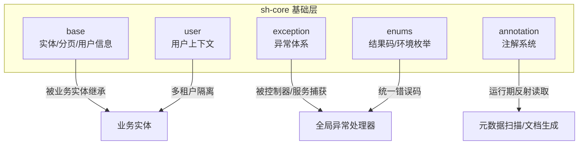
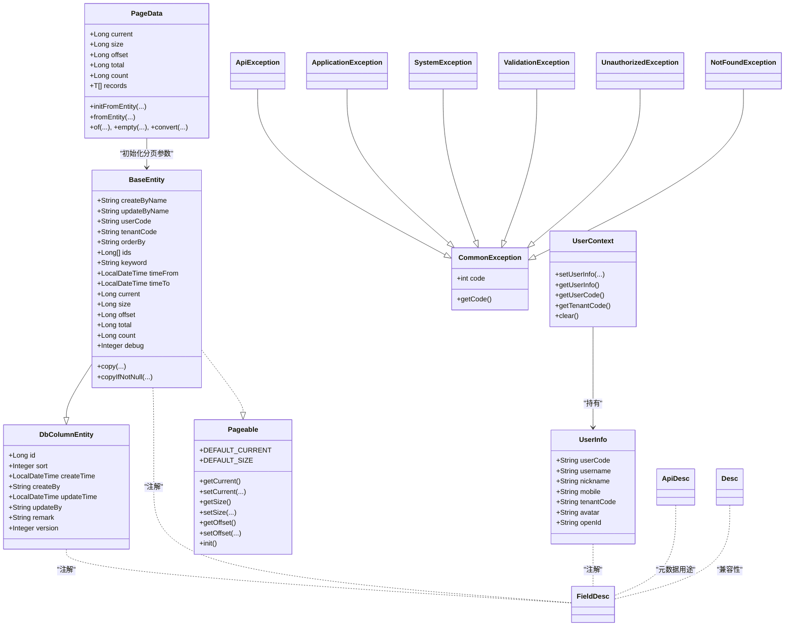
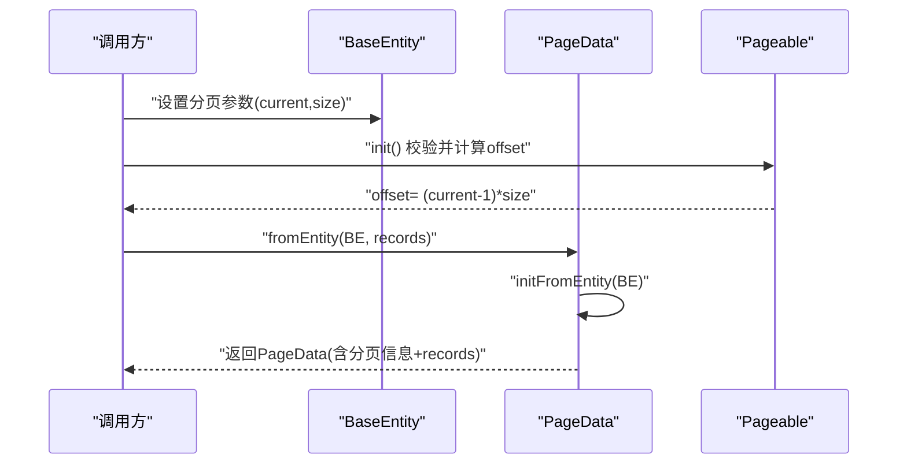
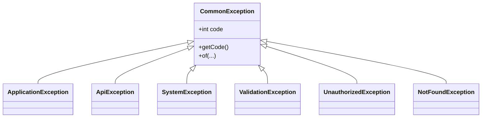
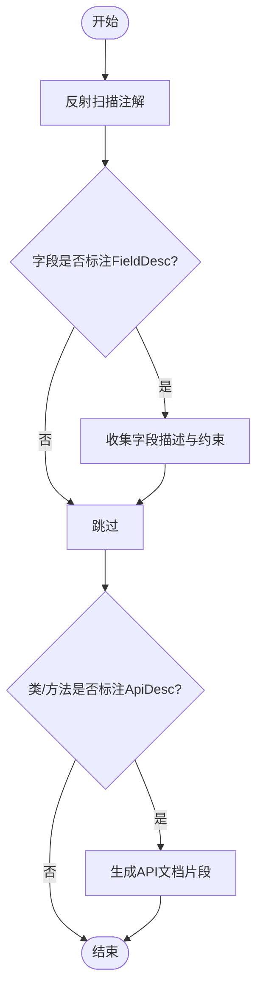
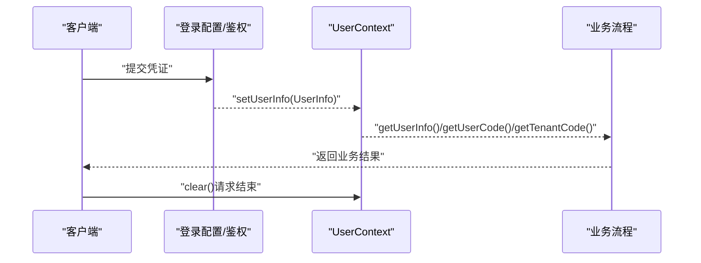
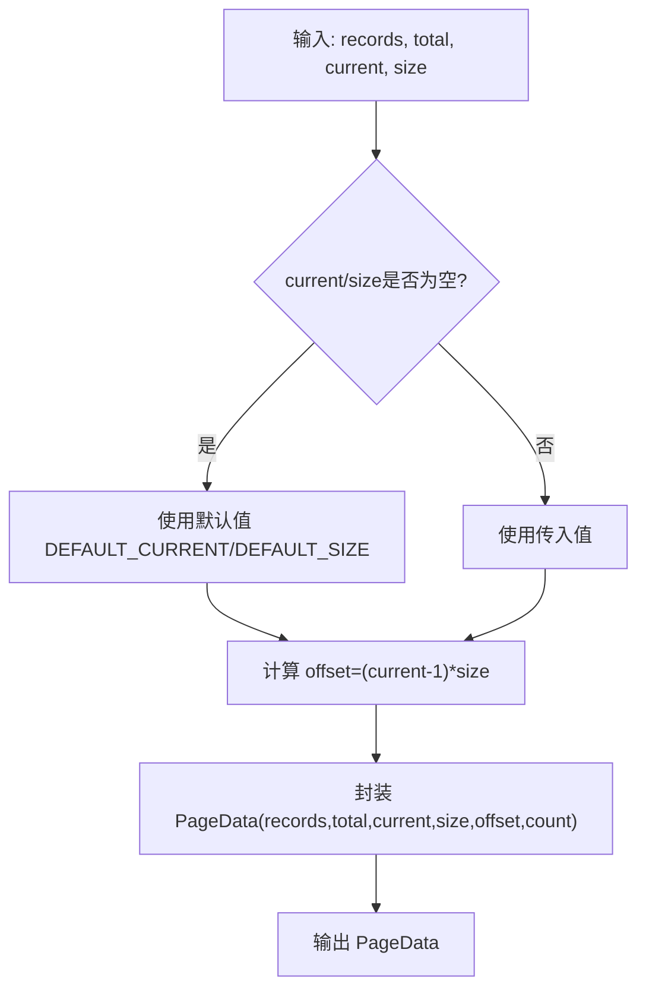
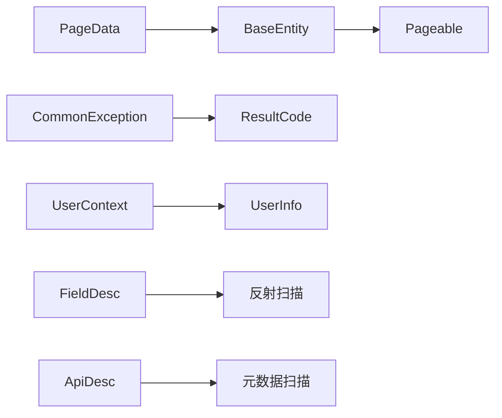

# 核心模块详解

<cite>
**本文引用的文件**
- [BaseEntity.java](file://sh-core/src/main/java/com/wkclz/core/base/BaseEntity.java)
- [DbColumnEntity.java](file://sh-core/src/main/java/com/wkclz/core/base/DbColumnEntity.java)
- [PageData.java](file://sh-core/src/main/java/com/wkclz/core/base/PageData.java)
- [Pageable.java](file://sh-core/src/main/java/com/wkclz/core/base/Pageable.java)
- [UserInfo.java](file://sh-core/src/main/java/com/wkclz/core/base/UserInfo.java)
- [UserContext.java](file://sh-core/src/main/java/com/wkclz/core/user/UserContext.java)
- [ApiException.java](file://sh-core/src/main/java/com/wkclz/core/exception/ApiException.java)
- [ApplicationException.java](file://sh-core/src/main/java/com/wkclz/core/exception/ApplicationException.java)
- [CommonException.java](file://sh-core/src/main/java/com/wkclz/core/exception/CommonException.java)
- [SystemException.java](file://sh-core/src/main/java/com/wkclz/core/exception/SystemException.java)
- [ValidationException.java](file://sh-core/src/main/java/com/wkclz/core/exception/ValidationException.java)
- [UnauthorizedException.java](file://sh-core/src/main/java/com/wkclz/core/exception/UnauthorizedException.java)
- [NotFoundException.java](file://sh-core/src/main/java/com/wkclz/core/exception/NotFoundException.java)
- [ResultCode.java](file://sh-core/src/main/java/com/wkclz/core/enums/ResultCode.java)
- [EnvType.java](file://sh-core/src/main/java/com/wkclz/core/enums/EnvType.java)
- [ApiDesc.java](file://sh-core/src/main/java/com/wkclz/core/annotation/ApiDesc.java)
- [Desc.java](file://sh-core/src/main/java/com/wkclz/core/annotation/Desc.java)
- [FieldDesc.java](file://sh-core/src/main/java/com/wkclz/core/annotation/FieldDesc.java)
</cite>

## 目录
1. [引言](#引言)
2. [项目结构](#项目结构)
3. [核心组件](#核心组件)
4. [架构总览](#架构总览)
5. [详细组件分析](#详细组件分析)
6. [依赖分析](#依赖分析)
7. [性能考虑](#性能考虑)
8. [故障排查指南](#故障排查指南)
9. [结论](#结论)
10. [附录](#附录)

## 引言
本文件面向sh-framework的核心模块（sh-core），系统性梳理框架基础能力：实体体系设计、异常处理机制、注解系统、用户上下文与多租户隔离、分页封装与数据规范。重点阐释BaseEntity基类的设计理念、DbColumnEntity的字段映射机制、PageData分页封装的实现原理；总结统一异常体系的分类逻辑与使用场景；解析注解系统的扩展性设计；并给出用户上下文管理与多租户隔离的最佳实践。

## 项目结构
sh-core模块采用按职责分层的组织方式：
- base：基础实体与分页、用户信息、统一返回包装等
- exception：统一异常体系
- annotation：注解系统
- enums：结果码与环境枚举
- user：用户上下文
- log/spi：日志与SPI扩展点（不在本次目标范围内）

## 核心组件
本节聚焦于实体体系、异常体系、注解系统、用户上下文与分页封装的关键类与职责边界。

- 实体体系
  - DbColumnEntity：数据库规范字段的统一承载，确保所有持久化实体具备一致的审计与版本字段。
  - BaseEntity：在DbColumnEntity基础上扩展分页查询辅助字段与用户/租户上下文字段，并提供拷贝工具方法。
  - UserInfo：登录后在用户上下文中持有的用户基础信息载体。
  - Pageable：分页参数接口，定义默认页码、默认大小与偏移量计算。
  - PageData：分页结果封装，提供多种静态工厂方法与类型转换能力。

- 异常体系
  - CommonException：所有业务异常的基类，统一携带code/message。
  - ApplicationException、ApiException、SystemException、ValidationException、UnauthorizedException、NotFoundException：按领域细分的异常类型，均继承CommonException，便于上层统一处理与区分。

- 注解系统
  - FieldDesc：为字段标注中文描述与非空约束，用于元数据扫描与文档生成。
  - ApiDesc：为类/方法提供API描述，便于REST元数据扫描。
  - Desc：兼容旧版描述注解（已标记为弃用）。

- 用户上下文与多租户
  - UserContext：基于ThreadLocal的用户上下文工具，提供设置、获取、清理能力，并暴露用户编码与租户编码便捷方法。
  - EnvType：系统环境枚举，配合结果码与上下文使用，支撑不同环境下的差异化行为。

**章节来源**
- [DbColumnEntity.java:1-39](file://sh-core/src/main/java/com/wkclz/core/base/DbColumnEntity.java#L1-L39)
- [BaseEntity.java:1-94](file://sh-core/src/main/java/com/wkclz/core/base/BaseEntity.java#L1-L94)
- [UserInfo.java:1-36](file://sh-core/src/main/java/com/wkclz/core/base/UserInfo.java#L1-L36)
- [Pageable.java:1-93](file://sh-core/src/main/java/com/wkclz/core/base/Pageable.java#L1-L93)
- [PageData.java:1-185](file://sh-core/src/main/java/com/wkclz/core/base/PageData.java#L1-L185)
- [CommonException.java:1-64](file://sh-core/src/main/java/com/wkclz/core/exception/CommonException.java#L1-L64)
- [ApiException.java:1-48](file://sh-core/src/main/java/com/wkclz/core/exception/ApiException.java#L1-L48)
- [ApplicationException.java:1-48](file://sh-core/src/main/java/com/wkclz/core/exception/ApplicationException.java#L1-L48)
- [SystemException.java:1-48](file://sh-core/src/main/java/com/wkclz/core/exception/SystemException.java#L1-L48)
- [ValidationException.java:1-48](file://sh-core/src/main/java/com/wkclz/core/exception/ValidationException.java#L1-L48)
- [UnauthorizedException.java:1-48](file://sh-core/src/main/java/com/wkclz/core/exception/UnauthorizedException.java#L1-L48)
- [NotFoundException.java:1-48](file://sh-core/src/main/java/com/wkclz/core/exception/NotFoundException.java#L1-L48)
- [FieldDesc.java:1-27](file://sh-core/src/main/java/com/wkclz/core/annotation/FieldDesc.java#L1-L27)
- [ApiDesc.java:1-24](file://sh-core/src/main/java/com/wkclz/core/annotation/ApiDesc.java#L1-L24)
- [Desc.java:1-26](file://sh-core/src/main/java/com/wkclz/core/annotation/Desc.java#L1-L26)
- [UserContext.java:1-54](file://sh-core/src/main/java/com/wkclz/core/user/UserContext.java#L1-L54)
- [EnvType.java:1-28](file://sh-core/src/main/java/com/wkclz/core/enums/EnvType.java#L1-L28)

## 架构总览
下图展示核心模块内关键类之间的关系与交互方向，体现“实体—分页—异常—注解—用户上下文”的协作路径。

**图表来源**
- [DbColumnEntity.java:1-39](file://sh-core/src/main/java/com/wkclz/core/base/DbColumnEntity.java#L1-L39)
- [BaseEntity.java:1-94](file://sh-core/src/main/java/com/wkclz/core/base/BaseEntity.java#L1-L94)
- [UserInfo.java:1-36](file://sh-core/src/main/java/com/wkclz/core/base/UserInfo.java#L1-L36)
- [Pageable.java:1-93](file://sh-core/src/main/java/com/wkclz/core/base/Pageable.java#L1-L93)
- [PageData.java:1-185](file://sh-core/src/main/java/com/wkclz/core/base/PageData.java#L1-L185)
- [CommonException.java:1-64](file://sh-core/src/main/java/com/wkclz/core/exception/CommonException.java#L1-L64)
- [ApiException.java:1-48](file://sh-core/src/main/java/com/wkclz/core/exception/ApiException.java#L1-L48)
- [ApplicationException.java:1-48](file://sh-core/src/main/java/com/wkclz/core/exception/ApplicationException.java#L1-L48)
- [SystemException.java:1-48](file://sh-core/src/main/java/com/wkclz/core/exception/SystemException.java#L1-L48)
- [ValidationException.java:1-48](file://sh-core/src/main/java/com/wkclz/core/exception/ValidationException.java#L1-L48)
- [UnauthorizedException.java:1-48](file://sh-core/src/main/java/com/wkclz/core/exception/UnauthorizedException.java#L1-L48)
- [NotFoundException.java:1-48](file://sh-core/src/main/java/com/wkclz/core/exception/NotFoundException.java#L1-L48)
- [FieldDesc.java:1-27](file://sh-core/src/main/java/com/wkclz/core/annotation/FieldDesc.java#L1-L27)
- [ApiDesc.java:1-24](file://sh-core/src/main/java/com/wkclz/core/annotation/ApiDesc.java#L1-L24)
- [Desc.java:1-26](file://sh-core/src/main/java/com/wkclz/core/annotation/Desc.java#L1-L26)
- [UserContext.java:1-54](file://sh-core/src/main/java/com/wkclz/core/user/UserContext.java#L1-L54)

## 详细组件分析

### 实体体系设计
- DbColumnEntity：定义统一的数据库规范字段，包括主键、排序、创建/更新时间与人员、备注、版本号等，保证所有实体具备一致的审计与并发控制基础。
- BaseEntity：在DbColumnEntity之上扩展分页查询辅助字段（排序、ID集合、关键词、时间范围）、分页参数（current/size/offset/total/count）与用户/租户上下文字段（userCode/tenantCode），并提供拷贝工具方法，支持空字段拷贝与非空拷贝，内部通过反射创建新实例并利用工具类完成字段复制。
- UserInfo：登录后在用户上下文中持有的用户基础信息，包含用户编码、用户名、昵称、手机号（脱敏）、租户编码、头像、Open ID等，便于后续流程中直接使用。
- Pageable：定义分页参数的获取与初始化，默认页码与默认大小，提供参数校验与偏移量计算的默认实现。
- PageData：分页结果封装，提供从BaseEntity初始化分页信息、快速创建含数据与总数的分页对象、空分页对象、仅含数据的分页对象、类型转换等工厂方法，确保分页结果在不同层级间传递的一致性。

**图表来源**
- [BaseEntity.java:40-61](file://sh-core/src/main/java/com/wkclz/core/base/BaseEntity.java#L40-L61)
- [PageData.java:36-61](file://sh-core/src/main/java/com/wkclz/core/base/PageData.java#L36-L61)
- [Pageable.java:77-91](file://sh-core/src/main/java/com/wkclz/core/base/Pageable.java#L77-L91)

**章节来源**
- [DbColumnEntity.java:1-39](file://sh-core/src/main/java/com/wkclz/core/base/DbColumnEntity.java#L1-L39)
- [BaseEntity.java:1-94](file://sh-core/src/main/java/com/wkclz/core/base/BaseEntity.java#L1-L94)
- [UserInfo.java:1-36](file://sh-core/src/main/java/com/wkclz/core/base/UserInfo.java#L1-L36)
- [Pageable.java:1-93](file://sh-core/src/main/java/com/wkclz/core/base/Pageable.java#L1-L93)
- [PageData.java:1-185](file://sh-core/src/main/java/com/wkclz/core/base/PageData.java#L1-L185)

### 统一异常体系
- CommonException：所有业务异常的基类，统一维护code/message，提供多种构造函数与静态of方法，支持字符串模板。
- 子类划分：
  - ApplicationException：应用级业务异常，用于业务规则违反等。
  - ApiException：API调用过程中的异常，强调对外接口层面的问题。
  - SystemException：系统级异常，用于未预期或系统错误。
  - ValidationException：参数校验失败异常。
  - UnauthorizedException：未授权访问异常。
  - NotFoundException：资源未找到异常。
- 使用建议：
  - 明确异常类型：优先选择更贴近问题领域的具体异常类型，便于上层精准处理。
  - 结合ResultCode：通过构造函数传入ResultCode，统一错误码与消息。
  - 静态of方法：在需要字符串模板时使用静态of方法，避免手动拼接。

**图表来源**
- [CommonException.java:1-64](file://sh-core/src/main/java/com/wkclz/core/exception/CommonException.java#L1-L64)
- [ApplicationException.java:1-48](file://sh-core/src/main/java/com/wkclz/core/exception/ApplicationException.java#L1-L48)
- [ApiException.java:1-48](file://sh-core/src/main/java/com/wkclz/core/exception/ApiException.java#L1-L48)
- [SystemException.java:1-48](file://sh-core/src/main/java/com/wkclz/core/exception/SystemException.java#L1-L48)
- [ValidationException.java:1-48](file://sh-core/src/main/java/com/wkclz/core/exception/ValidationException.java#L1-L48)
- [UnauthorizedException.java:1-48](file://sh-core/src/main/java/com/wkclz/core/exception/UnauthorizedException.java#L1-L48)
- [NotFoundException.java:1-48](file://sh-core/src/main/java/com/wkclz/core/exception/NotFoundException.java#L1-L48)

**章节来源**
- [CommonException.java:1-64](file://sh-core/src/main/java/com/wkclz/core/exception/CommonException.java#L1-L64)
- [ApplicationException.java:1-48](file://sh-core/src/main/java/com/wkclz/core/exception/ApplicationException.java#L1-L48)
- [ApiException.java:1-48](file://sh-core/src/main/java/com/wkclz/core/exception/ApiException.java#L1-L48)
- [SystemException.java:1-48](file://sh-core/src/main/java/com/wkclz/core/exception/SystemException.java#L1-L48)
- [ValidationException.java:1-48](file://sh-core/src/main/java/com/wkclz/core/exception/ValidationException.java#L1-L48)
- [UnauthorizedException.java:1-48](file://sh-core/src/main/java/com/wkclz/core/exception/UnauthorizedException.java#L1-L48)
- [NotFoundException.java:1-48](file://sh-core/src/main/java/com/wkclz/core/exception/NotFoundException.java#L1-L48)

### 注解系统
- FieldDesc：为字段标注中文描述与非空约束，用于元数据扫描与文档生成，支持通过反射读取字段描述信息。
- ApiDesc：为类/方法提供API描述，便于REST接口元数据扫描与文档生成。
- Desc：兼容旧版描述注解（已标记为弃用），保留历史元数据能力。
- 设计要点：
  - 运行期保留：注解在RUNTIME保留，便于反射读取。
  - 继承与文档化：注解可被继承且加入文档注释，提升可发现性。
  - 扩展性：通过注解组合与反射扫描，可扩展至ORM映射、权限元数据、校验规则等。

**图表来源**
- [FieldDesc.java:1-27](file://sh-core/src/main/java/com/wkclz/core/annotation/FieldDesc.java#L1-L27)
- [ApiDesc.java:1-24](file://sh-core/src/main/java/com/wkclz/core/annotation/ApiDesc.java#L1-L24)
- [Desc.java:1-26](file://sh-core/src/main/java/com/wkclz/core/annotation/Desc.java#L1-L26)

**章节来源**
- [FieldDesc.java:1-27](file://sh-core/src/main/java/com/wkclz/core/annotation/FieldDesc.java#L1-L27)
- [ApiDesc.java:1-24](file://sh-core/src/main/java/com/wkclz/core/annotation/ApiDesc.java#L1-L24)
- [Desc.java:1-26](file://sh-core/src/main/java/com/wkclz/core/annotation/Desc.java#L1-L26)

### 用户上下文与多租户隔离
- UserContext：基于ThreadLocal的用户上下文工具，提供设置、获取、清理能力；同时提供便捷方法获取用户编码与租户编码，便于在业务流程中直接使用。
- 多租户隔离思路：
  - 在登录成功后，将UserInfo写入UserContext。
  - 后续持久化、日志、缓存等操作可从UserContext读取tenantCode，实现数据隔离。
  - 对外接口可结合EnvType与ResultCode，对不同环境下的行为进行差异化处理。
- 最佳实践：
  - 在请求入口设置用户上下文，在过滤器或拦截器中清理，避免线程复用导致的内存泄漏。
  - 在Mapper层或服务层读取tenantCode，构建查询条件或路由策略。

**图表来源**
- [UserContext.java:1-54](file://sh-core/src/main/java/com/wkclz/core/user/UserContext.java#L1-L54)
- [UserInfo.java:1-36](file://sh-core/src/main/java/com/wkclz/core/base/UserInfo.java#L1-L36)
- [EnvType.java:1-28](file://sh-core/src/main/java/com/wkclz/core/enums/EnvType.java#L1-L28)

**章节来源**
- [UserContext.java:1-54](file://sh-core/src/main/java/com/wkclz/core/user/UserContext.java#L1-L54)
- [UserInfo.java:1-36](file://sh-core/src/main/java/com/wkclz/core/base/UserInfo.java#L1-L36)
- [EnvType.java:1-28](file://sh-core/src/main/java/com/wkclz/core/enums/EnvType.java#L1-L28)

### 分页封装与实现原理
- Pageable：定义默认页码与默认大小，提供init()方法进行参数校验与偏移量计算。
- PageData：提供多种静态工厂方法：
  - fromEntity：从BaseEntity初始化分页信息并绑定records。
  - of：快速创建分页对象，支持仅传入records与total、或传入records与分页参数。
  - empty：创建空分页对象，便于无数据场景。
  - convert：在不改变分页信息的前提下转换records类型，支持类型检查版本。
- 设计要点：
  - 统一分页参数来源：统一由BaseEntity提供current/size/offset/total/count。
  - 低耦合：PageData不依赖具体ORM，仅承载分页信息与数据列表。
  - 安全转换：convert提供类型检查，避免运行期类型不匹配引发异常。

**图表来源**
- [Pageable.java:17-22](file://sh-core/src/main/java/com/wkclz/core/base/Pageable.java#L17-L22)
- [PageData.java:85-100](file://sh-core/src/main/java/com/wkclz/core/base/PageData.java#L85-L100)

**章节来源**
- [Pageable.java:1-93](file://sh-core/src/main/java/com/wkclz/core/base/Pageable.java#L1-L93)
- [PageData.java:1-185](file://sh-core/src/main/java/com/wkclz/core/base/PageData.java#L1-L185)

## 依赖分析
- 内聚性：各模块职责清晰，实体、异常、注解、用户上下文与分页相互独立，便于替换与扩展。
- 耦合度：实体与分页通过Pageable接口耦合；PageData依赖BaseEntity；异常体系通过CommonException形成统一基类；注解系统通过FieldDesc/ApiDesc为元数据扫描提供基础；UserContext依赖UserInfo。
- 外部依赖：实体与分页使用Lombok简化代码；异常体系依赖ResultCode与字符串模板工具；注解系统依赖运行期保留策略。

**图表来源**
- [BaseEntity.java:12](file://sh-core/src/main/java/com/wkclz/core/base/BaseEntity.java#L12)
- [PageData.java:40-61](file://sh-core/src/main/java/com/wkclz/core/base/PageData.java#L40-L61)
- [CommonException.java:19-21](file://sh-core/src/main/java/com/wkclz/core/exception/CommonException.java#L19-L21)
- [UserContext.java:16-25](file://sh-core/src/main/java/com/wkclz/core/user/UserContext.java#L16-L25)
- [FieldDesc.java:17](file://sh-core/src/main/java/com/wkclz/core/annotation/FieldDesc.java#L17)
- [ApiDesc.java:17](file://sh-core/src/main/java/com/wkclz/core/annotation/ApiDesc.java#L17)

**章节来源**
- [BaseEntity.java:12](file://sh-core/src/main/java/com/wkclz/core/base/BaseEntity.java#L12)
- [PageData.java:40-61](file://sh-core/src/main/java/com/wkclz/core/base/PageData.java#L40-L61)
- [CommonException.java:19-21](file://sh-core/src/main/java/com/wkclz/core/exception/CommonException.java#L19-L21)
- [UserContext.java:16-25](file://sh-core/src/main/java/com/wkclz/core/user/UserContext.java#L16-L25)
- [FieldDesc.java:17](file://sh-core/src/main/java/com/wkclz/core/annotation/FieldDesc.java#L17)
- [ApiDesc.java:17](file://sh-core/src/main/java/com/wkclz/core/annotation/ApiDesc.java#L17)

## 性能考虑
- 分页计算：Pageable的init()与PageData的of()均进行简单的数学运算，时间复杂度为O(1)，开销极低。
- 字段拷贝：BaseEntity.copy/copyIfNotNull依赖反射与工具类进行字段复制，建议在大批量对象复制时评估性能成本，必要时采用批量处理或序列化方案。
- 线程安全：UserContext基于ThreadLocal，避免跨线程共享带来的同步开销，但需确保请求结束时调用clear()，防止线程池复用导致的内存泄漏。
- 异常栈：异常体系统一继承RuntimeException，避免强制抛出声明，减少编译期负担；但应避免在热路径中频繁抛出异常。

## 故障排查指南
- 分页异常
  - 症状：分页偏移量异常或查询结果为空。
  - 排查：确认BaseEntity的current/size是否正确设置，调用Pageable.init()进行参数校验；检查PageData.of()传参顺序与空值处理。
  - 参考
    - [Pageable.java:77-91](file://sh-core/src/main/java/com/wkclz/core/base/Pageable.java#L77-L91)
    - [PageData.java:85-100](file://sh-core/src/main/java/com/wkclz/core/base/PageData.java#L85-L100)

- 用户上下文丢失
  - 症状：业务流程中读取不到用户编码或租户编码。
  - 排查：确认在请求入口设置了UserContext，请求结束时调用了clear()；避免在异步线程中直接复用主线程上下文。
  - 参考
    - [UserContext.java:16-51](file://sh-core/src/main/java/com/wkclz/core/user/UserContext.java#L16-L51)

- 异常分类误用
  - 症状：上层统一处理时无法区分具体异常类型。
  - 排查：优先使用ApplicationException/ApiException/ValidationException等具体异常类型；结合ResultCode确保错误码一致性。
  - 参考
    - [CommonException.java:14-42](file://sh-core/src/main/java/com/wkclz/core/exception/CommonException.java#L14-L42)
    - [ResultCode.java:1-77](file://sh-core/src/main/java/com/wkclz/core/enums/ResultCode.java#L1-L77)

- 注解扫描无效
  - 症状：元数据扫描不到字段描述或API描述。
  - 排查：确认注解在RUNTIME保留；确保字段/类/方法上正确标注；检查反射扫描逻辑。
  - 参考
    - [FieldDesc.java:17](file://sh-core/src/main/java/com/wkclz/core/annotation/FieldDesc.java#L17)
    - [ApiDesc.java:17](file://sh-core/src/main/java/com/wkclz/core/annotation/ApiDesc.java#L17)

**章节来源**
- [Pageable.java:77-91](file://sh-core/src/main/java/com/wkclz/core/base/Pageable.java#L77-L91)
- [PageData.java:85-100](file://sh-core/src/main/java/com/wkclz/core/base/PageData.java#L85-L100)
- [UserContext.java:16-51](file://sh-core/src/main/java/com/wkclz/core/user/UserContext.java#L16-L51)
- [CommonException.java:14-42](file://sh-core/src/main/java/com/wkclz/core/exception/CommonException.java#L14-L42)
- [ResultCode.java:1-77](file://sh-core/src/main/java/com/wkclz/core/enums/ResultCode.java#L1-L77)
- [FieldDesc.java:17](file://sh-core/src/main/java/com/wkclz/core/annotation/FieldDesc.java#L17)
- [ApiDesc.java:17](file://sh-core/src/main/java/com/wkclz/core/annotation/ApiDesc.java#L17)

## 结论
sh-core模块以简洁而强大的基础能力支撑上层业务：通过DbColumnEntity与BaseEntity统一数据规范与上下文信息；借助Pageable与PageData实现标准化分页；以统一异常体系与ResultCode确保错误处理的一致性；通过注解系统提供元数据扫描与文档生成能力；通过UserContext与多租户字段实现隔离与可追踪。遵循本文的最佳实践与排错建议，可在保证性能的同时提升系统的可维护性与可扩展性。

## 附录
- 最佳实践清单
  - 实体继承顺序：DbColumnEntity → BaseEntity，确保审计字段与分页辅助字段齐全。
  - 分页使用：优先使用PageData.fromEntity或of，避免手算offset。
  - 异常选择：业务错误用ApplicationException/ValidationException，API错误用ApiException，未授权用UnauthorizedException，资源不存在用NotFoundException，系统错误用SystemException。
  - 注解使用：字段描述统一使用FieldDesc，API描述使用ApiDesc；避免在热路径中频繁创建大量异常对象。
  - 上下文管理：请求开始设置UserContext，请求结束务必clear；避免在异步线程中复用主线程上下文。
  - 环境与错误码：结合EnvType与ResultCode，针对不同环境定制差异化行为与提示。