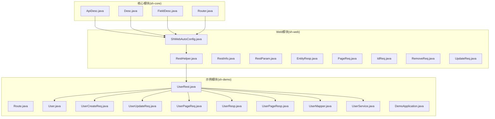
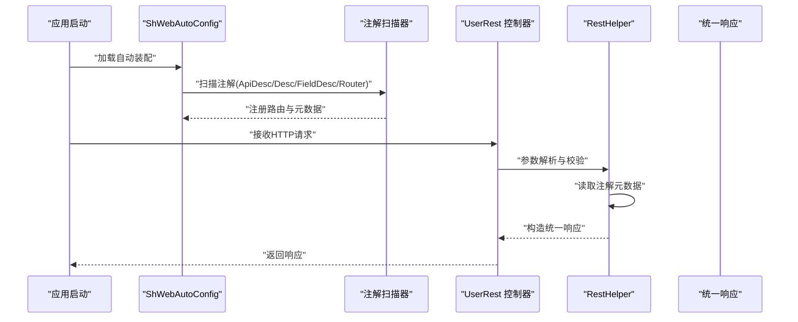
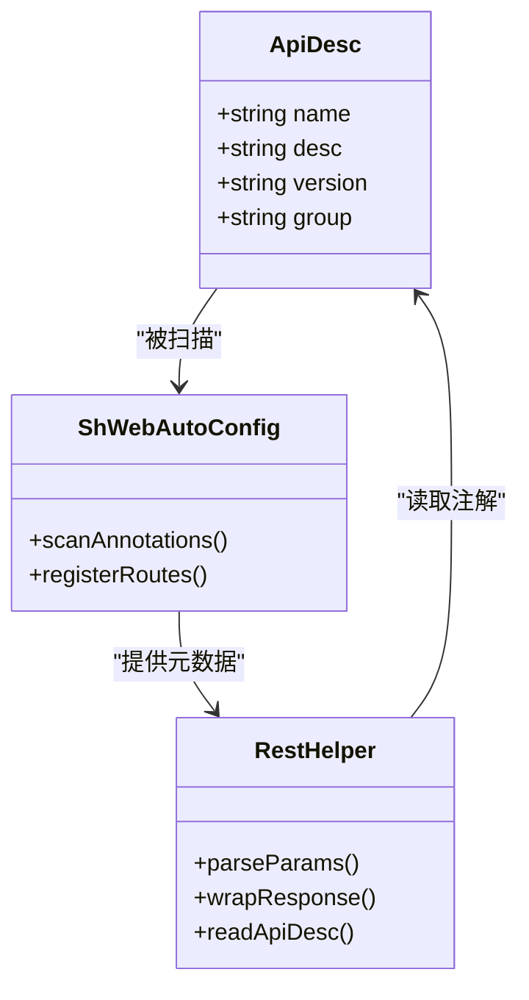
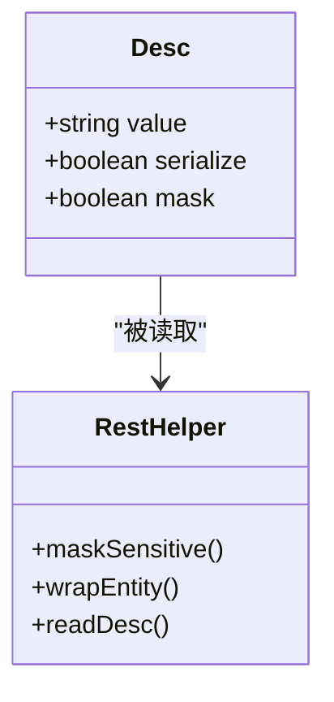
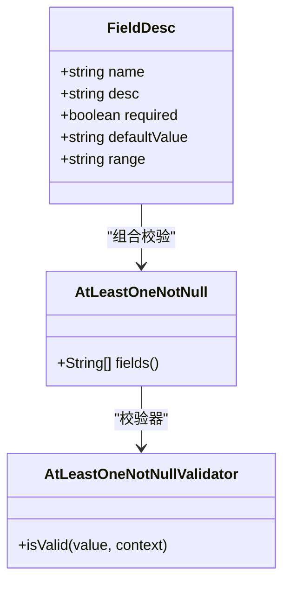
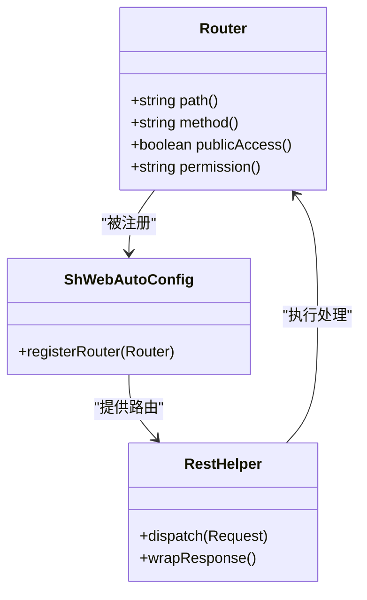
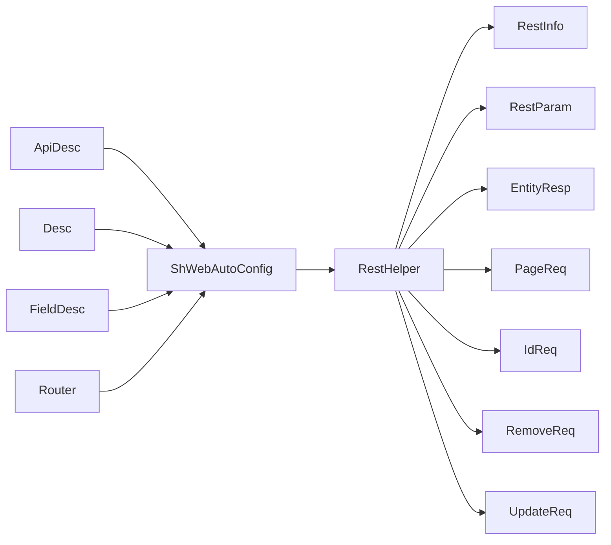

# 注解系统与元数据

<cite>
**本文引用的文件**
- [ApiDesc.java](file://sh-core/src/main/java/com/wkclz/core/annotation/ApiDesc.java)
- [Desc.java](file://sh-core/src/main/java/com/wkclz/core/annotation/Desc.java)
- [FieldDesc.java](file://sh-core/src/main/java/com/wkclz/core/annotation/FieldDesc.java)
- [Router.java](file://sh-core/src/main/java/com/wkclz/core/annotation/Router.java)
- [UserRest.java](file://sh-demo/src/main/java/com/wkclz/demo/rest/UserRest.java)
- [Route.java](file://sh-demo/src/main/java/com/wkclz/demo/rest/Route.java)
- [User.java](file://sh-demo/src/main/java/com/wkclz/demo/bean/entity/User.java)
- [UserCreateReq.java](file://sh-demo/src/main/java/com/wkclz/demo/bean/vo/user/UserCreateReq.java)
- [UserUpdateReq.java](file://sh-demo/src/main/java/com/wkclz/demo/bean/vo/user/UserUpdateReq.java)
- [UserPageReq.java](file://sh-demo/src/main/java/com/wkclz/demo/bean/vo/user/UserPageReq.java)
- [UserResp.java](file://sh-demo/src/main/java/com/wkclz/demo/bean/vo/user/UserResp.java)
- [UserPageResp.java](file://sh-demo/src/main/java/com/wkclz/demo/bean/vo/user/UserPageResp.java)
- [UserMapper.java](file://sh-demo/src/main/java/com/wkclz/demo/mapper/UserMapper.java)
- [UserService.java](file://sh-demo/src/main/java/com/wkclz/demo/service/UserService.java)
- [DemoApplication.java](file://sh-demo/src/main/java/com/wkclz/demo/DemoApplication.java)
- [ShWebAutoConfig.java](file://sh-web/src/main/java/com/wkclz/web/ShWebAutoConfig.java)
- [RestHelper.java](file://sh-web/src/main/java/com/wkclz/web/helper/RestHelper.java)
- [RestInfo.java](file://sh-web/src/main/java/com/wkclz/web/bean/RestInfo.java)
- [RestParam.java](file://sh-web/src/main/java/com/wkclz/web/bean/RestParam.java)
- [EntityResp.java](file://sh-web/src/main/java/com/wkclz/web/bean/EntityResp.java)
- [PageReq.java](file://sh-web/src/main/java/com/wkclz/web/bean/PageReq.java)
- [IdReq.java](file://sh-web/src/main/java/com/wkclz/web/bean/IdReq.java)
- [RemoveReq.java](file://sh-web/src/main/java/com/wkclz/web/bean/RemoveReq.java)
- [UpdateReq.java](file://sh-web/src/main/java/com/wkclz/web/bean/UpdateReq.java)
- [AtLeastOneNotNull.java](file://sh-web/src/main/java/com/wkclz/web/annotation/AtLeastOneNotNull.java)
- [AtLeastOneNotNullValidator.java](file://sh-web/src/main/java/com/wkclz/web/annotation/validator/AtLeastOneNotNullValidator.java)
</cite>

## 目录
1. [引言](#引言)
2. [项目结构](#项目结构)
3. [核心组件](#核心组件)
4. [架构总览](#架构总览)
5. [详细组件分析](#详细组件分析)
6. [依赖关系分析](#依赖关系分析)
7. [性能考虑](#性能考虑)
8. [故障排查指南](#故障排查指南)
9. [结论](#结论)
10. [附录](#附录)

## 引言
本文件聚焦于 sh-framework 的注解系统与元数据设计，系统性梳理并解释以下注解的设计目的、使用场景、参数配置与最佳实践：ApiDesc（API 描述）、Desc（通用描述）、FieldDesc（字段说明）、Router（路由定义）。文档同时阐述注解在框架中的作用机制，如何通过反射读取注解信息并进行相应处理，并结合示例模块展示在实际开发中如何合理运用这些注解以增强代码的可读性与功能性。

## 项目结构
注解位于核心模块 sh-core 的 annotation 包中，围绕 Web 层的自动装配与 REST 辅助工具共同构成注解驱动的元数据处理链路。示例模块 sh-demo 提供了注解在实体类、请求 VO、服务层与控制器层的实际应用案例。

图表来源
- [ApiDesc.java](file://sh-core/src/main/java/com/wkclz/core/annotation/ApiDesc.java)
- [Desc.java](file://sh-core/src/main/java/com/wkclz/core/annotation/Desc.java)
- [FieldDesc.java](file://sh-core/src/main/java/com/wkclz/core/annotation/FieldDesc.java)
- [Router.java](file://sh-core/src/main/java/com/wkclz/core/annotation/Router.java)
- [ShWebAutoConfig.java](file://sh-web/src/main/java/com/wkclz/web/ShWebAutoConfig.java)
- [RestHelper.java](file://sh-web/src/main/java/com/wkclz/web/helper/RestHelper.java)
- [UserRest.java](file://sh-demo/src/main/java/com/wkclz/demo/rest/UserRest.java)
- [User.java](file://sh-demo/src/main/java/com/wkclz/demo/bean/entity/User.java)

章节来源
- [ApiDesc.java](file://sh-core/src/main/java/com/wkclz/core/annotation/ApiDesc.java)
- [Desc.java](file://sh-core/src/main/java/com/wkclz/core/annotation/Desc.java)
- [FieldDesc.java](file://sh-core/src/main/java/com/wkclz/core/annotation/FieldDesc.java)
- [Router.java](file://sh-core/src/main/java/com/wkclz/core/annotation/Router.java)
- [ShWebAutoConfig.java](file://sh-web/src/main/java/com/wkclz/web/ShWebAutoConfig.java)
- [RestHelper.java](file://sh-web/src/main/java/com/wkclz/web/helper/RestHelper.java)
- [UserRest.java](file://sh-demo/src/main/java/com/wkclz/demo/rest/UserRest.java)

## 核心组件
本节对四个注解进行逐项解析，包括设计目的、典型使用位置、参数与属性、以及在框架中的处理方式。

- ApiDesc（API 描述）
  - 设计目的：为 REST 接口提供统一的描述元数据，便于生成文档或进行接口元数据管理。
  - 典型使用位置：控制器方法、请求 VO 类型等。
  - 关键属性：建议包含接口名称、描述、版本、分组等，具体以源码为准。
  - 处理机制：由 Web 自动装配扫描并读取，配合 REST 辅助工具生成统一响应或文档元数据。

- Desc（通用描述）
  - 设计目的：为实体类或枚举提供通用描述信息，便于统一展示与日志脱敏策略。
  - 典型使用位置：实体类、枚举、字段等。
  - 关键属性：描述文本、是否参与序列化、是否脱敏等，具体以源码为准。
  - 处理机制：通过反射读取注解，结合日志脱敏与统一响应包装。

- FieldDesc（字段说明）
  - 设计目的：为实体字段提供字段级说明，支持表单校验提示、文档生成与前端渲染。
  - 典型使用位置：实体类字段、请求/响应 VO 字段。
  - 关键属性：字段名称、描述、是否必填、默认值、范围约束等，具体以源码为准。
  - 处理机制：结合参数校验与响应包装，向调用方提供一致的字段语义。

- Router（路由定义）
  - 设计目的：声明式定义 REST 路由路径、HTTP 方法、权限标识等，实现路由与控制器的解耦。
  - 典型使用位置：控制器类或方法。
  - 关键属性：路径、方法、鉴权要求、是否公开等，具体以源码为准。
  - 处理机制：由自动装配扫描并注册到路由映射，统一由 REST 辅助工具处理请求与响应。

章节来源
- [ApiDesc.java](file://sh-core/src/main/java/com/wkclz/core/annotation/ApiDesc.java)
- [Desc.java](file://sh-core/src/main/java/com/wkclz/core/annotation/Desc.java)
- [FieldDesc.java](file://sh-core/src/main/java/com/wkclz/core/annotation/FieldDesc.java)
- [Router.java](file://sh-core/src/main/java/com/wkclz/core/annotation/Router.java)

## 架构总览
注解驱动的元数据处理链路如下：注解定义于 sh-core，Web 自动装配在启动时扫描注解，RestHelper 统一处理请求参数与响应包装，最终在示例模块中落地到控制器、实体与 VO。

图表来源
- [ShWebAutoConfig.java](file://sh-web/src/main/java/com/wkclz/web/ShWebAutoConfig.java)
- [RestHelper.java](file://sh-web/src/main/java/com/wkclz/web/helper/RestHelper.java)
- [UserRest.java](file://sh-demo/src/main/java/com/wkclz/demo/rest/UserRest.java)

## 详细组件分析

### ApiDesc 注解分析
- 设计目的：为接口提供统一描述元数据，便于文档生成与接口治理。
- 使用场景：
  - 在控制器方法上标注接口名称与描述，辅助生成 OpenAPI 或文档平台。
  - 在请求 VO 上标注用途，提升参数说明一致性。
- 参数与属性：建议包含接口名、描述、版本、分组等字段，具体以源码为准。
- 反射读取与处理：由 Web 自动装配扫描 ApiDesc，结合 RestHelper 进行统一响应包装与文档元数据输出。

图表来源
- [ApiDesc.java](file://sh-core/src/main/java/com/wkclz/core/annotation/ApiDesc.java)
- [ShWebAutoConfig.java](file://sh-web/src/main/java/com/wkclz/web/ShWebAutoConfig.java)
- [RestHelper.java](file://sh-web/src/main/java/com/wkclz/web/helper/RestHelper.java)

章节来源
- [ApiDesc.java](file://sh-core/src/main/java/com/wkclz/core/annotation/ApiDesc.java)
- [ShWebAutoConfig.java](file://sh-web/src/main/java/com/wkclz/web/ShWebAutoConfig.java)
- [RestHelper.java](file://sh-web/src/main/java/com/wkclz/web/helper/RestHelper.java)

### Desc 注解分析
- 设计目的：为实体类或枚举提供通用描述，支持统一展示与日志脱敏。
- 使用场景：
  - 实体类标注业务含义，如“用户”、“订单”等。
  - 枚举标注状态值含义，便于前端展示与审计。
- 参数与属性：建议包含描述文本、是否参与序列化、是否脱敏等字段，具体以源码为准。
- 反射读取与处理：通过反射读取 Desc 注解，结合日志脱敏与统一响应包装。

图表来源
- [Desc.java](file://sh-core/src/main/java/com/wkclz/core/annotation/Desc.java)
- [RestHelper.java](file://sh-web/src/main/java/com/wkclz/web/helper/RestHelper.java)

章节来源
- [Desc.java](file://sh-core/src/main/java/com/wkclz/core/annotation/Desc.java)
- [RestHelper.java](file://sh-web/src/main/java/com/wkclz/web/helper/RestHelper.java)

### FieldDesc 注解分析
- 设计目的：为字段提供字段级说明，支持参数校验提示、文档生成与前端渲染。
- 使用场景：
  - 请求/响应 VO 字段标注字段含义、必填、默认值、范围等。
  - 实体字段标注业务语义，便于审计与日志脱敏。
- 参数与属性：建议包含字段名、描述、必填、默认值、范围约束等字段，具体以源码为准。
- 反射读取与处理：结合参数校验与响应包装，向调用方提供一致的字段语义。

图表来源
- [FieldDesc.java](file://sh-core/src/main/java/com/wkclz/core/annotation/FieldDesc.java)
- [AtLeastOneNotNull.java](file://sh-web/src/main/java/com/wkclz/web/annotation/AtLeastOneNotNull.java)
- [AtLeastOneNotNullValidator.java](file://sh-web/src/main/java/com/wkclz/web/annotation/validator/AtLeastOneNotNullValidator.java)

章节来源
- [FieldDesc.java](file://sh-core/src/main/java/com/wkclz/core/annotation/FieldDesc.java)
- [AtLeastOneNotNull.java](file://sh-web/src/main/java/com/wkclz/web/annotation/AtLeastOneNotNull.java)
- [AtLeastOneNotNullValidator.java](file://sh-web/src/main/java/com/wkclz/web/annotation/validator/AtLeastOneNotNullValidator.java)

### Router 注解分析
- 设计目的：声明式定义 REST 路由路径、HTTP 方法、权限标识等，实现路由与控制器的解耦。
- 使用场景：
  - 控制器类或方法标注路由路径与方法类型。
  - 结合权限注解实现访问控制。
- 参数与属性：建议包含路径、方法、鉴权要求、是否公开等字段，具体以源码为准。
- 反射读取与处理：由自动装配扫描并注册到路由映射，统一由 REST 辅助工具处理请求与响应。

图表来源
- [Router.java](file://sh-core/src/main/java/com/wkclz/core/annotation/Router.java)
- [ShWebAutoConfig.java](file://sh-web/src/main/java/com/wkclz/web/ShWebAutoConfig.java)
- [RestHelper.java](file://sh-web/src/main/java/com/wkclz/web/helper/RestHelper.java)

章节来源
- [Router.java](file://sh-core/src/main/java/com/wkclz/core/annotation/Router.java)
- [ShWebAutoConfig.java](file://sh-web/src/main/java/com/wkclz/web/ShWebAutoConfig.java)
- [RestHelper.java](file://sh-web/src/main/java/com/wkclz/web/helper/RestHelper.java)

## 依赖关系分析
注解系统与 Web 自动装配、REST 辅助工具之间存在清晰的依赖关系：注解定义于 sh-core，Web 自动装配负责扫描与注册，RestHelper 负责统一处理请求与响应。

图表来源
- [ApiDesc.java](file://sh-core/src/main/java/com/wkclz/core/annotation/ApiDesc.java)
- [Desc.java](file://sh-core/src/main/java/com/wkclz/core/annotation/Desc.java)
- [FieldDesc.java](file://sh-core/src/main/java/com/wkclz/core/annotation/FieldDesc.java)
- [Router.java](file://sh-core/src/main/java/com/wkclz/core/annotation/Router.java)
- [ShWebAutoConfig.java](file://sh-web/src/main/java/com/wkclz/web/ShWebAutoConfig.java)
- [RestHelper.java](file://sh-web/src/main/java/com/wkclz/web/helper/RestHelper.java)

章节来源
- [ShWebAutoConfig.java](file://sh-web/src/main/java/com/wkclz/web/ShWebAutoConfig.java)
- [RestHelper.java](file://sh-web/src/main/java/com/wkclz/web/helper/RestHelper.java)

## 性能考虑
- 注解扫描时机：建议在应用启动阶段完成注解扫描与路由注册，避免运行时重复扫描带来的开销。
- 反射性能：对频繁访问的元数据可采用缓存策略，减少反射调用次数。
- 序列化与脱敏：对大量实体的统一响应包装与日志脱敏应避免不必要的字符串拼接与正则匹配。
- 参数校验：复杂校验规则建议在编译期或启动期进行预检查，降低运行时校验成本。

## 故障排查指南
- 注解未生效
  - 检查是否在启动类或配置类上启用自动装配。
  - 确认注解所在包已被扫描路径覆盖。
- 路由不匹配
  - 核对 Router 注解的路径与 HTTP 方法是否与请求一致。
  - 检查是否存在多个同路径不同方法的冲突。
- 响应包装异常
  - 检查 RestHelper 是否正确读取注解元数据。
  - 确认统一响应包装类与注解的字段映射关系。
- 字段校验失败
  - 检查 FieldDesc 注解的必填与范围约束是否与请求一致。
  - 验证自定义校验器是否正确实现。

章节来源
- [ShWebAutoConfig.java](file://sh-web/src/main/java/com/wkclz/web/ShWebAutoConfig.java)
- [RestHelper.java](file://sh-web/src/main/java/com/wkclz/web/helper/RestHelper.java)
- [AtLeastOneNotNullValidator.java](file://sh-web/src/main/java/com/wkclz/web/annotation/validator/AtLeastOneNotNullValidator.java)

## 结论
sh-framework 的注解系统通过 ApiDesc、Desc、FieldDesc、Router 四大注解，实现了接口描述、实体描述、字段说明与路由定义的统一建模。结合 Web 自动装配与 REST 辅助工具，注解驱动的元数据处理链路提升了代码的可读性与可维护性，降低了重复劳动，为文档生成、参数校验、路由注册与统一响应提供了强有力的支持。

## 附录
- 最佳实践
  - 将注解与职责分离：注解仅承载元数据，不包含业务逻辑。
  - 明确注解边界：每个注解只负责一个维度的元数据，避免过度聚合。
  - 启动期校验：在启动阶段验证注解配置的合法性，提前暴露问题。
  - 文档同步：确保注解描述与实际实现保持一致，避免文档漂移。
- 示例参考
  - 控制器与路由：参见 [UserRest.java](file://sh-demo/src/main/java/com/wkclz/demo/rest/UserRest.java)、[Route.java](file://sh-demo/src/main/java/com/wkclz/demo/rest/Route.java)
  - 实体与 VO：参见 [User.java](file://sh-demo/src/main/java/com/wkclz/demo/bean/entity/User.java)、[UserCreateReq.java](file://sh-demo/src/main/java/com/wkclz/demo/bean/vo/user/UserCreateReq.java)、[UserUpdateReq.java](file://sh-demo/src/main/java/com/wkclz/demo/bean/vo/user/UserUpdateReq.java)、[UserPageReq.java](file://sh-demo/src/main/java/com/wkclz/demo/bean/vo/user/UserPageReq.java)、[UserResp.java](file://sh-demo/src/main/java/com/wkclz/demo/bean/vo/user/UserResp.java)、[UserPageResp.java](file://sh-demo/src/main/java/com/wkclz/demo/bean/vo/user/UserPageResp.java)
  - 数据访问与服务：参见 [UserMapper.java](file://sh-demo/src/main/java/com/wkclz/demo/mapper/UserMapper.java)、[UserService.java](file://sh-demo/src/main/java/com/wkclz/demo/service/UserService.java)
  - 应用入口：参见 [DemoApplication.java](file://sh-demo/src/main/java/com/wkclz/demo/DemoApplication.java)