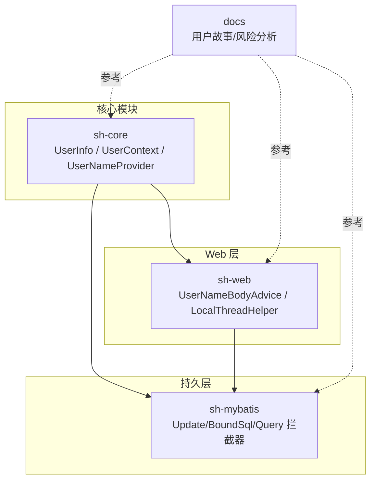
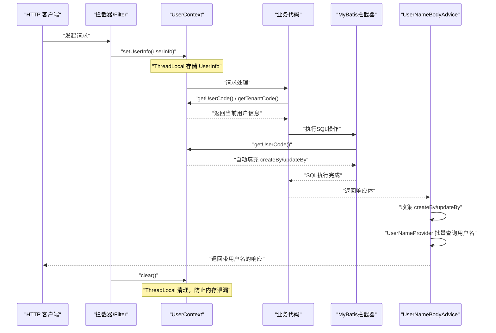
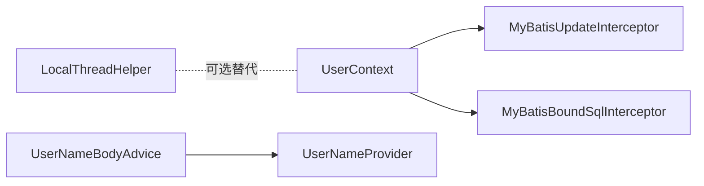
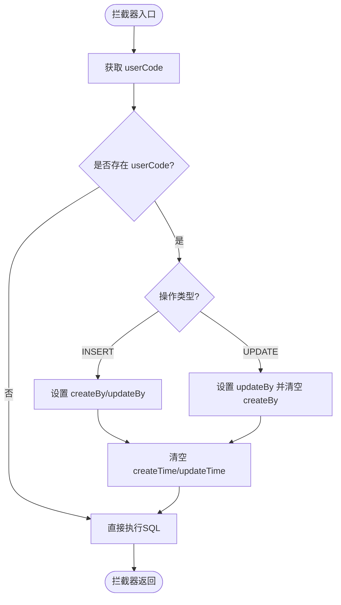

# 用户上下文与多租户

<cite>
**本文引用的文件**
- [UserInfo.java](file://sh-core/src/main/java/com/wkclz/core/base/UserInfo.java)
- [UserContext.java](file://sh-core/src/main/java/com/wkclz/core/user/UserContext.java)
- [UserNameProvider.java](file://sh-core/src/main/java/com/wkclz/core/spi/UserNameProvider.java)
- [MyBatisUpdateInterceptor.java](file://sh-mybatis/src/main/java/com/wkclz/mybatis/interceptor/MyBatisUpdateInterceptor.java)
- [MyBatisBoundSqlInterceptor.java](file://sh-mybatis/src/main/java/com/wkclz/mybatis/interceptor/MyBatisBoundSqlInterceptor.java)
- [UserNameBodyAdvice.java](file://sh-web/src/main/java/com/wkclz/web/rest/UserNameBodyAdvice.java)
- [LocalThreadHelper.java](file://sh-web/src/main/java/com/wkclz/web/helper/LocalThreadHelper.java)
- [US-004-用户上下文与多租户隔离.md](file://docs/stories/US-004-用户上下文与多租户隔离.md)
- [US-010-MyBatis拦截器与自动填充.md](file://docs/stories/US-010-MyBatis拦截器与自动填充.md)
- [US-020-动态数据源运行时切换.md](file://docs/stories/US-020-动态数据源运行时切换.md)
- [risk-analysis.md](file://docs/risk-analysis.md)
- [SKILL.md（示例模块）](file://.agents/skills/sh-demo/SKILL.md)
</cite>

## 目录
1. [简介](#简介)
2. [项目结构](#项目结构)
3. [核心组件](#核心组件)
4. [架构总览](#架构总览)
5. [详细组件分析](#详细组件分析)
6. [依赖分析](#依赖分析)
7. [性能考虑](#性能考虑)
8. [故障排查指南](#故障排查指南)
9. [结论](#结论)
10. [附录](#附录)

## 简介
本技术文档围绕 sh-framework 的用户上下文与多租户隔离能力展开，重点涵盖：
- UserInfo 用户信息模型设计与关键字段语义
- UserContext 用户上下文在请求生命周期内的管理机制
- 多租户隔离的实现原理（租户标识获取、数据隔离策略、权限控制思路）
- SPI 扩展点 UserNameProvider 的使用方法与接入方式
- 在不同业务场景下的用户上下文使用示例与最佳实践

## 项目结构
用户上下文与多租户相关能力主要分布在以下模块：
- sh-core：用户信息模型、用户上下文工具、SPI 扩展点
- sh-mybatis：MyBatis 拦截器自动填充 createBy/updateBy
- sh-web：响应体用户名自动填充、线程上下文工具
- docs：用户故事与风险分析文档

图表来源
- [UserInfo.java:1-36](file://sh-core/src/main/java/com/wkclz/core/base/UserInfo.java#L1-L36)
- [UserContext.java:1-54](file://sh-core/src/main/java/com/wkclz/core/user/UserContext.java#L1-L54)
- [UserNameProvider.java:1-13](file://sh-core/src/main/java/com/wkclz/core/spi/UserNameProvider.java#L1-L13)
- [MyBatisUpdateInterceptor.java:1-85](file://sh-mybatis/src/main/java/com/wkclz/mybatis/interceptor/MyBatisUpdateInterceptor.java#L1-L85)
- [UserNameBodyAdvice.java:1-136](file://sh-web/src/main/java/com/wkclz/web/rest/UserNameBodyAdvice.java#L1-L136)
- [LocalThreadHelper.java:1-95](file://sh-web/src/main/java/com/wkclz/web/helper/LocalThreadHelper.java#L1-L95)

章节来源
- [UserInfo.java:1-36](file://sh-core/src/main/java/com/wkclz/core/base/UserInfo.java#L1-L36)
- [UserContext.java:1-54](file://sh-core/src/main/java/com/wkclz/core/user/UserContext.java#L1-L54)
- [UserNameProvider.java:1-13](file://sh-core/src/main/java/com/wkclz/core/spi/UserNameProvider.java#L1-L13)
- [MyBatisUpdateInterceptor.java:1-85](file://sh-mybatis/src/main/java/com/wkclz/mybatis/interceptor/MyBatisUpdateInterceptor.java#L1-L85)
- [UserNameBodyAdvice.java:1-136](file://sh-web/src/main/java/com/wkclz/web/rest/UserNameBodyAdvice.java#L1-L136)
- [LocalThreadHelper.java:1-95](file://sh-web/src/main/java/com/wkclz/web/helper/LocalThreadHelper.java#L1-L95)
- [US-004-用户上下文与多租户隔离.md:1-40](file://docs/stories/US-004-用户上下文与多租户隔离.md#L1-L40)
- [US-010-MyBatis拦截器与自动填充.md:1-54](file://docs/stories/US-010-MyBatis拦截器与自动填充.md#L1-L54)
- [US-020-动态数据源运行时切换.md:1-41](file://docs/stories/US-020-动态数据源运行时切换.md#L1-L41)
- [risk-analysis.md:90-110](file://docs/risk-analysis.md#L90-L110)

## 核心组件
- UserInfo：登录后保存的用户基础信息，包含用户编码、用户名、昵称、手机号（脱敏）、租户编码、头像、Open ID 等字段，用于跨层传递与自动填充。
- UserContext：基于 ThreadLocal 的用户上下文工具，提供 setUserInfo、getUserInfo、getUserCode、getTenantCode、clear 等静态方法，贯穿请求生命周期。
- UserNameProvider：SPI 扩展点，默认空实现，可通过实现该接口批量获取用户名称映射，供响应体自动填充用户名使用。

章节来源
- [UserInfo.java:11-35](file://sh-core/src/main/java/com/wkclz/core/base/UserInfo.java#L11-L35)
- [UserContext.java:8-51](file://sh-core/src/main/java/com/wkclz/core/user/UserContext.java#L8-L51)
- [UserNameProvider.java:7-12](file://sh-core/src/main/java/com/wkclz/core/spi/UserNameProvider.java#L7-L12)

## 架构总览
用户上下文与多租户隔离的整体流程如下：
- 请求进入拦截器/过滤器，从认证信息中提取用户与租户信息，写入 UserContext
- 业务代码在任意层级通过 UserContext 获取 userCode、tenantCode
- MyBatis 拦截器在增删改时自动填充 createBy/updateBy；查询时对空字符串进行清理
- 响应阶段 UserNameBodyAdvice 可根据 createBy/updateBy 的 userCode 批量查询用户名并回填
- 请求结束时清理 ThreadLocal，防止内存泄漏

图表来源
- [US-004-用户上下文与多租户隔离.md:13-34](file://docs/stories/US-004-用户上下文与多租户隔离.md#L13-L34)
- [UserContext.java:16-50](file://sh-core/src/main/java/com/wkclz/core/user/UserContext.java#L16-L50)
- [MyBatisUpdateInterceptor.java:24-43](file://sh-mybatis/src/main/java/com/wkclz/mybatis/interceptor/MyBatisUpdateInterceptor.java#L24-L43)
- [UserNameBodyAdvice.java:38-71](file://sh-web/src/main/java/com/wkclz/web/rest/UserNameBodyAdvice.java#L38-L71)

章节来源
- [US-004-用户上下文与多租户隔离.md:6-39](file://docs/stories/US-004-用户上下文与多租户隔离.md#L6-L39)

## 详细组件分析

### UserInfo 用户信息模型
- 字段设计要点
  - userCode：用户唯一编码，贯穿业务与持久层，用于自动填充 createBy/updateBy
  - tenantCode：租户编码，用于多租户隔离与数据路由
  - username、nickname、mobile（脱敏）、avatar、openId：辅助展示与外部对接
- 适用场景
  - 作为响应体返回给前端时，可结合 UserNameProvider 将 userCode 映射为用户名
  - 作为查询条件时，需注意空字符串会被拦截器清理，避免误匹配

章节来源
- [UserInfo.java:14-33](file://sh-core/src/main/java/com/wkclz/core/base/UserInfo.java#L14-L33)

### UserContext 用户上下文管理
- 管理机制
  - 基于 ThreadLocal 存储 UserInfo，确保单次请求内可跨层访问
  - 提供 setUserInfo、getUserInfo、getUserCode、getTenantCode、clear 等便捷方法
- 生命周期
  - 设置：在拦截器/过滤器中完成认证后写入
  - 使用：业务代码任意层级读取 userCode、tenantCode
  - 清理：请求结束时在 finally 块中调用 clear，避免线程复用导致的数据残留
- 注意事项
  - 不要在拦截器外自行设置 UserContext，避免与自动清理机制冲突
  - 线程池场景需采用可传递的线程上下文方案（如 TransmittableThreadLocal）

章节来源
- [UserContext.java:10-51](file://sh-core/src/main/java/com/wkclz/core/user/UserContext.java#L10-L51)
- [risk-analysis.md:97-101](file://docs/risk-analysis.md#L97-L101)

### 多租户隔离实现
- 租户标识获取
  - 通过 UserContext.getTenantCode() 在业务层获取当前租户编码
  - 在动态数据源模块中，DynamicDataSourceHolder 同样使用 ThreadLocal 存储租户键，实现数据源路由
- 数据隔离策略
  - 按租户编码路由至独立数据源（物理隔离）
  - 在同一数据源内，通过 tenantCode 字段实现逻辑隔离
- 权限控制机制
  - 建议在查询/更新时强制带上 tenantCode 与 userCode，避免越权
  - 响应体中可结合 UserNameProvider 回填用户名，便于审计与展示

章节来源
- [UserContext.java:41-44](file://sh-core/src/main/java/com/wkclz/core/user/UserContext.java#L41-L44)
- [US-020-动态数据源运行时切换.md:22-40](file://docs/stories/US-020-动态数据源运行时切换.md#L22-L40)

### SPI 扩展点 UserNameProvider
- 作用
  - 为 UserNameBodyAdvice 提供批量用户名映射能力，将响应体中的 userCode 替换为 username
- 使用方法
  - 实现 UserNameProvider 接口，至少覆盖 getNamesByUserCodes 方法
  - 框架通过 SpringContextHolder 自动发现并缓存实现类
- 典型场景
  - 业务返回列表时，createBy/updateBy 为 userCode，经 UserNameBodyAdvice 批量查询后替换为用户名

章节来源
- [UserNameProvider.java:7-12](file://sh-core/src/main/java/com/wkclz/core/spi/UserNameProvider.java#L7-L12)
- [UserNameBodyAdvice.java:38-115](file://sh-web/src/main/java/com/wkclz/web/rest/UserNameBodyAdvice.java#L38-L115)

### MyBatis 拦截器与自动填充
- 自动填充 createBy/updateBy
  - 在插入时设置 createBy 与 updateBy
  - 在更新时仅设置 updateBy，并清空 createBy，避免覆盖原值
  - 时间字段置空，交由数据库自动填充
- 空字符串清理
  - 查询拦截器将空字符串替换为 null，避免生成无效 SQL 条件
- BoundSql 注入
  - 当 SQL 包含 #{updateBy} 时，拦截器注入 updateBy 参数，支持 deleteById 等场景

章节来源
- [MyBatisUpdateInterceptor.java:24-72](file://sh-mybatis/src/main/java/com/wkclz/mybatis/interceptor/MyBatisUpdateInterceptor.java#L24-L72)
- [MyBatisBoundSqlInterceptor.java:24-31](file://sh-mybatis/src/main/java/com/wkclz/mybatis/interceptor/MyBatisBoundSqlInterceptor.java#L24-L31)
- [US-010-MyBatis拦截器与自动填充.md:14-46](file://docs/stories/US-010-MyBatis拦截器与自动填充.md#L14-L46)

### 响应体用户名自动填充
- 工作流程
  - 收集响应体中的 BaseEntity（包含 createBy/updateBy）
  - 去重汇总 userCode，调用 UserNameProvider 批量查询映射
  - 将 userCode 替换为 username，返回给前端
- 性能与健壮性
  - 使用缓存 UserNameProvider 实例，避免重复扫描 Spring 上下文
  - 限定最大递归深度，防止深层嵌套对象导致性能问题

章节来源
- [UserNameBodyAdvice.java:38-136](file://sh-web/src/main/java/com/wkclz/web/rest/UserNameBodyAdvice.java#L38-L136)

### 示例：在业务中使用用户上下文
- 示例场景
  - 在拦截器/过滤器中设置 UserContext
  - 业务方法中读取 userCode、tenantCode
  - MyBatis 拦截器自动填充 createBy/updateBy
  - UserNameBodyAdvice 自动回填用户名
- 参考示例
  - 示例模块中演示了 setLoginUser 的用法，模拟登录用户并设置 UserContext

章节来源
- [SKILL.md（示例模块）:313-326](file://.agents/skills/sh-demo/SKILL.md#L313-L326)

## 依赖分析
- 组件耦合
  - UserContext 与 MyBatis 拦截器存在运行时依赖：拦截器通过 UserContext 获取 userCode
  - UserNameBodyAdvice 依赖 UserNameProvider SPI，二者通过 Spring 自动装配
  - LocalThreadHelper 提供多 Key 线程上下文能力，可作为 UserContext 的补充或替代方案
- 外部依赖
  - SpringContextHolder 用于在非 Spring 管理对象中获取 ApplicationContext
  - Lombok 注解简化 POJO 编写

图表来源
- [UserContext.java:32-38](file://sh-core/src/main/java/com/wkclz/core/user/UserContext.java#L32-L38)
- [MyBatisUpdateInterceptor.java:32-40](file://sh-mybatis/src/main/java/com/wkclz/mybatis/interceptor/MyBatisUpdateInterceptor.java#L32-L40)
- [UserNameBodyAdvice.java:45-48](file://sh-web/src/main/java/com/wkclz/web/rest/UserNameBodyAdvice.java#L45-L48)
- [LocalThreadHelper.java:18-85](file://sh-web/src/main/java/com/wkclz/web/helper/LocalThreadHelper.java#L18-L85)

章节来源
- [UserContext.java:1-54](file://sh-core/src/main/java/com/wkclz/core/user/UserContext.java#L1-L54)
- [MyBatisUpdateInterceptor.java:1-85](file://sh-mybatis/src/main/java/com/wkclz/mybatis/interceptor/MyBatisUpdateInterceptor.java#L1-L85)
- [UserNameBodyAdvice.java:1-136](file://sh-web/src/main/java/com/wkclz/web/rest/UserNameBodyAdvice.java#L1-L136)
- [LocalThreadHelper.java:1-95](file://sh-web/src/main/java/com/wkclz/web/helper/LocalThreadHelper.java#L1-L95)

## 性能考虑
- 线程上下文清理
  - 必须在拦截器/过滤器的 finally 块中调用 UserContext.clear()，避免线程池复用导致的内存泄漏
- 响应体处理
  - UserNameBodyAdvice 限制递归深度，减少深对象遍历成本
  - 批量查询 userCode 映射，降低多次远程调用开销
- MyBatis 拦截器
  - 仅在必要时进行字段赋值，避免对查询场景造成额外负担

## 故障排查指南
- 现象：内存泄漏或线程池线程无法回收
  - 原因：未在拦截器/过滤器中调用 UserContext.clear()
  - 解决：统一在 finally 块中清理 ThreadLocal
- 现象：用户上下文错乱（A 看到 B 的数据）
  - 原因：线程池复用导致上一次请求的 ThreadLocal 残留
  - 解决：使用可传递的线程上下文方案（如 TransmittableThreadLocal）
- 现象：响应体未显示用户名
  - 原因：UserNameProvider 未实现或未注册
  - 解决：实现 UserNameProvider 并确保 Spring 能扫描到

章节来源
- [risk-analysis.md:90-101](file://docs/risk-analysis.md#L90-L101)
- [UserContext.java:49-51](file://sh-core/src/main/java/com/wkclz/core/user/UserContext.java#L49-L51)
- [UserNameBodyAdvice.java:99-115](file://sh-web/src/main/java/com/wkclz/web/rest/UserNameBodyAdvice.java#L99-L115)

## 结论
sh-framework 的用户上下文与多租户隔离方案以 UserContext 为核心，配合 MyBatis 拦截器与 UserNameProvider，实现了从认证到持久化再到响应体的完整闭环。通过严格的生命周期管理和 SPI 扩展机制，既能满足多租户物理/逻辑隔离需求，又能兼顾性能与可维护性。建议在生产环境严格遵循“拦截器统一设置、finally 统一清理”的原则，并在需要时引入线程上下文传递方案以适配复杂线程池场景。

## 附录
- 关键流程图（算法实现）
  - 自动填充 createBy/updateBy 流程

图表来源
- [MyBatisUpdateInterceptor.java:24-72](file://sh-mybatis/src/main/java/com/wkclz/mybatis/interceptor/MyBatisUpdateInterceptor.java#L24-L72)