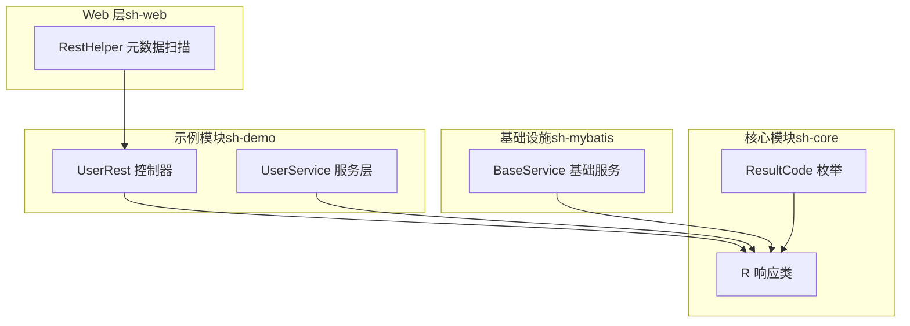
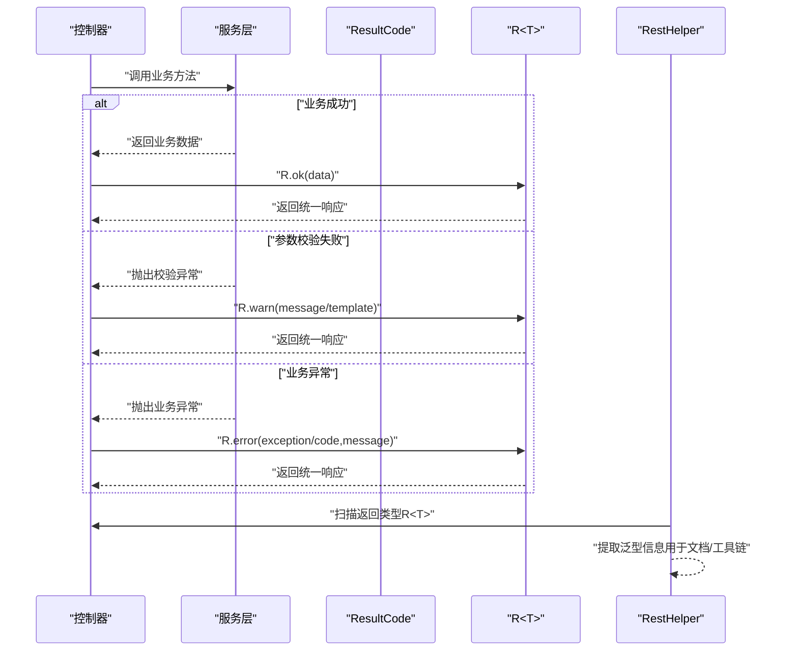
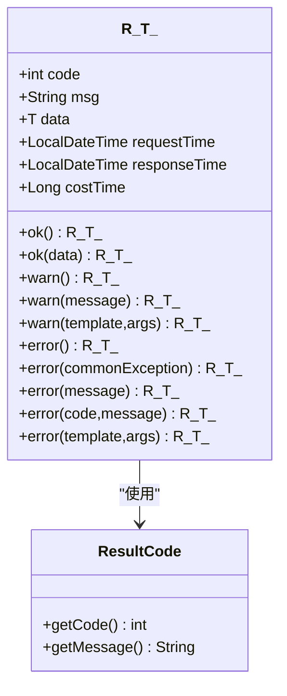
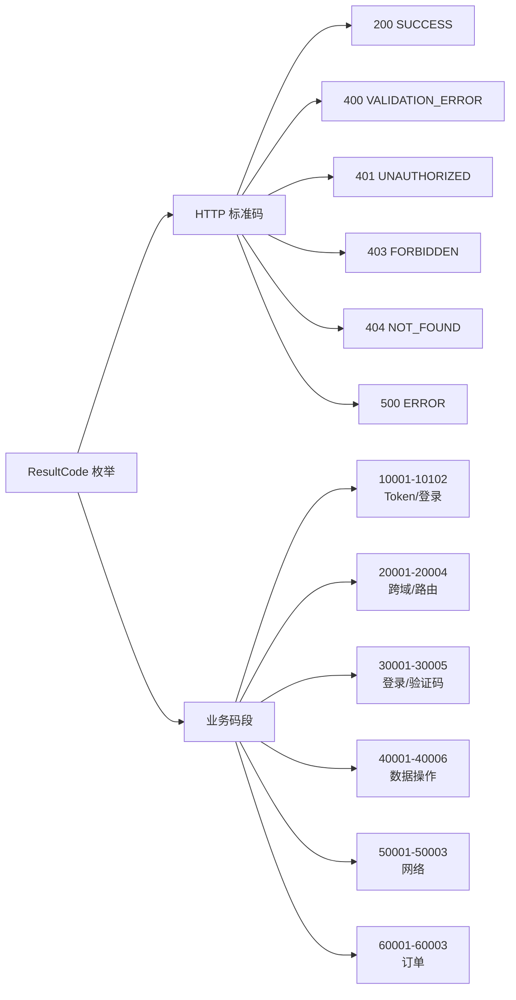
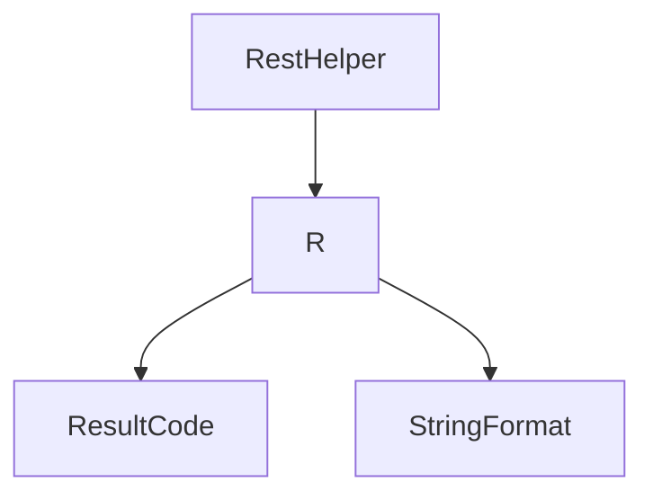

# 统一响应封装

<cite>
**本文引用的文件**
- [R.java](file://sh-core/src/main/java/com/wkclz/core/base/R.java)
- [ResultCode.java](file://sh-core/src/main/java/com/wkclz/core/enums/ResultCode.java)
- [US-002-统一响应结果封装.md](file://docs/stories/US-002-统一响应结果封装.md)
- [US-005-结果码与业务错误码体系.md](file://docs/stories/US-005-结果码与业务错误码体系.md)
- [SKILL.md（sh-web 技能）](file://.agents/skills/sh-web/SKILL.md)
- [RestHelper.java](file://sh-web/src/main/java/com/wkclz/web/helper/RestHelper.java)
- [RestHelperTest.java](file://sh-web/src/test/java/com/wkclz/web/helper/RestHelperTest.java)
- [UserRest.java](file://sh-demo/src/main/java/com/wkclz/demo/rest/UserRest.java)
- [UserService.java](file://sh-demo/src/main/java/com/wkclz/demo/service/UserService.java)
- [BaseService.java](file://sh-mybatis/src/main/java/com/wkclz/mybatis/service/BaseService.java)
</cite>

## 目录
1. [简介](#简介)
2. [项目结构](#项目结构)
3. [核心组件](#核心组件)
4. [架构总览](#架构总览)
5. [详细组件分析](#详细组件分析)
6. [依赖分析](#依赖分析)
7. [性能考虑](#性能考虑)
8. [故障排查指南](#故障排查指南)
9. [结论](#结论)
10. [附录](#附录)

## 简介
本文件面向 sh-framework 的统一响应封装系统，围绕 R<T> 泛型响应类与 ResultCode 枚举展开，系统性阐述其设计理念、使用方式、序列化与反序列化机制、响应数据包装策略，以及在控制器、服务层与异常处理中的最佳实践。目标是帮助开发者在前后端之间建立一致、可预期的交互契约，提升开发效率与系统稳定性。

## 项目结构
统一响应封装位于 sh-core 模块，配合 web 层的元数据扫描与示例模块的使用演示，形成从“响应模型”到“接口契约”的闭环。

图表来源
- [R.java:1-76](file://sh-core/src/main/java/com/wkclz/core/base/R.java#L1-L76)
- [ResultCode.java:1-77](file://sh-core/src/main/java/com/wkclz/core/enums/ResultCode.java#L1-L77)
- [RestHelper.java:355-393](file://sh-web/src/main/java/com/wkclz/web/helper/RestHelper.java#L355-L393)
- [UserRest.java](file://sh-demo/src/main/java/com/wkclz/demo/rest/UserRest.java)
- [UserService.java](file://sh-demo/src/main/java/com/wkclz/demo/service/UserService.java)
- [BaseService.java](file://sh-mybatis/src/main/java/com/wkclz/mybatis/service/BaseService.java)

章节来源
- [R.java:1-76](file://sh-core/src/main/java/com/wkclz/core/base/R.java#L1-L76)
- [ResultCode.java:1-77](file://sh-core/src/main/java/com/wkclz/core/enums/ResultCode.java#L1-L77)
- [RestHelper.java:355-393](file://sh-web/src/main/java/com/wkclz/web/helper/RestHelper.java#L355-L393)

## 核心组件
- R<T> 泛型响应类：统一承载 code、msg、data 三要素，并包含请求/响应时间与耗时，便于可观测性与性能分析。
- ResultCode 枚举：定义标准业务状态码，覆盖 HTTP 标准码与六大业务码段，确保前后端对错误类型达成一致。

章节来源
- [R.java:11-76](file://sh-core/src/main/java/com/wkclz/core/base/R.java#L11-L76)
- [ResultCode.java:7-77](file://sh-core/src/main/java/com/wkclz/core/enums/ResultCode.java#L7-L77)

## 架构总览
统一响应贯穿“控制器 → 服务层 → 异常处理”，通过静态工厂方法快速构造成功、警告与错误响应；ResultCode 为所有响应提供稳定的状态码来源；RestHelper 则在接口元数据层面识别返回类型，保障上层工具链与文档生成的准确性。

图表来源
- [R.java:37-76](file://sh-core/src/main/java/com/wkclz/core/base/R.java#L37-L76)
- [ResultCode.java:7-77](file://sh-core/src/main/java/com/wkclz/core/enums/ResultCode.java#L7-L77)
- [RestHelper.java:355-393](file://sh-web/src/main/java/com/wkclz/web/helper/RestHelper.java#L355-L393)

## 详细组件分析

### R<T> 响应类设计与使用
- 设计理念
  - 统一三段式结构：code（状态码）、msg（提示信息）、data（业务数据），外加 requestTime、responseTime、costTime，满足可观测性需求。
  - 泛型支持：通过 T 表达任意业务数据类型，结合 RestHelper 可在上层工具链中准确识别泛型结构。
- 成功响应
  - R.ok()：返回 code=200，msg=Success，data=null。
  - R.ok(data)：返回 code=200，msg=Success，data=传入数据。
- 警告响应
  - R.warn()：返回 code=400，msg=Parameter validation error，data=null。
  - R.warn(message)：返回 code=400，msg=自定义消息，data=null。
  - R.warn(template, args...)：基于模板与参数格式化消息，保持一致性。
- 错误响应
  - R.error()：返回 code=500，msg=Internal Server Error，data=null。
  - R.error(commonException)：以异常的 code 与 message 构造响应。
  - R.error(message)：返回 code=500，msg=自定义消息，data=null。
  - R.error(code, message)：自定义 code 与 message。
  - R.error(template, args...)：模板化消息格式化。

图表来源
- [R.java:11-76](file://sh-core/src/main/java/com/wkclz/core/base/R.java#L11-L76)
- [ResultCode.java:61-77](file://sh-core/src/main/java/com/wkclz/core/enums/ResultCode.java#L61-L77)

章节来源
- [R.java:11-76](file://sh-core/src/main/java/com/wkclz/core/base/R.java#L11-L76)
- [US-002-统一响应结果封装.md:13-28](file://docs/stories/US-002-统一响应结果封装.md#L13-L28)

### ResultCode 枚举设计
- 覆盖范围
  - HTTP 标准码：200、400、401、403、404、500。
  - 业务码段：Token/登录（10001-10102）、跨域/路由（20001-20004）、登录/验证码（30001-30005）、数据操作（40001-40006）、网络（50001-50003）、订单（60001-60003）。
- 设计要点
  - 枚举值直接映射 code 与 message，避免魔法数，便于前端按 code 精确分支处理。
  - 新增业务码段遵循“起始码段+10000”的规则，预留扩展空间且不冲突。

图表来源
- [ResultCode.java:7-77](file://sh-core/src/main/java/com/wkclz/core/enums/ResultCode.java#L7-L77)
- [US-005-结果码与业务错误码体系.md:14-31](file://docs/stories/US-005-结果码与业务错误码体系.md#L14-L31)

章节来源
- [ResultCode.java:7-77](file://sh-core/src/main/java/com/wkclz/core/enums/ResultCode.java#L7-L77)
- [US-005-结果码与业务错误码体系.md:1-37](file://docs/stories/US-005-结果码与业务错误码体系.md#L1-L37)

### 序列化与反序列化机制
- 统一响应的序列化
  - R<T> 实现 Serializable，可直接参与序列化流程（例如 JSON 序列化）。结合 RestHelper 的返回类型提取能力，可在接口扫描阶段识别 R<T> 及其泛型结构，确保上层工具链与文档生成的准确性。
- 反序列化与白名单
  - Redis 序列化器采用 fastjson2 的 autoType 白名单机制，仅允许受控包前缀与常用 Java 类型通过 AutoType 实例化，降低反序列化风险。该机制虽非 R<T> 直接实现，但与统一响应的数据结构兼容，保障缓存层数据安全。
- 一致性保证
  - 通过 ResultCode 与 R<T> 的组合，前后端约定稳定的 code/msg/data 结构，避免因响应格式差异导致的解析错误。

章节来源
- [RestHelper.java:355-393](file://sh-web/src/main/java/com/wkclz/web/helper/RestHelper.java#L355-L393)
- [RestHelperTest.java:20-78](file://sh-web/src/test/java/com/wkclz/web/helper/RestHelperTest.java#L20-L78)
- [Fastjson2JsonRedisSerializer.java:25-81](file://sh-redis/src/main/java/com/wkclz/redis/serializer/Fastjson2JsonRedisSerializer.java#L25-L81)

### 响应数据包装策略
- 标准化字段
  - code：统一状态码来源，优先使用 ResultCode。
  - msg：统一提示信息，支持模板参数格式化。
  - data：业务数据，可为任意类型。
  - requestTime/responseTime/costTime：增强可观测性，便于性能分析与问题定位。
- 包装策略
  - 成功：code=200，msg=Success，data=业务数据。
  - 警告：code=400，msg=校验失败提示，data=null。
  - 错误：code=500 或业务异常 code，msg=异常信息，data=null。
  - 模板化：warn/error 支持模板与参数，确保消息一致性与可读性。

章节来源
- [R.java:14-21](file://sh-core/src/main/java/com/wkclz/core/base/R.java#L14-L21)
- [R.java:37-76](file://sh-core/src/main/java/com/wkclz/core/base/R.java#L37-L76)

### 使用示例与最佳实践

#### 控制器层
- 返回 R<T> 统一响应，确保前端统一处理。
- 示例参考：UserRest 控制器通过 R.ok(data) 返回成功响应，R.warn(...) 返回参数校验失败，R.error(...) 返回异常。

章节来源
- [UserRest.java](file://sh-demo/src/main/java/com/wkclz/demo/rest/UserRest.java)

#### 服务层
- 服务层内部使用 ResultCode 与 R<T> 构造响应，向上抛出异常或直接返回 R<T>。
- 示例参考：BaseService 与 UserService 的典型用法，结合 R.ok()/warn()/error() 快速构建响应。

章节来源
- [BaseService.java](file://sh-mybatis/src/main/java/com/wkclz/mybatis/service/BaseService.java)
- [UserService.java](file://sh-demo/src/main/java/com/wkclz/demo/service/UserService.java)

#### 异常处理
- 将业务异常转换为 R.error(commonException)，保持 code 与 message 的一致性。
- 对于参数校验失败，使用 R.warn(...) 返回明确提示，便于前端引导用户修正输入。

章节来源
- [R.java:61-63](file://sh-core/src/main/java/com/wkclz/core/base/R.java#L61-L63)
- [R.java:49-55](file://sh-core/src/main/java/com/wkclz/core/base/R.java#L49-L55)

## 依赖分析
- R<T> 依赖 ResultCode 提供状态码与消息，依赖 StringFormat 进行模板消息格式化。
- RestHelper 依赖 R<T> 的返回类型进行元数据提取，支持单层与多层泛型识别，保障上层工具链可用性。

图表来源
- [R.java:3-6](file://sh-core/src/main/java/com/wkclz/core/base/R.java#L3-L6)
- [RestHelper.java:355-393](file://sh-web/src/main/java/com/wkclz/web/helper/RestHelper.java#L355-L393)

章节来源
- [R.java:3-6](file://sh-core/src/main/java/com/wkclz/core/base/R.java#L3-L6)
- [RestHelper.java:355-393](file://sh-web/src/main/java/com/wkclz/web/helper/RestHelper.java#L355-L393)

## 性能考虑
- R<T> 中的 requestTime/responseTime/costTime 字段有助于定位慢请求，建议在网关或中间件层采集并上报。
- 使用 ResultCode 统一状态码，减少分支判断复杂度，提高处理效率。
- 模板化消息格式化仅在 warn/error 模板场景触发，避免不必要的开销。

## 故障排查指南
- 前端收到非预期响应
  - 检查控制器是否正确返回 R<T>，并确认 code/msg/data 是否符合预期。
  - 参考验收标准：[US-002-统一响应结果封装.md:30-34](file://docs/stories/US-002-统一响应结果封装.md#L30-L34)
- 状态码不一致
  - 核对 ResultCode 枚举值与业务场景是否匹配，避免自定义 code 导致前端分支遗漏。
  - 参考对照表：[SKILL.md（sh-web 技能）:441-490](file://.agents/skills/sh-web/SKILL.md#L441-L490)
- 泛型识别异常
  - 确认返回类型为 R<T>，并检查 RestHelper 的泛型解析逻辑是否正常。
  - 参考测试用例：[RestHelperTest.java:20-78](file://sh-web/src/test/java/com/wkclz/web/helper/RestHelperTest.java#L20-L78)

章节来源
- [US-002-统一响应结果封装.md:30-34](file://docs/stories/US-002-统一响应结果封装.md#L30-L34)
- [.agents/skills/sh-web/SKILL.md:441-490](file://.agents/skills/sh-web/SKILL.md#L441-L490)
- [RestHelperTest.java:20-78](file://sh-web/src/test/java/com/wkclz/web/helper/RestHelperTest.java#L20-L78)

## 结论
R<T> 与 ResultCode 构成了 sh-framework 统一响应的核心基石，通过标准化的状态码、消息与数据结构，以及完善的静态工厂方法与模板化能力，实现了前后端一致的交互契约。结合 RestHelper 的泛型识别与白名单反序列化策略，进一步提升了系统的可观测性与安全性。建议在各层严格遵循统一响应规范，确保系统整体一致性与可维护性。

## 附录
- 接口返回值规范与字段说明：[SKILL.md（sh-web 技能）:391-430](file://.agents/skills/sh-web/SKILL.md#L391-L430)
- 业务码段对照表：[SKILL.md（sh-web 技能）:441-490](file://.agents/skills/sh-web/SKILL.md#L441-L490)