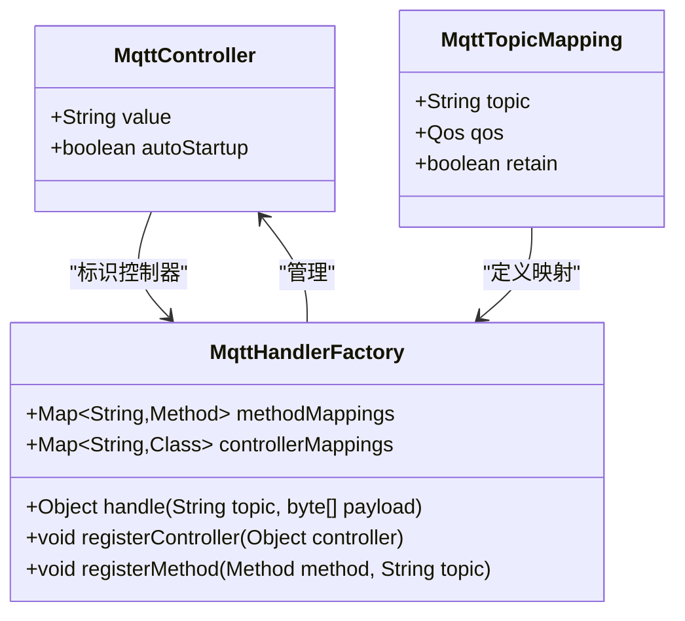
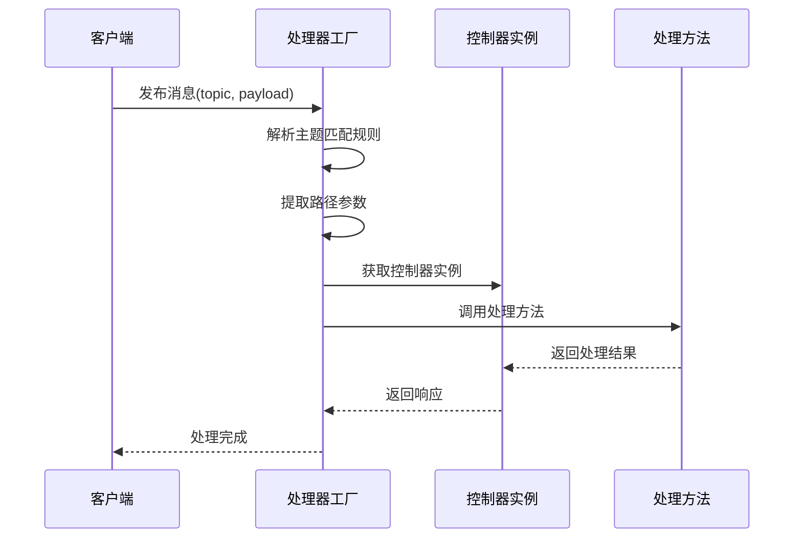
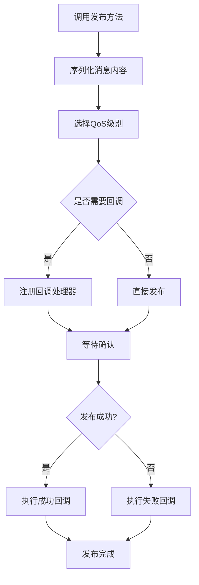
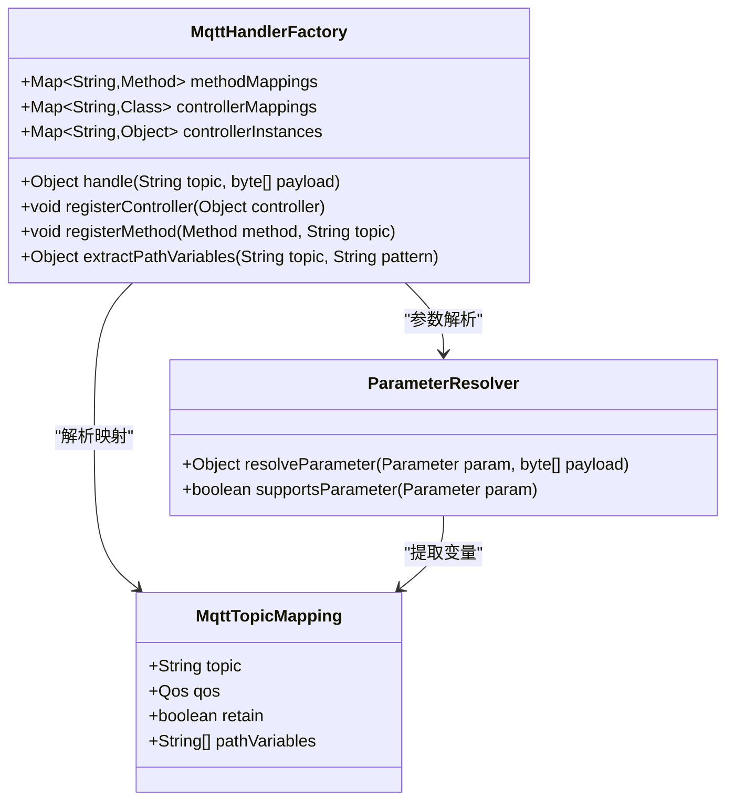
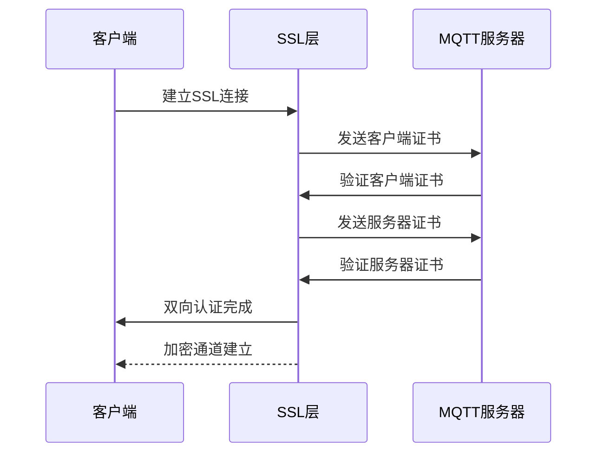
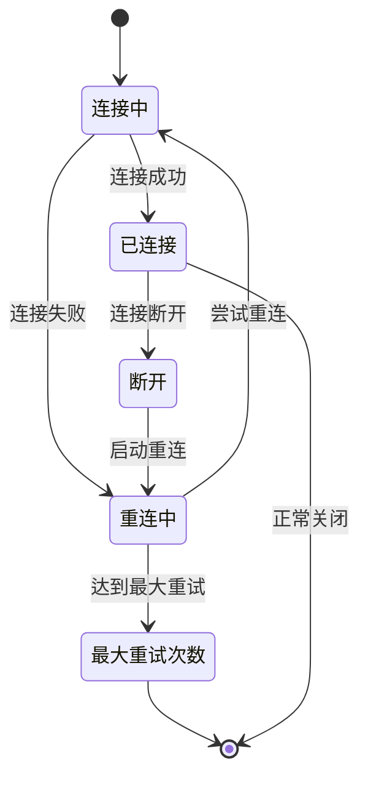
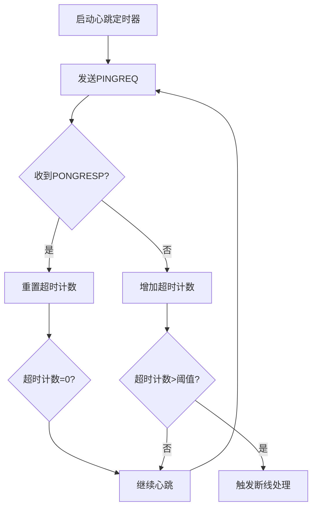
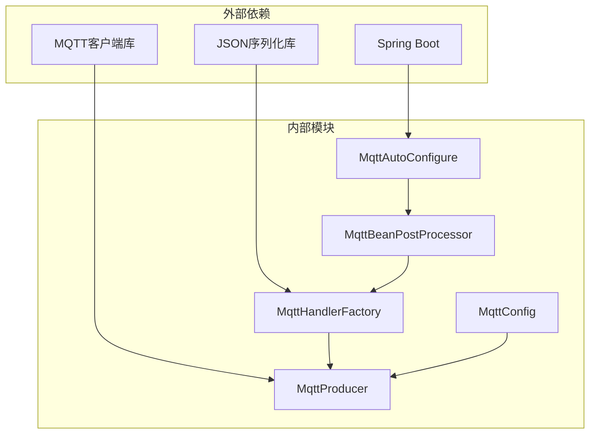

# MQTT消息模块（sh-mqtt）技术文档

<cite>
**本文档引用的文件**
- [MqttController.java](file://sh-mqtt/src/main/java/com/wkclz/mqtt/annotation/MqttController.java)
- [MqttTopicMapping.java](file://sh-mqtt/src/main/java/com/wkclz/mqtt/annotation/MqttTopicMapping.java)
- [MqttProducer.java](file://sh-mqtt/src/main/java/com/wkclz/mqtt/client/MqttProducer.java)
- [MqttHandlerFactory.java](file://sh-mqtt/src/main/java/com/wkclz/mqtt/handler/MqttHandlerFactory.java)
- [MqttConfig.java](file://sh-mqtt/src/main/java/com/wkclz/mqtt/config/MqttConfig.java)
- [MqttBeanPostProcessor.java](file://sh-mqtt/src/main/java/com/wkclz/mqtt/config/MqttBeanPostProcessor.java)
- [MqttApplicationListener.java](file://sh-mqtt/src/main/java/com/wkclz/mqtt/config/MqttApplicationListener.java)
- [MqttSubscribe.java](file://sh-mqtt/src/main/java/com/wkclz/mqtt/config/MqttSubscribe.java)
- [Qos.java](file://sh-mqtt/src/main/java/com/wkclz/mqtt/enums/Qos.java)
- [MqttMessage.java](file://sh-mqtt/src/main/java/com/wkclz/mqtt/remote/MqttMessage.java)
- [MqttResponse.java](file://sh-mqtt/src/main/java/com/wkclz/mqtt/remote/MqttResponse.java)
- [MqttHexMsg.java](file://sh-mqtt/src/main/java/com/wkclz/mqtt/bean/MqttHexMsg.java)
- [MqttAutoConfigure.java](file://sh-mqtt/src/main/java/com/wkclz/mqtt/MqttAutoConfigure.java)
- [MqttConsumerDemo.java](file://sh-mqtt/src/main/java/com/wkclz/mqtt/demo/MqttConsumerDemo.java)
- [MqttProducerDemo.java](file://sh-mqtt/src/main/java/com/wkclz/mqtt/demo/MqttProducerDemo.java)
- [README.md](file://sh-mqtt/README.md)
</cite>

## 目录
1. [简介](#简介)
2. [项目结构](#项目结构)
3. [核心组件](#核心组件)
4. [架构概览](#架构概览)
5. [详细组件分析](#详细组件分析)
6. [依赖关系分析](#依赖关系分析)
7. [性能考虑](#性能考虑)
8. [故障排除指南](#故障排除指南)
9. [结论](#结论)
10. [附录](#附录)

## 简介

sh-mqtt是基于Spring Boot的注解驱动MQTT消息处理框架，提供了完整的消息发布订阅解决方案。该模块通过自定义注解实现了声明式的消息处理，支持自动化的主题订阅管理、消息路由和参数绑定，同时具备完善的异常处理和性能优化机制。

该框架的核心特性包括：
- 注解驱动的消息处理模型
- 自动化的主题订阅和消息路由
- 完整的SSL/TLS安全认证支持
- 智能的断线重连和心跳机制
- 灵活的消息序列化和反序列化
- 丰富的QoS级别支持

## 项目结构

sh-mqtt模块采用标准的Spring Boot工程结构，主要包含以下核心包：

```mermaid
graph TB
subgraph "sh-mqtt模块结构"
A[annotation/] -- 注解定义
B[client/] -- 客户端实现
C[config/] -- 配置管理
D[handler/] -- 处理器工厂
E[remote/] -- 远程通信
F[enums/] -- 枚举定义
G[bean/] -- 数据模型
H[demo/] -- 示例代码
I[exception/] -- 异常处理
end
subgraph "核心配置"
J[MqttAutoConfigure.java]
K[spring-configuration-metadata.json]
L[AutoConfiguration.imports]
end
```

**图表来源**
- [MqttAutoConfigure.java](file://sh-mqtt/src/main/java/com/wkclz/mqtt/MqttAutoConfigure.java)
- [MqttConfig.java](file://sh-mqtt/src/main/java/com/wkclz/mqtt/config/MqttConfig.java)

**章节来源**
- [MqttAutoConfigure.java](file://sh-mqtt/src/main/java/com/wkclz/mqtt/MqttAutoConfigure.java)
- [MqttConfig.java](file://sh-mqtt/src/main/java/com/wkclz/mqtt/config/MqttConfig.java)

## 核心组件

### 注解驱动的消息处理框架

sh-mqtt通过两个核心注解实现了完全声明式的消息处理：

#### @MqttController 注解
用于标识消息控制器类，框架会自动扫描并注册这些控制器中的消息处理方法。

#### @MqttTopicMapping 注解
用于定义消息主题映射关系，支持通配符和参数化主题。

### 消息生产者 MqttProducer

提供消息发布的统一接口，支持多种QoS级别和异步回调处理。

### 处理器工厂 MqttHandlerFactory

负责消息的分发和处理，实现了消息到具体处理方法的映射。

**章节来源**
- [MqttController.java](file://sh-mqtt/src/main/java/com/wkclz/mqtt/annotation/MqttController.java)
- [MqttTopicMapping.java](file://sh-mqtt/src/main/java/com/wkclz/mqtt/annotation/MqttTopicMapping.java)
- [MqttProducer.java](file://sh-mqtt/src/main/java/com/wkclz/mqtt/client/MqttProducer.java)
- [MqttHandlerFactory.java](file://sh-mqtt/src/main/java/com/wkclz/mqtt/handler/MqttHandlerFactory.java)

## 架构概览

sh-mqtt的整体架构采用分层设计，从上到下分为应用层、配置层、处理层和客户端层：

```mermaid
graph TB
subgraph "应用层"
A[业务控制器<br/>@MqttController]
B[消息消费者<br/>@MqttTopicMapping]
end
subgraph "配置层"
C[MqttConfig<br/>配置管理]
D[MqttBeanPostProcessor<br/>后置处理器]
E[MqttApplicationListener<br/>应用监听器]
end
subgraph "处理层"
F[MqttHandlerFactory<br/>处理器工厂]
G[MqttSubscribe<br/>订阅管理]
end
subgraph "客户端层"
H[MqttProducer<br/>消息生产者]
I[底层MQTT客户端]
end
A --> F
B --> F
C --> D
D --> F
F --> G
G --> I
H --> I
```

**图表来源**
- [MqttHandlerFactory.java](file://sh-mqtt/src/main/java/com/wkclz/mqtt/handler/MqttHandlerFactory.java)
- [MqttBeanPostProcessor.java](file://sh-mqtt/src/main/java/com/wkclz/mqtt/config/MqttBeanPostProcessor.java)
- [MqttConfig.java](file://sh-mqtt/src/main/java/com/wkclz/mqtt/config/MqttConfig.java)

## 详细组件分析

### 注解系统设计

#### @MqttController 注解实现



**图表来源**
- [MqttController.java](file://sh-mqtt/src/main/java/com/wkclz/mqtt/annotation/MqttController.java)
- [MqttTopicMapping.java](file://sh-mqtt/src/main/java/com/wkclz/mqtt/annotation/MqttTopicMapping.java)
- [MqttHandlerFactory.java](file://sh-mqtt/src/main/java/com/wkclz/mqtt/handler/MqttHandlerFactory.java)

#### 主题映射和参数绑定

主题匹配采用层次化结构，支持通配符和参数提取：



**图表来源**
- [MqttHandlerFactory.java](file://sh-mqtt/src/main/java/com/wkclz/mqtt/handler/MqttHandlerFactory.java)
- [MqttTopicMapping.java](file://sh-mqtt/src/main/java/com/wkclz/mqtt/annotation/MqttTopicMapping.java)

**章节来源**
- [MqttController.java](file://sh-mqtt/src/main/java/com/wkclz/mqtt/annotation/MqttController.java)
- [MqttTopicMapping.java](file://sh-mqtt/src/main/java/com/wkclz/mqtt/annotation/MqttTopicMapping.java)
- [MqttHandlerFactory.java](file://sh-mqtt/src/main/java/com/wkclz/mqtt/handler/MqttHandlerFactory.java)

### 消息生产者发布机制

#### 发布流程设计



**图表来源**
- [MqttProducer.java](file://sh-mqtt/src/main/java/com/wkclz/mqtt/client/MqttProducer.java)
- [Qos.java](file://sh-mqtt/src/main/java/com/wkclz/mqtt/enums/Qos.java)

#### QoS级别支持

消息发布支持三种QoS级别：
- QoS 0：最多一次传递
- QoS 1：至少一次传递  
- QoS 2：恰好一次传递

**章节来源**
- [MqttProducer.java](file://sh-mqtt/src/main/java/com/wkclz/mqtt/client/MqttProducer.java)
- [Qos.java](file://sh-mqtt/src/main/java/com/wkclz/mqtt/enums/Qos.java)

### 处理器工厂设计模式

#### 消息分发机制



**图表来源**
- [MqttHandlerFactory.java](file://sh-mqtt/src/main/java/com/wkclz/mqtt/handler/MqttHandlerFactory.java)
- [MqttTopicMapping.java](file://sh-mqtt/src/main/java/com/wkclz/mqtt/annotation/MqttTopicMapping.java)

**章节来源**
- [MqttHandlerFactory.java](file://sh-mqtt/src/main/java/com/wkclz/mqtt/handler/MqttHandlerFactory.java)

### SSL/TLS安全认证实现

#### 认证流程设计



**图表来源**
- [MqttConfig.java](file://sh-mqtt/src/main/java/com/wkclz/mqtt/config/MqttConfig.java)

#### 证书配置管理

支持多种证书配置方式：
- PEM格式证书文件
- JKS密钥库文件
- 环境变量配置
- 运行时动态配置

**章节来源**
- [MqttConfig.java](file://sh-mqtt/src/main/java/com/wkclz/mqtt/config/MqttConfig.java)

### 断线重连策略

#### 重连机制设计



**图表来源**
- [MqttConfig.java](file://sh-mqtt/src/main/java/com/wkclz/mqtt/config/MqttConfig.java)

#### 心跳机制实现



**图表来源**
- [MqttConfig.java](file://sh-mqtt/src/main/java/com/wkclz/mqtt/config/MqttConfig.java)

**章节来源**
- [MqttConfig.java](file://sh-mqtt/src/main/java/com/wkclz/mqtt/config/MqttConfig.java)

## 依赖关系分析

### 组件依赖图



**图表来源**
- [MqttAutoConfigure.java](file://sh-mqtt/src/main/java/com/wkclz/mqtt/MqttAutoConfigure.java)
- [MqttBeanPostProcessor.java](file://sh-mqtt/src/main/java/com/wkclz/mqtt/config/MqttBeanPostProcessor.java)

### 关键依赖关系

- MqttAutoConfigure依赖Spring Boot自动配置机制
- MqttBeanPostProcessor在Bean生命周期中进行消息处理方法注册
- MqttHandlerFactory依赖反射机制动态调用处理方法
- MqttProducer依赖底层MQTT客户端库实现消息传输

**章节来源**
- [MqttAutoConfigure.java](file://sh-mqtt/src/main/java/com/wkclz/mqtt/MqttAutoConfigure.java)
- [MqttBeanPostProcessor.java](file://sh-mqtt/src/main/java/com/wkclz/mqtt/config/MqttBeanPostProcessor.java)

## 性能考虑

### 优化策略

1. **连接池管理**：复用MQTT连接，减少连接建立开销
2. **消息批处理**：支持批量消息发布，提高吞吐量
3. **异步处理**：采用异步非阻塞I/O模型
4. **内存管理**：合理使用对象池，减少GC压力
5. **网络优化**：智能的心跳间隔和重连策略

### 性能监控指标

- 连接建立时间
- 消息发布延迟
- 处理吞吐量
- 内存使用情况
- 错误率统计

## 故障排除指南

### 常见问题及解决方案

#### 连接问题
- **症状**：无法建立MQTT连接
- **原因**：网络配置错误、认证失败、服务器不可达
- **解决**：检查连接参数、验证证书配置、确认服务器状态

#### 认证失败
- **症状**：连接被拒绝或认证错误
- **原因**：证书不匹配、用户名密码错误、权限不足
- **解决**：验证证书有效性、检查凭据正确性、确认权限配置

#### 消息丢失
- **症状**：部分消息未到达目标
- **原因**：网络中断、QoS级别过低、缓冲区溢出
- **解决**：调整QoS级别、增加缓冲区大小、优化网络质量

**章节来源**
- [MqttConfig.java](file://sh-mqtt/src/main/java/com/wkclz/mqtt/config/MqttConfig.java)

## 结论

sh-mqtt消息模块提供了一个功能完整、性能优异的MQTT消息处理解决方案。通过注解驱动的设计理念，开发者可以以最少的代码实现复杂的发布订阅功能。模块具有良好的扩展性和稳定性，适合在各种应用场景中使用。

主要优势包括：
- 简洁的注解语法，降低开发复杂度
- 完善的异常处理和错误恢复机制
- 灵活的配置选项和部署方式
- 优秀的性能表现和资源利用率

## 附录

### 配置参数说明

| 参数名称 | 类型 | 默认值 | 描述 |
|---------|------|--------|------|
| mqtt.broker | String | | MQTT服务器地址 |
| mqtt.username | String | | 用户名 |
| mqtt.password | String | | 密码 |
| mqtt.client-id | String | | 客户端ID |
| mqtt.qos | Integer | 1 | 默认QoS级别 |
| mqtt.clean-session | Boolean | true | 清理会话标志 |
| mqtt.keep-alive | Integer | 30 | 心跳间隔(秒) |
| mqtt.connection-timeout | Integer | 30 | 连接超时(秒) |

### 使用示例

完整的消息发布订阅示例如下：

```java
// 消息生产者使用
@RestController
public class MessageProducer {
    @Autowired
    private MqttProducer mqttProducer;
    
    @PostMapping("/publish")
    public ResponseEntity<String> publishMessage(@RequestBody PublishRequest request) {
        mqttProducer.publish(request.getTopic(), request.getMessage());
        return ResponseEntity.ok("消息已发布");
    }
}

// 消息消费者使用
@Controller
@MqttController
public class MessageConsumer {
    
    @MqttTopicMapping(topic = "device/#", qos = Qos.AT_LEAST_ONCE)
    public String handleDeviceMessage(String deviceId, String message) {
        // 处理设备消息
        return "处理完成";
    }
}
```

**章节来源**
- [MqttProducerDemo.java](file://sh-mqtt/src/main/java/com/wkclz/mqtt/demo/MqttProducerDemo.java)
- [MqttConsumerDemo.java](file://sh-mqtt/src/main/java/com/wkclz/mqtt/demo/MqttConsumerDemo.java)