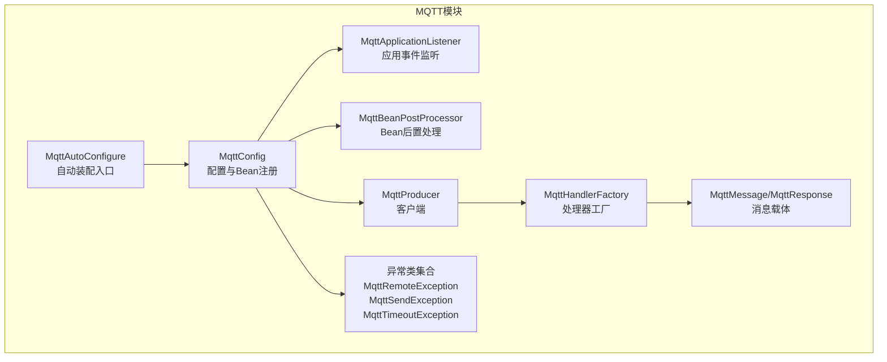
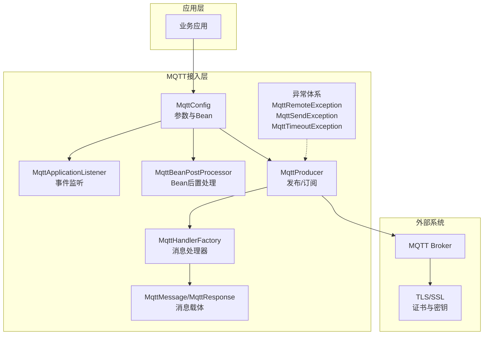
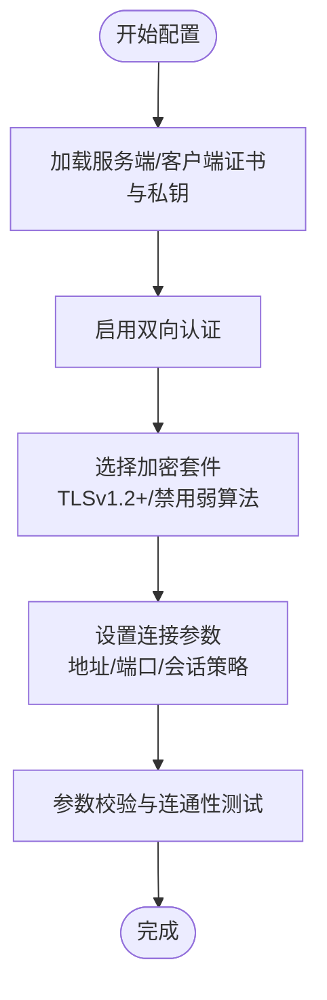
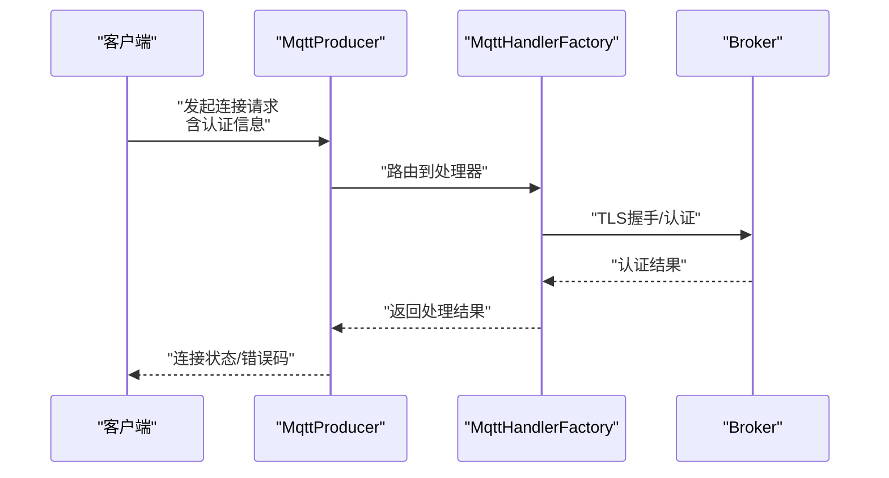
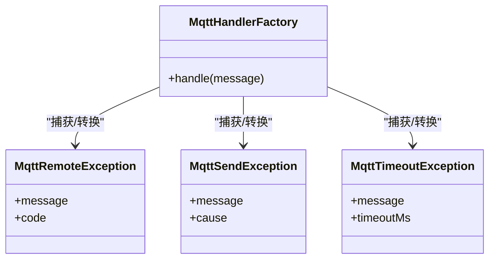
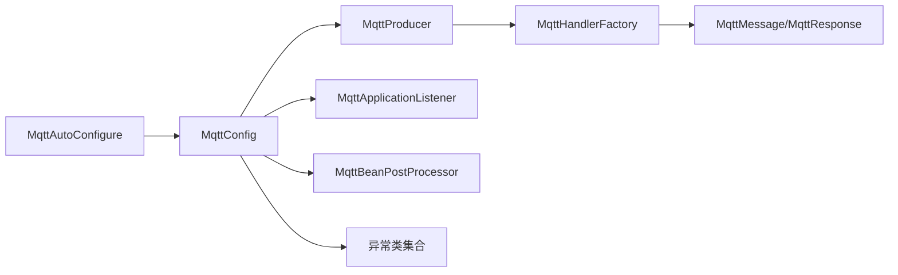

# 安全认证机制

<cite>
**本文引用的文件**
- [MqttConfig.java](file://sh-mqtt/src/main/java/com/wkclz/mqtt/config/MqttConfig.java)
- [MqttApplicationListener.java](file://sh-mqtt/src/main/java/com/wkclz/mqtt/config/MqttApplicationListener.java)
- [MqttBeanPostProcessor.java](file://sh-mqtt/src/main/java/com/wkclz/mqtt/config/MqttBeanPostProcessor.java)
- [MqttRemoteException.java](file://sh-mqtt/src/main/java/com/wkclz/mqtt/exception/MqttRemoteException.java)
- [MqttSendException.java](file://sh-mqtt/src/main/java/com/wkclz/mqtt/exception/MqttSendException.java)
- [MqttTimeoutException.java](file://sh-mqtt/src/main/java/com/wkclz/mqtt/exception/MqttTimeoutException.java)
- [MqttProducer.java](file://sh-mqtt/src/main/java/com/wkclz/mqtt/client/MqttProducer.java)
- [MqttHandlerFactory.java](file://sh-mqtt/src/main/java/com/wkclz/mqtt/handler/MqttHandlerFactory.java)
- [MqttMessage.java](file://sh-mqtt/src/main/java/com/wkclz/mqtt/remote/MqttMessage.java)
- [MqttResponse.java](file://sh-mqtt/src/main/java/com/wkclz/mqtt/remote/MqttResponse.java)
- [MqttAutoConfigure.java](file://sh-mqtt/src/main/java/com/wkclz/mqtt/MqttAutoConfigure.java)
- [README.md](file://sh-mqtt/README.md)
- [spring-configuration-metadata.json](file://sh-mqtt/src/main/resources/META-INF/spring-configuration-metadata.json)
</cite>

## 目录
1. [引言](#引言)
2. [项目结构](#项目结构)
3. [核心组件](#核心组件)
4. [架构总览](#架构总览)
5. [详细组件分析](#详细组件分析)
6. [依赖关系分析](#依赖关系分析)
7. [性能考虑](#性能考虑)
8. [故障排查指南](#故障排查指南)
9. [结论](#结论)
10. [附录](#附录)

## 引言
本文件聚焦于MQTT安全认证机制的技术文档，围绕SSL/TLS认证配置、连接认证流程（用户名密码、Token、证书）、异常处理模型、连接保护策略以及安全最佳实践展开。通过对sh-mqtt模块的配置类、异常类、客户端与处理器等关键组件进行系统性分析，帮助读者在生产环境中构建稳定、安全的MQTT通信通道。

## 项目结构
sh-mqtt模块采用按职责分层的组织方式：配置与自动装配位于config包，异常类型集中在exception包，客户端与消息载体位于client与remote包，处理器工厂位于handler包，注解与枚举分别在annotation与enums包中。整体遵循Spring Boot自动装配约定，通过MqttAutoConfigure完成条件化装配。

**图表来源**
- [MqttAutoConfigure.java](file://sh-mqtt/src/main/java/com/wkclz/mqtt/MqttAutoConfigure.java)
- [MqttConfig.java](file://sh-mqtt/src/main/java/com/wkclz/mqtt/config/MqttConfig.java)
- [MqttApplicationListener.java](file://sh-mqtt/src/main/java/com/wkclz/mqtt/config/MqttApplicationListener.java)
- [MqttBeanPostProcessor.java](file://sh-mqtt/src/main/java/com/wkclz/mqtt/config/MqttBeanPostProcessor.java)
- [MqttProducer.java](file://sh-mqtt/src/main/java/com/wkclz/mqtt/client/MqttProducer.java)
- [MqttHandlerFactory.java](file://sh-mqtt/src/main/java/com/wkclz/mqtt/handler/MqttHandlerFactory.java)
- [MqttMessage.java](file://sh-mqtt/src/main/java/com/wkclz/mqtt/remote/MqttMessage.java)
- [MqttResponse.java](file://sh-mqtt/src/main/java/com/wkclz/mqtt/remote/MqttResponse.java)

**章节来源**
- [MqttAutoConfigure.java](file://sh-mqtt/src/main/java/com/wkclz/mqtt/MqttAutoConfigure.java)
- [MqttConfig.java](file://sh-mqtt/src/main/java/com/wkclz/mqtt/config/MqttConfig.java)

## 核心组件
- 配置与自动装配：MqttAutoConfigure负责条件化装配；MqttConfig集中管理连接参数、认证信息与Bean注册；MqttApplicationListener用于监听应用生命周期事件；MqttBeanPostProcessor提供Bean级别的后置处理能力。
- 客户端与消息：MqttProducer封装发布/订阅操作；MqttMessage与MqttResponse承载消息载荷与响应结构。
- 异常体系：MqttRemoteException（远端异常）、MqttSendException（发送异常）、MqttTimeoutException（超时异常）构成MQTT通信中的异常分类处理基础。
- 处理器工厂：MqttHandlerFactory根据消息类型或主题路由到具体处理器，便于扩展与维护。

**章节来源**
- [MqttConfig.java](file://sh-mqtt/src/main/java/com/wkclz/mqtt/config/MqttConfig.java)
- [MqttApplicationListener.java](file://sh-mqtt/src/main/java/com/wkclz/mqtt/config/MqttApplicationListener.java)
- [MqttBeanPostProcessor.java](file://sh-mqtt/src/main/java/com/wkclz/mqtt/config/MqttBeanPostProcessor.java)
- [MqttProducer.java](file://sh-mqtt/src/main/java/com/wkclz/mqtt/client/MqttProducer.java)
- [MqttHandlerFactory.java](file://sh-mqtt/src/main/java/com/wkclz/mqtt/handler/MqttHandlerFactory.java)
- [MqttMessage.java](file://sh-mqtt/src/main/java/com/wkclz/mqtt/remote/MqttMessage.java)
- [MqttResponse.java](file://sh-mqtt/src/main/java/com/wkclz/mqtt/remote/MqttResponse.java)
- [MqttRemoteException.java](file://sh-mqtt/src/main/java/com/wkclz/mqtt/exception/MqttRemoteException.java)
- [MqttSendException.java](file://sh-mqtt/src/main/java/com/wkclz/mqtt/exception/MqttSendException.java)
- [MqttTimeoutException.java](file://sh-mqtt/src/main/java/com/wkclz/mqtt/exception/MqttTimeoutException.java)

## 架构总览
下图展示了MQTT安全认证在系统中的位置与交互关系：配置层负责参数注入与Bean创建，客户端层执行连接与消息收发，异常层提供统一的错误语义，处理器层负责消息分发与业务处理。

**图表来源**
- [MqttConfig.java](file://sh-mqtt/src/main/java/com/wkclz/mqtt/config/MqttConfig.java)
- [MqttApplicationListener.java](file://sh-mqtt/src/main/java/com/wkclz/mqtt/config/MqttApplicationListener.java)
- [MqttBeanPostProcessor.java](file://sh-mqtt/src/main/java/com/wkclz/mqtt/config/MqttBeanPostProcessor.java)
- [MqttProducer.java](file://sh-mqtt/src/main/java/com/wkclz/mqtt/client/MqttProducer.java)
- [MqttHandlerFactory.java](file://sh-mqtt/src/main/java/com/wkclz/mqtt/handler/MqttHandlerFactory.java)
- [MqttMessage.java](file://sh-mqtt/src/main/java/com/wkclz/mqtt/remote/MqttMessage.java)
- [MqttResponse.java](file://sh-mqtt/src/main/java/com/wkclz/mqtt/remote/MqttResponse.java)
- [MqttRemoteException.java](file://sh-mqtt/src/main/java/com/wkclz/mqtt/exception/MqttRemoteException.java)
- [MqttSendException.java](file://sh-mqtt/src/main/java/com/wkclz/mqtt/exception/MqttSendException.java)
- [MqttTimeoutException.java](file://sh-mqtt/src/main/java/com/wkclz/mqtt/exception/MqttTimeoutException.java)

## 详细组件分析

### SSL/TLS认证与配置
- 证书加载与密钥管理：配置类应支持服务端证书链、客户端证书与私钥的加载路径或资源引用，确保Broker端TLS握手可用。建议通过环境变量或配置文件注入证书路径与密钥口令，避免明文存储。
- 双向认证：启用客户端证书校验，要求Broker对客户端进行身份鉴别，降低中间人攻击风险。
- 加密套件选择：优先使用现代TLS版本（如TLSv1.2+），禁用弱加密套件与过时协议，结合安全基线策略统一配置。
- 连接参数：在配置类中集中管理服务器地址、端口、会话保持、清空会话标志等参数，确保与TLS配置一致。

**图表来源**
- [MqttConfig.java](file://sh-mqtt/src/main/java/com/wkclz/mqtt/config/MqttConfig.java)

**章节来源**
- [MqttConfig.java](file://sh-mqtt/src/main/java/com/wkclz/mqtt/config/MqttConfig.java)

### 连接认证流程
- 用户名密码验证：在连接建立前，客户端携带用户名与密码；Broker端进行凭据校验，失败则拒绝连接。
- Token认证：客户端在连接时携带令牌，Broker端验证令牌有效性与权限范围，通过后允许建立会话。
- 证书认证：基于TLS证书链进行双向认证，Broker验证客户端证书的有效性与信任链，确保端到端加密与身份可信。

**图表来源**
- [MqttProducer.java](file://sh-mqtt/src/main/java/com/wkclz/mqtt/client/MqttProducer.java)
- [MqttHandlerFactory.java](file://sh-mqtt/src/main/java/com/wkclz/mqtt/handler/MqttHandlerFactory.java)
- [MqttMessage.java](file://sh-mqtt/src/main/java/com/wkclz/mqtt/remote/MqttMessage.java)
- [MqttResponse.java](file://sh-mqtt/src/main/java/com/wkclz/mqtt/remote/MqttResponse.java)

**章节来源**
- [MqttProducer.java](file://sh-mqtt/src/main/java/com/wkclz/mqtt/client/MqttProducer.java)
- [MqttHandlerFactory.java](file://sh-mqtt/src/main/java/com/wkclz/mqtt/handler/MqttHandlerFactory.java)
- [MqttMessage.java](file://sh-mqtt/src/main/java/com/wkclz/mqtt/remote/MqttMessage.java)
- [MqttResponse.java](file://sh-mqtt/src/main/java/com/wkclz/mqtt/remote/MqttResponse.java)

### 异常处理机制
- MqttRemoteException：远端异常，通常由Broker端返回的错误码或异常信息触发，需区分网络错误与业务错误，避免误判。
- MqttSendException：发送异常，表示消息未能成功投递至Broker，可能由网络抖动、缓冲区满或权限不足导致。
- MqttTimeoutException：超时异常，连接或等待响应超时，需结合心跳与重试策略进行处理。
- 建议：在处理器中对三类异常进行分类记录与上报，区分可恢复与不可恢复错误，配合熔断与退避策略提升稳定性。

**图表来源**
- [MqttRemoteException.java](file://sh-mqtt/src/main/java/com/wkclz/mqtt/exception/MqttRemoteException.java)
- [MqttSendException.java](file://sh-mqtt/src/main/java/com/wkclz/mqtt/exception/MqttSendException.java)
- [MqttTimeoutException.java](file://sh-mqtt/src/main/java/com/wkclz/mqtt/exception/MqttTimeoutException.java)
- [MqttHandlerFactory.java](file://sh-mqtt/src/main/java/com/wkclz/mqtt/handler/MqttHandlerFactory.java)

**章节来源**
- [MqttRemoteException.java](file://sh-mqtt/src/main/java/com/wkclz/mqtt/exception/MqttRemoteException.java)
- [MqttSendException.java](file://sh-mqtt/src/main/java/com/wkclz/mqtt/exception/MqttSendException.java)
- [MqttTimeoutException.java](file://sh-mqtt/src/main/java/com/wkclz/mqtt/exception/MqttTimeoutException.java)
- [MqttHandlerFactory.java](file://sh-mqtt/src/main/java/com/wkclz/mqtt/handler/MqttHandlerFactory.java)

### 连接保护策略
- 心跳检测：通过KeepAlive参数维持TCP活跃性，定期发送PINGREQ/PINGRESP，及时发现半连接与网络中断。
- 超时配置：合理设置连接超时、命令超时与会话过期间隔，避免资源泄露与堆积。
- 优雅断开：在关闭前先取消订阅、释放资源，再断开连接，确保状态一致性与可观测性。
- 断线重连：结合指数退避与最大重试次数，避免雪崩效应；在重连过程中记录事件以便审计。

**章节来源**
- [MqttConfig.java](file://sh-mqtt/src/main/java/com/wkclz/mqtt/config/MqttConfig.java)
- [MqttProducer.java](file://sh-mqtt/src/main/java/com/wkclz/mqtt/client/MqttProducer.java)

### 安全配置最佳实践
- 证书更新：采用滚动更新策略，先部署新证书，再切换生效，最后清理旧证书与密钥备份。
- 密钥轮换：定期更换私钥与证书链，限制有效期，启用OCSP Stapling以减少在线验证延迟。
- 安全审计：记录认证事件、异常日志与重连统计，保留至少90天以上以便追溯。
- 最小权限原则：为不同客户端分配最小必要主题权限，结合ACL与用户角色管理。
- 网络隔离：Broker置于内网或专用子网，仅开放必要端口，配合防火墙与WAF策略。

**章节来源**
- [MqttConfig.java](file://sh-mqtt/src/main/java/com/wkclz/mqtt/config/MqttConfig.java)
- [MqttApplicationListener.java](file://sh-mqtt/src/main/java/com/wkclz/mqtt/config/MqttApplicationListener.java)

## 依赖关系分析
- 自动装配依赖：MqttAutoConfigure作为入口，依赖MqttConfig完成Bean注册与参数绑定。
- 运行时依赖：MqttProducer依赖MqttHandlerFactory进行消息路由，MqttHandlerFactory依赖MqttMessage/MqttResponse进行数据编解码。
- 异常依赖：异常类独立存在，被处理器与客户端在运行时捕获与传播。

**图表来源**
- [MqttAutoConfigure.java](file://sh-mqtt/src/main/java/com/wkclz/mqtt/MqttAutoConfigure.java)
- [MqttConfig.java](file://sh-mqtt/src/main/java/com/wkclz/mqtt/config/MqttConfig.java)
- [MqttProducer.java](file://sh-mqtt/src/main/java/com/wkclz/mqtt/client/MqttProducer.java)
- [MqttHandlerFactory.java](file://sh-mqtt/src/main/java/com/wkclz/mqtt/handler/MqttHandlerFactory.java)
- [MqttMessage.java](file://sh-mqtt/src/main/java/com/wkclz/mqtt/remote/MqttMessage.java)
- [MqttResponse.java](file://sh-mqtt/src/main/java/com/wkclz/mqtt/remote/MqttResponse.java)

**章节来源**
- [MqttAutoConfigure.java](file://sh-mqtt/src/main/java/com/wkclz/mqtt/MqttAutoConfigure.java)
- [MqttConfig.java](file://sh-mqtt/src/main/java/com/wkclz/mqtt/config/MqttConfig.java)

## 性能考虑
- 连接池与复用：在高并发场景下，建议复用连接并限制最大连接数，避免频繁建连/断连带来的CPU与内存压力。
- 消息批量化：对高频发布场景，采用批量发送与压缩策略，降低网络开销。
- 超时与背压：合理设置超时阈值与队列长度，防止阻塞扩散；在消费者端实现背压控制，避免内存溢出。
- TLS优化：启用会话复用与ALPN协议，减少握手开销；选择硬件加速的加密套件以提升吞吐量。

## 故障排查指南
- 认证失败
  - 检查证书链完整性与信任根是否正确配置。
  - 确认客户端私钥与证书匹配，且未过期。
  - 排查用户名/密码或Token是否正确下发。
- 发送异常
  - 观察Broker端是否返回限流或权限拒绝。
  - 检查本地网络与防火墙策略，确认端口可达。
- 超时异常
  - 提升KeepAlive与超时阈值，观察网络RTT变化。
  - 分析是否存在Broker端积压或GC停顿。
- 日志与监控
  - 启用详细日志级别，定位异常堆栈与时间戳。
  - 结合指标（连接数、消息速率、错误率）进行根因分析。

**章节来源**
- [MqttRemoteException.java](file://sh-mqtt/src/main/java/com/wkclz/mqtt/exception/MqttRemoteException.java)
- [MqttSendException.java](file://sh-mqtt/src/main/java/com/wkclz/mqtt/exception/MqttSendException.java)
- [MqttTimeoutException.java](file://sh-mqtt/src/main/java/com/wkclz/mqtt/exception/MqttTimeoutException.java)
- [MqttProducer.java](file://sh-mqtt/src/main/java/com/wkclz/mqtt/client/MqttProducer.java)

## 结论
通过将SSL/TLS认证、连接认证与异常处理体系有机结合，sh-mqtt模块为生产级MQTT通信提供了安全与稳定的基础设施。遵循本文的最佳实践与排障方法，可在保证性能的同时显著降低安全风险与运维成本。

## 附录
- 配置项参考（来源于配置元数据）
  - 服务器地址与端口：用于指定Broker连接目标。
  - TLS相关参数：证书路径、私钥口令、信任根与加密套件列表。
  - 认证参数：用户名/密码、Token、客户端证书与私钥。
  - 连接与会话：KeepAlive、超时、清空会话标志、会话过期策略。
  - 其他：QoS等级、主题过滤与消息大小限制。

**章节来源**
- [spring-configuration-metadata.json](file://sh-mqtt/src/main/resources/META-INF/spring-configuration-metadata.json)
- [README.md](file://sh-mqtt/README.md)