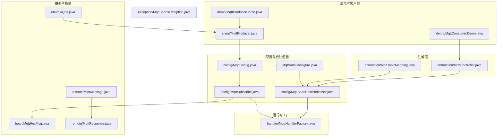
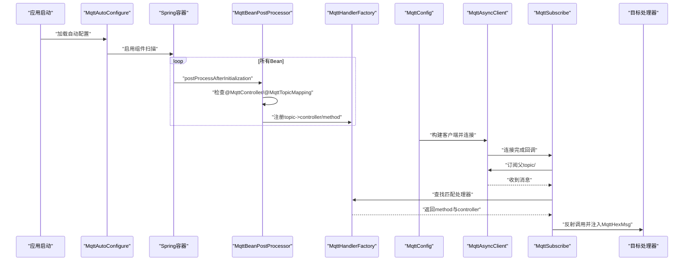
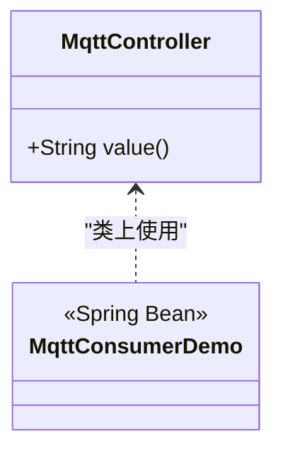
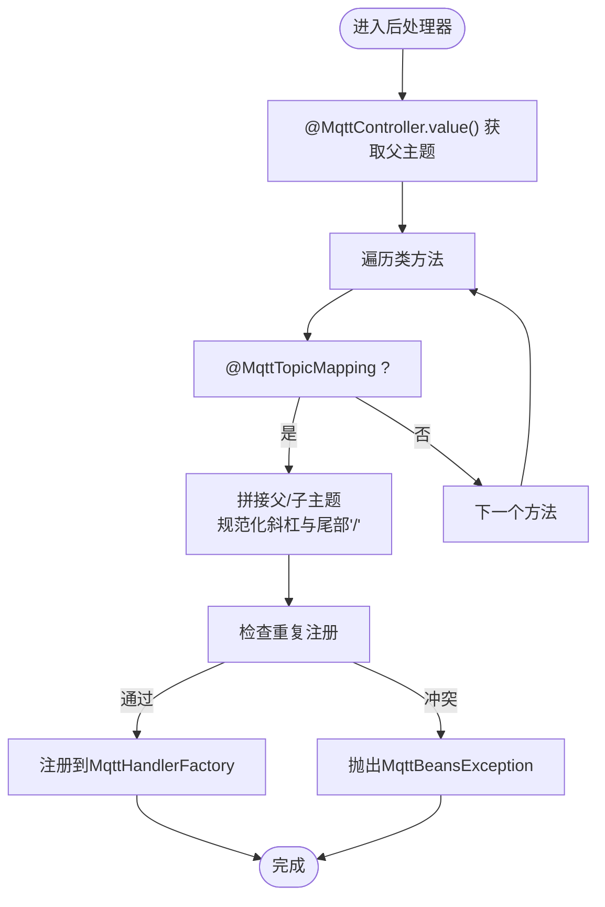
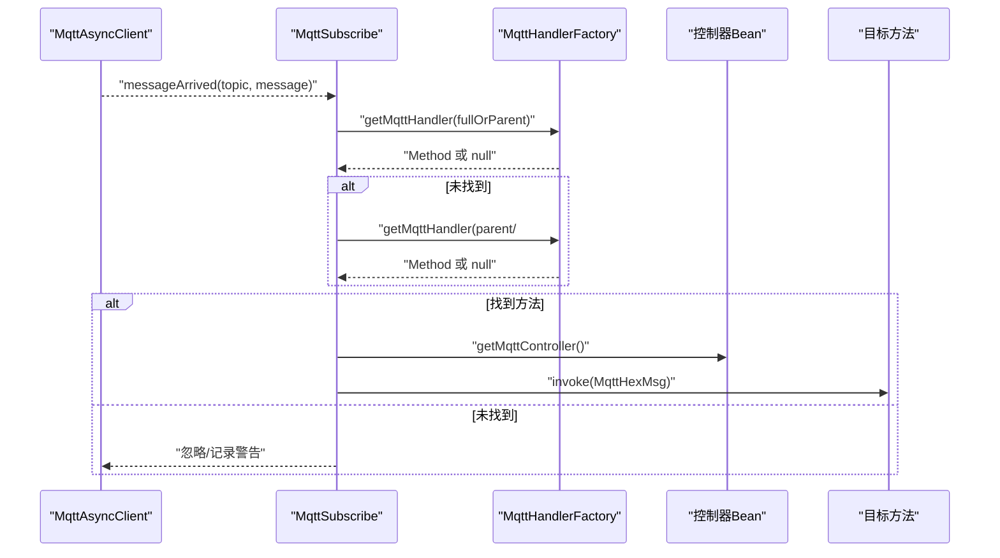
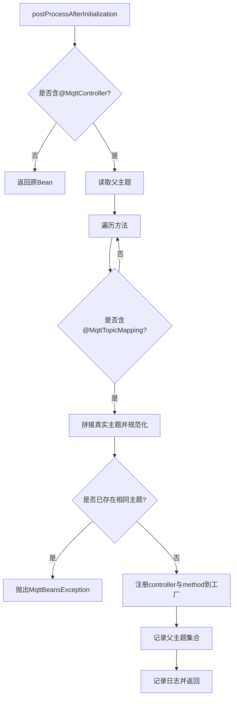
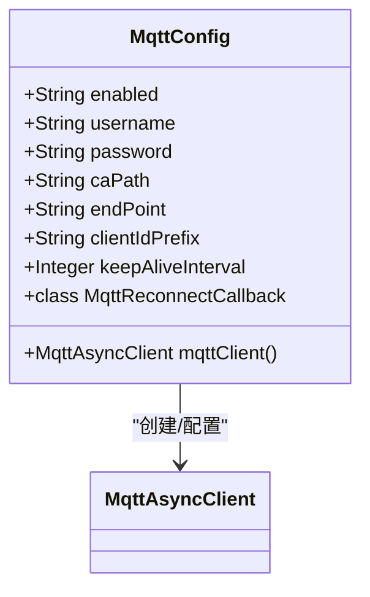
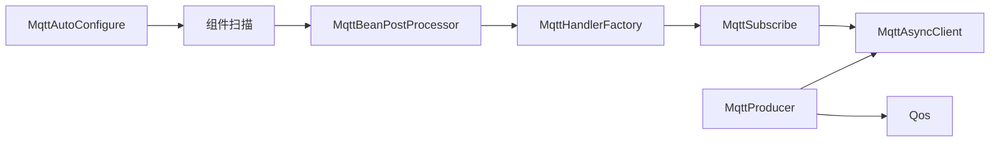

# 注解驱动框架

<cite>
**本文引用的文件**
- [MqttController.java](file://sh-mqtt/src/main/java/com/wkclz/mqtt/annotation/MqttController.java)
- [MqttTopicMapping.java](file://sh-mqtt/src/main/java/com/wkclz/mqtt/annotation/MqttTopicMapping.java)
- [MqttBeanPostProcessor.java](file://sh-mqtt/src/main/java/com/wkclz/mqtt/config/MqttBeanPostProcessor.java)
- [MqttSubscribe.java](file://sh-mqtt/src/main/java/com/wkclz/mqtt/config/MqttSubscribe.java)
- [MqttHandlerFactory.java](file://sh-mqtt/src/main/java/com/wkclz/mqtt/handler/MqttHandlerFactory.java)
- [MqttConfig.java](file://sh-mqtt/src/main/java/com/wkclz/mqtt/config/MqttConfig.java)
- [MqttAutoConfigure.java](file://sh-mqtt/src/main/java/com/wkclz/mqtt/MqttAutoConfigure.java)
- [MqttConsumerDemo.java](file://sh-mqtt/src/main/java/com/wkclz/mqtt/demo/MqttConsumerDemo.java)
- [MqttProducerDemo.java](file://sh-mqtt/src/main/java/com/wkclz/mqtt/demo/MqttProducerDemo.java)
- [Qos.java](file://sh-mqtt/src/main/java/com/wkclz/mqtt/enums/Qos.java)
- [MqttHexMsg.java](file://sh-mqtt/src/main/java/com/wkclz/mqtt/bean/MqttHexMsg.java)
- [MqttBeansException.java](file://sh-mqtt/src/main/java/com/wkclz/mqtt/exception/MqttBeansException.java)
- [MqttProducer.java](file://sh-mqtt/src/main/java/com/wkclz/mqtt/client/MqttProducer.java)
- [MqttMessage.java](file://sh-mqtt/src/main/java/com/wkclz/mqtt/remote/MqttMessage.java)
- [MqttResponse.java](file://sh-mqtt/src/main/java/com/wkclz/mqtt/remote/MqttResponse.java)
- [org.springframework.boot.autoconfigure.AutoConfiguration.imports](file://sh-mqtt/src/main/resources/META-INF/spring/org.springframework.boot.autoconfigure.AutoConfiguration.imports)
- [pom.xml](file://sh-mqtt/pom.xml)
</cite>

## 目录
1. [引言](#引言)
2. [项目结构](#项目结构)
3. [核心组件](#核心组件)
4. [架构总览](#架构总览)
5. [详细组件分析](#详细组件分析)
6. [依赖分析](#依赖分析)
7. [性能考虑](#性能考虑)
8. [故障排查指南](#故障排查指南)
9. [结论](#结论)
10. [附录：注解使用示例与最佳实践](#附录注解使用示例与最佳实践)

## 引言
本文件面向MQTT注解驱动框架，系统性阐述注解驱动的消息订阅与处理机制，重点覆盖以下方面：
- @MqttController 的控制器定义机制：类级别监听声明、自动扫描注册与生命周期管理
- @MqttTopicMapping 的主题映射实现：通配符支持、参数注入、类型约束与验证
- MqttSubscribe 的订阅配置：主题列表管理、QoS设置与回调绑定
- MqttBeanPostProcessor 后处理器：Bean扫描、注解解析与处理器注册流程
- 实战示例与最佳实践：错误处理、调试技巧与常见问题定位

## 项目结构
MQTT模块采用按功能域划分的包结构，核心注解、配置、处理器与工厂位于独立包内，并通过自动装配入口对外暴露。



图表来源
- [MqttController.java:1-25](file://sh-mqtt/src/main/java/com/wkclz/mqtt/annotation/MqttController.java#L1-L25)
- [MqttTopicMapping.java:1-21](file://sh-mqtt/src/main/java/com/wkclz/mqtt/annotation/MqttTopicMapping.java#L1-L21)
- [MqttBeanPostProcessor.java:1-64](file://sh-mqtt/src/main/java/com/wkclz/mqtt/config/MqttBeanPostProcessor.java#L1-L64)
- [MqttSubscribe.java:1-96](file://sh-mqtt/src/main/java/com/wkclz/mqtt/config/MqttSubscribe.java#L1-L96)
- [MqttHandlerFactory.java:1-73](file://sh-mqtt/src/main/java/com/wkclz/mqtt/handler/MqttHandlerFactory.java#L1-L73)
- [MqttConfig.java:1-256](file://sh-mqtt/src/main/java/com/wkclz/mqtt/config/MqttConfig.java#L1-L256)
- [MqttAutoConfigure.java:1-12](file://sh-mqtt/src/main/java/com/wkclz/mqtt/MqttAutoConfigure.java#L1-L12)
- [MqttConsumerDemo.java:1-22](file://sh-mqtt/src/main/java/com/wkclz/mqtt/demo/MqttConsumerDemo.java#L1-L22)
- [MqttProducerDemo.java:1-36](file://sh-mqtt/src/main/java/com/wkclz/mqtt/demo/MqttProducerDemo.java#L1-L36)
- [MqttProducer.java:1-137](file://sh-mqtt/src/main/java/com/wkclz/mqtt/client/MqttProducer.java#L1-L137)
- [MqttHexMsg.java:1-60](file://sh-mqtt/src/main/java/com/wkclz/mqtt/bean/MqttHexMsg.java#L1-L60)
- [Qos.java:1-42](file://sh-mqtt/src/main/java/com/wkclz/mqtt/enums/Qos.java#L1-L42)
- [MqttMessage.java:1-46](file://sh-mqtt/src/main/java/com/wkclz/mqtt/remote/MqttMessage.java#L1-L46)
- [MqttResponse.java:1-44](file://sh-mqtt/src/main/java/com/wkclz/mqtt/remote/MqttResponse.java#L1-L44)
- [MqttBeansException.java:1-24](file://sh-mqtt/src/main/java/com/wkclz/mqtt/exception/MqttBeansException.java#L1-L24)

章节来源
- [MqttAutoConfigure.java:1-12](file://sh-mqtt/src/main/java/com/wkclz/mqtt/MqttAutoConfigure.java#L1-L12)
- [org.springframework.boot.autoconfigure.AutoConfiguration.imports:1-1](file://sh-mqtt/src/main/resources/META-INF/spring/org.springframework.boot.autoconfigure.AutoConfiguration.imports#L1-L1)

## 核心组件
- 注解层：@MqttController 与 @MqttTopicMapping 提供声明式订阅能力
- 后处理器：MqttBeanPostProcessor 在Bean初始化后扫描并注册处理器
- 工厂：MqttHandlerFactory 维护 topic 到控制器与方法的映射
- 订阅器：MqttSubscribe 负责订阅与消息分发
- 配置：MqttConfig 构建与管理 MqttAsyncClient，包含SSL/TLS与重连策略
- 生产者：MqttProducer 提供发送能力，支持延迟发送与QoS选择
- 数据模型：MqttHexMsg 封装消息字段；Qos 定义服务质量等级

章节来源
- [MqttController.java:1-25](file://sh-mqtt/src/main/java/com/wkclz/mqtt/annotation/MqttController.java#L1-L25)
- [MqttTopicMapping.java:1-21](file://sh-mqtt/src/main/java/com/wkclz/mqtt/annotation/MqttTopicMapping.java#L1-L21)
- [MqttBeanPostProcessor.java:1-64](file://sh-mqtt/src/main/java/com/wkclz/mqtt/config/MqttBeanPostProcessor.java#L1-L64)
- [MqttHandlerFactory.java:1-73](file://sh-mqtt/src/main/java/com/wkclz/mqtt/handler/MqttHandlerFactory.java#L1-L73)
- [MqttSubscribe.java:1-96](file://sh-mqtt/src/main/java/com/wkclz/mqtt/config/MqttSubscribe.java#L1-L96)
- [MqttConfig.java:1-256](file://sh-mqtt/src/main/java/com/wkclz/mqtt/config/MqttConfig.java#L1-L256)
- [MqttProducer.java:1-137](file://sh-mqtt/src/main/java/com/wkclz/mqtt/client/MqttProducer.java#L1-L137)
- [MqttHexMsg.java:1-60](file://sh-mqtt/src/main/java/com/wkclz/mqtt/bean/MqttHexMsg.java#L1-L60)
- [Qos.java:1-42](file://sh-mqtt/src/main/java/com/wkclz/mqtt/enums/Qos.java#L1-L42)

## 架构总览
下图展示从Bean初始化到消息到达的端到端流程，包括注解扫描、处理器注册、客户端连接与订阅、消息分发与参数注入。



图表来源
- [MqttAutoConfigure.java:1-12](file://sh-mqtt/src/main/java/com/wkclz/mqtt/MqttAutoConfigure.java#L1-L12)
- [MqttBeanPostProcessor.java:1-64](file://sh-mqtt/src/main/java/com/wkclz/mqtt/config/MqttBeanPostProcessor.java#L1-L64)
- [MqttHandlerFactory.java:1-73](file://sh-mqtt/src/main/java/com/wkclz/mqtt/handler/MqttHandlerFactory.java#L1-L73)
- [MqttConfig.java:1-256](file://sh-mqtt/src/main/java/com/wkclz/mqtt/config/MqttConfig.java#L1-L256)
- [MqttSubscribe.java:1-96](file://sh-mqtt/src/main/java/com/wkclz/mqtt/config/MqttSubscribe.java#L1-L96)

## 详细组件分析

### @MqttController 控制器定义机制
- 类级别注解，配合@Component使控制器成为Spring Bean，便于后处理器发现与注册
- value() 指定父级主题，作为该控制器监听的根路径
- 生命周期：在Bean初始化阶段被后处理器扫描并注册到工厂



图表来源
- [MqttController.java:1-25](file://sh-mqtt/src/main/java/com/wkclz/mqtt/annotation/MqttController.java#L1-L25)
- [MqttConsumerDemo.java:1-22](file://sh-mqtt/src/main/java/com/wkclz/mqtt/demo/MqttConsumerDemo.java#L1-L22)

章节来源
- [MqttController.java:1-25](file://sh-mqtt/src/main/java/com/wkclz/mqtt/annotation/MqttController.java#L1-L25)
- [MqttConsumerDemo.java:1-22](file://sh-mqtt/src/main/java/com/wkclz/mqtt/demo/MqttConsumerDemo.java#L1-L22)

### @MqttTopicMapping 主题映射实现
- 方法级别注解，value() 指定子主题或为空（表示监听父主题下的“#”）
- 通配符支持：空子主题等价于“父主题/#”，实现对子层级的全量监听
- 参数注入：当前实现仅支持注入 MqttHexMsg 类型参数，便于直接访问原始消息字段
- 类型约束与验证：后处理器在注册前进行重复定义校验，避免冲突



图表来源
- [MqttBeanPostProcessor.java:1-64](file://sh-mqtt/src/main/java/com/wkclz/mqtt/config/MqttBeanPostProcessor.java#L1-L64)
- [MqttHandlerFactory.java:1-73](file://sh-mqtt/src/main/java/com/wkclz/mqtt/handler/MqttHandlerFactory.java#L1-L73)
- [MqttBeansException.java:1-24](file://sh-mqtt/src/main/java/com/wkclz/mqtt/exception/MqttBeansException.java#L1-L24)

章节来源
- [MqttTopicMapping.java:1-21](file://sh-mqtt/src/main/java/com/wkclz/mqtt/annotation/MqttTopicMapping.java#L1-L21)
- [MqttBeanPostProcessor.java:1-64](file://sh-mqtt/src/main/java/com/wkclz/mqtt/config/MqttBeanPostProcessor.java#L1-L64)
- [MqttHandlerFactory.java:1-73](file://sh-mqtt/src/main/java/com/wkclz/mqtt/handler/MqttHandlerFactory.java#L1-L73)
- [MqttBeansException.java:1-24](file://sh-mqtt/src/main/java/com/wkclz/mqtt/exception/MqttBeansException.java#L1-L24)

### MqttSubscribe 订阅配置与消息分发
- 主题列表管理：从工厂读取父主题集合，统一订阅“父主题/#”
- QoS设置：订阅时固定QoS=1，消息发布时可选QOS_0/QOS_1/QOS_2
- 回调绑定：IMqttMessageListener 接收消息后，先按全路径匹配，再回退到“父/#”匹配
- 参数注入：仅当方法参数类型为 MqttHexMsg 时注入对应对象，其余参数置空



图表来源
- [MqttSubscribe.java:1-96](file://sh-mqtt/src/main/java/com/wkclz/mqtt/config/MqttSubscribe.java#L1-L96)
- [MqttHandlerFactory.java:1-73](file://sh-mqtt/src/main/java/com/wkclz/mqtt/handler/MqttHandlerFactory.java#L1-L73)
- [MqttHexMsg.java:1-60](file://sh-mqtt/src/main/java/com/wkclz/mqtt/bean/MqttHexMsg.java#L1-L60)

章节来源
- [MqttSubscribe.java:1-96](file://sh-mqtt/src/main/java/com/wkclz/mqtt/config/MqttSubscribe.java#L1-L96)
- [MqttHandlerFactory.java:1-73](file://sh-mqtt/src/main/java/com/wkclz/mqtt/handler/MqttHandlerFactory.java#L1-L73)
- [MqttHexMsg.java:1-60](file://sh-mqtt/src/main/java/com/wkclz/mqtt/bean/MqttHexMsg.java#L1-L60)

### MqttBeanPostProcessor 后处理器工作流
- 扫描：在Bean初始化完成后扫描类上的 @MqttController 与 @MqttTopicMapping
- 解析：读取父主题与子主题，拼接真实主题并规范化
- 注册：将 controller 实例与 method 映射注册至工厂，同时登记父主题集合
- 校验：若同一主题重复注册则抛出 MqttBeansException



图表来源
- [MqttBeanPostProcessor.java:1-64](file://sh-mqtt/src/main/java/com/wkclz/mqtt/config/MqttBeanPostProcessor.java#L1-L64)
- [MqttHandlerFactory.java:1-73](file://sh-mqtt/src/main/java/com/wkclz/mqtt/handler/MqttHandlerFactory.java#L1-L73)
- [MqttBeansException.java:1-24](file://sh-mqtt/src/main/java/com/wkclz/mqtt/exception/MqttBeansException.java#L1-L24)

章节来源
- [MqttBeanPostProcessor.java:1-64](file://sh-mqtt/src/main/java/com/wkclz/mqtt/config/MqttBeanPostProcessor.java#L1-L64)
- [MqttHandlerFactory.java:1-73](file://sh-mqtt/src/main/java/com/wkclz/mqtt/handler/MqttHandlerFactory.java#L1-L73)
- [MqttBeansException.java:1-24](file://sh-mqtt/src/main/java/com/wkclz/mqtt/exception/MqttBeansException.java#L1-L24)

### MqttConfig 客户端与重连策略
- 客户端构建：根据配置构造 MqttAsyncClient，支持用户名密码、清理会话、连接超时、心跳间隔与自动重连
- SSL/TLS：支持从类路径加载CA证书，构建单向TLS SocketFactory
- 回调：连接完成时触发订阅；断开与异常记录日志
- 条件启用：可通过开关禁用MQTT功能



图表来源
- [MqttConfig.java:1-256](file://sh-mqtt/src/main/java/com/wkclz/mqtt/config/MqttConfig.java#L1-L256)

章节来源
- [MqttConfig.java:1-256](file://sh-mqtt/src/main/java/com/wkclz/mqtt/config/MqttConfig.java#L1-L256)

### MqttProducer 发布与延迟发送
- 发布接口：支持字符串、字节数组与任意对象（序列化为JSON）三种输入
- QoS选择：默认QOS_1，可指定QOS_0/QOS_1/QOS_2
- 延迟发送：提供带延迟的任务调度，避免频繁创建线程池
- 错误处理：客户端为空时抛出 MqttBeansException；MQTT异常记录日志

```mermaid
flowchart TD
S["send(...)"] --> V{"参数类型?"}
V --> |Object| J["JSON序列化"]
V --> |byte[]| P["直接使用"]
V --> |String| T["转为UTF-8字节"]
J --> Q["设置QoS"]
P --> Q
T --> Q
Q --> PUBL["publish"]
PUBL --> RET["返回/记录日志"]
```

图表来源
- [MqttProducer.java:1-137](file://sh-mqtt/src/main/java/com/wkclz/mqtt/client/MqttProducer.java#L1-L137)
- [Qos.java:1-42](file://sh-mqtt/src/main/java/com/wkclz/mqtt/enums/Qos.java#L1-L42)
- [MqttBeansException.java:1-24](file://sh-mqtt/src/main/java/com/wkclz/mqtt/exception/MqttBeansException.java#L1-L24)

章节来源
- [MqttProducer.java:1-137](file://sh-mqtt/src/main/java/com/wkclz/mqtt/client/MqttProducer.java#L1-L137)
- [Qos.java:1-42](file://sh-mqtt/src/main/java/com/wkclz/mqtt/enums/Qos.java#L1-L42)
- [MqttBeansException.java:1-24](file://sh-mqtt/src/main/java/com/wkclz/mqtt/exception/MqttBeansException.java#L1-L24)

## 依赖分析
- 自动装配入口：通过 Spring Boot 自动配置导入，启用组件扫描
- 外部依赖：Paho MQTT 客户端、BC Provider、Lombok、Apache Commons Lang3
- 内部耦合：后处理器依赖注解与工厂；订阅器依赖工厂与客户端；生产者依赖客户端与QoS枚举



图表来源
- [MqttAutoConfigure.java:1-12](file://sh-mqtt/src/main/java/com/wkclz/mqtt/MqttAutoConfigure.java#L1-L12)
- [MqttBeanPostProcessor.java:1-64](file://sh-mqtt/src/main/java/com/wkclz/mqtt/config/MqttBeanPostProcessor.java#L1-L64)
- [MqttHandlerFactory.java:1-73](file://sh-mqtt/src/main/java/com/wkclz/mqtt/handler/MqttHandlerFactory.java#L1-L73)
- [MqttSubscribe.java:1-96](file://sh-mqtt/src/main/java/com/wkclz/mqtt/config/MqttSubscribe.java#L1-L96)
- [MqttProducer.java:1-137](file://sh-mqtt/src/main/java/com/wkclz/mqtt/client/MqttProducer.java#L1-L137)
- [Qos.java:1-42](file://sh-mqtt/src/main/java/com/wkclz/mqtt/enums/Qos.java#L1-L42)

章节来源
- [org.springframework.boot.autoconfigure.AutoConfiguration.imports:1-1](file://sh-mqtt/src/main/resources/META-INF/spring/org.springframework.boot.autoconfigure.AutoConfiguration.imports#L1-L1)
- [pom.xml:1-46](file://sh-mqtt/pom.xml#L1-L46)

## 性能考虑
- 订阅粒度：统一订阅“父/#”减少多次订阅开销，但需注意消息分发的匹配成本
- 反射调用：消息到达时进行反射调用，建议控制处理器数量与参数复杂度
- 线程模型：生产者的延迟发送使用共享调度线程池，避免资源泄漏
- 日志级别：调试阶段可提高日志级别，生产环境建议降级以降低I/O开销

## 故障排查指南
- 无法连接Broker
  - 检查端点、用户名、密码与CA路径配置
  - 观察连接超时与自动重连日志
- 未收到消息
  - 确认父主题集合非空且已执行订阅
  - 检查主题拼接是否正确（斜杠规范化、尾部“/”处理）
- 处理器未触发
  - 核对方法签名是否仅接受 MqttHexMsg 参数
  - 排查重复主题注册导致的异常
- 发布失败
  - 确认客户端已初始化
  - 检查QoS与消息体合法性

章节来源
- [MqttConfig.java:1-256](file://sh-mqtt/src/main/java/com/wkclz/mqtt/config/MqttConfig.java#L1-L256)
- [MqttSubscribe.java:1-96](file://sh-mqtt/src/main/java/com/wkclz/mqtt/config/MqttSubscribe.java#L1-L96)
- [MqttBeanPostProcessor.java:1-64](file://sh-mqtt/src/main/java/com/wkclz/mqtt/config/MqttBeanPostProcessor.java#L1-L64)
- [MqttProducer.java:1-137](file://sh-mqtt/src/main/java/com/wkclz/mqtt/client/MqttProducer.java#L1-L137)

## 结论
该注解驱动框架通过简洁的注解与后处理器机制，实现了MQTT消息的声明式订阅与自动分发。其设计要点在于：
- 注解层清晰分离控制器与主题映射
- 后处理器在Bean生命周期早期完成注册
- 工厂集中管理映射关系，简化消息分发
- 配置层提供灵活的连接与安全选项
- 生产者提供多样化的发布能力与延迟调度

## 附录：注解使用示例与最佳实践
- 示例一：消费者
  - 使用 @MqttController 指定父主题，使用 @MqttTopicMapping 指定子主题
  - 方法参数仅接收 MqttHexMsg，便于直接读取原始消息
  - 参考路径：[MqttConsumerDemo.java:1-22](file://sh-mqtt/src/main/java/com/wkclz/mqtt/demo/MqttConsumerDemo.java#L1-L22)
- 示例二：生产者
  - 使用 @Scheduled 定期发送心跳消息，结合 Qos 选择合适的服务质量
  - 参考路径：[MqttProducerDemo.java:1-36](file://sh-mqtt/src/main/java/com/wkclz/mqtt/demo/MqttProducerDemo.java#L1-L36)，[MqttProducer.java:1-137](file://sh-mqtt/src/main/java/com/wkclz/mqtt/client/MqttProducer.java#L1-L137)，[Qos.java:1-42](file://sh-mqtt/src/main/java/com/wkclz/mqtt/enums/Qos.java#L1-L42)
- 最佳实践
  - 主题命名规范：使用“业务域/事件类型/子域”层级，避免过深嵌套
  - 参数注入：仅在必要时注入 MqttHexMsg，减少不必要的解析
  - 错误处理：在处理器内部捕获并记录异常，避免影响其他消息处理
  - 调试技巧：开启DEBUG日志观察主题注册与消息到达情况，逐步缩小问题范围