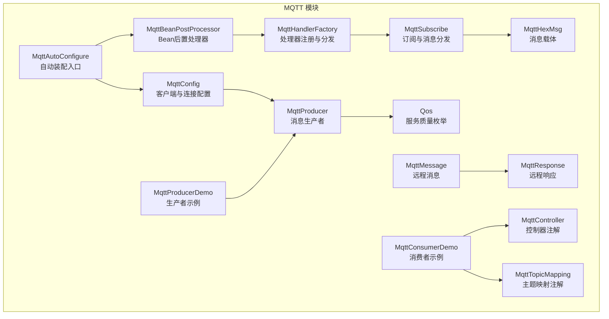
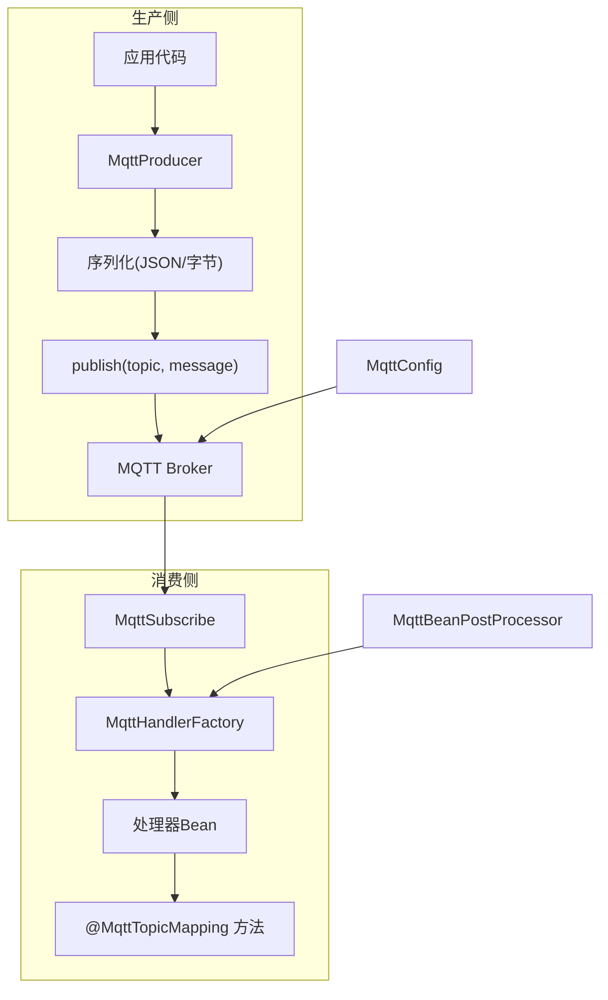
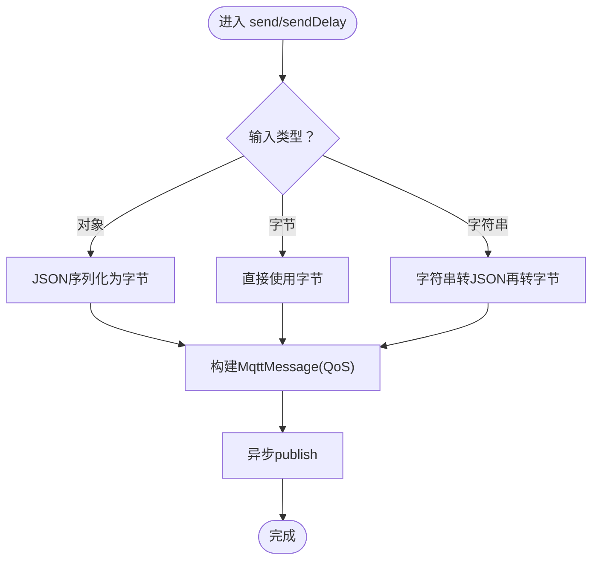
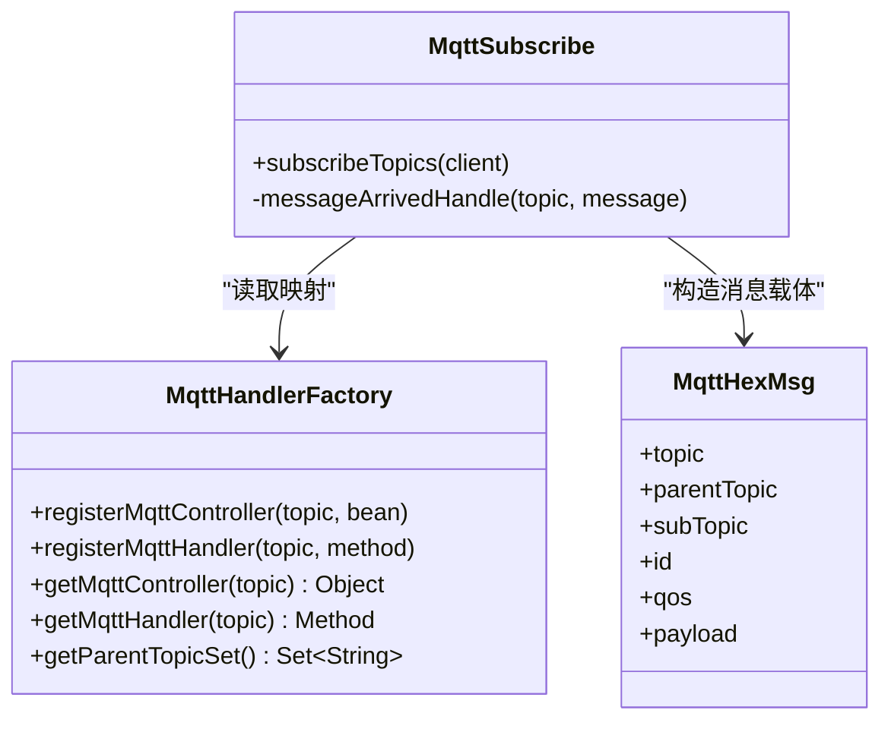
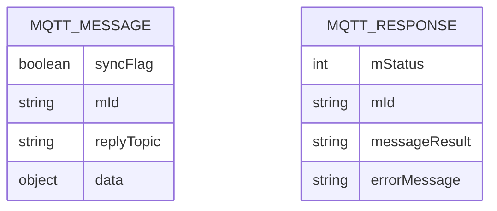
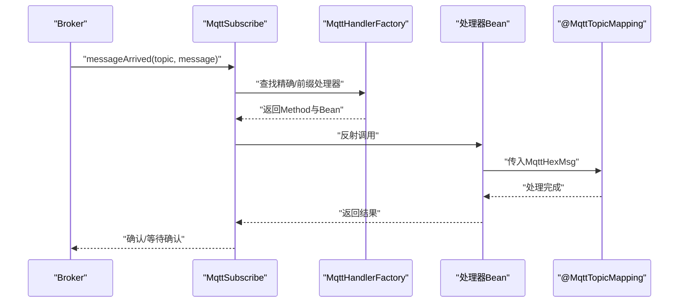
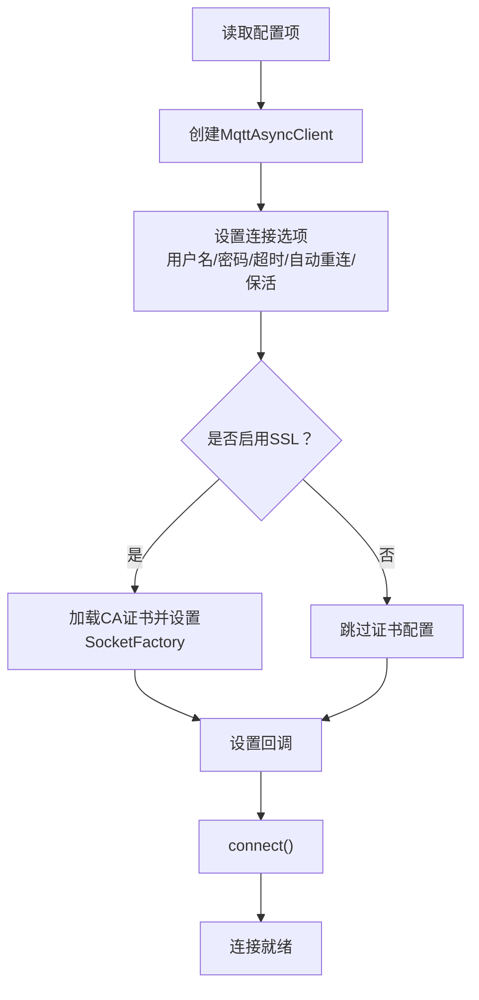
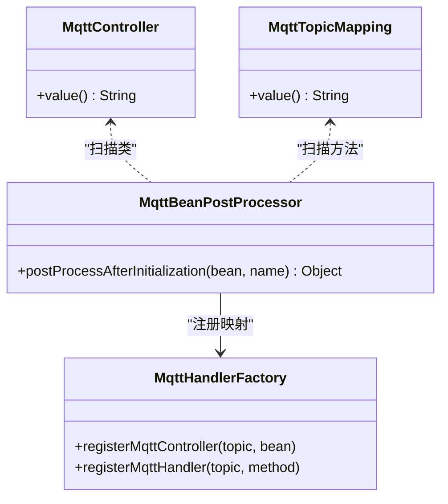
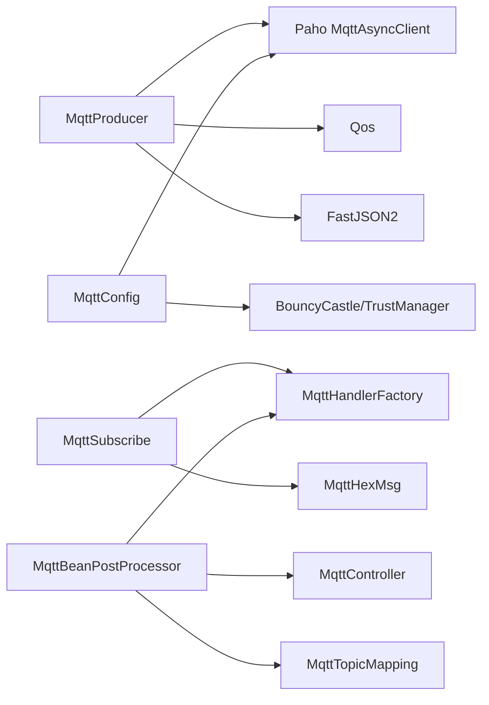

# 消息生产与消费

<cite>
**本文引用的文件**
- [MqttProducer.java](file://sh-mqtt/src/main/java/com/wkclz/mqtt/client/MqttProducer.java)
- [MqttHandlerFactory.java](file://sh-mqtt/src/main/java/com/wkclz/mqtt/handler/MqttHandlerFactory.java)
- [MqttMessage.java](file://sh-mqtt/src/main/java/com/wkclz/mqtt/remote/MqttMessage.java)
- [MqttResponse.java](file://sh-mqtt/src/main/java/com/wkclz/mqtt/remote/MqttResponse.java)
- [MqttConfig.java](file://sh-mqtt/src/main/java/com/wkclz/mqtt/config/MqttConfig.java)
- [MqttSubscribe.java](file://sh-mqtt/src/main/java/com/wkclz/mqtt/config/MqttSubscribe.java)
- [Qos.java](file://sh-mqtt/src/main/java/com/wkclz/mqtt/enums/Qos.java)
- [MqttController.java](file://sh-mqtt/src/main/java/com/wkclz/mqtt/annotation/MqttController.java)
- [MqttTopicMapping.java](file://sh-mqtt/src/main/java/com/wkclz/mqtt/annotation/MqttTopicMapping.java)
- [MqttBeanPostProcessor.java](file://sh-mqtt/src/main/java/com/wkclz/mqtt/config/MqttBeanPostProcessor.java)
- [MqttHexMsg.java](file://sh-mqtt/src/main/java/com/wkclz/mqtt/bean/MqttHexMsg.java)
- [MqttAutoConfigure.java](file://sh-mqtt/src/main/java/com/wkclz/mqtt/MqttAutoConfigure.java)
- [MqttProducerDemo.java](file://sh-mqtt/src/main/java/com/wkclz/mqtt/demo/MqttProducerDemo.java)
- [MqttConsumerDemo.java](file://sh-mqtt/src/main/java/com/wkclz/mqtt/demo/MqttConsumerDemo.java)
- [MqttBeansException.java](file://sh-mqtt/src/main/java/com/wkclz/mqtt/exception/MqttBeansException.java)
- [MqttSendException.java](file://sh-mqtt/src/main/java/com/wkclz/mqtt/exception/MqttSendException.java)
- [MqttTimeoutException.java](file://sh-mqtt/src/main/java/com/wkclz/mqtt/exception/MqttTimeoutException.java)
</cite>

## 目录
1. [引言](#引言)
2. [项目结构](#项目结构)
3. [核心组件](#核心组件)
4. [架构总览](#架构总览)
5. [详细组件分析](#详细组件分析)
6. [依赖分析](#依赖分析)
7. [性能考虑](#性能考虑)
8. [故障排查指南](#故障排查指南)
9. [结论](#结论)
10. [附录：完整示例](#附录完整示例)

## 引言
本文件面向MQTT消息生产与消费机制的技术文档，围绕以下目标展开：
- 深入解析消息生产者 MqttProducer 的实现原理，包括客户端管理、连接池配置、消息序列化与异步发送机制；
- 解释消息处理工厂 MqttHandlerFactory 的设计模式，涵盖处理器注册、消息分发、异常捕获与性能监控；
- 阐述远程消息 MqttMessage 与响应 MqttResponse 的数据结构，明确消息头、负载格式与状态码定义；
- 说明消息消费的回调机制，包括成功确认、失败重试与死信处理策略；
- 提供发布订阅的完整代码示例，覆盖同步调用、异步回调与批量处理场景。

## 项目结构
MQTT 模块采用按功能域划分的组织方式，核心位于 com.wkclz.mqtt 包下，包含客户端、配置、处理器、注解、枚举、远程消息与示例等子包。自动装配入口通过 MqttAutoConfigure 统一扫描 com.wkclz.mqtt 包。

图表来源
- [MqttAutoConfigure.java:1-12](file://sh-mqtt/src/main/java/com/wkclz/mqtt/MqttAutoConfigure.java#L1-L12)
- [MqttConfig.java:1-256](file://sh-mqtt/src/main/java/com/wkclz/mqtt/config/MqttConfig.java#L1-L256)
- [MqttSubscribe.java:1-96](file://sh-mqtt/src/main/java/com/wkclz/mqtt/config/MqttSubscribe.java#L1-L96)
- [MqttHandlerFactory.java:1-73](file://sh-mqtt/src/main/java/com/wkclz/mqtt/handler/MqttHandlerFactory.java#L1-L73)
- [MqttProducer.java:1-137](file://sh-mqtt/src/main/java/com/wkclz/mqtt/client/MqttProducer.java#L1-L137)
- [MqttController.java:1-25](file://sh-mqtt/src/main/java/com/wkclz/mqtt/annotation/MqttController.java#L1-L25)
- [MqttTopicMapping.java:1-21](file://sh-mqtt/src/main/java/com/wkclz/mqtt/annotation/MqttTopicMapping.java#L1-L21)
- [MqttBeanPostProcessor.java:1-64](file://sh-mqtt/src/main/java/com/wkclz/mqtt/config/MqttBeanPostProcessor.java#L1-L64)
- [MqttHexMsg.java:1-60](file://sh-mqtt/src/main/java/com/wkclz/mqtt/bean/MqttHexMsg.java#L1-L60)
- [Qos.java:1-42](file://sh-mqtt/src/main/java/com/wkclz/mqtt/enums/Qos.java#L1-L42)
- [MqttMessage.java:1-46](file://sh-mqtt/src/main/java/com/wkclz/mqtt/remote/MqttMessage.java#L1-L46)
- [MqttResponse.java:1-44](file://sh-mqtt/src/main/java/com/wkclz/mqtt/remote/MqttResponse.java#L1-L44)
- [MqttProducerDemo.java:1-36](file://sh-mqtt/src/main/java/com/wkclz/mqtt/demo/MqttProducerDemo.java#L1-L36)
- [MqttConsumerDemo.java:1-22](file://sh-mqtt/src/main/java/com/wkclz/mqtt/demo/MqttConsumerDemo.java#L1-L22)

章节来源
- [MqttAutoConfigure.java:1-12](file://sh-mqtt/src/main/java/com/wkclz/mqtt/MqttAutoConfigure.java#L1-L12)
- [MqttConfig.java:1-256](file://sh-mqtt/src/main/java/com/wkclz/mqtt/config/MqttConfig.java#L1-L256)

## 核心组件
- MqttProducer：负责消息发送，支持字符串、字节数组与对象（JSON）三种输入；内置延迟发送与固定调度线程池；通过 Paho 异步客户端进行发布。
- MqttHandlerFactory：静态注册表，维护 topic 到处理器 Bean 与 Method 的映射，以及父 Topic 集合，支撑运行时分发。
- MqttSubscribe：订阅管理与消息分发器，按父 Topic 订阅“#”，在收到消息后根据精确或前缀匹配定位处理器并反射调用。
- MqttConfig：构建 MqttAsyncClient，设置用户名、密码、CA 证书、自动重连、保活间隔等；提供断线重连后的重新订阅能力。
- MqttBeanPostProcessor：扫描带注解的 Bean，注册处理器与控制器映射，避免重复定义。
- MqttHexMsg：消息载体，包含 topic、父/子主题、消息 ID、QoS、payload 等字段。
- Qos：服务质量枚举，提供 QOS_0/1/2 的语义说明与取值。
- MqttMessage/MqttResponse：远程通信的消息与响应模型，含同步标志、消息 ID、回复 Topic、状态码与结果/错误信息。

章节来源
- [MqttProducer.java:1-137](file://sh-mqtt/src/main/java/com/wkclz/mqtt/client/MqttProducer.java#L1-L137)
- [MqttHandlerFactory.java:1-73](file://sh-mqtt/src/main/java/com/wkclz/mqtt/handler/MqttHandlerFactory.java#L1-L73)
- [MqttSubscribe.java:1-96](file://sh-mqtt/src/main/java/com/wkclz/mqtt/config/MqttSubscribe.java#L1-L96)
- [MqttConfig.java:1-256](file://sh-mqtt/src/main/java/com/wkclz/mqtt/config/MqttConfig.java#L1-L256)
- [MqttBeanPostProcessor.java:1-64](file://sh-mqtt/src/main/java/com/wkclz/mqtt/config/MqttBeanPostProcessor.java#L1-L64)
- [MqttHexMsg.java:1-60](file://sh-mqtt/src/main/java/com/wkclz/mqtt/bean/MqttHexMsg.java#L1-L60)
- [Qos.java:1-42](file://sh-mqtt/src/main/java/com/wkclz/mqtt/enums/Qos.java#L1-L42)
- [MqttMessage.java:1-46](file://sh-mqtt/src/main/java/com/wkclz/mqtt/remote/MqttMessage.java#L1-L46)
- [MqttResponse.java:1-44](file://sh-mqtt/src/main/java/com/wkclz/mqtt/remote/MqttResponse.java#L1-L44)

## 架构总览
MQTT 生产与消费的整体流程如下：
- 应用启动时，MqttAutoConfigure 扫描 com.wkclz.mqtt 包，MqttConfig 创建并连接 MqttAsyncClient，设置回调与自动重连；
- MqttBeanPostProcessor 扫描标注 MqttController 的类，提取 MqttTopicMapping 方法，注册到 MqttHandlerFactory；
- MqttSubscribe 根据父 Topic 集合对 “parent/#” 订阅，收到消息后按 topic 精确匹配或父 Topic 前缀匹配，构造 MqttHexMsg 并反射调用处理器；
- 生产侧，MqttProducer 将对象序列化为 JSON 或直接使用字节数组，按 QoS 发布至指定主题。

图表来源
- [MqttProducer.java:1-137](file://sh-mqtt/src/main/java/com/wkclz/mqtt/client/MqttProducer.java#L1-L137)
- [MqttSubscribe.java:1-96](file://sh-mqtt/src/main/java/com/wkclz/mqtt/config/MqttSubscribe.java#L1-L96)
- [MqttHandlerFactory.java:1-73](file://sh-mqtt/src/main/java/com/wkclz/mqtt/handler/MqttHandlerFactory.java#L1-L73)
- [MqttConfig.java:1-256](file://sh-mqtt/src/main/java/com/wkclz/mqtt/config/MqttConfig.java#L1-L256)
- [MqttBeanPostProcessor.java:1-64](file://sh-mqtt/src/main/java/com/wkclz/mqtt/config/MqttBeanPostProcessor.java#L1-L64)

## 详细组件分析

### MqttProducer 消息生产者
- 客户端管理
  - 通过 @Autowired 注入 MqttAsyncClient，若为空则抛出 MqttBeansException，确保 MQTT 已启用且可用。
- 连接池配置
  - 内部维护一个固定大小的 ScheduledExecutorService（线程名前缀 mqtt-delay-），采用 CallerRunsPolicy，避免频繁创建线程导致资源泄漏。
- 消息序列化
  - 对象输入：使用 JSON 序列化为 UTF-8 字节数组；
  - 字节数组输入：直接使用；
  - 字符串输入：先转 JSON，再转字节数组。
- 异步发送机制
  - publish(topic, message) 由 Paho 异步客户端执行；
  - sendDelay 支持批量消息与累计延迟，逐条调度发送，便于削峰与限流。
- 错误处理
  - 发布异常记录日志；当客户端为空时显式抛出业务异常，便于上层感知。

图表来源
- [MqttProducer.java:91-134](file://sh-mqtt/src/main/java/com/wkclz/mqtt/client/MqttProducer.java#L91-L134)

章节来源
- [MqttProducer.java:1-137](file://sh-mqtt/src/main/java/com/wkclz/mqtt/client/MqttProducer.java#L1-L137)
- [MqttBeansException.java:1-24](file://sh-mqtt/src/main/java/com/wkclz/mqtt/exception/MqttBeansException.java#L1-L24)
- [MqttSendException.java:1-24](file://sh-mqtt/src/main/java/com/wkclz/mqtt/exception/MqttSendException.java#L1-L24)

### MqttHandlerFactory 设计模式
- 注册机制
  - registerMqttController：将 parentTopic/subTopic 映射到处理器 Bean；
  - registerMqttHandler：将 parentTopic/subTopic 映射到具体 Method；
  - getParentTopicSet：维护父 Topic 集合，用于订阅范围确定。
- 消息分发
  - getMqttController/getMqttHandler：按精确匹配优先，若无则回退到父 Topic 前缀匹配（parent/#）；
  - 分发时构造 MqttHexMsg，仅注入 MqttHexMsg 类型参数，其余参数为 null，简化处理器签名。
- 异常捕获
  - 反射调用在分发过程中捕获异常并记录日志，避免中断后续消息处理；
- 性能监控
  - 通过日志输出 topic 与处理耗时，结合外部监控可实现性能观测。

图表来源
- [MqttHandlerFactory.java:1-73](file://sh-mqtt/src/main/java/com/wkclz/mqtt/handler/MqttHandlerFactory.java#L1-L73)
- [MqttSubscribe.java:1-96](file://sh-mqtt/src/main/java/com/wkclz/mqtt/config/MqttSubscribe.java#L1-L96)
- [MqttHexMsg.java:1-60](file://sh-mqtt/src/main/java/com/wkclz/mqtt/bean/MqttHexMsg.java#L1-L60)

章节来源
- [MqttHandlerFactory.java:1-73](file://sh-mqtt/src/main/java/com/wkclz/mqtt/handler/MqttHandlerFactory.java#L1-L73)
- [MqttSubscribe.java:1-96](file://sh-mqtt/src/main/java/com/wkclz/mqtt/config/MqttSubscribe.java#L1-L96)

### 远程消息与响应模型
- MqttMessage
  - 同步标志 syncFlag 默认 true；
  - mId：消息唯一标识（建议 UUID）；
  - replyTopic：客户端返回消息的主题；
  - data：发送数据对象。
- MqttResponse
  - 状态码：OK=20000，TIMEOUT=40001，CANCEL=40002；
  - mStatus：默认 OK；
  - mId：对应请求消息 ID；
  - messageResult：成功时的结果字符串；
  - errorMessage：非成功状态下的错误信息。

图表来源
- [MqttMessage.java:1-46](file://sh-mqtt/src/main/java/com/wkclz/mqtt/remote/MqttMessage.java#L1-L46)
- [MqttResponse.java:1-44](file://sh-mqtt/src/main/java/com/wkclz/mqtt/remote/MqttResponse.java#L1-L44)

章节来源
- [MqttMessage.java:1-46](file://sh-mqtt/src/main/java/com/wkclz/mqtt/remote/MqttMessage.java#L1-L46)
- [MqttResponse.java:1-44](file://sh-mqtt/src/main/java/com/wkclz/mqtt/remote/MqttResponse.java#L1-L44)

### 消费回调机制与重试/死信
- 回调入口
  - MqttSubscribe 在连接恢复后重新订阅父 Topic 下的所有子主题；
  - 收到消息后，优先精确匹配 topic，其次匹配父 Topic 前缀 parent/#，构造 MqttHexMsg 并反射调用处理器。
- 成功确认
  - 通过 Paho 异步客户端的 deliveryComplete 回调可感知投递完成（当前实现为空逻辑，需按需扩展）。
- 失败重试与死信
  - 当前未实现自动重试与死信队列；可在业务处理器中增加幂等与本地重试策略，或在上层引入外部重试/死信机制。

图表来源
- [MqttSubscribe.java:37-93](file://sh-mqtt/src/main/java/com/wkclz/mqtt/config/MqttSubscribe.java#L37-L93)
- [MqttHandlerFactory.java:55-67](file://sh-mqtt/src/main/java/com/wkclz/mqtt/handler/MqttHandlerFactory.java#L55-L67)

章节来源
- [MqttSubscribe.java:1-96](file://sh-mqtt/src/main/java/com/wkclz/mqtt/config/MqttSubscribe.java#L1-L96)
- [MqttConfig.java:121-142](file://sh-mqtt/src/main/java/com/wkclz/mqtt/config/MqttConfig.java#L121-L142)

### 配置与连接管理
- MqttConfig
  - 依据配置项构建 MqttAsyncClient，设置用户名、密码、清理会话、连接超时、自动重连、保活间隔；
  - 若启用 SSL/TLS，加载 ClassPath 中的 CA 证书并设置 SocketFactory；
  - 设置 MqttCallbackExtended，断线重连后触发重新订阅；
  - 提供 getter/setter 便于外部读取与调试。
- 连接池与线程策略
  - 生产侧使用独立的 ScheduledExecutorService，避免每次延迟发送创建线程池；
  - 消费侧依赖 Paho 的内部线程模型，保持轻量。

图表来源
- [MqttConfig.java:61-119](file://sh-mqtt/src/main/java/com/wkclz/mqtt/config/MqttConfig.java#L61-L119)

章节来源
- [MqttConfig.java:1-256](file://sh-mqtt/src/main/java/com/wkclz/mqtt/config/MqttConfig.java#L1-L256)

### 注解与处理器注册
- MqttController
  - 类级别注解，声明父 Topic；
  - 作为 Spring 组件被容器管理，便于 BeanPostProcessor 扫描。
- MqttTopicMapping
  - 方法级别注解，声明子 Topic，默认为空表示订阅父 Topic 下所有子主题；
  - 支持通配符“#”的注册与去重校验。
- MqttBeanPostProcessor
  - 扫描标注的类，收集所有带注解的方法，拼装真实 topic 并注册到 MqttHandlerFactory；
  - 若同一 topic 重复定义，抛出 MqttBeansException。

图表来源
- [MqttController.java:1-25](file://sh-mqtt/src/main/java/com/wkclz/mqtt/annotation/MqttController.java#L1-L25)
- [MqttTopicMapping.java:1-21](file://sh-mqtt/src/main/java/com/wkclz/mqtt/annotation/MqttTopicMapping.java#L1-L21)
- [MqttBeanPostProcessor.java:28-61](file://sh-mqtt/src/main/java/com/wkclz/mqtt/config/MqttBeanPostProcessor.java#L28-L61)
- [MqttHandlerFactory.java:35-47](file://sh-mqtt/src/main/java/com/wkclz/mqtt/handler/MqttHandlerFactory.java#L35-L47)

章节来源
- [MqttController.java:1-25](file://sh-mqtt/src/main/java/com/wkclz/mqtt/annotation/MqttController.java#L1-L25)
- [MqttTopicMapping.java:1-21](file://sh-mqtt/src/main/java/com/wkclz/mqtt/annotation/MqttTopicMapping.java#L1-L21)
- [MqttBeanPostProcessor.java:1-64](file://sh-mqtt/src/main/java/com/wkclz/mqtt/config/MqttBeanPostProcessor.java#L1-L64)
- [MqttBeansException.java:1-24](file://sh-mqtt/src/main/java/com/wkclz/mqtt/exception/MqttBeansException.java#L1-L24)

## 依赖分析
- 组件耦合
  - MqttProducer 依赖 MqttAsyncClient 与 Qos，耦合度低，便于替换底层实现；
  - MqttSubscribe 依赖 MqttHandlerFactory 与 MqttHexMsg，承担消息分发职责；
  - MqttConfig 与 MqttSubscribe 通过回调联动，实现断线重连后的自动恢复；
  - MqttBeanPostProcessor 与注解配合，实现零 XML 的零散式注册。
- 外部依赖
  - Paho 客户端：异步发布与订阅、回调、自动重连；
  - FastJSON2：对象到 JSON 的序列化；
  - Hutool：线程命名与工厂；
  - Spring：组件扫描、Bean 生命周期钩子、条件装配。

图表来源
- [MqttProducer.java:1-137](file://sh-mqtt/src/main/java/com/wkclz/mqtt/client/MqttProducer.java#L1-L137)
- [MqttConfig.java:1-256](file://sh-mqtt/src/main/java/com/wkclz/mqtt/config/MqttConfig.java#L1-L256)
- [MqttSubscribe.java:1-96](file://sh-mqtt/src/main/java/com/wkclz/mqtt/config/MqttSubscribe.java#L1-L96)
- [MqttHandlerFactory.java:1-73](file://sh-mqtt/src/main/java/com/wkclz/mqtt/handler/MqttHandlerFactory.java#L1-L73)
- [MqttBeanPostProcessor.java:1-64](file://sh-mqtt/src/main/java/com/wkclz/mqtt/config/MqttBeanPostProcessor.java#L1-L64)

章节来源
- [MqttProducer.java:1-137](file://sh-mqtt/src/main/java/com/wkclz/mqtt/client/MqttProducer.java#L1-L137)
- [MqttConfig.java:1-256](file://sh-mqtt/src/main/java/com/wkclz/mqtt/config/MqttConfig.java#L1-L256)
- [MqttSubscribe.java:1-96](file://sh-mqtt/src/main/java/com/wkclz/mqtt/config/MqttSubscribe.java#L1-L96)
- [MqttHandlerFactory.java:1-73](file://sh-mqtt/src/main/java/com/wkclz/mqtt/handler/MqttHandlerFactory.java#L1-L73)
- [MqttBeanPostProcessor.java:1-64](file://sh-mqtt/src/main/java/com/wkclz/mqtt/config/MqttBeanPostProcessor.java#L1-L64)

## 性能考虑
- 线程与调度
  - 生产侧使用共享 ScheduledExecutorService，避免高频创建线程带来的 GC 压力；
  - 消费侧依赖 Paho 内部线程模型，建议控制订阅粒度与消息大小，减少反射开销。
- 序列化与网络
  - 对象序列化采用 JSON，建议控制单条消息体积，避免超大负载；
  - QoS 选择影响吞吐与可靠性，QOS_0 适合高吞吐低可靠场景，QOS_1 适合一般可靠性需求。
- 连接与保活
  - 合理设置 keepAliveInterval 与自动重连，避免频繁断连；
  - 断线重连后自动重新订阅，减少手工干预。

## 故障排查指南
- 常见异常
  - MqttBeansException：当 MqttAsyncClient 为空或配置禁用时抛出，检查 enabled 与 endpoint；
  - MqttSendException：发布过程异常，查看日志堆栈；
  - MqttTimeoutException：远程超时异常（继承自 MqttRemoteException），需结合业务超时策略处理。
- 日志与可观测性
  - 生产侧：发送前/后日志，包含 topic 与 payload 摘要；
  - 消费侧：收到消息与分发日志，缺失处理器时输出警告；
  - 配置侧：连接开始/结束与异常日志，便于定位网络与证书问题。
- 排查步骤
  - 确认 enabled=true 且 endpoint 非空；
  - 检查用户名/密码与 CA 证书路径；
  - 核对处理器注册：是否存在重复 topic 定义；
  - 观察断线重连与重新订阅行为。

章节来源
- [MqttBeansException.java:1-24](file://sh-mqtt/src/main/java/com/wkclz/mqtt/exception/MqttBeansException.java#L1-L24)
- [MqttSendException.java:1-24](file://sh-mqtt/src/main/java/com/wkclz/mqtt/exception/MqttSendException.java#L1-L24)
- [MqttTimeoutException.java:1-22](file://sh-mqtt/src/main/java/com/wkclz/mqtt/exception/MqttTimeoutException.java#L1-L22)
- [MqttConfig.java:111-118](file://sh-mqtt/src/main/java/com/wkclz/mqtt/config/MqttConfig.java#L111-L118)
- [MqttBeanPostProcessor.java:51-53](file://sh-mqtt/src/main/java/com/wkclz/mqtt/config/MqttBeanPostProcessor.java#L51-L53)

## 结论
本方案以注解驱动的方式实现零 XML 的 MQTT 发布订阅，具备以下特点：
- 生产侧：统一序列化、异步发布、延迟发送与线程池复用；
- 消费侧：基于父/子主题的灵活匹配、反射分发与日志可观测；
- 配置侧：完善的连接选项、SSL/TLS 支持与自动重连；
- 可扩展性：可通过回调扩展成功确认、失败重试与死信处理，满足不同可靠性需求。

## 附录：完整示例
- 同步调用（对象到 JSON）
  - 生产者：参考 [MqttProducer.java:91-107](file://sh-mqtt/src/main/java/com/wkclz/mqtt/client/MqttProducer.java#L91-L107)
  - 消费者：参考 [MqttConsumerDemo.java:11-22](file://sh-mqtt/src/main/java/com/wkclz/mqtt/demo/MqttConsumerDemo.java#L11-L22)
- 异步回调（延迟发送）
  - 生产者：参考 [MqttProducer.java:42-89](file://sh-mqtt/src/main/java/com/wkclz/mqtt/client/MqttProducer.java#L42-L89)
  - 示例：参考 [MqttProducerDemo.java:21-34](file://sh-mqtt/src/main/java/com/wkclz/mqtt/demo/MqttProducerDemo.java#L21-L34)
- 批量处理（父主题订阅）
  - 消费者：参考 [MqttConsumerDemo.java:11-22](file://sh-mqtt/src/main/java/com/wkclz/mqtt/demo/MqttConsumerDemo.java#L11-L22)
  - 订阅：参考 [MqttSubscribe.java:32-48](file://sh-mqtt/src/main/java/com/wkclz/mqtt/config/MqttSubscribe.java#L32-L48)

章节来源
- [MqttProducer.java:42-107](file://sh-mqtt/src/main/java/com/wkclz/mqtt/client/MqttProducer.java#L42-L107)
- [MqttProducerDemo.java:1-36](file://sh-mqtt/src/main/java/com/wkclz/mqtt/demo/MqttProducerDemo.java#L1-L36)
- [MqttConsumerDemo.java:1-22](file://sh-mqtt/src/main/java/com/wkclz/mqtt/demo/MqttConsumerDemo.java#L1-L22)
- [MqttSubscribe.java:25-48](file://sh-mqtt/src/main/java/com/wkclz/mqtt/config/MqttSubscribe.java#L25-L48)