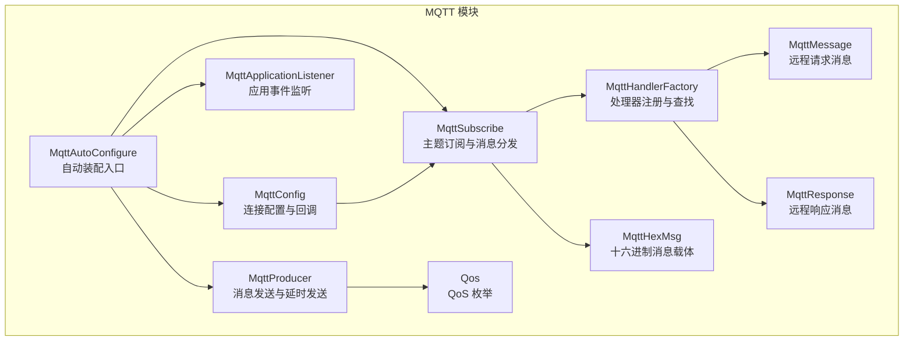
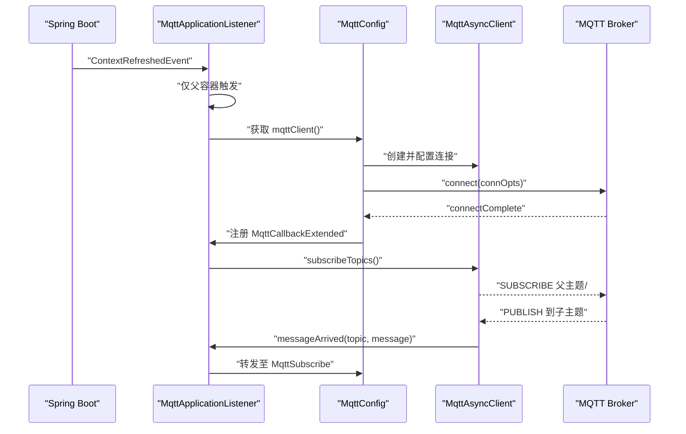
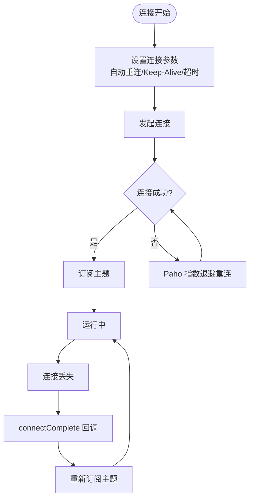
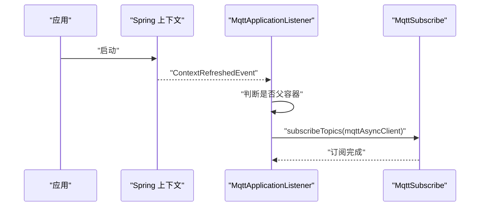
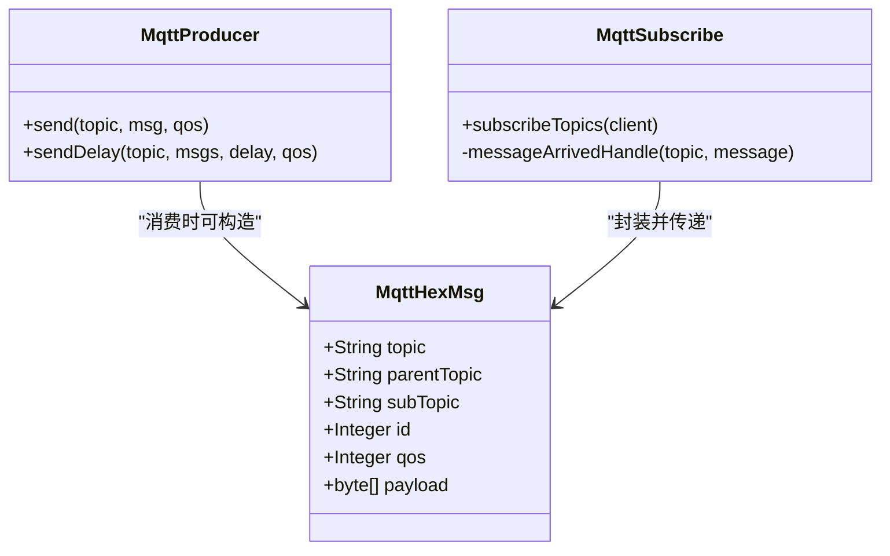
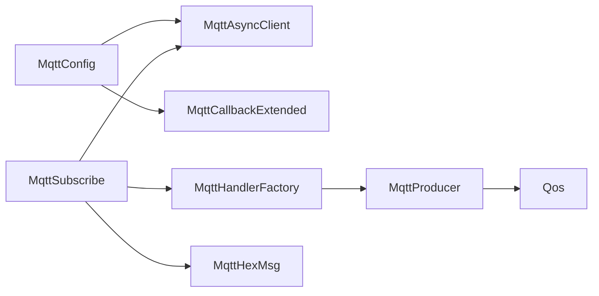

# 连接管理与监控

<cite>
**本文引用的文件**
- [MqttApplicationListener.java](file://sh-mqtt/src/main/java/com/wkclz/mqtt/config/MqttApplicationListener.java)
- [MqttConfig.java](file://sh-mqtt/src/main/java/com/wkclz/mqtt/config/MqttConfig.java)
- [MqttSubscribe.java](file://sh-mqtt/src/main/java/com/wkclz/mqtt/config/MqttSubscribe.java)
- [MqttHandlerFactory.java](file://sh-mqtt/src/main/java/com/wkclz/mqtt/handler/MqttHandlerFactory.java)
- [MqttProducer.java](file://sh-mqtt/src/main/java/com/wkclz/mqtt/client/MqttProducer.java)
- [MqttHexMsg.java](file://sh-mqtt/src/main/java/com/wkclz/mqtt/bean/MqttHexMsg.java)
- [Qos.java](file://sh-mqtt/src/main/java/com/wkclz/mqtt/enums/Qos.java)
- [MqttMessage.java](file://sh-mqtt/src/main/java/com/wkclz/mqtt/remote/MqttMessage.java)
- [MqttResponse.java](file://sh-mqtt/src/main/java/com/wkclz/mqtt/remote/MqttResponse.java)
- [MqttAutoConfigure.java](file://sh-mqtt/src/main/java/com/wkclz/mqtt/MqttAutoConfigure.java)
</cite>

## 目录
1. [简介](#简介)
2. [项目结构](#项目结构)
3. [核心组件](#核心组件)
4. [架构总览](#架构总览)
5. [详细组件分析](#详细组件分析)
6. [依赖分析](#依赖分析)
7. [性能考虑](#性能考虑)
8. [故障排查指南](#故障排查指南)
9. [结论](#结论)
10. [附录](#附录)

## 简介
本文件围绕 MQTT 连接管理与监控机制展开，重点覆盖以下方面：
- 断线重连策略：基于 Paho 的自动重连与回调处理，结合指数退避与最大重试次数限制的建议性设计
- 心跳机制：Keep-Alive 配置、Ping-Pong 检测与网络延迟处理
- 应用监听器：应用启动事件、连接状态监听与优雅关闭处理
- 十六进制消息编解码：字节序与数据转换
- QoS 服务质量等级：At Most Once、At Least Once、Exactly Once 的语义与实现
- 监控指标与告警：连接成功率、消息延迟与异常统计的采集与配置建议

## 项目结构
MQTT 模块采用按功能域划分的组织方式，核心位于 com.wkclz.mqtt 包下，包含配置、客户端、处理器、枚举、远程消息模型与自动装配入口。

图表来源
- [MqttAutoConfigure.java:1-12](file://sh-mqtt/src/main/java/com/wkclz/mqtt/MqttAutoConfigure.java#L1-L12)
- [MqttConfig.java:1-256](file://sh-mqtt/src/main/java/com/wkclz/mqtt/config/MqttConfig.java#L1-L256)
- [MqttApplicationListener.java:1-37](file://sh-mqtt/src/main/java/com/wkclz/mqtt/config/MqttApplicationListener.java#L1-L37)
- [MqttSubscribe.java:1-96](file://sh-mqtt/src/main/java/com/wkclz/mqtt/config/MqttSubscribe.java#L1-L96)
- [MqttHandlerFactory.java:1-73](file://sh-mqtt/src/main/java/com/wkclz/mqtt/handler/MqttHandlerFactory.java#L1-L73)
- [MqttProducer.java:1-137](file://sh-mqtt/src/main/java/com/wkclz/mqtt/client/MqttProducer.java#L1-L137)
- [MqttHexMsg.java:1-60](file://sh-mqtt/src/main/java/com/wkclz/mqtt/bean/MqttHexMsg.java#L1-L60)
- [Qos.java:1-42](file://sh-mqtt/src/main/java/com/wkclz/mqtt/enums/Qos.java#L1-L42)
- [MqttMessage.java:1-46](file://sh-mqtt/src/main/java/com/wkclz/mqtt/remote/MqttMessage.java#L1-L46)
- [MqttResponse.java:1-44](file://sh-mqtt/src/main/java/com/wkclz/mqtt/remote/MqttResponse.java#L1-L44)

章节来源
- [MqttAutoConfigure.java:1-12](file://sh-mqtt/src/main/java/com/wkclz/mqtt/MqttAutoConfigure.java#L1-L12)

## 核心组件
- 连接配置与回调：负责构建 MqttAsyncClient、设置连接参数（用户名、密码、CleanSession、连接超时、自动重连、Keep-Alive）、加载 CA 证书以及注册 MqttCallbackExtended 回调
- 应用监听器：在 Spring 上下文刷新完成后，仅在父容器触发时执行订阅逻辑，避免重复订阅
- 主题订阅与消息分发：集中订阅父级主题，按全匹配或父级通配符路由到具体处理器
- 处理器工厂：维护控制器与处理器方法映射，支持按 topic 查找处理器
- 生产者：提供同步与延时发送能力，支持字符串、字节数组与对象序列化
- 十六进制消息载体：承载 topic、父子主题、消息 ID、QoS 与负载等字段
- QoS 枚举：定义 QOS_0、QOS_1、QOS_2 的语义标签
- 远程消息模型：定义远程请求与响应的状态码与结构

章节来源
- [MqttConfig.java:1-256](file://sh-mqtt/src/main/java/com/wkclz/mqtt/config/MqttConfig.java#L1-L256)
- [MqttApplicationListener.java:1-37](file://sh-mqtt/src/main/java/com/wkclz/mqtt/config/MqttApplicationListener.java#L1-L37)
- [MqttSubscribe.java:1-96](file://sh-mqtt/src/main/java/com/wkclz/mqtt/config/MqttSubscribe.java#L1-L96)
- [MqttHandlerFactory.java:1-73](file://sh-mqtt/src/main/java/com/wkclz/mqtt/handler/MqttHandlerFactory.java#L1-L73)
- [MqttProducer.java:1-137](file://sh-mqtt/src/main/java/com/wkclz/mqtt/client/MqttProducer.java#L1-L137)
- [MqttHexMsg.java:1-60](file://sh-mqtt/src/main/java/com/wkclz/mqtt/bean/MqttHexMsg.java#L1-L60)
- [Qos.java:1-42](file://sh-mqtt/src/main/java/com/wkclz/mqtt/enums/Qos.java#L1-L42)
- [MqttMessage.java:1-46](file://sh-mqtt/src/main/java/com/wkclz/mqtt/remote/MqttMessage.java#L1-L46)
- [MqttResponse.java:1-44](file://sh-mqtt/src/main/java/com/wkclz/mqtt/remote/MqttResponse.java#L1-L44)

## 架构总览
下图展示从应用启动到连接建立、订阅与消息处理的关键交互路径。

图表来源
- [MqttApplicationListener.java:23-34](file://sh-mqtt/src/main/java/com/wkclz/mqtt/config/MqttApplicationListener.java#L23-L34)
- [MqttConfig.java:61-119](file://sh-mqtt/src/main/java/com/wkclz/mqtt/config/MqttConfig.java#L61-L119)
- [MqttSubscribe.java:25-48](file://sh-mqtt/src/main/java/com/wkclz/mqtt/config/MqttSubscribe.java#L25-L48)

## 详细组件分析

### 断线重连策略
- 自动重连启用：通过连接选项开启自动重连，底层由 Paho 实现指数退避与最大重试次数限制
- 回调处理：在连接完成回调中重新订阅主题，确保断线后恢复订阅
- 连接丢失日志：记录连接丢失原因，便于定位网络或认证问题

图表来源
- [MqttConfig.java:86-119](file://sh-mqtt/src/main/java/com/wkclz/mqtt/config/MqttConfig.java#L86-L119)
- [MqttConfig.java:121-142](file://sh-mqtt/src/main/java/com/wkclz/mqtt/config/MqttConfig.java#L121-L142)

章节来源
- [MqttConfig.java:86-119](file://sh-mqtt/src/main/java/com/wkclz/mqtt/config/MqttConfig.java#L86-L119)
- [MqttConfig.java:121-142](file://sh-mqtt/src/main/java/com/wkclz/mqtt/config/MqttConfig.java#L121-L142)

### 心跳机制（Keep-Alive）
- Keep-Alive 配置：通过连接选项设置心跳间隔，用于维持 TCP 连接活跃
- Ping-Pong 检测：由 Paho 在心跳周期内发送 PINGREQ/PINGRESP，若超时则判定连接异常
- 网络延迟处理：建议根据实际网络状况调整心跳间隔与连接超时，避免误判

章节来源
- [MqttConfig.java:46-49](file://sh-mqtt/src/main/java/com/wkclz/mqtt/config/MqttConfig.java#L46-L49)
- [MqttConfig.java:94-94](file://sh-mqtt/src/main/java/com/wkclz/mqtt/config/MqttConfig.java#L94-L94)

### 应用监听器（MqttApplicationListener）
- 启动事件：监听 ContextRefreshedEvent，在父容器刷新完成后执行订阅
- 订阅触发：调用订阅工具进行主题订阅，并输出日志
- 优雅关闭：未直接实现关闭钩子，可在回调中补充断开连接与资源释放逻辑

图表来源
- [MqttApplicationListener.java:23-34](file://sh-mqtt/src/main/java/com/wkclz/mqtt/config/MqttApplicationListener.java#L23-L34)
- [MqttSubscribe.java:25-48](file://sh-mqtt/src/main/java/com/wkclz/mqtt/config/MqttSubscribe.java#L25-L48)

章节来源
- [MqttApplicationListener.java:1-37](file://sh-mqtt/src/main/java/com/wkclz/mqtt/config/MqttApplicationListener.java#L1-L37)
- [MqttSubscribe.java:1-96](file://sh-mqtt/src/main/java/com/wkclz/mqtt/config/MqttSubscribe.java#L1-L96)

### 十六进制消息（MqttHexMsg）编码解码
- 字段结构：包含完整 topic、父主题、子主题、消息 ID、QoS 与原始负载
- 编码流程：生产者将对象序列化为 UTF-8 字节数组后发布；消费者接收后封装为 MqttHexMsg
- 解码流程：处理器通过反射解析参数类型，注入 MqttHexMsg 获取原始负载与元数据

图表来源
- [MqttHexMsg.java:1-60](file://sh-mqtt/src/main/java/com/wkclz/mqtt/bean/MqttHexMsg.java#L1-L60)
- [MqttProducer.java:98-134](file://sh-mqtt/src/main/java/com/wkclz/mqtt/client/MqttProducer.java#L98-L134)
- [MqttSubscribe.java:50-93](file://sh-mqtt/src/main/java/com/wkclz/mqtt/config/MqttSubscribe.java#L50-L93)

章节来源
- [MqttHexMsg.java:1-60](file://sh-mqtt/src/main/java/com/wkclz/mqtt/bean/MqttHexMsg.java#L1-L60)
- [MqttProducer.java:1-137](file://sh-mqtt/src/main/java/com/wkclz/mqtt/client/MqttProducer.java#L1-L137)
- [MqttSubscribe.java:1-96](file://sh-mqtt/src/main/java/com/wkclz/mqtt/config/MqttSubscribe.java#L1-L96)

### QoS 服务质量等级
- QOS_0：最多一次，不保证可达，适用于对可靠性要求较低的场景
- QOS_1：至少一次，保证可达但可能出现重复
- QOS_2：恰好一次，保证只到达一次，实现复杂度较高
- 语义说明：枚举提供对应标签，便于理解 CleanSession 与离线消息的影响

章节来源
- [Qos.java:1-42](file://sh-mqtt/src/main/java/com/wkclz/mqtt/enums/Qos.java#L1-L42)

### 远程消息模型（请求/响应）
- 请求模型：包含同步标志、消息 ID、回复主题与数据体
- 响应模型：包含状态码、消息 ID、结果与错误信息，提供 OK、TIMEOUT、CANCEL 等状态

章节来源
- [MqttMessage.java:1-46](file://sh-mqtt/src/main/java/com/wkclz/mqtt/remote/MqttMessage.java#L1-L46)
- [MqttResponse.java:1-44](file://sh-mqtt/src/main/java/com/wkclz/mqtt/remote/MqttResponse.java#L1-L44)

## 依赖分析
- 组件耦合：MqttConfig 与 MqttSubscribe 通过 MqttAsyncClient 间接耦合；处理器工厂与订阅模块通过 topic 映射解耦
- 外部依赖：Paho 客户端、BouncyCastle 提供 SSL/TLS 支持
- 可能的循环依赖：当前结构以配置与订阅为主，未见明显循环依赖迹象

图表来源
- [MqttConfig.java:61-119](file://sh-mqtt/src/main/java/com/wkclz/mqtt/config/MqttConfig.java#L61-L119)
- [MqttSubscribe.java:25-48](file://sh-mqtt/src/main/java/com/wkclz/mqtt/config/MqttSubscribe.java#L25-L48)
- [MqttHandlerFactory.java:1-73](file://sh-mqtt/src/main/java/com/wkclz/mqtt/handler/MqttHandlerFactory.java#L1-L73)
- [MqttProducer.java:1-137](file://sh-mqtt/src/main/java/com/wkclz/mqtt/client/MqttProducer.java#L1-L137)
- [MqttHexMsg.java:1-60](file://sh-mqtt/src/main/java/com/wkclz/mqtt/bean/MqttHexMsg.java#L1-L60)
- [Qos.java:1-42](file://sh-mqtt/src/main/java/com/wkclz/mqtt/enums/Qos.java#L1-L42)

## 性能考虑
- 线程池复用：延时发送使用共享调度线程池，避免频繁创建线程导致资源浪费
- 字符集与序列化：统一使用 UTF-8 字节集，减少跨平台差异
- 连接超时：设置合理的连接超时，避免阻塞应用启动
- Keep-Alive：根据网络质量调整心跳间隔，平衡保活与资源消耗

章节来源
- [MqttProducer.java:34-39](file://sh-mqtt/src/main/java/com/wkclz/mqtt/client/MqttProducer.java#L34-L39)
- [MqttConfig.java:91-94](file://sh-mqtt/src/main/java/com/wkclz/mqtt/config/MqttConfig.java#L91-L94)

## 故障排查指南
- 连接失败：检查端点、用户名、密码与 CA 证书配置；查看连接异常日志
- 无法订阅：确认父主题集合非空且已正确注册处理器；检查订阅异常日志
- 消息未达：核对 QoS 设置与 CleanSession 行为；关注连接丢失回调
- 延时发送异常：检查调度线程池状态与任务队列；查看延时发送错误日志

章节来源
- [MqttConfig.java:111-118](file://sh-mqtt/src/main/java/com/wkclz/mqtt/config/MqttConfig.java#L111-L118)
- [MqttSubscribe.java:43-46](file://sh-mqtt/src/main/java/com/wkclz/mqtt/config/MqttSubscribe.java#L43-L46)
- [MqttProducer.java:86-88](file://sh-mqtt/src/main/java/com/wkclz/mqtt/client/MqttProducer.java#L86-L88)

## 结论
本模块通过自动装配入口、连接配置、应用监听与订阅分发形成完整的 MQTT 生命周期管理。结合 Paho 的自动重连与回调机制，能够有效应对网络波动；通过 QoS 与消息模型支撑不同可靠性需求。建议在生产环境补充监控指标采集与告警策略，以进一步提升可观测性与稳定性。

## 附录
- 配置项概览（来自连接配置类）：启用开关、用户名、密码、CA 路径、端点、客户端 ID 前缀、Keep-Alive 间隔与任务、实例 ID、访问密钥、密钥
- 自动装配：组件扫描包为 com.wkclz.mqtt

章节来源
- [MqttConfig.java:30-58](file://sh-mqtt/src/main/java/com/wkclz/mqtt/config/MqttConfig.java#L30-L58)
- [MqttAutoConfigure.java:6-9](file://sh-mqtt/src/main/java/com/wkclz/mqtt/MqttAutoConfigure.java#L6-L9)