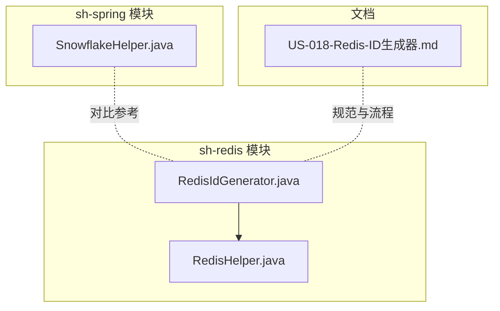
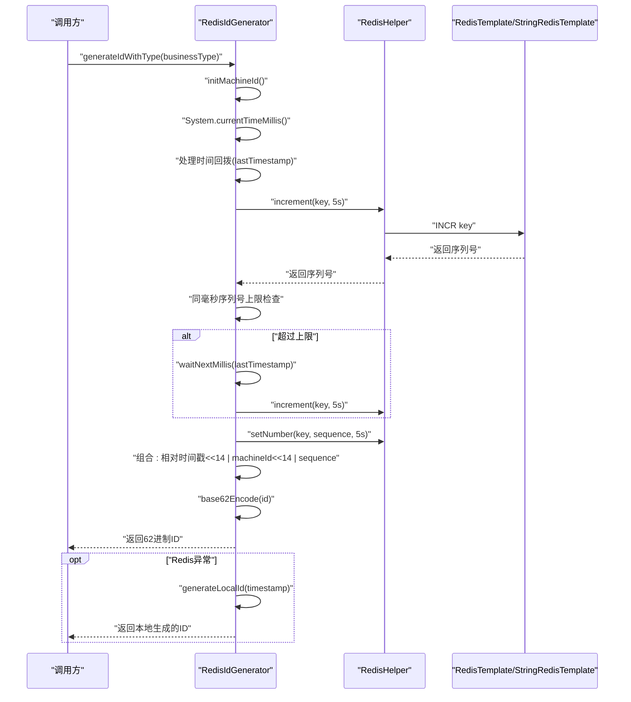
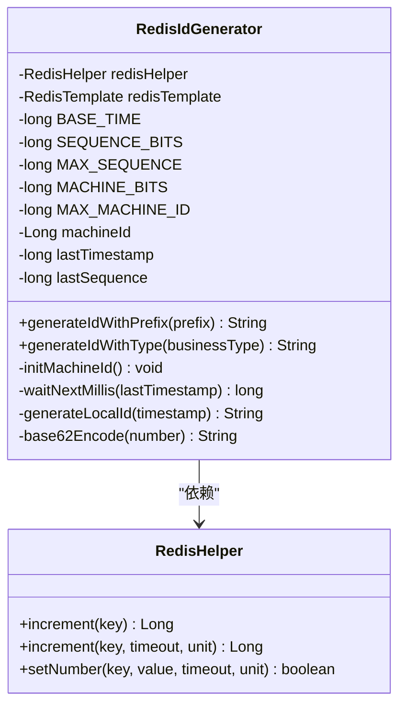
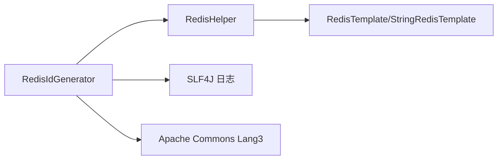

# ID生成器设计

<cite>
**本文引用的文件**
- [RedisIdGenerator.java](file://sh-redis/src/main/java/com/wkclz/redis/helper/RedisIdGenerator.java)
- [RedisHelper.java](file://sh-redis/src/main/java/com/wkclz/redis/helper/RedisHelper.java)
- [SnowflakeHelper.java](file://sh-spring/src/main/java/com/wkclz/spring/helper/SnowflakeHelper.java)
- [US-018-Redis-ID生成器.md](file://docs/stories/US-018-Redis-ID生成器.md)
</cite>

## 目录
1. [简介](#简介)
2. [项目结构](#项目结构)
3. [核心组件](#核心组件)
4. [架构总览](#架构总览)
5. [详细组件分析](#详细组件分析)
6. [依赖分析](#依赖分析)
7. [性能考虑](#性能考虑)
8. [故障排查指南](#故障排查指南)
9. [结论](#结论)
10. [附录](#附录)

## 简介
本文件面向Redis ID生成器的设计与实现，聚焦RedisIdGenerator类的雪花算法变体实现，系统阐述其时间戳、机器标识、序列号的组合结构；解释高并发下的原子性保障与唯一性约束；说明Redis在ID生成中的自增序列管理与状态维护；提供完整使用示例（基本ID生成、批量ID获取、自定义参数配置）；并对比传统数据库自增ID的优势与适用场景。

## 项目结构
Redis ID生成器位于sh-redis模块中，核心类为RedisIdGenerator，配套工具类RedisHelper提供Redis操作封装（自增、过期设置等）。文档故事US-018对ID生成流程、验收标准与涉及代码有详细说明。

**图表来源**
- [RedisIdGenerator.java:1-257](file://sh-redis/src/main/java/com/wkclz/redis/helper/RedisIdGenerator.java#L1-L257)
- [RedisHelper.java:1-513](file://sh-redis/src/main/java/com/wkclz/redis/helper/RedisHelper.java#L1-L513)
- [SnowflakeHelper.java:1-69](file://sh-spring/src/main/java/com/wkclz/spring/helper/SnowflakeHelper.java#L1-L69)
- [US-018-Redis-ID生成器.md:1-42](file://docs/stories/US-018-Redis-ID生成器.md#L1-L42)

**章节来源**
- [RedisIdGenerator.java:1-257](file://sh-redis/src/main/java/com/wkclz/redis/helper/RedisIdGenerator.java#L1-L257)
- [RedisHelper.java:1-513](file://sh-redis/src/main/java/com/wkclz/redis/helper/RedisHelper.java#L1-L513)
- [US-018-Redis-ID生成器.md:1-42](file://docs/stories/US-018-Redis-ID生成器.md#L1-L42)

## 核心组件
- RedisIdGenerator：基于Redis自增序列的ID生成器，采用“相对时间戳 + 机器标识 + 序列号”的组合，并进行62进制编码以缩短ID长度。具备时间回拨保护、同毫秒序列号上限控制、Redis不可用时的本地降级策略。
- RedisHelper：对RedisTemplate/StringRedisTemplate的统一封装，提供自增、过期设置、字符串/数字存储等能力，支撑ID生成器的序列号管理与状态维护。
- SnowflakeHelper：提供传统雪花算法的ID生成参考，便于对比与迁移场景。

**章节来源**
- [RedisIdGenerator.java:24-257](file://sh-redis/src/main/java/com/wkclz/redis/helper/RedisIdGenerator.java#L24-L257)
- [RedisHelper.java:18-513](file://sh-redis/src/main/java/com/wkclz/redis/helper/RedisHelper.java#L18-L513)
- [SnowflakeHelper.java:15-69](file://sh-spring/src/main/java/com/wkclz/spring/helper/SnowflakeHelper.java#L15-L69)

## 架构总览
Redis ID生成器的运行时交互如下：

**图表来源**
- [RedisIdGenerator.java:98-163](file://sh-redis/src/main/java/com/wkclz/redis/helper/RedisIdGenerator.java#L98-L163)
- [RedisHelper.java:186-214](file://sh-redis/src/main/java/com/wkclz/redis/helper/RedisHelper.java#L186-L214)

## 详细组件分析

### RedisIdGenerator 类设计
- 数据结构与位分配
  - 相对时间戳：占高位，基准时间为2024-01-01 00:00:00，避免ID过长。
  - 机器标识：6位，支持最多64台机器，来源于IP后两字节或安全随机数。
  - 序列号：14位，单毫秒最大16384个ID，超出则等待下一毫秒。
- 关键字段
  - BASE_TIME：基准时间常量。
  - SEQUENCE_BITS/MAX_SEQUENCE：序列号位宽与上限。
  - MACHINE_BITS/MAX_MACHINE_ID：机器位宽与上限。
  - lastTimestamp/lastSequence：最近生成时间戳与序列号，用于时间回拨与同毫秒控制。
  - ID_GENERATOR_KEY_PREFIX：Redis键前缀，按业务类型隔离。
- 核心流程
  - 机器标识初始化：懒加载，优先使用IP后两字节，失败则使用SecureRandom。
  - 序列号获取：通过Redis自增，首次写入设置5秒过期，确保跨进程一致性与幂等。
  - 同毫秒序列号上限：超过16383时自旋等待下一毫秒。
  - 组合与编码：将三段位拼接为长整型，再进行62进制编码，得到紧凑可读的字符串。
  - 降级策略：Redis异常时回退到本地生成，保持唯一性但失去分布式一致性。
- 并发与原子性
  - Redis自增与过期设置在首次创建时原子执行，避免竞态。
  - 同毫秒序列号上限与等待逻辑通过volatile变量与循环保证顺序性。
  - 本地降级路径同样保证序列号单调递增与边界处理。

**图表来源**
- [RedisIdGenerator.java:26-257](file://sh-redis/src/main/java/com/wkclz/redis/helper/RedisIdGenerator.java#L26-L257)
- [RedisHelper.java:18-513](file://sh-redis/src/main/java/com/wkclz/redis/helper/RedisHelper.java#L18-L513)

**章节来源**
- [RedisIdGenerator.java:24-257](file://sh-redis/src/main/java/com/wkclz/redis/helper/RedisIdGenerator.java#L24-L257)

### RedisHelper 工具类
- 提供Redis常用操作封装，包括：
  - 字符串/数字存储：setString、setNumber，支持过期时间。
  - 自增操作：increment(key)与increment(key, timeout, unit)，后者在首次创建时设置过期时间。
  - 过期与存在性：expire、hasKey、getExpire等。
- 在ID生成器中，increment用于获取序列号，setNumber用于重置序列号并设置过期，确保跨实例一致。

**章节来源**
- [RedisHelper.java:18-513](file://sh-redis/src/main/java/com/wkclz/redis/helper/RedisHelper.java#L18-L513)

### 与传统数据库自增ID的对比
- 优势
  - 分布式一致性：基于Redis自增，天然支持多实例共享序列，避免数据库瓶颈。
  - 可读性与长度：62进制编码后ID更短，便于展示与传输。
  - 时间序：相对时间戳高位保证ID具备时间先后顺序。
- 局限
  - 依赖Redis：Redis不可用时需要本地降级，失去分布式唯一性。
  - 时钟依赖：仍需关注系统时间回拨风险（代码已内置保护）。

**章节来源**
- [RedisIdGenerator.java:15-23](file://sh-redis/src/main/java/com/wkclz/redis/helper/RedisIdGenerator.java#L15-L23)
- [US-018-Redis-ID生成器.md:31-37](file://docs/stories/US-018-Redis-ID生成器.md#L31-L37)

### 与雪花算法的对比（SnowflakeHelper）
- SnowflakeHelper提供传统雪花算法的ID生成，适合单机或小规模集群场景。
- RedisIdGenerator在分布式场景下通过Redis自增实现全局唯一，更适合大规模多实例部署。

**章节来源**
- [SnowflakeHelper.java:15-69](file://sh-spring/src/main/java/com/wkclz/spring/helper/SnowflakeHelper.java#L15-L69)

## 依赖分析
- 内部依赖
  - RedisIdGenerator依赖RedisHelper进行Redis操作。
  - RedisHelper依赖RedisTemplate/StringRedisTemplate执行底层命令。
- 外部依赖
  - Spring容器注入RedisHelper与RedisTemplate。
  - Apache Commons Lang用于字符串判空等工具方法。
  - Lombok简化日志与构造。

**图表来源**
- [RedisIdGenerator.java:3-13](file://sh-redis/src/main/java/com/wkclz/redis/helper/RedisIdGenerator.java#L3-L13)
- [RedisHelper.java:3-7](file://sh-redis/src/main/java/com/wkclz/redis/helper/RedisHelper.java#L3-L7)

**章节来源**
- [RedisIdGenerator.java:3-13](file://sh-redis/src/main/java/com/wkclz/redis/helper/RedisIdGenerator.java#L3-L13)
- [RedisHelper.java:3-7](file://sh-redis/src/main/java/com/wkclz/redis/helper/RedisHelper.java#L3-L7)

## 性能考虑
- 吞吐量
  - 单实例每毫秒最多16384个ID（14位序列号），Redis自增为原子操作，延迟主要受网络与Redis性能影响。
- 延迟
  - 正常路径：Redis自增 + 字符串写入 + 62进制编码，延迟极低。
  - 序列号上限分支：自旋等待下一毫秒，可能引入短暂阻塞。
- 可扩展性
  - 通过业务类型隔离键空间，避免热点集中在单一键上。
  - 过期时间设置（5秒）平衡了状态清理与并发需求。

**章节来源**
- [RedisIdGenerator.java:37-39](file://sh-redis/src/main/java/com/wkclz/redis/helper/RedisIdGenerator.java#L37-L39)
- [RedisHelper.java:203-214](file://sh-redis/src/main/java/com/wkclz/redis/helper/RedisHelper.java#L203-L214)

## 故障排查指南
- 常见问题
  - Redis不可用：ID生成器会自动降级为本地生成，ID仍唯一但不保证跨实例唯一。
  - 时间回拨：检测到系统时间倒退时，会记录警告并使用lastTimestamp继续生成。
  - 同毫秒序列号超限：触发等待下一毫秒逻辑，直至序列号重置。
- 排查建议
  - 检查Redis连接与权限，确认increment与setNumber操作是否成功。
  - 核对业务类型键命名是否正确，避免键冲突。
  - 关注日志中的警告与错误，定位具体异常点。

**章节来源**
- [RedisIdGenerator.java:108-112](file://sh-redis/src/main/java/com/wkclz/redis/helper/RedisIdGenerator.java#L108-L112)
- [RedisIdGenerator.java:158-162](file://sh-redis/src/main/java/com/wkclz/redis/helper/RedisIdGenerator.java#L158-L162)

## 结论
Redis ID生成器通过Redis自增与62进制编码，在分布式环境下提供了高吞吐、可读性强且具备时间序的全局唯一ID。其原子性与唯一性由Redis保证，同时具备完善的降级与容错机制。与传统数据库自增ID相比，Redis方案在多实例场景下更具扩展性与性能优势；与雪花算法相比，Redis方案更易实现跨实例一致性。

## 附录

### 使用示例（路径指引）
- 基本ID生成
  - 调用入口：[generateIdWithType:98-163](file://sh-redis/src/main/java/com/wkclz/redis/helper/RedisIdGenerator.java#L98-L163)
  - 示例流程图：[US-018-Redis-ID生成器.md:13-29](file://docs/stories/US-018-Redis-ID生成器.md#L13-L29)
- 批量ID获取
  - 说明：当前实现为单次生成，批量可通过循环调用实现；注意Redis键按业务类型隔离，避免跨业务键污染。
  - 参考：[RedisHelper.increment(key, timeout, unit):203-214](file://sh-redis/src/main/java/com/wkclz/redis/helper/RedisHelper.java#L203-L214)
- 自定义参数配置
  - 业务类型：作为键后缀区分不同业务序列。
  - 过期时间：默认5秒，可在RedisHelper中调整。
  - 机器标识：自动初始化，若需固定可扩展初始化逻辑。
  - 参考：[initMachineId:51-68](file://sh-redis/src/main/java/com/wkclz/redis/helper/RedisIdGenerator.java#L51-L68)、[RedisHelper.setNumber:160-168](file://sh-redis/src/main/java/com/wkclz/redis/helper/RedisHelper.java#L160-L168)

**章节来源**
- [RedisIdGenerator.java:98-163](file://sh-redis/src/main/java/com/wkclz/redis/helper/RedisIdGenerator.java#L98-L163)
- [RedisHelper.java:203-214](file://sh-redis/src/main/java/com/wkclz/redis/helper/RedisHelper.java#L203-L214)
- [US-018-Redis-ID生成器.md:13-29](file://docs/stories/US-018-Redis-ID生成器.md#L13-L29)