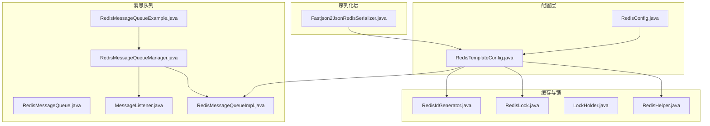
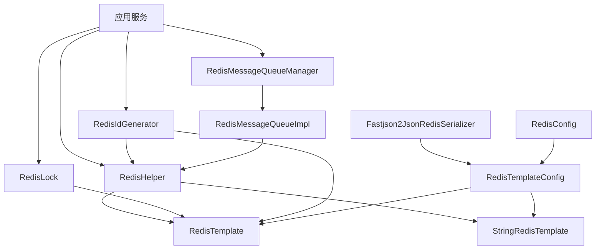
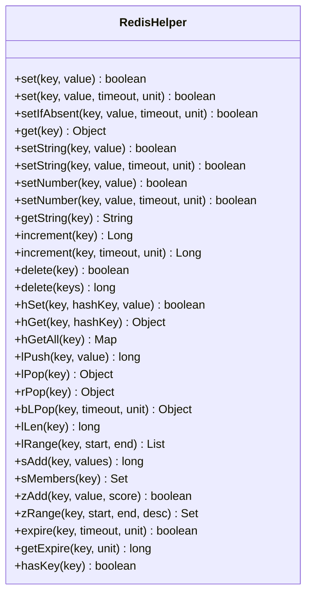
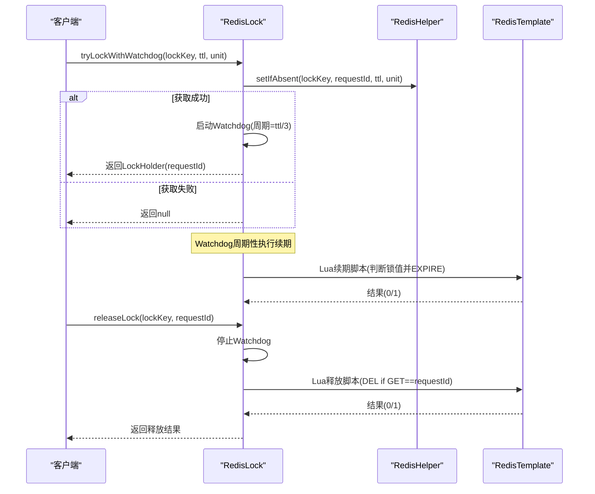
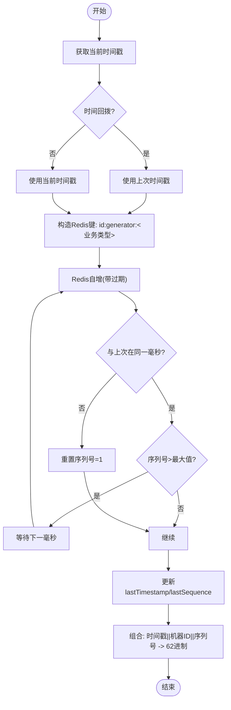
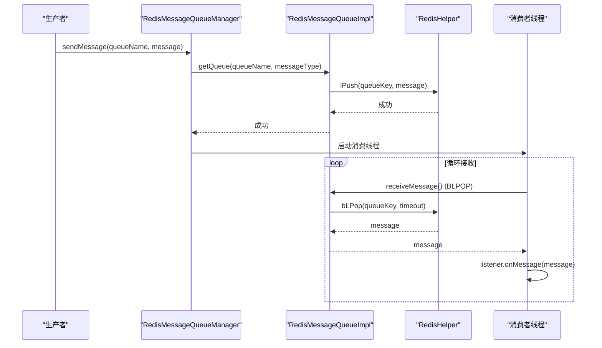
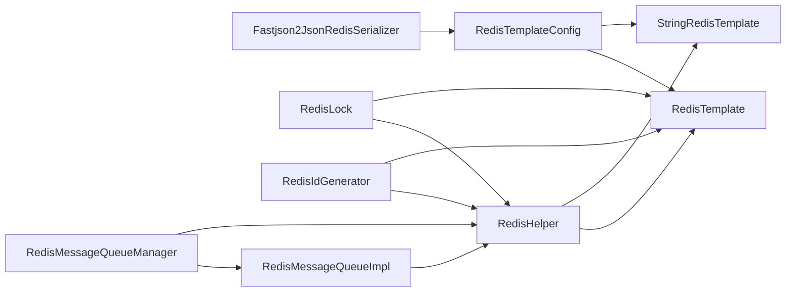

# Redis缓存模块（sh-redis）

<cite>
**本文引用的文件**
- [RedisHelper.java](file://sh-redis/src/main/java/com/wkclz/redis/helper/RedisHelper.java)
- [RedisLock.java](file://sh-redis/src/main/java/com/wkclz/redis/helper/RedisLock.java)
- [RedisIdGenerator.java](file://sh-redis/src/main/java/com/wkclz/redis/helper/RedisIdGenerator.java)
- [LockHolder.java](file://sh-redis/src/main/java/com/wkclz/redis/helper/LockHolder.java)
- [RedisMessageQueue.java](file://sh-redis/src/main/java/com/wkclz/redis/queue/RedisMessageQueue.java)
- [RedisMessageQueueImpl.java](file://sh-redis/src/main/java/com/wkclz/redis/queue/RedisMessageQueueImpl.java)
- [RedisMessageQueueManager.java](file://sh-redis/src/main/java/com/wkclz/redis/queue/RedisMessageQueueManager.java)
- [MessageListener.java](file://sh-redis/src/main/java/com/wkclz/redis/queue/MessageListener.java)
- [RedisMessageQueueExample.java](file://sh-redis/src/main/java/com/wkclz/redis/queue/RedisMessageQueueExample.java)
- [Fastjson2JsonRedisSerializer.java](file://sh-redis/src/main/java/com/wkclz/redis/serializer/Fastjson2JsonRedisSerializer.java)
- [RedisConfig.java](file://sh-redis/src/main/java/com/wkclz/redis/config/RedisConfig.java)
- [RedisTemplateConfig.java](file://sh-redis/src/main/java/com/wkclz/redis/config/RedisTemplateConfig.java)
</cite>

## 目录
1. [简介](#简介)
2. [项目结构](#项目结构)
3. [核心组件](#核心组件)
4. [架构总览](#架构总览)
5. [详细组件分析](#详细组件分析)
6. [依赖关系分析](#依赖关系分析)
7. [性能考量](#性能考量)
8. [故障排查指南](#故障排查指南)
9. [结论](#结论)
10. [附录](#附录)

## 简介
本文件为 Redis 缓存模块（sh-redis）的技术文档，覆盖以下能力：
- RedisHelper 全数据类型缓存操作封装：String、Hash、List、Set、ZSet 等
- RedisLock 分布式锁实现：基于 SETNX + 过期时间 + Lua 原子释放与续期（Watchdog），支持重试
- RedisIdGenerator 雪花算法风格 ID 生成器：时间戳 + 机器标识 + 序列号，考虑时间回拨，支持 62 进制缩短
- Redis 消息队列：生产者-消费者架构，阻塞/非阻塞接收，持久化与重试思路
- 连接与序列化：基于 Spring Data Redis 的模板配置，采用 Fastjson2 序列化器与 AutoType 白名单安全策略

## 项目结构
模块位于 sh-redis，主要目录与职责如下：
- config：Redis 连接与模板配置（连接工厂、RedisTemplate、StringRedisTemplate、序列化器）
- helper：缓存工具、分布式锁、ID 生成器
- queue：消息队列接口、实现、管理器与示例
- serializer：Fastjson2 序列化器与安全过滤

图表来源
- [RedisConfig.java:1-41](file://sh-redis/src/main/java/com/wkclz/redis/config/RedisConfig.java#L1-L41)
- [RedisTemplateConfig.java:1-61](file://sh-redis/src/main/java/com/wkclz/redis/config/RedisTemplateConfig.java#L1-L61)
- [Fastjson2JsonRedisSerializer.java:1-82](file://sh-redis/src/main/java/com/wkclz/redis/serializer/Fastjson2JsonRedisSerializer.java#L1-L82)
- [RedisHelper.java:1-513](file://sh-redis/src/main/java/com/wkclz/redis/helper/RedisHelper.java#L1-L513)
- [RedisLock.java:1-328](file://sh-redis/src/main/java/com/wkclz/redis/helper/RedisLock.java#L1-L328)
- [LockHolder.java:1-24](file://sh-redis/src/main/java/com/wkclz/redis/helper/LockHolder.java#L1-L24)
- [RedisIdGenerator.java:1-257](file://sh-redis/src/main/java/com/wkclz/redis/helper/RedisIdGenerator.java#L1-L257)
- [RedisMessageQueue.java:1-56](file://sh-redis/src/main/java/com/wkclz/redis/queue/RedisMessageQueue.java#L1-L56)
- [RedisMessageQueueImpl.java:1-121](file://sh-redis/src/main/java/com/wkclz/redis/queue/RedisMessageQueueImpl.java#L1-L121)
- [RedisMessageQueueManager.java:1-162](file://sh-redis/src/main/java/com/wkclz/redis/queue/RedisMessageQueueManager.java#L1-L162)
- [MessageListener.java:1-24](file://sh-redis/src/main/java/com/wkclz/redis/queue/MessageListener.java#L1-L24)
- [RedisMessageQueueExample.java:1-112](file://sh-redis/src/main/java/com/wkclz/redis/queue/RedisMessageQueueExample.java#L1-L112)

章节来源
- [RedisTemplateConfig.java:19-61](file://sh-redis/src/main/java/com/wkclz/redis/config/RedisTemplateConfig.java#L19-L61)
- [RedisConfig.java:12-41](file://sh-redis/src/main/java/com/wkclz/redis/config/RedisConfig.java#L12-L41)

## 核心组件
- RedisHelper：对 RedisTemplate/StringRedisTemplate 的统一封装，提供对象、字符串/数字、Hash、List、Set、ZSet、通用操作（过期、存在性、删除）等方法
- RedisLock：分布式锁实现，支持 tryLock、带 Watchdog 自动续期的 tryLockWithWatchdog、带重试的 tryLockWithRetry、原子释放（Lua）
- RedisIdGenerator：基于时间戳 + 机器标识 + 序列号的 ID 生成器，支持时间回拨处理与 62 进制编码
- RedisMessageQueue*：消息队列接口、实现与管理器，支持阻塞/非阻塞接收、线程池消费、订阅管理
- Fastjson2JsonRedisSerializer：基于 fastjson2 的序列化器，使用 AutoType 白名单过滤，防止反序列化注入风险

章节来源
- [RedisHelper.java:20-513](file://sh-redis/src/main/java/com/wkclz/redis/helper/RedisHelper.java#L20-L513)
- [RedisLock.java:23-328](file://sh-redis/src/main/java/com/wkclz/redis/helper/RedisLock.java#L23-L328)
- [RedisIdGenerator.java:26-257](file://sh-redis/src/main/java/com/wkclz/redis/helper/RedisIdGenerator.java#L26-L257)
- [RedisMessageQueue.java:10-56](file://sh-redis/src/main/java/com/wkclz/redis/queue/RedisMessageQueue.java#L10-L56)
- [RedisMessageQueueImpl.java:14-121](file://sh-redis/src/main/java/com/wkclz/redis/queue/RedisMessageQueueImpl.java#L14-L121)
- [RedisMessageQueueManager.java:21-162](file://sh-redis/src/main/java/com/wkclz/redis/queue/RedisMessageQueueManager.java#L21-L162)
- [Fastjson2JsonRedisSerializer.java:25-82](file://sh-redis/src/main/java/com/wkclz/redis/serializer/Fastjson2JsonRedisSerializer.java#L25-L82)

## 架构总览
整体架构围绕 Spring Data Redis 的模板与连接工厂展开，序列化层采用 Fastjson2 并结合白名单过滤提升安全性；上层业务通过 RedisHelper 提供统一缓存 API，RedisLock 提供分布式锁能力，RedisIdGenerator 提供高并发下唯一 ID，RedisMessageQueueManager 提供消息队列的订阅与消费。

图表来源
- [RedisTemplateConfig.java:31-61](file://sh-redis/src/main/java/com/wkclz/redis/config/RedisTemplateConfig.java#L31-L61)
- [Fastjson2JsonRedisSerializer.java:25-82](file://sh-redis/src/main/java/com/wkclz/redis/serializer/Fastjson2JsonRedisSerializer.java#L25-L82)
- [RedisHelper.java:22-26](file://sh-redis/src/main/java/com/wkclz/redis/helper/RedisHelper.java#L22-L26)
- [RedisLock.java:25-28](file://sh-redis/src/main/java/com/wkclz/redis/helper/RedisLock.java#L25-L28)
- [RedisIdGenerator.java:28-32](file://sh-redis/src/main/java/com/wkclz/redis/helper/RedisIdGenerator.java#L28-L32)
- [RedisMessageQueueManager.java:23-31](file://sh-redis/src/main/java/com/wkclz/redis/queue/RedisMessageQueueManager.java#L23-L31)

## 详细组件分析

### RedisHelper 全数据类型缓存操作
- 对象存储：set/get、setIfAbsent（原子 NX + EX）、delete、批量删除
- 字符串/数字：setString/setNumber、getString、自增（increment）、自增+过期（首次自增时设置过期）
- Hash：hSet/hGet/hGetAll
- List：lPush、lPop/rPop、bLPop（阻塞）、lLen、lRange
- Set：sAdd、sMembers
- ZSet：zAdd、zRange（支持升序/降序）
- 通用：expire、getExpire、hasKey

图表来源
- [RedisHelper.java:30-513](file://sh-redis/src/main/java/com/wkclz/redis/helper/RedisHelper.java#L30-L513)

章节来源
- [RedisHelper.java:20-513](file://sh-redis/src/main/java/com/wkclz/redis/helper/RedisHelper.java#L20-L513)

### RedisLock 分布式锁（Redlock 思想与 Watchdog）
- 设计要点
  - 锁键：固定前缀 + 资源名
  - 锁值：UUID，避免误删他人锁
  - 获取：使用 RedisHelper.setIfAbsent(key, requestId, ttl, unit) 实现 SETNX + EX
  - 释放：Lua 脚本判断锁值后删除，保证原子性
  - 续期：Watchdog 固定周期（锁时长的 1/3）调用 Lua 续期脚本
  - 重试：可选的多次尝试获取锁
- 关键流程

图表来源
- [RedisLock.java:166-216](file://sh-redis/src/main/java/com/wkclz/redis/helper/RedisLock.java#L166-L216)
- [RedisLock.java:225-262](file://sh-redis/src/main/java/com/wkclz/redis/helper/RedisLock.java#L225-L262)
- [RedisLock.java:100-117](file://sh-redis/src/main/java/com/wkclz/redis/helper/RedisLock.java#L100-L117)
- [RedisLock.java:139-156](file://sh-redis/src/main/java/com/wkclz/redis/helper/RedisLock.java#L139-L156)

章节来源
- [RedisLock.java:23-328](file://sh-redis/src/main/java/com/wkclz/redis/helper/RedisLock.java#L23-L328)
- [LockHolder.java:11-23](file://sh-redis/src/main/java/com/wkclz/redis/helper/LockHolder.java#L11-L23)

### RedisIdGenerator 雪花算法风格 ID 生成器
- 设计原则
  - 时间戳：自定义基准时间（2024-01-01）相对偏移
  - 机器标识：从本机 IP 推导，最多 64 台机器
  - 序列号：每毫秒最多 16384 个（14 位），通过 Redis 自增保证单调递增
  - 安全性：Redis 过期保护，避免跨秒冲突；时间回拨保护；Redis 不可用时降级为本地自增
  - 输出：62 进制编码，缩短 ID 长度
- 关键流程

图表来源
- [RedisIdGenerator.java:98-163](file://sh-redis/src/main/java/com/wkclz/redis/helper/RedisIdGenerator.java#L98-L163)
- [RedisIdGenerator.java:171-207](file://sh-redis/src/main/java/com/wkclz/redis/helper/RedisIdGenerator.java#L171-L207)

章节来源
- [RedisIdGenerator.java:26-257](file://sh-redis/src/main/java/com/wkclz/redis/helper/RedisIdGenerator.java#L26-L257)

### Redis 消息队列：生产者-消费者架构
- 接口与实现
  - RedisMessageQueue：定义发送、阻塞/非阻塞接收、消息计数、清空等
  - RedisMessageQueueImpl：基于 List 的入队（LPUSH）、出队（LPOP/BLPOP）、长度（LLEN）、清空（DEL）
- 管理器
  - RedisMessageQueueManager：统一管理队列实例、订阅监听器、启动消费线程（有界线程池 + CallerRunsPolicy）
  - MessageListener：业务监听器接口
- 示例
  - RedisMessageQueueExample：演示订阅两个队列并发送示例消息

图表来源
- [RedisMessageQueueManager.java:114-161](file://sh-redis/src/main/java/com/wkclz/redis/queue/RedisMessageQueueManager.java#L114-L161)
- [RedisMessageQueueImpl.java:50-99](file://sh-redis/src/main/java/com/wkclz/redis/queue/RedisMessageQueueImpl.java#L50-L99)
- [RedisMessageQueue.java:10-56](file://sh-redis/src/main/java/com/wkclz/redis/queue/RedisMessageQueue.java#L10-L56)

章节来源
- [RedisMessageQueue.java:10-56](file://sh-redis/src/main/java/com/wkclz/redis/queue/RedisMessageQueue.java#L10-L56)
- [RedisMessageQueueImpl.java:14-121](file://sh-redis/src/main/java/com/wkclz/redis/queue/RedisMessageQueueImpl.java#L14-L121)
- [RedisMessageQueueManager.java:21-162](file://sh-redis/src/main/java/com/wkclz/redis/queue/RedisMessageQueueManager.java#L21-L162)
- [MessageListener.java:9-24](file://sh-redis/src/main/java/com/wkclz/redis/queue/MessageListener.java#L9-L24)
- [RedisMessageQueueExample.java:13-112](file://sh-redis/src/main/java/com/wkclz/redis/queue/RedisMessageQueueExample.java#L13-L112)

### 连接配置与序列化策略
- RedisConfig：读取 host/port/password/database，以及可扩展的 AutoType 白名单
- RedisTemplateConfig：
  - RedisTemplate：key/hashKey 使用 String 序列化，value/hashValue 使用 Fastjson2JsonRedisSerializer（支持扩展白名单）
  - StringRedisTemplate：专门用于字符串/数字场景
- Fastjson2JsonRedisSerializer：
  - 默认白名单包含 com.wkclz. / java.util. / java.lang. / java.time.
  - 支持额外白名单扩展，通过 JSONReader.autoTypeFilter 限制反序列化类型，缓解 @type 注入风险

章节来源
- [RedisConfig.java:12-41](file://sh-redis/src/main/java/com/wkclz/redis/config/RedisConfig.java#L12-L41)
- [RedisTemplateConfig.java:19-61](file://sh-redis/src/main/java/com/wkclz/redis/config/RedisTemplateConfig.java#L19-L61)
- [Fastjson2JsonRedisSerializer.java:25-82](file://sh-redis/src/main/java/com/wkclz/redis/serializer/Fastjson2JsonRedisSerializer.java#L25-L82)

## 依赖关系分析
- 组件耦合
  - RedisHelper 依赖 RedisTemplate/StringRedisTemplate，提供统一缓存 API
  - RedisLock 依赖 RedisHelper 与 RedisTemplate，负责锁的获取、释放与续期
  - RedisIdGenerator 依赖 RedisHelper 与 RedisTemplate，负责 ID 生成与序列号维护
  - RedisMessageQueueImpl 依赖 RedisHelper，实现队列操作
  - RedisMessageQueueManager 依赖 RedisHelper 与线程池，负责队列与监听器管理
  - Fastjson2JsonRedisSerializer 作为序列化器被 RedisTemplateConfig 注入
- 外部依赖
  - Spring Data Redis（RedisTemplate、StringRedisTemplate、连接工厂）
  - fastjson2（JSON 序列化/反序列化）
  - Lombok（日志与数据类简化）

图表来源
- [RedisTemplateConfig.java:31-61](file://sh-redis/src/main/java/com/wkclz/redis/config/RedisTemplateConfig.java#L31-L61)
- [Fastjson2JsonRedisSerializer.java:25-82](file://sh-redis/src/main/java/com/wkclz/redis/serializer/Fastjson2JsonRedisSerializer.java#L25-L82)
- [RedisHelper.java:22-26](file://sh-redis/src/main/java/com/wkclz/redis/helper/RedisHelper.java#L22-L26)
- [RedisLock.java:25-28](file://sh-redis/src/main/java/com/wkclz/redis/helper/RedisLock.java#L25-L28)
- [RedisIdGenerator.java:28-32](file://sh-redis/src/main/java/com/wkclz/redis/helper/RedisIdGenerator.java#L28-L32)
- [RedisMessageQueueManager.java:23-31](file://sh-redis/src/main/java/com/wkclz/redis/queue/RedisMessageQueueManager.java#L23-L31)

章节来源
- [RedisTemplateConfig.java:19-61](file://sh-redis/src/main/java/com/wkclz/redis/config/RedisTemplateConfig.java#L19-L61)

## 性能考量
- RedisHelper
  - 使用 StringRedisTemplate 处理字符串/数字，减少序列化开销
  - 批量删除使用 RedisTemplate.delete(Set)，降低网络往返
- RedisLock
  - Watchdog 续期周期为锁时长的 1/3，平衡续期频率与 CPU 占用
  - Lua 原子释放与续期，避免竞态条件
- RedisIdGenerator
  - 每毫秒序列号上限 16384，满足高并发场景；Redis 过期键避免长期占用
  - 62 进制编码缩短 ID 长度，利于存储与传输
- RedisMessageQueueManager
  - 有界线程池 + CallerRunsPolicy，防止过载时拒绝任务；BLPOP 阻塞式接收，低 CPU 占用

## 故障排查指南
- RedisHelper
  - 常见异常：序列化失败、连接超时、命令执行异常。建议检查 Redis 连接配置与序列化器白名单
- RedisLock
  - 锁未续期：确认 Watchdog 线程存活与调度器状态；检查 Lua 脚本是否正确初始化
  - 误删锁：确保 requestId 一致；避免跨节点共享同一锁键
  - 获取失败重试：合理设置重试次数与间隔，避免热点竞争
- RedisIdGenerator
  - 时间回拨：系统时间倒退时会警告并回退到上次时间戳；建议使用 NTP 保持时间同步
  - Redis 不可用：触发本地降级策略，可能产生短暂重复（概率极低）
- RedisMessageQueueManager
  - 消费线程中断：检查线程池状态与监听器异常；确认 BLPOP 超时设置合理
  - 队列堆积：监控 getMessageCount，必要时扩容消费者线程池或拆分队列

章节来源
- [RedisHelper.java:37-45](file://sh-redis/src/main/java/com/wkclz/redis/helper/RedisHelper.java#L37-L45)
- [RedisLock.java:104-117](file://sh-redis/src/main/java/com/wkclz/redis/helper/RedisLock.java#L104-L117)
- [RedisIdGenerator.java:117-123](file://sh-redis/src/main/java/com/wkclz/redis/helper/RedisIdGenerator.java#L117-L123)
- [RedisMessageQueueManager.java:135-161](file://sh-redis/src/main/java/com/wkclz/redis/queue/RedisMessageQueueManager.java#L135-L161)

## 结论
本模块提供了 Redis 在缓存、分布式锁、ID 生成与消息队列方面的完整解决方案：统一的缓存 API、安全可靠的分布式锁、高并发下唯一且短小的 ID 生成、以及具备阻塞消费与线程池管理的消息队列。配合 Fastjson2 序列化器与 AutoType 白名单，兼顾性能与安全。

## 附录

### 使用示例与最佳实践
- 缓存使用示例
  - 对象缓存：通过 RedisHelper.set/get/setIfAbsent 实现缓存写入与原子设置
  - 字符串/数字：使用 setString/setNumber 与 increment 实现计数器
  - Hash/List/Set/ZSet：根据业务选择合适的数据结构，注意过期时间与空间控制
- 分布式锁应用场景
  - 幂等写入：下单、扣库存等关键操作加锁，避免重复执行
  - 资源独占：文件上传、报表生成等长时间任务加锁
  - Watchdog：耗时业务建议启用自动续期，避免锁过期导致并发问题
- 消息队列最佳实践
  - 生产者：按业务拆分队列，避免单队列过热
  - 消费者：合理设置线程池大小与队列容量，使用 BLPOP 降低 CPU 占用
  - 监听器：捕获异常并记录日志，避免影响其他消息处理
  - 重试：对幂等性不强的操作谨慎重试，必要时引入死信队列

章节来源
- [RedisMessageQueueExample.java:21-73](file://sh-redis/src/main/java/com/wkclz/redis/queue/RedisMessageQueueExample.java#L21-L73)
- [RedisMessageQueueManager.java:26-31](file://sh-redis/src/main/java/com/wkclz/redis/queue/RedisMessageQueueManager.java#L26-L31)