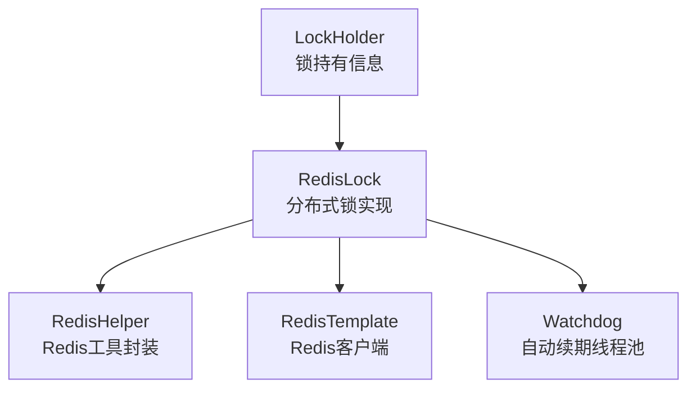
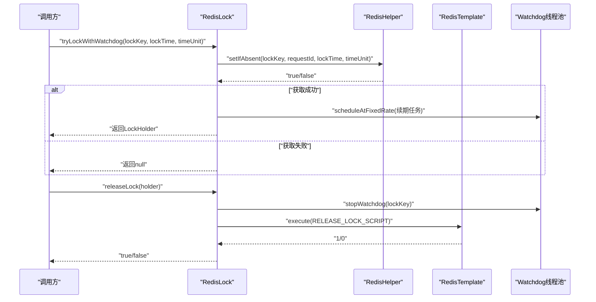
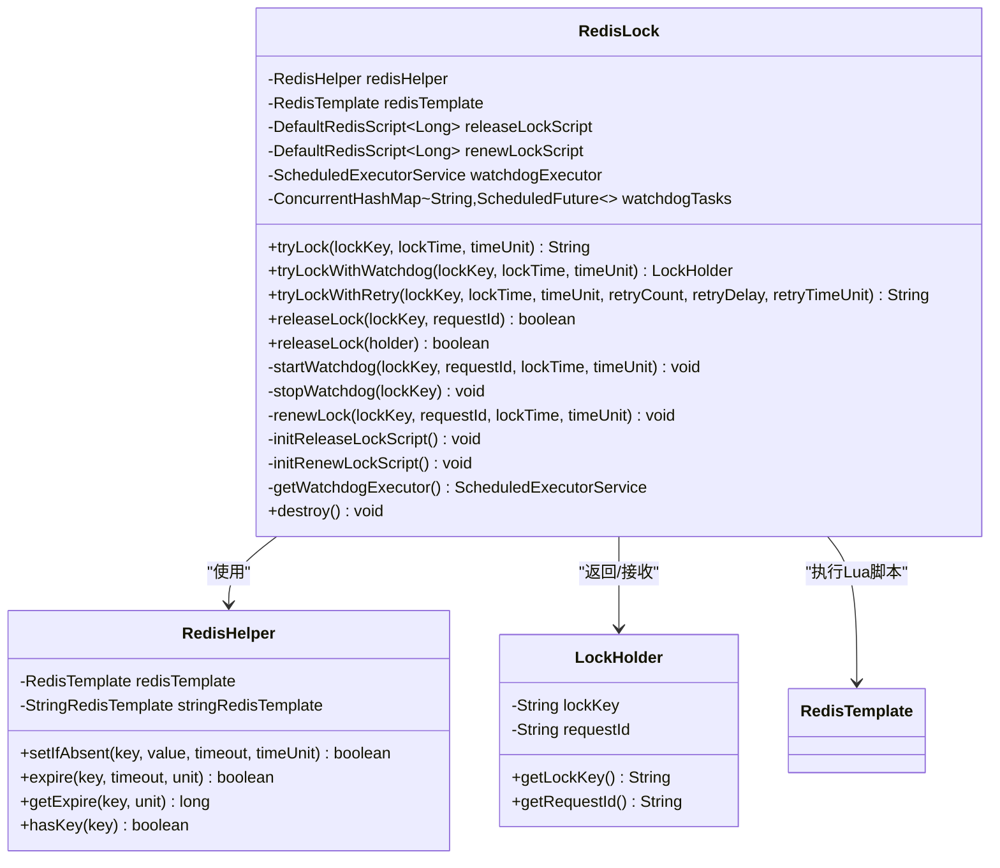
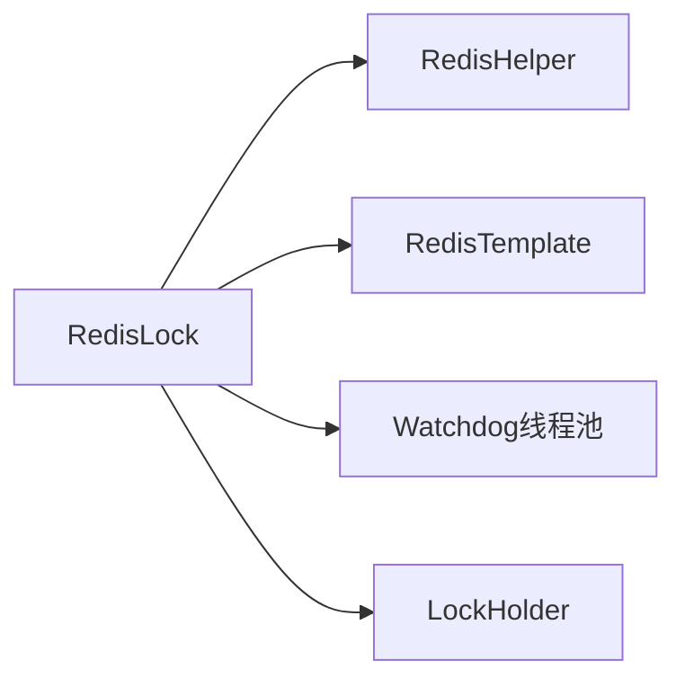

# 分布式锁实现

<cite>
**本文引用的文件**
- [RedisLock.java](file://sh-redis/src/main/java/com/wkclz/redis/helper/RedisLock.java)
- [LockHolder.java](file://sh-redis/src/main/java/com/wkclz/redis/helper/LockHolder.java)
- [RedisHelper.java](file://sh-redis/src/main/java/com/wkclz/redis/helper/RedisHelper.java)
- [application.yml](file://sh-demo/src/main/resources/config/application.yml)
</cite>

## 目录
1. [简介](#简介)
2. [项目结构](#项目结构)
3. [核心组件](#核心组件)
4. [架构总览](#架构总览)
5. [详细组件分析](#详细组件分析)
6. [依赖关系分析](#依赖关系分析)
7. [性能考量](#性能考量)
8. [故障排查指南](#故障排查指南)
9. [结论](#结论)
10. [附录](#附录)

## 简介
本文件面向Redis分布式锁功能的技术文档，重点围绕RedisLock类的实现进行深入解析，涵盖锁的获取、释放、自动续期（Watchdog）与超时处理机制；阐明LockHolder的作用与线程安全保障；解释分布式锁的实现原理（唯一性、死锁规避与故障恢复）；提供完整使用示例（简单锁、带超时锁、可重入锁思路），并给出高并发场景下的性能优化建议与最佳实践。

## 项目结构
Redis分布式锁位于sh-redis模块中，核心类包括：
- RedisLock：分布式锁主实现，支持Watchdog自动续期
- LockHolder：锁持有信息载体，封装lockKey与requestId
- RedisHelper：对RedisTemplate/StringRedisTemplate的统一封装，提供原子性setIfAbsent等能力

图表来源
- [RedisLock.java:1-328](file://sh-redis/src/main/java/com/wkclz/redis/helper/RedisLock.java#L1-L328)
- [RedisHelper.java:1-513](file://sh-redis/src/main/java/com/wkclz/redis/helper/RedisHelper.java#L1-L513)
- [LockHolder.java:1-24](file://sh-redis/src/main/java/com/wkclz/redis/helper/LockHolder.java#L1-L24)

章节来源
- [RedisLock.java:1-328](file://sh-redis/src/main/java/com/wkclz/redis/helper/RedisLock.java#L1-L328)
- [RedisHelper.java:1-513](file://sh-redis/src/main/java/com/wkclz/redis/helper/RedisHelper.java#L1-L513)
- [LockHolder.java:1-24](file://sh-redis/src/main/java/com/wkclz/redis/helper/LockHolder.java#L1-L24)

## 核心组件
- RedisLock
  - 提供tryLock、tryLockWithWatchdog、tryLockWithRetry等获取锁方法
  - 提供releaseLock两种重载：按lockKey/requestId或LockHolder释放
  - 内置Lua脚本RELEASE_LOCK_SCRIPT与RENEW_LOCK_SCRIPT，保证释放与续期的原子性
  - 采用单线程守护线程池作为Watchdog，周期性续期，续期间隔为锁时长的1/3
  - 通过ConcurrentHashMap维护活跃的Watchdog任务映射，避免重复任务
  - 实现DisposableBean，在销毁时取消所有Watchdog任务并关闭调度器
- LockHolder
  - 封装lockKey与requestId，便于以对象形式传递锁状态
  - 通过构造函数与Lombok生成的getter/setter访问字段
- RedisHelper
  - 提供setIfAbsent(key, value, timeout, timeUnit)等原子操作
  - 为RedisLock的锁获取与续期提供底层支撑

章节来源
- [RedisLock.java:18-328](file://sh-redis/src/main/java/com/wkclz/redis/helper/RedisLock.java#L18-L328)
- [LockHolder.java:6-24](file://sh-redis/src/main/java/com/wkclz/redis/helper/LockHolder.java#L6-L24)
- [RedisHelper.java:66-84](file://sh-redis/src/main/java/com/wkclz/redis/helper/RedisHelper.java#L66-L84)

## 架构总览
RedisLock通过RedisTemplate执行Lua脚本，结合Redis的原子性能力实现分布式锁。其关键流程如下：
- 获取锁：使用RedisHelper的setIfAbsent实现“SET NX EX”语义
- 释放锁：Lua脚本判断requestId一致性后删除键，保证原子性
- 续期：Watchdog线程池按固定频率调用续期脚本，延长TTL
- 超时：锁到期后自动失效，避免死锁

图表来源
- [RedisLock.java:195-216](file://sh-redis/src/main/java/com/wkclz/redis/helper/RedisLock.java#L195-L216)
- [RedisLock.java:256-262](file://sh-redis/src/main/java/com/wkclz/redis/helper/RedisLock.java#L256-L262)
- [RedisHelper.java:76-84](file://sh-redis/src/main/java/com/wkclz/redis/helper/RedisHelper.java#L76-L84)

## 详细组件分析

### RedisLock类分析
- 设计要点
  - 使用Redis的SET NX EX语义实现锁的唯一性：只有当key不存在时才能设置，并设置TTL
  - 通过requestId区分不同持有者，释放与续期均基于该标识，避免误删他人持有的锁
  - Lua脚本保证释放与续期的原子性，防止竞态条件
  - Watchdog采用单线程调度器，避免多线程竞争；续期间隔为锁时长的1/3，兼顾安全性与开销
  - 通过ConcurrentHashMap维护活跃任务，支持覆盖旧任务
- 方法族
  - tryLock：一次性获取锁，成功返回requestId
  - tryLockWithWatchdog：获取锁并启动Watchdog，成功返回LockHolder
  - tryLockWithRetry：带重试的获取锁，支持指定重试次数与间隔
  - releaseLock：释放锁，停止对应Watchdog任务
  - destroy：容器销毁时清理所有Watchdog任务与线程池
- 线程安全
  - watchdogExecutor为单线程调度器，天然避免并发续期冲突
  - watchdogTasks为ConcurrentHashMap，支持高并发下的任务注册与取消
  - 脚本执行由Redis完成，具备原子性，避免客户端层面的竞争

图表来源
- [RedisLock.java:18-328](file://sh-redis/src/main/java/com/wkclz/redis/helper/RedisLock.java#L18-L328)
- [LockHolder.java:6-24](file://sh-redis/src/main/java/com/wkclz/redis/helper/LockHolder.java#L6-L24)
- [RedisHelper.java:66-84](file://sh-redis/src/main/java/com/wkclz/redis/helper/RedisHelper.java#L66-L84)

章节来源
- [RedisLock.java:18-328](file://sh-redis/src/main/java/com/wkclz/redis/helper/RedisLock.java#L18-L328)
- [LockHolder.java:6-24](file://sh-redis/src/main/java/com/wkclz/redis/helper/LockHolder.java#L6-L24)
- [RedisHelper.java:66-84](file://sh-redis/src/main/java/com/wkclz/redis/helper/RedisHelper.java#L66-L84)

### LockHolder作用与线程安全
- 作用
  - 将lockKey与requestId封装为一个对象，便于跨方法传递与统一管理
  - 在需要释放锁时，直接传入LockHolder即可，避免遗漏requestId
- 线程安全
  - LockHolder仅包含两个不可变字段（由构造函数注入），在Java内存模型下是安全的
  - 与RedisLock内部的并发结构（ConcurrentHashMap、单线程调度器）配合，整体满足高并发场景需求

章节来源
- [LockHolder.java:6-24](file://sh-redis/src/main/java/com/wkclz/redis/helper/LockHolder.java#L6-L24)
- [RedisLock.java:100-117](file://sh-redis/src/main/java/com/wkclz/redis/helper/RedisLock.java#L100-L117)

### 分布式锁实现原理
- 唯一性保证
  - 通过Redis的SET NX EX实现：只有当key不存在时才写入，且设置TTL
  - 释放与续期均基于requestId校验，避免误删他人持有的锁
- 死锁避免
  - Watchdog定期续期，降低锁超时导致的死锁风险
  - 锁超时后自动失效，避免永久占用
- 故障恢复
  - Watchdog在续期失败时记录日志并停止任务，避免僵尸任务
  - 应用重启时，destroy方法会取消所有Watchdog任务，防止资源泄漏

章节来源
- [RedisLock.java:166-185](file://sh-redis/src/main/java/com/wkclz/redis/helper/RedisLock.java#L166-L185)
- [RedisLock.java:225-249](file://sh-redis/src/main/java/com/wkclz/redis/helper/RedisLock.java#L225-L249)
- [RedisLock.java:100-117](file://sh-redis/src/main/java/com/wkclz/redis/helper/RedisLock.java#L100-L117)
- [RedisHelper.java:76-84](file://sh-redis/src/main/java/com/wkclz/redis/helper/RedisHelper.java#L76-L84)

### 使用示例与最佳实践
- 简单锁
  - 获取锁：调用tryLock，成功后获得requestId
  - 释放锁：调用releaseLock，传入lockKey与requestId
- 带超时锁（推荐）
  - 获取锁：调用tryLockWithWatchdog，成功后获得LockHolder
  - 释放锁：调用releaseLock(holder)，内部会停止对应Watchdog任务
- 可重入锁
  - 当前实现不支持可重入；如需可重入，可在上层增加计数器与线程绑定策略（不在当前实现范围内）
- 生命周期管理
  - 在finally块中释放锁，避免异常路径导致的锁泄漏
  - Watchdog会在releaseLock或应用销毁时被停止
- 自动续期策略
  - 续期间隔为锁时长的1/3，建议根据业务耗时适当调整锁时长
- 异常处理
  - tryLockWithRetry支持重试，注意中断处理与日志记录
  - Watchdog异常会记录日志并停止任务，避免影响其他锁

章节来源
- [RedisLock.java:166-185](file://sh-redis/src/main/java/com/wkclz/redis/helper/RedisLock.java#L166-L185)
- [RedisLock.java:195-216](file://sh-redis/src/main/java/com/wkclz/redis/helper/RedisLock.java#L195-L216)
- [RedisLock.java:256-262](file://sh-redis/src/main/java/com/wkclz/redis/helper/RedisLock.java#L256-L262)
- [RedisLock.java:275-307](file://sh-redis/src/main/java/com/wkclz/redis/helper/RedisLock.java#L275-L307)

### 高并发场景下的性能考虑
- 续期频率与锁时长
  - 续期间隔为锁时长的1/3，建议根据业务平均耗时设置合理锁时长，避免频繁续期
- Watchdog线程模型
  - 单线程调度器避免了多线程竞争，但可能成为瓶颈；如并发量极大，可评估拆分锁粒度或引入限流
- Lua脚本原子性
  - 释放与续期均通过Lua脚本执行，减少网络往返与竞态风险
- 客户端连接池
  - 建议复用Redis连接池，避免频繁创建连接带来的开销

章节来源
- [RedisLock.java:100-117](file://sh-redis/src/main/java/com/wkclz/redis/helper/RedisLock.java#L100-L117)
- [RedisLock.java:139-156](file://sh-redis/src/main/java/com/wkclz/redis/helper/RedisLock.java#L139-L156)

### 与单机锁的区别与注意事项
- 区别
  - 单机锁基于JVM内存，分布式锁基于Redis，具备跨进程/跨节点的可见性
  - 分布式锁需要考虑网络抖动、Redis故障、时钟漂移等问题
- 注意事项
  - requestId必须全局唯一，避免同名服务实例间的误判
  - 锁时长应大于业务最大执行时间，同时避免过长导致资源占用
  - Watchdog异常不影响业务逻辑，但应监控日志，及时发现续期失败

章节来源
- [RedisLock.java:171-172](file://sh-redis/src/main/java/com/wkclz/redis/helper/RedisLock.java#L171-L172)
- [RedisLock.java:100-117](file://sh-redis/src/main/java/com/wkclz/redis/helper/RedisLock.java#L100-L117)

## 依赖关系分析
- RedisLock依赖RedisHelper提供的原子性操作
- RedisLock通过RedisTemplate执行Lua脚本
- LockHolder作为轻量级数据传输对象，与RedisLock交互

图表来源
- [RedisLock.java:18-328](file://sh-redis/src/main/java/com/wkclz/redis/helper/RedisLock.java#L18-L328)
- [RedisHelper.java:66-84](file://sh-redis/src/main/java/com/wkclz/redis/helper/RedisHelper.java#L66-L84)
- [LockHolder.java:6-24](file://sh-redis/src/main/java/com/wkclz/redis/helper/LockHolder.java#L6-L24)

章节来源
- [RedisLock.java:18-328](file://sh-redis/src/main/java/com/wkclz/redis/helper/RedisLock.java#L18-L328)
- [RedisHelper.java:66-84](file://sh-redis/src/main/java/com/wkclz/redis/helper/RedisHelper.java#L66-L84)
- [LockHolder.java:6-24](file://sh-redis/src/main/java/com/wkclz/redis/helper/LockHolder.java#L6-L24)

## 性能考量
- 续期成本
  - 续期频率与锁时长成反比，建议根据业务耗时设置合理时长
- 脚本执行
  - Lua脚本在Redis侧执行，减少网络往返，提升吞吐
- 并发控制
  - 单线程Watchdog简化了并发问题，但在极端高并发下可能成为瓶颈
- 连接与序列化
  - 建议使用连接池与合适的序列化策略，避免额外开销

## 故障排查指南
- 获取锁失败
  - 检查Redis可用性与网络延迟
  - 确认锁时长是否过短导致业务未完成即过期
- 续期失败
  - 查看Watchdog日志，确认是否因异常停止
  - 检查Redis是否正常，以及脚本执行权限
- 释放锁失败
  - 确认requestId是否正确传递
  - 检查Lua脚本执行结果与Redis返回值
- 应用退出
  - 确认destroy方法是否被调用，避免遗留Watchdog任务

章节来源
- [RedisLock.java:104-111](file://sh-redis/src/main/java/com/wkclz/redis/helper/RedisLock.java#L104-L111)
- [RedisLock.java:148-155](file://sh-redis/src/main/java/com/wkclz/redis/helper/RedisLock.java#L148-L155)
- [RedisLock.java:233-248](file://sh-redis/src/main/java/com/wkclz/redis/helper/RedisLock.java#L233-L248)
- [RedisLock.java:309-325](file://sh-redis/src/main/java/com/wkclz/redis/helper/RedisLock.java#L309-L325)

## 结论
RedisLock通过Redis原子性与Lua脚本，实现了可靠的分布式锁能力，并以Watchdog提供自动续期，有效降低了死锁风险。结合LockHolder的使用，能够简化锁的生命周期管理。在高并发场景下，建议合理设置锁时长与续期策略，并关注Watchdog线程模型与Redis性能表现，以获得更优的稳定性与吞吐。

## 附录
- 配置参考
  - Redis连接配置位于示例应用的配置文件中，可据此调整连接池大小、超时时间等参数
- 版本与兼容性
  - 本实现基于Spring Data Redis与Redis Lua脚本，确保原子性与一致性

章节来源
- [application.yml](file://sh-demo/src/main/resources/config/application.yml)