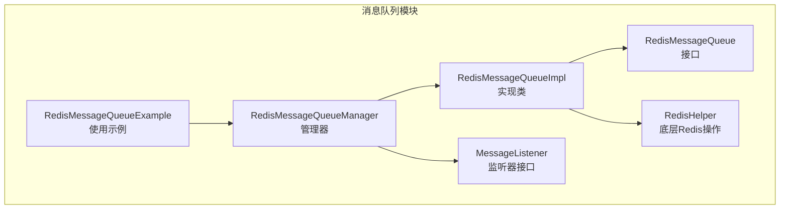
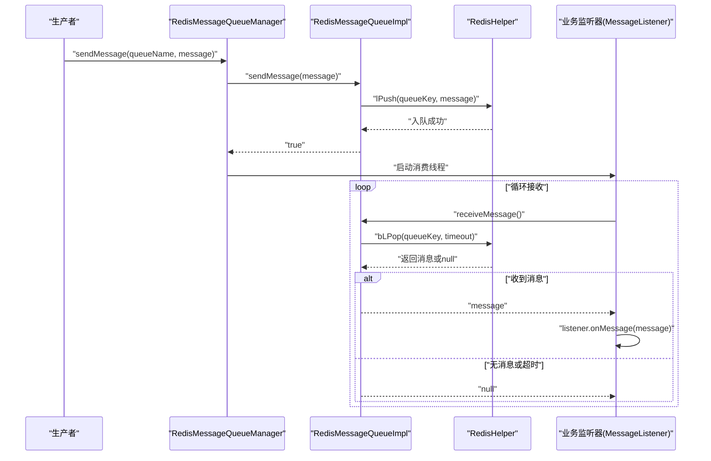
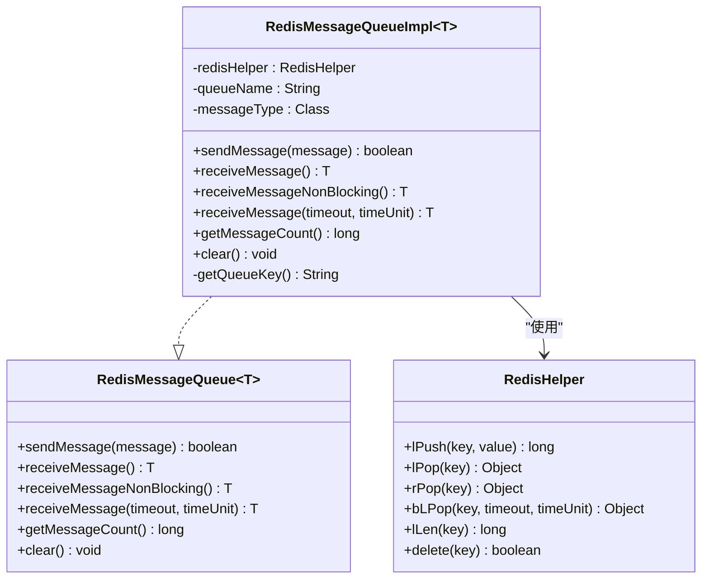
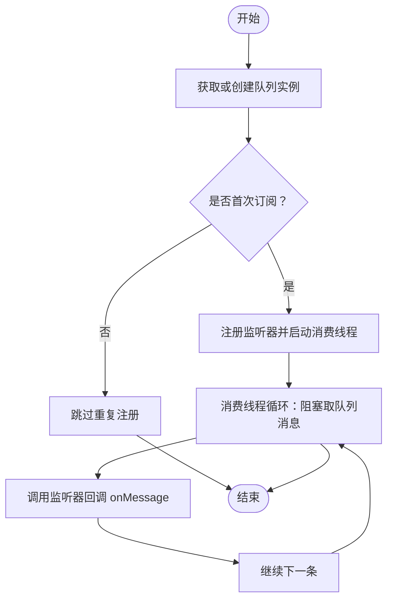
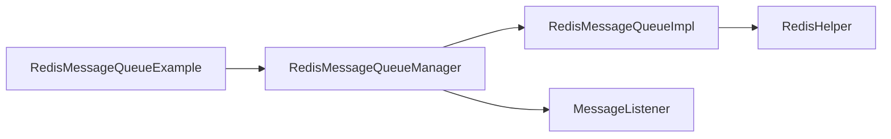

# 消息队列实现

<cite>
**本文引用的文件**
- [RedisMessageQueue.java](file://sh-redis/src/main/java/com/wkclz/redis/queue/RedisMessageQueue.java)
- [RedisMessageQueueImpl.java](file://sh-redis/src/main/java/com/wkclz/redis/queue/RedisMessageQueueImpl.java)
- [RedisMessageQueueManager.java](file://sh-redis/src/main/java/com/wkclz/redis/queue/RedisMessageQueueManager.java)
- [MessageListener.java](file://sh-redis/src/main/java/com/wkclz/redis/queue/MessageListener.java)
- [RedisMessageQueueExample.java](file://sh-redis/src/main/java/com/wkclz/redis/queue/RedisMessageQueueExample.java)
- [RedisHelper.java](file://sh-redis/src/main/java/com/wkclz/redis/helper/RedisHelper.java)
</cite>

## 目录
1. [简介](#简介)
2. [项目结构](#项目结构)
3. [核心组件](#核心组件)
4. [架构总览](#架构总览)
5. [详细组件分析](#详细组件分析)
6. [依赖分析](#依赖分析)
7. [性能考虑](#性能考虑)
8. [故障排查指南](#故障排查指南)
9. [结论](#结论)
10. [附录](#附录)

## 简介
本文件面向Redis消息队列功能的技术文档，围绕以下目标展开：  
- 深入解析RedisMessageQueue接口与RedisMessageQueueImpl实现类的设计架构  
- 详述生产者-消费者模式的实现，涵盖消息入队（LPUSH）、出队（RPOP/BLOP）与持久化机制  
- 阐明RedisMessageQueueManager的消息管理能力：队列配置、监控与维护  
- 解释MessageListener接口的消息监听机制与回调处理  
- 提供完整使用示例：简单消息收发、批量消息处理与错误重试策略  
- 说明阻塞式出队的超时处理与无消息行为  
- 给出微服务架构下的应用建议与性能优化要点  
- 对比传统消息中间件，明确适用场景

## 项目结构
Redis消息队列位于sh-redis模块的queue包下，核心文件如下：  
- 接口层：RedisMessageQueue  
- 实现层：RedisMessageQueueImpl  
- 管理层：RedisMessageQueueManager  
- 监听器接口：MessageListener  
- 示例：RedisMessageQueueExample  
- 底层Redis操作：RedisHelper（封装RedisTemplate对List的操作）

图表来源
- [RedisMessageQueueImpl.java:1-121](file://sh-redis/src/main/java/com/wkclz/redis/queue/RedisMessageQueueImpl.java#L1-L121)
- [RedisMessageQueue.java:1-56](file://sh-redis/src/main/java/com/wkclz/redis/queue/RedisMessageQueue.java#L1-L56)
- [RedisMessageQueueManager.java:1-162](file://sh-redis/src/main/java/com/wkclz/redis/queue/RedisMessageQueueManager.java#L1-L162)
- [MessageListener.java:1-24](file://sh-redis/src/main/java/com/wkclz/redis/queue/MessageListener.java#L1-L24)
- [RedisMessageQueueExample.java:1-112](file://sh-redis/src/main/java/com/wkclz/redis/queue/RedisMessageQueueExample.java#L1-L112)
- [RedisHelper.java:1-513](file://sh-redis/src/main/java/com/wkclz/redis/helper/RedisHelper.java#L1-L513)

章节来源
- [RedisMessageQueue.java:1-56](file://sh-redis/src/main/java/com/wkclz/redis/queue/RedisMessageQueue.java#L1-L56)
- [RedisMessageQueueImpl.java:1-121](file://sh-redis/src/main/java/com/wkclz/redis/queue/RedisMessageQueueImpl.java#L1-L121)
- [RedisMessageQueueManager.java:1-162](file://sh-redis/src/main/java/com/wkclz/redis/queue/RedisMessageQueueManager.java#L1-L162)
- [MessageListener.java:1-24](file://sh-redis/src/main/java/com/wkclz/redis/queue/MessageListener.java#L1-L24)
- [RedisMessageQueueExample.java:1-112](file://sh-redis/src/main/java/com/wkclz/redis/queue/RedisMessageQueueExample.java#L1-L112)
- [RedisHelper.java:1-513](file://sh-redis/src/main/java/com/wkclz/redis/helper/RedisHelper.java#L1-L513)

## 核心组件
- RedisMessageQueue接口：定义消息队列的标准能力，包括发送、阻塞/非阻塞接收、消息计数与清空等。  
- RedisMessageQueueImpl实现：基于Redis的List实现具体入队（LPUSH）、出队（LPOP/BLOP）、长度查询（LLEN）与清空（DEL）。  
- RedisMessageQueueManager：统一管理多个队列实例与监听器，提供订阅、取消订阅、发送消息与消费线程启动。  
- MessageListener：业务侧回调接口，定义onMessage与getMessageType。  
- RedisMessageQueueExample：演示如何订阅不同队列、发送消息与处理业务逻辑。  
- RedisHelper：封装RedisTemplate对List的LPUSH/LPOP/RPOP/BLOP/LLEN等操作。

章节来源
- [RedisMessageQueue.java:10-56](file://sh-redis/src/main/java/com/wkclz/redis/queue/RedisMessageQueue.java#L10-L56)
- [RedisMessageQueueImpl.java:14-121](file://sh-redis/src/main/java/com/wkclz/redis/queue/RedisMessageQueueImpl.java#L14-L121)
- [RedisMessageQueueManager.java:21-162](file://sh-redis/src/main/java/com/wkclz/redis/queue/RedisMessageQueueManager.java#L21-L162)
- [MessageListener.java:9-24](file://sh-redis/src/main/java/com/wkclz/redis/queue/MessageListener.java#L9-L24)
- [RedisMessageQueueExample.java:13-112](file://sh-redis/src/main/java/com/wkclz/redis/queue/RedisMessageQueueExample.java#L13-L112)
- [RedisHelper.java:298-367](file://sh-redis/src/main/java/com/wkclz/redis/helper/RedisHelper.java#L298-L367)

## 架构总览
整体采用“接口抽象 + 实现封装 + 管理编排 + 监听回调”的分层设计。  
- 生产者通过RedisMessageQueueManager发送消息至指定队列  
- 消费者通过subscribe注册监听器，由管理器启动消费线程持续阻塞取队列消息  
- RedisHelper负责与Redis交互，确保序列化/反序列化与命令执行的可靠性

图表来源
- [RedisMessageQueueManager.java:114-125](file://sh-redis/src/main/java/com/wkclz/redis/queue/RedisMessageQueueManager.java#L114-L125)
- [RedisMessageQueueImpl.java:50-99](file://sh-redis/src/main/java/com/wkclz/redis/queue/RedisMessageQueueImpl.java#L50-L99)
- [RedisHelper.java:345-352](file://sh-redis/src/main/java/com/wkclz/redis/helper/RedisHelper.java#L345-L352)
- [MessageListener.java:16](file://sh-redis/src/main/java/com/wkclz/redis/queue/MessageListener.java#L16)

## 详细组件分析

### RedisMessageQueue接口
- 能力清单：发送消息、阻塞接收、非阻塞接收、带超时阻塞接收、消息计数、清空队列  
- 设计要点：以泛型约束消息类型，保证序列化/反序列化一致性；对外暴露简洁API，便于上层组合使用

章节来源
- [RedisMessageQueue.java:10-56](file://sh-redis/src/main/java/com/wkclz/redis/queue/RedisMessageQueue.java#L10-L56)

### RedisMessageQueueImpl实现类
- 关键实现点：
  - 入队：LPUSH（lPush），将消息作为对象写入Redis List  
  - 出队：  
    - 非阻塞：LPOP（lPop）  
    - 阻塞：BLPOP（bLPop），支持超时  
  - 其他：LLEN（lLen）统计长度；DEL（delete）清空队列  
  - 类型转换：利用RedisTemplate的序列化/反序列化机制，返回目标类型实例  
  - 异常处理：捕获并记录异常，返回布尔或空值，避免影响调用方线程

图表来源
- [RedisMessageQueue.java:10-56](file://sh-redis/src/main/java/com/wkclz/redis/queue/RedisMessageQueue.java#L10-L56)
- [RedisMessageQueueImpl.java:14-121](file://sh-redis/src/main/java/com/wkclz/redis/queue/RedisMessageQueueImpl.java#L14-L121)
- [RedisHelper.java:298-367](file://sh-redis/src/main/java/com/wkclz/redis/helper/RedisHelper.java#L298-L367)

章节来源
- [RedisMessageQueueImpl.java:14-121](file://sh-redis/src/main/java/com/wkclz/redis/queue/RedisMessageQueueImpl.java#L14-L121)
- [RedisHelper.java:298-367](file://sh-redis/src/main/java/com/wkclz/redis/helper/RedisHelper.java#L298-L367)

### RedisMessageQueueManager管理器
- 功能职责：
  - 队列实例管理：按队列名与消息类型获取或创建队列实例，线程安全  
  - 订阅管理：注册监听器，防止重复订阅；启动消费线程  
  - 消息发送：根据消息类型推导或显式传入消息类型，委托队列发送  
  - 取消订阅：移除监听器映射  
  - 消费线程：基于有界线程池，采用CallerRunsPolicy处理饱和，保障稳定性  

图表来源
- [RedisMessageQueueManager.java:47-90](file://sh-redis/src/main/java/com/wkclz/redis/queue/RedisMessageQueueManager.java#L47-L90)
- [RedisMessageQueueManager.java:135-161](file://sh-redis/src/main/java/com/wkclz/redis/queue/RedisMessageQueueManager.java#L135-L161)

章节来源
- [RedisMessageQueueManager.java:21-162](file://sh-redis/src/main/java/com/wkclz/redis/queue/RedisMessageQueueManager.java#L21-L162)

### MessageListener监听器接口
- 能力：onMessage处理消息；getMessageType声明消息类型  
- 使用：业务侧实现该接口，注册到管理器后由框架自动触发

章节来源
- [MessageListener.java:9-24](file://sh-redis/src/main/java/com/wkclz/redis/queue/MessageListener.java#L9-L24)

### RedisMessageQueueExample使用示例
- 订阅多个队列（如订单、日志），分别实现监听器回调  
- 两种发送方式：通过管理器统一发送；或直接获取队列实例发送  
- 展示了业务处理函数（如processOrder/processLog）的调用位置

章节来源
- [RedisMessageQueueExample.java:13-112](file://sh-redis/src/main/java/com/wkclz/redis/queue/RedisMessageQueueExample.java#L13-L112)

### 阻塞式出队与超时处理
- 阻塞式接收：通过BLPOP实现，支持超时参数；超时返回null，避免永久阻塞  
- 无消息行为：返回null，消费线程可选择继续等待或退出（取决于业务策略）  
- 中断处理：当线程被中断时，正确记录日志并恢复中断状态

章节来源
- [RedisMessageQueueImpl.java:87-99](file://sh-redis/src/main/java/com/wkclz/redis/queue/RedisMessageQueueImpl.java#L87-L99)
- [RedisMessageQueueImpl.java:67-69](file://sh-redis/src/main/java/com/wkclz/redis/queue/RedisMessageQueueImpl.java#L67-L69)
- [RedisHelper.java:345-352](file://sh-redis/src/main/java/com/wkclz/redis/helper/RedisHelper.java#L345-L352)

### 持久化机制说明
- Redis本身具备持久化能力（RDB/AOF），但消息队列实现不直接干预持久化策略  
- 通过RedisTemplate的序列化机制，消息对象在入队时完成序列化，在出队时完成反序列化  
- 若需消息可靠性，可在业务层结合Redis持久化策略与幂等设计

章节来源
- [RedisMessageQueueImpl.java:56-63](file://sh-redis/src/main/java/com/wkclz/redis/queue/RedisMessageQueueImpl.java#L56-L63)
- [RedisHelper.java:298-305](file://sh-redis/src/main/java/com/wkclz/redis/helper/RedisHelper.java#L298-L305)

## 依赖分析
- RedisMessageQueueImpl依赖RedisHelper进行Redis命令操作  
- RedisMessageQueueManager依赖RedisMessageQueue与MessageListener，同时管理线程池与队列/监听器映射  
- RedisHelper依赖RedisTemplate/StringRedisTemplate，封装常用Redis操作

图表来源
- [RedisMessageQueueImpl.java:3,18-19](file://sh-redis/src/main/java/com/wkclz/redis/queue/RedisMessageQueueImpl.java#L3,L18-L19)
- [RedisMessageQueueManager.java:3,24](file://sh-redis/src/main/java/com/wkclz/redis/queue/RedisMessageQueueManager.java#L3,L24)
- [RedisMessageQueueExample.java:16](file://sh-redis/src/main/java/com/wkclz/redis/queue/RedisMessageQueueExample.java#L16)

章节来源
- [RedisMessageQueueImpl.java:3,18-19](file://sh-redis/src/main/java/com/wkclz/redis/queue/RedisMessageQueueImpl.java#L3,L18-L19)
- [RedisMessageQueueManager.java:3,24](file://sh-redis/src/main/java/com/wkclz/redis/queue/RedisMessageQueueManager.java#L3,L24)
- [RedisMessageQueueExample.java:16](file://sh-redis/src/main/java/com/wkclz/redis/queue/RedisMessageQueueExample.java#L16)

## 性能考虑
- 队列键命名：采用“queue:{name}”前缀，避免与业务键冲突  
- 线程池配置：有界队列+CallerRunsPolicy，防止突发流量导致内存压力  
- 序列化开销：对象序列化/反序列化带来CPU与网络成本，建议消息体尽量精简  
- 队列长度监控：通过lLen定期统计，结合业务阈值预警  
- 批量处理：若业务允许，可合并多次发送，减少网络往返  
- 超时策略：合理设置BLPOP超时，避免长时间阻塞导致资源占用

章节来源
- [RedisMessageQueueImpl.java:46-48](file://sh-redis/src/main/java/com/wkclz/redis/queue/RedisMessageQueueImpl.java#L46-L48)
- [RedisMessageQueueManager.java:26-31](file://sh-redis/src/main/java/com/wkclz/redis/queue/RedisMessageQueueManager.java#L26-L31)
- [RedisMessageQueueImpl.java:102-110](file://sh-redis/src/main/java/com/wkclz/redis/queue/RedisMessageQueueImpl.java#L102-L110)

## 故障排查指南
- 发送失败：检查Redis连接与可用性，确认序列化配置；查看日志中的异常堆栈  
- 接收阻塞：确认是否使用了BLPOP且设置了合理超时；检查线程是否被中断  
- 监听器异常：回调内部异常被捕获并记录，不影响消费线程继续运行  
- 队列积压：通过getMessageCount监控队列长度，必要时扩容消费者或优化处理逻辑  
- 重复订阅：subscribe会阻止重复订阅，避免重复消费；如需替换，请先unsubscribe再subscribe

章节来源
- [RedisMessageQueueImpl.java:60-63](file://sh-redis/src/main/java/com/wkclz/redis/queue/RedisMessageQueueImpl.java#L60-L63)
- [RedisMessageQueueImpl.java:95-98](file://sh-redis/src/main/java/com/wkclz/redis/queue/RedisMessageQueueImpl.java#L95-L98)
- [RedisMessageQueueManager.java:77-81](file://sh-redis/src/main/java/com/wkclz/redis/queue/RedisMessageQueueManager.java#L77-L81)
- [RedisMessageQueueManager.java:147-149](file://sh-redis/src/main/java/com/wkclz/redis/queue/RedisMessageQueueManager.java#L147-L149)

## 结论
该Redis消息队列实现以简洁接口与可靠实现为核心，结合管理器的订阅/消费模型，满足轻量级异步解耦需求。通过BLPOP与线程池策略，兼顾吞吐与稳定性；配合监控与限流，可在微服务中安全落地。对于强一致、事务、死信、延迟等高级特性，建议结合外部消息中间件或在业务层补充补偿机制。

## 附录

### 使用示例（步骤说明）
- 订阅队列：调用管理器的subscribe，传入队列名与监听器实现  
- 发送消息：通过管理器sendMessage或直接获取队列实例调用sendMessage  
- 处理消息：在onMessage中编写业务逻辑，注意异常捕获与幂等设计  
- 批量处理：在业务侧聚合消息后统一发送，降低网络开销  
- 错误重试：在onMessage中对可恢复异常进行重试，对不可恢复异常记录并上报

章节来源
- [RedisMessageQueueExample.java:21-73](file://sh-redis/src/main/java/com/wkclz/redis/queue/RedisMessageQueueExample.java#L21-L73)
- [MessageListener.java:16](file://sh-redis/src/main/java/com/wkclz/redis/queue/MessageListener.java#L16)

### 与传统消息中间件的对比与适用场景
- 优势：实现简单、零运维、与现有Redis生态无缝集成  
- 局限：不具备事务、死信、延迟、广播等高级特性  
- 适用场景：  
  - 微服务内异步通知、日志收集、轻量任务投递  
  - 缓存/队列一体化需求，无需额外MQ部署  
  - 对最终一致性的业务，且对高可用有Redis保障